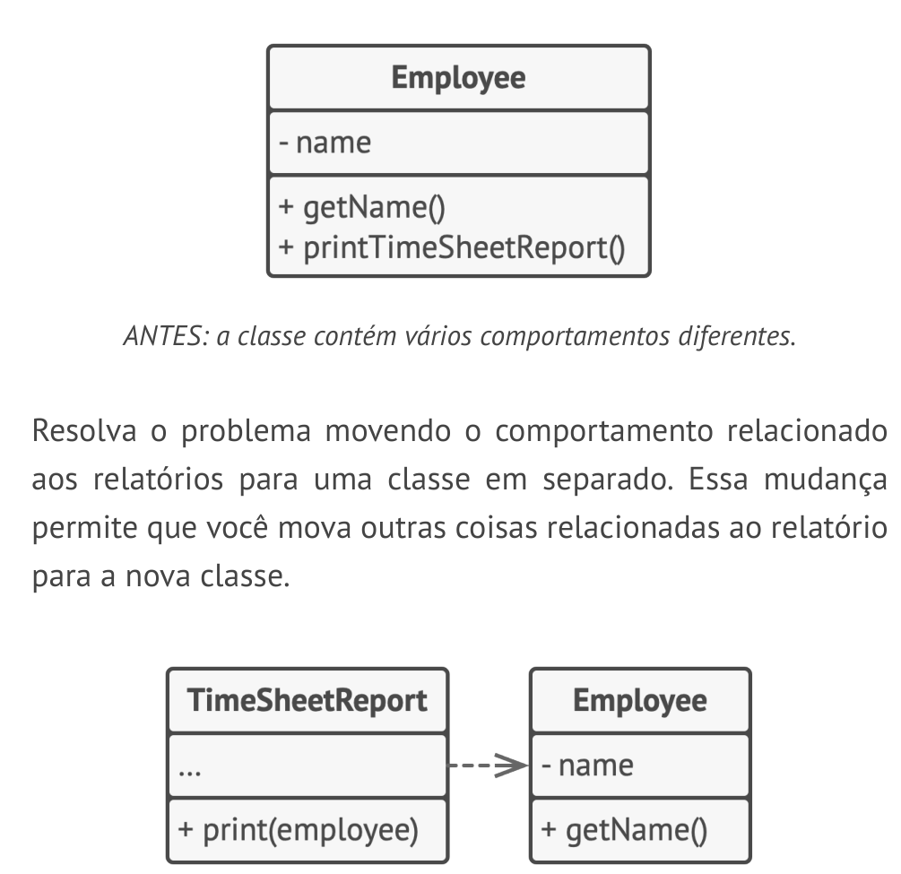
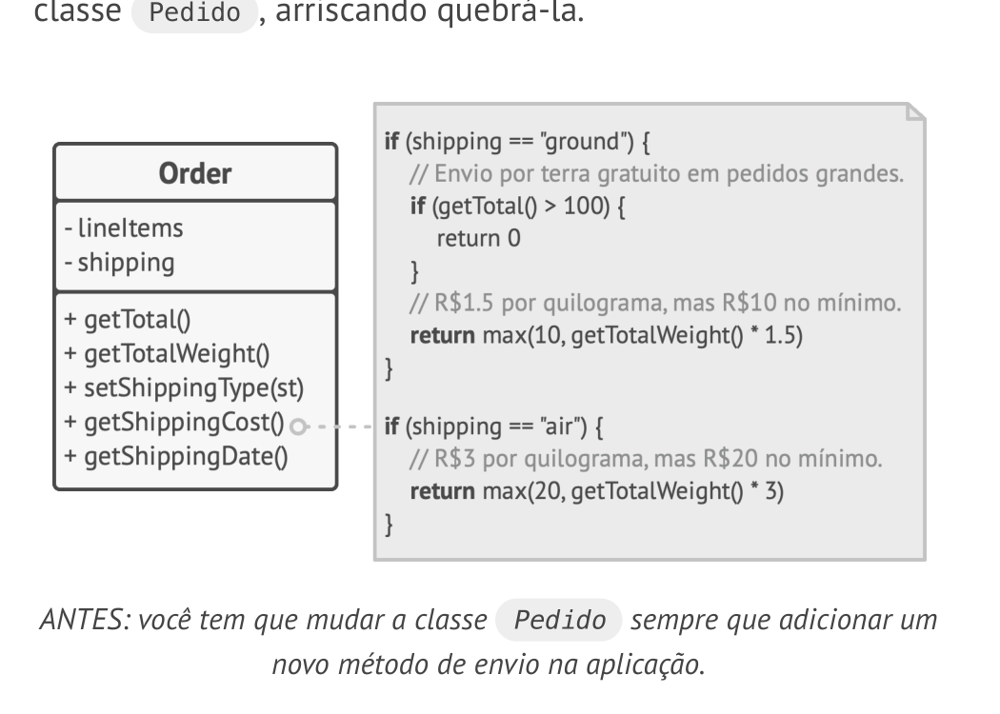
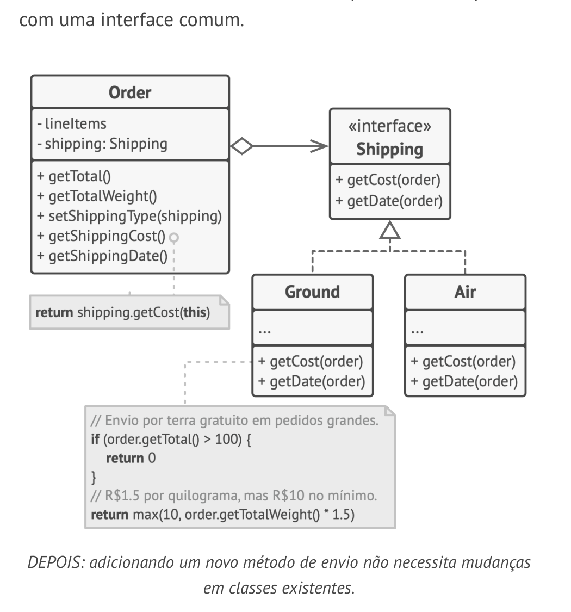
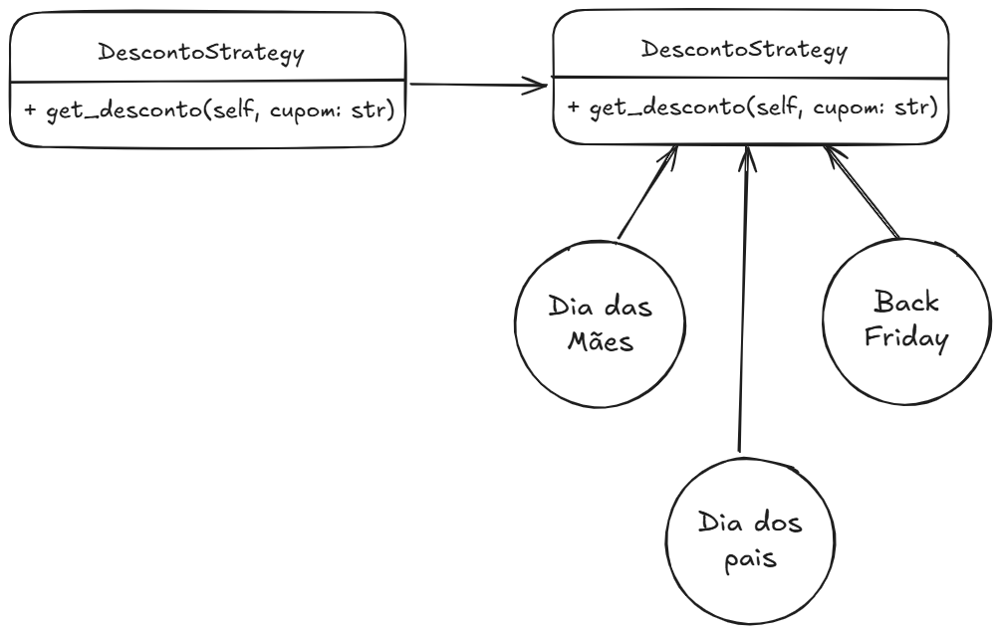
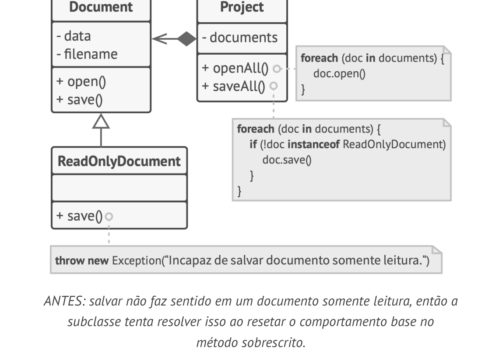
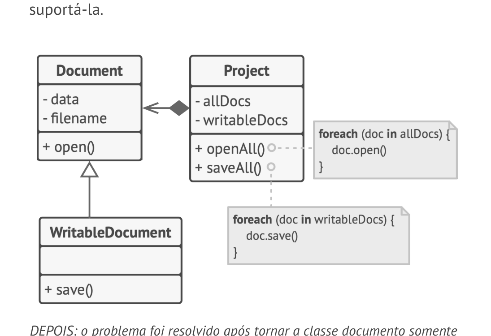
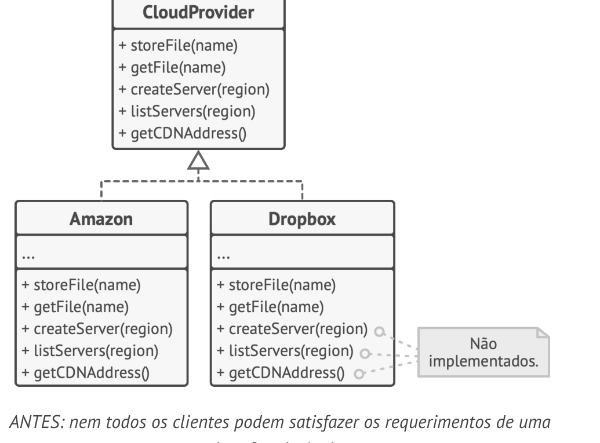
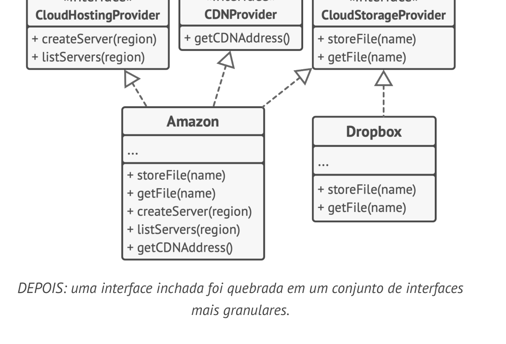
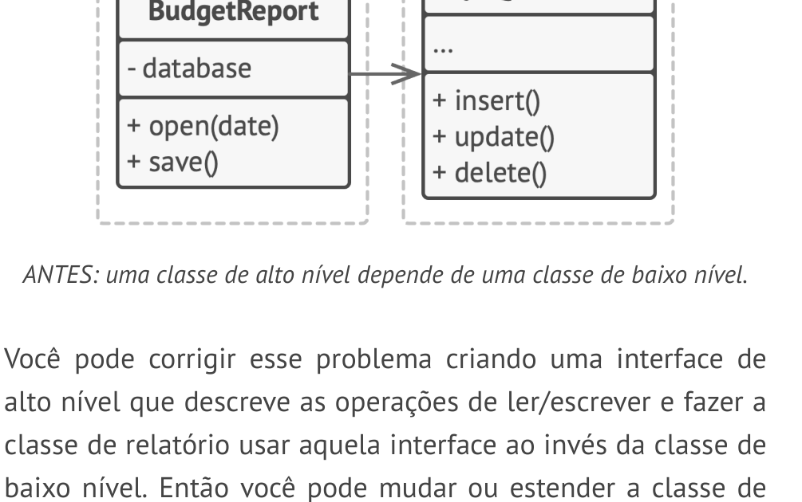
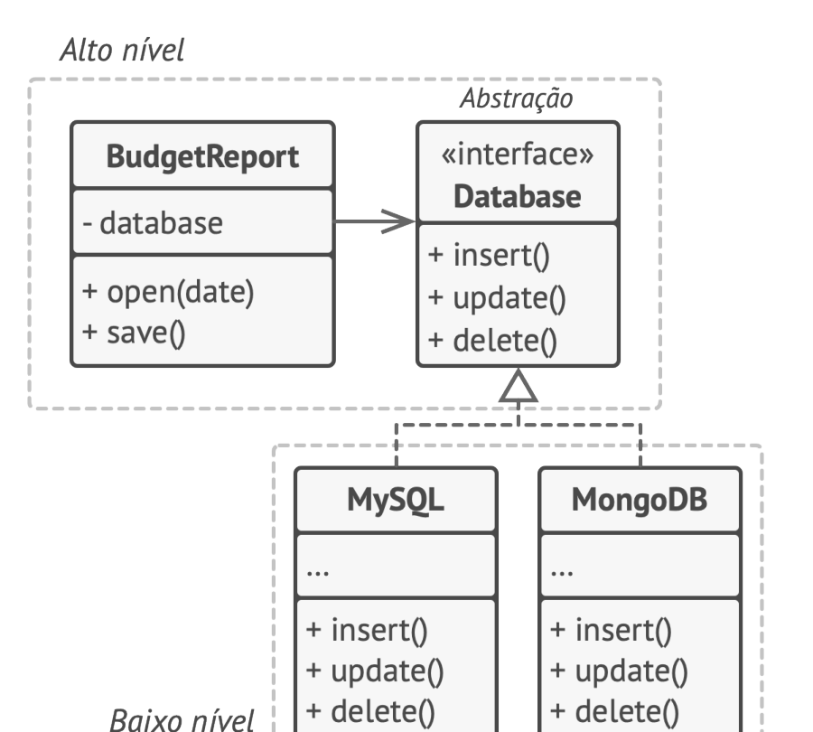

# SOLID em Python para Backend: Apostila Didática e Profissional

## Sobre esta apostila

Esta apostila foi criada para transformar um material de estudo sobre SOLID em um guia mais completo, didático e pronto para publicação no GitHub. O foco é ajudar quem desenvolve backend em Python a entender os cinco princípios SOLID não como frases decoradas, mas como ferramentas práticas para organizar código, reduzir acoplamento, aumentar a testabilidade e facilitar a evolução de sistemas reais.

O material usa como base principal o arquivo `SOLID.docx` e o livro `solid.pdf` enviados junto com esta apostila. A partir deles, o conteúdo foi reorganizado, expandido e complementado com exemplos práticos em Python, explicações em linguagem simples, seções de erros comuns, boas práticas, exercícios e desafios.

SOLID não é uma lei absoluta. É um conjunto de princípios de design orientado a objetos que ajuda a perceber sinais de código difícil de manter. Em alguns projetos, aplicar todos os princípios em todas as classes pode gerar complexidade desnecessária. Em outros, ignorar completamente esses princípios pode transformar o sistema em um bloco rígido, frágil e caro de alterar. O objetivo desta apostila é desenvolver senso crítico para saber quando aplicar, quando simplificar e quando evoluir o design aos poucos.

> Observação: revise a licença das imagens antes de publicar este material em um repositório público. Algumas imagens foram extraídas do material de referência enviado e podem ter origem em materiais de terceiros.

## Como estudar por esta apostila

Estude em ordem. Comece pelos fundamentos de orientação a objetos, coesão, acoplamento e abstrações. Depois avance pelos cinco princípios SOLID. Cada princípio depende de uma ideia anterior: o SRP ajuda a separar responsabilidades; o OCP mostra como evoluir comportamento sem alterar código estável; o LSP ensina a criar heranças seguras; o ISP evita contratos grandes demais; e o DIP fecha a lógica mostrando como depender de abstrações em vez de detalhes.

Sempre que encontrar um exemplo de código, leia primeiro o problema, tente prever por que o código é ruim e só depois veja a versão refatorada. Copie os exemplos para um projeto local, execute, altere valores, crie novas classes e quebre o código de propósito. SOLID fica muito mais claro quando você sente o impacto de uma alteração em cadeia.

Ao final de cada capítulo, use o resumo, os exercícios e as perguntas de fixação. Os exercícios são pensados para reforçar a leitura. Os desafios são um pouco mais abertos e simulam problemas reais de backend, como carrinho de compras, cupons, notificações, gateways de pagamento, repositórios e integrações externas.

## Índice

1. [Capítulo 1 - Fundamentos antes do SOLID](#capítulo-1---fundamentos-antes-do-solid)
2. [Capítulo 2 - S: Single Responsibility Principle](#capítulo-2---s-single-responsibility-principle)
3. [Capítulo 3 - O: Open/Closed Principle](#capítulo-3---o-openclosed-principle)
4. [Capítulo 4 - L: Liskov Substitution Principle](#capítulo-4---l-liskov-substitution-principle)
5. [Capítulo 5 - I: Interface Segregation Principle](#capítulo-5---i-interface-segregation-principle)
6. [Capítulo 6 - D: Dependency Inversion Principle](#capítulo-6---d-dependency-inversion-principle)
7. [Capítulo 7 - Como os princípios trabalham juntos em uma API backend](#capítulo-7---como-os-princípios-trabalham-juntos-em-uma-api-backend)
8. [Capítulo 8 - Refatoração, testes e evolução incremental](#capítulo-8---refatoração-testes-e-evolução-incremental)
9. [Checklist profissional de SOLID](#checklist-profissional-de-solid)
10. [Cheat Sheet](#cheat-sheet)
11. [Glossário essencial](#glossário-essencial)
12. [Projeto prático final](#projeto-prático-final)
13. [Referências bibliográficas](#referências-bibliográficas)

# Capítulo 1 - Fundamentos antes do SOLID

SOLID é muito mais fácil quando você entende três ideias antes: responsabilidade, acoplamento e abstração. Sem essas bases, os princípios viram frases bonitas, mas difíceis de aplicar no código real.

Ao final deste capítulo, você será capaz de:

- entender por que SOLID existe;
- diferenciar coesão de acoplamento;
- identificar responsabilidades em classes e módulos;
- entender o papel de interfaces, classes abstratas e protocolos em Python;
- reconhecer quando uma estrutura simples é melhor do que uma arquitetura complexa.

## 1.1 - O problema

Em projetos pequenos, quase qualquer organização parece funcionar. Um arquivo com algumas funções, uma classe com vários métodos e alguns `if` espalhados ainda são fáceis de entender. O problema aparece quando o sistema cresce.

Imagine uma API de e-commerce que começou com poucos casos de uso: cadastrar produtos, adicionar itens ao carrinho e finalizar compra. Com o tempo entram descontos, cupons, cálculo de frete, gateways de pagamento, emissão de nota fiscal, envio de e-mail, estoque, antifraude, logs, métricas, auditoria e filas assíncronas. Se tudo isso cair nas mesmas classes, cada mudança simples começa a exigir cuidado demais.

Um bug no envio de e-mail pode quebrar a finalização do pedido. Uma mudança em cálculo de desconto pode afetar o carrinho. Trocar o gateway de pagamento pode exigir alteração na regra de negócio. Esse tipo de código fica caro porque o desenvolvedor não consegue mexer em uma parte sem medo de danificar outra.

## 1.2 - O que é SOLID?

SOLID é um acrônimo formado por cinco princípios de design orientado a objetos:

- **S - Single Responsibility Principle**: uma classe deve ter apenas uma razão para mudar.
- **O - Open/Closed Principle**: entidades de software devem estar abertas para extensão e fechadas para modificação.
- **L - Liskov Substitution Principle**: subclasses devem poder substituir suas classes base sem quebrar o comportamento esperado.
- **I - Interface Segregation Principle**: clientes não devem depender de métodos que não usam.
- **D - Dependency Inversion Principle**: módulos de alto nível não devem depender de módulos de baixo nível; ambos devem depender de abstrações.

O objetivo é criar código mais compreensível, flexível e sustentável. Na prática, SOLID ajuda a responder perguntas como: esta classe sabe demais? Esta regra está acoplada ao banco? Este `if` vai crescer sem controle? Esta interface obriga classes a fingirem que sabem fazer coisas que não fazem? Esta herança representa comportamento real ou apenas uma classificação conceitual?

## 1.3 - Coesão e acoplamento

**Coesão** mede o quanto os elementos de uma unidade de código pertencem ao mesmo assunto. Uma classe `Carrinho` que adiciona produtos, remove produtos e calcula subtotal tem boa coesão. Uma classe `Carrinho` que também envia e-mail, salva no banco, processa pagamento e gera nota fiscal tem baixa coesão.

**Acoplamento** mede o quanto uma parte do sistema depende de outra. Algum acoplamento sempre existe. Uma classe precisa chamar outra classe, uma API precisa usar banco de dados, um caso de uso precisa chamar serviços. O problema é o acoplamento rígido, quando uma mudança em um detalhe técnico força mudanças em regras de negócio.

Um bom design costuma buscar alta coesão e baixo acoplamento. Isso não significa criar muitas camadas sem necessidade. Significa organizar o código para que cada parte tenha uma função clara e dependa do mínimo necessário.

## 1.4 - Como isso aparece em backend?

Em uma aplicação backend, é comum separar o código por responsabilidades:

```text
app/
├── domain/
│   ├── entities/
│   │   ├── product.py
│   │   ├── cart.py
│   │   └── order.py
│   ├── services/
│   │   ├── coupon_policy.py
│   │   └── shipping_policy.py
│   └── interfaces/
│       ├── order_repository.py
│       └── payment_gateway.py
├── application/
│   └── use_cases/
│       ├── apply_coupon.py
│       └── checkout_order.py
├── infrastructure/
│   ├── repositories/
│   │   └── sqlalchemy_order_repository.py
│   └── gateways/
│       └── stripe_payment_gateway.py
└── main.py
```

Essa estrutura não é obrigatória, mas ajuda a visualizar uma ideia importante: regras de negócio não deveriam depender diretamente de detalhes como SQLAlchemy, API externa, framework web ou serviço de e-mail. A regra de negócio deve ser o centro do sistema. Os detalhes técnicos devem se adaptar a ela.

## 1.5 - Python, interfaces e abstrações

Python não possui interfaces formais como Java ou C#, mas oferece várias formas de representar contratos:

1. **Classes abstratas com `abc.ABC`**: úteis quando você quer obrigar subclasses a implementarem certos métodos.
2. **Protocolos com `typing.Protocol`**: úteis quando você quer tipagem estrutural, isto é, aceitar qualquer objeto que tenha os métodos esperados.
3. **Duck typing simples**: útil em códigos menores, quando a clareza do comportamento é suficiente e uma abstração formal seria excesso.

Exemplo com classe abstrata:

```python
from abc import ABC, abstractmethod


class PaymentGateway(ABC):
    @abstractmethod
    def charge(self, amount: float) -> str:
        pass


class FakePaymentGateway(PaymentGateway):
    def charge(self, amount: float) -> str:
        return f"Pagamento fake aprovado: R$ {amount:.2f}"
```

A classe `PaymentGateway` define um contrato: qualquer gateway de pagamento precisa ter um método `charge`. A classe `FakePaymentGateway` implementa esse contrato. Esse tipo de abstração será importante principalmente no DIP.

Exemplo com `Protocol`:

```python
from typing import Protocol


class Notifier(Protocol):
    def send(self, message: str) -> None:
        ...


class EmailNotifier:
    def send(self, message: str) -> None:
        print(f"Enviando e-mail: {message}")


def notify_customer(notifier: Notifier, message: str) -> None:
    notifier.send(message)
```

Aqui `EmailNotifier` não precisa herdar explicitamente de `Notifier`. Se ela possui o método `send` com assinatura compatível, ela pode ser usada onde um `Notifier` é esperado por ferramentas de type checking. Isso combina bem com o estilo flexível do Python.

## 1.6 - PEP 8, tipagem e legibilidade

SOLID não substitui boas práticas básicas. Um código com classes bem separadas, mas nomes ruins e funções confusas, continua difícil de manter. Em Python, alguns hábitos simples ajudam bastante:

- usar nomes claros, como `calculate_subtotal` em vez de `calc`;
- manter imports organizados;
- usar type hints para comunicar entrada e saída;
- evitar métodos gigantes;
- escrever testes para regras importantes;
- preferir composição quando herança não representa comportamento real;
- evitar abstrações criadas antes de existir uma variação concreta.

Um exemplo simples:

```python
from dataclasses import dataclass


@dataclass(frozen=True)
class Product:
    sku: str
    name: str
    price: float
    stock_quantity: int

    def is_available(self) -> bool:
        return self.stock_quantity > 0
```

O código é pequeno, mas já comunica bem o modelo. `Product` representa um produto. O método `is_available` verifica disponibilidade. A classe não envia e-mail, não salva no banco e não calcula frete. Isso é uma base saudável para aplicar SRP.

## 1.7 - Quando não exagerar

O erro mais comum ao estudar SOLID é tentar aplicar todos os princípios em qualquer pedaço de código. Isso pode gerar overengineering: muitas interfaces, muitas fábricas, muitas classes pequenas e um fluxo difícil de seguir.

Uma regra prática: **não crie abstrações apenas porque talvez um dia você precise**. Crie abstrações quando existe uma variação real, uma dependência difícil de testar, uma regra que muda com frequência ou uma classe que já começou a acumular responsabilidades.

Em código de produção, SOLID deve ajudar a simplificar manutenção, não transformar uma função simples em uma arquitetura enorme.

## 1.8 - Resumo do capítulo

SOLID serve para melhorar a organização de código orientado a objetos, especialmente em sistemas que crescem e mudam com frequência. Antes de aplicar os princípios, é essencial entender coesão, acoplamento e abstração. Em Python, contratos podem ser expressos com `abc.ABC`, `typing.Protocol` ou duck typing, dependendo do nível de formalidade necessário.

## 1.9 - Exercícios

1. Pegue uma classe de um projeto seu e liste todas as responsabilidades dela.
2. Identifique uma dependência concreta que poderia ser substituída por uma abstração.
3. Reescreva uma função com nomes mais descritivos e type hints.
4. Crie uma classe abstrata simples chamada `NotificationSender` com um método `send`.

## 1.10 - Desafios

1. Modele uma estrutura de pastas para uma API de pedidos com domínio, casos de uso e infraestrutura.
2. Crie duas implementações de `NotificationSender`: `EmailSender` e `SmsSender`.
3. Escreva um teste usando um `FakeNotificationSender` para verificar se uma mensagem foi enviada.

## 1.11 - Fixando o conhecimento

1. O que é coesão?
2. O que é acoplamento?
3. Qual a diferença entre `ABC` e `Protocol` em Python?
4. Por que SOLID não deve ser aplicado como dogma?

# Capítulo 2 - S: Single Responsibility Principle

O **Princípio da Responsabilidade Única**, ou SRP, diz que uma classe deve ter apenas uma razão para mudar. Essa é uma das frases mais conhecidas do SOLID, mas também uma das mais mal interpretadas.

Ao final deste capítulo, você será capaz de:

- entender o que significa uma razão para mudar;
- identificar classes com responsabilidades demais;
- refatorar uma classe grande em componentes menores;
- aplicar SRP em entidades, serviços e casos de uso backend;
- reconhecer quando separar demais também prejudica o código.

## 2.1 - O problema

O problema que o SRP resolve é a mistura de responsabilidades. Uma classe começa pequena e, com o tempo, vira o lugar mais fácil para colocar novas regras. Isso acontece muito com classes chamadas `Service`, `Manager`, `Handler`, `Controller` ou `Helper`.

Imagine uma classe `Carrinho` que faz tudo:

```python
class Carrinho:
    def __init__(self):
        self.items = []
        self.total = 0

    def adicionar(self, produto):
        self.items.append(produto)
        self.total += produto.preco

        if produto.tipo == "perecivel":
            print("Adicionar embalagem especial")
        elif produto.tipo == "digital":
            print("Gerar link de download")
        else:
            print("Produto adicionado ao carrinho")

    def calcular_desconto(self, cupom):
        if cupom == "BLACKFRIDAY":
            self.total *= 0.5
        elif cupom == "NATAL":
            self.total *= 0.9
        else:
            print("Cupom inválido")

    def finalizar_compra(self):
        print(f"Total a pagar: R$ {self.total}")
        self.salvar_database()
        print("E-mail enviado com confirmação!")

    def salvar_database(self):
        database.append(self.items)

    def send_sms(self, mensagem):
        print(mensagem)
```

Esse código parece prático no início. Tudo está no mesmo lugar. Mas a classe tem vários motivos para mudar: regras do carrinho, cálculo de desconto, persistência, envio de e-mail, envio de SMS e regras de produto. Cada mudança em uma dessas áreas exige alterar a mesma classe.

## 2.2 - O que é SRP?

SRP significa que uma classe, módulo ou função deve ter uma responsabilidade principal bem definida. A frase clássica é: **uma classe deve ter apenas uma razão para mudar**.

Atenção: isso não significa que a classe deve ter apenas um método. Uma classe pode ter vários métodos, desde que todos façam parte da mesma responsabilidade. Um `Carrinho` pode adicionar produto, remover produto, listar produtos e calcular subtotal. Todos esses comportamentos pertencem à gestão do carrinho.

O problema começa quando a classe também salva no banco, envia notificação, aplica cupom, calcula frete e conversa com gateway externo. Essas são responsabilidades diferentes e mudam por motivos diferentes.



A imagem acima mostra uma violação comum do SRP: uma classe `Employee` guarda dados do empregado e também imprime relatório de folha de ponto. O comportamento de relatório muda por motivos diferentes dos dados do empregado. A correção separa `TimeSheetReport` em outra classe, deixando cada classe com uma responsabilidade mais clara.

## 2.3 - Como funciona na prática?

Na prática, aplicar SRP significa perguntar: **por qual motivo este código mudaria?**

A classe `Carrinho` pode mudar porque a regra de adicionar produto mudou. O serviço de cupom pode mudar porque uma promoção nova foi criada. O repositório pode mudar porque o banco de dados foi alterado. O notificador pode mudar porque o envio deixou de ser por e-mail e passou a ser por fila.

Quando esses motivos estão separados, cada mudança fica localizada. Isso melhora leitura, testes e segurança de alteração.

## 2.4 - Exemplo simples refatorado

Vamos começar com entidades simples.

```python
from dataclasses import dataclass
from enum import Enum, auto
from uuid import UUID, uuid4


@dataclass(frozen=True)
class Produto:
    sku: str
    nome: str
    preco: float
    quantidade: int

    def esta_disponivel(self) -> bool:
        return self.quantidade > 0


class CarrinhoStatus(Enum):
    ATIVO = auto()
    FINALIZADO = auto()
    EXPIRADO = auto()


class Carrinho:
    def __init__(self, produtos: list[Produto] | None = None, carrinho_id: UUID | None = None):
        self._id = carrinho_id or uuid4()
        self._produtos = produtos or []
        self._status = CarrinhoStatus.ATIVO

    @property
    def id(self) -> UUID:
        return self._id

    @property
    def status(self) -> CarrinhoStatus:
        return self._status

    def adicionar_produto(self, produto: Produto) -> None:
        if not produto.esta_disponivel():
            raise ValueError("Produto indisponível")
        self._produtos.append(produto)

    def remover_produto(self, sku: str) -> None:
        self._produtos = [produto for produto in self._produtos if produto.sku != sku]

    def calcular_subtotal(self) -> float:
        return sum(produto.preco for produto in self._produtos)

    def finalizar(self) -> None:
        if not self._produtos:
            raise ValueError("Não é possível finalizar um carrinho vazio")
        self._status = CarrinhoStatus.FINALIZADO
```

Agora a classe `Carrinho` cuida apenas do carrinho. Ela não sabe como salvar no banco, não sabe como enviar e-mail e não sabe como aplicar cupom. Isso não significa que essas coisas deixaram de existir. Significa apenas que elas serão colocadas em lugares próprios.

Um serviço de notificação ficaria separado:

```python
class EmailConfirmacaoCompra:
    def enviar(self, email: str, carrinho_id: UUID) -> None:
        print(f"Enviando confirmação para {email} sobre o carrinho {carrinho_id}")
```

Um repositório também ficaria separado:

```python
class CarrinhoRepository:
    def salvar(self, carrinho: Carrinho) -> None:
        print(f"Salvando carrinho {carrinho.id}")
```

## 2.5 - O que aconteceu no exemplo?

A classe `Produto` representa apenas um produto. Ela sabe informar se há quantidade disponível, porque isso é uma característica do produto.

A classe `Carrinho` gerencia uma coleção de produtos e um status. Ela sabe adicionar, remover, calcular subtotal e finalizar. Essas operações fazem sentido dentro da responsabilidade de carrinho.

O envio de e-mail foi movido para `EmailConfirmacaoCompra`. A persistência foi movida para `CarrinhoRepository`. Assim, uma mudança no template de e-mail não exige alteração na entidade `Carrinho`. Uma mudança de banco também não exige alteração na entidade.

## 2.6 - Quando usar isso?

Use SRP quando uma classe começa a ter métodos que pertencem a contextos diferentes. Em backend, isso aparece muito em:

- controllers que validam entrada, executam regra de negócio, acessam banco e formatam resposta;
- services que fazem tudo;
- entidades que sabem persistir a si mesmas;
- classes de domínio que chamam APIs externas;
- funções que calculam regra de negócio e também enviam mensagem para fila;
- módulos `utils.py` gigantes com funções sem relação clara.

Um bom sinal de SRP é conseguir explicar a responsabilidade da classe em uma frase curta: `Carrinho gerencia os produtos selecionados pelo cliente`. Se a frase precisar de vários “e também”, talvez exista mistura de responsabilidades.

## 2.7 - O que pode dar errado?

### Classe Deus

Uma classe Deus concentra decisões demais.

```python
class PedidoService:
    def criar_pedido(self):
        self.validar_carrinho()
        self.calcular_desconto()
        self.calcular_frete()
        self.cobrar_cartao()
        self.salvar_no_banco()
        self.enviar_email()
        self.publicar_evento()
```

O problema não é o método orquestrar um fluxo. O problema é se todos os detalhes estiverem implementados dentro da mesma classe. Um caso de uso pode coordenar dependências, mas cada dependência deve ter responsabilidade própria.

### Separar demais

Também é possível exagerar:

```python
class AdicionadorDeProduto:
    def adicionar(self, carrinho, produto):
        carrinho.adicionar_produto(produto)
```

Se a classe apenas repassa uma chamada sem adicionar regra, validação ou desacoplamento, talvez ela não seja necessária. SRP não manda criar uma classe para cada linha de código.

### Nome genérico demais

Classes chamadas `Manager`, `Helper`, `Processor` ou `Service` muitas vezes escondem responsabilidades múltiplas. Nem sempre estão erradas, mas merecem atenção.

## 2.8 - Boas práticas

- Dê nomes que revelem a responsabilidade: `CouponPolicy`, `ShippingCalculator`, `OrderRepository`.
- Separe regra de negócio de infraestrutura.
- Mantenha controllers finos: receber requisição, chamar caso de uso e devolver resposta.
- Evite entidades que salvam a si mesmas no banco, a menos que você esteja usando conscientemente um padrão como Active Record.
- Não crie camadas apenas por estética. Crie separações quando elas reduzem mudança em cascata.
- Use testes para verificar se a regra isolada continua funcionando.

## 2.9 - Um pouco mais: SRP em funções

SRP também vale para funções. Uma função deve fazer uma coisa em um nível de abstração coerente.

```python
def finalizar_compra(carrinho: Carrinho) -> None:
    if not carrinho:
        raise ValueError("Carrinho obrigatório")

    subtotal = carrinho.calcular_subtotal()
    print(f"Subtotal: {subtotal}")

    # salva no banco
    # envia e-mail
    # chama gateway
    # publica evento
```

Essa função mistura validação, cálculo, I/O e comunicação externa. Um desenho melhor seria:

```python
class FinalizarCompraUseCase:
    def __init__(self, repository, payment_gateway, notifier):
        self.repository = repository
        self.payment_gateway = payment_gateway
        self.notifier = notifier

    def execute(self, carrinho: Carrinho, email_cliente: str) -> None:
        carrinho.finalizar()
        self.payment_gateway.cobrar(carrinho.calcular_subtotal())
        self.repository.salvar(carrinho)
        self.notifier.enviar(email_cliente, carrinho.id)
```

O caso de uso coordena o fluxo, mas não implementa todos os detalhes. Isso será aprofundado no DIP.

## 2.10 - Resumo do capítulo

SRP ajuda a manter cada classe com um motivo claro para mudar. Ele reduz classes gigantes, melhora testes e torna o sistema mais fácil de alterar. O princípio não significa criar classes minúsculas sem necessidade, mas separar responsabilidades que mudam por motivos diferentes.

## 2.11 - Exercícios

1. Pegue a classe `Carrinho` problemática e liste pelo menos cinco responsabilidades diferentes.
2. Crie uma classe `CupomService` separada para cálculo de descontos.
3. Crie uma classe `CarrinhoRepository` com método `salvar`.
4. Remova qualquer envio de mensagem da entidade `Carrinho`.

## 2.12 - Desafios

1. Modele um caso de uso `FinalizarCompraUseCase` que usa `CarrinhoRepository`, `PaymentGateway` e `NotificationSender`.
2. Escreva testes unitários para `Carrinho.calcular_subtotal` sem depender de banco ou e-mail.
3. Refatore um controller FastAPI fictício para que ele apenas chame o caso de uso.

## 2.13 - Fixando o conhecimento

1. O que significa “razão para mudar”?
2. Uma classe com muitos métodos sempre viola SRP?
3. Por que salvar no banco dentro de uma entidade pode ser problemático?
4. Qual é o risco de separar responsabilidades cedo demais?

# Capítulo 3 - O: Open/Closed Principle

O **Princípio Aberto/Fechado**, ou OCP, diz que entidades de software devem estar abertas para extensão, mas fechadas para modificação. A ideia principal é adicionar novos comportamentos sem precisar alterar código estável e já testado.

Ao final deste capítulo, você será capaz de:

- entender o que significa abrir para extensão e fechar para modificação;
- reconhecer `if`/`elif` que crescem a cada nova regra;
- usar Strategy para variar comportamento;
- usar Factory para centralizar criação de estratégias;
- aplicar OCP em descontos, frete, pagamento e notificações.

## 3.1 - O problema

O problema que o OCP resolve é a necessidade constante de modificar o mesmo código para adicionar variações. Imagine uma classe `Pedido` com cálculo de frete assim:

```python
class Pedido:
    def __init__(self, total: float, peso: float, tipo_frete: str):
        self.total = total
        self.peso = peso
        self.tipo_frete = tipo_frete

    def calcular_frete(self) -> float:
        if self.tipo_frete == "normal":
            return max(10, self.peso * 1.5)
        if self.tipo_frete == "expresso":
            return max(20, self.peso * 3)
        if self.tipo_frete == "retirada":
            return 0
        raise ValueError("Tipo de frete inválido")
```

Quando surge `frete_agendado`, você altera `Pedido`. Quando surge `frete_internacional`, altera de novo. Cada alteração toca uma classe central do domínio. Isso aumenta risco de regressão.



A imagem acima mostra o problema: a classe `Order` contém regras condicionais de envio. Sempre que um novo método de envio aparece, a classe precisa ser modificada.

## 3.2 - O que é OCP?

OCP significa que o código deve permitir extensão de comportamento sem alterar a estrutura já existente. “Fechado para modificação” não quer dizer que nunca podemos editar uma classe. Bugs devem ser corrigidos. Regras erradas devem ser ajustadas. O ponto é evitar que toda nova variação obrigue mudanças em código estável.

Em Python, a forma mais comum de aplicar OCP é separar o comportamento variável em classes, funções ou objetos intercambiáveis. Isso pode ser feito com Strategy, callbacks, dicionários de funções, classes abstratas ou protocolos.

## 3.3 - Como funciona na prática?

O primeiro passo é identificar o que varia. No exemplo de frete, o que varia é o cálculo. O pedido não precisa conhecer todos os tipos de frete. Ele só precisa receber uma política de frete que saiba calcular.



A imagem acima mostra a solução com uma interface comum de envio. `Order` passa a depender de uma abstração `Shipping`, enquanto `Ground` e `Air` implementam regras específicas. Um novo tipo de envio pode ser adicionado criando uma nova implementação.

## 3.4 - Exemplo simples com Strategy

```python
from abc import ABC, abstractmethod


class FreteStrategy(ABC):
    @abstractmethod
    def calcular(self, peso: float, total: float) -> float:
        pass


class FreteNormal(FreteStrategy):
    def calcular(self, peso: float, total: float) -> float:
        if total >= 300:
            return 0
        return max(10, peso * 1.5)


class FreteExpresso(FreteStrategy):
    def calcular(self, peso: float, total: float) -> float:
        return max(20, peso * 3)


class FreteRetirada(FreteStrategy):
    def calcular(self, peso: float, total: float) -> float:
        return 0


class Pedido:
    def __init__(self, total: float, peso: float, frete: FreteStrategy):
        self.total = total
        self.peso = peso
        self.frete = frete

    def total_com_frete(self) -> float:
        return self.total + self.frete.calcular(self.peso, self.total)
```

Agora `Pedido` não precisa saber se o frete é normal, expresso ou retirada. Ele depende da abstração `FreteStrategy`.

## 3.5 - O que aconteceu no exemplo?

`FreteStrategy` define o contrato. Cada classe concreta implementa uma regra específica. `Pedido` recebe uma estratégia no construtor e chama `calcular`.

Se amanhã surgir `FreteInternacional`, basta criar uma nova classe:

```python
class FreteInternacional(FreteStrategy):
    def calcular(self, peso: float, total: float) -> float:
        taxa_importacao = total * 0.08
        return 50 + (peso * 8) + taxa_importacao
```

A classe `Pedido` não precisa ser alterada. Isso é OCP na prática.

## 3.6 - Exemplo com cupons do material original

O material original usa o contexto de cupons e descontos. Esse é um ótimo cenário para OCP, porque campanhas promocionais mudam muito.



A imagem acima mostra a ideia de uma estratégia de desconto. Um serviço aplica uma estratégia abstrata, enquanto regras como Black Friday, Dia das Mães ou Dia dos Pais ficam em classes separadas.

Uma versão refinada em Python:

```python
from abc import ABC, abstractmethod
from enum import Enum


class CouponStrategy(ABC):
    @abstractmethod
    def discount(self, subtotal: float) -> float:
        pass


class BlackFridayCoupon(CouponStrategy):
    def discount(self, subtotal: float) -> float:
        if subtotal < 300:
            raise ValueError("Black Friday exige subtotal mínimo de R$ 300")
        return subtotal * 0.20


class ChristmasCoupon(CouponStrategy):
    def discount(self, subtotal: float) -> float:
        if subtotal < 800:
            raise ValueError("Cupom de Natal exige subtotal mínimo de R$ 800")
        return subtotal * 0.30


class CouponType(Enum):
    BLACK_FRIDAY = "black_friday"
    CHRISTMAS = "christmas"


class CouponStrategyFactory:
    _strategies: dict[CouponType, type[CouponStrategy]] = {
        CouponType.BLACK_FRIDAY: BlackFridayCoupon,
        CouponType.CHRISTMAS: ChristmasCoupon,
    }

    @classmethod
    def create(cls, coupon_type: CouponType) -> CouponStrategy:
        strategy_class = cls._strategies.get(coupon_type)
        if strategy_class is None:
            raise ValueError(f"Cupom não suportado: {coupon_type}")
        return strategy_class()
```

O caso de uso fica assim:

```python
class ApplyCouponUseCase:
    def execute(self, cart: Carrinho, coupon_type: CouponType) -> dict:
        strategy = CouponStrategyFactory.create(coupon_type)
        subtotal = cart.calcular_subtotal()
        discount_value = strategy.discount(subtotal)

        return {
            "cart_id": str(cart.id),
            "subtotal": subtotal,
            "discount_value": discount_value,
            "new_subtotal": subtotal - discount_value,
        }
```

## 3.7 - Quando usar isso?

Use OCP quando você tem um comportamento que varia e tende a crescer. Em backend, exemplos clássicos são:

- formas de pagamento;
- cálculo de frete;
- regras de desconto;
- provedores de notificação;
- serialização de relatórios;
- validações por tipo de cliente;
- integração com múltiplos gateways;
- cálculo de preço por plano de assinatura.

Se o código possui um `if` que muda toda semana porque novas regras entram, provavelmente existe oportunidade de OCP.

## 3.8 - O que pode dar errado?

### Abstração prematura

Não crie Strategy para uma regra que provavelmente nunca terá variação.

```python
class SomadorStrategy:
    def somar(self, a: int, b: int) -> int:
        return a + b
```

Esse tipo de abstração só adiciona complexidade. OCP é útil quando há variação real ou prevista com alta confiança.

### Factory que vira novo `if` gigante

Uma factory pode centralizar criação, mas também pode virar um ponto de modificação constante. Em alguns casos, um registro dinâmico ou configuração externa pode ser melhor. Para projetos pequenos, um dicionário simples é suficiente.

### Esquecer SRP

OCP e SRP andam juntos. Quando você separa o cálculo de frete em estratégias, também melhora a responsabilidade da classe `Pedido`.

## 3.9 - Boas práticas

- Extraia apenas o comportamento que varia.
- Use nomes que revelem a regra: `BlackFridayCoupon`, `ExpressShipping`, `PixPaymentGateway`.
- Prefira injetar a estratégia em vez de instanciar diretamente dentro da classe principal.
- Teste cada estratégia isoladamente.
- Evite herança profunda; muitas vezes composição é mais clara.
- Use `Enum` para tipos conhecidos quando isso melhora a segurança da seleção.

## 3.10 - Um pouco mais: Strategy, Factory e OCP

Strategy resolve variação de comportamento. Factory resolve criação de objetos. Elas são diferentes, mas combinam muito bem.

- **Strategy**: “Qual algoritmo/regra será usado?”
- **Factory**: “Como criar a implementação correta?”

No exemplo de cupom, `BlackFridayCoupon` e `ChristmasCoupon` são estratégias. `CouponStrategyFactory` escolhe qual estratégia criar.

## 3.11 - Resumo do capítulo

OCP evita que novas variações obriguem alteração em código estável. Ele aparece muito em regras de negócio com múltiplas formas: frete, desconto, pagamento e notificação. O padrão Strategy é uma das formas mais comuns de aplicar OCP, e Factory pode ajudar a centralizar a criação das estratégias.

## 3.12 - Exercícios

1. Adicione uma estratégia `BirthdayCoupon` com 15% de desconto.
2. Crie uma estratégia `FreteAgendado`.
3. Escreva testes para `BlackFridayCoupon` e `ChristmasCoupon`.
4. Substitua um bloco `if/elif` por um dicionário de estratégias.

## 3.13 - Desafios

1. Crie um endpoint fictício `/cart/{id}/coupon` que chama `ApplyCouponUseCase`.
2. Faça a factory ler o tipo de cupom a partir de uma string recebida na API.
3. Implemente uma estratégia de cupom que consulte uma regra externa, mas mantenha o caso de uso desacoplado.

## 3.14 - Fixando o conhecimento

1. O que significa estar aberto para extensão?
2. O que significa estar fechado para modificação?
3. Quando Strategy é útil?
4. Qual é o risco de aplicar OCP cedo demais?

# Capítulo 4 - L: Liskov Substitution Principle

O **Princípio da Substituição de Liskov**, ou LSP, diz que objetos de uma subclasse devem poder substituir objetos da classe base sem quebrar o comportamento esperado pelo código cliente.

Ao final deste capítulo, você será capaz de:

- entender por que herança é sobre comportamento, não apenas classificação;
- reconhecer subclasses que quebram contratos;
- entender pré-condições, pós-condições e invariantes;
- evitar heranças enganosas em Python;
- preferir composição quando a herança não representa substituição segura.

## 4.1 - O problema

O problema que o LSP resolve é a herança incorreta. Muitas vezes, criamos herança porque duas coisas parecem relacionadas no mundo real, mas esquecemos que programação orientada a objetos trabalha com comportamento.

O exemplo clássico é `Quadrado` e `Retangulo`. Matematicamente, um quadrado é um tipo de retângulo. Mas em um sistema onde `Retangulo` permite alterar largura e altura independentemente, `Quadrado` não se comporta como um `Retangulo`.

## 4.2 - O que é LSP?

LSP diz: se uma função espera um objeto da classe base, ela deve funcionar corretamente ao receber um objeto de qualquer subclasse.

Isso envolve contratos. Um contrato não é apenas a assinatura do método. Também inclui comportamento esperado. Se o método da classe base aceita qualquer valor positivo, a subclasse não deve aceitar apenas valores acima de 100. Se o método da classe base sempre fecha uma conexão, a subclasse não deve deixar a conexão aberta sem avisar. Se o método da classe base retorna uma string, a subclasse não deve retornar um número.



A imagem acima mostra uma violação de LSP: `ReadOnlyDocument` herda de `Document`, mas sobrescreve `save` para lançar exceção. O código cliente que espera salvar qualquer `Document` passa a quebrar quando recebe um documento somente leitura.

## 4.3 - Como funciona na prática?

O LSP pede que subclasses respeitem expectativas da classe base. Uma subclasse pode especializar comportamento, mas não pode surpreender o cliente quebrando promessas já assumidas.

Uma forma de pensar:

- a subclasse pode aceitar entradas mais amplas, mas não mais restritas;
- a subclasse pode devolver um tipo mais específico, mas não mais genérico;
- a subclasse não deve lançar exceções inesperadas;
- a subclasse não deve enfraquecer garantias finais;
- a subclasse deve preservar invariantes importantes.

## 4.4 - Exemplo clássico violando LSP

```python
class Retangulo:
    def __init__(self, largura: float, altura: float):
        self._largura = largura
        self._altura = altura

    def set_largura(self, largura: float) -> None:
        self._largura = largura

    def set_altura(self, altura: float) -> None:
        self._altura = altura

    def area(self) -> float:
        return self._largura * self._altura


class Quadrado(Retangulo):
    def __init__(self, lado: float):
        super().__init__(lado, lado)

    def set_largura(self, largura: float) -> None:
        self._largura = largura
        self._altura = largura

    def set_altura(self, altura: float) -> None:
        self._largura = altura
        self._altura = altura
```

Agora veja o cliente:

```python
def testar_area_do_retangulo(retangulo: Retangulo) -> None:
    retangulo.set_largura(5)
    retangulo.set_altura(4)
    assert retangulo.area() == 20


testar_area_do_retangulo(Retangulo(2, 3))
testar_area_do_retangulo(Quadrado(2))  # quebra: área vira 16
```

A função confiava que largura e altura poderiam ser alteradas independentemente. `Quadrado` quebrou essa expectativa. Portanto, apesar da relação matemática, essa herança não é segura nesse modelo.

## 4.5 - Exemplo corrigido

Uma solução é não forçar a herança. Podemos criar uma abstração comum mais adequada:

```python
from abc import ABC, abstractmethod


class Forma(ABC):
    @abstractmethod
    def area(self) -> float:
        pass


class Retangulo(Forma):
    def __init__(self, largura: float, altura: float):
        self.largura = largura
        self.altura = altura

    def area(self) -> float:
        return self.largura * self.altura


class Quadrado(Forma):
    def __init__(self, lado: float):
        self.lado = lado

    def area(self) -> float:
        return self.lado * self.lado
```

Agora `Retangulo` e `Quadrado` são `Forma`, mas `Quadrado` não precisa fingir que tem largura e altura independentes.

## 4.6 - Correção do exemplo de documento



A imagem acima mostra uma correção melhor: `Document` passa a representar apenas o comportamento comum de abrir. `WritableDocument` estende `Document` adicionando `save`. Assim, apenas documentos graváveis são tratados como salváveis.

Em Python:

```python
class Document:
    def __init__(self, filename: str):
        self.filename = filename

    def open(self) -> str:
        return f"Abrindo {self.filename}"


class WritableDocument(Document):
    def save(self, content: str) -> None:
        print(f"Salvando {self.filename}: {content}")


class Project:
    def __init__(self, documents: list[Document], writable_documents: list[WritableDocument]):
        self.documents = documents
        self.writable_documents = writable_documents

    def open_all(self) -> None:
        for document in self.documents:
            document.open()

    def save_all(self) -> None:
        for document in self.writable_documents:
            document.save("conteúdo atualizado")
```

O cliente não tenta salvar documentos que não prometem ser salváveis.

## 4.7 - Pré-condições, pós-condições e invariantes

**Pré-condições** são requisitos antes da execução. Exemplo: “o valor precisa ser positivo”. Uma subclasse não deve fortalecer pré-condições de um método herdado.

**Pós-condições** são garantias após a execução. Exemplo: “a conexão sempre será fechada”. Uma subclasse não deve enfraquecer pós-condições da classe base.

**Invariantes** são verdades que devem permanecer válidas durante a vida do objeto. Exemplo: um carrinho finalizado não deve voltar a aceitar novos produtos, se essa for uma regra do domínio.

Exemplo de pré-condição fortalecida indevidamente:

```python
class DiscountPolicy:
    def apply(self, subtotal: float) -> float:
        if subtotal < 0:
            raise ValueError("Subtotal não pode ser negativo")
        return subtotal * 0.05


class PremiumDiscountPolicy(DiscountPolicy):
    def apply(self, subtotal: float) -> float:
        if subtotal < 1000:
            raise ValueError("Premium exige subtotal mínimo de R$ 1000")
        return subtotal * 0.10
```

Se o código cliente espera poder aplicar qualquer `DiscountPolicy` para subtotais não negativos, `PremiumDiscountPolicy` quebra o contrato. Talvez ela não deva herdar de `DiscountPolicy`, ou o contrato base deve declarar explicitamente a possibilidade de regras mínimas.

## 4.8 - Quando usar isso?

Use LSP sempre que criar herança. Antes de fazer `class Filha(Pai)`, pergunte:

- a filha pode substituir o pai em todos os lugares?
- os métodos herdados continuam fazendo sentido?
- algum método herdado precisará lançar `NotImplementedError`?
- a subclasse muda regras implícitas da classe base?
- o código cliente precisará fazer `isinstance` para tratar exceções?

Se a resposta indicar risco, talvez a relação correta seja composição, não herança.

## 4.9 - O que pode dar errado?

### Herança por classificação do mundo real

Nem toda relação “é um” no mundo real vira herança segura no código. `Pinguim` é uma ave, mas se a classe `Ave` promete voar, `Pinguim` não deve herdar dela.

### Métodos inúteis

Se a subclasse precisa implementar método vazio ou lançar `NotImplementedError`, é sinal forte de violação de LSP e ISP.

### Código cliente cheio de `isinstance`

```python
for document in documents:
    if isinstance(document, WritableDocument):
        document.save("conteúdo")
```

Nem sempre é errado, mas pode indicar que a abstração está mal desenhada. Talvez o cliente devesse receber apenas `list[WritableDocument]`.

## 4.10 - Boas práticas

- Use herança apenas quando existir substituição comportamental real.
- Prefira composição para compartilhar implementação sem forçar contrato.
- Não sobrescreva método para mudar completamente o significado dele.
- Evite subclasses que restringem entradas aceitas.
- Evite subclasses que retornam tipos inesperados.
- Escreva testes de contrato para subclasses.

## 4.11 - Um pouco mais: testes de contrato

Um teste de contrato verifica se diferentes implementações respeitam o mesmo comportamento esperado.

```python
def contract_discount_policy(policy: DiscountPolicy) -> None:
    assert policy.apply(200) >= 0
    assert policy.apply(200) <= 200
```

Você pode executar o mesmo teste para várias políticas. Se uma subclasse quebra o contrato, o teste revela cedo.

## 4.12 - Resumo do capítulo

LSP ensina que herança deve preservar comportamento. Subclasses precisam cumprir o contrato da classe base. Se uma subclasse precisa remover, restringir ou quebrar comportamento herdado, provavelmente a hierarquia está errada.

## 4.13 - Exercícios

1. Explique por que `Quadrado` herdando de `Retangulo` pode quebrar LSP.
2. Crie uma hierarquia `Forma`, `Retangulo` e `Quadrado` sem violar LSP.
3. Refaça o exemplo de `Document` e `WritableDocument`.
4. Identifique uma classe em um projeto seu que herda algo, mas não substitui bem a classe base.

## 4.14 - Desafios

1. Crie uma abstração `PaymentMethod` e implemente `CreditCardPayment` e `PixPayment` sem quebrar contratos.
2. Escreva testes de contrato para as formas de pagamento.
3. Modele um cenário em que uma herança parece correta, mas composição seria melhor.

## 4.15 - Fixando o conhecimento

1. LSP fala sobre assinatura ou comportamento?
2. O que é fortalecer pré-condição?
3. O que é enfraquecer pós-condição?
4. Quando `NotImplementedError` em subclasse é sinal de problema?

# Capítulo 5 - I: Interface Segregation Principle

O **Princípio da Segregação de Interface**, ou ISP, diz que clientes não devem ser forçados a depender de métodos que não usam.

Ao final deste capítulo, você será capaz de:

- entender o problema de interfaces gordas;
- quebrar contratos grandes em capacidades menores;
- aplicar ISP em Python com ABCs e Protocols;
- evitar métodos vazios ou exceções artificiais;
- modelar interfaces úteis para backend.

## 5.1 - O problema

O problema que o ISP resolve é a criação de contratos grandes demais. Uma interface tenta representar muitas capacidades, e classes concretas são obrigadas a implementar métodos que não fazem sentido para elas.

No material original, aparece o exemplo de aves. Se uma interface `Ave` obriga toda ave a ter altitude, um `Pinguim` precisa implementar `set_altitude`, mesmo sem voar. Isso cria métodos inúteis e quebra confiança no contrato.

Outro exemplo clássico é impressora:

```python
from abc import ABC, abstractmethod


class Impressora(ABC):
    @abstractmethod
    def imprimir(self, documento: str) -> None:
        pass

    @abstractmethod
    def digitalizar(self, documento: str) -> None:
        pass

    @abstractmethod
    def enviar_fax(self, numero: str, documento: str) -> None:
        pass
```

Uma impressora antiga que só imprime seria forçada a implementar `digitalizar` e `enviar_fax`.

## 5.2 - O que é ISP?

ISP diz que é melhor ter várias interfaces pequenas e específicas do que uma interface genérica e inchada. O cliente deve depender apenas dos métodos que realmente usa.

Em Python, “interface” pode ser uma classe abstrata, um protocolo ou simplesmente uma expectativa de métodos. O importante é o contrato ser pequeno, claro e voltado ao uso real do cliente.



A imagem acima mostra uma interface `CloudProvider` com funcionalidades de armazenamento, hospedagem e CDN. Provedores diferentes não oferecem todas as capacidades, mas são obrigados a implementar métodos que não fazem sentido.

## 5.3 - Como funciona na prática?

A solução é separar por capacidade.



A imagem acima mostra a interface grande dividida em contratos menores: um para hospedagem, outro para CDN e outro para armazenamento. Assim, cada provedor implementa apenas o que realmente suporta.

## 5.4 - Exemplo simples corrigido

```python
from abc import ABC, abstractmethod


class InterfaceImpressora(ABC):
    @abstractmethod
    def imprimir(self, documento: str) -> None:
        pass


class InterfaceScanner(ABC):
    @abstractmethod
    def digitalizar(self, documento: str) -> None:
        pass


class InterfaceFax(ABC):
    @abstractmethod
    def enviar_fax(self, numero: str, documento: str) -> None:
        pass


class ImpressoraAntiga(InterfaceImpressora):
    def imprimir(self, documento: str) -> None:
        print(f"Imprimindo: {documento}")


class ImpressoraMultifuncional(InterfaceImpressora, InterfaceScanner, InterfaceFax):
    def imprimir(self, documento: str) -> None:
        print(f"Imprimindo: {documento}")

    def digitalizar(self, documento: str) -> None:
        print(f"Digitalizando: {documento}")

    def enviar_fax(self, numero: str, documento: str) -> None:
        print(f"Enviando fax para {numero}: {documento}")
```

Agora a impressora antiga não precisa fingir que digitaliza. A multifuncional combina as capacidades que possui.

## 5.5 - O que aconteceu no exemplo?

Antes, `Impressora` era uma interface gorda. Ela misturava impressão, scanner e fax. Depois, cada capacidade virou um contrato próprio.

Isso reduz acoplamento. Se amanhã a assinatura de `digitalizar` mudar, `ImpressoraAntiga` não será afetada, porque ela nem depende dessa interface.

## 5.6 - Exemplo backend: notificações

Um erro comum é criar uma interface genérica demais para notificações:

```python
class NotificationProvider(ABC):
    @abstractmethod
    def send_email(self, to: str, subject: str, body: str) -> None:
        pass

    @abstractmethod
    def send_sms(self, phone: str, message: str) -> None:
        pass

    @abstractmethod
    def send_push(self, user_id: str, message: str) -> None:
        pass
```

Um provedor que só envia e-mail seria obrigado a implementar SMS e push. Melhor separar:

```python
class EmailSender(ABC):
    @abstractmethod
    def send_email(self, to: str, subject: str, body: str) -> None:
        pass


class SmsSender(ABC):
    @abstractmethod
    def send_sms(self, phone: str, message: str) -> None:
        pass


class PushSender(ABC):
    @abstractmethod
    def send_push(self, user_id: str, message: str) -> None:
        pass
```

Um caso de uso que só envia e-mail deve depender apenas de `EmailSender`.

## 5.7 - Quando usar isso?

Use ISP quando:

- classes implementam métodos vazios;
- classes lançam `NotImplementedError` em métodos da interface;
- uma mudança em método afeta classes que não usam esse método;
- uma interface tem várias responsabilidades;
- clientes precisam de apenas uma parte pequena de um contrato grande.

Em backend, ISP aparece em provedores externos, repositórios, notificações, serviços de arquivos, gateways de pagamento e integrações de cloud.

## 5.8 - O que pode dar errado?

### Interfaces pequenas demais

Separar demais pode gerar complexidade.

```python
class HasName(ABC):
    def get_name(self) -> str:
        pass
```

Se esse contrato não tem uso claro, ele pode ser ruído.

### Confundir ISP com microclasses

ISP fala sobre contratos consumidos por clientes. Não é uma regra para criar classes minúsculas sem necessidade.

### Interface voltada para implementação, não para cliente

Uma boa interface deve refletir o que o cliente precisa, não tudo que a implementação sabe fazer.

## 5.9 - Boas práticas

- Modele interfaces por caso de uso.
- Prefira nomes baseados em capacidade: `ReadableFile`, `WritableFile`, `EmailSender`.
- Evite contratos com métodos sem relação clara.
- Se uma classe precisa lançar `NotImplementedError`, reveja a interface.
- Use `Protocol` quando quiser flexibilidade com tipagem estrutural.

Exemplo com `Protocol`:

```python
from typing import Protocol


class OrderRepository(Protocol):
    def save(self, order: "Order") -> None:
        ...


class GetOrderRepository(Protocol):
    def get_by_id(self, order_id: str) -> "Order":
        ...
```

Um caso de uso que apenas salva pedido não precisa depender de métodos de busca, listagem ou deleção.

## 5.10 - Um pouco mais: ISP e LSP juntos

ISP e LSP estão conectados. Quando uma interface obriga uma classe a implementar métodos que não fazem sentido, é provável que essa classe também quebre LSP. O pinguim que herda de ave voadora é um exemplo: a interface errada força um comportamento falso.

## 5.11 - Resumo do capítulo

ISP evita interfaces grandes demais. Ele recomenda contratos pequenos, específicos e alinhados ao cliente. Isso reduz acoplamento, evita métodos inúteis e torna o sistema mais seguro para evoluir.

## 5.12 - Exercícios

1. Refatore a interface `Impressora` em três interfaces menores.
2. Crie uma classe `ImpressoraAntiga` que só imprime.
3. Crie uma classe `Multifuncional` que imprime e digitaliza.
4. Modele interfaces separadas para `EmailSender`, `SmsSender` e `PushSender`.

## 5.13 - Desafios

1. Refatore uma interface `IMotorista` com métodos de corrida, carona compartilhada e carga.
2. Crie `MotoristaComum`, `MotoristaCarona` e `MotoristaCarga`, cada um implementando apenas o necessário.
3. Modele contratos pequenos para um sistema de arquivos com leitura, escrita e exclusão.

## 5.14 - Fixando o conhecimento

1. O que é uma interface gorda?
2. Por que métodos vazios são sinal de problema?
3. Como ISP ajuda a reduzir acoplamento?
4. Qual a diferença entre uma interface voltada para cliente e uma interface voltada para implementação?

# Capítulo 6 - D: Dependency Inversion Principle

O **Princípio da Inversão de Dependência**, ou DIP, diz que módulos de alto nível não devem depender de módulos de baixo nível. Ambos devem depender de abstrações. Além disso, abstrações não devem depender de detalhes; detalhes devem depender de abstrações.

Ao final deste capítulo, você será capaz de:

- diferenciar regra de negócio de detalhe técnico;
- entender o que significa inverter dependências;
- aplicar injeção de dependência em Python;
- tornar casos de uso testáveis sem banco real;
- diferenciar DIP de DI.

## 6.1 - O problema

O problema que o DIP resolve é o acoplamento da regra de negócio com detalhes técnicos. Imagine uma classe `PasswordReminder` que depende diretamente de `MySQLConnection`:

```python
class MySQLConnection:
    def connect(self) -> str:
        return "Conectado ao MySQL"


class PasswordReminder:
    def __init__(self, db_connection: MySQLConnection):
        self.db_connection = db_connection

    def enviar_lembrete(self) -> None:
        print(self.db_connection.connect())
```

Mesmo usando injeção pelo construtor, o código ainda depende de uma implementação concreta. Se o banco mudar para PostgreSQL, Oracle ou um repositório fake em teste, a classe de alto nível está presa ao MySQL.



A imagem acima mostra uma classe de alto nível (`BudgetReport`) dependendo diretamente de uma classe de baixo nível (`MySQLDatabase`). A lógica de relatório fica acoplada ao detalhe de armazenamento.

## 6.2 - O que é DIP?

DIP propõe inverter a direção da dependência. Em vez de a regra de negócio depender de uma classe concreta de banco, a regra depende de uma abstração que descreve o que ela precisa.

A implementação concreta, como MySQL ou MongoDB, passa a depender dessa abstração. Isso parece estranho no começo, mas é muito poderoso: o domínio define o contrato, e a infraestrutura se adapta ao domínio.



A imagem acima mostra a inversão. `BudgetReport` depende de uma abstração `Database`, enquanto `MySQL` e `MongoDB` implementam essa abstração. A regra de alto nível deixa de conhecer detalhes concretos.

## 6.3 - Como funciona na prática?

Em backend, o fluxo comum é:

1. O caso de uso define que precisa salvar ou buscar dados.
2. Uma abstração representa essa necessidade, por exemplo `OrderRepository`.
3. A infraestrutura implementa essa abstração usando SQLAlchemy, MongoDB, API externa ou memória.
4. O caso de uso recebe a implementação por injeção de dependência.

## 6.4 - Exemplo simples com interface

```python
from abc import ABC, abstractmethod


class DBConnectionInterface(ABC):
    @abstractmethod
    def connect(self) -> str:
        pass


class MySQLConnection(DBConnectionInterface):
    def connect(self) -> str:
        return "Conectado ao MySQL"


class OracleConnection(DBConnectionInterface):
    def connect(self) -> str:
        return "Conectado ao Oracle"


class PasswordReminder:
    def __init__(self, db_connection: DBConnectionInterface):
        self.db_connection = db_connection

    def enviar_lembrete(self) -> None:
        print(self.db_connection.connect())
```

Agora `PasswordReminder` não depende de MySQL. Ela depende de qualquer objeto que implemente `DBConnectionInterface`.

## 6.5 - O que aconteceu no exemplo?

O módulo de alto nível é `PasswordReminder`. Ele representa uma regra ou fluxo de negócio. Os módulos de baixo nível são `MySQLConnection` e `OracleConnection`, pois lidam com detalhes técnicos.

A abstração `DBConnectionInterface` define o contrato. As implementações concretas se adaptam ao contrato. Isso permite trocar banco, criar testes com fakes e reduzir impacto de mudanças técnicas.

## 6.6 - Exemplo backend com repositório

Vamos modelar um caso de uso de checkout.

```python
from typing import Protocol


class OrderRepository(Protocol):
    def save(self, order: "Order") -> None:
        ...


class PaymentGateway(Protocol):
    def charge(self, amount: float) -> str:
        ...


class NotificationSender(Protocol):
    def send(self, email: str, message: str) -> None:
        ...
```

Agora o caso de uso:

```python
class CheckoutOrderUseCase:
    def __init__(
        self,
        order_repository: OrderRepository,
        payment_gateway: PaymentGateway,
        notification_sender: NotificationSender,
    ):
        self.order_repository = order_repository
        self.payment_gateway = payment_gateway
        self.notification_sender = notification_sender

    def execute(self, order: "Order", customer_email: str) -> dict:
        payment_id = self.payment_gateway.charge(order.total)
        order.mark_as_paid(payment_id)
        self.order_repository.save(order)
        self.notification_sender.send(customer_email, "Pedido pago com sucesso")

        return {
            "order_id": order.id,
            "payment_id": payment_id,
            "status": order.status,
        }
```

O caso de uso não sabe se o repositório usa PostgreSQL, se o pagamento é Stripe, se a notificação vai por e-mail ou fila. Ele sabe apenas o contrato necessário.

Implementações concretas:

```python
class SqlAlchemyOrderRepository:
    def save(self, order: "Order") -> None:
        print(f"Salvando pedido {order.id} com SQLAlchemy")


class StripePaymentGateway:
    def charge(self, amount: float) -> str:
        print(f"Cobrando R$ {amount:.2f} via Stripe")
        return "pay_123"


class EmailNotificationSender:
    def send(self, email: str, message: str) -> None:
        print(f"Enviando e-mail para {email}: {message}")
```

## 6.7 - DIP x Injeção de Dependência

DIP é o princípio. Ele diz que devemos depender de abstrações, não de implementações concretas.

Injeção de Dependência, ou DI, é uma técnica. Ela fornece as dependências por construtor, função, container ou framework.

Exemplo sem DI:

```python
class CheckoutOrderUseCase:
    def __init__(self):
        self.payment_gateway = StripePaymentGateway()
```

Aqui o caso de uso cria o gateway concreto. Isso acopla a regra de negócio ao detalhe técnico.

Exemplo com DI:

```python
class CheckoutOrderUseCase:
    def __init__(self, payment_gateway: PaymentGateway):
        self.payment_gateway = payment_gateway
```

Agora quem monta o caso de uso decide qual gateway será usado.

## 6.8 - Testabilidade com fakes

DIP melhora muito os testes.

```python
class FakePaymentGateway:
    def charge(self, amount: float) -> str:
        return "fake_payment_id"


class InMemoryOrderRepository:
    def __init__(self):
        self.saved_orders = []

    def save(self, order: "Order") -> None:
        self.saved_orders.append(order)


class FakeNotificationSender:
    def __init__(self):
        self.messages = []

    def send(self, email: str, message: str) -> None:
        self.messages.append((email, message))
```

Com esses fakes, o teste não precisa de banco, internet, gateway real ou e-mail real. Isso torna o teste mais rápido, confiável e barato.

## 6.9 - Quando usar isso?

Use DIP quando:

- uma regra de negócio depende de banco de dados;
- um caso de uso chama API externa;
- você precisa testar sem dependências reais;
- você quer trocar implementação sem alterar regra de negócio;
- detalhes técnicos estão espalhados pelo domínio;
- código de aplicação instancia classes concretas diretamente em pontos difíceis de substituir.

DIP é especialmente importante em APIs, microsserviços, integrações externas, processamento assíncrono, filas e sistemas com testes unitários sérios.

## 6.10 - O que pode dar errado?

### Interface criada no lugar errado

A abstração deve representar a necessidade do alto nível. Evite criar uma interface apenas copiando métodos do banco.

Ruim:

```python
class DatabaseInterface(ABC):
    def insert(self):
        pass

    def update(self):
        pass

    def delete(self):
        pass
```

Melhor:

```python
class OrderRepository(Protocol):
    def save(self, order: "Order") -> None:
        ...
```

A regra de negócio quer salvar pedido, não executar operação genérica de banco.

### Confundir DIP com “tudo precisa de interface”

Nem toda classe precisa de interface. Se uma dependência é simples, estável e interna, pode ser aceitável depender diretamente dela.

### Service locator disfarçado

Evite esconder dependências em objetos globais ou containers mágicos. O ideal é que dependências importantes estejam explícitas no construtor ou na função.

## 6.11 - Boas práticas

- Defina abstrações orientadas ao caso de uso.
- Injete dependências pelo construtor em classes de aplicação.
- Use fakes para testes unitários.
- Deixe frameworks e bancos nas bordas do sistema.
- Evite chamar `requests`, SQLAlchemy ou SDK externo diretamente dentro de entidades de domínio.
- Não crie abstrações desnecessárias para classes que não variam e não atrapalham testes.

## 6.12 - Um pouco mais: DIP em FastAPI

FastAPI possui um sistema de dependências que pode montar casos de uso.

```python
from fastapi import Depends, FastAPI

app = FastAPI()


def get_order_repository() -> OrderRepository:
    return SqlAlchemyOrderRepository()


def get_payment_gateway() -> PaymentGateway:
    return StripePaymentGateway()


def get_checkout_use_case(
    repository: OrderRepository = Depends(get_order_repository),
    gateway: PaymentGateway = Depends(get_payment_gateway),
) -> CheckoutOrderUseCase:
    return CheckoutOrderUseCase(
        order_repository=repository,
        payment_gateway=gateway,
        notification_sender=EmailNotificationSender(),
    )
```

A rota pode depender do caso de uso, e o caso de uso pode depender de abstrações. Isso deixa a rota fina e a regra testável.

## 6.13 - Resumo do capítulo

DIP reduz acoplamento entre regra de negócio e detalhes técnicos. O alto nível define o que precisa por meio de abstrações, e o baixo nível implementa essas abstrações. Injeção de dependência é uma técnica para fornecer essas implementações.

## 6.14 - Exercícios

1. Refatore `PasswordReminder` para depender de uma abstração.
2. Crie `MySQLConnection` e `OracleConnection` implementando o mesmo contrato.
3. Crie um `FakePaymentGateway` para testes.
4. Reescreva um caso de uso para receber dependências pelo construtor.

## 6.15 - Desafios

1. Modele um `OrderRepository` com implementação em memória e implementação SQL fictícia.
2. Crie testes para `CheckoutOrderUseCase` usando fakes.
3. Monte dependências em uma função `bootstrap` ou `container` simples.

## 6.16 - Fixando o conhecimento

1. O que é módulo de alto nível?
2. O que é módulo de baixo nível?
3. Qual a diferença entre DIP e DI?
4. Por que DIP melhora testes?

# Capítulo 7 - Como os princípios trabalham juntos em uma API backend

Os princípios SOLID não vivem isolados. Em um backend real, eles aparecem juntos. Uma boa separação de responsabilidades favorece extensão. Uma boa abstração favorece inversão de dependência. Interfaces pequenas evitam heranças e contratos falsos. Heranças seguras reduzem surpresas.

Ao final deste capítulo, você será capaz de:

- entender como SOLID se conecta em uma arquitetura backend;
- separar domínio, aplicação e infraestrutura;
- desenhar fluxos de API mais testáveis;
- identificar onde cada princípio aparece em um caso de uso real.

## 7.1 - O problema

Uma API pode começar assim:

```python
@app.post("/checkout")
def checkout(payload: dict):
    cart = database.get_cart(payload["cart_id"])
    total = 0

    for item in cart.items:
        total += item.price

    if payload.get("coupon") == "BLACKFRIDAY":
        total *= 0.8

    response = requests.post("https://payment.example.com/charge", json={"amount": total})
    database.save_order(cart, response.json()["payment_id"])
    send_email(payload["email"], "Pedido confirmado")

    return {"status": "ok"}
```

Esse endpoint mistura framework, banco, regra de negócio, cupom, gateway HTTP e e-mail. Ele viola SRP, dificulta OCP, acopla detalhes técnicos e torna testes unitários ruins.

## 7.2 - Uma estrutura mais saudável

```text
app/
├── domain/
│   ├── entities/
│   │   ├── cart.py
│   │   └── order.py
│   ├── services/
│   │   └── coupons.py
│   └── interfaces/
│       ├── order_repository.py
│       ├── payment_gateway.py
│       └── notification_sender.py
├── application/
│   └── use_cases/
│       └── checkout_order.py
├── infrastructure/
│   ├── repositories/
│   ├── gateways/
│   └── notifications/
└── presentation/
    └── api/
        └── routes.py
```

Essa estrutura separa responsabilidades:

- `domain`: regras e modelos de negócio;
- `application`: casos de uso;
- `infrastructure`: banco, APIs externas, e-mail, filas;
- `presentation`: rotas e entrada/saída HTTP.

## 7.3 - Onde cada princípio aparece?

**SRP** aparece quando `Cart`, `CouponPolicy`, `OrderRepository` e `PaymentGateway` têm responsabilidades separadas.

**OCP** aparece quando novas formas de cupom, frete ou pagamento são adicionadas criando novas implementações, sem alterar o caso de uso central.

**LSP** aparece quando qualquer implementação de `PaymentGateway` pode substituir outra sem quebrar o caso de uso.

**ISP** aparece quando o caso de uso depende apenas dos métodos necessários, por exemplo `save(order)` em vez de uma interface enorme de banco.

**DIP** aparece quando o caso de uso depende de abstrações e recebe implementações concretas por injeção.

## 7.4 - Exemplo simplificado do fluxo

```python
class CheckoutOrderUseCase:
    def __init__(self, repository, payment_gateway, notifier, coupon_policy):
        self.repository = repository
        self.payment_gateway = payment_gateway
        self.notifier = notifier
        self.coupon_policy = coupon_policy

    def execute(self, cart: Carrinho, customer_email: str) -> dict:
        subtotal = cart.calcular_subtotal()
        discount = self.coupon_policy.discount(subtotal)
        total = subtotal - discount

        payment_id = self.payment_gateway.charge(total)
        order = Order.from_cart(cart, payment_id=payment_id, total=total)

        self.repository.save(order)
        self.notifier.send(customer_email, "Pedido confirmado")

        return {
            "order_id": order.id,
            "payment_id": payment_id,
            "total": total,
        }
```

Essa classe ainda coordena várias coisas, mas sua responsabilidade é clara: executar o checkout. Ela não implementa banco, não implementa gateway e não implementa notificação.

## 7.5 - O que pode dar errado?

### Camadas demais para sistema simples

Uma API pequena pode não precisar de todas essas pastas. Use a estrutura como referência, não como obrigação.

### Domínio contaminado por framework

Evite importar `fastapi`, `sqlalchemy` ou SDKs externos dentro de entidades de domínio. Isso dificulta testes e reaproveitamento.

### Abstrações sem uso real

Se você tem apenas uma implementação e ela não atrapalha testes, talvez ainda não precise criar uma interface. Mas se a dependência é externa, lenta, cara ou instável, uma abstração costuma valer a pena.

## 7.6 - Resumo do capítulo

Em backend, SOLID ajuda a manter rotas finas, casos de uso claros, domínio limpo e infraestrutura substituível. O objetivo não é ter muitas pastas, mas reduzir mudança em cascata e facilitar testes.

## 7.7 - Exercícios

1. Separe um endpoint grande em rota, caso de uso e repositório.
2. Crie uma interface pequena para pagamento.
3. Crie duas implementações de notificação.
4. Escreva um teste do caso de uso sem subir FastAPI.

## 7.8 - Desafios

1. Modele uma API de checkout com `Cart`, `Order`, `CouponPolicy`, `PaymentGateway` e `OrderRepository`.
2. Crie uma implementação fake para cada dependência externa.
3. Troque a estratégia de cupom sem alterar o caso de uso.

## 7.9 - Fixando o conhecimento

1. Por que controllers devem ser finos?
2. Por que domínio não deveria depender de framework?
3. Como DIP ajuda a testar casos de uso?
4. Como OCP aparece em estratégias de cupom?

# Capítulo 8 - Refatoração, testes e evolução incremental

SOLID é mais útil quando aplicado durante refatorações seguras. Nem sempre você vai escrever o design ideal desde o começo. Muitas vezes, você vai encontrar código existente, entender o comportamento atual e melhorar aos poucos.

Ao final deste capítulo, você será capaz de:

- refatorar com menos risco;
- usar testes para proteger comportamento;
- aplicar SOLID de forma incremental;
- evitar reescritas grandes e perigosas;
- criar um plano de melhoria para código legado.

## 8.1 - O problema

Em código legado, é comum encontrar classes grandes, funções longas e acoplamento forte. O erro é tentar reescrever tudo de uma vez. Reescritas grandes costumam atrasar, quebrar comportamento e gerar conflitos com entregas reais.

A abordagem mais segura é incremental:

1. Entenda o comportamento atual.
2. Crie testes de caracterização quando possível.
3. Extraia responsabilidades pequenas.
4. Introduza abstrações somente onde houver dor real.
5. Substitua detalhes concretos aos poucos.

## 8.2 - Testes de caracterização

Um teste de caracterização captura o comportamento atual, mesmo que o código interno seja ruim. Ele serve como rede de segurança para refatorar.

```python
def test_black_friday_coupon_current_behavior():
    coupon = BlackFridayCoupon()

    assert coupon.discount(500) == 100
```

Depois de proteger o comportamento, você pode melhorar a estrutura com menos medo.

## 8.3 - Testes com mocks e fakes

Para dependências externas, prefira fakes simples quando possível.

```python
class FakeRepository:
    def __init__(self):
        self.saved = []

    def save(self, entity):
        self.saved.append(entity)
```

Mocks também são úteis, principalmente para verificar chamadas. A biblioteca `unittest.mock` permite substituir dependências e fazer asserções sobre como foram usadas.

```python
from unittest.mock import Mock


def test_notifier_is_called():
    notifier = Mock()
    notifier.send("cliente@email.com", "Pedido confirmado")

    notifier.send.assert_called_once_with("cliente@email.com", "Pedido confirmado")
```

Use mocks com cuidado. Testes muito acoplados a chamadas internas podem quebrar durante refatorações mesmo quando o comportamento externo continua correto.

## 8.4 - Roteiro de refatoração com SOLID

### Passo 1: encontre responsabilidades misturadas

Procure classes com muitos motivos para mudar. Separe domínio, infraestrutura e apresentação.

### Passo 2: identifique variações

Se há muitos `if/elif` para tipos de regra, avalie Strategy ou dicionário de funções.

### Passo 3: revise heranças

Subclasses que lançam `NotImplementedError` ou mudam comportamento esperado indicam violação de LSP.

### Passo 4: quebre interfaces gordas

Se uma interface obriga implementações inúteis, separe por capacidade.

### Passo 5: inverta dependências difíceis de testar

Banco, APIs externas, e-mail, filas e sistemas de arquivo são bons candidatos para abstrações.

## 8.5 - Quando parar

Refatoração boa também exige saber parar. Pare quando:

- o código ficou mais simples de entender;
- a mudança atual ficou segura;
- os testes cobrem o comportamento importante;
- a abstração criada tem propósito claro;
- novas mudanças não exigem alterar muitas partes sem relação.

Não continue refatorando apenas para deixar “mais bonito”. O objetivo é reduzir custo de manutenção.

## 8.6 - Resumo do capítulo

SOLID deve ser aplicado com refatoração incremental e testes. O foco é preservar comportamento enquanto melhora a estrutura. Em código legado, mudanças pequenas e seguras costumam ser melhores do que reescritas grandes.

## 8.7 - Exercícios

1. Escreva um teste de caracterização para uma função de desconto.
2. Extraia uma responsabilidade de uma classe grande.
3. Substitua uma dependência concreta por um fake em teste.
4. Identifique uma interface gorda e proponha uma divisão.

## 8.8 - Desafios

1. Pegue um módulo legado e aplique uma refatoração por princípio SOLID.
2. Crie um relatório curto explicando antes, depois e motivo da mudança.
3. Monte uma suíte mínima de testes para proteger o fluxo principal.

## 8.9 - Fixando o conhecimento

1. O que é teste de caracterização?
2. Por que reescrever tudo de uma vez é perigoso?
3. Quando mocks podem atrapalhar?
4. Como decidir quando parar uma refatoração?

# Checklist profissional de SOLID

Use este checklist durante code review ou refatoração.

## SRP - Responsabilidade Única

- A classe tem uma responsabilidade principal clara?
- Consigo explicar a classe em uma frase curta?
- Existem muitos “e também” na descrição da classe?
- A classe mistura regra de negócio com banco, HTTP, e-mail ou fila?
- Uma mudança em uma área sem relação obriga alterar essa classe?

## OCP - Aberto/Fechado

- Existe um bloco `if/elif` que cresce a cada nova regra?
- Novas variações exigem alterar código central já testado?
- O comportamento variável poderia virar Strategy?
- Uma factory simples ajudaria a centralizar criação?
- A abstração criada tem uma variação real?

## LSP - Substituição de Liskov

- A subclasse pode substituir a classe base sem quebrar cliente?
- Algum método herdado não faz sentido na subclasse?
- A subclasse lança exceções inesperadas?
- A subclasse restringe entradas aceitas?
- O código cliente precisa checar tipo concreto para funcionar?

## ISP - Segregação de Interface

- A interface obriga métodos que alguns clientes não usam?
- Existem métodos vazios ou `NotImplementedError`?
- A interface mistura capacidades diferentes?
- O cliente depende apenas do que realmente precisa?
- Contratos menores deixariam o código mais seguro?

## DIP - Inversão de Dependência

- O caso de uso depende de banco, API externa ou framework diretamente?
- A regra de negócio instancia implementações concretas?
- Existe dificuldade para testar sem serviços reais?
- A abstração representa a linguagem do negócio?
- As dependências importantes estão explícitas?

# Cheat Sheet

## Definições rápidas

| Princípio | Ideia central | Sinal de violação | Solução comum |
|---|---|---|---|
| SRP | Uma razão para mudar | Classe Deus | Separar responsabilidades |
| OCP | Extender sem modificar código estável | `if/elif` crescendo | Strategy, Factory, polimorfismo |
| LSP | Subclasse substitui classe base sem quebrar | Herança com comportamento falso | Redesenhar hierarquia, composição |
| ISP | Cliente depende só do que usa | Interface gorda | Interfaces pequenas por capacidade |
| DIP | Depender de abstrações | Regra presa ao banco/API | Interfaces, Protocols, DI |

## Perguntas de diagnóstico

- Esta classe faz coisas de domínios diferentes?
- Esta regra muda com frequência?
- Esta herança realmente preserva comportamento?
- Esta interface obriga métodos inúteis?
- Este caso de uso consegue ser testado sem banco real?

## Receitas rápidas

### Substituir `if/elif` por Strategy

1. Crie uma interface com o método comum.
2. Crie uma classe para cada variação.
3. Injete a estratégia no cliente.
4. Teste cada estratégia isoladamente.

### Melhorar uma classe Deus

1. Liste todos os métodos.
2. Agrupe por motivo de mudança.
3. Extraia classes menores.
4. Crie testes antes e depois.
5. Remova dependências externas do domínio.

### Aplicar DIP em caso de uso

1. Identifique dependências concretas.
2. Crie um contrato com métodos necessários.
3. Faça infraestrutura implementar o contrato.
4. Injete a implementação pelo construtor.
5. Teste com fake.

## Exemplos de nomes úteis

- `OrderRepository`
- `PaymentGateway`
- `NotificationSender`
- `CouponPolicy`
- `ShippingStrategy`
- `CheckoutOrderUseCase`
- `ProductAvailabilityService`
- `InMemoryOrderRepository`
- `SqlAlchemyOrderRepository`

# Glossário essencial

**Abstração**: representação de uma capacidade sem expor detalhes de implementação.

**Acoplamento**: nível de dependência entre partes do sistema.

**Coesão**: nível de relação entre os elementos internos de uma classe ou módulo.

**Contrato**: conjunto de métodos e comportamentos esperados por um cliente.

**Entidade**: objeto que representa conceito importante do domínio, como `Pedido`, `Produto` ou `Carrinho`.

**Factory**: padrão usado para centralizar a criação de objetos.

**Gateway**: abstração para comunicação com serviço externo, como pagamento ou e-mail.

**Interface gorda**: contrato grande demais, que obriga clientes a dependerem de métodos que não usam.

**Injeção de dependência**: técnica para fornecer dependências externamente, em vez de criá-las dentro da classe.

**Polimorfismo**: capacidade de usar diferentes implementações por meio de um contrato comum.

**Protocol**: recurso de tipagem em Python para representar contratos por estrutura, sem herança explícita.

**Repository**: padrão usado para abstrair persistência de dados.

**Strategy**: padrão usado para encapsular algoritmos ou regras intercambiáveis.

**Use Case**: classe ou função que representa uma ação do sistema do ponto de vista da aplicação.

# Projeto prático final

## Contexto

Você vai modelar uma pequena API de checkout para um e-commerce. O objetivo não é criar uma aplicação completa, mas organizar o código de forma aderente aos princípios SOLID.

## Requisitos

1. Um carrinho possui produtos.
2. Cada produto possui SKU, nome, preço e quantidade.
3. O carrinho calcula subtotal.
4. O sistema aceita diferentes estratégias de cupom.
5. O checkout cobra pagamento usando um gateway.
6. O pedido é salvo em um repositório.
7. O cliente recebe uma notificação.
8. Os testes devem rodar sem banco real e sem gateway real.

## Estrutura sugerida

```text
solid_checkout/
├── domain/
│   ├── entities/
│   │   ├── product.py
│   │   ├── cart.py
│   │   └── order.py
│   ├── services/
│   │   └── coupons.py
│   └── interfaces/
│       ├── order_repository.py
│       ├── payment_gateway.py
│       └── notification_sender.py
├── application/
│   └── use_cases/
│       └── checkout_order.py
├── infrastructure/
│   ├── repositories/
│   ├── gateways/
│   └── notifications/
└── tests/
    └── test_checkout_order.py
```

## Critérios de avaliação

- `Cart` não deve salvar no banco.
- `CheckoutOrderUseCase` não deve importar SQLAlchemy, `requests` ou FastAPI.
- Novos cupons devem ser adicionados sem alterar o caso de uso.
- Gateways concretos devem ser substituíveis por fakes.
- Interfaces devem conter apenas métodos usados pelos clientes.
- Nenhuma classe deve implementar método vazio só para satisfazer interface.

## Desafio extra

Adicione uma nova forma de pagamento chamada `PixPaymentGateway` e uma nova notificação chamada `QueueNotificationSender`. O caso de uso de checkout não deve ser alterado.

# Referências bibliográficas

- MARTIN, Robert C. **Design Principles and Design Patterns**. Disponível em: <https://www.fil.univ-lille.fr/~routier/enseignement/licence/coo/cours/Principles_and_Patterns.pdf>. Acesso em: 03 jun. 2026.
- MARTIN, Robert C. **Agile Software Development, Principles, Patterns, and Practices**. Referenciado no material `solid.pdf` enviado. Acesso em: 03 jun. 2026.
- SHVETS, Alexander. **Refactoring.Guru - Refatoração e Padrões de Projeto**. Disponível em: <https://refactoring.guru/pt-br>. Acesso em: 03 jun. 2026.
- SHVETS, Alexander. **Refactoring.Guru - Padrões de Projeto**. Disponível em: <https://refactoring.guru/pt-br/design-patterns>. Acesso em: 03 jun. 2026.
- PYTHON SOFTWARE FOUNDATION. **abc - Abstract Base Classes**. Disponível em: <https://docs.python.org/3/library/abc.html>. Acesso em: 03 jun. 2026.
- PYTHON TYPING TEAM. **Protocols and structural subtyping**. Disponível em: <https://typing.python.org/en/latest/reference/protocols.html>. Acesso em: 03 jun. 2026.
- PYTHON SOFTWARE FOUNDATION. **unittest.mock - mock object library**. Disponível em: <https://docs.python.org/3/library/unittest.mock.html>. Acesso em: 03 jun. 2026.
- PYTHON SOFTWARE FOUNDATION. **PEP 8 - Style Guide for Python Code**. Disponível em: <https://peps.python.org/pep-0008/>. Acesso em: 03 jun. 2026.
- LISKOV, Barbara. **Keynote address - data abstraction and hierarchy**. Disponível em: <https://dl.acm.org/doi/10.1145/62139.62141>. Acesso em: 03 jun. 2026.
