# Algoritmos e Estruturas de Dados com Python

> Dos conceitos fundamentais à análise de complexidade.
>
> Autor do material-base: Diego Gustavo Franco.

## Sobre esta apostila

Esta apostila apresenta os principais conceitos de algoritmos, pensamento computacional, análise de complexidade e estruturas de dados usando Python como linguagem de apoio. O objetivo não é apenas memorizar comandos, mas entender **por que uma solução funciona**, **quanto ela custa** em tempo e memória e **quando cada estrutura de dados deve ser usada**.

O material foi reorganizado em formato didático para estudo e publicação em repositório GitHub. Os blocos de código Python do material-base foram preservados em sua lógica original; a revisão concentrou-se na organização, explicação dos conceitos, padronização das seções e adição de observações práticas.

## Como estudar este material

Leia os capítulos em ordem. Primeiro entenda o problema, depois leia o algoritmo em linguagem natural, depois o código Python e, por fim, a análise de complexidade. Sempre que possível, copie os códigos para um arquivo `.py`, execute com entradas diferentes e observe o comportamento.

Uma boa rotina de estudo é:

1. Entender o conceito em português.
2. Simular o algoritmo manualmente com uma entrada pequena.
3. Executar o código em Python.
4. Alterar a entrada e observar o resultado.
5. Estimar a complexidade antes de olhar a resposta.

## Índice

1. [Capítulo 1 — Fundamentos de algoritmos](#capítulo-1--fundamentos-de-algoritmos)
2. [Capítulo 2 — Pensamento computacional e refinamento](#capítulo-2--pensamento-computacional-e-refinamento)
3. [Capítulo 3 — Recursividade](#capítulo-3--recursividade)
4. [Capítulo 4 — Exercícios progressivos](#capítulo-4--exercícios-progressivos)
5. [Capítulo 5 — Complexidade de algoritmos](#capítulo-5--complexidade-de-algoritmos)
6. [Capítulo 6 — Listas e armazenamento sequencial](#capítulo-6--listas-e-armazenamento-sequencial)
7. [Capítulo 7 — Listas ligadas](#capítulo-7--listas-ligadas)
8. [Capítulo 8 — Pilhas e filas](#capítulo-8--pilhas-e-filas)
9. [Capítulo 9 — Estruturas avançadas úteis em backend](#capítulo-9--estruturas-avançadas-úteis-em-backend)
10. [Capítulo 10 — Algoritmos de ordenação](#capítulo-10--algoritmos-de-ordenação)
11. [Capítulo 11 — Algoritmos de busca](#capítulo-11--algoritmos-de-busca)
12. [Referências bibliográficas](#referências-bibliográficas)

---

# Capítulo 1 — Fundamentos de algoritmos

Um algoritmo é uma sequência de etapas **bem definidas**, **ordenadas** e **finitas** usada para resolver uma tarefa específica. Na computação, ele descreve o procedimento que o computador deve seguir para transformar uma entrada em uma saída.

Pense em um algoritmo como uma receita. Se os passos são claros, a tarefa pode ser repetida várias vezes com previsibilidade. Se os passos são ambíguos, incompletos ou infinitos, a execução pode falhar.

Ao final deste capítulo, você será capaz de:

- explicar o que é um algoritmo;
- diferenciar pseudocódigo, fluxograma e código em linguagem de programação;
- entender por que programas consomem memória e processamento;
- reconhecer variáveis como espaços simbólicos associados a dados.

## 1.1 — O que é um algoritmo?

Um algoritmo precisa ter três características principais:

1. **Executabilidade:** cada etapa precisa ser possível de realizar.
2. **Ordem definida:** as etapas precisam seguir uma sequência lógica.
3. **Finitude:** o algoritmo precisa terminar em algum momento.

Exemplo em pseudocódigo simples:

```text
INICIO
   GIRAR a lâmpada queimada no sentido anti-horário
   RETIRAR a Lampada
   GIRAR a nova lâmpada no sentido horário
FIM
```

Esse exemplo parece simples, mas já mostra a essência de um algoritmo: existe um ponto de início, uma sequência de ações e um ponto de término.

## 1.2 — Algoritmos na computação

Na computação, um algoritmo é o molde lógico de um programa. O código escrito em Python, Java, C ou outra linguagem é a tradução desse algoritmo para uma forma que o computador consegue executar.

O pseudocódigo é útil para estudar porque é próximo da linguagem humana. Porém, ele não é executado diretamente pela máquina. Para que um computador execute uma solução, ela precisa estar escrita em uma linguagem de programação com regras sintáticas bem definidas.

Quando um programa é executado, ele consome principalmente dois recursos computacionais:

- **Processamento:** trabalho realizado pela CPU para executar instruções.
- **Memória:** espaço usado para armazenar dados, variáveis, objetos, listas, chamadas de função e resultados intermediários.

Essa relação entre algoritmo, processamento e memória é a base da análise de complexidade, que será estudada mais à frente.

## 1.3 — Alocação de valores na memória

Uma variável é um nome simbólico associado a um valor armazenado em memória. Em Python, criamos uma variável atribuindo um valor a um nome:

```python
nome_da_variavel = valor
```

O operador `=` indica atribuição. Isso significa que o nome à esquerda passa a referenciar o valor à direita.

Exemplo:

```python
a = 5
b = 7
c = a + b
```

Nesse caso, `a` referencia o valor `5`, `b` referencia o valor `7` e `c` referencia o resultado da soma, que é `12`.

## 1.4 — Formas de representar algoritmos

Existem três formas comuns de representar algoritmos:

- **Linguagem natural:** descreve os passos em texto comum.
- **Pseudocódigo:** descreve os passos com uma estrutura próxima de programação, mas sem depender de uma linguagem real.
- **Fluxograma:** representa graficamente o fluxo de execução.

## 1.5 — Fluxogramas

Um fluxograma é uma representação visual de um algoritmo. Ele usa símbolos para indicar início, fim, processos, decisões e fluxo de execução.

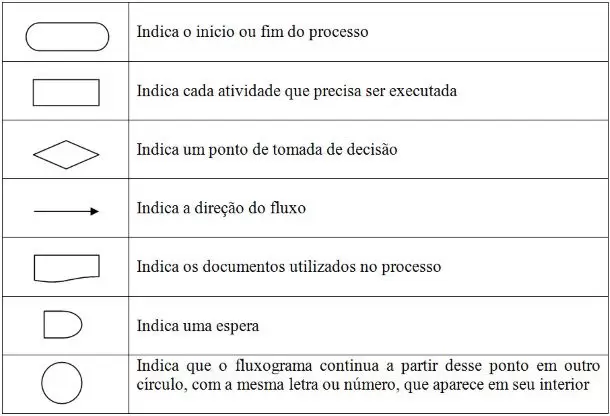

A vantagem do fluxograma é tornar visível o caminho lógico do algoritmo, principalmente quando há decisões, como `sim` ou `não`.

Exemplo de fluxograma para o problema da lâmpada:

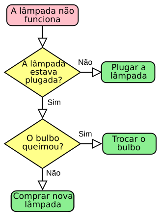

## 1.6 — Pseudocódigo

O pseudocódigo usado nesta apostila seguirá algumas convenções:

```text
INÍCIO
  GIRAR a lâmpada queimada no sentido anti-horário
  RETIRAR a lâmpada
  GIRAR a nova lâmpada no sentido horário
FIM
```

Convenções principais:

- `INÍCIO`: marca o começo do algoritmo.
- `FIM`: marca o encerramento.
- `IMPRIMIR`: mostra uma informação para o usuário.
- `LER`: recebe um dado informado pelo usuário.
- `RETORNE`: devolve um resultado.
- `SE`, `SENÃO`, `FIM_SE`: representam decisão condicional.
- `PARA CADA`, `ENQUANTO`: representam repetição.

Estruturas básicas:

```text
SE "condição for verdadeira" FAÇA:
  ...
SENÃO FAÇA:
  ...
FIM_SE

PARA CADA item EM coleção FAÇA:
  ...
FIM_PARA_CADA

ENQUANTO "condição for verdadeira" FAÇA:
  ...
FIM_ENQUANTO
```

## 1.7 — Resumo do capítulo

Um algoritmo é uma sequência de passos para resolver um problema. Em programação, ele é a base lógica do código. Para estudar algoritmos, usamos pseudocódigo, fluxogramas e implementações em Python. A partir do momento em que o algoritmo vira programa, ele passa a consumir tempo de processamento e espaço de memória.

---

# Capítulo 2 — Pensamento computacional e refinamento

Antes de escrever código, precisamos entender o problema. Pensamento computacional é a habilidade de decompor uma tarefa, identificar padrões, abstrair o que importa e criar uma sequência lógica de solução.

Ao final deste capítulo, você será capaz de:

- dividir problemas grandes em partes menores;
- usar operadores, condicionais, laços e modularização;
- entender por que algoritmos precisam ser refinados;
- transformar uma solução simples em uma solução mais robusta.

## 2.1 — Os quatro pilares do pensamento computacional

Os quatro pilares são:

1. **Decomposição:** dividir um problema em partes menores.
2. **Reconhecimento de padrões:** perceber repetições e semelhanças.
3. **Abstração:** ignorar detalhes irrelevantes e focar no essencial.
4. **Algoritmos:** criar uma sequência de passos para resolver o problema.

Exemplo: para fazer um bolo, podemos decompor a tarefa em selecionar ingredientes, misturar, assar e decorar. O padrão é semelhante ao de outras receitas. A abstração remove detalhes como tipo de cobertura. O algoritmo define a ordem exata das etapas.

## 2.2 — Exemplo: média de três notas

Problema: receber três notas e calcular a média aritmética.

Decomposição:

1. Receber a primeira nota.
2. Receber a segunda nota.
3. Receber a terceira nota.
4. Somar as três notas.
5. Dividir a soma por três.
6. Exibir o resultado.

Pseudocódigo:

```text
INÍCIO
RECEBE nota1
RECEBE nota2
RECEBE nota3
CALCULE soma = nota1 + nota2 + nota3.
CALCULE media = soma / 3.
APRESENTE o valor de media.
FIM
```

## 2.3 — Refinamento de algoritmos

Refinar um algoritmo significa torná-lo mais completo e mais próximo de um uso real. O algoritmo da média, por exemplo, pode apenas calcular um número. Mas, em um contexto real, talvez seja necessário informar se o aluno foi aprovado ou reprovado.

Um algoritmo refinado inclui validações, decisões, repetições e módulos separados.

## 2.4 — Operadores

Operadores são símbolos usados para realizar cálculos, comparações ou combinações lógicas.

### Operadores aritméticos

| Operador | Significado |
|---|---|
| `+` | adição |
| `-` | subtração |
| `*` | multiplicação |
| `/` | divisão |
| `%` | resto da divisão |
| `//` | divisão inteira |
| `**` | exponenciação |

### Operadores de atribuição

| Operador | Significado |
|---|---|
| `=` | atribuição simples |
| `+=` | soma e atribui |
| `-=` | subtrai e atribui |

### Operadores de comparação

| Operador | Significado |
|---|---|
| `==` | igual a |
| `!=` | diferente de |
| `>` | maior que |
| `<` | menor que |
| `>=` | maior ou igual a |
| `<=` | menor ou igual a |

### Operadores lógicos

Em pseudocódigo é comum usar `E` e `OU`. Em muitas linguagens aparecem como `&&` e `||`. Em Python, usamos `and` e `or`.

## 2.5 — Condicionais

Condicionais permitem que o algoritmo escolha caminhos diferentes.

```text
INICIO
VERIFICAR o estado da lâmpada
SE lâmpada estiver queimada:
  GIRAR a lâmpada queimada no sentido anti-horário
  RETIRAR a lâmpada
  GIRAR a nova lâmpada no sentido horário
CASO a lâmpada não esteja queimada:
  Nada a fazer
FIM_SE
FIM
```

A ideia principal é simples: **se a condição for verdadeira, execute um bloco; caso contrário, execute outro**.

## 2.6 — Laços de repetição

Laços executam um bloco de código repetidas vezes. Eles são úteis quando precisamos percorrer uma coleção, repetir uma operação até atingir uma condição ou processar vários dados.

Exemplos de uso:

- somar números de 1 até `N`;
- percorrer uma lista;
- buscar um elemento;
- repetir leitura de dados até o usuário digitar uma opção de saída.

## 2.7 — Modularização

Modularizar é dividir uma solução em partes menores e reutilizáveis. Em Python, normalmente fazemos isso com funções.

Uma boa função deve ter uma responsabilidade clara. Por exemplo, em vez de criar uma função gigante para validar, calcular, imprimir e salvar dados, podemos separar em funções menores.

## 2.8 — Resumo do capítulo

Pensamento computacional ajuda a transformar problemas em soluções programáveis. O refinamento adiciona condições, repetições e módulos ao algoritmo, tornando-o mais útil em situações reais.

---

# Capítulo 3 — Recursividade

Recursividade ocorre quando uma função chama a si mesma para resolver um problema menor do mesmo tipo. É uma técnica muito usada em estruturas como árvores, grafos, divisão e conquista e problemas matemáticos definidos por recorrência.

Ao final deste capítulo, você será capaz de:

- identificar o caso base de uma função recursiva;
- entender a chamada recursiva;
- comparar recursividade com iteração;
- reconhecer riscos de consumo de memória na call stack.

## 3.1 — O problema que a recursividade resolve

Alguns problemas são naturalmente definidos em termos de versões menores deles mesmos. O fatorial é um exemplo clássico:

```text
0! = 1
n! = n * (n - 1)!
```

Para calcular `5!`, precisamos calcular `4!`; para calcular `4!`, precisamos calcular `3!`, e assim por diante, até chegar ao caso base `0!`.

## 3.2 — Caso base e chamada recursiva

Todo algoritmo recursivo precisa de dois elementos:

- **Caso base:** condição que encerra a recursão.
- **Chamada recursiva:** chamada da própria função com um problema menor.

Exemplo básico de contagem regressiva:

```python
def imprime_sequencia(val: int) -> None:
    if val == 0:  # Critério de parada
        return

    print(val, end=" ")
    imprime_sequencia(val - 1) # Chamada recursiva

imprime_sequencia(5) 
# Saída: 5 4 3 2 1
```

## 3.3 — Iteração vs. recursividade


A abordagem iterativa usa laços como `for` e `while`. A abordagem recursiva usa chamadas de função empilhadas na memória.

- **Iteração:** costuma ser mais eficiente em memória.
- **Recursividade:** costuma ser mais expressiva para problemas naturalmente recursivos.

## 3.4 — Fatorial iterativo

```python
def fat_i(n: int) -> int:
    ret = 1
    for i in range(n, 1, -1):
        ret *= i
    return ret

print(fat_i(5)) # Saída: 120
```

A versão iterativa acumula o resultado em uma variável. Ela não empilha chamadas de função, então tende a consumir menos memória.

## 3.5 — Fatorial recursivo

```python
def fat_r(n: int) -> int:
    if n == 0:  # Critério de parada
        return 1

    return n * fat_r(n - 1) # Chamada recursiva aguardando retorno

print(fat_r(5)) # Saída: 120
```

Neste caso, `fat_r(5)` depende de `fat_r(4)`, que depende de `fat_r(3)`, até chegar em `fat_r(0)`. Depois disso, a pilha de chamadas começa a retornar os resultados.

## 3.6 — Fibonacci recursivo

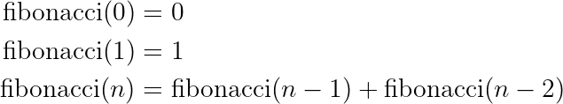

```python
def fibonacci(n: int) -> int:
    if n == 0 or n == 1:  # Critérios de parada
        return n

    # Recursão dupla
    return fibonacci(n - 1) + fibonacci(n - 2)

print(fibonacci(10)) # Saída: 55
```

Para `fibonacci(4)`, a expansão fica assim:

```text
fibonacci(4) = fibonacci(3) + fibonacci(2)

fibonacci(3) = fibonacci(2) + fibonacci(1)
fibonacci(2) = fibonacci(1) + fibonacci(0)

fibonacci(4) = [fibonacci(2) + fibonacci(1)] + [fibonacci(1) + fibonacci(0)]
fibonacci(4) = [[fibonacci(1) + fibonacci(0)] + fibonacci(1)] + [fibonacci(1) + fibonacci(0)]
fibonacci(4) = 1 + 0 + 1 + 1 + 0
fibonacci(4) = 3
```

Árvore de chamadas:

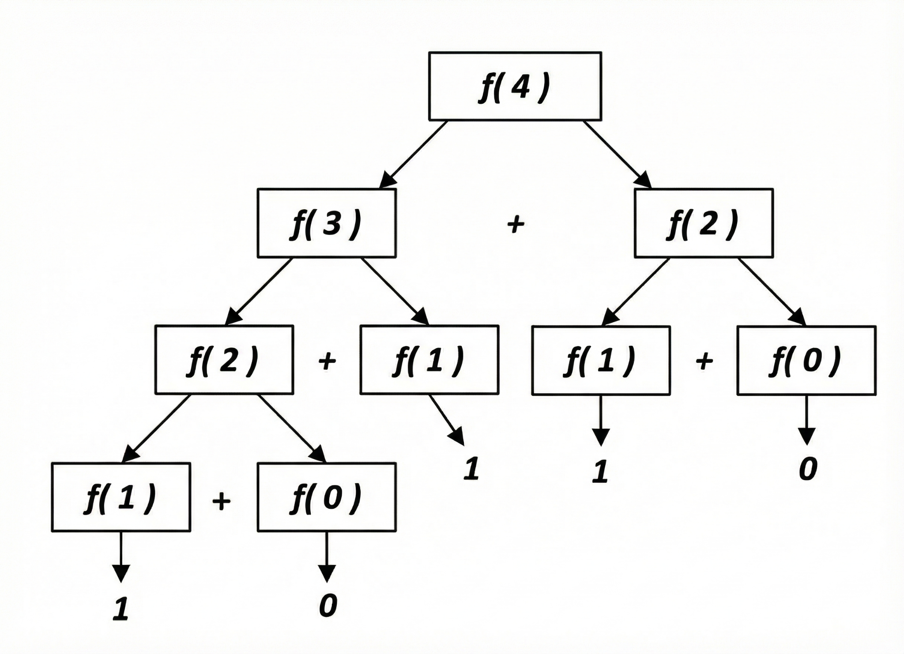

## 3.7 — Cuidado com desempenho

A versão recursiva simples de Fibonacci recalcula várias chamadas repetidas. Isso torna o algoritmo caro. Para `fibonacci(n)`, a árvore de chamadas cresce muito rápido.

Em Python, uma alternativa comum é usar memoização com `functools.cache` ou `functools.lru_cache`, quando o mesmo subproblema é calculado várias vezes.

Exemplo complementar:

```python
from functools import cache

@cache
def fibonacci_memo(n: int) -> int:
    if n == 0 or n == 1:
        return n
    return fibonacci_memo(n - 1) + fibonacci_memo(n - 2)
```

Com memoização, chamadas repetidas são armazenadas e reutilizadas. Isso troca uso de memória por ganho de tempo.

## 3.8 — Resumo do capítulo

Recursividade é útil quando um problema pode ser dividido em versões menores de si mesmo. Ela exige um caso base e uma chamada recursiva. Em problemas com muitas subchamadas repetidas, como Fibonacci, é importante considerar memoização ou uma solução iterativa.

---

# Capítulo 4 — Exercícios progressivos

Esta seção reúne exercícios para praticar construção de algoritmos. A ideia é resolver primeiro em pseudocódigo e depois implementar em Python.

## 4.1 — Nível 1

### Quadrado de um número

Crie um algoritmo que leia um número e exiba o seu quadrado.

### Área de um retângulo

Crie um algoritmo que calcule a área de um retângulo.

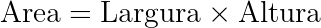

### Média de três notas

Crie um algoritmo que receba três notas de um aluno, calcule a média aritmética e informe se o aluno está aprovado ou reprovado, considerando média mínima 7.0.

### Verificação de múltiplos

Escreva um algoritmo que receba dois números inteiros e verifique se o primeiro é múltiplo do segundo.

### Cálculo de média com opções

Desenvolva um algoritmo que permita ao usuário calcular a média ponderada e a média harmônica de três notas.

### Salário líquido

Crie um algoritmo que leia o salário bruto de um funcionário e calcule o salário líquido, descontando 11% de INSS, 8% de FGTS e 5% de imposto de renda.

### IMC

Desenvolva um algoritmo que receba massa em quilogramas e altura em metros, calcule o IMC e classifique o resultado.

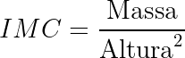

Categorias:

- Abaixo do peso: IMC menor que 18,5.
- Peso normal: IMC entre 18,5 e 24,9.
- Sobrepeso: IMC entre 25 e 29,9.
- Obesidade: IMC igual ou superior a 30.

### Conversão de temperaturas

Desenvolva um algoritmo em que o usuário digite uma temperatura em Celsius e o programa exiba Fahrenheit, Kelvin, Réaumur, Rankine e a velocidade do som nessa temperatura.

### Idade em dias

Leia a data de nascimento e a data atual. Calcule a idade em dias e em anos, considerando ano com 365 dias e mês com 30 dias para simplificar.

### Tempo para segundos

Converta um período expresso em dias, horas, minutos e segundos para apenas segundos.

### Número par ou ímpar

Leia números inteiros digitados pelo usuário e informe se cada número é par ou ímpar até que um número negativo seja digitado. Considere zero como par.

### Soma de 1 até N

Receba um número inteiro `N` e exiba a soma dos números de 1 até `N`.

Exemplo: se `N = 7`, o programa deve exibir `1 + 2 + 3 + 4 + 5 + 6 + 7 = 28`.

### Soma de pares e ímpares até N

Receba um número inteiro positivo `N` e calcule separadamente a soma dos pares e a soma dos ímpares de 1 até `N`.

### Classificação de triângulos

Leia três lados, verifique se eles formam um triângulo válido e classifique como equilátero, isósceles ou escaleno.

### Ano bissexto

Leia um ano e determine se ele é bissexto. Um ano é bissexto se for divisível por 4, mas não por 100, exceto se também for divisível por 400.

### Vogais em uma palavra

Leia uma palavra e conte quantas vogais existem nela.

### Busca em palavra

Leia uma palavra de até 250 caracteres e uma letra. Depois, informe quantas vezes essa letra aparece na palavra.

### Inverter palavra

Leia uma palavra de até 250 caracteres e imprima a palavra invertida.

## 4.2 — Nível 2

### Fatorial

Calcule o fatorial de um número inteiro positivo fornecido pelo usuário.

### Fibonacci

Gere a sequência de Fibonacci até o n-ésimo termo.

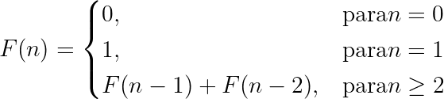

### Número primo

Leia um número inteiro positivo e verifique se ele é primo.

### Palíndromo

Leia uma palavra e verifique se ela é um palíndromo.

### Notas e moedas

Leia um valor inteiro em reais e determine o menor número de notas necessárias usando notas de 100, 50, 20, 10, 5 e 2.

### Número perfeito

Verifique se um número é perfeito. Um número perfeito é igual à soma de seus divisores próprios, excluindo ele mesmo.

Exemplo: `28` é perfeito porque `1 + 2 + 4 + 7 + 14 = 28`.

### Triângulo de Floyd

Receba o número de linhas e imprima o Triângulo de Floyd correspondente.

Exemplo com 6 linhas:

```text
1
2 3
4 5 6
7 8 9 10
11 12 13 14 15
16 17 18 19 20 21
```

### Somatório: iteração vs. recursão

Considere a função matemática abaixo:

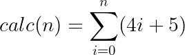

Escreva a função `calc` em Python de forma iterativa e recursiva.

### Fatorial inverso

Receba um número inteiro positivo e identifique qual número tem fatorial igual ao valor informado. Caso não exista fatorial exato, indique entre quais dois fatoriais consecutivos ele se encontra.

Exemplo:

```text
120 = 5!
4! < 81 < 5!
```

## 4.3 — Nível 3

### Validação de CPF

Um CPF possui 11 dígitos. Os dois últimos são dígitos verificadores calculados a partir dos nove primeiros.

Cálculo do primeiro dígito:

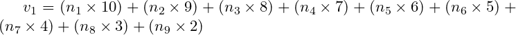

```text
r1 = resto da divisão inteira de v1 por 11
Se r1 < 2 então n10 = 0; caso contrário n10 = 11 - r1
```

Cálculo do segundo dígito:

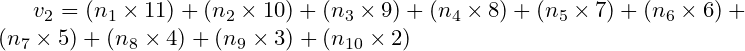

```text
r2 = resto da divisão inteira de v2 por 11
Se r2 < 2 então n11 = 0; caso contrário n11 = 11 - r2
```

Crie um algoritmo em que o usuário informe os nove primeiros dígitos e o programa retorne os dois dígitos verificadores.

### Números amigos

Dois números positivos `A` e `B` são amigos quando a soma dos divisores próprios de `A` é igual a `B` e a soma dos divisores próprios de `B` é igual a `A`.

Exemplo: `220` e `284` são amigos.

### Diamante

Desenvolva um algoritmo em que o usuário informe um número inteiro ímpar positivo `N` e o programa imprima um diamante. Caso o usuário informe um número negativo ou par, exiba mensagem de erro.

### Análise completa de triângulos

Receba três lados e imprima:

1. se os valores formam um triângulo;
2. se é equilátero, isósceles ou escaleno;
3. se é retângulo, obtusângulo ou acutângulo;
4. o perímetro;
5. a área;
6. os três ângulos internos em graus.

### Relação de recorrência e árvore recursiva

Considere a relação de recorrência:

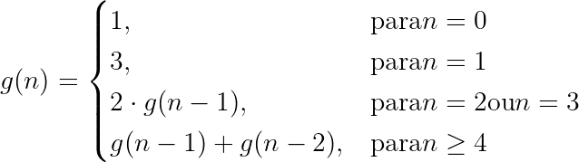

Responda:

1. implemente a função recursiva `g` em Python;
2. calcule `g(10)`;
3. conte quantas chamadas são feitas para `g(12)`;
4. conte quantas vezes `g(4)` aparece na árvore de resolução de `g(18)`.

---

# Capítulo 5 — Complexidade de algoritmos

A análise de complexidade mede a eficiência de um algoritmo. Em vez de medir em segundos, ela descreve como o consumo de tempo e memória cresce quando o tamanho da entrada aumenta.

Ao final deste capítulo, você será capaz de:

- diferenciar complexidade de tempo e de espaço;
- interpretar a notação Big O;
- reconhecer algoritmos constantes, lineares, logarítmicos e quadráticos;
- avaliar escolhas de implementação em Python.

## 5.1 — Tempo e espaço

A complexidade de tempo mede a quantidade de operações executadas. A complexidade de espaço mede a quantidade de memória extra usada.

Uma operação elementar pode ser:

- uma soma;
- uma comparação;
- uma atribuição;
- um acesso a índice;
- uma chamada de função;
- um teste condicional.

## 5.2 — Inversão de lista in-place

```python
def reverse_list(arr):
    n = len(arr)
    limit = n // 2
    for i in range(limit):
        aux = arr[i]
        arr[i] = arr[n - 1 - i]
        arr[n - 1 - i] = aux
    return arr
```

Essa implementação modifica a lista original. Ela troca o primeiro elemento com o último, o segundo com o penúltimo, e assim por diante.

| Linha de código | Custo aproximado |
|---|---:|
| `n = len(arr)` | 1 |
| `limit = n // 2` | 1 |
| `for i in range(limit)` | n/2 |
| trocas internas | 3 × n/2 |

O tempo cresce de forma linear: `O(n)`. O espaço extra é constante: `O(1)`, pois a função usa apenas algumas variáveis auxiliares.

## 5.3 — Inversão out-of-place

```python
def reverse_list_out(arr):
    n = len(arr)
    new_array = []

    for i in range(n - 1, -1, -1):
        new_array.append(arr[i])
    return new_array

print(reverse_list_out(array))
```

Essa versão preserva a lista original e cria uma nova lista invertida. O tempo também é `O(n)`, pois todos os elementos são percorridos. Porém, o espaço extra é `O(n)`, porque uma nova estrutura é criada.

## 5.4 — Notação Big O

A notação Big O descreve o limite superior de crescimento de um algoritmo, normalmente considerando o pior caso.

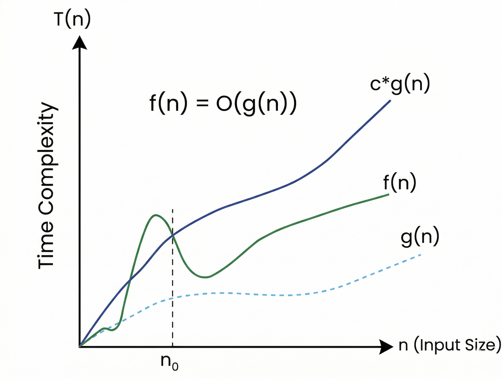

A regra prática é:

1. identifique o termo que mais cresce;
2. ignore constantes;
3. ignore termos menos relevantes.

Exemplo:

```text
3n² + 10n + 5 → O(n²)
```

Conforme `n` cresce, o termo quadrático domina os demais.

## 5.5 — Classes principais de complexidade

| Classe | Nome | Exemplo prático |
|---|---|---|
| `O(1)` | constante | acessar `lista[0]` |
| `O(log n)` | logarítmica | busca binária |
| `O(n)` | linear | percorrer uma lista |
| `O(n log n)` | linearítmica | merge sort, quick sort médio |
| `O(n²)` | quadrática | bubble sort, selection sort |
| `O(2ⁿ)` | exponencial | Fibonacci recursivo ingênuo |

Gráfico comparativo:

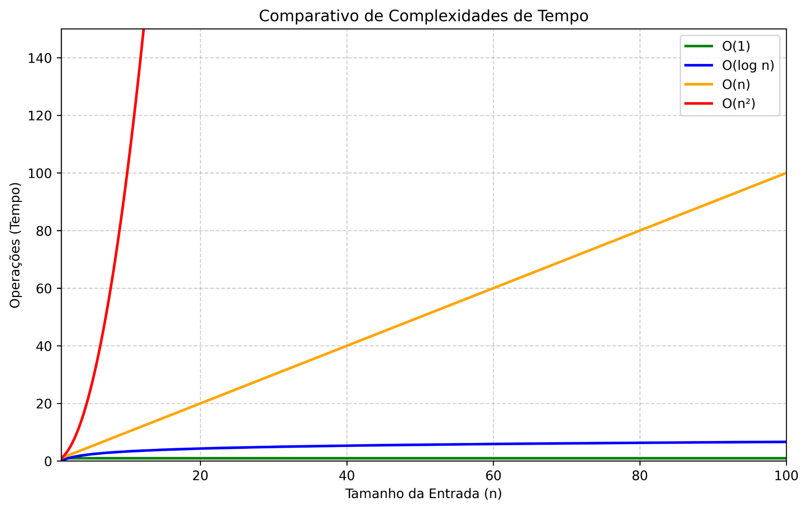

## 5.6 — Busca linear

```python
def linear_search(arr, targetVal):
    for i in range(len(arr)):
        if arr[i] == targetVal:
            return i
    return None
```

A busca linear percorre a lista até encontrar o valor. Se o valor estiver no início, o melhor caso é `O(1)`. Se estiver no final ou não existir, o pior caso é `O(n)`.

## 5.7 — Busca binária

```python
def binary_search(arr, targetVal):
    left = 0
    right = len(arr) - 1

    while left <= right:
        mid = (left + right) // 2

        if arr[mid] == targetVal:
            return mid

        if arr[mid] < targetVal:
            left = mid + 1
        else:
            right = mid - 1

    return -1
```

A busca binária exige uma lista ordenada. A cada passo, ela elimina metade do espaço de busca. Por isso, sua complexidade é `O(log n)`.

## 5.8 — Algoritmo quadrático

```python
def duplicated_itens(arr):
    for i in range(len(arr) - 1):
        for j in range(i + 1, len(arr)):
            if arr[i] == arr[j]:
                return True
    return False
```

Esse algoritmo compara pares de elementos para verificar se existem duplicados. Como há laços aninhados, o número de comparações cresce aproximadamente com `n²`.

No pior caso, se não houver duplicados, ele precisa testar muitas combinações. Por isso, sua complexidade é `O(n²)`.

## 5.9 — Resumo do capítulo

Complexidade não mede tempo real em segundos, mas a taxa de crescimento do custo. Dois algoritmos podem resolver o mesmo problema com resultados iguais, mas com custos muito diferentes. Em backend, essa diferença aparece em tempo de resposta, uso de CPU, consumo de memória e escalabilidade.

---

# Capítulo 6 — Listas e armazenamento sequencial

Uma lista é uma estrutura de dados linear usada para armazenar elementos em sequência. Em Python, `list` é dinâmica, mutável e indexada.

Ao final deste capítulo, você será capaz de:

- entender listas como estruturas sequenciais;
- acessar elementos por índice;
- avaliar o custo de inserção e remoção;
- entender quando listas são adequadas.

## 6.1 — O problema

Imagine armazenar itens de mercado usando variáveis separadas:

```python
fruta1 = "maça"
fruta2 = banana
fruta3 = pera
```

Essa abordagem não escala. Se a lista crescer para 50 itens, o código ficará difícil de manter.

Com listas:

```python
frutas = ["maça", "banana", "pera"]
```

Também é possível misturar tipos:

```python
minha_lista = [42, "Python", 3.14, [1, 2, 3]]
```

## 6.2 — Estrutura de índices

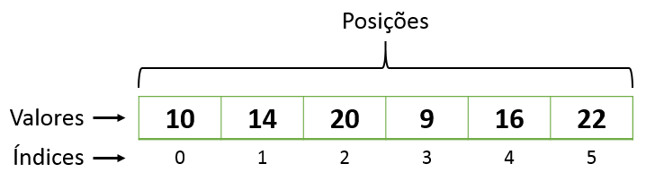

Em Python, o primeiro elemento fica no índice `0`, o segundo no índice `1`, e assim por diante.

```python
fruta = [2]
# A fruta correspondente ao índice 2 é a pera
```

> Observação: no exemplo acima, o mais comum seria acessar `frutas[2]`, pois `fruta = [2]` cria uma nova lista contendo o número `2`. Mantive o trecho original, mas a explicação correta é que o acesso por índice usa a sintaxe `nome_da_lista[indice]`.

## 6.3 — Tamanho da lista

```python
tamanho_da_lista = len(frutas) 
print(f"O tamanho da lista ‘frutas’ é: {tamanho_da_lista}")
# O tamanho da lista ‘frutas’ é 3
```

A função `len()` retorna a quantidade de elementos da lista.

## 6.4 — Inserção em listas

Inserir no final tende a ser eficiente. Inserir no início ou no meio pode exigir deslocamento de elementos.

Inserção no meio:

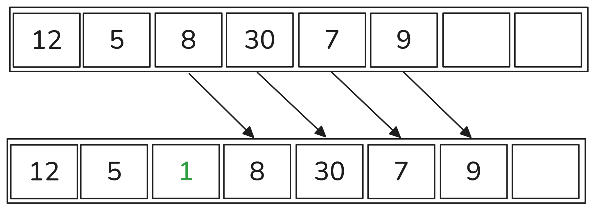

Inserção no final:

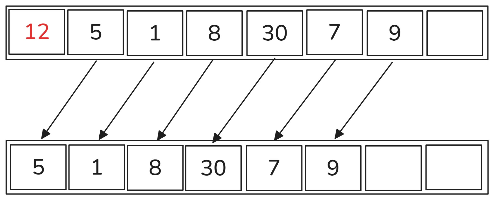

| Operação | Posição | Complexidade típica | Motivo |
|---|---|---|---|
| Inserção | final | `O(1)` amortizado | adiciona após o último elemento |
| Inserção | início/meio | `O(n)` | desloca elementos |
| Acesso | por índice | `O(1)` | acesso direto |
| Busca | por valor | `O(n)` | pode precisar percorrer tudo |

## 6.5 — Quando usar listas

Use listas quando:

- a ordem importa;
- você precisa acessar por índice;
- o volume de inserções no final é alto;
- você precisa percorrer todos os elementos.

Evite listas quando:

- você precisa inserir e remover frequentemente no início;
- você precisa busca por chave de forma rápida;
- você precisa garantir unicidade dos elementos.

---

# Capítulo 7 — Listas ligadas

Uma lista ligada é uma estrutura linear formada por nós. Cada nó guarda um valor e uma referência para o próximo nó.

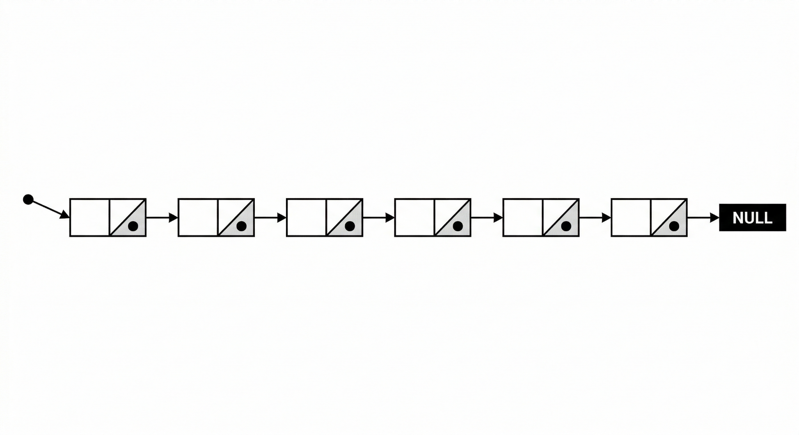

Ao final deste capítulo, você será capaz de:

- entender o conceito de nó;
- implementar uma lista ligada simples;
- comparar listas ligadas com listas sequenciais;
- avaliar custos de busca, inserção e remoção.

## 7.1 — Classe Node

```python
class Node:
    def __init__(self, data: Any):
        self.data = data
        self.next: Optional["Node"] = None
```

Um nó possui dois elementos:

- `data`: o valor armazenado;
- `next`: referência para o próximo nó.

Exemplo:

```python
node1 = Node(5)
node2 = Node(9)
```

## 7.2 — Estrutura inicial da LinkedList

```python
from node import Node

class LinkedList:
    def __init__(self):
        self.head = None
        self._size = 0
```

A lista começa vazia. `head` aponta para o primeiro nó. `_size` guarda o tamanho atual.

## 7.3 — Acesso por posição

```python
def __getitem__(self, index):
    pointer = self.head
    for i in range(index):
        if pointer:
            pointer = pointer.next
        else:
            raise IndexError("list index out of range")
    if pointer:
        return pointer.data
    raise IndexError("list index out of range")
```

Diferente de uma lista Python, uma lista ligada não permite acesso direto por índice. Para chegar ao índice `5`, é preciso passar pelos nós anteriores.

Complexidade: `O(n)`.

## 7.4 — Busca por valor

```python
def index(self, data):
    pointer = self.head
    current_index = 0
    while pointer:
        if pointer.data == data:
            return current_index
        pointer = pointer.next
        current_index = current_index + 1
    raise ValueError("{} is not in list".format(data))
```

A busca percorre nó a nó até encontrar o valor. Se o valor não existir, percorre a lista inteira.

## 7.5 — Inserção no final

```python
def append(self, data):
    if self.head:
        pointer = self.head
        while pointer.next:
            pointer = pointer.next
        pointer.next = Node(data)
    else:
        self.head = Node(data)
    self._size = self._size + 1
```

Sem referência para o último nó, inserir no final exige percorrer a lista inteira. Complexidade: `O(n)`.

## 7.6 — Inserção em posição específica

```python
def insert(self, index, data):
    if index < 0 or index > self._size:
        raise IndexError("list index out of range")
    node = Node(data)
    if index == 0:
        node.next = self.head
        self.head = node
    else:
        previous = self._get_node(index - 1)
        if previous is None:
            raise IndexError("list index out of range")
        node.next = previous.next
        previous.next = node
    self._size = self._size + 1
```

O segredo da inserção é ajustar referências. Não deslocamos valores; mudamos o encadeamento.

Método auxiliar:

```python
def _get_node(self, index: int):
    if index < 0 or index >= self._size:
        raise IndexError("list index out of range")
    pointer = self.head
    for _ in range(index):
        if pointer is None:
            raise IndexError("list index out of range")
        pointer = pointer.next
    return pointer
```

## 7.7 — Remoção por valor

```python
def remove(self, data):
    if self.head == None:
        raise ValueError("{} is not in list".format(data))
    elif self.head.data == data:
        self.head = self.head.next
        self._size = self._size - 1
        return True
    else:
        previous = self.head
        pointer = self.head.next
        while pointer:
            if pointer.data == data:
                previous.next = pointer.next
                pointer.next = None
                self._size = self._size - 1
                return True
            previous = pointer
            pointer = pointer.next
    raise ValueError("{} is not in list".format(data))
```

Para remover um nó do meio, precisamos manter referência ao nó anterior. Assim, o anterior passa a apontar para o próximo do nó removido.

## 7.8 — Tamanho da lista

```python
def __len__(self):
    return self._size
```

Com `_size`, `len(lista)` passa a ser `O(1)`, pois não precisamos percorrer todos os nós para contar.

## 7.9 — Lista sequencial vs. lista ligada

| Operação | Lista Python | Lista ligada simples |
|---|---:|---:|
| Acesso por índice | `O(1)` | `O(n)` |
| Busca por valor | `O(n)` | `O(n)` |
| Inserção no início | `O(n)` | `O(1)` |
| Inserção no final | `O(1)` amortizado | `O(n)` sem ponteiro tail |
| Remoção após encontrar o nó | depende | `O(1)` para religar ponteiros |

---

# Capítulo 8 — Pilhas e filas

Pilhas e filas são estruturas lineares com regras específicas de entrada e saída.

## 8.1 — Pilhas

Uma pilha segue a política **LIFO**: Last In, First Out. O último elemento a entrar é o primeiro a sair.

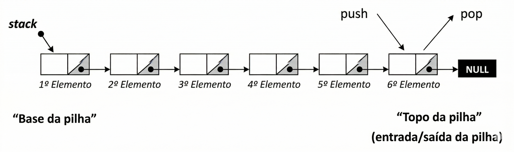

Exemplos práticos:

- call stack de execução de funções;
- histórico de navegação;
- desfazer/refazer ações;
- análise de expressões com parênteses.

### Classe Node

```python
class Node:
    def __init__(self, data):
        self.data = data
        self.next = None
```

### Classe Stack

```python
class Stack:
    def __init__(self):
        self.top: Optional[Node] = None
        self._size = 0

    def push(self, elem):
        node = Node(elem)
        node.next = self.top
        self.top = node
        self._size += 1

    def pop(self):
        if self.top is not None:
            node = self.top
            self.top = self.top.next
            self._size -= 1
            return node.data
        raise IndexError("The stack is empty")

    def peek(self):
        if self.top is not None:
            return self.top.data
        raise IndexError("The stack is empty")

    def __len__(self):
        return self._size

    def __repr__(self):
        result = ""
        current_node = self.top
        while current_node is not None:
            result += str(current_node.data) + "\n"
            current_node = current_node.next
        return result

    def __str__(self):
        return self.__repr__()
```

Operações principais:

- `push()`: insere no topo — `O(1)`.
- `pop()`: remove do topo — `O(1)`.
- `peek()`: consulta o topo — `O(1)`.

Exemplo de uso:

```python
from stack import Stack
# 1. Instanciando
pilha_de_roupa = Stack()

# 2. Empilhando (Push)
pilha_de_roupa.push("Camisa Azul")
pilha_de_roupa.push("Calça Jeans")
pilha_de_roupa.push("Casaco")

# 3. Visualizando a Pilha
print(pilha_de_roupa)

# 4. Espiando o topo (Peek)
print(f"No topo está: {pilha_de_roupa.peek()}")  # Saída: Casaco

# 5. Desempilhando (Pop)
removido = pilha_de_roupa.pop()
print(f"Removi o {removido}")  # Saída: Casaco

# 6. Verificando tamanho final usando len()
print(f"Restam {len(pilha_de_roupa)} itens.")  # Saída: 2
```

## 8.2 — Filas

Uma fila segue a política **FIFO**: First In, First Out. O primeiro elemento a entrar é o primeiro a sair.

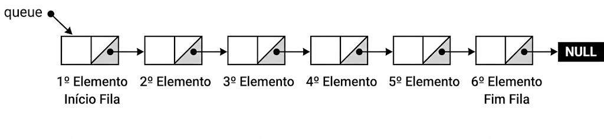

Exemplos práticos:

- fila de mensagens;
- fila de processamento assíncrono;
- impressão de documentos;
- requisições aguardando atendimento;
- tarefas em sistemas distribuídos.

### Classe Queue

```python
from node import Node

class Queue:
    def __init__(self):
        self.first = None
        self.last = None
        self._size = 0

    def push(self, elem):
        node = Node(elem)
        if self.last is None:
            self.last = node
        else:
            self.last.next = node
            self.last = node

        if self.first is None:
            self.first = node

        self._size += 1

    def pop(self):
        if self._size > 0 and self.first is not None:
            elem = self.first.data
            self.first = self.first.next
            if self.first is None:
                self.last = None
            self._size -= 1
            return elem
        raise IndexError("The queue is empty")

    def peek(self):
        if self._size > 0 and self.first is not None:
            elem = self.first.data
            return elem
        raise IndexError("The queue is empty")

    def __len__(self):
        return self._size

    def __repr__(self):
        if self._size > 0:
            result = ""
            current_node = self.first
            while current_node:
                result += str(current_node.data) + " "
                current_node = current_node.next
            return result
        return "Empty Queue"

    def __str__(self):
        return self.__repr__()
```

Operações principais:

- `push()`: insere no final — `O(1)`.
- `pop()`: remove do início — `O(1)`.
- `peek()`: consulta o primeiro — `O(1)`.

> Observação prática: em Python real, quando você precisa de fila eficiente, a estrutura mais indicada da biblioteca padrão costuma ser `collections.deque`, pois oferece inserções e remoções eficientes nas duas extremidades.

---

# Capítulo 9 — Estruturas avançadas úteis em backend

Além das estruturas implementadas manualmente, um desenvolvedor backend precisa saber quando usar estruturas prontas da linguagem. Isso evita reinventar soluções e melhora desempenho.

## 9.1 — `deque`: fila eficiente dos dois lados

`deque` significa double-ended queue. Ela permite inserir e remover elementos tanto no início quanto no final com custo aproximadamente `O(1)`.

Use quando:

- você precisa de fila FIFO;
- precisa remover do início frequentemente;
- está implementando janela deslizante;
- precisa de uma estrutura que funciona como fila e pilha.

Exemplo complementar:

```python
from collections import deque

fila = deque()
fila.append("job-1")
fila.append("job-2")

proximo_job = fila.popleft()
print(proximo_job)  # job-1
```

## 9.2 — Heap e fila de prioridade

Um heap é uma estrutura usada para recuperar rapidamente o menor ou maior elemento de um conjunto. Em Python, o módulo `heapq` implementa um min-heap.

Use quando:

- precisa sempre processar o item de maior prioridade;
- está implementando agendamento de tarefas;
- precisa dos menores ou maiores elementos sem ordenar toda a lista;
- está estudando algoritmos como Dijkstra.

Exemplo complementar:

```python
import heapq

fila_prioridade = []
heapq.heappush(fila_prioridade, (2, "enviar email"))
heapq.heappush(fila_prioridade, (1, "processar pagamento"))
heapq.heappush(fila_prioridade, (3, "gerar relatório"))

prioridade, tarefa = heapq.heappop(fila_prioridade)
print(tarefa)  # processar pagamento
```

Como o heap é mínimo, o menor valor de prioridade sai primeiro.

## 9.3 — Busca em lista ordenada com `bisect`

O módulo `bisect` ajuda a encontrar posições de inserção em listas ordenadas sem precisar reordenar a lista inteira a cada inserção.

Use quando:

- você mantém uma lista sempre ordenada;
- precisa descobrir onde inserir um item;
- quer evitar busca linear em listas ordenadas.

Exemplo complementar:

```python
import bisect

valores = [10, 20, 30, 40]
posicao = bisect.bisect_left(valores, 25)
print(posicao)  # 2

bisect.insort(valores, 25)
print(valores)  # [10, 20, 25, 30, 40]
```

## 9.4 — Grafos

Um grafo é uma estrutura formada por vértices e arestas. Ele representa relações entre entidades.

Exemplos práticos em backend:

- usuários e conexões sociais;
- dependências entre tarefas;
- rotas entre serviços;
- permissões e relacionamentos;
- fluxos de aprovação.

Representação por lista de adjacência:

```python
grafo = {
    "A": ["B", "C"],
    "B": ["D"],
    "C": ["D"],
    "D": []
}
```

### Busca em largura — BFS

BFS percorre o grafo por níveis. É útil para encontrar menor caminho em grafos não ponderados.

```python
from collections import deque

def bfs(grafo, origem):
    visitados = set()
    fila = deque([origem])

    while fila:
        vertice = fila.popleft()
        if vertice not in visitados:
            print(vertice)
            visitados.add(vertice)
            fila.extend(grafo[vertice])
```

### Busca em profundidade — DFS

DFS explora um caminho até o fim antes de voltar.

```python
def dfs(grafo, vertice, visitados=None):
    if visitados is None:
        visitados = set()

    if vertice in visitados:
        return

    print(vertice)
    visitados.add(vertice)

    for vizinho in grafo[vertice]:
        dfs(grafo, vizinho, visitados)
```

## 9.5 — Ordenação topológica

Ordenação topológica organiza tarefas que possuem dependências. Só é possível em grafos direcionados sem ciclos.

Exemplo real: antes de executar uma migration que cria uma chave estrangeira, talvez seja necessário criar primeiro a tabela referenciada.

Exemplo complementar com `graphlib`:

```python
from graphlib import TopologicalSorter

dependencias = {
    "criar_tabela_pedidos": {"criar_tabela_usuarios"},
    "criar_tabela_pagamentos": {"criar_tabela_pedidos"},
    "criar_tabela_usuarios": set(),
}

ordem = list(TopologicalSorter(dependencias).static_order())
print(ordem)
```

---

# Capítulo 10 — Algoritmos de ordenação

Ordenar é reorganizar elementos segundo algum critério. Em backend, ordenação aparece em relatórios, rankings, paginação, processamento de dados e preparação para busca binária.

## 10.1 — Bubble Sort

O Bubble Sort compara elementos vizinhos e troca quando estão fora de ordem. Os maiores valores vão “borbulhando” para o final.

```python
lista = [7, 12, 9, 11, 3]

def bubble_sort(lista):
    n = len(lista)

    for i in range(0, n - 1):
        for j in range(0, n - i - 1):
            if lista[j] > lista[j + 1]:
                aux = lista[j]
                lista[j] = lista[j + 1]
                lista[j + 1] = aux

    return lista

print(bubble_sort(lista))
```

Troca simplificada em Python:

```python
for i in range(0, n - 1):
    for j in range(0, n - i - 1):
        if lista[j] > lista[j + 1]:
            lista[j], lista[j + 1] = lista[j + 1], lista[j]
```

Complexidade:

- Melhor caso com otimização: pode chegar a `O(n)`.
- Implementação simples: `O(n²)`.
- Pior caso: `O(n²)`.
- Espaço: `O(1)`.

## 10.2 — Selection Sort

O Selection Sort seleciona o menor elemento da parte não ordenada e o coloca na posição correta.

```python
lista = [7, 12, 9, 11, 3]


def selection_sort(lista):
    n = len(lista)

    for i in range(n - 1):
        min_index = i

        for j in range(i + 1, n):
            if lista[j] < lista[min_index]:
                min_index = j
        lista[i], lista[min_index] = lista[min_index], lista[i]
    return lista


print(selection_sort(lista))
```

Complexidade:

- Tempo: `O(n²)`.
- Espaço: `O(1)`.

Ele faz menos trocas que o Bubble Sort, mas ainda compara muitos pares.

## 10.3 — Insertion Sort

O Insertion Sort constrói uma parte ordenada da lista e insere cada novo elemento na posição correta.

Exemplo de evolução:

```text
[ 7, 12, 9, 11, 3]
[ 7, 9, 12, 11, 3]
[ 7, 9, 11, 12, 3]
[ 3, 7, 9, 11, 12]
```

Implementação:

```python
array = [64, 34, 25, 12, 22, 11, 90, 5]


def insertion_sort(arr):
    n = len(arr)

    for i in range(1, n):
        key = arr[i]
        j = i - 1

        while j >= 0 and arr[j] > key:
            arr[j + 1] = arr[j]
            j -= 1

        arr[j + 1] = key

    return arr


print(insertion_sort(array))
```

Complexidade:

- Melhor caso: `O(n)` quando a lista já está ordenada.
- Pior caso: `O(n²)`.
- Espaço: `O(1)`.

## 10.4 — Merge Sort

O Merge Sort usa a estratégia de divisão e conquista:

1. divide a lista em partes menores;
2. ordena as partes;
3. combina as partes ordenadas.

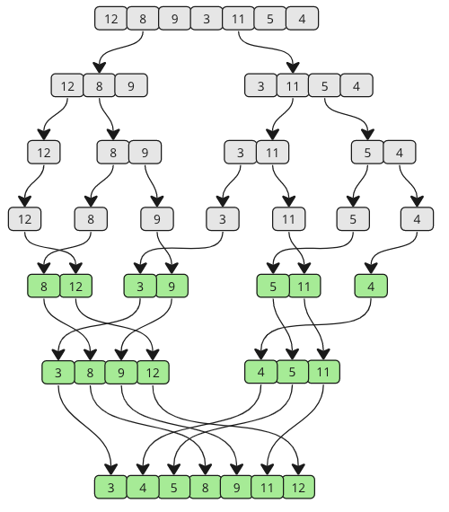

```python
array = [12, 8, 9, 3, 11, 5, 4]
def merge_sort(arr, start=0, end=None):
    if end is None:
        end = len(arr)
    if end - start > 1:
        mid = (start + end) // 2
        merge_sort(arr, start, mid)
        merge_sort(arr, mid, end)

        merge(arr, start, mid, end)

    return arr


def merge(arr, start, mid, end):
    left = arr[start:mid]
    right = arr[mid:end]

    top_left, top_right = 0, 0

    for k in range(start, end):
        if top_left < len(left) and (
            top_right >= len(right) or left[top_left] <= right[top_right]
        ):
            arr[k] = left[top_left]
            top_left += 1
        else:
            arr[k] = right[top_right]
            top_right += 1


print(merge_sort(array))
```

Complexidade:

- Tempo: `O(n log n)`.
- Espaço: `O(n)`, por causa das listas auxiliares.

## 10.5 — Quick Sort

O Quick Sort escolhe um pivô, particiona os elementos menores e maiores que ele, e aplica o mesmo processo recursivamente nas partes.

```python
array = [12, 8, 9, 3, 11, 5, 4]


def quick_sort(arr, start=0, end=None):
    if end is None:
        end = len(arr) - 1

    if start < end:
        p = partition(arr, start, end)

        quick_sort(arr, start, p - 1)
        quick_sort(arr, p + 1, end)

    return arr


def partition(arr, start, end):
    pivot = arr[end]
    i = start - 1

    for j in range(start, end):
        if arr[j] <= pivot:
            i += 1
            arr[i], arr[j] = arr[j], arr[i]

    arr[i + 1], arr[end] = arr[end], arr[i + 1]

    return i + 1


print(quick_sort(array))
```

Complexidade:

- Caso médio: `O(n log n)`.
- Pior caso: `O(n²)`, se os pivôs forem muito ruins.
- Espaço: depende da profundidade da recursão.

## 10.6 — Quando usar cada ordenação

| Algoritmo | Quando estudar/usar | Complexidade típica |
|---|---|---|
| Bubble Sort | didático, entender trocas | `O(n²)` |
| Selection Sort | didático, poucas trocas | `O(n²)` |
| Insertion Sort | listas pequenas/quase ordenadas | `O(n²)`, melhor `O(n)` |
| Merge Sort | estabilidade e previsibilidade | `O(n log n)` |
| Quick Sort | bom desempenho médio | `O(n log n)` médio |
| `sorted()`/`.sort()` | uso real em Python | Timsort, eficiente e estável |

Em projetos reais Python, prefira `sorted()` ou `.sort()`. Os algoritmos acima são essenciais para estudo, entrevistas e compreensão de complexidade.

---

# Capítulo 11 — Algoritmos de busca

Buscar é localizar um elemento dentro de uma estrutura. A escolha do algoritmo depende principalmente de uma pergunta: **os dados estão ordenados?**

## 11.1 — Busca linear

A busca linear percorre item por item até encontrar o valor.

```python
array = [3, 7, 2, 9, 5, 1, 8, 4, 6]
value = 42


def linear_search(arr, targetVal):
    for i in range(len(arr)):
        if arr[i] == targetVal:
            return i
    return -1


result = linear_search(array, value)

if result != -1:
    print(f"Found in index: {result}")
else:
    print("Value not found in the array.")
```

Complexidade:

- Melhor caso: `O(1)`.
- Pior caso: `O(n)`.
- Não exige lista ordenada.

## 11.2 — Busca binária iterativa

A busca binária só funciona corretamente em listas ordenadas.

```python
array = [1, 3, 5, 7, 9, 11, 13, 15, 17, 19]
value = 11


def binary_search(arr, targetVal):
    left = 0
    right = len(arr) - 1

    while left <= right:
        mid = (left + right) // 2

        # Verifica se o alvo está no meio
        if arr[mid] == targetVal:
            return mid

        # Se o alvo for maior, ignora a metade esquerda
        if arr[mid] < targetVal:
            left = mid + 1
        # Se o alvo for menor, ignora a metade direita
        else:
            right = mid - 1

    return -1


result = binary_search(array, value)

if result != -1:
    print(f"Found in index: {result}")
else:
    print("Value not found")
```

Complexidade: `O(log n)`.

## 11.3 — Busca binária recursiva

```python
array = [1, 3, 5, 7, 9, 11, 13, 15, 17, 19]
value = 11


def binary_search(arr, targetVal, left=0, right=None):
    if right is None:
        right = len(arr) - 1

    if left <= right:
        mid = (left + right) // 2
        if arr[mid] == targetVal:
            return mid
        if targetVal < arr[mid]:
            return binary_search(arr, targetVal, left, mid - 1)
        else:
            return binary_search(arr, targetVal, mid + 1, right)
    return None


result = binary_search(array, value)
print(f"Index of {value} in the array is: {result}")
```

A lógica é a mesma da versão iterativa, mas cada divisão do intervalo gera uma chamada recursiva.

## 11.4 — Busca linear vs. busca binária

| Critério | Busca linear | Busca binária |
|---|---|---|
| Exige ordenação | não | sim |
| Melhor caso | `O(1)` | `O(1)` |
| Pior caso | `O(n)` | `O(log n)` |
| Uso típico | dados pequenos ou desordenados | dados grandes e ordenados |

## 11.5 — Resumo final da apostila

Algoritmos são procedimentos para resolver problemas. Estruturas de dados são formas de organizar informações para que esses algoritmos funcionem melhor. A combinação entre algoritmo e estrutura define a eficiência da solução.

Para um desenvolvedor backend, esse conhecimento aparece em situações como:

- escolher entre lista, dicionário, conjunto, fila ou heap;
- evitar loops quadráticos em endpoints críticos;
- entender gargalos em processamento de dados;
- escolher boas estratégias para filas, jobs, cache e ordenação;
- analisar performance antes que o problema chegue em produção.

---

# Referências bibliográficas

- CORMEN, Thomas H.; LEISERSON, Charles E.; RIVEST, Ronald L.; STEIN, Clifford. **Introduction to Algorithms**. 4. ed. MIT Press, 2022.
- GOODRICH, Michael T.; TAMASSIA, Roberto; GOLDWASSER, Michael H. **Data Structures and Algorithms in Python**. Wiley, 2013.
- PYTHON SOFTWARE FOUNDATION. **5. Data Structures — Python Tutorial**. Disponível em: <https://docs.python.org/3/tutorial/datastructures.html>. Acesso em: 31 maio 2026.
- PYTHON SOFTWARE FOUNDATION. **collections — Container datatypes**. Disponível em: <https://docs.python.org/3/library/collections.html>. Acesso em: 31 maio 2026.
- PYTHON SOFTWARE FOUNDATION. **heapq — Heap queue algorithm**. Disponível em: <https://docs.python.org/3/library/heapq.html>. Acesso em: 31 maio 2026.
- PYTHON SOFTWARE FOUNDATION. **bisect — Array bisection algorithm**. Disponível em: <https://docs.python.org/3/library/bisect.html>. Acesso em: 31 maio 2026.
- PYTHON SOFTWARE FOUNDATION. **functools — Higher-order functions and operations on callable objects**. Disponível em: <https://docs.python.org/3/library/functools.html>. Acesso em: 31 maio 2026.
- PYTHON SOFTWARE FOUNDATION. **graphlib — Functionality to operate with graph-like structures**. Disponível em: <https://docs.python.org/3/library/graphlib.html>. Acesso em: 31 maio 2026.
- PYTHON WIKI. **TimeComplexity**. Disponível em: <https://wiki.python.org/moin/TimeComplexity>. Acesso em: 31 maio 2026.
