# Design Patterns em Python para Backend

> Apostila didática e profissional para estudar padrões de projeto com foco em aplicações backend, APIs, integrações, regras de negócio, serviços externos, repositórios, eventos e arquitetura limpa.

> **Observação sobre imagens:** as imagens desta apostila foram extraídas do PDF de referência enviado. Antes de publicar este material em um repositório público, revise a licença de uso das imagens.

---

## Sobre esta apostila

Design Patterns, ou padrões de projeto, são soluções recorrentes para problemas comuns de design de software. Eles não são bibliotecas, frameworks nem regras obrigatórias. Um padrão descreve uma forma de organizar classes, objetos e responsabilidades para resolver um problema de arquitetura de maneira mais flexível e compreensível.

No backend, os padrões aparecem em situações muito práticas: escolher qual gateway de pagamento usar, adaptar uma biblioteca externa, criar objetos de configuração, encapsular fluxos de checkout, disparar notificações após um evento, trocar uma estratégia de cálculo, organizar integrações com banco de dados ou evitar que uma classe fique cheia de `if`, `elif` e regras misturadas.

Esta apostila usa exemplos em **Python**, mas o objetivo principal não é decorar sintaxe. O objetivo é entender **quando o padrão faz sentido**, **qual problema ele resolve**, **como ele reduz acoplamento** e **qual custo ele adiciona**.

Ao final, você deve ser capaz de:

- reconhecer problemas que justificam o uso de um padrão;
- diferenciar padrões criacionais, estruturais e comportamentais;
- aplicar padrões em cenários reais de backend;
- explicar trade-offs sem cair em over-engineering;
- ler códigos que usam padrões em projetos legados;
- decidir quando **não** usar um padrão.

---

## Como estudar por esta apostila

Leia na ordem. Os padrões foram organizados para formar uma linha de raciocínio. Primeiro vêm os fundamentos de interfaces e métodos abstratos, porque eles aparecem em quase todos os exemplos. Depois vêm os padrões criacionais, que tratam da criação de objetos. Em seguida, os estruturais, que organizam integrações e composição. Por fim, os comportamentais, que ajudam a trocar algoritmos e coordenar interações.

Para cada padrão, observe sempre quatro perguntas:

1. **Qual problema esse padrão resolve?**
2. **Qual acoplamento ele remove?**
3. **Qual complexidade ele adiciona?**
4. **Em que situação real de backend eu usaria isso?**

Se você não souber responder essas perguntas, provavelmente ainda não entendeu o padrão de verdade.

---

## Índice

1. [O que são Design Patterns](#1-o-que-são-design-patterns)
2. [Interfaces, classes abstratas e métodos abstratos em Python](#2-interfaces-classes-abstratas-e-métodos-abstratos-em-python)
3. [Padrões criacionais](#3-padrões-criacionais)
   - [Factory Method](#31-factory-method)
   - [Abstract Factory](#32-abstract-factory)
   - [Builder](#33-builder)
   - [Prototype](#34-prototype)
   - [Singleton](#35-singleton)
4. [Padrões estruturais](#4-padrões-estruturais)
   - [Adapter](#41-adapter)
   - [Facade](#42-facade)
   - [Decorator](#43-decorator)
5. [Padrões comportamentais](#5-padrões-comportamentais)
   - [Strategy](#51-strategy)
   - [Observer](#52-observer)
   - [Template Method](#53-template-method)
6. [Comparando padrões parecidos](#6-comparando-padrões-parecidos)
7. [Exemplo integrado em backend](#7-exemplo-integrado-em-backend)
8. [Cheat sheet final](#8-cheat-sheet-final)
9. [Exercícios práticos](#9-exercícios-práticos)
10. [Referências bibliográficas](#10-referências-bibliográficas)

---

# 1. O que são Design Patterns

Design Patterns são nomes dados a soluções de design que aparecem muitas vezes em sistemas orientados a objetos. Eles foram popularizados pelo livro **Design Patterns: Elements of Reusable Object-Oriented Software**, conhecido como livro da Gang of Four, ou GoF.

A ideia central é simples: se muitos desenvolvedores já enfrentaram o mesmo problema e chegaram a uma solução parecida, vale a pena dar um nome para essa solução. Assim, em vez de explicar toda a estrutura, você pode dizer: “aqui usamos Adapter para isolar a integração com o gateway antigo” ou “aqui usamos Strategy para trocar a regra de cálculo sem alterar o fluxo principal”.

## 1.1 O que um padrão não é

Um padrão de projeto **não é uma regra para deixar o código bonito**. Também não é algo que deve ser aplicado em todo lugar. Padrões resolvem problemas reais, mas adicionam novas classes, interfaces e indireções. Se o problema é simples, uma função simples pode ser melhor.

Um erro comum é olhar para uma lista de padrões e tentar encaixá-los em todo código. Isso gera over-engineering: um sistema cheio de abstrações sem necessidade, difícil de entender e mais caro de manter.

## 1.2 As três categorias principais

Os padrões clássicos são organizados em três grupos:

| Categoria | Foco | Exemplos desta apostila |
|---|---|---|
| Criacionais | Como objetos são criados | Factory Method, Abstract Factory, Builder, Prototype, Singleton |
| Estruturais | Como objetos/classes são combinados | Adapter, Facade, Decorator |
| Comportamentais | Como objetos colaboram e trocam comportamento | Strategy, Observer, Template Method |

## 1.3 Como pensar em padrões no backend

Em backend, design pattern quase sempre tem relação com uma dessas necessidades:

- reduzir acoplamento com frameworks, bancos, filas ou APIs externas;
- permitir troca de implementação sem quebrar regra de negócio;
- organizar fluxos complexos de domínio;
- evitar duplicação de código;
- separar criação de objetos do uso desses objetos;
- encapsular complexidade em uma interface mais simples;
- tornar o código mais testável.

Um bom padrão aparece naturalmente quando você percebe que uma classe está fazendo coisas demais ou dependendo de detalhes concretos demais.

---

# 2. Interfaces, classes abstratas e métodos abstratos em Python

Antes de estudar os padrões, precisamos entender uma base importante: muitos padrões trabalham com a ideia de **programar para uma interface, não para uma implementação concreta**.

Em Python, não existe interface exatamente como em Java ou C#. Porém, podemos representar contratos de duas formas comuns:

- usando classes abstratas com `abc.ABC` e `@abstractmethod`;
- usando duck typing ou `typing.Protocol` em códigos mais tipados.

Nesta apostila, vamos usar `abc.ABC` para deixar o contrato explícito e didático.

## 2.1 O problema

Imagine que sua regra de negócio precisa processar pagamentos. Se a regra depender diretamente de uma classe concreta, como `GatewayPix`, trocar para cartão, boleto ou outro provedor vai exigir mudanças no código de negócio.

A solução é criar um contrato comum:

```python
from abc import ABC, abstractmethod
from decimal import Decimal

class PaymentProcessor(ABC):
    @abstractmethod
    def pay(self, order_id: str, amount: Decimal) -> str:
        """Processa um pagamento e retorna o ID da transação."""
        raise NotImplementedError
```

Agora qualquer classe que queira ser usada como processador de pagamento precisa implementar `pay()`.

```python
class PixPaymentProcessor(PaymentProcessor):
    def pay(self, order_id: str, amount: Decimal) -> str:
        return f"pix-tx-{order_id}"

class CreditCardPaymentProcessor(PaymentProcessor):
    def pay(self, order_id: str, amount: Decimal) -> str:
        return f"card-tx-{order_id}"
```

A regra de negócio passa a depender da abstração:

```python
def checkout(order_id: str, amount: Decimal, processor: PaymentProcessor) -> str:
    transaction_id = processor.pay(order_id, amount)
    return transaction_id
```

## 2.2 O que aconteceu no código?

A função `checkout()` não sabe se o pagamento é por PIX, cartão ou outro gateway. Ela sabe apenas que recebeu algo capaz de executar `pay()`. Essa separação é a base de muitos padrões.

O método abstrato define **o que precisa existir**. As classes concretas decidem **como aquilo será feito**.

## 2.3 Por que isso importa para Design Patterns?

Quase todos os padrões desta apostila usam essa ideia:

- Factory Method retorna objetos seguindo uma interface comum.
- Abstract Factory cria famílias de objetos compatíveis por meio de interfaces.
- Adapter implementa a interface esperada e traduz chamadas para um serviço incompatível.
- Strategy troca algoritmos desde que todos implementem o mesmo contrato.
- Decorator envolve objetos mantendo a mesma interface.
- Observer notifica assinantes que seguem um contrato comum.
- Template Method define uma estrutura fixa e deixa etapas abstratas para subclasses.

## 2.4 Quando usar classes abstratas em Python?

Use quando:

- você quer deixar contratos explícitos;
- há várias implementações intercambiáveis;
- você quer proteger a arquitetura contra dependência direta de detalhes concretos;
- o time precisa entender claramente o que uma classe deve implementar.

Evite quando:

- só existe uma implementação e não há previsão real de troca;
- o contrato é tão pequeno que uma função simples resolve;
- você está criando abstração apenas “porque parece mais profissional”.

---

# 3. Padrões criacionais

Padrões criacionais resolvem problemas ligados à criação de objetos. Eles ajudam quando criar um objeto diretamente com `Classe(...)` começa a espalhar conhecimento demais pelo sistema.

Em aplicações backend, isso acontece muito com gateways, clientes HTTP, repositórios, factories de serviços, builders de comandos, objetos de configuração e instâncias globais.

---

## 3.1 Factory Method

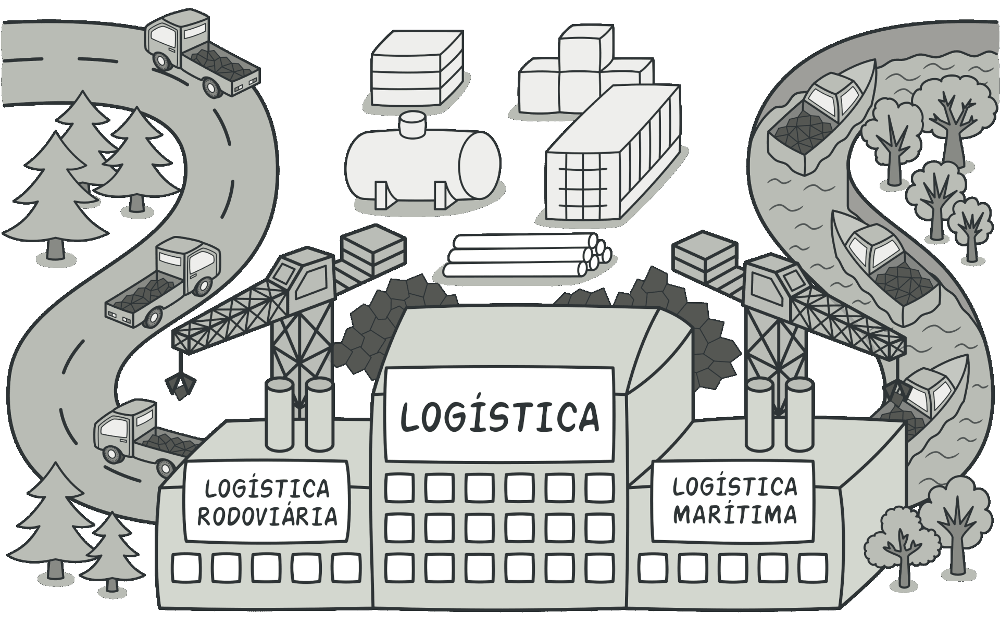

**Fonte da imagem:** extraída do PDF de referência enviado.

## 3.1.1 Intenção

O Factory Method fornece uma interface para criar objetos, mas permite que subclasses decidam qual classe concreta será instanciada.

Em outras palavras: o fluxo principal sabe que precisa de um objeto de determinado tipo, mas não fica acoplado ao `__init__` de uma classe concreta.

## 3.1.2 O problema

Imagine um backend de pedidos. No começo, ele só aceita PIX. Então o código fica assim:

```python
processor = PixPaymentProcessor()
processor.pay(order_id, amount)
```

Depois entra cartão. Depois boleto. Depois um gateway externo novo. Se a aplicação começa a espalhar `if payment_method == ...` por vários lugares, o código fica frágil.

```python
if payment_method == "pix":
    processor = PixPaymentProcessor()
elif payment_method == "credit_card":
    processor = CreditCardPaymentProcessor()
elif payment_method == "boleto":
    processor = BoletoPaymentProcessor()
```

O problema não é o `if` isolado. O problema é quando a criação dos objetos concretos se mistura com a regra de negócio em vários pontos.

## 3.1.3 A solução

O Factory Method move a decisão de criação para um método especializado. A classe base contém o fluxo comum. As subclasses escolhem o produto concreto.

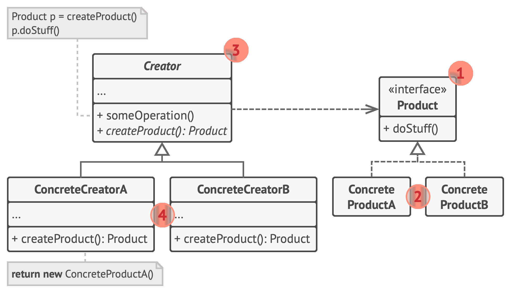

**Como ler a imagem:** existe um `Creator`, que contém alguma operação de negócio e chama `createProduct()`. As subclasses concretas sobrescrevem esse método para retornar produtos diferentes. O cliente usa a abstração, não os produtos concretos diretamente.

## 3.1.4 Exemplo em Python

```python
from abc import ABC, abstractmethod
from decimal import Decimal

class PaymentProcessor(ABC):
    @abstractmethod
    def pay(self, order_id: str, amount: Decimal) -> str:
        raise NotImplementedError

class PixPaymentProcessor(PaymentProcessor):
    def pay(self, order_id: str, amount: Decimal) -> str:
        return f"PIX confirmado para pedido {order_id}"

class CreditCardPaymentProcessor(PaymentProcessor):
    def pay(self, order_id: str, amount: Decimal) -> str:
        return f"Cartão aprovado para pedido {order_id}"

class PaymentFlow(ABC):
    def process(self, order_id: str, amount: Decimal) -> str:
        processor = self.create_processor()
        return processor.pay(order_id, amount)

    @abstractmethod
    def create_processor(self) -> PaymentProcessor:
        raise NotImplementedError

class PixPaymentFlow(PaymentFlow):
    def create_processor(self) -> PaymentProcessor:
        return PixPaymentProcessor()

class CreditCardPaymentFlow(PaymentFlow):
    def create_processor(self) -> PaymentProcessor:
        return CreditCardPaymentProcessor()


def run_checkout(flow: PaymentFlow) -> None:
    result = flow.process("ORDER-123", Decimal("149.90"))
    print(result)

run_checkout(PixPaymentFlow())
run_checkout(CreditCardPaymentFlow())
```

## 3.1.5 O que aconteceu no código?

`PaymentFlow` define o algoritmo comum: processar um pedido, obter um processador e executar o pagamento. Ela não sabe se será PIX ou cartão.

As subclasses `PixPaymentFlow` e `CreditCardPaymentFlow` mudam apenas a criação do processador. O método `create_processor()` é o Factory Method.

O código cliente chama `run_checkout()` usando a abstração `PaymentFlow`. Isso reduz acoplamento e facilita adicionar novas formas de pagamento sem alterar o fluxo principal.

## 3.1.6 Quando usar

Use Factory Method quando:

- você não sabe de antemão qual classe concreta será necessária;
- a criação do objeto varia conforme contexto, configuração ou subclasse;
- você quer permitir extensão sem alterar a classe base;
- existe um fluxo comum, mas uma etapa de criação precisa variar.

## 3.1.7 Quando evitar

Evite quando:

- a criação é simples e só existe uma classe concreta;
- a variação pode ser resolvida com uma função pequena;
- você está criando subclasses apenas para trocar uma linha de código sem ganho real.

## 3.1.8 Relação com outros padrões

Factory Method é mais simples que Abstract Factory. Ele cria um tipo de produto. Abstract Factory cria famílias de produtos relacionados. Factory Method também pode aparecer dentro de Template Method, quando uma etapa do algoritmo é justamente criar um objeto.

---

## 3.2 Abstract Factory

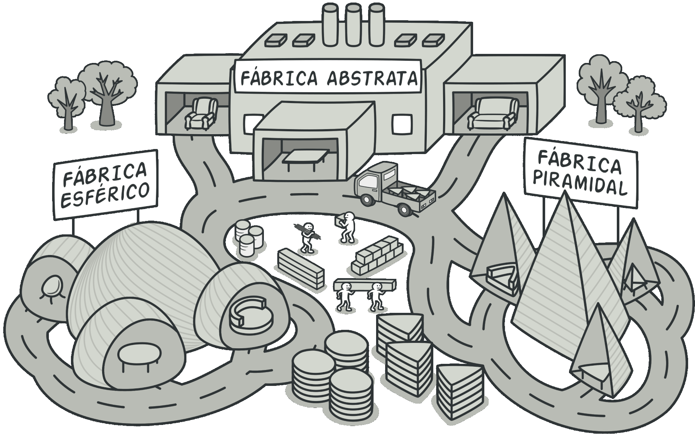

**Fonte da imagem:** extraída do PDF de referência enviado.

## 3.2.1 Intenção

Abstract Factory cria famílias de objetos relacionados sem que o código cliente precise conhecer as classes concretas.

A palavra-chave aqui é **família**. Factory Method costuma decidir um produto. Abstract Factory decide um conjunto de produtos que combinam entre si.

## 3.2.2 O problema

Imagine que seu backend integra com diferentes provedores de pagamento. Para cada provedor, você precisa de três objetos:

- processador de pagamento;
- processador de estorno;
- emissor de recibo.

Se você mistura `PixProcessor` com `StripeRefundProcessor` e `PagarmeReceipt`, pode criar uma combinação inconsistente. O código deveria garantir que todos os objetos da mesma família sejam compatíveis.

## 3.2.3 A solução

Criamos uma fábrica abstrata que sabe criar todos os objetos daquela família. Cada fábrica concreta representa uma variante completa.

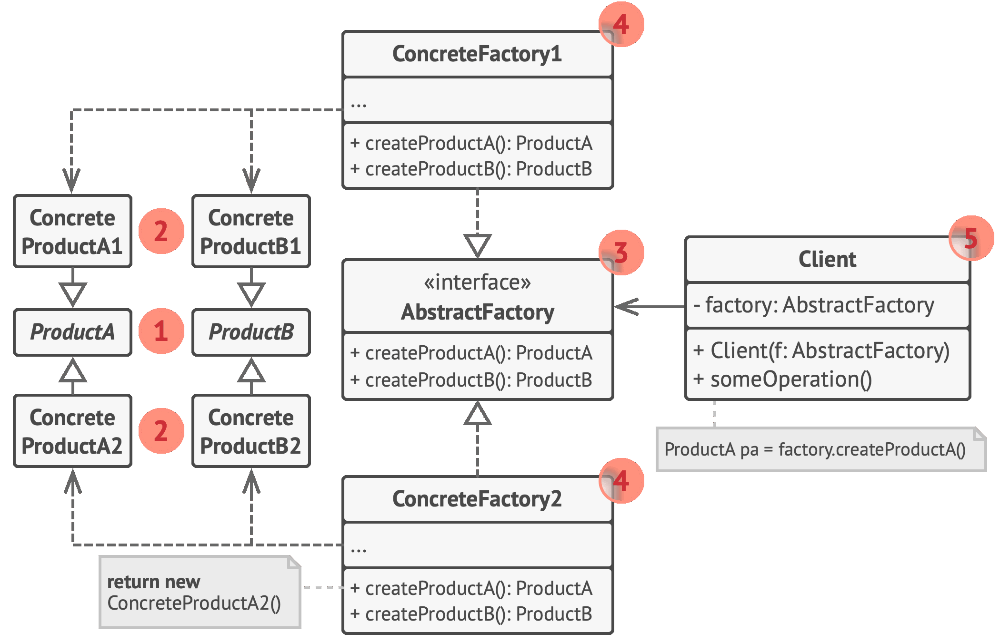

**Como ler a imagem:** a fábrica abstrata declara métodos para criar produtos abstratos. Cada fábrica concreta cria uma família compatível de produtos concretos. O cliente trabalha com interfaces, então não fica preso a uma variante específica.

## 3.2.4 Exemplo em Python

```python
from abc import ABC, abstractmethod
from decimal import Decimal

class PaymentProcessor(ABC):
    @abstractmethod
    def pay(self, amount: Decimal) -> str:
        raise NotImplementedError

class RefundProcessor(ABC):
    @abstractmethod
    def refund(self, transaction_id: str) -> str:
        raise NotImplementedError

class ReceiptIssuer(ABC):
    @abstractmethod
    def issue(self, transaction_id: str) -> str:
        raise NotImplementedError

class StripePayment(PaymentProcessor):
    def pay(self, amount: Decimal) -> str:
        return f"stripe-payment-{amount}"

class StripeRefund(RefundProcessor):
    def refund(self, transaction_id: str) -> str:
        return f"stripe-refund-{transaction_id}"

class StripeReceipt(ReceiptIssuer):
    def issue(self, transaction_id: str) -> str:
        return f"stripe-receipt-{transaction_id}"

class PagarmePayment(PaymentProcessor):
    def pay(self, amount: Decimal) -> str:
        return f"pagarme-payment-{amount}"

class PagarmeRefund(RefundProcessor):
    def refund(self, transaction_id: str) -> str:
        return f"pagarme-refund-{transaction_id}"

class PagarmeReceipt(ReceiptIssuer):
    def issue(self, transaction_id: str) -> str:
        return f"pagarme-receipt-{transaction_id}"

class PaymentProviderFactory(ABC):
    @abstractmethod
    def create_payment(self) -> PaymentProcessor:
        raise NotImplementedError

    @abstractmethod
    def create_refund(self) -> RefundProcessor:
        raise NotImplementedError

    @abstractmethod
    def create_receipt(self) -> ReceiptIssuer:
        raise NotImplementedError

class StripeFactory(PaymentProviderFactory):
    def create_payment(self) -> PaymentProcessor:
        return StripePayment()

    def create_refund(self) -> RefundProcessor:
        return StripeRefund()

    def create_receipt(self) -> ReceiptIssuer:
        return StripeReceipt()

class PagarmeFactory(PaymentProviderFactory):
    def create_payment(self) -> PaymentProcessor:
        return PagarmePayment()

    def create_refund(self) -> RefundProcessor:
        return PagarmeRefund()

    def create_receipt(self) -> ReceiptIssuer:
        return PagarmeReceipt()


def process_order(factory: PaymentProviderFactory, amount: Decimal) -> None:
    payment = factory.create_payment()
    receipt = factory.create_receipt()

    transaction_id = payment.pay(amount)
    receipt_code = receipt.issue(transaction_id)

    print(transaction_id)
    print(receipt_code)

process_order(StripeFactory(), Decimal("200.00"))
process_order(PagarmeFactory(), Decimal("200.00"))
```

## 3.2.5 O que aconteceu no código?

`PaymentProviderFactory` define uma família de objetos. Quem recebe essa fábrica não sabe se está usando Stripe ou Pagar.me. O cliente só sabe que pode criar pagamento, estorno e recibo.

Isso mantém consistência. Se a fábrica é `StripeFactory`, todos os produtos criados pertencem à família Stripe. Se amanhã surgir `MercadoPagoFactory`, o fluxo principal não precisa mudar.

## 3.2.6 Quando usar

Use Abstract Factory quando:

- existem famílias de objetos que precisam ser usadas juntas;
- você quer impedir combinações incompatíveis;
- a aplicação deve trocar uma família completa por configuração;
- você quer isolar dependências de provedores externos.

## 3.2.7 Quando evitar

Evite quando:

- você só precisa criar um objeto simples;
- não existem famílias de objetos relacionadas;
- a quantidade de interfaces e classes deixaria o sistema mais pesado do que o problema.

## 3.2.8 Factory Method vs Abstract Factory

Factory Method responde: “qual produto esta subclasse deve criar?”

Abstract Factory responde: “qual família completa de produtos compatíveis esta aplicação deve usar?”

---

## 3.3 Builder

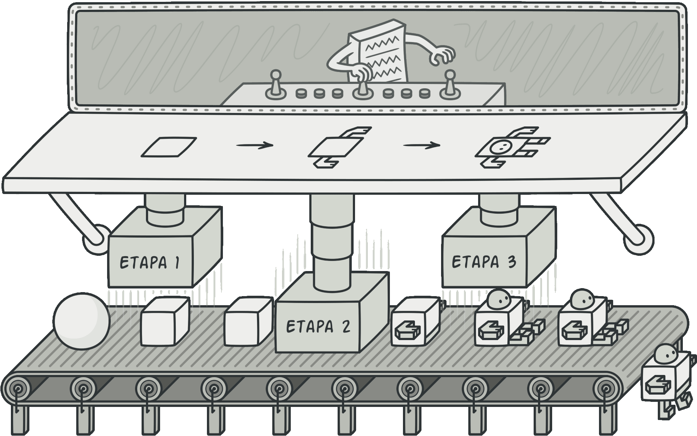

**Fonte da imagem:** extraída do PDF de referência enviado.

## 3.3.1 Intenção

Builder constrói objetos complexos passo a passo. Ele evita construtores enormes, com muitos parâmetros opcionais, booleanos confusos e combinações difíceis de ler.

## 3.3.2 O problema

Imagine um objeto `PaymentRequest` com muitos dados opcionais:

- `order_id`;
- `amount`;
- `currency`;
- `customer_id`;
- `metadata`;
- `installments`;
- `capture_now`;
- `antifraud_enabled`;
- `webhook_url`.

Um construtor assim fica ruim:

```python
request = PaymentRequest(
    "ORDER-1", 100, "BRL", "CUSTOMER-1", None, 1, True, True, None
)
```

É difícil saber o que cada valor significa. Se vários parâmetros forem opcionais, a chamada fica ainda mais confusa.

## 3.3.3 A solução

Builder separa a construção em etapas nomeadas. O objeto final só é retornado quando estiver pronto.

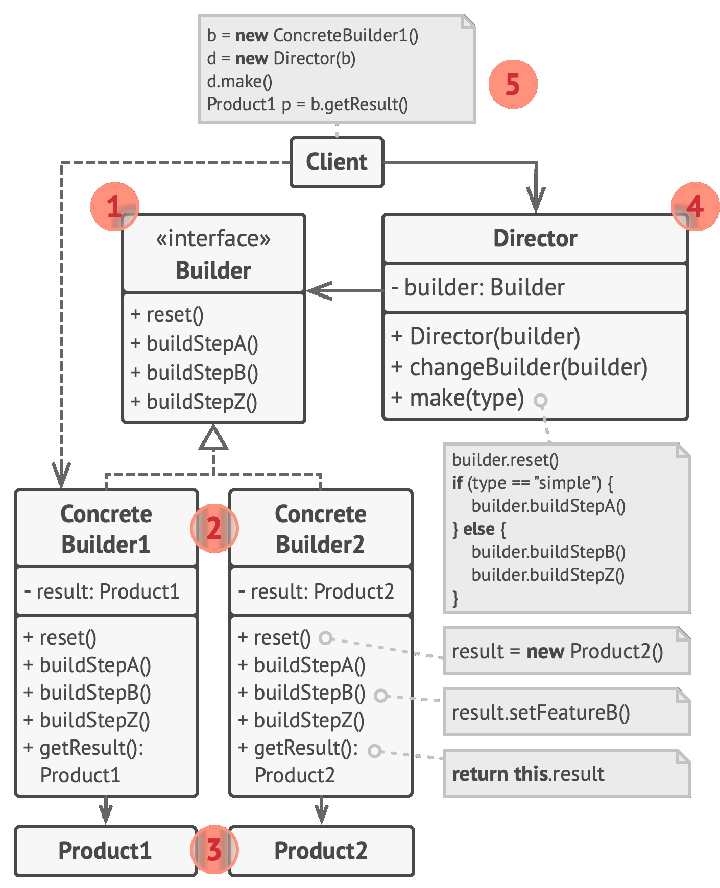

**Como ler a imagem:** existe um `Builder` com etapas de construção. Builders concretos implementam essas etapas. Um `Director` pode organizar uma sequência padrão, mas em Python muitas vezes o próprio cliente chama as etapas fluentemente.

## 3.3.4 Exemplo em Python

```python
from dataclasses import dataclass, field
from decimal import Decimal

@dataclass(frozen=True)
class PaymentRequest:
    order_id: str
    amount: Decimal
    currency: str = "BRL"
    customer_id: str | None = None
    installments: int = 1
    capture_now: bool = True
    antifraud_enabled: bool = False
    metadata: dict[str, str] = field(default_factory=dict)

class PaymentRequestBuilder:
    def __init__(self, order_id: str, amount: Decimal):
        self._order_id = order_id
        self._amount = amount
        self._currency = "BRL"
        self._customer_id = None
        self._installments = 1
        self._capture_now = True
        self._antifraud_enabled = False
        self._metadata = {}

    def with_customer(self, customer_id: str):
        self._customer_id = customer_id
        return self

    def in_installments(self, installments: int):
        if installments < 1:
            raise ValueError("installments deve ser maior ou igual a 1")
        self._installments = installments
        return self

    def with_antifraud(self):
        self._antifraud_enabled = True
        return self

    def add_metadata(self, key: str, value: str):
        self._metadata[key] = value
        return self

    def build(self) -> PaymentRequest:
        return PaymentRequest(
            order_id=self._order_id,
            amount=self._amount,
            currency=self._currency,
            customer_id=self._customer_id,
            installments=self._installments,
            capture_now=self._capture_now,
            antifraud_enabled=self._antifraud_enabled,
            metadata=self._metadata,
        )

request = (
    PaymentRequestBuilder("ORDER-123", Decimal("350.00"))
    .with_customer("CUSTOMER-9")
    .in_installments(3)
    .with_antifraud()
    .add_metadata("source", "mobile")
    .build()
)

print(request)
```

## 3.3.5 O que aconteceu no código?

O construtor do `PaymentRequest` deixou de receber uma lista confusa de parâmetros. O builder oferece métodos com nomes claros. A criação fica mais legível e cada etapa pode validar uma regra.

O objeto final foi definido como `frozen=True`, tornando-o imutável. Isso é útil em backend quando você quer criar comandos ou payloads que não devem mudar depois de prontos.

## 3.3.6 Quando usar

Use Builder quando:

- um objeto tem muitos parâmetros opcionais;
- a criação precisa seguir várias etapas;
- você quer validar partes da construção;
- a chamada do construtor está difícil de ler;
- você precisa criar variações do mesmo objeto.

## 3.3.7 Quando evitar

Evite quando:

- o objeto é simples;
- um `dataclass` com poucos campos já resolve;
- o builder vira apenas uma cópia verbosa do construtor sem validação nem clareza.

---

## 3.4 Prototype

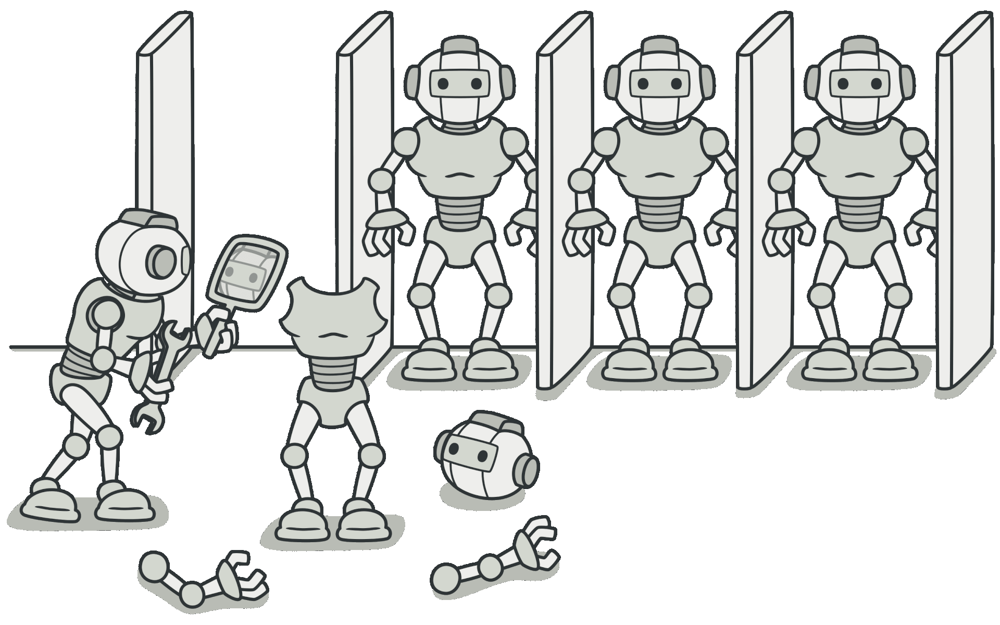

**Fonte da imagem:** extraída do PDF de referência enviado.

## 3.4.1 Intenção

Prototype permite criar novos objetos copiando objetos existentes, sem acoplar o código à classe concreta do objeto copiado.

## 3.4.2 O problema

Imagine que seu backend envia notificações. Existem modelos padrão de mensagem para diferentes situações:

- pagamento aprovado;
- pedido cancelado;
- entrega atrasada.

Cada modelo tem muitos campos: título, corpo, canal, prioridade, tags, configurações de retry e metadados. Criar tudo do zero a cada envio pode ser repetitivo.

## 3.4.3 A solução

Você mantém protótipos prontos e clona quando precisar de uma variação. Depois altera apenas os campos específicos daquele envio.

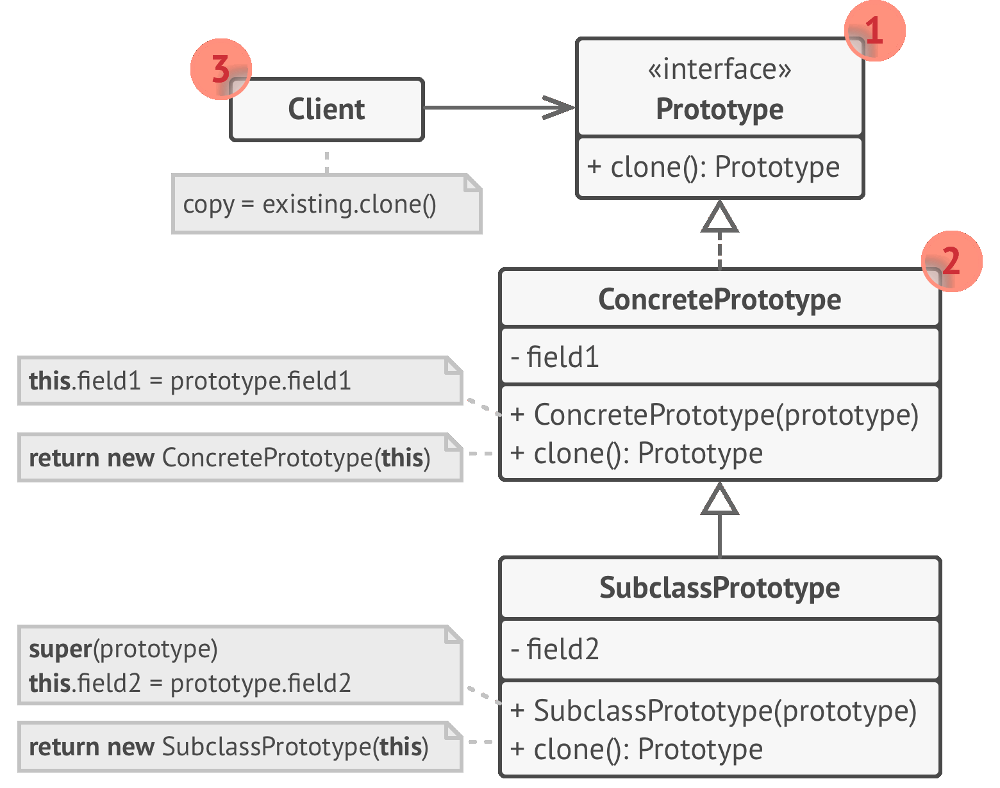

**Como ler a imagem:** o cliente pede uma cópia para um objeto protótipo. O protótipo sabe como se clonar. Assim, o cliente não precisa conhecer todos os detalhes da classe concreta nem reconstruir o objeto manualmente.

## 3.4.4 Exemplo em Python

```python
from copy import deepcopy
from dataclasses import dataclass, field

@dataclass
class NotificationTemplate:
    title: str
    body: str
    channel: str
    priority: str = "normal"
    metadata: dict[str, str] = field(default_factory=dict)

    def clone(self) -> "NotificationTemplate":
        return deepcopy(self)

payment_approved_template = NotificationTemplate(
    title="Pagamento aprovado",
    body="Seu pagamento foi confirmado.",
    channel="email",
    priority="high",
    metadata={"category": "payment"},
)

message = payment_approved_template.clone()
message.body = "Seu pagamento do pedido ORDER-123 foi confirmado."
message.metadata["order_id"] = "ORDER-123"

print(payment_approved_template)
print(message)
```

## 3.4.5 O que aconteceu no código?

`payment_approved_template` é o protótipo. Ele representa uma configuração base. Quando precisamos enviar uma mensagem específica, fazemos uma cópia e alteramos apenas o necessário.

Usamos `deepcopy()` porque `metadata` é um dicionário. Se usássemos cópia rasa, o protótipo e a cópia poderiam compartilhar o mesmo dicionário interno, causando bugs difíceis de perceber.

## 3.4.6 Quando usar

Use Prototype quando:

- criar um objeto do zero é caro ou repetitivo;
- você tem objetos base que servem como modelos;
- quer evitar acoplamento com classes concretas;
- precisa gerar variações pequenas de uma configuração.

## 3.4.7 Quando evitar

Evite quando:

- a cópia pode esconder efeitos colaterais;
- o objeto possui recursos externos abertos, como conexões, arquivos ou sockets;
- a diferença entre cópia rasa e profunda não está clara para o time.

---

## 3.5 Singleton

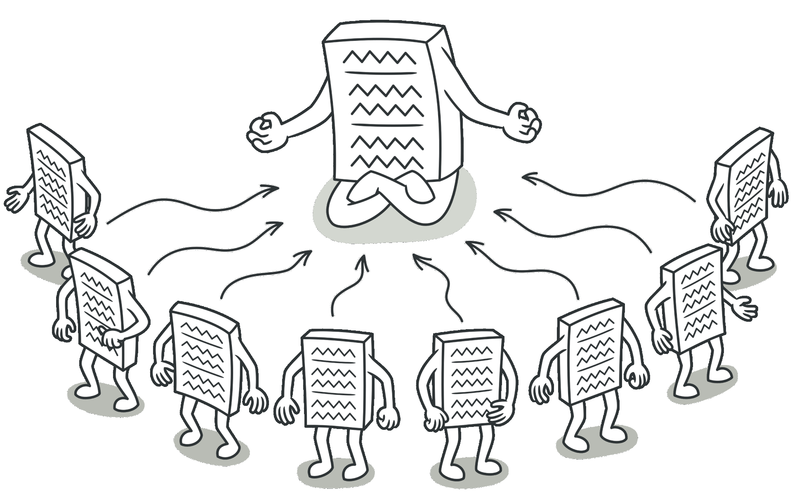

**Fonte da imagem:** extraída do PDF de referência enviado.

## 3.5.1 Intenção

Singleton garante que uma classe tenha apenas uma instância e fornece um ponto global de acesso a ela.

Esse padrão deve ser usado com cuidado. Em Python, muitas vezes um módulo, injeção de dependência ou objeto de configuração passado explicitamente é melhor do que criar um Singleton global.

## 3.5.2 O problema

Algumas informações precisam ser carregadas uma única vez:

- configurações da aplicação;
- cliente de feature flags;
- registry de plugins;
- cache local em memória.

Se cada parte do sistema cria sua própria instância, você pode duplicar estado, desperdiçar recursos ou ter comportamentos inconsistentes.

## 3.5.3 A solução

A classe controla sua própria criação. Na primeira chamada, cria a instância. Nas próximas, devolve a mesma.

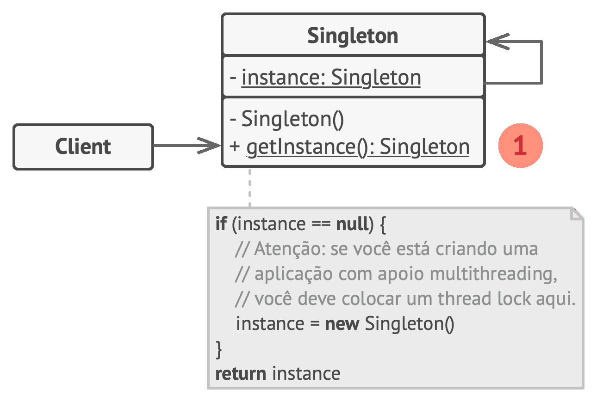

**Como ler a imagem:** o cliente não cria múltiplas instâncias reais. Ele chama um ponto de acesso, e a classe garante que sempre será retornada a mesma instância.

## 3.5.4 Exemplo em Python

```python
import threading

class Settings:
    _instance = None
    _lock = threading.Lock()

    def __new__(cls):
        if cls._instance is None:
            with cls._lock:
                if cls._instance is None:
                    instance = super().__new__(cls)
                    instance.env = "development"
                    instance.debug = True
                    cls._instance = instance
        return cls._instance

settings_a = Settings()
settings_b = Settings()

print(settings_a is settings_b)
print(settings_a.env)
```

## 3.5.5 O que aconteceu no código?

`__new__()` controla a criação do objeto. Se `_instance` ainda não existe, a classe cria e guarda. Se já existe, retorna a instância existente.

O `Lock` evita que duas threads criem instâncias ao mesmo tempo. A dupla verificação reduz o custo de lock depois que a instância já existe.

## 3.5.6 Quando usar

Use Singleton quando:

- uma única instância precisa existir por processo;
- o custo de inicialização é alto;
- o estado compartilhado é intencional e controlado;
- você realmente precisa de um ponto global de acesso.

## 3.5.7 Quando evitar

Evite Singleton quando:

- ele torna testes difíceis;
- ele esconde dependências;
- diferentes partes do sistema deveriam receber configurações diferentes;
- você está usando Singleton como “variável global gourmet”.

## 3.5.8 Alternativas comuns em backend

Em aplicações FastAPI, Flask, Django ou serviços workers, muitas vezes é melhor:

- criar o objeto no startup da aplicação;
- registrar no container de dependências;
- passar explicitamente para services;
- usar módulos de configuração;
- usar factories com cache controlado.

Singleton é útil, mas deve ser uma decisão consciente.

---

# 4. Padrões estruturais

Padrões estruturais explicam como montar classes e objetos em estruturas maiores. Eles são muito úteis em backend porque sistemas reais lidam com integrações externas, bibliotecas de terceiros, código legado, wrappers, clientes HTTP e camadas de infraestrutura.

---

## 4.1 Adapter

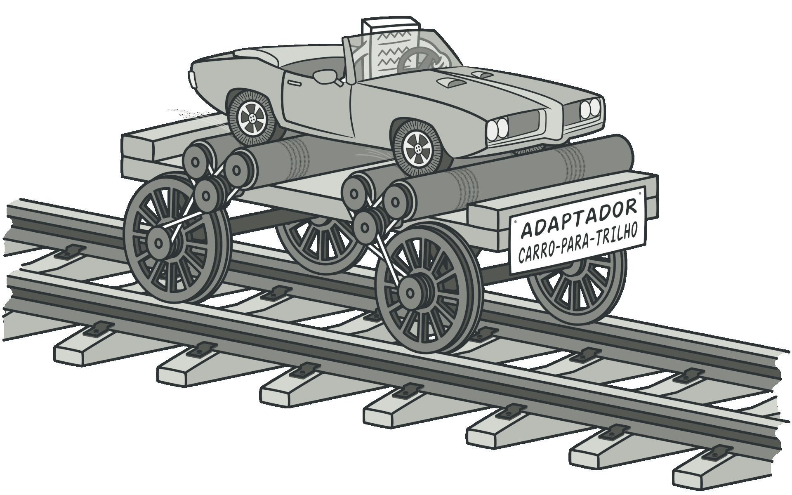

**Fonte da imagem:** extraída do PDF de referência enviado.

## 4.1.1 Intenção

Adapter permite que objetos com interfaces incompatíveis trabalhem juntos.

Ele cria uma camada intermediária que apresenta ao seu sistema a interface esperada, enquanto traduz a chamada para a interface real de um serviço externo ou código legado.

## 4.1.2 O problema

Sua regra de negócio espera isso:

```python
processor.pay(order_id, amount)
```

Mas a biblioteca externa fornece isso:

```python
gateway.charge(value_in_cents, reference, api_key)
```

Você não quer espalhar essa conversão pela aplicação. Também não quer que a regra de negócio conheça detalhes do gateway externo.

## 4.1.3 A solução

Crie um Adapter que implemente a interface do seu sistema e, por dentro, chame a biblioteca externa.

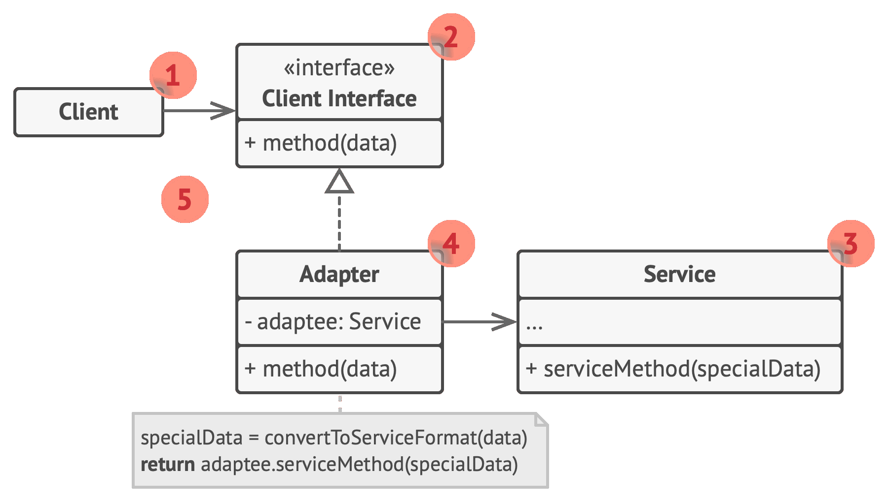

**Como ler a imagem:** o cliente conhece uma interface alvo. O Adapter implementa essa interface e encaminha a chamada para o serviço incompatível. O serviço real não precisa ser alterado.

## 4.1.4 Exemplo em Python

```python
from abc import ABC, abstractmethod
from decimal import Decimal

class PaymentProcessor(ABC):
    @abstractmethod
    def pay(self, order_id: str, amount: Decimal) -> str:
        raise NotImplementedError

class LegacyBankGateway:
    def charge(self, value_in_cents: int, reference: str, token: str) -> dict:
        return {
            "status": "approved",
            "transaction_code": f"legacy-{reference}",
        }

class LegacyBankAdapter(PaymentProcessor):
    def __init__(self, gateway: LegacyBankGateway, token: str):
        self.gateway = gateway
        self.token = token

    def pay(self, order_id: str, amount: Decimal) -> str:
        value_in_cents = int(amount * 100)
        response = self.gateway.charge(
            value_in_cents=value_in_cents,
            reference=order_id,
            token=self.token,
        )
        return response["transaction_code"]


def checkout(processor: PaymentProcessor) -> None:
    transaction_id = processor.pay("ORDER-123", Decimal("99.90"))
    print(transaction_id)

gateway = LegacyBankGateway()
adapter = LegacyBankAdapter(gateway, token="secret-token")
checkout(adapter)
```

## 4.1.5 O que aconteceu no código?

A função `checkout()` não sabe que existe um gateway legado. Ela depende apenas de `PaymentProcessor`.

O `LegacyBankAdapter` converte:

- `Decimal` para centavos;
- `order_id` para `reference`;
- resposta externa para `transaction_id`.

A tradução fica em um lugar só. Se o gateway mudar, você altera o adapter, não a regra de negócio.

## 4.1.6 Quando usar

Use Adapter quando:

- uma biblioteca externa tem interface incompatível;
- você quer isolar código legado;
- seu domínio não deve conhecer detalhes de infraestrutura;
- precisa padronizar múltiplos provedores diferentes atrás de um contrato comum.

## 4.1.7 Quando evitar

Evite quando:

- você controla os dois lados e pode simplesmente padronizar a interface;
- a camada de adaptação não faz tradução real;
- o Adapter começa a virar um “Deus objeto” com regra de negócio demais.

---

## 4.2 Facade

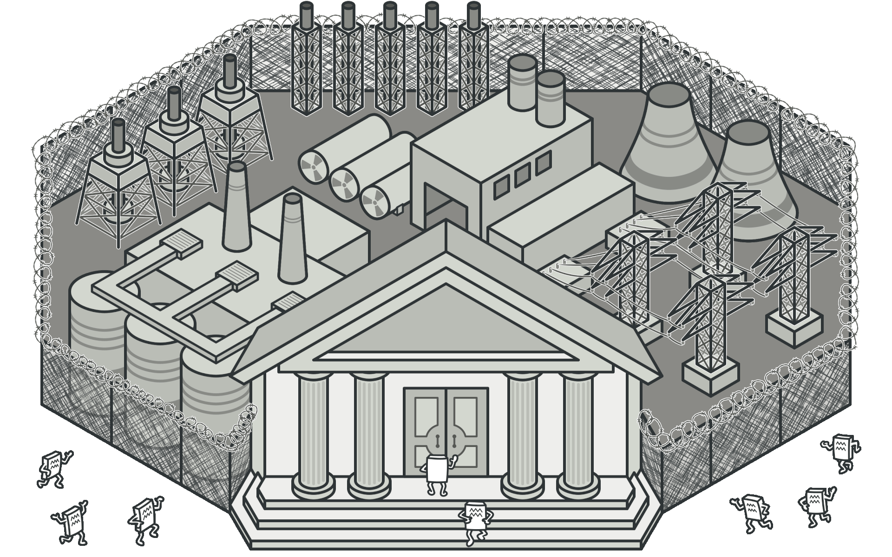

**Fonte da imagem:** extraída do PDF de referência enviado.

## 4.2.1 Intenção

Facade fornece uma interface simples para um subsistema complexo.

No backend, uma Facade costuma aparecer em fluxos de aplicação: checkout, cadastro, onboarding, envio de notificação ou processamento de arquivo. Ela não precisa esconder tudo, mas oferece um ponto de entrada mais claro para casos de uso importantes.

## 4.2.2 O problema

Um checkout pode envolver várias etapas:

- validar pedido;
- reservar estoque;
- cobrar pagamento;
- criar nota/recibo;
- enviar email;
- publicar evento.

Se o controller conhece todos esses detalhes, ele fica grande demais.

## 4.2.3 A solução

Criamos uma Facade que representa o caso de uso em uma operação clara: `checkout.execute(...)`.

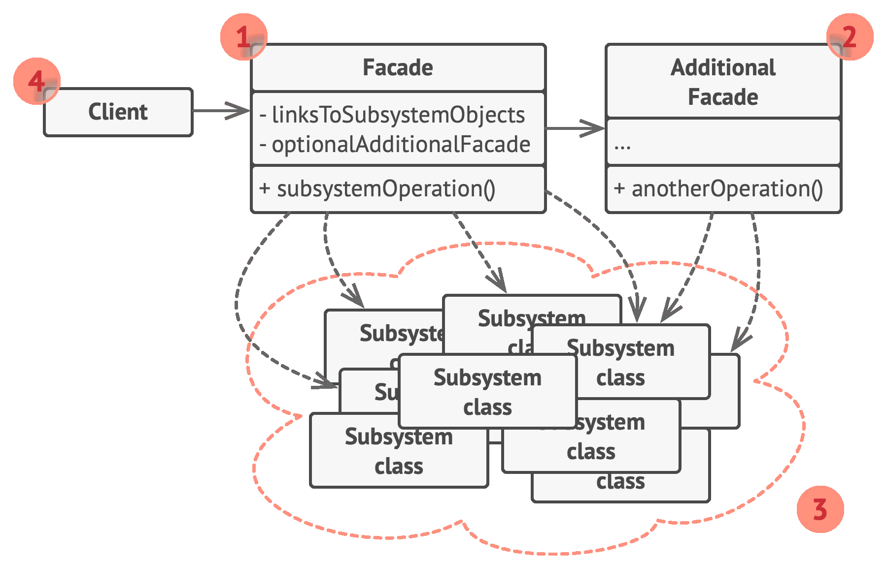

**Como ler a imagem:** o cliente conversa com a fachada. A fachada coordena classes internas do subsistema. As classes internas podem continuar complexas, mas o cliente não precisa lidar diretamente com todas elas.

## 4.2.4 Exemplo em Python

```python
from decimal import Decimal

class StockService:
    def reserve(self, order_id: str) -> None:
        print(f"Estoque reservado para {order_id}")

class PaymentService:
    def charge(self, order_id: str, amount: Decimal) -> str:
        return f"tx-{order_id}"

class ReceiptService:
    def issue(self, transaction_id: str) -> str:
        return f"receipt-{transaction_id}"

class EmailService:
    def send_confirmation(self, order_id: str, receipt_id: str) -> None:
        print(f"Email enviado para {order_id} com recibo {receipt_id}")

class CheckoutFacade:
    def __init__(
        self,
        stock: StockService,
        payment: PaymentService,
        receipt: ReceiptService,
        email: EmailService,
    ):
        self.stock = stock
        self.payment = payment
        self.receipt = receipt
        self.email = email

    def execute(self, order_id: str, amount: Decimal) -> str:
        self.stock.reserve(order_id)
        transaction_id = self.payment.charge(order_id, amount)
        receipt_id = self.receipt.issue(transaction_id)
        self.email.send_confirmation(order_id, receipt_id)
        return receipt_id

checkout = CheckoutFacade(
    stock=StockService(),
    payment=PaymentService(),
    receipt=ReceiptService(),
    email=EmailService(),
)

receipt = checkout.execute("ORDER-123", Decimal("249.90"))
print(receipt)
```

## 4.2.5 O que aconteceu no código?

O cliente não precisa conhecer quatro serviços diferentes. Ele chama `execute()`.

A Facade coordena o fluxo. Ela não substitui as classes internas nem impede que elas sejam usadas diretamente em outros contextos. Ela apenas cria uma porta de entrada mais simples para um fluxo comum.

## 4.2.6 Quando usar

Use Facade quando:

- um fluxo exige coordenação de várias classes;
- controllers ou handlers estão grandes demais;
- você quer esconder complexidade de um subsistema;
- deseja oferecer uma API interna simples para uma operação complexa.

## 4.2.7 Quando evitar

Evite quando:

- a Facade vira uma classe gigante com todas as regras do sistema;
- ela apenas repassa chamadas sem simplificar nada;
- ela mistura responsabilidades de domínio, infraestrutura e apresentação.

---

## 4.3 Decorator

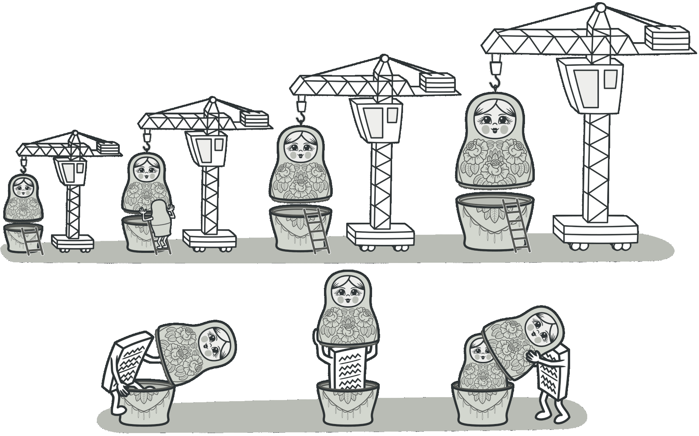

**Fonte da imagem:** extraída do PDF de referência enviado.

## 4.3.1 Intenção

Decorator adiciona comportamento a um objeto sem alterar sua classe original e sem criar uma explosão de subclasses.

Em backend, ele é útil para adicionar logging, cache, retry, métricas, validação ou autorização em volta de um serviço existente.

## 4.3.2 O problema

Imagine um repositório de produtos:

```python
repository.get_by_id(product_id)
```

Depois você quer adicionar cache. Depois logs. Depois métricas. Depois fallback. Se criar subclasses para cada combinação, a hierarquia cresce rápido:

- `CachedProductRepository`;
- `LoggedProductRepository`;
- `CachedLoggedProductRepository`;
- `MetricCachedLoggedProductRepository`.

Isso não escala.

## 4.3.3 A solução

Decorators envolvem um objeto mantendo a mesma interface. Cada decorator adiciona uma responsabilidade.

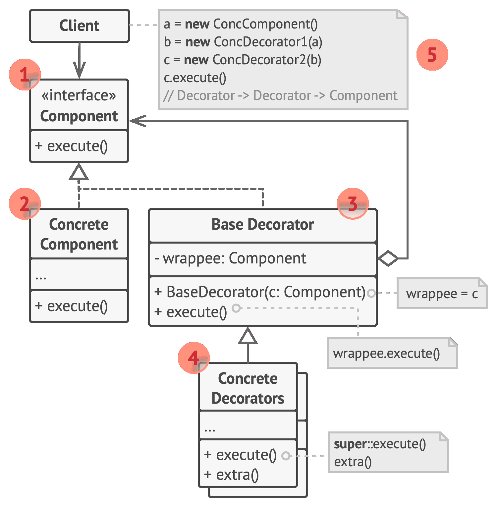

**Como ler a imagem:** componente e decorador seguem a mesma interface. O decorador guarda uma referência para outro componente e adiciona comportamento antes ou depois de delegar a chamada.

## 4.3.4 Exemplo em Python com objeto decorador

```python
from abc import ABC, abstractmethod

class ProductRepository(ABC):
    @abstractmethod
    def get_by_id(self, product_id: str) -> dict:
        raise NotImplementedError

class DatabaseProductRepository(ProductRepository):
    def get_by_id(self, product_id: str) -> dict:
        print("Buscando no banco...")
        return {"id": product_id, "name": "Teclado Mecânico"}

class CachedProductRepository(ProductRepository):
    def __init__(self, wrapped: ProductRepository):
        self.wrapped = wrapped
        self.cache: dict[str, dict] = {}

    def get_by_id(self, product_id: str) -> dict:
        if product_id not in self.cache:
            self.cache[product_id] = self.wrapped.get_by_id(product_id)
        return self.cache[product_id]

class LoggedProductRepository(ProductRepository):
    def __init__(self, wrapped: ProductRepository):
        self.wrapped = wrapped

    def get_by_id(self, product_id: str) -> dict:
        print(f"[LOG] Buscando produto {product_id}")
        product = self.wrapped.get_by_id(product_id)
        print(f"[LOG] Produto encontrado: {product['name']}")
        return product

repository = LoggedProductRepository(
    CachedProductRepository(
        DatabaseProductRepository()
    )
)

print(repository.get_by_id("P-1"))
print(repository.get_by_id("P-1"))
```

## 4.3.5 O que aconteceu no código?

`DatabaseProductRepository` continua simples. O cache foi adicionado por `CachedProductRepository`. O log foi adicionado por `LoggedProductRepository`.

Todos implementam a mesma interface `ProductRepository`, então podem ser combinados em camadas. O cliente continua chamando `get_by_id()`.

Na primeira chamada, o banco é acessado. Na segunda, o cache evita nova busca.

## 4.3.6 Decorator de objeto vs decorator de função

Em Python, a palavra “decorator” também aparece na sintaxe:

```python
@meu_decorator
def funcao():
    ...
```

Isso é relacionado, mas não é exatamente a mesma implementação do padrão GoF. O padrão Decorator clássico trabalha com objetos que compartilham uma interface. Decorators de função também adicionam comportamento sem alterar a função original, mas normalmente são usados em outro nível de abstração.

## 4.3.7 Quando usar

Use Decorator quando:

- você quer adicionar responsabilidades de forma combinável;
- herança geraria muitas subclasses;
- deseja manter a mesma interface;
- precisa adicionar cache, log, métricas, retry ou validação ao redor de um serviço.

## 4.3.8 Quando evitar

Evite quando:

- a ordem dos decorators fica confusa;
- muitos wrappers dificultam debugging;
- o time não consegue identificar qual camada executa qual comportamento;
- uma função simples resolveria melhor.

---

# 5. Padrões comportamentais

Padrões comportamentais organizam a colaboração entre objetos. Eles ajudam quando a pergunta principal não é “como criar?” nem “como montar?”, mas sim “como os objetos interagem?” ou “como trocar uma regra sem quebrar o fluxo?”.

---

## 5.1 Strategy


**Fonte da imagem:** extraída do PDF de referência enviado.

## 5.1.1 Intenção

Strategy permite definir uma família de algoritmos, colocar cada um em uma classe separada e torná-los intercambiáveis.

Em backend, Strategy é muito comum para cálculo de frete, cálculo de taxa, seleção de gateway, regra de desconto, política de retry ou validação por tipo de cliente.

## 5.1.2 O problema

Imagine uma função de cálculo de taxa:

```python
if customer_type == "common":
    fee = amount * 0.05
elif customer_type == "premium":
    fee = amount * 0.02
elif customer_type == "partner":
    fee = amount * 0.01
```

Isso é aceitável no começo. Mas quando regras crescem, a classe vira um amontoado de condicionais. Adicionar uma nova política exige alterar o código existente.

## 5.1.3 A solução

Extraímos cada algoritmo para uma Strategy. O contexto recebe uma estratégia e delega o cálculo.

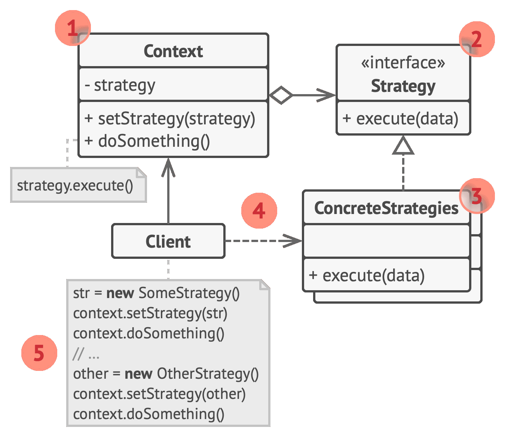

**Como ler a imagem:** o contexto mantém uma referência para uma estratégia. Todas as estratégias seguem a mesma interface. O cliente escolhe qual estratégia será usada, e o contexto executa sem conhecer a implementação concreta.

## 5.1.4 Exemplo em Python

```python
from abc import ABC, abstractmethod
from decimal import Decimal

class FeeStrategy(ABC):
    @abstractmethod
    def calculate(self, amount: Decimal) -> Decimal:
        raise NotImplementedError

class CommonCustomerFee(FeeStrategy):
    def calculate(self, amount: Decimal) -> Decimal:
        return amount * Decimal("0.05")

class PremiumCustomerFee(FeeStrategy):
    def calculate(self, amount: Decimal) -> Decimal:
        return amount * Decimal("0.02")

class PartnerCustomerFee(FeeStrategy):
    def calculate(self, amount: Decimal) -> Decimal:
        return amount * Decimal("0.01")

class FeeCalculator:
    def __init__(self, strategy: FeeStrategy):
        self.strategy = strategy

    def calculate_total(self, amount: Decimal) -> Decimal:
        fee = self.strategy.calculate(amount)
        return amount + fee

calculator = FeeCalculator(PremiumCustomerFee())
print(calculator.calculate_total(Decimal("100.00")))
```

## 5.1.5 O que aconteceu no código?

`FeeCalculator` não conhece as regras concretas. Ele só chama `strategy.calculate()`.

Cada regra fica isolada em uma classe. Isso facilita testes e permite trocar a estratégia sem alterar o contexto.

## 5.1.6 Quando usar

Use Strategy quando:

- existem várias formas de executar a mesma tarefa;
- você quer trocar algoritmo em tempo de execução;
- condicionais estão crescendo demais;
- cada regra precisa ser testada isoladamente;
- o algoritmo muda com frequência.

## 5.1.7 Quando evitar

Evite quando:

- só existem duas regras simples e estáveis;
- a criação das strategies fica mais complexa do que o cálculo em si;
- o time não ganha clareza com a separação.

---

## 5.2 Observer

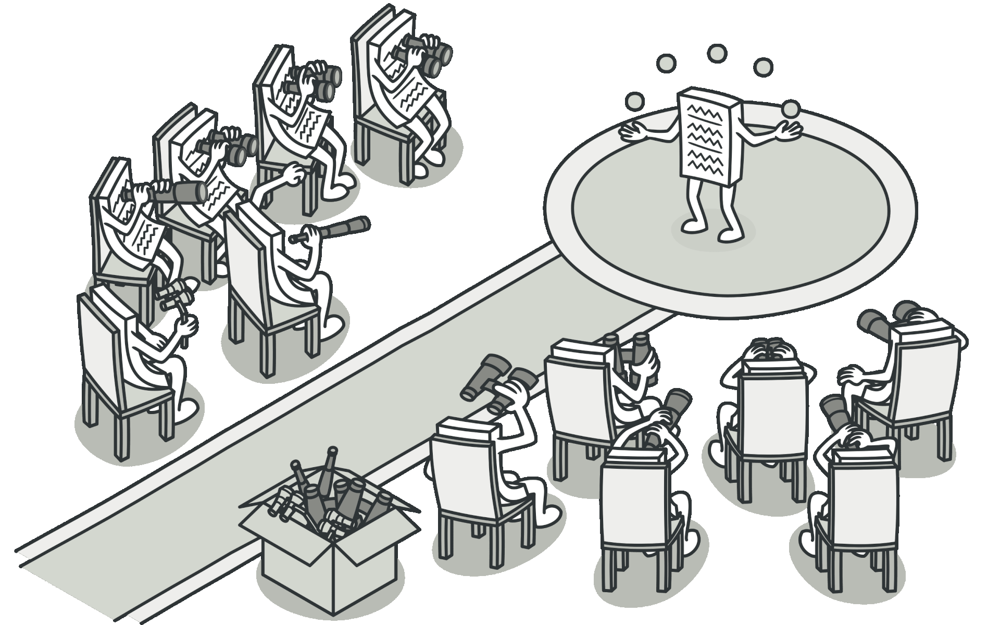

**Fonte da imagem:** extraída do PDF de referência enviado.

## 5.2.1 Intenção

Observer define uma dependência um-para-muitos: quando um objeto muda de estado ou publica um evento, vários interessados são notificados automaticamente.

Em backend, esse padrão aparece como eventos de domínio, hooks internos, listeners, subscribers e dispatchers.

## 5.2.2 O problema

Depois que um pedido é pago, várias coisas podem acontecer:

- enviar email;
- atualizar analytics;
- liberar estoque;
- registrar auditoria;
- publicar evento para outro serviço.

Se o serviço de pagamento chamar tudo diretamente, ele fica acoplado a muitos detalhes.

## 5.2.3 A solução

O serviço publica um evento. Observadores registrados reagem ao evento.

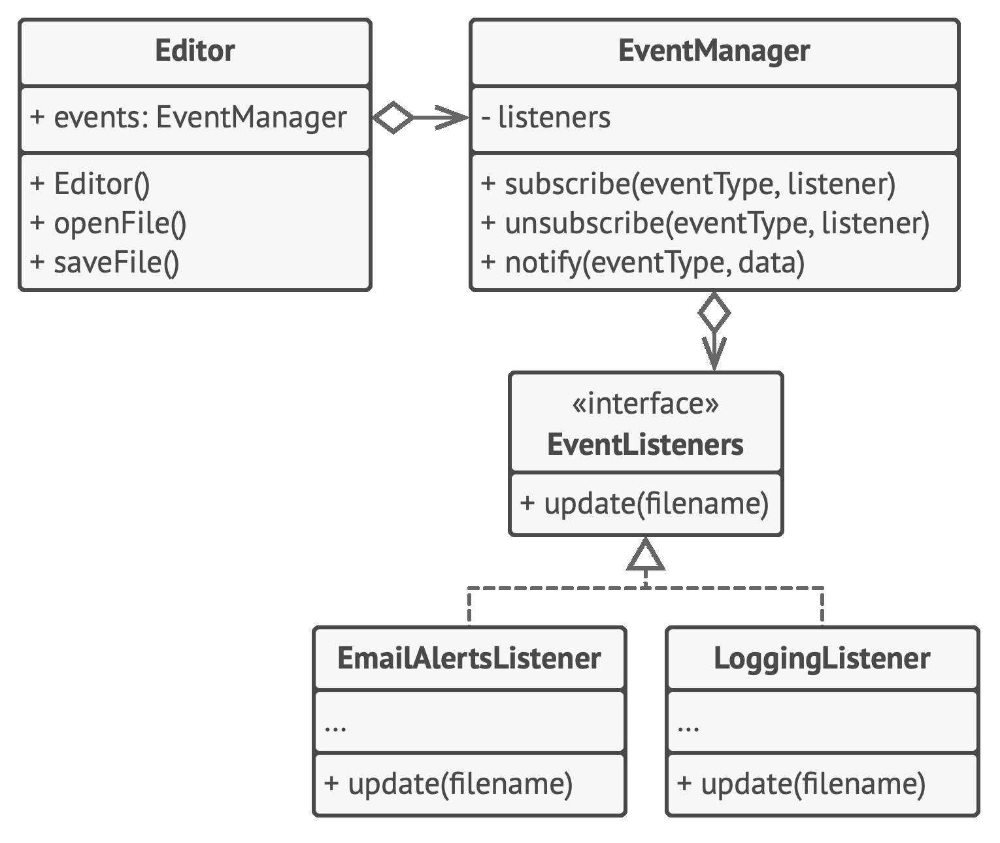

**Como ler a imagem:** o publisher mantém uma lista de subscribers. Quando algo acontece, ele notifica todos. Os subscribers podem entrar ou sair da lista sem alterar o publisher.

## 5.2.4 Exemplo em Python

```python
from abc import ABC, abstractmethod
from dataclasses import dataclass
from decimal import Decimal

@dataclass(frozen=True)
class OrderPaidEvent:
    order_id: str
    amount: Decimal
    transaction_id: str

class EventListener(ABC):
    @abstractmethod
    def handle(self, event: OrderPaidEvent) -> None:
        raise NotImplementedError

class EmailListener(EventListener):
    def handle(self, event: OrderPaidEvent) -> None:
        print(f"Enviando email do pedido {event.order_id}")

class AnalyticsListener(EventListener):
    def handle(self, event: OrderPaidEvent) -> None:
        print(f"Registrando analytics: {event.amount}")

class AuditListener(EventListener):
    def handle(self, event: OrderPaidEvent) -> None:
        print(f"Auditando transação {event.transaction_id}")

class EventDispatcher:
    def __init__(self):
        self.listeners: list[EventListener] = []

    def subscribe(self, listener: EventListener) -> None:
        self.listeners.append(listener)

    def dispatch(self, event: OrderPaidEvent) -> None:
        for listener in self.listeners:
            listener.handle(event)

dispatcher = EventDispatcher()
dispatcher.subscribe(EmailListener())
dispatcher.subscribe(AnalyticsListener())
dispatcher.subscribe(AuditListener())

event = OrderPaidEvent(
    order_id="ORDER-123",
    amount=Decimal("199.90"),
    transaction_id="TX-999",
)

dispatcher.dispatch(event)
```

## 5.2.5 O que aconteceu no código?

`EventDispatcher` não sabe o que cada listener faz. Ele apenas chama `handle()`.

O evento `OrderPaidEvent` carrega os dados necessários. Se amanhã você quiser enviar SMS, basta criar um novo listener e registrá-lo. O fluxo de pagamento não precisa ser alterado.

## 5.2.6 Observer em memória vs mensageria

Esse exemplo é em memória, dentro do mesmo processo. Em sistemas distribuídos, o mesmo conceito pode evoluir para filas, brokers e streaming de eventos, como RabbitMQ, Kafka ou Redis Streams.

A diferença é importante:

- Observer em memória é simples, rápido e local.
- Mensageria é distribuída, mais robusta, mas exige lidar com retry, idempotência, ordenação e falhas.

## 5.2.7 Quando usar

Use Observer quando:

- vários comportamentos devem reagir a um evento;
- você quer evitar acoplamento direto entre emissor e ações secundárias;
- listeners podem mudar com frequência;
- o fluxo principal não deve conhecer todos os efeitos colaterais.

## 5.2.8 Quando evitar

Evite quando:

- a ordem dos listeners é crítica e não está explícita;
- falhas em listeners precisam de transação forte;
- o evento vira um mecanismo escondido que dificulta rastrear o fluxo;
- seria mais claro chamar diretamente uma dependência.

---

## 5.3 Template Method

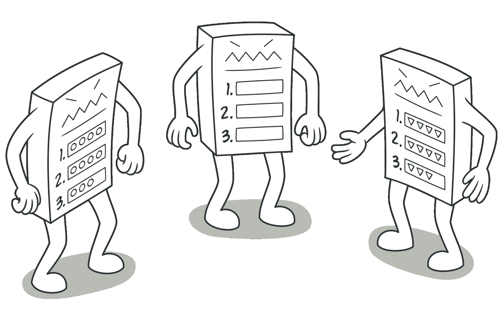

**Fonte da imagem:** extraída do PDF de referência enviado.

## 5.3.1 Intenção

Template Method define o esqueleto de um algoritmo em uma classe base, deixando algumas etapas para as subclasses implementarem.

Ele é baseado em herança. Diferente de Strategy, que troca comportamento por composição, Template Method fixa a estrutura geral e permite variações em etapas específicas.

## 5.3.2 O problema

Imagine que seu backend importa dados de diferentes fontes:

- CSV;
- JSON;
- API externa.

O fluxo geral é parecido:

1. carregar dados;
2. validar;
3. transformar;
4. salvar;
5. registrar log.

Mas as etapas de carregamento e transformação variam. Se você duplicar todo o fluxo em cada importador, qualquer mudança no processo geral precisará ser replicada.

## 5.3.3 A solução

A classe base define o algoritmo. Subclasses implementam apenas as etapas variáveis.

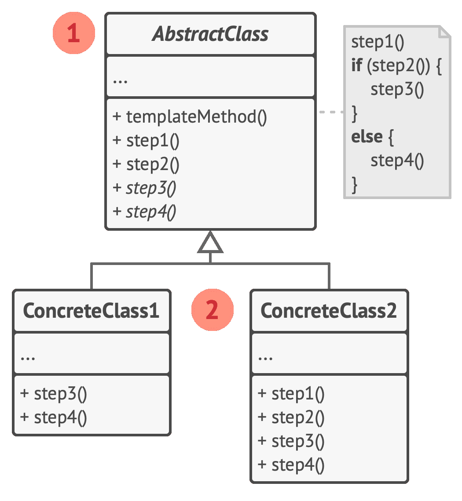

**Como ler a imagem:** a classe abstrata possui o `template_method()`, que chama etapas em uma ordem fixa. Algumas etapas são implementadas na base; outras são abstratas e devem ser definidas pelas subclasses.

## 5.3.4 Exemplo em Python

```python
from abc import ABC, abstractmethod

class DataImporter(ABC):
    def import_data(self) -> None:
        raw_data = self.load()
        self.validate(raw_data)
        records = self.transform(raw_data)
        self.save(records)
        self.after_import(records)

    @abstractmethod
    def load(self) -> str:
        raise NotImplementedError

    def validate(self, raw_data: str) -> None:
        if not raw_data.strip():
            raise ValueError("Arquivo vazio")

    @abstractmethod
    def transform(self, raw_data: str) -> list[dict]:
        raise NotImplementedError

    def save(self, records: list[dict]) -> None:
        print(f"Salvando {len(records)} registros")

    def after_import(self, records: list[dict]) -> None:
        print("Importação concluída")

class CsvImporter(DataImporter):
    def load(self) -> str:
        return "id,name\n1,Ana\n2,Carlos"

    def transform(self, raw_data: str) -> list[dict]:
        lines = raw_data.splitlines()[1:]
        return [
            {"id": line.split(",")[0], "name": line.split(",")[1]}
            for line in lines
        ]

class JsonImporter(DataImporter):
    def load(self) -> str:
        return '[{"id": 1, "name": "Ana"}]'

    def transform(self, raw_data: str) -> list[dict]:
        import json
        return json.loads(raw_data)

CsvImporter().import_data()
JsonImporter().import_data()
```

## 5.3.5 O que aconteceu no código?

`import_data()` é o Template Method. Ele define a ordem do algoritmo e não deve ser sobrescrito sem necessidade.

`load()` e `transform()` são etapas abstratas. Cada subclasse implementa sua variação. `validate()`, `save()` e `after_import()` possuem comportamento padrão reaproveitado.

## 5.3.6 Hooks

Métodos como `after_import()` podem funcionar como hooks: pontos opcionais de extensão. A classe base oferece uma implementação padrão, e subclasses podem sobrescrever se precisarem.

## 5.3.7 Quando usar

Use Template Method quando:

- vários fluxos têm a mesma estrutura geral;
- apenas algumas etapas variam;
- você quer centralizar a ordem do algoritmo;
- duplicação entre classes está aumentando.

## 5.3.8 Quando evitar

Evite quando:

- a variação é melhor representada por composição;
- a hierarquia de herança começa a ficar rígida;
- subclasses precisam mudar a ordem do algoritmo;
- cada fluxo é diferente demais para compartilhar um esqueleto.

---

# 6. Comparando padrões parecidos

## 6.1 Factory Method, Abstract Factory, Builder e Prototype

| Padrão | Pergunta que ele responde | Exemplo backend |
|---|---|---|
| Factory Method | Qual objeto concreto criar dentro deste fluxo? | Criar processador PIX ou cartão |
| Abstract Factory | Qual família de objetos compatíveis criar? | Criar pagamento, estorno e recibo do mesmo provedor |
| Builder | Como montar um objeto complexo passo a passo? | Construir payload de pagamento com campos opcionais |
| Prototype | Como criar uma variação a partir de um modelo existente? | Clonar template de notificação ou configuração base |

## 6.2 Adapter, Facade e Decorator

| Padrão | Foco | Exemplo backend |
|---|---|---|
| Adapter | Traduzir interface incompatível | Adaptar SDK legado de pagamento |
| Facade | Simplificar acesso a subsistema complexo | Expor `checkout.execute()` para um fluxo com vários serviços |
| Decorator | Adicionar comportamento mantendo a mesma interface | Adicionar cache/log/retry ao repositório |

## 6.3 Strategy vs Template Method

| Padrão | Baseado em | Como varia comportamento |
|---|---|---|
| Strategy | Composição | Troca objeto de estratégia em tempo de execução |
| Template Method | Herança | Subclasses sobrescrevem etapas específicas |

Use Strategy quando quer trocar algoritmos dinamicamente. Use Template Method quando a estrutura do fluxo é fixa e as subclasses só preenchem etapas.

## 6.4 Observer vs chamada direta

Chamada direta é simples e explícita. Observer reduz acoplamento quando vários interessados precisam reagir a um evento.

Use chamada direta quando existe uma dependência clara e obrigatória. Use Observer quando os efeitos colaterais são extensíveis e não deveriam ficar presos ao serviço principal.

## 6.5 Singleton vs injeção de dependência

Singleton cria acesso global. Injeção de dependência deixa dependências explícitas.

Para backend profissional, prefira injeção de dependência na maior parte dos casos. Use Singleton apenas quando realmente fizer sentido existir uma única instância global no processo.

---

# 7. Exemplo integrado em backend

Agora vamos juntar alguns padrões em um cenário coerente: checkout de pedido.

Imagine uma API com este fluxo:

1. recebe pedido;
2. escolhe provedor de pagamento;
3. monta payload;
4. adapta SDK externo;
5. executa checkout;
6. publica evento de pedido pago;
7. listeners reagem ao evento.

Uma arquitetura possível:

- **Builder** monta o `PaymentRequest`.
- **Abstract Factory** escolhe a família do provedor.
- **Adapter** traduz o SDK externo para sua interface interna.
- **Facade** coordena o checkout.
- **Observer** notifica email, auditoria e analytics.
- **Strategy** calcula taxas por tipo de cliente.
- **Decorator** adiciona log/cache/retry em serviços.

## 7.1 Exemplo simplificado de fluxo

```python
from dataclasses import dataclass
from decimal import Decimal

@dataclass(frozen=True)
class CheckoutCommand:
    order_id: str
    customer_id: str
    amount: Decimal
    payment_provider: str

class CheckoutApplicationService:
    def __init__(self, factory_resolver, dispatcher):
        self.factory_resolver = factory_resolver
        self.dispatcher = dispatcher

    def execute(self, command: CheckoutCommand) -> str:
        factory = self.factory_resolver.resolve(command.payment_provider)
        payment = factory.create_payment()
        receipt = factory.create_receipt()

        transaction_id = payment.pay(command.amount)
        receipt_id = receipt.issue(transaction_id)

        event = {
            "type": "order_paid",
            "order_id": command.order_id,
            "transaction_id": transaction_id,
            "receipt_id": receipt_id,
        }
        self.dispatcher.dispatch(event)

        return receipt_id
```

Este código não implementa todos os padrões diretamente, mas mostra como eles podem aparecer juntos sem perder coerência.

A regra principal não conhece SDK externo, não sabe como o recibo é emitido, não sabe quais listeners existem e não está cheia de condicionais. Cada padrão resolve uma parte específica do problema.

---

# 8. Cheat sheet final

## 8.1 Padrões criacionais

| Padrão | Use quando | Cuidado |
|---|---|---|
| Factory Method | Uma subclasse deve decidir qual objeto criar | Não crie subclasses sem necessidade |
| Abstract Factory | Precisa criar famílias de objetos compatíveis | Pode gerar muitas interfaces/classes |
| Builder | Objeto complexo com muitos parâmetros opcionais | Não use para objetos simples |
| Prototype | Precisa clonar modelos existentes | Atenção a cópia rasa vs profunda |
| Singleton | Uma única instância global é realmente necessária | Pode esconder dependências e dificultar testes |

## 8.2 Padrões estruturais

| Padrão | Use quando | Cuidado |
|---|---|---|
| Adapter | Interface externa é incompatível com seu domínio | Não coloque regra de negócio demais no adapter |
| Facade | Um subsistema complexo precisa de entrada simples | Não transforme a Facade em classe gigante |
| Decorator | Quer adicionar comportamento sem herança explosiva | Ordem dos decorators precisa ser clara |

## 8.3 Padrões comportamentais

| Padrão | Use quando | Cuidado |
|---|---|---|
| Strategy | Há múltiplos algoritmos intercambiáveis | Pode ser exagero para poucas regras simples |
| Observer | Vários interessados reagem a eventos | Fluxo pode ficar difícil de rastrear |
| Template Method | Fluxos têm estrutura fixa e etapas variáveis | Herança pode deixar o design rígido |

## 8.4 Perguntas rápidas para escolher um padrão

- O problema é criar objetos? Pense em padrões criacionais.
- O problema é integrar ou compor objetos? Pense em padrões estruturais.
- O problema é trocar comportamento ou coordenar eventos? Pense em padrões comportamentais.
- O problema é simples? Talvez não precise de padrão.
- O padrão reduz acoplamento ou apenas adiciona classes?
- O time vai entender melhor ou pior depois da abstração?

---

# 9. Exercícios práticos

## Exercício 1 - Factory Method

Crie um fluxo de envio de notificação com uma classe base `NotificationFlow`. Ela deve ter um método `create_sender()`. Depois implemente `EmailNotificationFlow` e `SmsNotificationFlow`.

## Exercício 2 - Abstract Factory

Crie uma fábrica abstrata para provedores de frete. Cada provedor deve criar:

- calculador de frete;
- rastreador;
- emissor de etiqueta.

Implemente duas fábricas concretas.

## Exercício 3 - Builder

Crie um builder para montar uma query de busca de produtos com filtros opcionais:

- categoria;
- preço mínimo;
- preço máximo;
- ordenação;
- paginação.

## Exercício 4 - Adapter

Imagine que uma API externa retorna usuários no formato:

```python
{"firstName": "Ana", "lastName": "Silva", "mail": "ana@example.com"}
```

Seu sistema espera:

```python
{"name": "Ana Silva", "email": "ana@example.com"}
```

Crie um adapter para converter esse formato.

## Exercício 5 - Strategy

Implemente strategies para cálculo de desconto:

- cliente comum;
- cliente premium;
- cupom promocional;
- desconto de primeira compra.

## Exercício 6 - Observer

Crie um evento `UserCreatedEvent` e três listeners:

- enviar email de boas-vindas;
- registrar analytics;
- criar log de auditoria.

## Exercício 7 - Template Method

Crie uma classe base `ReportGenerator` com o fluxo:

1. carregar dados;
2. formatar;
3. exportar;
4. notificar conclusão.

Implemente `CsvReportGenerator` e `PdfReportGenerator`.

---

# 10. Referências bibliográficas

- Documento original enviado pelo usuário: **Design Patterns em Python**.
- PDF de referência enviado pelo usuário: **Catálogo dos Padrões de Projeto**.
- GAMMA, Erich; HELM, Richard; JOHNSON, Ralph; VLISSIDES, John. **Design Patterns: Elements of Reusable Object-Oriented Software**. Addison-Wesley, 1994.
- REFACTORING.GURU. **O Catálogo dos Padrões de Projeto**. Disponível em: <https://refactoring.guru/pt-br/design-patterns/catalog>.
- PYTHON SOFTWARE FOUNDATION. **abc — Abstract Base Classes**. Disponível em: <https://docs.python.org/3/library/abc.html>.
- PYTHON SOFTWARE FOUNDATION. **copy — Shallow and deep copy operations**. Disponível em: <https://docs.python.org/3/library/copy.html>.
- PYTHON SOFTWARE FOUNDATION. **functools — Higher-order functions and operations on callable objects**. Disponível em: <https://docs.python.org/3/library/functools.html>.

---

## Nota final

Design Patterns não servem para deixar o código “sofisticado”. Eles servem para resolver problemas de acoplamento, criação, composição e colaboração entre objetos. O melhor uso de padrões acontece quando eles deixam o código mais simples de manter, não quando deixam a arquitetura mais impressionante.

Em projetos backend reais, comece simples. Quando a repetição, o acoplamento ou as condicionais começarem a incomodar, aí sim considere aplicar um padrão.
