# Git e GitHub — Apostila Didática para Desenvolvimento Backend

> Material reformulado em formato Markdown para estudo, consulta rápida e publicação no GitHub.
>
> Público-alvo: estudantes de programação e desenvolvedores backend iniciantes que precisam usar Git e GitHub no dia a dia profissional.

---

## Sobre esta apostila

Esta apostila explica Git e GitHub de forma prática, com foco em situações reais de desenvolvimento backend: criar branches, atualizar a branch principal, trabalhar em uma feature, resolver conflitos, abrir Pull Requests, desfazer alterações com segurança e entender quando usar comandos como `switch`, `branch`, `merge`, `rebase`, `reset`, `revert`, `stash`, `fetch`, `pull` e `push`.

A ideia não é decorar comandos isolados, mas entender o fluxo de trabalho. No dia a dia, Git é menos sobre “saber todos os comandos” e mais sobre saber responder perguntas como:

- O que eu alterei?
- O que já está preparado para commit?
- Em qual branch estou?
- Minha branch está atualizada com a `main`?
- Como envio minha feature sem quebrar o trabalho de outras pessoas?
- Como desfaço uma alteração sem destruir histórico compartilhado?

---

## Como estudar por esta apostila

Leia os capítulos na ordem. Sempre que aparecer um comando, teste em um repositório de treino antes de usar em um projeto real da empresa. Git é uma ferramenta segura quando você entende onde está trabalhando: **working tree**, **staging area**, **repositório local** e **repositório remoto**.

Durante o estudo, crie uma pasta chamada `git-lab` e pratique os comandos com arquivos simples. Isso ajuda a ganhar confiança antes de aplicar o conteúdo em projetos profissionais.

---

## Observação sobre imagens

As imagens desta apostila foram organizadas na pasta:

```text
./images/git-github/
```

Antes de publicar o material em um repositório público, revise a licença de imagens que tenham origem em sites, capturas de tela ou materiais de terceiros. Quando possível, prefira diagramas próprios em Markdown/Mermaid ou imagens com licença clara.

---

## Índice

1. [Capítulo 1 — Git, GitHub e controle de versão](#capítulo-1--git-github-e-controle-de-versão)
2. [Capítulo 2 — Instalação e configuração inicial](#capítulo-2--instalação-e-configuração-inicial)
3. [Capítulo 3 — Criando, clonando e conectando repositórios](#capítulo-3--criando-clonando-e-conectando-repositórios)
4. [Capítulo 4 — O modelo mental do Git](#capítulo-4--o-modelo-mental-do-git)
5. [Capítulo 5 — Ciclo básico de trabalho](#capítulo-5--ciclo-básico-de-trabalho)
6. [Capítulo 6 — Branches: criando linhas de trabalho seguras](#capítulo-6--branches-criando-linhas-de-trabalho-seguras)
7. [Capítulo 7 — Merge, rebase e atualização de branches](#capítulo-7--merge-rebase-e-atualização-de-branches)
8. [Capítulo 8 — Conflitos no Git](#capítulo-8--conflitos-no-git)
9. [Capítulo 9 — Desfazendo alterações com segurança](#capítulo-9--desfazendo-alterações-com-segurança)
10. [Capítulo 10 — Comandos essenciais por cenário real](#capítulo-10--comandos-essenciais-por-cenário-real)
11. [Capítulo 11 — GitHub no fluxo profissional](#capítulo-11--github-no-fluxo-profissional)
12. [Capítulo 12 — Padrão de commits](#capítulo-12--padrão-de-commits)
13. [Capítulo 13 — Boas práticas para dev backend júnior](#capítulo-13--boas-práticas-para-dev-backend-júnior)
14. [Capítulo 14 — Exercícios práticos](#capítulo-14--exercícios-práticos)
15. [Referências bibliográficas](#referências-bibliográficas)

---

# Capítulo 1 — Git, GitHub e controle de versão

Git é um sistema de controle de versão distribuído. Ele registra o histórico de alterações de um projeto e permite que várias pessoas trabalhem no mesmo código sem depender de uma única cópia central. Cada pessoa que clona um repositório recebe uma cópia completa do histórico, com commits, branches e metadados.

GitHub é uma plataforma online que hospeda repositórios Git e adiciona recursos de colaboração, como Pull Requests, Issues, revisão de código, proteção de branches, GitHub Actions e páginas de documentação. Git é a ferramenta de versionamento. GitHub é uma plataforma que usa Git e facilita o trabalho em equipe.

## 1.1 — O problema que o Git resolve

Imagine que você está trabalhando em uma API backend. Você altera uma rota, outro desenvolvedor altera uma regra de negócio e outro corrige um bug no banco de dados. Sem controle de versão, seria muito fácil sobrescrever arquivos, perder código ou não saber exatamente quem alterou determinada parte.

O Git resolve esse problema registrando snapshots do projeto. Cada commit representa um ponto do histórico. Se algo der errado, você consegue investigar, comparar, voltar, criar branches e trabalhar de forma isolada.

## 1.2 — Git não é apenas backup

Git não serve apenas para “salvar arquivos”. Ele serve para registrar a evolução do projeto. Um bom histórico mostra a intenção das mudanças: qual problema foi resolvido, qual feature foi adicionada, qual bug foi corrigido e quando isso aconteceu.

Por isso, commits pequenos, mensagens claras e branches bem nomeadas fazem muita diferença em projetos reais.

## 1.3 — Git x GitHub

| Conceito | O que é | Exemplo prático |
|---|---|---|
| Git | Ferramenta local de versionamento | `git add`, `git commit`, `git branch` |
| GitHub | Plataforma para hospedar repositórios Git | Pull Request, Issues, Code Review |
| Repositório local | Cópia do projeto na sua máquina | Pasta do projeto com `.git/` |
| Repositório remoto | Cópia hospedada em um servidor | `origin` no GitHub |
| Commit | Registro de uma alteração | `fix(auth): validate expired token` |
| Branch | Linha independente de desenvolvimento | `feature/login-google` |

## 1.4 — Resumo do capítulo

Git registra o histórico do projeto. GitHub hospeda esse histórico e facilita colaboração. No dia a dia profissional, você normalmente trabalha em uma branch separada, faz commits pequenos, envia a branch para o GitHub e abre um Pull Request para revisão.

---

# Capítulo 2 — Instalação e configuração inicial

Antes de versionar código, você precisa instalar o Git, configurar sua identidade e escolher uma forma segura de autenticação com o GitHub.

## 2.1 — Instalando o Git

No Windows, o caminho mais comum é baixar o instalador no site oficial do Git e seguir o assistente de instalação. Em sistemas Linux baseados em Debian/Ubuntu, normalmente usamos:

```bash
sudo apt update
sudo apt install git -y
```

Depois da instalação, confirme a versão:

```bash
git --version
```

## 2.2 — Configurando nome e e-mail

O Git grava seu nome e e-mail nos commits. Essa identificação é importante porque mostra quem criou cada alteração no histórico.

```bash
git config --global user.name "Seu Nome"
git config --global user.email "seuemail@exemplo.com"
```

Para conferir a configuração:

```bash
git config --global --list
```

Se estiver em um computador da empresa e quiser usar outro e-mail apenas em um repositório específico, entre na pasta do projeto e rode sem `--global`:

```bash
git config user.name "Seu Nome Profissional"
git config user.email "seu.email@empresa.com"
```

## 2.3 — Configurando o editor padrão

Alguns comandos abrem um editor para escrever mensagens, como `git commit` sem `-m`, `git revert` ou `git rebase -i`. Você pode configurar o VS Code como editor:

```bash
git config --global core.editor "code --wait"
```

Assim, quando o Git precisar de uma mensagem ou edição interativa, ele abrirá o VS Code e aguardará você salvar e fechar o arquivo.

## 2.4 — Configurando o nome da branch inicial

Atualmente, muitos projetos usam `main` como branch principal. Para novos repositórios locais, você pode definir isso como padrão:

```bash
git config --global init.defaultBranch main
```

## 2.5 — Criando conta no GitHub

A criação da conta no GitHub é feita pela interface web. O fluxo comum envolve acessar a página inicial, clicar em `Sign up`, informar e-mail, senha, nome de usuário e confirmar o código enviado por e-mail.


> Imagem extraída do material original. A interface do GitHub pode mudar com o tempo.

## 2.6 — HTTPS ou SSH?

Você pode se autenticar no GitHub usando HTTPS ou SSH.

| Opção | Quando usar | Observação |
|---|---|---|
| HTTPS | Mais simples para começar | Normalmente usa token/credential manager, não senha comum |
| SSH | Melhor para uso diário em máquina pessoal/profissional | Usa par de chaves criptográficas |

Para trabalho frequente, SSH costuma ser mais confortável: você cadastra sua chave pública no GitHub e usa a chave privada na sua máquina para autenticação.

## 2.7 — Gerando uma chave SSH

No terminal:

```bash
ssh-keygen -t ed25519 -C "seuemail@exemplo.com"
```

Durante o processo, o terminal perguntará onde salvar a chave e se você deseja usar uma senha de proteção, chamada passphrase. Usar passphrase é recomendado em computadores pessoais ou profissionais.

Depois, verifique se a chave pública existe:

```bash
ls ~/.ssh
cat ~/.ssh/id_ed25519.pub
```

A chave pública é a que termina com `.pub`. Ela pode ser compartilhada com o GitHub. A chave privada, sem `.pub`, nunca deve ser enviada ou publicada.

## 2.8 — Adicionando a chave SSH ao GitHub

No GitHub, acesse `Settings` → `SSH and GPG keys` → `New SSH key` e cole o conteúdo da chave pública.

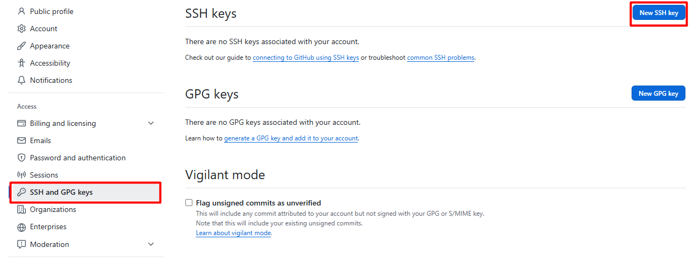

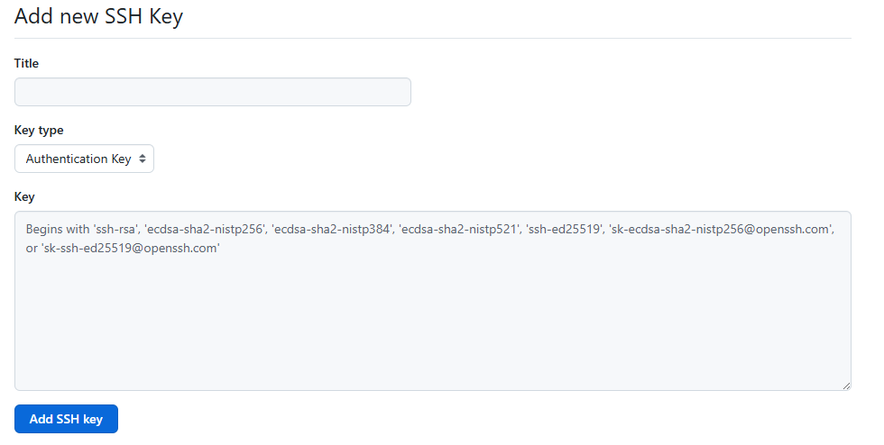

Teste a conexão:

```bash
ssh -T git@github.com
```

Se estiver funcionando, a resposta será parecida com:

```text
Hi usuario! You've successfully authenticated, but GitHub does not provide shell access.
```

Isso significa que a autenticação funcionou. O GitHub não abre shell remoto; ele apenas confirma que você pode autenticar operações Git via SSH.

## 2.9 — Resumo do capítulo

Antes de começar, configure nome, e-mail, editor, branch padrão e autenticação. Para uso frequente com GitHub, SSH é uma boa escolha. Guarde a chave privada com segurança e cadastre apenas a chave pública no GitHub.

---

# Capítulo 3 — Criando, clonando e conectando repositórios

Existem três situações comuns no início de um projeto:

1. Você vai clonar um projeto que já existe no GitHub.
2. Você vai criar um repositório novo no GitHub e clonar.
3. Você já tem uma pasta local e quer conectar ao GitHub.

## 3.1 — Criando um repositório no GitHub

No GitHub, clique no botão `+` e selecione `New repository`.

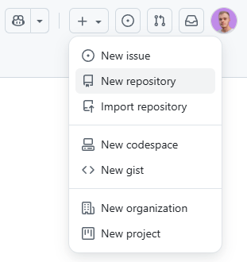

Depois, informe o nome do repositório, descrição, visibilidade, README, `.gitignore` e licença, se fizer sentido para o projeto.

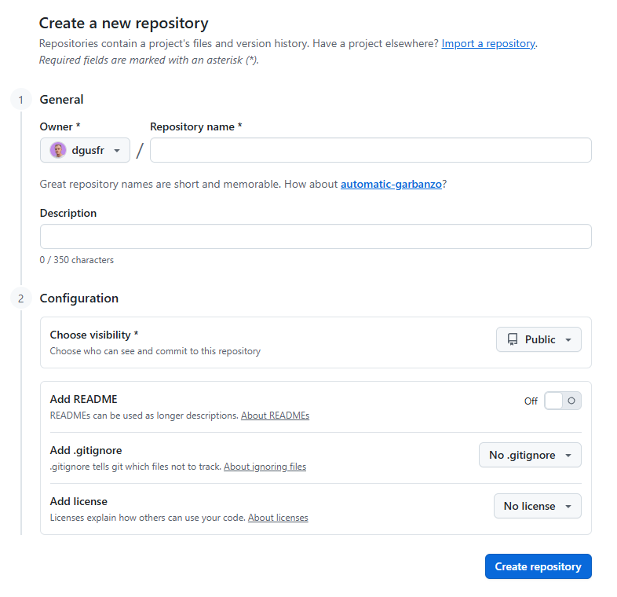

Para projetos de estudo que serão publicados, é recomendável incluir:

- `README.md`, explicando o objetivo do projeto;
- `.gitignore`, para ignorar arquivos desnecessários;
- licença, se você quiser deixar claro como outras pessoas podem usar o código.

## 3.2 — Clonando um repositório existente

Clonar significa baixar uma cópia completa do repositório remoto para sua máquina.

Via HTTPS:

```bash
git clone https://github.com/usuario/repositorio.git
cd repositorio
```

Via SSH:

```bash
git clone git@github.com:usuario/repositorio.git
cd repositorio
```

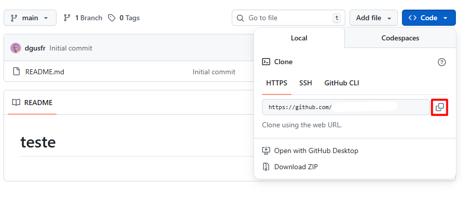

No dia a dia de trabalho, normalmente você clona o repositório da empresa uma vez e depois apenas atualiza suas branches com `fetch`, `pull`, `merge` ou `rebase`.

## 3.3 — Iniciando Git em uma pasta local

Quando você já tem uma pasta com código e quer começar a versionar:

```bash
cd meu-projeto
git init
```

O comando `git init` cria uma pasta oculta chamada `.git/`. Essa pasta contém o banco de dados interno do Git, histórico, configurações e referências.

Depois, faça o primeiro commit:

```bash
git add .
git commit -m "chore: initial commit"
```

## 3.4 — Conectando um repositório local ao GitHub

Se você criou o projeto localmente e depois criou o repositório vazio no GitHub, conecte o remoto:

```bash
git remote add origin git@github.com:usuario/meu-projeto.git
git push -u origin main
```

O nome `origin` é uma convenção para o remoto principal. Ele não é obrigatório, mas quase todos os projetos usam esse nome.

O `-u` cria uma relação de upstream entre sua branch local e a branch remota. Depois disso, você pode usar apenas:

```bash
git push
git pull
```

## 3.5 — Vendo os remotos configurados

```bash
git remote -v
```

Saída comum:

```text
origin  git@github.com:usuario/meu-projeto.git (fetch)
origin  git@github.com:usuario/meu-projeto.git (push)
```

## 3.6 — Alterando a URL do remoto

Se você clonou por HTTPS e quer trocar para SSH:

```bash
git remote set-url origin git@github.com:usuario/meu-projeto.git
```

Confira:

```bash
git remote -v
```

## 3.7 — Resumo do capítulo

Use `git clone` quando o projeto já existe. Use `git init` quando a pasta local ainda não é um repositório. Use `git remote add origin` para conectar sua pasta local ao GitHub. Use `git push -u origin main` para enviar a primeira vez e configurar o upstream.

---

# Capítulo 4 — O modelo mental do Git

Para usar Git com segurança, você precisa entender quatro áreas principais:

1. **Working tree**: os arquivos reais na sua pasta.
2. **Staging area** ou **index**: a área de preparação do próximo commit.
3. **Repositório local**: onde ficam os commits na sua máquina.
4. **Repositório remoto**: onde os commits são compartilhados com outras pessoas, geralmente no GitHub.

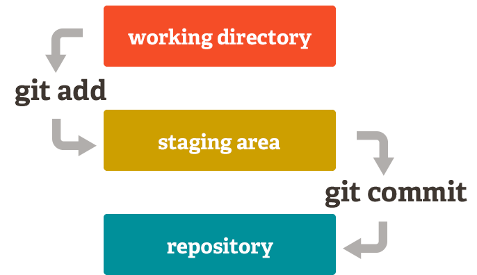

## 4.1 — Working tree

É a sua pasta de trabalho. Quando você edita um arquivo Python, um `README.md`, um `docker-compose.yml` ou uma migration, você está alterando a working tree.

Exemplo:

```bash
code app/services/user_service.py
```

Depois de salvar o arquivo, o Git percebe que há uma modificação, mas ela ainda não está preparada para commit.

## 4.2 — Staging area

A staging area é a área onde você escolhe o que entrará no próximo commit. Isso é muito útil porque você pode alterar vários arquivos, mas commitar apenas parte deles.

```bash
git add app/services/user_service.py
```

Agora esse arquivo está preparado para o próximo commit.

## 4.3 — Repositório local

Quando você roda `git commit`, o Git grava as alterações staged no histórico local.

```bash
git commit -m "fix(user): validate missing email"
```

Esse commit existe na sua máquina, mas ainda não está no GitHub.

## 4.4 — Repositório remoto

Para compartilhar commits, você usa `git push`.

```bash
git push origin feature/validate-user-email
```


## 4.5 — HEAD

`HEAD` é uma referência para o ponto atual do seu repositório. Normalmente, ele aponta para a branch em que você está. Se você está na branch `main`, `HEAD` aponta para o commit mais recente de `main`.

Você verá `HEAD` em comandos como:

```bash
git reset --soft HEAD~1
git diff HEAD
git log --oneline --decorate
```

## 4.6 — Como verificar o estado atual

O comando mais importante para não se perder é:

```bash
git status
```

Ele mostra:

- branch atual;
- arquivos modificados;
- arquivos não rastreados;
- arquivos staged;
- se sua branch está à frente ou atrás do remoto.

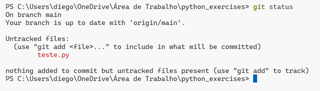

Use `git status` antes e depois de comandos importantes. Isso reduz muito o risco de erros.

## 4.7 — Resumo do capítulo

O fluxo básico é: editar arquivos na working tree, escolher alterações com `git add`, registrar com `git commit` e compartilhar com `git push`. O comando `git status` é seu painel de controle.

---

# Capítulo 5 — Ciclo básico de trabalho

Este capítulo apresenta o fluxo que você mais vai repetir no dia a dia.

## 5.1 — Fluxo básico

```bash
git status
git add .
git commit -m "feat(api): add endpoint to create user"
git push origin feature/create-user
```

Esse fluxo faz quatro coisas:

1. Verifica o estado atual.
2. Prepara as alterações.
3. Cria um commit local.
4. Envia a branch para o remoto.

## 5.2 — `git status`

Use quando quiser saber o que mudou.

```bash
git status
```

Quando usar:

- antes de commitar;
- depois de resolver conflito;
- antes de trocar de branch;
- quando você não sabe se tem arquivo pendente.

## 5.3 — `git add`

Prepara arquivos para o próximo commit.

Adicionar tudo:

```bash
git add .
```

Adicionar arquivo específico:

```bash
git add app/api/users.py
```

Adicionar interativamente por trechos:

```bash
git add -p
```

Use `git add -p` quando você mexeu em várias coisas no mesmo arquivo, mas quer separar os commits. Isso é muito útil em ambiente profissional.

## 5.4 — `git commit`

Registra as alterações staged no histórico local.

```bash
git commit -m "fix(auth): handle expired access token"
```

Quando usar:

- quando uma pequena unidade de trabalho está concluída;
- quando o código compila ou os testes relevantes passam;
- quando a alteração tem uma intenção clara.

Evite commits gigantes como:

```text
alterações gerais
ajustes
coisas
final
```

Prefira mensagens que expliquem a intenção:

```text
fix(payment): handle timeout from gateway
refactor(user): extract password validation service
test(order): add unit tests for cancellation flow
```

## 5.5 — `git log`

Mostra o histórico de commits.

```bash
git log
```

Versão resumida:

```bash
git log --oneline --decorate --graph --all
```

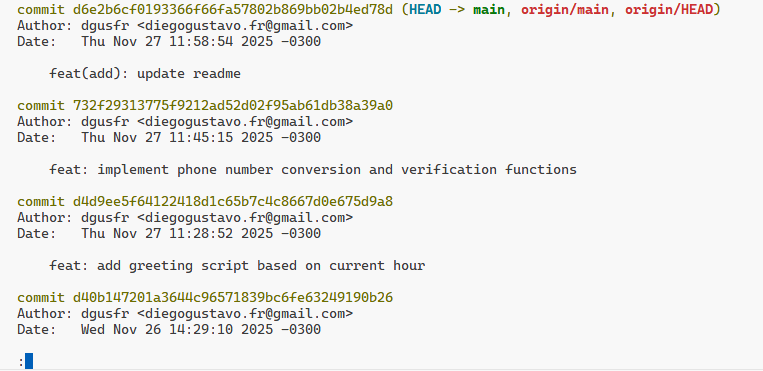

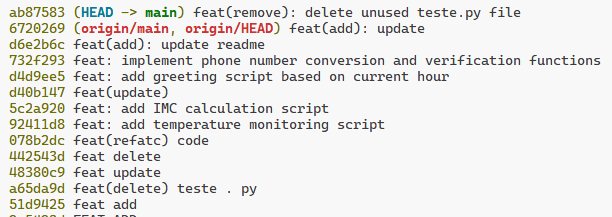

Quando usar:

- para encontrar o hash de um commit;
- para entender o histórico da branch;
- para investigar quando uma alteração entrou;
- antes de usar `revert`, `reset`, `cherry-pick` ou `rebase`.

## 5.6 — `git diff`

Mostra diferenças entre versões.

Ver alterações ainda não staged:

```bash
git diff
```

Ver alterações staged:

```bash
git diff --staged
```

Comparar sua branch com a `main` remota:

```bash
git diff origin/main...HEAD
```

Quando usar:

- antes de commitar;
- antes de abrir Pull Request;
- para revisar o que você realmente alterou.

## 5.7 — `git push`

Envia commits locais para o remoto.

Primeira vez em uma branch nova:

```bash
git push -u origin feature/create-user
```

Depois que o upstream já existe:

```bash
git push
```

Quando usar:

- após criar commits em uma branch de trabalho;
- para atualizar um Pull Request;
- para compartilhar seu progresso com o time.

## 5.8 — `git fetch`

Busca informações do remoto, mas **não altera automaticamente sua branch atual**.

```bash
git fetch origin
```

Quando usar:

- antes de comparar sua branch com a `main` remota;
- antes de fazer rebase;
- quando você quer atualizar referências remotas sem misturar nada no seu código.

Exemplo:

```bash
git fetch origin
git log --oneline --decorate --graph --all
```

## 5.9 — `git pull`

`git pull` é basicamente `git fetch` + integração na branch atual. Por padrão, essa integração costuma ser um merge, a menos que o repositório esteja configurado para rebase.

```bash
git pull origin main
```

Atenção: se você estiver em uma branch de feature e rodar `git pull origin main`, você estará trazendo a `main` para a sua feature. Isso pode ser desejado, mas precisa ser consciente.

Para atualizar a `main` local com segurança:

```bash
git switch main
git pull --ff-only origin main
```

O `--ff-only` evita criar merge commit inesperado. Se sua `main` local divergiu da remota, o Git vai recusar e você poderá investigar antes de bagunçar o histórico.

## 5.10 — Resumo do capítulo

No fluxo básico, use `status` para se orientar, `add` para preparar, `commit` para registrar, `push` para enviar, `fetch` para atualizar referências e `pull` para trazer mudanças para a branch atual.

---

# Capítulo 6 — Branches: criando linhas de trabalho seguras

Branches são linhas independentes de desenvolvimento. Elas permitem trabalhar em uma feature, correção ou experimento sem alterar diretamente a branch principal.

Em times profissionais, a regra comum é: **não trabalhe direto na `main`**. Crie uma branch, faça commits nela, envie para o remoto e abra um Pull Request.

## 6.1 — O que é uma branch?

Uma branch é um ponteiro para um commit. Quando você cria novos commits em uma branch, esse ponteiro avança.

Exemplo:

```text
main:        A---B---C
feature:             \---D---E
```

A branch `feature` começou em `C` e recebeu os commits `D` e `E`.

## 6.2 — `git branch`

Lista, cria, renomeia e remove branches.

Listar branches locais:

```bash
git branch
```

Listar branches locais e remotas:

```bash
git branch -a
```

Ver branches com upstream e último commit:

```bash
git branch -vv
```

Criar uma branch sem trocar para ela:

```bash
git branch feature/login-google
```

Quando usar `git branch`:

- para listar branches;
- para criar uma branch sem mudar para ela;
- para deletar branches locais;
- para inspecionar upstreams.

## 6.3 — `git switch`

`git switch` serve para trocar de branch. Ele é mais claro e seguro que o antigo `git checkout` para esse objetivo.

Trocar para uma branch existente:

```bash
git switch feature/login-google
```

Criar e já trocar para a branch:

```bash
git switch -c feature/login-google
```

Criar branch a partir da `main` remota:

```bash
git fetch origin
git switch -c feature/login-google origin/main
```

Quando usar `git switch`:

- sempre que quiser trocar de branch;
- para criar branch nova com `-c`;
- para evitar confusão com `checkout`, que também serve para restaurar arquivos em versões antigas do Git.

## 6.4 — `git checkout`

`git checkout` é um comando antigo e muito usado, mas ele tem múltiplas funções: trocar branch, restaurar arquivo e até entrar em detached HEAD. Por isso, comandos mais novos como `git switch` e `git restore` deixam o fluxo mais claro.

Ainda assim, você verá muito:

```bash
git checkout main
git checkout -b feature/login-google
```

Equivalente moderno:

```bash
git switch main
git switch -c feature/login-google
```

## 6.5 — Nomes de branches

Use nomes descritivos. Bons padrões:

```text
feature/login-google
feature/create-order-endpoint
fix/payment-timeout
fix/user-email-validation
refactor/auth-service
hotfix/production-login-error
chore/update-dependencies
```

Evite:

```text
teste
ajustes
nova
branch-diego
final
```

## 6.6 — Fluxo recomendado para começar uma tarefa

Cenário: você chegou no trabalho e vai começar uma nova feature.

```bash
git fetch origin
git switch main
git pull --ff-only origin main
git switch -c feature/create-user-endpoint
```

Esse fluxo garante que sua feature começa a partir da versão mais recente da `main`.

## 6.7 — Enviando uma branch nova para o GitHub

```bash
git push -u origin feature/create-user-endpoint
```

Depois disso, o GitHub normalmente mostra um botão para abrir Pull Request.

## 6.8 — Deletando branches

Após o merge da branch no Pull Request, você pode remover a branch local:

```bash
git branch -d feature/create-user-endpoint
```

Se a branch ainda não foi mergeada e você tem certeza que quer apagar:

```bash
git branch -D feature/create-user-endpoint
```

Para deletar a branch remota:

```bash
git push origin --delete feature/create-user-endpoint
```

## 6.9 — Resumo do capítulo

Use `git switch -c` para criar e entrar em branches novas. Use `git branch` para listar e gerenciar. Trabalhe em branches específicas por tarefa. Evite trabalhar direto na `main`.

---

# Capítulo 7 — Merge, rebase e atualização de branches

Este é um dos capítulos mais importantes para o dia a dia profissional. `merge` e `rebase` servem para integrar históricos, mas fazem isso de formas diferentes.

## 7.1 — O problema

Você criou uma branch a partir da `main`:

```text
main:    A---B---C
feature:         \---D---E
```

Enquanto você trabalhava, outra pessoa atualizou a `main`:

```text
main:    A---B---C---F---G
feature:         \---D---E
```

Agora sua branch está atrasada em relação à `main`. Você precisa trazer `F` e `G` para sua feature antes de finalizar ou abrir o Pull Request.

Existem duas formas comuns: `merge` ou `rebase`.

## 7.2 — `git merge`

`merge` junta o histórico de uma branch em outra. Ele preserva o histórico como ele aconteceu.

Exemplo para trazer `main` para sua feature:

```bash
git fetch origin
git switch feature/create-user-endpoint
git merge origin/main
```

Resultado típico com merge commit:

```text
main:    A---B---C---F---G
feature:         \---D---E---M
                 \       /
                  -------
```

O commit `M` é um commit de merge. Ele registra que dois históricos foram unidos.

## 7.3 — Quando usar merge

Use `merge` quando:

- você quer preservar o histórico real de integração;
- a branch é compartilhada com outras pessoas;
- o time usa merge commits no GitHub;
- você está juntando uma feature finalizada na branch principal;
- você quer evitar reescrever histórico.

Exemplo real:

```bash
git switch main
git pull --ff-only origin main
git merge feature/create-user-endpoint
git push origin main
```

Em empresas, esse merge normalmente é feito pelo GitHub ao clicar em `Merge pull request`, não diretamente no terminal.

## 7.4 — Fast-forward merge

Um merge fast-forward acontece quando a branch de destino não recebeu commits novos desde que a feature foi criada.

```text
Antes:
main:    A---B
feature:     \---C---D

Depois:
main:    A---B---C---D
```

O Git apenas move o ponteiro da `main` para o commit mais recente. Não é criado commit de merge.

## 7.5 — `git rebase`

`rebase` reaplica seus commits em cima de outra base. Em vez de criar um commit de merge, ele reescreve seus commits como se tivessem sido feitos a partir da versão mais recente da `main`.

```bash
git fetch origin
git switch feature/create-user-endpoint
git rebase origin/main
```

Antes:

```text
main:    A---B---C---F---G
feature:         \---D---E
```

Depois:

```text
main:    A---B---C---F---G
feature:                 \---D'---E'
```

Os commits `D` e `E` viram `D'` e `E'` porque o Git recria esses commits em cima de `G`.

## 7.6 — Quando usar rebase

Use `rebase` quando:

- você está trabalhando em uma branch sua, local ou ainda não compartilhada;
- quer manter histórico linear;
- quer atualizar sua feature com a `main` antes do Pull Request;
- quer limpar commits locais antes de abrir PR;
- o time explicitamente adota fluxo com rebase.

Evite usar `rebase` em branches compartilhadas, porque ele reescreve commits. Se outra pessoa baseou trabalho nos commits antigos, você pode causar confusão e conflitos para o time.

## 7.7 — Regra prática para dev júnior

Use esta regra simples:

| Situação | Melhor escolha |
|---|---|
| Minha branch é só minha e quero atualizar com a `main` | `git rebase origin/main` |
| A branch já é usada por outras pessoas | `git merge origin/main` |
| Vou juntar a feature finalizada na `main` via GitHub | Pull Request com merge/squash conforme padrão do time |
| Não tenho certeza | Pergunte ao time antes de reescrever histórico |

## 7.8 — Fluxo seguro com rebase

```bash
git fetch origin
git switch feature/minha-tarefa
git rebase origin/main
```

Se houver conflito:

```bash
# editar arquivos conflitantes
git add arquivo_corrigido.py
git rebase --continue
```

Se quiser desistir do rebase:

```bash
git rebase --abort
```

Se a branch já estava no GitHub, depois do rebase talvez seja necessário:

```bash
git push --force-with-lease
```

Use `--force-with-lease` em vez de `--force`, porque ele é mais seguro: só força o push se ninguém tiver enviado commits novos para a branch remota desde sua última atualização.

## 7.9 — Rebase interativo

O rebase interativo permite reorganizar commits locais antes de abrir PR.

```bash
git rebase -i HEAD~3
```

Ele pode ser usado para:

- juntar commits pequenos com `squash`;
- editar mensagens;
- reordenar commits;
- remover commits locais desnecessários.

Exemplo de uso real: você fez três commits durante o desenvolvimento:

```text
wip
ajuste
corrige de verdade
```

Antes de abrir o Pull Request, pode juntar tudo em um commit claro:

```text
feat(auth): add google social login
```

Atenção: só faça isso em commits que ainda não foram compartilhados ou em branches pessoais onde o time permite esse fluxo.

## 7.10 — `merge` vs `rebase`: comparação direta

| Critério | Merge | Rebase |
|---|---|---|
| Preserva histórico real | Sim | Não exatamente, recria commits |
| Cria commit extra | Pode criar | Não cria merge commit |
| Mantém histórico linear | Não necessariamente | Sim |
| Seguro para branch compartilhada | Sim | Não recomendado |
| Bom para atualizar feature pessoal | Sim, mas pode poluir histórico | Sim, geralmente ideal |
| Exige cuidado com push forçado | Não | Sim, se já foi enviada ao remoto |

## 7.11 — Resumo do capítulo

`merge` une históricos preservando a forma como eles divergiram. `rebase` reaplica seus commits em cima de outra base e deixa o histórico linear. Para dev júnior, a regra mais segura é: use `rebase` em branch pessoal e `merge` em branch compartilhada ou quando o time adotar esse padrão.

---

# Capítulo 8 — Conflitos no Git

Conflito acontece quando o Git não consegue decidir automaticamente qual versão de um trecho deve prevalecer.

## 8.1 — Quando conflitos acontecem

Conflitos são comuns quando:

- duas pessoas alteram a mesma linha do mesmo arquivo;
- uma pessoa renomeia um arquivo e outra altera o arquivo antigo;
- sua branch ficou muito tempo desatualizada;
- você faz `merge`, `rebase`, `cherry-pick` ou `pull` com históricos divergentes.

## 8.2 — Como o conflito aparece

O arquivo fica com marcadores parecidos com estes:

```text
<<<<<<< HEAD
return "Usuário não encontrado"
=======
return "Cliente não encontrado"
>>>>>>> origin/main
```

Isso significa:

- trecho acima de `=======`: sua versão atual;
- trecho abaixo de `=======`: versão que está sendo integrada;
- você precisa escolher, combinar ou reescrever o conteúdo final.

## 8.3 — Resolvendo conflito em merge

Fluxo:

```bash
git status
# abrir arquivos conflitantes e editar
git add arquivo_corrigido.py
git commit
```

Em um merge, após resolver e adicionar os arquivos, o `git commit` finaliza o merge.

## 8.4 — Resolvendo conflito em rebase

Fluxo:

```bash
git status
# abrir arquivos conflitantes e editar
git add arquivo_corrigido.py
git rebase --continue
```

Se houver mais conflitos em outros commits, o Git vai parar novamente. Repita até terminar.

Para cancelar:

```bash
git rebase --abort
```

## 8.5 — Estratégia prática para resolver conflitos

1. Rode `git status`.
2. Abra o arquivo conflitado.
3. Entenda o que cada lado tentou fazer.
4. Remova os marcadores `<<<<<<<`, `=======`, `>>>>>>>`.
5. Deixe o código final correto.
6. Rode testes ou pelo menos valide a sintaxe.
7. Faça `git add`.
8. Continue o merge ou rebase.

## 8.6 — Exemplo real em backend

Sua branch alterou uma validação:

```python
if not user.email:
    raise ValueError("E-mail obrigatório")
```

A `main` mudou a mesma regra:

```python
if not customer.email:
    raise ValueError("E-mail do cliente é obrigatório")
```

A resolução não deve ser automática. Você precisa entender se o domínio agora usa `user` ou `customer`, qual mensagem está padronizada e se existem testes esperando determinado comportamento.

## 8.7 — O que não fazer em conflito

Evite:

- aceitar tudo de um lado sem entender;
- apagar código do outro desenvolvedor sem revisar;
- resolver conflito sem rodar testes;
- fazer commit com marcadores de conflito;
- usar `--ours` ou `--theirs` sem saber exatamente o efeito.

## 8.8 — Resumo do capítulo

Conflito não é erro grave. É apenas o Git pedindo ajuda humana. Resolva com calma, entenda as duas mudanças, deixe o arquivo em um estado correto e finalize com `add` + `commit` ou `rebase --continue`.

---

# Capítulo 9 — Desfazendo alterações com segurança

Desfazer alterações é uma das partes mais sensíveis do Git. O comando correto depende de onde a alteração está: working tree, staging area, commit local ou commit remoto.

## 9.1 — Desfazer alteração ainda não staged

Você editou um arquivo, mas quer voltar ao último commit.

```bash
git restore app/api/users.py
```

Quando usar:

- você mudou um arquivo e se arrependeu;
- a alteração ainda não foi para staging;
- você quer descartar a modificação local.

Atenção: isso apaga a alteração do arquivo. Use `git diff` antes.

## 9.2 — Tirar arquivo do staging

Você rodou `git add`, mas quer remover do staging sem apagar a alteração do arquivo.

```bash
git restore --staged app/api/users.py
```

Quando usar:

- você deu `git add .` sem querer;
- quer separar commits;
- quer revisar melhor antes de commitar.

## 9.3 — Corrigir o último commit local

Você esqueceu um arquivo ou errou a mensagem do último commit.

Adicionar arquivo esquecido:

```bash
git add arquivo_esquecido.py
git commit --amend
```

Alterar apenas a mensagem:

```bash
git commit --amend -m "fix(auth): validate refresh token"
```

Use `--amend` apenas com commits locais ou ainda não compartilhados, a menos que o time permita reescrita de histórico.

## 9.4 — Desfazer último commit mantendo alterações staged

```bash
git reset --soft HEAD~1
```

Quando usar:

- você commitou cedo demais;
- quer refazer a mensagem;
- quer juntar alterações em outro commit.

O commit some do histórico local, mas os arquivos continuam preparados no staging.

## 9.5 — Desfazer último commit mantendo alterações nos arquivos

```bash
git reset --mixed HEAD~1
```

Esse é o comportamento padrão do `git reset` sem modo. O commit some, as alterações continuam nos arquivos, mas saem do staging.

## 9.6 — Desfazer commit e apagar alterações

```bash
git reset --hard HEAD~1
```

Atenção: `--hard` descarta alterações da working tree e do staging. Use com cuidado.

Para voltar para um commit específico:

```bash
git reset --hard 7f69ff8
```


Use `reset --hard` principalmente em mudanças locais. Não use para apagar histórico já compartilhado sem alinhamento com o time.

## 9.7 — Reverter commit remoto com `git revert`

Se o commit já foi enviado para o GitHub, o caminho mais seguro é `git revert`.

```bash
git log --oneline
git revert a1b2c3d
git push
```

`git revert` cria um novo commit que desfaz as mudanças do commit escolhido. Ele não apaga o histórico.

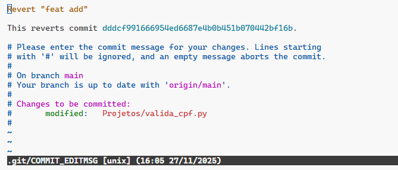

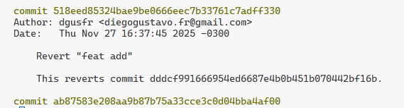

Quando usar:

- o commit errado já está na branch compartilhada;
- a alteração já foi para produção;
- você quer manter rastreabilidade;
- você não quer reescrever histórico.

## 9.8 — `reset` vs `revert`

| Situação | Use |
|---|---|
| Commit local, ainda não enviado | `git reset` ou `git commit --amend` |
| Commit já enviado para branch compartilhada | `git revert` |
| Quer apagar alterações locais de arquivo | `git restore` |
| Quer tirar arquivo do staging | `git restore --staged` |
| Quer refazer último commit local | `git commit --amend` |

## 9.9 — Recuperando algo com `git reflog`

`git reflog` mostra movimentações recentes do `HEAD`, inclusive resets e rebases. Ele pode salvar você quando parece que um commit “sumiu”.

```bash
git reflog
```

Exemplo de recuperação:

```bash
git reset --hard HEAD@{1}
```

Use com cuidado. O `reflog` é uma ferramenta de recuperação local, não uma solução para bagunçar histórico compartilhado.

## 9.10 — Guardando trabalho temporariamente com `git stash`

Cenário: você está no meio de uma alteração, mas precisa trocar de branch para corrigir um bug urgente.

Salvar alterações temporariamente:

```bash
git stash push -m "wip: ajustes na validação de usuário"
```

Listar stashes:

```bash
git stash list
```

Aplicar e remover o stash:

```bash
git stash pop
```

Aplicar sem remover da lista:

```bash
git stash apply stash@{0}
```

Quando usar:

- trocar de branch sem commitar código incompleto;
- guardar trabalho temporário;
- testar rapidamente outra branch.

Não use stash como armazenamento permanente. Se a alteração é importante, crie um commit WIP em uma branch pessoal.

## 9.11 — Resumo do capítulo

Use `restore` para arquivos, `reset` para commits locais, `revert` para commits compartilhados e `stash` para guardar trabalho temporário. Antes de qualquer comando destrutivo, rode `git status`, `git diff` e pense no impacto.

---

# Capítulo 10 — Comandos essenciais por cenário real

Este capítulo funciona como um guia de consulta rápida. A ideia é saber **quando usar** cada comando.

## 10.1 — Cheguei no trabalho e vou começar uma tarefa

```bash
git fetch origin
git switch main
git pull --ff-only origin main
git switch -c feature/nome-da-tarefa
```

Por quê?

- `fetch` atualiza informações do remoto;
- `switch main` garante que você está na branch base;
- `pull --ff-only` atualiza sem criar merge inesperado;
- `switch -c` cria uma branch limpa a partir da `main` atualizada.

## 10.2 — Quero ver em qual branch estou

```bash
git branch
git status
```

O `git branch` mostra a branch atual com `*`. O `git status` também informa a branch e o estado dos arquivos.

## 10.3 — Quero criar uma branch nova

```bash
git switch -c feature/create-payment-endpoint
```

Use isso quando for trabalhar em uma feature, bugfix ou refatoração sem mexer direto na `main`.

## 10.4 — Quero trocar de branch

```bash
git switch main
```

Se o Git impedir a troca, provavelmente você tem alterações locais que seriam sobrescritas. Nesse caso, escolha uma das opções:

```bash
# commitar
git add .
git commit -m "wip: save current work"

# ou guardar temporariamente
git stash push -m "wip: current work"

# ou descartar, se realmente não precisar
git restore arquivo.py
```

## 10.5 — Quero atualizar minha branch com a `main`

Opção com rebase, para branch pessoal:

```bash
git fetch origin
git switch feature/minha-tarefa
git rebase origin/main
```

Opção com merge, para branch compartilhada:

```bash
git fetch origin
git switch feature/minha-tarefa
git merge origin/main
```

## 10.6 — Quero enviar minha branch para o GitHub

Primeira vez:

```bash
git push -u origin feature/minha-tarefa
```

Próximas vezes:

```bash
git push
```

## 10.7 — Meu `git push` foi rejeitado

Isso geralmente acontece porque o remoto tem commits que você ainda não tem.

Para branch pessoal:

```bash
git fetch origin
git rebase origin/feature/minha-tarefa
git push
```

Se você fez rebase e a branch já existia no remoto:

```bash
git push --force-with-lease
```

Antes de forçar push, confirme que a branch é sua e que ninguém mais está trabalhando nela.

## 10.8 — Quero ver o que mudei antes de commitar

```bash
git diff
```

Depois de `git add`:

```bash
git diff --staged
```

## 10.9 — Quero commitar apenas parte dos arquivos

```bash
git add app/services/payment_service.py
git add tests/test_payment_service.py
git commit -m "fix(payment): handle gateway timeout"
```

Isso evita commits que misturam feature, refatoração, teste e ajuste de formatação sem relação.

## 10.10 — Quero commitar apenas alguns trechos de um arquivo

```bash
git add -p
```

O Git mostrará pedaços da alteração e perguntará se você quer adicionar cada trecho. É ótimo para separar mudanças lógicas.

## 10.11 — Fiz commit na branch errada

Cenário: você commitou na `main`, mas deveria ter criado uma branch.

Se o commit ainda não foi enviado:

```bash
# cria uma branch apontando para o commit atual
git branch feature/minha-correcao

# volta a main para o estado remoto
git reset --hard origin/main

# entra na branch correta
git switch feature/minha-correcao
```

Agora seu commit está salvo na branch `feature/minha-correcao`, e a `main` local voltou ao estado correto.

## 10.12 — Quero trazer um commit específico de outra branch

Use `cherry-pick`.

```bash
git switch feature/minha-branch
git cherry-pick a1b2c3d
```

Quando usar:

- você precisa de uma correção pontual de outra branch;
- um hotfix foi feito em outra linha de trabalho;
- não quer trazer todos os commits da outra branch.

Cuidado: `cherry-pick` duplica a alteração como um novo commit na branch atual.

## 10.13 — Quero criar uma tag de versão

Tags marcam pontos importantes do histórico, como versões de release.

```bash
git tag -a v1.0.0 -m "Release v1.0.0"
git push origin v1.0.0
```

Quando usar:

- marcar release de uma API;
- marcar versão entregue em produção;
- integrar com pipelines de deploy.

## 10.14 — Quero trabalhar em duas branches ao mesmo tempo

Use `git worktree` quando precisar manter duas branches abertas em pastas diferentes.

```bash
git worktree add ../meu-projeto-hotfix hotfix/corrigir-login
```

Quando usar:

- você está no meio de uma feature grande;
- apareceu um hotfix urgente;
- você não quer ficar usando stash para alternar contexto.

## 10.15 — Quero encontrar qual commit introduziu um bug

Use `git bisect`.

```bash
git bisect start
git bisect bad
git bisect good v1.0.0
```

O Git fará uma busca binária pelo histórico. Você testa cada ponto e informa:

```bash
git bisect good
# ou
git bisect bad
```

Ao terminar:

```bash
git bisect reset
```

Use isso quando um bug apareceu em algum momento, mas você não sabe exatamente em qual commit.

## 10.16 — Quero ver quem alterou uma linha

```bash
git blame app/services/user_service.py
```

Use com maturidade. `git blame` não é para culpar pessoas, mas para entender contexto. Depois de encontrar o commit, leia a mensagem, Pull Request e discussão relacionada.

## 10.17 — Quero comparar duas branches

```bash
git diff main..feature/minha-tarefa
```

Ou comparar o que sua branch tem desde que divergiu da `main`:

```bash
git diff main...feature/minha-tarefa
```

Essa comparação ajuda antes de abrir Pull Request.

## 10.18 — Quero listar comandos principais

| Comando | Para que serve | Quando usar |
|---|---|---|
| `git status` | Mostra estado atual | Sempre que estiver em dúvida |
| `git add` | Prepara alterações | Antes de commitar |
| `git commit` | Registra alterações | Quando uma unidade de trabalho estiver pronta |
| `git log` | Mostra histórico | Investigar commits |
| `git diff` | Mostra diferenças | Revisar antes do commit/PR |
| `git branch` | Lista/cria/remove branches | Gerenciar linhas de trabalho |
| `git switch` | Troca/cria branch | Navegar entre branches |
| `git fetch` | Atualiza refs remotas | Antes de rebase/merge/pull |
| `git pull` | Busca e integra alterações | Atualizar branch atual |
| `git push` | Envia commits | Atualizar remoto/PR |
| `git merge` | Une históricos | Branch compartilhada ou integração |
| `git rebase` | Reaplica commits | Atualizar branch pessoal com histórico linear |
| `git restore` | Restaura arquivos | Desfazer alteração local |
| `git reset` | Move branch/HEAD | Desfazer commits locais |
| `git revert` | Cria commit que desfaz outro | Desfazer commit já compartilhado |
| `git stash` | Guarda alterações temporárias | Trocar contexto sem commit |
| `git cherry-pick` | Aplica commit específico | Trazer correção pontual |
| `git tag` | Marca versão | Releases |
| `git reflog` | Mostra histórico local do HEAD | Recuperar commits perdidos |

---

# Capítulo 11 — GitHub no fluxo profissional

GitHub entra principalmente na parte de colaboração: Pull Requests, revisão de código, automação, Issues e proteção da branch principal.

## 11.1 — O que é Pull Request?

Pull Request é uma proposta de mudança. Você envia sua branch para o GitHub e pede para que ela seja revisada e integrada à branch principal.

Fluxo comum:

```bash
git switch main
git pull --ff-only origin main
git switch -c feature/create-order-endpoint
# desenvolver
git add .
git commit -m "feat(order): add create order endpoint"
git push -u origin feature/create-order-endpoint
```

Depois, no GitHub:

1. Abra um Pull Request da sua branch para `main`.
2. Escreva descrição clara.
3. Aguarde CI/testes.
4. Peça review.
5. Corrija comentários.
6. Faça merge quando aprovado.

## 11.2 — O que colocar na descrição do Pull Request

Um bom PR responde:

```md
## O que foi feito
- Adiciona endpoint POST /orders
- Valida itens do pedido
- Cria testes unitários para fluxo de criação

## Por que foi feito
- Necessário para permitir criação de pedidos pela API

## Como testar
1. Rodar `pytest tests/test_orders.py`
2. Fazer POST para `/orders` com payload válido

## Observações
- Ainda não inclui integração com gateway de pagamento
```

## 11.3 — Branch protegida

Em projetos profissionais, a `main` normalmente é protegida. Isso pode impedir push direto, exigir aprovação de Pull Request, exigir testes passando e bloquear force push.

Isso é bom. Proteção de branch evita que código não revisado entre na linha principal.

## 11.4 — Estratégias de merge no GitHub

O GitHub costuma oferecer três opções:

| Estratégia | O que faz | Quando usar |
|---|---|---|
| Merge commit | Mantém todos os commits e cria commit de merge | Times que querem preservar histórico completo |
| Squash and merge | Junta todos os commits do PR em um commit | PRs com muitos commits pequenos/WIP |
| Rebase and merge | Reaplica commits na base sem merge commit | Times que exigem histórico linear |

Siga o padrão do time. Em empresa, o padrão do repositório é mais importante que preferência pessoal.

## 11.5 — Issues

Issues são usadas para registrar tarefas, bugs, melhorias e discussões. Uma boa prática é relacionar commits e PRs com issues.

Exemplo de commit:

```text
fix(auth): reject expired refresh tokens
```

Exemplo de rodapé do PR ou commit:

```text
Closes #123
```

## 11.6 — Fork

Fork é uma cópia de um repositório em outra conta. É comum em projetos open source. Em empresas, normalmente você trabalha com branches no próprio repositório, não com forks, a menos que a organização use esse fluxo.

## 11.7 — GitHub Actions

GitHub Actions permite rodar automações como testes, lint, build, deploy e análise de segurança. Para dev backend, é comum um PR disparar pipeline que roda testes antes do merge.

Exemplo conceitual:

```yaml
name: tests

on:
  pull_request:

jobs:
  test:
    runs-on: ubuntu-latest
    steps:
      - uses: actions/checkout@v4
      - name: Run tests
        run: pytest
```

## 11.8 — Revisão de código

Ao abrir um PR, revise seu próprio diff antes de pedir review. Verifique:

- arquivos desnecessários;
- prints/debugs esquecidos;
- segredos no código;
- migrations perigosas;
- testes faltando;
- nomes confusos;
- mudanças fora do escopo.

## 11.9 — Resumo do capítulo

GitHub organiza colaboração. Pull Request não é só botão de merge: é o local onde o time entende, discute, valida e aprova mudanças antes de levá-las à branch principal.

---

# Capítulo 12 — Padrão de commits

Mensagens de commit ajudam humanos e ferramentas a entenderem o histórico. Um padrão muito usado é o Conventional Commits.

## 12.1 — Estrutura

```text
<tipo>(<escopo>): <descrição>
```

Exemplos:

```text
feat(auth): add google social login
fix(payment): handle gateway timeout
refactor(user): extract password validation
test(order): add cancellation tests
docs(readme): update installation guide
```

## 12.2 — Tipos comuns

| Tipo | Quando usar | Exemplo |
|---|---|---|
| `feat` | Nova funcionalidade | `feat(order): add create endpoint` |
| `fix` | Correção de bug | `fix(auth): validate expired token` |
| `refactor` | Mudança interna sem alterar comportamento | `refactor(user): simplify service layer` |
| `test` | Testes | `test(payment): add retry tests` |
| `docs` | Documentação | `docs(api): document auth endpoints` |
| `chore` | Tarefas de manutenção | `chore(deps): update dependencies` |
| `build` | Build/dependências externas | `build(docker): update base image` |
| `ci` | Pipeline/CI | `ci(github): add test workflow` |
| `perf` | Performance | `perf(query): optimize user search` |
| `style` | Formatação sem mudar lógica | `style(user): format imports` |
| `revert` | Reversão | `revert: revert "feat(auth): add google login"` |

## 12.3 — Boas mensagens para backend

Ruim:

```text
ajustes
bug
coisas da api
final
```

Melhor:

```text
fix(api): return 404 when user does not exist
feat(auth): add refresh token rotation
refactor(database): move connection logic to repository layer
test(user): cover invalid email validation
```

## 12.4 — Commits pequenos e coesos

Um commit deve representar uma mudança lógica. Exemplo de separação boa:

```text
feat(user): add user creation service
test(user): add user creation tests
docs(api): document user creation endpoint
```

Evite misturar em um commit:

- nova feature;
- refatoração grande;
- correção de bug não relacionada;
- formatação do projeto inteiro.

## 12.5 — Resumo do capítulo

Mensagens boas transformam o histórico do Git em documentação. Para um dev backend júnior, escrever commits claros é uma forma simples de demonstrar profissionalismo.

---

# Capítulo 13 — Boas práticas para dev backend júnior

## 13.1 — Antes de começar qualquer tarefa

```bash
git status
git fetch origin
git switch main
git pull --ff-only origin main
git switch -c feature/nome-da-tarefa
```

Isso evita começar uma tarefa em cima de código desatualizado.

## 13.2 — Durante o desenvolvimento

Use ciclos pequenos:

```bash
git status
git diff
# editar código
git add -p
git commit -m "fix(auth): handle invalid credentials"
```

Não espere três dias para commitar tudo de uma vez.

## 13.3 — Antes de abrir Pull Request

```bash
git fetch origin
git rebase origin/main
# ou git merge origin/main, conforme padrão do time
git status
git diff origin/main...HEAD
pytest
```

Depois:

```bash
git push
```

Se fez rebase em branch já enviada:

```bash
git push --force-with-lease
```

## 13.4 — Nunca versionar segredos

Nunca commite:

```text
.env
chaves privadas
senhas
tokens de API
credenciais de banco
arquivos .pem
```

Inclua no `.gitignore`:

```gitignore
.env
*.pem
*.key
__pycache__/
.venv/
venv/
node_modules/
dist/
build/
*.log
.DS_Store
Thumbs.db
```

Se um segredo foi commitado e enviado, remover o arquivo não basta. Você precisa rotacionar a credencial imediatamente, porque ela já pode ter sido exposta no histórico.

## 13.5 — Faça commits que contam uma história

O reviewer deve conseguir entender seu PR lendo os commits e o diff. Uma boa sequência seria:

```text
feat(order): add order model
feat(order): implement create order service
feat(api): expose create order endpoint
test(order): add create order test cases
```

## 13.6 — Evite trabalhar direto na `main`

A `main` deve representar código estável. Em empresa, normalmente você trabalha em branches de feature e usa Pull Request.

## 13.7 — Cuidado com comandos destrutivos

Antes de usar:

```bash
git reset --hard
git clean -fd
git push --force
```

Pare e rode:

```bash
git status
git log --oneline --decorate -5
git diff
```

Se estiver em repositório da empresa e não tiver certeza, pergunte.

## 13.8 — Checklist rápido antes do PR

- A branch está atualizada com a `main`?
- O nome da branch faz sentido?
- Os commits têm mensagens claras?
- O PR tem descrição?
- Os testes passam?
- O diff não contém arquivos desnecessários?
- Não há `.env`, senha, token ou chave privada?
- O escopo do PR está pequeno o suficiente para review?

---

# Capítulo 14 — Exercícios práticos

## 14.1 — Exercício 1: criar branch de feature

Cenário: você clonou um repositório da empresa e precisa trabalhar na feature de login social com Google.

Tarefa:

1. Atualize a `main` local com a remota.
2. Crie uma branch chamada `feature/login-social-google`.
3. Mostre em qual branch você está.

Resposta esperada:

```bash
git fetch origin
git switch main
git pull --ff-only origin main
git switch -c feature/login-social-google
git status
```

## 14.2 — Exercício 2: commitar alteração específica

Cenário: você alterou dois arquivos, mas quer commitar apenas `auth_service.py`.

Tarefa:

```bash
git status
git add app/services/auth_service.py
git diff --staged
git commit -m "fix(auth): validate google login callback"
```

## 14.3 — Exercício 3: atualizar feature com a main

Cenário: sua branch ficou atrasada porque a `main` recebeu commits novos.

Se a branch é só sua:

```bash
git fetch origin
git switch feature/login-social-google
git rebase origin/main
```

Se a branch é compartilhada:

```bash
git fetch origin
git switch feature/login-social-google
git merge origin/main
```

## 14.4 — Exercício 4: resolver conflito

Cenário: após um rebase, houve conflito em `auth_service.py`.

Tarefa:

```bash
git status
# abrir auth_service.py e resolver conflito
git add app/services/auth_service.py
git rebase --continue
```

## 14.5 — Exercício 5: desfazer arquivo modificado

Cenário: você alterou `README.md`, mas quer descartar a alteração.

```bash
git diff README.md
git restore README.md
```

## 14.6 — Exercício 6: tirar arquivo do staging

Cenário: você rodou `git add .`, mas não quer commitar o arquivo `.env`.

```bash
git restore --staged .env
```

Depois, adicione `.env` ao `.gitignore`:

```bash
echo ".env" >> .gitignore
git add .gitignore
git commit -m "chore(git): ignore environment files"
```

## 14.7 — Exercício 7: reverter commit remoto

Cenário: um commit errado já foi enviado para a branch remota.

```bash
git log --oneline
git revert <hash-do-commit>
git push
```

Explique: por que `revert` é mais seguro que `reset` nesse caso?

## 14.8 — Exercício 8: recuperar commit perdido

Cenário: você usou `reset --hard` e acha que perdeu um commit.

```bash
git reflog
# encontre o commit ou posição anterior
git reset --hard HEAD@{1}
```

## 14.9 — Exercício 9: abrir Pull Request profissional

Crie um PR com:

- título claro;
- descrição do que foi feito;
- como testar;
- prints ou logs se necessário;
- referência à issue, se existir.

Exemplo de título:

```text
feat(auth): add google social login
```

## 14.10 — Desafios

1. Crie um repositório de treino e simule duas branches alterando a mesma linha para gerar conflito.
2. Faça um rebase interativo para juntar três commits em um só.
3. Use `git cherry-pick` para trazer um commit de uma branch para outra.
4. Crie uma tag `v0.1.0` e envie para o GitHub.
5. Use `git bisect` em um projeto simples para encontrar o commit que introduziu um erro.

---

# Referências bibliográficas

- GIT. **Git Documentation — git**. Disponível em: https://git-scm.com/docs/git. Acesso em: 31 maio 2026.
- GIT. **git-status Documentation**. Disponível em: https://git-scm.com/docs/git-status. Acesso em: 31 maio 2026.
- GIT. **git-add Documentation**. Disponível em: https://git-scm.com/docs/git-add. Acesso em: 31 maio 2026.
- GIT. **git-commit Documentation**. Disponível em: https://git-scm.com/docs/git-commit. Acesso em: 31 maio 2026.
- GIT. **git-branch Documentation**. Disponível em: https://git-scm.com/docs/git-branch. Acesso em: 31 maio 2026.
- GIT. **git-switch Documentation**. Disponível em: https://git-scm.com/docs/git-switch. Acesso em: 31 maio 2026.
- GIT. **git-merge Documentation**. Disponível em: https://git-scm.com/docs/git-merge. Acesso em: 31 maio 2026.
- GIT. **git-rebase Documentation**. Disponível em: https://git-scm.com/docs/git-rebase. Acesso em: 31 maio 2026.
- GIT. **git-fetch Documentation**. Disponível em: https://git-scm.com/docs/git-fetch. Acesso em: 31 maio 2026.
- GIT. **git-pull Documentation**. Disponível em: https://git-scm.com/docs/git-pull. Acesso em: 31 maio 2026.
- GIT. **git-push Documentation**. Disponível em: https://git-scm.com/docs/git-push. Acesso em: 31 maio 2026.
- GIT. **git-restore Documentation**. Disponível em: https://git-scm.com/docs/git-restore. Acesso em: 31 maio 2026.
- GIT. **git-reset Documentation**. Disponível em: https://git-scm.com/docs/git-reset. Acesso em: 31 maio 2026.
- GIT. **git-revert Documentation**. Disponível em: https://git-scm.com/docs/git-revert. Acesso em: 31 maio 2026.
- GIT. **git-stash Documentation**. Disponível em: https://git-scm.com/docs/git-stash. Acesso em: 31 maio 2026.
- GIT. **git-cherry-pick Documentation**. Disponível em: https://git-scm.com/docs/git-cherry-pick. Acesso em: 31 maio 2026.
- GIT. **git-worktree Documentation**. Disponível em: https://git-scm.com/docs/git-worktree. Acesso em: 31 maio 2026.
- GIT. **gitglossary Documentation**. Disponível em: https://git-scm.com/docs/gitglossary. Acesso em: 31 maio 2026.
- GITHUB DOCS. **Connecting to GitHub with SSH**. Disponível em: https://docs.github.com/en/authentication/connecting-to-github-with-ssh. Acesso em: 31 maio 2026.
- GITHUB DOCS. **Generating a new SSH key and adding it to the ssh-agent**. Disponível em: https://docs.github.com/en/authentication/connecting-to-github-with-ssh/generating-a-new-ssh-key-and-adding-it-to-the-ssh-agent. Acesso em: 31 maio 2026.
- GITHUB DOCS. **Adding a new SSH key to your GitHub account**. Disponível em: https://docs.github.com/articles/adding-a-new-ssh-key-to-your-github-account. Acesso em: 31 maio 2026.
- GITHUB DOCS. **About pull requests**. Disponível em: https://docs.github.com/pull-requests/collaborating-with-pull-requests/proposing-changes-to-your-work-with-pull-requests/about-pull-requests. Acesso em: 31 maio 2026.
- GITHUB DOCS. **About protected branches**. Disponível em: https://docs.github.com/repositories/configuring-branches-and-merges-in-your-repository/managing-protected-branches/about-protected-branches. Acesso em: 31 maio 2026.
- CONVENTIONAL COMMITS. **Conventional Commits 1.0.0**. Disponível em: https://www.conventionalcommits.org/en/v1.0.0/. Acesso em: 31 maio 2026.
