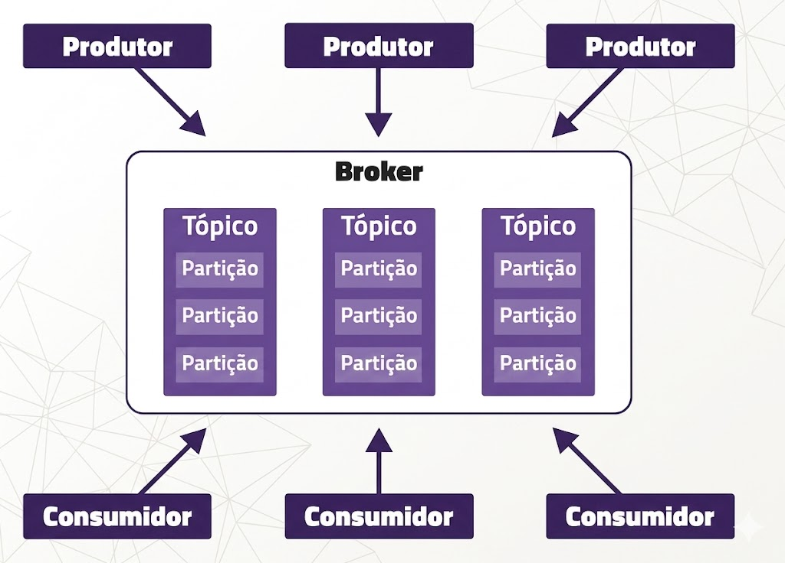
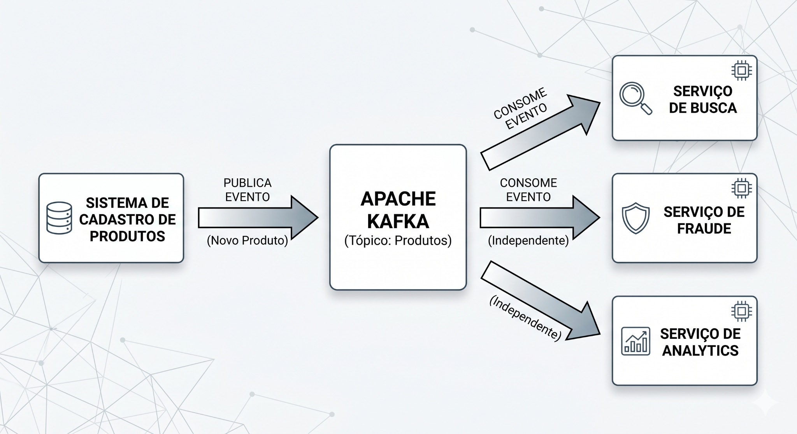
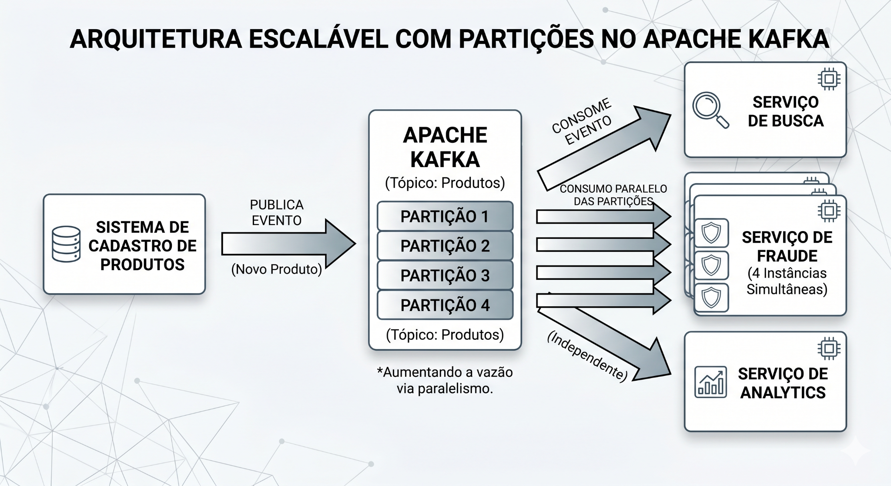
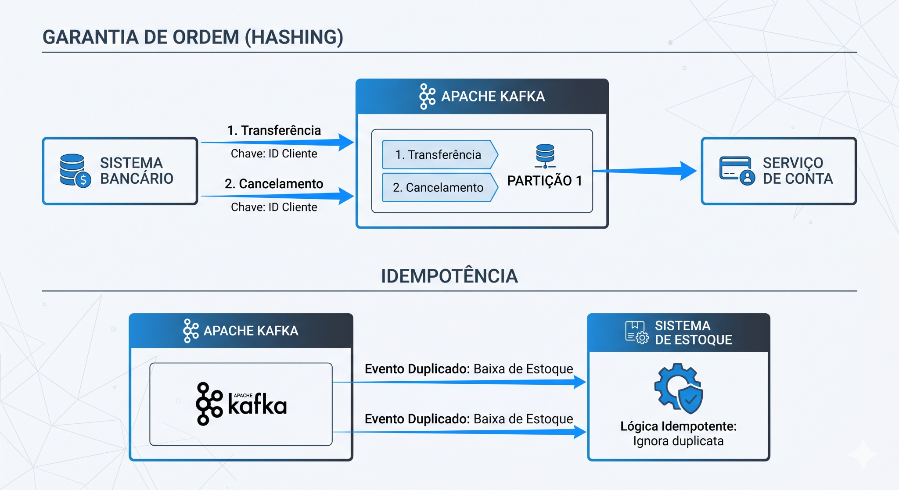
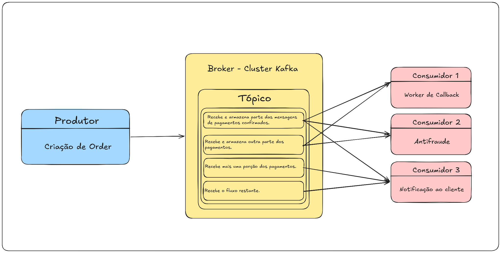

# Apache Kafka para Desenvolvimento Backend

## Sobre esta apostila

Esta apostila apresenta o Apache Kafka de forma didática, prática e orientada ao dia a dia de um desenvolvedor backend. O objetivo é entender não apenas o que é Kafka, mas também quando usar, como modelar eventos, como pensar em tópicos e partições, como consumir mensagens com segurança, como lidar com duplicidade e como subir um ambiente local com Docker para praticar.

O material original enviado abordava Kafka como uma plataforma distribuída de streaming de eventos, explicando produtores, consumidores, brokers, tópicos, partições, chaves, ordenação, confiabilidade e idempotência. Esta versão reorganiza esses pontos em uma apostila mais completa e prática, mantendo o foco nos exemplos de backend, mensageria e arquitetura orientada a eventos.

> **Observação sobre imagens:** as imagens desta apostila foram extraídas do documento original enviado e organizadas em `images/kafka/`. Antes de publicar este material em um repositório público, revise a licença e a origem das imagens.

---

## Como estudar por esta apostila

Leia os capítulos na ordem. Kafka costuma parecer confuso quando estudado apenas por comandos, porque ele não é só uma fila. Ele combina conceitos de mensageria, log distribuído, armazenamento, particionamento, paralelismo, tolerância a falhas e processamento de eventos.

A melhor forma de estudar é:

1. Entender o problema que Kafka resolve.
2. Entender a arquitetura: broker, tópico, partição, produtor, consumidor e consumer group.
3. Subir um Kafka local com Docker.
4. Criar um tópico, publicar mensagens e consumir mensagens.
5. Implementar um produtor e um consumidor em Python.
6. Simular falhas, duplicidades e reprocessamento.
7. Entender os cuidados de produção: idempotência, offsets, retenção, DLQ, métricas e segurança.

---

## Índice

1. [Capítulo 1 — O problema que o Kafka resolve](#capítulo-1--o-problema-que-o-kafka-resolve)
2. [Capítulo 2 — O que é Apache Kafka?](#capítulo-2--o-que-é-apache-kafka)
3. [Capítulo 3 — Eventos, mensagens e arquitetura orientada a eventos](#capítulo-3--eventos-mensagens-e-arquitetura-orientada-a-eventos)
4. [Capítulo 4 — Arquitetura básica do Kafka](#capítulo-4--arquitetura-básica-do-kafka)
5. [Capítulo 5 — Tópicos, partições e paralelismo](#capítulo-5--tópicos-partições-e-paralelismo)
6. [Capítulo 6 — Chaves, ordenação e hashing](#capítulo-6--chaves-ordenação-e-hashing)
7. [Capítulo 7 — Produtores no Kafka](#capítulo-7--produtores-no-kafka)
8. [Capítulo 8 — Consumidores e consumer groups](#capítulo-8--consumidores-e-consumer-groups)
9. [Capítulo 9 — Offsets, commits e reprocessamento](#capítulo-9--offsets-commits-e-reprocessamento)
10. [Capítulo 10 — Garantias de entrega, duplicidade e idempotência](#capítulo-10--garantias-de-entrega-duplicidade-e-idempotência)
11. [Capítulo 11 — Replicação, disponibilidade e durabilidade](#capítulo-11--replicação-disponibilidade-e-durabilidade)
12. [Capítulo 12 — Retenção, compactação e Kafka como log distribuído](#capítulo-12--retenção-compactação-e-kafka-como-log-distribuído)
13. [Capítulo 13 — Modelagem de eventos para backend](#capítulo-13--modelagem-de-eventos-para-backend)
14. [Capítulo 14 — Kafka com Docker e Docker Compose](#capítulo-14--kafka-com-docker-e-docker-compose)
15. [Capítulo 15 — Produtor e consumidor em Python](#capítulo-15--produtor-e-consumidor-em-python)
16. [Capítulo 16 — Exemplo prático: fluxo de pagamento com Kafka](#capítulo-16--exemplo-prático-fluxo-de-pagamento-com-kafka)
17. [Capítulo 17 — Padrões importantes em sistemas com Kafka](#capítulo-17--padrões-importantes-em-sistemas-com-kafka)
18. [Capítulo 18 — Quando usar Kafka e quando não usar](#capítulo-18--quando-usar-kafka-e-quando-não-usar)
19. [Capítulo 19 — Segurança, observabilidade e operação](#capítulo-19--segurança-observabilidade-e-operação)
20. [Capítulo 20 — Kafka em CI/CD e testes de backend](#capítulo-20--kafka-em-cicd-e-testes-de-backend)
21. [Cheat sheet de Kafka](#cheat-sheet-de-kafka)
22. [Exercícios práticos](#exercícios-práticos)
23. [Referências bibliográficas](#referências-bibliográficas)

---

# Capítulo 1 — O problema que o Kafka resolve

## O problema

Imagine um sistema de e-commerce com vários serviços:

- serviço de pedidos;
- serviço de pagamento;
- serviço de estoque;
- serviço de nota fiscal;
- serviço de envio de e-mail;
- serviço antifraude;
- serviço de analytics.

Quando um pedido é criado, vários desses serviços precisam saber disso. Uma solução simples seria o serviço de pedidos chamar diretamente cada serviço via HTTP.

```text
Pedido criado
   ├── chama pagamento
   ├── chama estoque
   ├── chama antifraude
   ├── chama nota fiscal
   ├── chama e-mail
   └── chama analytics
```

Esse modelo funciona no começo, mas cria alguns problemas:

- o serviço de pedidos passa a conhecer muitos outros serviços;
- se um serviço consumidor estiver fora do ar, o fluxo principal pode falhar;
- adicionar um novo consumidor exige alterar o serviço produtor;
- chamadas síncronas aumentam a latência;
- reprocessar eventos antigos fica difícil;
- cada integração vira uma ligação ponto a ponto.

Em sistemas pequenos, isso pode ser aceitável. Em sistemas grandes, esse acoplamento vira um problema de manutenção, escala e resiliência.

## A ideia central

O Kafka resolve esse problema colocando um intermediário entre quem produz eventos e quem consome eventos.

```text
Serviço produtor → Kafka → Serviços consumidores
```

O produtor publica um evento em um tópico. Os consumidores interessados leem esse evento quando puderem. O produtor não precisa saber quantos consumidores existem, onde eles estão rodando ou o que cada um fará com o evento.

## Exemplo simples

Em vez de o serviço de pedidos chamar todos os outros serviços diretamente, ele publica um evento:

```json
{
  "event_id": "evt_001",
  "event_type": "OrderCreated",
  "occurred_at": "2026-05-31T18:30:00Z",
  "data": {
    "order_id": "ord_123",
    "customer_id": "cus_456",
    "total_amount": 159.90
  }
}
```

Depois disso, cada serviço decide o que fazer:

- pagamento inicia a cobrança;
- estoque reserva os produtos;
- antifraude analisa o pedido;
- e-mail envia confirmação;
- analytics registra métricas.

## O que aconteceu?

O backend deixou de depender de várias chamadas diretas e passou a emitir um fato de negócio: `OrderCreated`.

Esse fato fica disponível para outros serviços, inclusive serviços que ainda nem existem hoje. Amanhã, se a empresa criar um serviço de recomendação, ele poderá consumir o mesmo evento sem alterar o serviço de pedidos.

## Quando usar isso?

Use Kafka quando você precisa lidar com eventos em alto volume, processamento assíncrono, integração entre serviços, reprocessamento de dados, pipelines de eventos, sincronização entre sistemas ou arquitetura orientada a eventos.

Não use Kafka apenas porque ele é moderno. Para um sistema simples com poucas integrações, uma fila mais simples, uma chamada HTTP direta ou até um job agendado pode resolver melhor.

## Resumo do capítulo

Kafka ajuda a desacoplar sistemas. Em vez de um serviço chamar vários outros diretamente, ele publica eventos. Os serviços interessados consomem esses eventos de forma independente.

---

# Capítulo 2 — O que é Apache Kafka?

## Definição prática

Apache Kafka é uma plataforma distribuída de streaming de eventos. Na prática, isso significa que ele permite publicar, armazenar, processar e consumir eventos em grande escala.

Ele pode ser entendido como uma combinação de três ideias:

1. **Mensageria:** serviços enviam e recebem mensagens.
2. **Log distribuído:** eventos ficam armazenados de forma ordenada dentro de partições.
3. **Streaming:** os dados podem ser processados continuamente, quase em tempo real.

## Kafka não é apenas uma fila

É comum comparar Kafka com uma fila de mensagens. Isso ajuda no início, mas a comparação é limitada.

Em uma fila tradicional, normalmente uma mensagem é entregue a um consumidor e depois removida. No Kafka, os eventos são gravados em um log e permanecem disponíveis por um tempo configurado. Vários consumidores podem ler os mesmos eventos de forma independente.

Isso permite:

- reprocessar dados antigos;
- ter múltiplos consumidores para o mesmo fluxo;
- criar pipelines de dados;
- auditar eventos;
- construir integrações desacopladas.

## Modelo mental

Pense em Kafka como um diário de eventos do sistema.

Quando algo importante acontece, o sistema escreve no diário. Depois, vários leitores podem ler esse diário em velocidades diferentes.

```text
Evento 1 → Evento 2 → Evento 3 → Evento 4 → ...
```

Cada consumidor guarda sua própria posição de leitura. Isso é muito importante: o Kafka não precisa apagar uma mensagem só porque um consumidor leu. Outro consumidor pode ler a mesma mensagem depois.

## Principais casos de uso

Kafka costuma aparecer em cenários como:

- processamento de pedidos;
- antifraude;
- notificações;
- trilhas de auditoria;
- ingestão de logs;
- integração entre microsserviços;
- CDC, ou captura de mudanças de banco de dados;
- pipelines de dados;
- analytics em tempo real;
- sincronização entre sistemas;
- processamento de eventos financeiros.

## O que pode dar errado?

O erro mais comum é usar Kafka como se fosse apenas uma fila simples. Isso leva a decisões ruins, como criar tópicos sem estratégia, ignorar chaves de particionamento, não tratar duplicidade e não pensar em reprocessamento.

Kafka exige modelagem. Antes de criar tópicos, pergunte:

- qual evento representa um fato de negócio?
- quem produz esse evento?
- quem consome?
- a ordem importa?
- pode haver duplicidade?
- por quanto tempo o evento deve ficar armazenado?
- o consumidor pode reprocessar mensagens antigas?

## Resumo do capítulo

Kafka é uma plataforma de streaming de eventos. Ele permite que sistemas publiquem eventos, armazenem esses eventos e permitam que vários consumidores leiam esses dados de forma independente.

---

# Capítulo 3 — Eventos, mensagens e arquitetura orientada a eventos

## O que é um evento?

Um evento é o registro de algo que aconteceu no sistema.

Exemplos:

- `UserRegistered`
- `OrderCreated`
- `PaymentApproved`
- `PaymentRejected`
- `ProductCreated`
- `StockReserved`
- `InvoiceIssued`

Um evento deve representar um fato, geralmente no passado. Por isso, nomes como `OrderCreated` são melhores do que nomes como `CreateOrder`.

`CreateOrder` parece um comando, ou seja, uma ordem para alguém fazer algo. `OrderCreated` representa algo que já aconteceu.

## Evento versus comando

| Tipo | O que significa | Exemplo |
|---|---|---|
| Comando | Pedido para executar uma ação | `CreateOrder` |
| Evento | Fato que já aconteceu | `OrderCreated` |

Essa diferença é importante em arquitetura.

Um comando costuma ter um destinatário claro. Um evento pode ter vários consumidores, inclusive consumidores que o produtor desconhece.

## Estrutura de um evento

Um evento em Kafka geralmente contém:

- **key:** chave usada para particionamento e ordenação;
- **value:** conteúdo principal da mensagem;
- **timestamp:** momento do evento;
- **headers:** metadados opcionais;
- **topic:** fluxo lógico onde o evento será publicado;
- **partition:** partição física/lógica onde a mensagem será gravada;
- **offset:** posição da mensagem dentro da partição.

## Exemplo de evento de backend

```json
{
  "event_id": "evt_8f7a1b",
  "event_type": "PaymentApproved",
  "event_version": 1,
  "occurred_at": "2026-05-31T19:00:00Z",
  "producer": "payments-service",
  "correlation_id": "req_123456",
  "data": {
    "payment_id": "pay_789",
    "order_id": "ord_123",
    "customer_id": "cus_456",
    "amount": 159.90,
    "currency": "BRL"
  }
}
```

## O que aconteceu no exemplo?

O evento informa que um pagamento foi aprovado. Ele não manda outro serviço fazer algo diretamente. Ele apenas registra o fato. O serviço de pedidos, o serviço de nota fiscal, o serviço de e-mail e o serviço de analytics podem consumir esse evento e agir de acordo com suas responsabilidades.

## Boas práticas para eventos

Prefira eventos com nomes de negócio, não nomes técnicos. `PaymentApproved` é melhor do que `KafkaMessageSent`.

Inclua um `event_id` para facilitar idempotência e rastreamento. Inclua `occurred_at` para saber quando o fato aconteceu. Inclua `event_version` para evoluir o contrato sem quebrar consumidores. Inclua `correlation_id` para rastrear o fluxo entre sistemas.

## Resumo do capítulo

Eventos são fatos de negócio. Kafka é muito útil quando você modela seu backend em torno desses fatos, permitindo que diferentes serviços reajam a eles de forma independente.

---

# Capítulo 4 — Arquitetura básica do Kafka

## Componentes principais

A arquitetura do Kafka é formada por alguns componentes essenciais.

| Componente | Função |
|---|---|
| Broker | Servidor Kafka que armazena e serve dados |
| Cluster | Conjunto de brokers Kafka |
| Producer | Aplicação que publica eventos |
| Consumer | Aplicação que lê eventos |
| Topic | Categoria lógica onde eventos são publicados |
| Partition | Divisão do tópico para escala e paralelismo |
| Offset | Posição de uma mensagem dentro da partição |
| Consumer group | Grupo de consumidores trabalhando juntos |
| Key | Chave usada para decidir a partição |
| Value | Conteúdo principal da mensagem |

## Visão geral



Na imagem, produtores publicam eventos no broker Kafka. Dentro do broker existem tópicos, e cada tópico pode ser dividido em partições. Consumidores leem os eventos desses tópicos.

## Broker

Um broker é um servidor Kafka. Ele recebe mensagens dos produtores, grava essas mensagens em disco e entrega mensagens aos consumidores.

Em produção, Kafka normalmente roda com vários brokers formando um cluster. Isso permite distribuir carga e criar réplicas para tolerância a falhas.

## Topic

Um tópico é um fluxo lógico de eventos.

Exemplos de tópicos:

```text
orders.created
payments.approved
payments.rejected
inventory.reserved
notifications.email.requested
```

Um tópico deve representar um tipo de evento ou uma família clara de eventos. Evite tópicos genéricos como `events` ou `messages`, porque eles dificultam governança, manutenção e consumo seletivo.

## Partition

Uma partição é uma divisão interna do tópico. Cada partição é um log ordenado e imutável.

Se um tópico tem quatro partições, seus eventos serão distribuídos entre essas partições conforme a chave ou estratégia de particionamento.

## Offset

Offset é a posição de uma mensagem dentro de uma partição.

```text
partition 0:
offset 0 → evento A
offset 1 → evento B
offset 2 → evento C
```

Cada consumidor controla até qual offset já processou. Esse controle permite continuar de onde parou após uma falha.

## Consumer group

Um consumer group é um conjunto de consumidores que trabalham juntos para processar um tópico.

Dentro de um mesmo grupo, cada partição é atribuída a apenas um consumidor por vez. Isso permite paralelismo sem duplicar processamento dentro do grupo.

Consumidores em grupos diferentes recebem suas próprias cópias lógicas dos eventos.

## Resumo do capítulo

Kafka organiza eventos em tópicos. Tópicos são divididos em partições. Brokers armazenam os dados. Produtores escrevem eventos. Consumidores leem eventos. Offsets controlam a posição de leitura.

---

# Capítulo 5 — Tópicos, partições e paralelismo

## O problema

Se todos os eventos de um tópico ficassem em uma única sequência, apenas um consumidor poderia processar esses eventos mantendo a ordem total. Isso limitaria a escala.

Kafka resolve esse problema dividindo tópicos em partições.

## Como partições ajudam

Partições permitem:

- distribuir dados entre brokers;
- processar mensagens em paralelo;
- aumentar throughput;
- escalar consumidores;
- manter ordem dentro de cada partição.

## Exemplo de distribuição



A imagem mostra um sistema de cadastro de produtos publicando um evento em Kafka. Serviços diferentes, como busca, fraude e analytics, podem consumir o mesmo evento de maneira independente.

## Particionamento na prática



Na imagem, o tópico de produtos é dividido em partições. Isso permite que múltiplas instâncias de um serviço consumidor trabalhem em paralelo.

## Exemplo

Imagine um tópico `products.created` com quatro partições.

```text
products.created
├── partition 0
├── partition 1
├── partition 2
└── partition 3
```

Se o serviço de busca tem quatro instâncias no mesmo consumer group, cada instância pode processar uma partição.

```text
Consumer group: search-indexer
├── consumer 1 → partition 0
├── consumer 2 → partition 1
├── consumer 3 → partition 2
└── consumer 4 → partition 3
```

## Regra importante

O número de consumidores ativos em um mesmo consumer group não aumenta o paralelismo além do número de partições.

Se um tópico tem quatro partições e você sobe seis consumidores no mesmo grupo, dois consumidores ficarão ociosos.

```text
4 partições + 6 consumidores no mesmo grupo = no máximo 4 consumidores trabalhando
```

## Como escolher o número de partições?

Não existe número mágico. Você deve considerar:

- volume esperado de mensagens;
- throughput de produção;
- throughput de consumo;
- necessidade de paralelismo;
- quantidade de consumidores;
- crescimento futuro;
- custo operacional;
- necessidade de ordenação.

Uma decisão comum é começar com mais de uma partição para tópicos que podem crescer, mas sem exagerar. Partições demais aumentam complexidade, uso de recursos e custo de rebalanceamento.

## O que pode dar errado?

Criar poucas partições pode limitar o paralelismo. Criar partições demais pode deixar o cluster mais pesado. Escolher uma chave ruim pode concentrar muitos eventos em uma única partição, gerando hotspot.

## Resumo do capítulo

Partições são a base da escala no Kafka. Elas permitem paralelismo, distribuição de carga e ordenação local. A ordem é garantida dentro da partição, não necessariamente no tópico inteiro.

---

# Capítulo 6 — Chaves, ordenação e hashing

## O problema da ordem

Em muitos sistemas, a ordem dos eventos importa.

Exemplo bancário:

```text
1. Transferência criada
2. Transferência cancelada
```

Se o cancelamento for processado antes da criação, o sistema pode entrar em estado inconsistente.

## Como Kafka mantém ordem

Kafka garante ordem dentro de uma partição. Para eventos relacionados caírem sempre na mesma partição, usamos uma chave.

```text
key = customer_id
```

Mensagens com a mesma chave tendem a ser enviadas para a mesma partição. Assim, eventos do mesmo cliente são processados na ordem em que foram gravados naquela partição.

## Exemplo visual



A imagem mostra dois conceitos importantes: a garantia de ordem por chave e a necessidade de idempotência quando eventos duplicados chegam ao consumidor.

## Exemplo prático

Em um sistema de pagamentos, podemos usar `account_id` como chave.

```json
{
  "key": "account_123",
  "value": {
    "event_type": "TransferCreated",
    "transfer_id": "trf_001",
    "amount": 100.0
  }
}
```

Depois:

```json
{
  "key": "account_123",
  "value": {
    "event_type": "TransferCancelled",
    "transfer_id": "trf_001"
  }
}
```

Como a chave é a mesma, os dois eventos vão para a mesma partição. Isso preserva a ordem relativa desses eventos.

## Escolhendo a chave correta

A chave deve ser escolhida conforme a unidade de ordenação do negócio.

| Cenário | Chave recomendada |
|---|---|
| Eventos de pedido | `order_id` |
| Eventos de pagamento | `payment_id` ou `order_id` |
| Eventos por cliente | `customer_id` |
| Eventos de conta bancária | `account_id` |
| Eventos de estoque por produto | `product_id` |
| Eventos de sessão | `session_id` |

## Cuidado com hotspots

Se muitas mensagens usam a mesma chave, elas irão para a mesma partição. Isso pode sobrecarregar uma partição enquanto outras ficam leves.

Exemplo ruim:

```text
key = "all_events"
```

Nesse caso, todos os eventos caem na mesma partição, destruindo o paralelismo.

## O que pode dar errado?

Achar que Kafka garante ordem global é um erro comum. Kafka garante ordem dentro de cada partição. Se eventos relacionados caem em partições diferentes, você não deve depender da ordem entre eles.

## Resumo do capítulo

Use chaves para controlar particionamento e preservar ordem de eventos relacionados. A escolha da chave é uma decisão de modelagem de domínio, não apenas uma configuração técnica.

---

# Capítulo 7 — Produtores no Kafka

## O que é um produtor?

Produtor é a aplicação que envia eventos para Kafka.

Exemplos:

- API de pedidos publicando `OrderCreated`;
- serviço de pagamento publicando `PaymentApproved`;
- worker de estoque publicando `StockReserved`;
- job de importação publicando `CustomerImported`.

## Fluxo básico de produção

```text
Aplicação backend
   ↓
Producer Kafka
   ↓
Topic
   ↓
Partition
   ↓
Broker
```

O produtor escolhe o tópico, envia a chave e o valor da mensagem, e o Kafka grava o evento em uma partição.

## Exemplo conceitual

```python
producer.produce(
    topic="orders.created",
    key="ord_123",
    value={
        "event_type": "OrderCreated",
        "order_id": "ord_123",
        "customer_id": "cus_456"
    }
)
```

## Configurações importantes do produtor

### `bootstrap.servers`

Lista de brokers usados para iniciar a conexão.

```text
localhost:9092
```

Em produção, informe mais de um broker.

```text
broker-1:9092,broker-2:9092,broker-3:9092
```

### `acks`

Define quantas confirmações o produtor espera antes de considerar uma mensagem enviada.

| Valor | Significado | Risco |
|---|---|---|
| `0` | não espera confirmação | maior risco de perda |
| `1` | espera confirmação do líder | equilíbrio |
| `all` | espera confirmação das réplicas necessárias | mais durável |

Para fluxos críticos, prefira `acks=all`.

### `retries`

Permite reenviar mensagens em falhas temporárias. É importante para lidar com instabilidades de rede.

### `enable.idempotence`

Ajuda o produtor a evitar duplicidade causada por retry. Em versões modernas do Kafka, idempotência do produtor é uma configuração fundamental para maior segurança de entrega.

### `compression.type`

Permite compactar mensagens antes de enviar.

Valores comuns:

```text
gzip
snappy
lz4
zstd
```

Compressão reduz tráfego de rede e disco, mas adiciona custo de CPU.

### `linger.ms` e `batch.size`

Controlam batching. O produtor pode agrupar mensagens antes de enviar, aumentando throughput.

## Quando configurar com mais cuidado?

Configure produtores com mais cuidado quando:

- o fluxo é financeiro;
- perda de mensagem é inaceitável;
- há alto volume de eventos;
- há necessidade de baixa latência;
- há risco de duplicidade;
- o payload é grande;
- o sistema precisa manter ordem por chave.

## O que pode dar errado?

Um produtor pode publicar mensagens duplicadas em cenários de retry se não estiver configurado corretamente. Também pode publicar mensagens sem chave e perder a ordenação por entidade. Outro erro comum é publicar payloads enormes em Kafka, transformando o broker em depósito de arquivos. Para arquivos grandes, prefira armazenar em object storage e publicar apenas uma referência.

## Resumo do capítulo

Produtores escrevem eventos em tópicos. Para backend, é importante configurar corretamente chave, serialização, retries, `acks`, idempotência, compressão e observabilidade.

---

# Capítulo 8 — Consumidores e consumer groups

## O que é um consumidor?

Consumidor é a aplicação que lê eventos de um ou mais tópicos Kafka.

Exemplos:

- serviço de e-mail consumindo `notifications.email.requested`;
- serviço de estoque consumindo `orders.created`;
- serviço de analytics consumindo vários tópicos;
- indexador de busca consumindo `products.created`;
- antifraude consumindo `payments.requested`.

## O que é um consumer group?

Consumer group é um grupo lógico de consumidores que dividem entre si o processamento das partições.

```text
Topic: orders.created
Partitions: 0, 1, 2, 3

Consumer group: inventory-service
├── consumer A → partitions 0 e 1
└── consumer B → partitions 2 e 3
```

Se outro serviço quiser consumir os mesmos eventos, ele usa outro grupo.

```text
Consumer group: email-service
Consumer group: analytics-service
Consumer group: inventory-service
```

Cada grupo tem seus próprios offsets. Isso significa que cada serviço pode consumir o mesmo tópico em seu próprio ritmo.

## Exemplo prático

Um evento `OrderCreated` pode ser consumido por três grupos diferentes:

```text
orders.created
├── inventory-service
├── email-service
└── analytics-service
```

Cada um processa o mesmo evento com sua própria regra.

## Rebalanceamento

Quando um consumidor entra ou sai do grupo, Kafka redistribui partições entre os consumidores. Esse processo é chamado de rebalanceamento.

Rebalanceamento é necessário, mas pode interromper temporariamente o consumo. Por isso, consumidores devem ser projetados para lidar com reprocessamento e duplicidade.

## O que pode dar errado?

Um consumidor lento pode atrasar o processamento de uma partição. Como a ordem é preservada por partição, se uma mensagem trava, mensagens posteriores daquela partição podem ficar paradas.

Outro problema comum é aumentar consumidores sem aumentar partições. Se o tópico tem poucas partições, subir muitos consumidores não melhora o throughput.

## Resumo do capítulo

Consumer groups permitem escalar processamento. Cada grupo lê o tópico de forma independente. Dentro de um grupo, as partições são distribuídas entre os consumidores.

---

# Capítulo 9 — Offsets, commits e reprocessamento

## O que é offset?

Offset é a posição de uma mensagem dentro de uma partição.

```text
partition 0
offset 0 → evento A
offset 1 → evento B
offset 2 → evento C
```

O consumidor usa offsets para saber de onde continuar.

## O que é commit de offset?

Commit é o ato de salvar a posição processada.

Quando o consumidor confirma o offset, ele está dizendo:

> “Eu processei até aqui.”

Se o consumidor cair, ao voltar ele continuará a partir do último offset confirmado.

## Auto commit versus manual commit

### Auto commit

O consumidor confirma offsets automaticamente em intervalos configurados.

Vantagem:

- mais simples.

Desvantagem:

- pode confirmar uma mensagem antes de ela ter sido processada com sucesso.

### Manual commit

A aplicação confirma o offset depois que o processamento termina.

Vantagem:

- mais controle e segurança.

Desvantagem:

- exige mais cuidado no código.

## Exemplo de fluxo seguro

```text
1. Consumidor lê mensagem.
2. Valida o payload.
3. Executa regra de negócio.
4. Persiste resultado no banco.
5. Confirma offset.
```

Se a aplicação cair antes do passo 5, a mensagem pode ser lida novamente. Por isso, a regra de negócio deve ser idempotente.

## Reprocessamento

Uma vantagem do Kafka é permitir reprocessamento.

Exemplos:

- um bug foi corrigido e você quer recalcular dados;
- um novo serviço precisa processar eventos antigos;
- você quer reconstruir uma projeção;
- um índice de busca precisa ser recriado.

Para isso, você pode alterar offsets ou criar um novo consumer group.

## O que pode dar errado?

Confirmar offset antes de processar pode causar perda lógica. Processar sem idempotência pode causar efeitos duplicados. Reprocessar sem estratégia pode disparar e-mails antigos, duplicar cobranças ou recalcular dados indevidamente.

## Resumo do capítulo

Offsets são a base do controle de leitura. Para backend, o ponto mais importante é confirmar offsets apenas depois de processar a mensagem com sucesso e garantir que o processamento seja idempotente.

---

# Capítulo 10 — Garantias de entrega, duplicidade e idempotência

## O problema

Em sistemas distribuídos, falhas acontecem:

- timeout de rede;
- broker indisponível;
- consumidor reiniciado;
- producer sem resposta;
- banco lento;
- deploy interrompendo workers.

Por isso, é perigoso assumir que cada mensagem será processada uma única vez sem esforço de implementação.

## Principais garantias

### At-most-once

A mensagem é processada no máximo uma vez.

Pode haver perda.

```text
commit offset → processa mensagem
```

Se a aplicação cair depois do commit e antes do processamento, a mensagem não será reprocessada.

### At-least-once

A mensagem é processada pelo menos uma vez.

Pode haver duplicidade.

```text
processa mensagem → commit offset
```

Se a aplicação cair depois do processamento e antes do commit, a mensagem será processada novamente.

### Exactly-once

A ideia é garantir que o efeito do processamento aconteça uma única vez. Em Kafka, isso depende de configurações e padrões como produtor idempotente, transações e controle correto entre consumo, processamento e produção de novos eventos.

Na prática de backend, mesmo quando Kafka oferece recursos para reduzir duplicidade, você deve projetar consumidores como idempotentes.

## Idempotência

Uma operação idempotente pode ser executada mais de uma vez sem alterar o resultado além da primeira execução.

Exemplo idempotente:

```text
Marcar pagamento pay_123 como APROVADO.
```

Se executar duas vezes, o pagamento continua aprovado.

Exemplo não idempotente:

```text
Subtrair 1 unidade do estoque.
```

Se executar duas vezes, remove duas unidades.

## Exemplo de idempotência com banco

Uma estratégia comum é salvar o `event_id` processado.

```sql
CREATE TABLE processed_events (
    event_id VARCHAR(100) PRIMARY KEY,
    processed_at TIMESTAMP NOT NULL DEFAULT CURRENT_TIMESTAMP
);
```

Ao consumir uma mensagem:

```text
1. Ler event_id.
2. Verificar se event_id já existe em processed_events.
3. Se existir, ignorar.
4. Se não existir, processar e gravar event_id na mesma transação.
```

## Pseudocódigo

```python
def process_event(event):
    with transaction():
        if processed_events.exists(event["event_id"]):
            return

        apply_business_rule(event)
        processed_events.insert(event["event_id"])
```

## Exemplo de estoque

Ruim:

```python
def handle_stock_reserved(event):
    product_id = event["product_id"]
    quantity = event["quantity"]

    stock.decrement(product_id, quantity)
```

Se a mensagem for duplicada, o estoque será decrementado duas vezes.

Melhor:

```python
def handle_stock_reserved(event):
    reservation_id = event["reservation_id"]

    if stock_reservations.exists(reservation_id):
        return

    stock.reserve(
        reservation_id=reservation_id,
        product_id=event["product_id"],
        quantity=event["quantity"],
    )
```

Agora a operação é controlada por `reservation_id`.

## Resumo do capítulo

Kafka pode reenviar mensagens e consumidores podem reprocessar eventos. Em sistemas reais, trate duplicidade como algo esperado. Idempotência não é detalhe: é requisito de segurança para backend com eventos.

---

# Capítulo 11 — Replicação, disponibilidade e durabilidade

## O problema

Se um broker falhar, os dados não podem simplesmente desaparecer. Kafka precisa manter disponibilidade e durabilidade.

## Replicação

Kafka pode manter cópias de partições em diferentes brokers.

```text
topic: payments.approved
partition 0
├── broker 1: leader
├── broker 2: follower
└── broker 3: follower
```

Uma réplica é líder. As outras são followers.

Produtores escrevem na réplica líder. Followers replicam os dados. Se o líder falhar, uma réplica em sincronia pode ser promovida.

## Replication factor

Replication factor é o número de cópias da partição.

```text
replication.factor=3
```

Isso significa uma cópia líder e duas cópias followers.

Em produção, `3` é um valor comum para tópicos importantes. Em desenvolvimento local, usamos `1`.

## ISR

ISR significa in-sync replicas. São réplicas suficientemente atualizadas em relação ao líder.

Para alta durabilidade, combine:

```text
acks=all
min.insync.replicas=2
replication.factor=3
```

Com isso, o produtor só recebe confirmação se a mensagem for gravada no líder e em réplicas suficientes.

## Trade-off

Mais replicação aumenta durabilidade, mas também aumenta uso de disco, rede e latência. Para eventos críticos, esse custo costuma valer a pena. Para eventos menos importantes, a configuração pode ser mais simples.

## O que pode dar errado?

Usar `replication.factor=1` em produção deixa o tópico vulnerável. Usar `acks=1` em eventos críticos pode aceitar mensagens que ainda não foram replicadas. Configurar `min.insync.replicas` incorretamente pode causar indisponibilidade ou perda de garantias.

## Resumo do capítulo

Replicação protege contra falhas de broker. Para eventos importantes, use múltiplas réplicas e configure produtores para esperar confirmação adequada.

---

# Capítulo 12 — Retenção, compactação e Kafka como log distribuído

## Retenção

Kafka não remove mensagens imediatamente após o consumo. Ele mantém os dados conforme uma política de retenção.

A retenção pode ser por tempo:

```text
retention.ms=604800000
```

Ou por tamanho:

```text
retention.bytes=1073741824
```

Isso permite reprocessar eventos antigos dentro da janela de retenção.

## Kafka como log

Cada partição é um log append-only, ou seja, os eventos são acrescentados no final.

```text
offset 0 → evento A
offset 1 → evento B
offset 2 → evento C
```

Esse modelo é diferente de uma tabela de banco tradicional. Kafka não atualiza linhas; ele registra eventos.

## Log compaction

Em alguns tópicos, você pode querer manter apenas o último valor por chave. Esse recurso é chamado de compactação.

Exemplo:

```text
key=user_1 value={"email":"a@exemplo.com"}
key=user_1 value={"email":"b@exemplo.com"}
```

Com compactação, Kafka pode manter apenas o último valor da chave `user_1`.

## Quando usar compactação?

Use em tópicos que representam estado mais recente por chave, como:

- perfil atualizado de usuário;
- configuração atual de cliente;
- saldo atual calculado;
- snapshot de entidade;
- cache distribuído baseado em eventos.

## Diferença entre retenção e compactação

| Estratégia | O que faz |
|---|---|
| Retenção por tempo/tamanho | remove eventos antigos conforme limite |
| Compactação | mantém o último valor por chave |

## O que pode dar errado?

Se você configurar retenção curta demais, perde capacidade de reprocessamento. Se configurar retenção longa demais, aumenta custo de disco. Se usar compactação sem entender o modelo, pode perder histórico que era importante para auditoria.

## Resumo do capítulo

Kafka armazena eventos por uma política de retenção. Isso permite reprocessamento e desacoplamento. Para alguns tópicos, compactação ajuda a manter apenas o estado mais recente por chave.

---

# Capítulo 13 — Modelagem de eventos para backend

## Por que modelar eventos?

Em Kafka, o contrato mais importante não é apenas uma rota HTTP. É o evento publicado no tópico.

Se o evento for mal modelado, todos os consumidores sofrem.

## Nome de tópicos

Use nomes claros e consistentes.

Exemplos:

```text
orders.created
orders.cancelled
payments.approved
payments.rejected
inventory.reserved
emails.requested
```

Evite:

```text
topic1
messages
general-events
backend-topic
```

## Evento único ou vários eventos?

Prefira eventos específicos quando eles representam fatos diferentes.

Melhor:

```text
payments.approved
payments.rejected
payments.refunded
```

Pior:

```text
payments.events
```

Um tópico genérico pode até funcionar, mas dificulta consumo seletivo, permissões, retenção e evolução.

## Envelope de evento

Um bom padrão é separar metadados de dados de negócio.

```json
{
  "event_id": "evt_123",
  "event_type": "OrderCreated",
  "event_version": 1,
  "occurred_at": "2026-05-31T20:00:00Z",
  "producer": "orders-service",
  "correlation_id": "req_abc",
  "data": {
    "order_id": "ord_123",
    "customer_id": "cus_456",
    "items": [
      {
        "product_id": "prd_1",
        "quantity": 2
      }
    ]
  }
}
```

## Campos recomendados

| Campo | Motivo |
|---|---|
| `event_id` | idempotência e rastreamento |
| `event_type` | identificação do tipo de evento |
| `event_version` | evolução de contrato |
| `occurred_at` | momento real do fato |
| `producer` | origem do evento |
| `correlation_id` | rastreamento entre sistemas |
| `data` | payload de negócio |

## Versionamento

Nunca quebre consumidores sem necessidade. Prefira mudanças aditivas.

Mudança segura:

```json
{
  "order_id": "ord_123",
  "total_amount": 100.0,
  "currency": "BRL"
}
```

Adicionar campo opcional:

```json
{
  "order_id": "ord_123",
  "total_amount": 100.0,
  "currency": "BRL",
  "coupon_code": "PROMO10"
}
```

Mudança perigosa:

```json
{
  "id": "ord_123",
  "amount": 100.0
}
```

Renomear campos quebra consumidores que esperam `order_id` e `total_amount`.

## Schema Registry

Em ambientes mais maduros, é comum usar Schema Registry para controlar contratos de eventos, principalmente com Avro, Protobuf ou JSON Schema.

O objetivo é validar compatibilidade entre versões e evitar que um produtor publique um evento incompatível com os consumidores.

## O que pode dar errado?

Eventos sem contrato viram integração frágil. Mudanças pequenas podem quebrar consumidores. Eventos com dados demais podem vazar informações sensíveis. Eventos com dados de menos obrigam consumidores a consultar outros serviços, aumentando acoplamento.

## Resumo do capítulo

Eventos são contratos. Modele eventos com o mesmo cuidado que modela APIs públicas. Nomeie tópicos com clareza, use envelope, pense em versionamento e mantenha consumidores compatíveis.

---

# Capítulo 14 — Kafka com Docker e Docker Compose

## Por que usar Docker?

Kafka tem vários detalhes de ambiente. Docker facilita subir um broker local para estudo, testes e desenvolvimento.

A documentação atual do Apache Kafka disponibiliza imagens oficiais `apache/kafka` a partir da linha 3.7. Para ambiente local, também existe `apache/kafka-native`, que inicia mais rápido, mas deve ser tratada como opção de desenvolvimento/teste, não como recomendação automática para produção.

## Subindo Kafka rapidamente com Docker

```bash
docker run -d \
  --name kafka \
  -p 9092:9092 \
  apache/kafka:4.1.2
```

Verifique se subiu:

```bash
docker ps
```

Obtenha o cluster id:

```bash
docker exec -it kafka \
  /opt/kafka/bin/kafka-cluster.sh cluster-id \
  --bootstrap-server :9092
```

## Criando um tópico

```bash
docker exec -it kafka \
  /opt/kafka/bin/kafka-topics.sh \
  --bootstrap-server :9092 \
  --create \
  --topic orders.created \
  --partitions 3 \
  --replication-factor 1
```

## Listando tópicos

```bash
docker exec -it kafka \
  /opt/kafka/bin/kafka-topics.sh \
  --bootstrap-server :9092 \
  --list
```

## Produzindo mensagens pelo terminal

```bash
docker exec -it kafka \
  /opt/kafka/bin/kafka-console-producer.sh \
  --bootstrap-server :9092 \
  --topic orders.created
```

Digite uma mensagem por linha:

```json
{"event_type":"OrderCreated","order_id":"ord_1"}
{"event_type":"OrderCreated","order_id":"ord_2"}
```

Finalize com `Ctrl + C`.

## Consumindo mensagens pelo terminal

```bash
docker exec -it kafka \
  /opt/kafka/bin/kafka-console-consumer.sh \
  --bootstrap-server :9092 \
  --topic orders.created \
  --from-beginning
```

## Docker Compose para desenvolvimento

Para projetos backend, Compose facilita subir Kafka e uma interface de visualização.

Crie `compose.yaml`:

```yaml
services:
  kafka:
    image: apache/kafka:4.1.2
    container_name: kafka
    ports:
      - "9092:9092"
    environment:
      KAFKA_LISTENERS: CONTROLLER://localhost:9091,HOST://0.0.0.0:9092,DOCKER://0.0.0.0:9093
      KAFKA_ADVERTISED_LISTENERS: HOST://localhost:9092,DOCKER://kafka:9093
      KAFKA_LISTENER_SECURITY_PROTOCOL_MAP: CONTROLLER:PLAINTEXT,DOCKER:PLAINTEXT,HOST:PLAINTEXT
      KAFKA_NODE_ID: 1
      KAFKA_PROCESS_ROLES: broker,controller
      KAFKA_CONTROLLER_LISTENER_NAMES: CONTROLLER
      KAFKA_CONTROLLER_QUORUM_VOTERS: 1@localhost:9091
      KAFKA_INTER_BROKER_LISTENER_NAME: DOCKER
      KAFKA_OFFSETS_TOPIC_REPLICATION_FACTOR: 1

  kafka-ui:
    image: kafbat/kafka-ui:main
    container_name: kafka-ui
    ports:
      - "8080:8080"
    environment:
      DYNAMIC_CONFIG_ENABLED: "true"
      KAFKA_CLUSTERS_0_NAME: local
      KAFKA_CLUSTERS_0_BOOTSTRAPSERVERS: kafka:9093
    depends_on:
      - kafka
```

Suba:

```bash
docker compose up -d
```

Acesse a UI:

```text
http://localhost:8080
```

Derrube o ambiente:

```bash
docker compose down
```

## Por que existem dois listeners?

Quando a aplicação roda na sua máquina, ela acessa Kafka por:

```text
localhost:9092
```

Quando uma aplicação roda dentro do Docker Compose, ela acessa Kafka pelo nome do serviço:

```text
kafka:9093
```

Por isso configuramos dois listeners:

- `HOST`, para conexões vindas do host;
- `DOCKER`, para conexões vindas da rede Docker.

Esse é um dos pontos que mais causa erro em Kafka com Docker.

## O que pode dar errado?

Se sua aplicação local tentar conectar em `kafka:9093`, ela falhará, porque esse nome só existe dentro da rede Docker. Se uma aplicação containerizada tentar conectar em `localhost:9092`, ela pode tentar acessar o próprio contêiner, não o broker Kafka.

## Resumo do capítulo

Use Docker para estudar Kafka localmente. Use Compose quando precisar integrar Kafka com aplicações backend, banco de dados, workers e ferramentas de visualização.

---

# Capítulo 15 — Produtor e consumidor em Python

## Instalação

Para exemplos em Python, usaremos `confluent-kafka`.

```bash
pip install confluent-kafka
```

## Produtor simples

Crie `producer.py`:

```python
import json
from uuid import uuid4
from datetime import datetime, timezone

from confluent_kafka import Producer


producer = Producer({
    "bootstrap.servers": "localhost:9092",
    "enable.idempotence": True,
    "acks": "all",
})


def delivery_report(error, message):
    if error is not None:
        print(f"Falha ao publicar evento: {error}")
        return

    print(
        "Evento publicado com sucesso "
        f"topic={message.topic()} "
        f"partition={message.partition()} "
        f"offset={message.offset()}"
    )


event = {
    "event_id": str(uuid4()),
    "event_type": "OrderCreated",
    "event_version": 1,
    "occurred_at": datetime.now(timezone.utc).isoformat(),
    "producer": "orders-service",
    "data": {
        "order_id": "ord_123",
        "customer_id": "cus_456",
        "total_amount": 159.90,
        "currency": "BRL",
    },
}

producer.produce(
    topic="orders.created",
    key=event["data"]["order_id"],
    value=json.dumps(event).encode("utf-8"),
    callback=delivery_report,
)

producer.flush()
```

Execute:

```bash
python producer.py
```

## O que aconteceu?

O produtor publicou um evento no tópico `orders.created`.

A chave usada foi `order_id`. Isso ajuda a manter eventos do mesmo pedido na mesma partição.

O payload foi serializado em JSON e enviado como bytes.

## Consumidor simples

Crie `consumer.py`:

```python
import json
from confluent_kafka import Consumer, KafkaException


consumer = Consumer({
    "bootstrap.servers": "localhost:9092",
    "group.id": "inventory-service",
    "auto.offset.reset": "earliest",
    "enable.auto.commit": False,
})

consumer.subscribe(["orders.created"])


def process_order_created(event):
    order_id = event["data"]["order_id"]
    print(f"Reservando estoque para o pedido {order_id}")


try:
    while True:
        message = consumer.poll(1.0)

        if message is None:
            continue

        if message.error():
            raise KafkaException(message.error())

        event = json.loads(message.value().decode("utf-8"))

        process_order_created(event)

        consumer.commit(message=message)

except KeyboardInterrupt:
    print("Encerrando consumidor...")

finally:
    consumer.close()
```

Execute:

```bash
python consumer.py
```

## Por que `enable.auto.commit=False`?

Porque queremos confirmar o offset apenas depois de processar a mensagem.

Esse padrão reduz o risco de marcar como processada uma mensagem que ainda não foi tratada com sucesso.

## Consumidor com idempotência

Um exemplo mais realista precisa impedir processamento duplicado.

```python
def was_processed(event_id: str) -> bool:
    # Em produção, consulte uma tabela de eventos processados.
    return False


def mark_as_processed(event_id: str) -> None:
    # Em produção, grave em banco dentro da mesma transação da regra de negócio.
    pass


def handle_event(event):
    event_id = event["event_id"]

    if was_processed(event_id):
        print(f"Evento duplicado ignorado: {event_id}")
        return

    process_order_created(event)
    mark_as_processed(event_id)
```

## Exemplo com FastAPI publicando evento

```python
import json
from uuid import uuid4
from datetime import datetime, timezone

from fastapi import FastAPI
from pydantic import BaseModel
from confluent_kafka import Producer


app = FastAPI()

producer = Producer({
    "bootstrap.servers": "localhost:9092",
    "enable.idempotence": True,
    "acks": "all",
})


class CreateOrderRequest(BaseModel):
    customer_id: str
    total_amount: float


@app.post("/orders")
def create_order(payload: CreateOrderRequest):
    order_id = f"ord_{uuid4().hex[:8]}"

    # Aqui você salvaria o pedido no banco.
    # Depois publicaria o evento.
    event = {
        "event_id": str(uuid4()),
        "event_type": "OrderCreated",
        "event_version": 1,
        "occurred_at": datetime.now(timezone.utc).isoformat(),
        "producer": "orders-api",
        "data": {
            "order_id": order_id,
            "customer_id": payload.customer_id,
            "total_amount": payload.total_amount,
            "currency": "BRL",
        },
    }

    producer.produce(
        topic="orders.created",
        key=order_id,
        value=json.dumps(event).encode("utf-8"),
    )
    producer.flush()

    return {"order_id": order_id, "status": "created"}
```

## Atenção ao padrão transacional

O exemplo acima é didático, mas tem uma limitação: se o pedido for salvo no banco e a publicação no Kafka falhar, o sistema fica inconsistente. Em sistemas reais, avalie padrões como Outbox Pattern, explicado mais adiante.

## Resumo do capítulo

Um backend pode produzir eventos ao criar ou alterar dados. Consumidores processam eventos de forma assíncrona. Para produção, cuide de commit manual, idempotência, logs e consistência entre banco e Kafka.

---

# Capítulo 16 — Exemplo prático: fluxo de pagamento com Kafka

## Visão geral

Um fluxo de pagamento costuma envolver várias etapas:

1. pedido criado;
2. pagamento solicitado;
3. antifraude analisa;
4. pagamento aprovado ou rejeitado;
5. estoque é reservado;
6. cliente é notificado;
7. pedido muda de status.

Kafka ajuda a desacoplar essas etapas.

## Exemplo visual



A imagem mostra um produtor criando uma ordem e publicando eventos em um tópico Kafka. Diferentes consumidores processam os eventos para cálculo, antifraude e notificação.

## Fluxo sugerido

```text
orders-service
   ↓ publica OrderCreated
topic: orders.created
   ↓
payments-service
   ↓ publica PaymentRequested
topic: payments.requested
   ↓
fraud-service
   ↓ publica FraudAnalysisApproved ou FraudAnalysisRejected
topic: fraud.analysis.completed
   ↓
payments-service
   ↓ publica PaymentApproved ou PaymentRejected
topic: payments.approved / payments.rejected
   ↓
notification-service / inventory-service / orders-service
```

## Eventos possíveis

### `OrderCreated`

```json
{
  "event_id": "evt_001",
  "event_type": "OrderCreated",
  "event_version": 1,
  "data": {
    "order_id": "ord_123",
    "customer_id": "cus_456",
    "total_amount": 159.90
  }
}
```

### `PaymentApproved`

```json
{
  "event_id": "evt_002",
  "event_type": "PaymentApproved",
  "event_version": 1,
  "data": {
    "payment_id": "pay_789",
    "order_id": "ord_123",
    "amount": 159.90
  }
}
```

### `PaymentRejected`

```json
{
  "event_id": "evt_003",
  "event_type": "PaymentRejected",
  "event_version": 1,
  "data": {
    "payment_id": "pay_789",
    "order_id": "ord_123",
    "reason": "insufficient_funds"
  }
}
```

## Como escolher a chave?

Neste fluxo, uma boa chave pode ser `order_id`, porque os eventos relacionados ao mesmo pedido devem ser processados em ordem.

```text
key = ord_123
```

## Cuidados críticos

Nunca desconte estoque duas vezes para o mesmo pedido. Nunca envie cobrança duplicada. Nunca envie e-mails duplicados sem controle. Nunca assuma que Kafka impedirá todos os casos de duplicidade sozinho.

Em backend financeiro, use idempotência forte baseada em identificadores de negócio como:

- `order_id`;
- `payment_id`;
- `transaction_id`;
- `reservation_id`;
- `event_id`.

## Resumo do capítulo

Kafka combina muito bem com fluxos de pagamento, mas exige cuidado com idempotência, consistência, ordem e rastreabilidade.

---

# Capítulo 17 — Padrões importantes em sistemas com Kafka

## Outbox Pattern

### O problema

Uma API salva dados no banco e publica evento no Kafka.

```text
1. Salva pedido no banco.
2. Publica OrderCreated no Kafka.
```

Se o passo 1 funcionar e o passo 2 falhar, o pedido existe, mas o evento não foi publicado.

### A solução

No Outbox Pattern, a aplicação salva o dado de negócio e o evento pendente na mesma transação do banco.

```text
Transação:
   ├── insert orders
   └── insert outbox_events
```

Depois, um worker lê `outbox_events` e publica no Kafka.

### Exemplo de tabela

```sql
CREATE TABLE outbox_events (
    id VARCHAR(100) PRIMARY KEY,
    aggregate_id VARCHAR(100) NOT NULL,
    event_type VARCHAR(100) NOT NULL,
    payload JSONB NOT NULL,
    status VARCHAR(30) NOT NULL DEFAULT 'PENDING',
    created_at TIMESTAMP NOT NULL DEFAULT CURRENT_TIMESTAMP,
    published_at TIMESTAMP
);
```

### Quando usar?

Use quando a publicação do evento precisa ser consistente com a alteração no banco.

## Dead Letter Queue

### O problema

Algumas mensagens podem falhar sempre.

Exemplos:

- payload inválido;
- campo obrigatório ausente;
- consumidor com bug;
- entidade inexistente;
- evento incompatível.

Se a mensagem ficar sendo reprocessada infinitamente, ela trava o fluxo.

### A solução

Depois de algumas tentativas, envie a mensagem para um tópico de erro.

```text
orders.created
   ↓ falhou 3 vezes
orders.created.dlq
```

## Retry topics

Em vez de tentar novamente imediatamente, você pode usar tópicos de retry.

```text
orders.created
orders.created.retry.1m
orders.created.retry.5m
orders.created.dlq
```

Isso evita sobrecarregar sistemas que estão temporariamente indisponíveis.

## Saga Pattern

Em fluxos distribuídos, não existe uma única transação ACID entre todos os serviços. Saga divide o processo em etapas e compensações.

Exemplo:

```text
1. Criar pedido
2. Reservar estoque
3. Processar pagamento
4. Confirmar pedido
```

Se o pagamento falhar:

```text
compensação: liberar estoque
```

## Event sourcing

Event sourcing é um padrão em que o estado é reconstruído a partir de eventos.

Em vez de salvar apenas o estado atual:

```text
pedido.status = "PAGO"
```

Você salva a sequência:

```text
OrderCreated
PaymentRequested
PaymentApproved
OrderConfirmed
```

Kafka pode participar de arquiteturas com event sourcing, mas Kafka sozinho não substitui automaticamente um event store de domínio. Avalie requisitos de retenção, auditoria, reconstrução e consistência.

## CQRS

CQRS separa escrita e leitura.

Kafka pode ser usado para atualizar projeções de leitura.

```text
orders-service publica OrderCreated
   ↓
read-model-service atualiza tabela otimizada para consulta
```

Esse padrão é útil quando a modelagem de escrita é diferente da modelagem de leitura.

## Resumo do capítulo

Kafka costuma aparecer junto com padrões como Outbox, DLQ, Retry Topics, Saga, Event Sourcing e CQRS. Esses padrões ajudam a construir sistemas mais resilientes e evolutivos.

---

# Capítulo 18 — Quando usar Kafka e quando não usar

## Use Kafka quando

Kafka é uma boa escolha quando você precisa de:

- alto volume de eventos;
- múltiplos consumidores independentes;
- reprocessamento;
- retenção de mensagens;
- desacoplamento entre microsserviços;
- pipelines de dados;
- ingestão de logs;
- stream processing;
- integração com sistemas de dados;
- baixa latência com alta vazão;
- ordenação por chave;
- escalabilidade horizontal.

## Talvez não use Kafka quando

Evite Kafka quando:

- o sistema é pequeno e simples;
- você precisa apenas de uma fila simples;
- a equipe não tem maturidade operacional;
- você não precisa reprocessar mensagens;
- o volume é baixo;
- chamadas síncronas resolvem melhor;
- você precisa de resposta imediata para o usuário;
- não há plano de observabilidade e suporte.

## Kafka versus RabbitMQ

| Critério | Kafka | RabbitMQ |
|---|---|---|
| Modelo principal | log distribuído/event streaming | broker de mensagens/fila |
| Retenção | mensagens podem ficar por tempo configurado | mensagens geralmente saem após consumo |
| Reprocessamento | forte | não é o foco principal |
| Throughput | muito alto | bom, mas com foco diferente |
| Ordenação | por partição | por fila, dependendo do uso |
| Casos comuns | eventos, streaming, pipelines | tarefas, filas, roteamento complexo |

RabbitMQ pode ser melhor para filas de tarefa tradicionais. Kafka pode ser melhor para eventos duráveis, alto volume e múltiplos consumidores.

## Kafka versus Redis Streams

| Critério | Kafka | Redis Streams |
|---|---|---|
| Persistência distribuída | forte | depende da configuração Redis |
| Operação em escala | mais robusto para grandes pipelines | mais simples para cenários menores |
| Ecossistema streaming | muito amplo | menor |
| Complexidade | maior | menor |
| Latência | baixa | muito baixa em muitos cenários |

Redis Streams pode ser excelente em sistemas menores ou já baseados em Redis. Kafka costuma ser melhor para event streaming em grande escala.

## Pergunta prática

Antes de escolher Kafka, responda:

1. O sistema precisa reprocessar eventos?
2. Existem múltiplos consumidores independentes?
3. O volume justifica Kafka?
4. A equipe sabe operar Kafka?
5. A ordem importa?
6. O evento precisa ficar armazenado?
7. Como vamos monitorar lag e falhas?
8. Como vamos lidar com duplicidade?
9. Como será feito deploy e teste?
10. Existe uma solução mais simples?

## Resumo do capítulo

Kafka é poderoso, mas não deve ser usado por moda. Use quando o problema realmente pede event streaming, alta vazão, retenção, reprocessamento e múltiplos consumidores.

---

# Capítulo 19 — Segurança, observabilidade e operação

## Segurança

Em produção, Kafka deve ser protegido.

Pontos importantes:

- autenticação;
- autorização;
- criptografia em trânsito;
- controle de ACLs;
- segregação por ambiente;
- não expor brokers diretamente na internet;
- rotação de credenciais;
- auditoria de acesso;
- proteção de dados sensíveis.

## TLS

TLS protege comunicação entre clientes e brokers.

Use TLS quando trafegar dados sensíveis ou quando Kafka estiver em rede não totalmente confiável.

## SASL

SASL é usado para autenticação. Pode ser configurado com mecanismos como SCRAM, OAUTHBEARER ou integração com plataformas específicas.

## ACLs

ACLs controlam quem pode produzir, consumir, criar tópicos ou administrar o cluster.

Exemplo conceitual:

```text
orders-service pode produzir em orders.created
inventory-service pode consumir orders.created
analytics-service pode consumir vários tópicos
```

## Observabilidade

Kafka precisa ser monitorado. Para backend, os principais sinais são:

- consumer lag;
- taxa de produção;
- taxa de consumo;
- erros de serialização;
- tempo de processamento;
- quantidade de mensagens em DLQ;
- uso de disco dos brokers;
- under-replicated partitions;
- broker offline;
- rebalanceamentos frequentes;
- latência de produção e consumo.

## Consumer lag

Consumer lag é a diferença entre o último offset disponível e o offset processado pelo consumidor.

```text
último offset do tópico: 1000
offset do consumidor: 850
lag: 150
```

Lag alto indica que o consumidor está atrasado.

## Logs

Registre:

- `event_id`;
- `correlation_id`;
- tópico;
- partição;
- offset;
- consumer group;
- tempo de processamento;
- erro de negócio;
- erro técnico.

Exemplo de log útil:

```json
{
  "level": "INFO",
  "message": "Evento processado",
  "event_id": "evt_123",
  "topic": "orders.created",
  "partition": 2,
  "offset": 981,
  "consumer_group": "inventory-service"
}
```

## Alertas importantes

Configure alertas para:

- DLQ crescendo;
- lag alto por muito tempo;
- consumidores parados;
- falha ao produzir evento;
- disco do broker próximo do limite;
- partições sem réplica em sincronia;
- excesso de rebalanceamento.

## Resumo do capítulo

Kafka em produção exige segurança, logs, métricas e alertas. Sem observabilidade, problemas de consumo e duplicidade ficam difíceis de diagnosticar.

---

# Capítulo 20 — Kafka em CI/CD e testes de backend

## Por que testar com Kafka?

Se sua aplicação depende de Kafka, sua pipeline precisa validar pelo menos parte da integração.

Testes úteis:

- produtor publica evento no tópico correto;
- evento tem schema esperado;
- consumidor processa payload válido;
- consumidor ignora duplicidade;
- consumidor envia mensagem inválida para DLQ;
- aplicação sobe com Kafka via Docker Compose;
- contratos de evento continuam compatíveis.

## Testes unitários

Teste a lógica sem Kafka real.

```python
def test_handle_order_created_reserves_stock():
    event = {
        "event_id": "evt_1",
        "data": {
            "order_id": "ord_1",
            "items": [{"product_id": "prd_1", "quantity": 2}],
        },
    }

    result = handle_order_created(event)

    assert result.success is True
```

## Testes de integração

Use Kafka real em ambiente local/CI com Docker.

Exemplo de pipeline simplificada no GitHub Actions:

```yaml
name: CI

on:
  pull_request:
  push:
    branches: ["main"]

jobs:
  test:
    runs-on: ubuntu-latest

    steps:
      - name: Checkout
        uses: actions/checkout@v4

      - name: Set up Python
        uses: actions/setup-python@v5
        with:
          python-version: "3.12"

      - name: Install dependencies
        run: |
          pip install -r requirements.txt

      - name: Start Kafka
        run: |
          docker compose up -d kafka
          sleep 15

      - name: Run tests
        env:
          KAFKA_BOOTSTRAP_SERVERS: localhost:9092
        run: |
          pytest -v

      - name: Stop containers
        if: always()
        run: |
          docker compose down -v
```

## Teste de contrato de evento

```python
def test_order_created_event_contract():
    event = build_order_created_event(
        order_id="ord_1",
        customer_id="cus_1",
        total_amount=100.0,
    )

    assert event["event_type"] == "OrderCreated"
    assert event["event_version"] == 1
    assert "event_id" in event
    assert "occurred_at" in event
    assert event["data"]["order_id"] == "ord_1"
```

## Teste de idempotência

```python
def test_consumer_is_idempotent():
    event = {
        "event_id": "evt_duplicate",
        "data": {
            "order_id": "ord_1",
            "product_id": "prd_1",
            "quantity": 1,
        },
    }

    handle_event(event)
    handle_event(event)

    assert get_stock_reservation_count("evt_duplicate") == 1
```

## O que validar antes do merge?

Em um projeto backend usando Kafka, uma pipeline mínima deve validar:

- lint;
- testes unitários;
- testes de integração principais;
- build da imagem Docker;
- subida do ambiente com Docker Compose;
- contrato dos eventos;
- ausência de secrets no código;
- migrações de banco, se houver;
- compatibilidade de schema, se usar Schema Registry.

## Resumo do capítulo

Kafka deve fazer parte da estratégia de testes. Não basta testar funções isoladas se o comportamento real depende de publicação, consumo, offset, retry e idempotência.

---

# Cheat sheet de Kafka

## Docker

Subir Kafka:

```bash
docker run -d --name kafka -p 9092:9092 apache/kafka:4.1.2
```

Parar Kafka:

```bash
docker stop kafka
```

Remover Kafka:

```bash
docker rm kafka
```

Ver logs:

```bash
docker logs -f kafka
```

## Docker Compose

Subir ambiente:

```bash
docker compose up -d
```

Ver containers:

```bash
docker compose ps
```

Ver logs:

```bash
docker compose logs -f kafka
```

Derrubar ambiente:

```bash
docker compose down
```

Derrubar e remover volumes:

```bash
docker compose down -v
```

## Tópicos

Criar tópico:

```bash
docker exec -it kafka /opt/kafka/bin/kafka-topics.sh \
  --bootstrap-server :9092 \
  --create \
  --topic orders.created \
  --partitions 3 \
  --replication-factor 1
```

Listar tópicos:

```bash
docker exec -it kafka /opt/kafka/bin/kafka-topics.sh \
  --bootstrap-server :9092 \
  --list
```

Descrever tópico:

```bash
docker exec -it kafka /opt/kafka/bin/kafka-topics.sh \
  --bootstrap-server :9092 \
  --describe \
  --topic orders.created
```

Deletar tópico:

```bash
docker exec -it kafka /opt/kafka/bin/kafka-topics.sh \
  --bootstrap-server :9092 \
  --delete \
  --topic orders.created
```

## Producer e consumer via terminal

Produzir mensagens:

```bash
docker exec -it kafka /opt/kafka/bin/kafka-console-producer.sh \
  --bootstrap-server :9092 \
  --topic orders.created
```

Consumir desde o início:

```bash
docker exec -it kafka /opt/kafka/bin/kafka-console-consumer.sh \
  --bootstrap-server :9092 \
  --topic orders.created \
  --from-beginning
```

Consumir com group id:

```bash
docker exec -it kafka /opt/kafka/bin/kafka-console-consumer.sh \
  --bootstrap-server :9092 \
  --topic orders.created \
  --group inventory-service \
  --from-beginning
```

## Consumer groups

Listar grupos:

```bash
docker exec -it kafka /opt/kafka/bin/kafka-consumer-groups.sh \
  --bootstrap-server :9092 \
  --list
```

Descrever grupo:

```bash
docker exec -it kafka /opt/kafka/bin/kafka-consumer-groups.sh \
  --bootstrap-server :9092 \
  --describe \
  --group inventory-service
```

Resetar offset para o início:

```bash
docker exec -it kafka /opt/kafka/bin/kafka-consumer-groups.sh \
  --bootstrap-server :9092 \
  --group inventory-service \
  --topic orders.created \
  --reset-offsets \
  --to-earliest \
  --execute
```

Resetar offset para o fim:

```bash
docker exec -it kafka /opt/kafka/bin/kafka-consumer-groups.sh \
  --bootstrap-server :9092 \
  --group inventory-service \
  --topic orders.created \
  --reset-offsets \
  --to-latest \
  --execute
```

## Configuração de produtor

Configurações úteis para fluxos importantes:

```text
acks=all
enable.idempotence=true
retries=2147483647
compression.type=zstd
linger.ms=5
```

## Configuração de consumidor

Configurações úteis:

```text
enable.auto.commit=false
auto.offset.reset=earliest
group.id=nome-do-servico
```

## Checklist rápido antes de publicar em Kafka

- O tópico tem nome claro?
- O evento representa um fato de negócio?
- A key foi escolhida corretamente?
- A ordem importa?
- O consumidor é idempotente?
- Existe DLQ?
- Existe retry?
- O contrato do evento é versionado?
- Existe rastreabilidade com `correlation_id`?
- Existe métrica de lag?
- Existe alerta de falha?

---

# Exercícios práticos

## Exercício 1 — Primeiro tópico

Crie um tópico chamado `orders.created` com três partições. Publique três mensagens pelo terminal e consuma usando `--from-beginning`.

## Exercício 2 — Consumer group

Abra dois terminais consumindo o mesmo tópico com o mesmo `group.id`. Publique mensagens e observe como Kafka distribui as partições entre os consumidores.

## Exercício 3 — Grupos diferentes

Crie dois consumidores com grupos diferentes:

```text
inventory-service
email-service
```

Consuma o mesmo tópico e observe que ambos recebem as mensagens.

## Exercício 4 — Chave de ordenação

Publique eventos de um mesmo pedido usando a mesma chave. Depois publique eventos sem chave. Compare o comportamento de distribuição.

## Exercício 5 — Idempotência

Implemente um consumidor que grave `event_id` em uma tabela ou arquivo local. Ao receber o mesmo evento duas vezes, ele deve processar apenas uma vez.

## Exercício 6 — DLQ

Simule uma mensagem inválida. Depois de três tentativas, envie a mensagem para o tópico:

```text
orders.created.dlq
```

## Exercício 7 — Outbox Pattern

Crie uma tabela `outbox_events` em PostgreSQL ou SQLite. Ao criar um pedido, grave também um evento pendente. Depois crie um worker que leia a tabela e publique no Kafka.

## Exercício 8 — Pipeline CI

Crie um workflow do GitHub Actions que suba Kafka com Docker Compose e execute testes de integração do produtor e do consumidor.

---

# Fixando o conhecimento

1. Qual é a diferença entre tópico e partição?
2. Kafka garante ordem global no tópico inteiro?
3. Por que usar uma key ao publicar uma mensagem?
4. O que é consumer group?
5. O que acontece se houver mais consumidores do que partições?
6. O que é offset?
7. Por que commit automático pode ser perigoso?
8. O que significa idempotência?
9. Quando usar DLQ?
10. Qual problema o Outbox Pattern resolve?
11. Quando Kafka é melhor do que uma chamada HTTP direta?
12. Quando Kafka pode ser exagero?

---

# Referências bibliográficas

- APACHE SOFTWARE FOUNDATION. **Apache Kafka Documentation**. Disponível em: <https://kafka.apache.org/documentation/>. Acesso em: 31 maio 2026.
- APACHE SOFTWARE FOUNDATION. **Apache Kafka Quickstart**. Disponível em: <https://kafka.apache.org/quickstart/>. Acesso em: 31 maio 2026.
- APACHE SOFTWARE FOUNDATION. **Docker — Apache Kafka**. Disponível em: <https://kafka.apache.org/41/getting-started/docker/>. Acesso em: 31 maio 2026.
- APACHE SOFTWARE FOUNDATION. **Kafka Docker Image Usage Guide**. Disponível em: <https://github.com/apache/kafka/blob/trunk/docker/examples/README.md>. Acesso em: 31 maio 2026.
- DOCKER. **Developing event-driven applications with Kafka and Docker**. Disponível em: <https://docs.docker.com/guides/kafka/>. Acesso em: 31 maio 2026.
- CONFLUENT. **Python Client for Apache Kafka**. Disponível em: <https://docs.confluent.io/kafka-clients/python/current/overview.html>. Acesso em: 31 maio 2026.
- CONFLUENT. **Kafka Message Delivery Guarantees**. Disponível em: <https://docs.confluent.io/kafka/design/delivery-semantics.html>. Acesso em: 31 maio 2026.
- CONFLUENT. **Kafka Replication and Committed Messages**. Disponível em: <https://docs.confluent.io/kafka/design/replication.html>. Acesso em: 31 maio 2026.
- APACHE SOFTWARE FOUNDATION. **Kafka Streams Introduction**. Disponível em: <https://kafka.apache.org/documentation/streams/>. Acesso em: 31 maio 2026.
- CONFLUENT. **Kafka Connect**. Disponível em: <https://docs.confluent.io/platform/current/connect/index.html>. Acesso em: 31 maio 2026.
