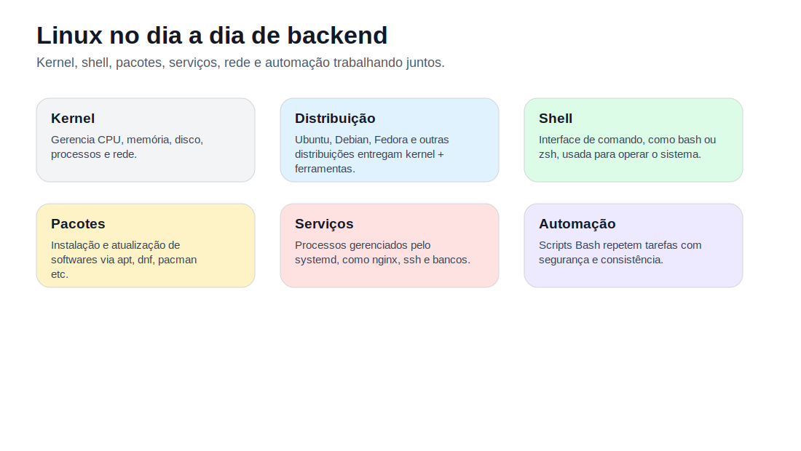
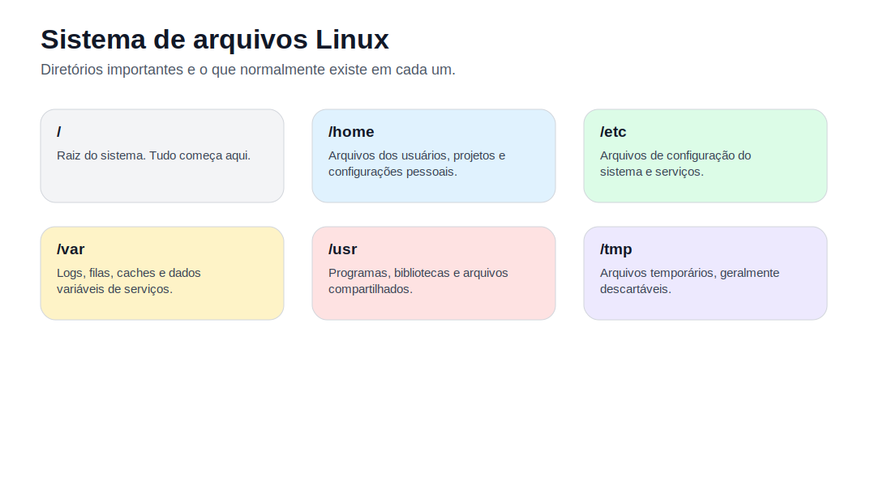
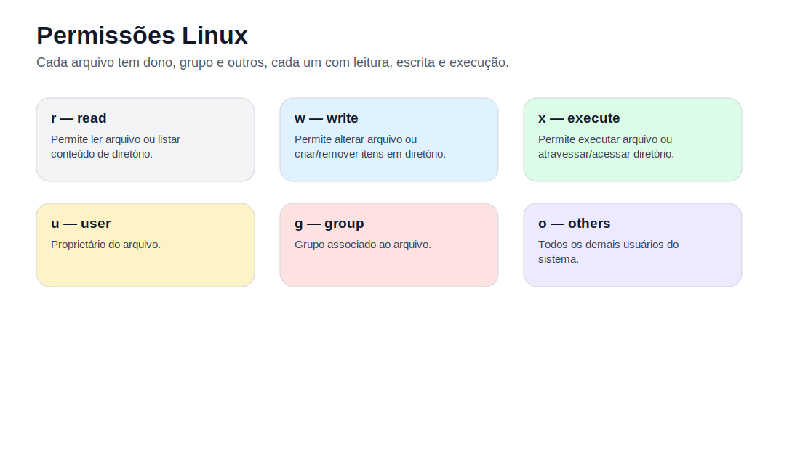
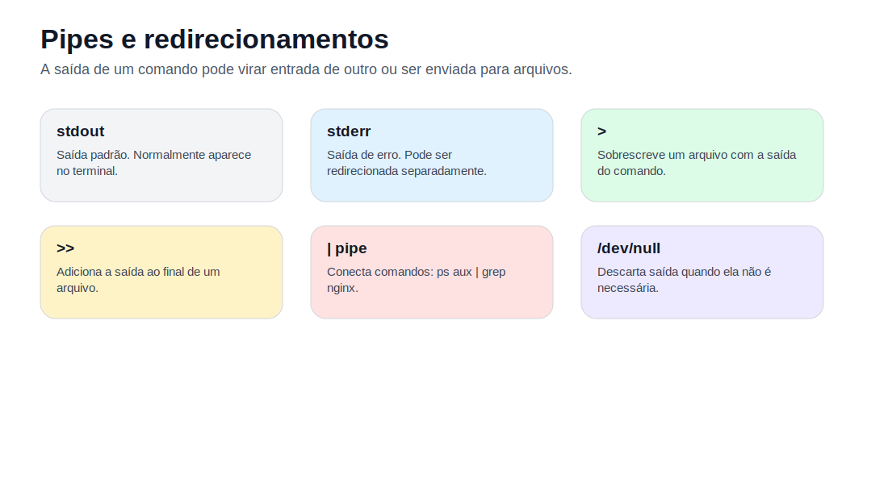
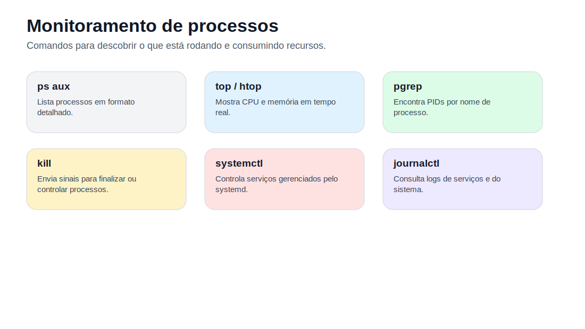
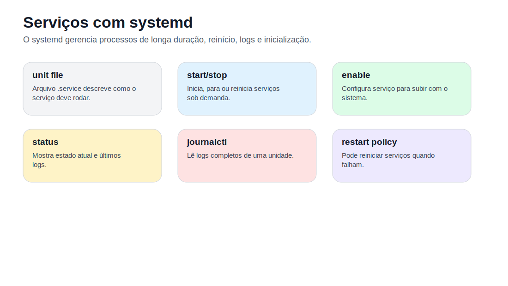
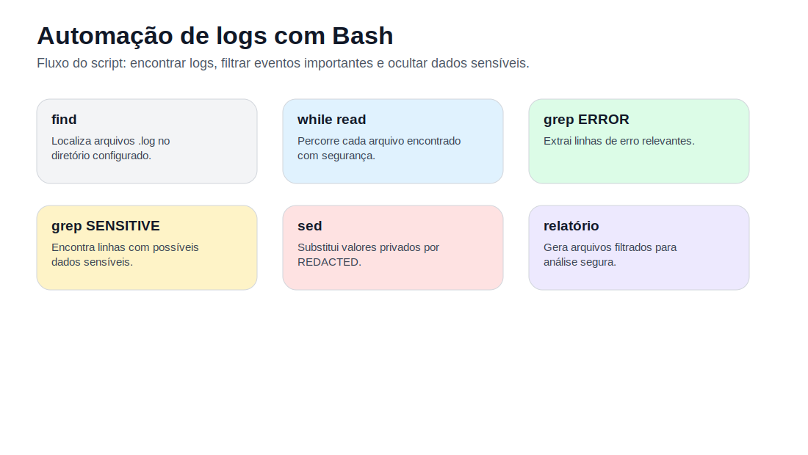

# Linux para Desenvolvimento Backend e Infraestrutura

## Sobre esta apostila

Esta apostila apresenta os principais comandos e conceitos de Linux que um desenvolvedor backend precisa dominar para trabalhar com projetos reais, servidores, Docker, logs, permissões, automação e diagnóstico de problemas.

O objetivo não é decorar comandos isolados. O objetivo é entender **quando usar cada comando**, **o que ele faz no sistema** e **como combinar comandos** para resolver problemas do dia a dia.



## Como estudar por esta apostila

Leia os capítulos na ordem, mas pratique em paralelo. Abra um terminal Linux, crie uma pasta de laboratório e execute os comandos em arquivos de teste. Evite praticar comandos destrutivos em pastas importantes.

Sempre que aparecer um comando com `sudo`, pare e entenda o impacto antes de executar. No Linux, comandos administrativos podem alterar pacotes, permissões, serviços e arquivos do sistema.

## Índice

1. [Capítulo 1 — O que é Linux e por que ele importa para backend](#capítulo-1--o-que-é-linux-e-por-que-ele-importa-para-backend)
2. [Capítulo 2 — Terminal, shell e comandos](#capítulo-2--terminal-shell-e-comandos)
3. [Capítulo 3 — Sistema de arquivos e navegação](#capítulo-3--sistema-de-arquivos-e-navegação)
4. [Capítulo 4 — Criando, copiando, movendo e removendo arquivos](#capítulo-4--criando-copiando-movendo-e-removendo-arquivos)
5. [Capítulo 5 — Visualização e edição de arquivos](#capítulo-5--visualização-e-edição-de-arquivos)
6. [Capítulo 6 — Permissões, usuários, grupos e sudo](#capítulo-6--permissões-usuários-grupos-e-sudo)
7. [Capítulo 7 — Pipes, redirecionamentos e filtros de texto](#capítulo-7--pipes-redirecionamentos-e-filtros-de-texto)
8. [Capítulo 8 — Busca de arquivos e análise de conteúdo](#capítulo-8--busca-de-arquivos-e-análise-de-conteúdo)
9. [Capítulo 9 — Processos, sinais e monitoramento](#capítulo-9--processos-sinais-e-monitoramento)
10. [Capítulo 10 — Pacotes, atualizações e serviços](#capítulo-10--pacotes-atualizações-e-serviços)
11. [Capítulo 11 — Rede no Linux para backend](#capítulo-11--rede-no-linux-para-backend)
12. [Capítulo 12 — Compactação, backup e transferência de arquivos](#capítulo-12--compactação-backup-e-transferência-de-arquivos)
13. [Capítulo 13 — Scripts Bash para automação](#capítulo-13--scripts-bash-para-automação)
14. [Capítulo 14 — Projeto prático: monitoramento e sanitização de logs](#capítulo-14--projeto-prático-monitoramento-e-sanitização-de-logs)
15. [Capítulo 15 — Receitas rápidas para problemas reais](#capítulo-15--receitas-rápidas-para-problemas-reais)
16. [Capítulo 16 — Cheat sheet Linux](#capítulo-16--cheat-sheet-linux)
17. [Referências bibliográficas](#referências-bibliográficas)

---

# Capítulo 1 — O que é Linux e por que ele importa para backend

Linux é uma família de sistemas operacionais baseada no kernel Linux. O kernel é a parte central do sistema: ele conversa com o hardware, gerencia processos, memória, disco, rede e permissões.

Quando usamos Ubuntu, Debian, Fedora ou Arch, normalmente estamos usando uma **distribuição Linux**. A distribuição junta o kernel com ferramentas de linha de comando, gerenciador de pacotes, bibliotecas, serviços e programas.

Para um desenvolvedor backend, Linux é importante porque grande parte dos servidores, containers, pipelines de CI/CD e ambientes cloud executam aplicações em Linux. Mesmo que você escreva código em Python, Go, Java, Node.js ou PHP, em algum momento precisará lidar com arquivos, permissões, variáveis de ambiente, logs, portas, processos e serviços.

## 1.1 — O problema

Um projeto backend não vive apenas dentro do editor de código. Ele precisa ser executado, configurado, monitorado, atualizado e diagnosticado. Quando uma API não sobe, quando uma porta está ocupada, quando uma variável de ambiente está errada ou quando um log mostra erro de permissão, o terminal Linux geralmente é o caminho mais rápido para entender o problema.

## 1.2 — Conceitos essenciais

**Kernel** é o núcleo do sistema operacional. Ele gerencia CPU, memória, disco, rede e dispositivos.

**Shell** é o programa que interpreta comandos digitados no terminal. Exemplos comuns são `bash` e `zsh`.

**Terminal** é a interface onde você digita comandos. Ele não é o shell em si; ele é a janela/aplicação que permite interagir com o shell.

**Distribuição** é o sistema completo entregue ao usuário, como Ubuntu, Debian, Fedora ou Linux Mint.

**Usuário root** é o superusuário do sistema. Ele tem permissão para alterar praticamente qualquer coisa.

## 1.3 — Exemplo simples

```bash
whoami
pwd
uname -a
```

## 1.4 — O que aconteceu no código?

O comando `whoami` mostra qual usuário está usando o terminal. O comando `pwd` mostra o diretório atual. O comando `uname -a` mostra informações sobre o kernel e o sistema.

Esses comandos são simples, mas ajudam a responder perguntas comuns: "com qual usuário estou?", "em qual pasta estou?" e "qual sistema estou usando?".

## 1.5 — Quando usar isso?

Use esses comandos quando estiver em uma máquina nova, em um servidor remoto, dentro de um container Docker ou em uma pipeline. Antes de alterar arquivos ou rodar scripts, é importante saber onde você está e com qual usuário está executando comandos.

## 1.6 — O que pode dar errado?

O erro mais comum é executar comandos no lugar errado. Por exemplo, apagar arquivos achando que está em uma pasta de testes, mas estar em uma pasta real de projeto.

Antes de comandos destrutivos, rode:

```bash
pwd
ls -la
```

---

# Capítulo 2 — Terminal, shell e comandos

O terminal é uma das ferramentas mais importantes no Linux. Ele permite executar comandos, criar scripts, manipular arquivos, instalar pacotes, subir serviços e diagnosticar problemas.

## 2.1 — O problema

Interfaces gráficas são úteis, mas muitas tarefas de infraestrutura são mais rápidas e precisas pelo terminal. Em servidores, muitas vezes nem existe interface gráfica. Em containers, normalmente você terá apenas shell e comandos básicos.

## 2.2 — Estrutura de um comando

Um comando Linux geralmente segue esta estrutura:

```bash
comando [opções] [argumentos]
```

Exemplo:

```bash
ls -la /var/log
```

Nesse caso:

- `ls` é o comando;
- `-la` são opções;
- `/var/log` é o argumento, ou seja, o diretório que será listado.

## 2.3 — Comandos de ajuda

```bash
man ls
ls --help
type cd
which python
```

## 2.4 — O que aconteceu no código?

`man ls` abre a página de manual do comando `ls`. `ls --help` mostra uma ajuda resumida. `type cd` mostra se `cd` é um comando interno do shell ou um executável externo. `which python` mostra onde está o executável chamado `python`, caso exista no `PATH`.

## 2.5 — Comando interno vs comando externo

Alguns comandos são internos do shell. O exemplo mais comum é `cd`, porque mudar de diretório altera o estado do shell atual. Por isso, comandos como este não funcionam como muita gente imagina:

```bash
sudo cd /root
```

O `sudo` executa comandos com privilégios administrativos, mas `cd` é interno ao shell. Para entrar em uma sessão administrativa, use:

```bash
sudo -i
```

Depois, para sair:

```bash
exit
```

## 2.6 — Erros comuns

### Erro 1: copiar comandos com `$`

Em muitos tutoriais, o símbolo `$` representa o prompt do terminal. Ele não deve ser copiado.

Errado:

```bash
$ ls
```

Correto:

```bash
ls
```

### Erro 2: ignorar aspas em caminhos com espaços

Se o caminho tem espaço, use aspas:

```bash
cd "Minha Pasta"
```

---

# Capítulo 3 — Sistema de arquivos e navegação

No Linux, tudo fica organizado em uma árvore de diretórios. A raiz dessa árvore é `/`.



## 3.1 — O problema

Para trabalhar bem no Linux, você precisa saber navegar pelo sistema de arquivos. Isso é essencial para encontrar logs, editar configurações, organizar projetos e executar scripts.

## 3.2 — Diretórios importantes

| Diretório | Uso comum |
|---|---|
| `/` | raiz do sistema |
| `/home` | diretórios dos usuários |
| `/etc` | arquivos de configuração |
| `/var` | logs, caches e dados variáveis |
| `/var/log` | logs do sistema e serviços |
| `/usr` | programas e bibliotecas |
| `/tmp` | arquivos temporários |
| `/opt` | softwares opcionais ou instalados manualmente |
| `/root` | diretório pessoal do usuário root |

## 3.3 — Navegação básica

```bash
pwd
ls
ls -la
cd /var/log
cd ..
cd ~
```

## 3.4 — O que aconteceu no código?

`pwd` mostra o diretório atual. `ls` lista o conteúdo da pasta. `ls -la` mostra arquivos ocultos, permissões, dono, grupo, tamanho e data. `cd /var/log` entra na pasta de logs. `cd ..` sobe um nível. `cd ~` volta para o diretório pessoal do usuário.

## 3.5 — Caminho absoluto e relativo

Um caminho absoluto começa na raiz:

```bash
cd /home/diego/projetos
```

Um caminho relativo parte do diretório atual:

```bash
cd projetos
cd ../outro-projeto
```

## 3.6 — Quando usar?

Use caminhos absolutos em scripts e automações quando quiser evitar ambiguidade. Use caminhos relativos durante navegação manual no terminal.

## 3.7 — Exercício

Crie a seguinte estrutura:

```text
laboratorio-linux/
├── app/
├── logs/
└── scripts/
```

Resolução:

```bash
mkdir -p laboratorio-linux/app laboratorio-linux/logs laboratorio-linux/scripts
cd laboratorio-linux
ls -la
```

---

# Capítulo 4 — Criando, copiando, movendo e removendo arquivos

Manipular arquivos e diretórios é uma das tarefas mais comuns no Linux.

## 4.1 — Criando diretórios e arquivos

```bash
mkdir app
mkdir -p projeto/src/api
touch README.md
touch app/main.py
```

O `mkdir` cria diretórios. A opção `-p` cria a estrutura inteira, inclusive diretórios intermediários que ainda não existem. O `touch` cria arquivos vazios ou atualiza a data de modificação de um arquivo existente.

## 4.2 — Copiando arquivos e diretórios

```bash
cp README.md README.bak.md
cp -r app app-backup
```

Use `cp` para copiar arquivos. Para copiar diretórios com conteúdo, use `cp -r`.

## 4.3 — Movendo e renomeando

```bash
mv README.bak.md docs.md
mv docs.md app/
mv app-backup backup-app
```

O comando `mv` serve tanto para mover quanto para renomear. Se o destino for uma pasta, ele move. Se o destino for um novo nome, ele renomeia.

## 4.4 — Removendo arquivos e diretórios

```bash
rm arquivo.txt
rm -r pasta
rmdir pasta_vazia
```

`rm` remove arquivos. `rm -r` remove diretórios com conteúdo. `rmdir` remove apenas diretórios vazios.

## 4.5 — Atenção com comandos perigosos

Evite usar comandos destrutivos sem conferir o diretório:

```bash
rm -rf *
```

Esse comando remove tudo no diretório atual, recursivamente e sem confirmação. Em ambiente real, isso pode causar perda de arquivos importantes.

Antes de remover algo, faça:

```bash
pwd
ls -la
```

Quando estiver inseguro, use `-i` para pedir confirmação:

```bash
rm -i arquivo.txt
rm -ri pasta
```

## 4.6 — Exemplo prático

Imagine que você clonou um projeto backend e quer criar pastas para logs e scripts locais:

```bash
mkdir -p logs scripts
touch logs/app.log
touch scripts/healthcheck.sh
ls -la
```

O projeto agora tem uma pasta para armazenar logs locais e outra para automações.

---

# Capítulo 5 — Visualização e edição de arquivos

Muitos problemas de backend são resolvidos lendo arquivos: logs, `.env`, configurações, manifestos YAML, arquivos `.service`, scripts e saídas de comandos.

## 5.1 — Exibindo conteúdo

```bash
cat arquivo.txt
less arquivo.txt
head -n 20 arquivo.txt
tail -n 50 arquivo.txt
tail -f logs/app.log
```

## 5.2 — O que aconteceu no código?

`cat` imprime todo o conteúdo do arquivo. `less` abre o arquivo de forma paginada, útil para arquivos grandes. `head` mostra as primeiras linhas. `tail` mostra as últimas linhas. `tail -f` acompanha o arquivo em tempo real, muito usado para logs.

## 5.3 — Quando usar cada um?

Use `cat` para arquivos pequenos. Use `less` para arquivos grandes. Use `tail -f` para acompanhar logs enquanto uma aplicação roda.

## 5.4 — Editor Nano

O Nano é um editor simples de terminal. Ele é útil para editar rapidamente arquivos de configuração ou scripts.

```bash
nano config.txt
```

Atalhos principais:

| Atalho | Função |
|---|---|
| `Ctrl + O` | salvar |
| `Enter` | confirmar nome do arquivo ao salvar |
| `Ctrl + X` | sair |
| `Ctrl + W` | buscar texto |
| `Ctrl + K` | cortar linha |
| `Ctrl + U` | colar linha cortada |
| `Ctrl + G` | abrir ajuda |

## 5.5 — Exemplo prático

Crie um arquivo de configuração:

```bash
nano app.env
```

Conteúdo:

```env
APP_ENV=development
APP_PORT=8000
LOG_LEVEL=debug
```

Salve com `Ctrl + O`, confirme com `Enter` e saia com `Ctrl + X`.

## 5.6 — O que pode dar errado?

Um erro comum é editar arquivos do sistema sem permissão:

```bash
nano /etc/hosts
```

Se precisar editar arquivos protegidos:

```bash
sudo nano /etc/hosts
```

Use `sudo` apenas quando entender o impacto da alteração.

---

# Capítulo 6 — Permissões, usuários, grupos e sudo

Permissões definem quem pode ler, alterar ou executar arquivos. Esse tema é essencial para scripts, servidores, deploys e segurança.



## 6.1 — O problema

Um erro comum em backend é a aplicação não conseguir ler um arquivo, escrever logs, executar um script ou acessar um diretório. Muitas vezes, a causa é permissão incorreta.

## 6.2 — Entendendo `ls -l`

```bash
ls -l
```

Exemplo:

```text
-rwxr-xr-x 1 diego devs 1200 mai 31 10:00 deploy.sh
```

A primeira parte indica permissões:

```text
-rwxr-xr-x
```

- `-` indica arquivo comum; `d` indicaria diretório.
- `rwx` são permissões do dono.
- `r-x` são permissões do grupo.
- `r-x` são permissões dos outros usuários.

## 6.3 — Tipos de permissão

| Letra | Nome | Em arquivo | Em diretório |
|---|---|---|---|
| `r` | read | ler conteúdo | listar conteúdo |
| `w` | write | alterar conteúdo | criar/remover/renomear itens |
| `x` | execute | executar arquivo | atravessar/acessar diretório |

## 6.4 — Notação octal

| Número | Permissão |
|---|---|
| `0` | nenhuma |
| `1` | execução |
| `2` | escrita |
| `3` | escrita + execução |
| `4` | leitura |
| `5` | leitura + execução |
| `6` | leitura + escrita |
| `7` | leitura + escrita + execução |

Exemplos:

```bash
chmod 755 script.sh
chmod 644 config.txt
```

`755` significa: dono com `rwx`, grupo com `r-x` e outros com `r-x`.

`644` significa: dono com `rw-`, grupo com `r--` e outros com `r--`.

## 6.5 — Permissão simbólica

```bash
chmod +x script.sh
chmod u+x script.sh
chmod g-w arquivo.txt
chmod o-r segredo.txt
```

Essa forma é mais legível quando você quer adicionar ou remover uma permissão específica.

## 6.6 — Alterando dono e grupo

```bash
sudo chown usuario:grupo arquivo.txt
sudo chown -R usuario:grupo pasta/
```

Use `-R` com cuidado. Ele aplica a alteração recursivamente em tudo dentro da pasta.

## 6.7 — Criando usuários e grupos

```bash
sudo adduser gustavo
sudo addgroup devs
sudo usermod -aG devs gustavo
getent group devs
```

## 6.8 — Exemplo seguro de acesso por grupo

Imagine que você quer compartilhar apenas a pasta de scripts de um projeto com o grupo `devs`.

```bash
sudo chown -R "$USER":devs ~/laboratorio-linux/scripts
chmod -R 750 ~/laboratorio-linux/scripts
```

Nesse exemplo:

- o dono é o usuário atual;
- o grupo é `devs`;
- dono tem acesso total;
- grupo pode ler e executar;
- outros usuários não têm acesso.

Evite alterar permissões recursivamente em todo o seu `/home`, a menos que saiba exatamente o que está fazendo.

## 6.9 — Sudo

`sudo` executa um comando com privilégios administrativos.

```bash
sudo apt update
sudo systemctl restart nginx
sudo nano /etc/hosts
```

Use `sudo` para tarefas administrativas: instalar pacotes, editar configurações do sistema, reiniciar serviços e alterar permissões de arquivos protegidos.

## 6.10 — O que pode dar errado?

### Erro 1: usar `chmod 777`

```bash
chmod 777 arquivo
```

Isso dá permissão total para todos. É prático, mas perigoso. Em projeto real, prefira permissões mínimas.

### Erro 2: executar script sem permissão

```bash
./script.sh
```

Erro comum:

```text
Permission denied
```

Correção:

```bash
chmod +x script.sh
./script.sh
```

---

# Capítulo 7 — Pipes, redirecionamentos e filtros de texto

Pipes e redirecionamentos permitem combinar comandos. Essa é uma das maiores forças do terminal Linux.



## 7.1 — O problema

Em vez de abrir arquivos manualmente e procurar informações na mão, podemos combinar comandos para filtrar, contar, transformar e salvar resultados.

## 7.2 — Saída padrão e erro padrão

No Linux, um programa geralmente escreve em dois fluxos:

- `stdout`: saída normal;
- `stderr`: saída de erro.

Redirecionamentos comuns:

```bash
comando > saida.txt
comando >> saida.txt
comando 2> erros.txt
comando &> tudo.txt
comando > /dev/null
comando &> /dev/null
```

## 7.3 — Diferença entre `>` e `>>`

```bash
echo "linha 1" > arquivo.txt
echo "linha 2" > arquivo.txt
```

No final, o arquivo terá apenas `linha 2`, porque `>` sobrescreve.

Agora:

```bash
echo "linha 1" > arquivo.txt
echo "linha 2" >> arquivo.txt
```

O arquivo terá as duas linhas, porque `>>` adiciona ao final.

## 7.4 — Pipe

```bash
ps aux | grep nginx
```

O `|` envia a saída de `ps aux` para a entrada de `grep nginx`.

## 7.5 — Exemplo real: descobrir se uma API está rodando

```bash
ps aux | grep uvicorn | grep -v grep
```

Esse comando lista processos, filtra por `uvicorn` e remove a linha do próprio `grep`.

Uma alternativa mais direta:

```bash
pgrep -a uvicorn
```

## 7.6 — Filtros úteis

```bash
grep "ERROR" app.log
grep -i "error" app.log
grep -r "DATABASE_URL" .
wc -l app.log
sort nomes.txt
uniq nomes.txt
cut -d "," -f 1 dados.csv
```

## 7.7 — Quando usar isso?

Use pipes e filtros para logs, relatórios, auditoria, busca de configurações e depuração. Em servidores, essas combinações economizam muito tempo.

---

# Capítulo 8 — Busca de arquivos e análise de conteúdo

Encontrar arquivos rapidamente é essencial em projetos grandes.

## 8.1 — Comando `find`

```bash
find . -name "*.py"
find . -name "*.log"
find . -type f -size +10M
find . -type f -mtime -7
find . -type d -name "__pycache__"
```

## 8.2 — O que aconteceu no código?

- `.` indica procurar a partir do diretório atual.
- `-name "*.py"` busca arquivos pelo nome.
- `-type f` limita a busca a arquivos.
- `-type d` limita a busca a diretórios.
- `-size +10M` busca arquivos maiores que 10 MB.
- `-mtime -7` busca arquivos modificados nos últimos 7 dias.

## 8.3 — Removendo arquivos encontrados

Antes de remover, liste:

```bash
find . -type d -name "__pycache__"
```

Depois, se tiver certeza:

```bash
find . -type d -name "__pycache__" -exec rm -r {} +
```

## 8.4 — Buscando conteúdo com `grep`

```bash
grep -r "SECRET_KEY" .
grep -rn "TODO" .
grep -rni "database" .
```

Opções úteis:

- `-r`: busca recursiva;
- `-n`: mostra número da linha;
- `-i`: ignora maiúsculas/minúsculas.

## 8.5 — Exemplo real em backend

Buscar onde uma variável de ambiente é usada:

```bash
grep -rn "DATABASE_URL" .
```

Buscar endpoints FastAPI:

```bash
grep -rn "@router" .
grep -rn "@app" .
```

Buscar queries SQL:

```bash
grep -rn "SELECT" .
```

---

# Capítulo 9 — Processos, sinais e monitoramento

Aplicações backend rodam como processos. Entender processos ajuda a diagnosticar travamentos, consumo de CPU, portas ocupadas e serviços fora do ar.



## 9.1 — Listando processos

```bash
ps
ps aux
top
```

`ps` mostra processos. `ps aux` mostra uma visão completa. `top` mostra processos em tempo real.

## 9.2 — Campos importantes do `ps aux`

| Campo | Significado |
|---|---|
| `USER` | usuário dono do processo |
| `PID` | identificador do processo |
| `%CPU` | uso de CPU |
| `%MEM` | uso de memória |
| `STAT` | estado do processo |
| `COMMAND` | comando que iniciou o processo |

## 9.3 — Encontrando processos

```bash
pgrep nginx
pgrep -a python
ps aux | grep gunicorn | grep -v grep
```

## 9.4 — Encerrando processos

```bash
kill <PID>
kill -15 <PID>
kill -9 <PID>
```

`kill -15` envia `SIGTERM`, pedindo encerramento controlado. `kill -9` envia `SIGKILL`, encerrando à força. Use `-9` como último recurso.

## 9.5 — Acompanhando consumo

```bash
top
free -h
df -h
du -sh .
```

- `free -h`: uso de memória.
- `df -h`: espaço em disco por filesystem.
- `du -sh .`: tamanho da pasta atual.

## 9.6 — Exemplo real: processo consumindo muita memória

```bash
ps aux --sort=-%mem | head
```

Esse comando ordena processos por uso de memória e mostra os primeiros.

## 9.7 — O que pode dar errado?

Encerrar o processo errado pode derrubar banco, servidor web ou aplicação. Antes de matar um processo, confira o comando completo:

```bash
ps -fp <PID>
```

---

# Capítulo 10 — Pacotes, atualizações e serviços

No Ubuntu e Debian, o gerenciador de pacotes mais comum é o `apt`.

## 10.1 — Atualizando pacotes

```bash
sudo apt update
sudo apt upgrade -y
sudo apt autoremove -y
sudo apt autoclean
```

## 10.2 — O que cada comando faz?

`apt update` atualiza a lista de pacotes disponíveis. Ele não instala atualizações, apenas consulta os repositórios.

`apt upgrade` instala atualizações dos pacotes já instalados.

`apt autoremove` remove dependências que não são mais necessárias.

`apt autoclean` limpa arquivos antigos de pacotes baixados.

## 10.3 — Instalando e removendo pacotes

```bash
sudo apt install curl git unzip -y
sudo apt remove nginx -y
sudo apt purge nginx -y
```

`remove` remove o pacote. `purge` remove o pacote e seus arquivos de configuração.

## 10.4 — Serviços com systemd

O `systemctl` controla serviços gerenciados pelo systemd.



```bash
sudo systemctl status nginx
sudo systemctl start nginx
sudo systemctl stop nginx
sudo systemctl restart nginx
sudo systemctl enable nginx
sudo systemctl disable nginx
```

## 10.5 — Logs com journalctl

```bash
journalctl
journalctl -u nginx
journalctl -u nginx -f
journalctl -u nginx --since "1 hour ago"
```

`journalctl -u nginx -f` acompanha os logs do serviço `nginx` em tempo real.

## 10.6 — Quando usar?

Use `systemctl` quando estiver trabalhando com serviços como Nginx, PostgreSQL, Redis, Docker, SSH e aplicações configuradas como serviços. Use `journalctl` para entender por que um serviço falhou.

## 10.7 — Exemplo real: serviço não sobe

```bash
sudo systemctl status minha-api
journalctl -u minha-api --since "10 minutes ago"
```

Primeiro veja o estado do serviço. Depois leia os logs recentes.

---

# Capítulo 11 — Rede no Linux para backend

Backend quase sempre envolve rede: portas, conexões, DNS, HTTP, SSH e bancos acessíveis pela rede.

## 11.1 — Descobrindo IPs e rotas

```bash
ip addr
ip route
```

`ip addr` mostra interfaces e endereços IP. `ip route` mostra a rota padrão usada para sair da máquina.

## 11.2 — Testando conectividade

```bash
ping google.com
ping 8.8.8.8
```

Se `ping 8.8.8.8` funciona, mas `ping google.com` não funciona, o problema pode estar em DNS.

## 11.3 — Testando HTTP

```bash
curl http://localhost:8000
curl -I https://github.com
curl -v http://localhost:8000/health
```

`curl` é indispensável para testar APIs, headers, status code e conectividade.

## 11.4 — Descobrindo portas abertas

```bash
ss -tulnp
sudo ss -tulnp
```

Opções:

- `-t`: TCP;
- `-u`: UDP;
- `-l`: listening;
- `-n`: não resolver nomes;
- `-p`: mostrar processo.

## 11.5 — Exemplo real: porta 8000 ocupada

```bash
sudo ss -tulnp | grep 8000
```

Se aparecer um processo usando a porta, identifique o PID e decida se deve pará-lo.

## 11.6 — DNS

```bash
nslookup github.com
dig github.com
```

`nslookup` e `dig` ajudam a diagnosticar resolução de nomes. Em algumas distribuições, talvez seja necessário instalar:

```bash
sudo apt install dnsutils -y
```

## 11.7 — SSH

```bash
ssh usuario@servidor
ssh -p 2222 usuario@servidor
```

O SSH permite acessar servidores remotamente de forma segura.

## 11.8 — Copiando arquivos entre máquinas

```bash
scp arquivo.txt usuario@servidor:/home/usuario/
scp -r pasta usuario@servidor:/home/usuario/
```

Para sincronizações maiores, `rsync` costuma ser mais eficiente:

```bash
rsync -avz pasta/ usuario@servidor:/home/usuario/pasta/
```

## 11.9 — Firewall com UFW

```bash
sudo ufw status
sudo ufw allow 22/tcp
sudo ufw allow 80/tcp
sudo ufw allow 443/tcp
sudo ufw enable
```

Antes de ativar firewall em servidor remoto, garanta que a porta SSH está liberada, ou você pode perder acesso.

---

# Capítulo 12 — Compactação, backup e transferência de arquivos

Compactar arquivos é comum para backups, logs e envio de artefatos.

## 12.1 — Tar e gzip

Criar arquivo compactado:

```bash
tar -czvf backup.tar.gz pasta/
```

Extrair:

```bash
tar -xzvf backup.tar.gz
```

## 12.2 — Zip e unzip

```bash
zip -r projeto.zip projeto/
unzip projeto.zip
```

## 12.3 — Backup simples de logs

```bash
mkdir -p backups
tar -czvf backups/logs-$(date +%Y-%m-%d).tar.gz logs/
```

## 12.4 — O que aconteceu no código?

`$(date +%Y-%m-%d)` executa o comando `date` e insere a data atual no nome do arquivo. Isso evita sobrescrever backups anteriores.

## 12.5 — Exemplo real

Antes de limpar logs antigos, faça backup:

```bash
tar -czvf logs-backup.tar.gz /var/log/minha-api/
```

Depois, remova apenas o que tiver certeza que pode ser removido.

---

# Capítulo 13 — Scripts Bash para automação

Um script Bash é um arquivo de texto com comandos que serão executados pelo shell.

## 13.1 — O problema

Quando uma tarefa precisa ser repetida, não faz sentido digitar tudo manualmente. Scripts evitam erro humano, padronizam tarefas e tornam processos reproduzíveis.

## 13.2 — Primeiro script

Crie o arquivo:

```bash
nano hello.sh
```

Conteúdo:

```bash
#!/bin/bash

echo "Olá, Linux!"
echo "Usuário atual: $(whoami)"
echo "Diretório atual: $(pwd)"
```

Dê permissão e execute:

```bash
chmod +x hello.sh
./hello.sh
```

## 13.3 — Shebang

A primeira linha:

```bash
#!/bin/bash
```

indica qual interpretador deve executar o script. Nesse caso, o Bash.

Uma opção comum em scripts mais portáveis é:

```bash
#!/usr/bin/env bash
```

## 13.4 — Variáveis

```bash
APP_NAME="minha-api"
PORT=8000

echo "Subindo $APP_NAME na porta $PORT"
```

Não use espaços ao redor do `=` em atribuições de variável.

Errado:

```bash
APP_NAME = "minha-api"
```

Correto:

```bash
APP_NAME="minha-api"
```

## 13.5 — Aspas

Use aspas em variáveis para evitar problemas com espaços e caracteres especiais:

```bash
LOG_DIR="../myapp/logs"

find "$LOG_DIR" -name "*.log"
```

## 13.6 — Condicionais

```bash
if pgrep nginx > /dev/null; then
    echo "Nginx está rodando"
else
    echo "Nginx não está rodando"
fi
```

## 13.7 — Laços

```bash
for arquivo in *.log; do
    echo "Arquivo: $arquivo"
done
```

Para nomes com espaço, prefira `find -print0` com `read -d ''`:

```bash
find . -name "*.log" -print0 | while IFS= read -r -d '' arquivo; do
    echo "Arquivo encontrado: $arquivo"
done
```

## 13.8 — Funções

```bash
log_info() {
    echo "[INFO] $1"
}

log_info "Iniciando processamento"
```

## 13.9 — Modo mais seguro

Para scripts mais sérios, use:

```bash
set -euo pipefail
```

Significado:

- `-e`: encerra se um comando falhar;
- `-u`: erro ao usar variável não definida;
- `-o pipefail`: faz pipelines falharem se qualquer comando falhar.

Use com consciência, porque scripts que antes "seguiam em frente" passam a parar em falhas.

---

# Capítulo 14 — Projeto prático: monitoramento e sanitização de logs

Neste projeto, vamos transformar os comandos estudados em um script útil: localizar arquivos `.log`, extrair linhas importantes e ocultar dados sensíveis.



## 14.1 — O problema

Logs podem conter erros importantes, mas também podem vazar dados sensíveis, como tokens, chaves de API, e-mails, senhas ou dados financeiros. O objetivo é gerar uma versão filtrada do log para análise, sem expor informações privadas.

## 14.2 — Preparando o ambiente

```bash
mkdir -p laboratorio-linux/myapp/logs
mkdir -p laboratorio-linux/scripts
cd laboratorio-linux
```

Crie o log backend:

```bash
cat > myapp/logs/myapp-backend.log <<'EOF'
2024-09-01 10:05:21 ERROR: Database connection failed.
2024-09-01 10:09:55 INFO: Database connection established.
2024-09-01 11:00:00 INFO: SENSITIVE_DATA: User password is 12345.
2024-09-02 12:45:00 INFO: SENSITIVE_DATA: API key leaked: ABCD1234EFGH5678.
2024-09-03 12:00:00 ERROR: SENSITIVE_DATA: Database backup contains sensitive information.
EOF
```

Crie o log frontend:

```bash
cat > myapp/logs/myapp-frontend.log <<'EOF'
2024-09-01 10:05:21 INFO: Frontend initialized successfully.
2024-09-01 10:15:00 ERROR: Failed to load user profile for user ID 12345.
2024-09-01 10:20:10 INFO: SENSITIVE_DATA: User email: user@example.com fetched profile data.
2024-09-02 12:30:00 INFO: SENSITIVE_DATA: User session initiated with token: TOKEN1234.
EOF
```

## 14.3 — Criando o script

```bash
nano scripts/monitoramento-logs.sh
```

Conteúdo:

```bash
#!/usr/bin/env bash

set -euo pipefail

LOG_DIR="../myapp/logs"

echo "Verificando logs no diretorio $LOG_DIR"

find "$LOG_DIR" -name "*.log" -print0 | while IFS= read -r -d '' arquivo; do
    echo "Processando arquivo: $arquivo"

    saida="${arquivo}.filtrado"

    grep "ERROR" "$arquivo" > "$saida" || true
    grep "SENSITIVE_DATA" "$arquivo" >> "$saida" || true

    sed -i 's/User password is .*/User password is REDACTED/g' "$saida"
    sed -i 's/API key leaked: .*/API key leaked: REDACTED/g' "$saida"
    sed -i 's/User email: .* fetched profile data./User email: REDACTED fetched profile data./g' "$saida"
    sed -i 's/User session initiated with token: .*/User session initiated with token: REDACTED/g' "$saida"
    sed -i 's/Database backup contains sensitive information.*/Database backup contains sensitive information REDACTED/g' "$saida"
done

echo "Processamento finalizado."
```

## 14.4 — Executando

```bash
cd scripts
chmod +x monitoramento-logs.sh
./monitoramento-logs.sh
```

## 14.5 — Verificando resultado

```bash
cat ../myapp/logs/myapp-backend.log.filtrado
cat ../myapp/logs/myapp-frontend.log.filtrado
```

## 14.6 — O que aconteceu no script?

O script define o diretório dos logs na variável `LOG_DIR`. Depois usa `find` para buscar arquivos `.log`. O `-print0` e o `read -d ''` tornam a leitura segura para nomes de arquivos com espaços.

Para cada arquivo encontrado, o script cria um arquivo de saída com a extensão `.filtrado`. Primeiro salva linhas com `ERROR`. Depois adiciona linhas com `SENSITIVE_DATA`. O `|| true` evita que o script pare quando o `grep` não encontra nenhuma linha.

Por fim, os comandos `sed -i` editam o arquivo filtrado e substituem valores sensíveis por `REDACTED`.

## 14.7 — Melhorias possíveis

- Gerar um único relatório consolidado.
- Contar quantidade de erros por arquivo.
- Aceitar o diretório de logs como argumento.
- Salvar relatórios com data.
- Enviar alerta quando houver muitos erros.
- Usar expressões regulares mais genéricas para tokens, e-mails e chaves.

---

# Capítulo 15 — Receitas rápidas para problemas reais

## 15.1 — Minha API não sobe

```bash
pwd
ls -la
cat .env
python --version
pip --version
```

Verifique se está na pasta correta, se o `.env` existe e se a versão da linguagem está correta.

## 15.2 — Porta já está em uso

```bash
sudo ss -tulnp | grep 8000
```

Depois, investigue o processo:

```bash
ps -fp <PID>
```

## 15.3 — Serviço falhou

```bash
sudo systemctl status nome-do-servico
journalctl -u nome-do-servico --since "30 minutes ago"
```

## 15.4 — Disco cheio

```bash
df -h
du -sh *
du -sh /var/log/*
```

## 15.5 — Memória alta

```bash
free -h
ps aux --sort=-%mem | head
```

## 15.6 — CPU alta

```bash
top
ps aux --sort=-%cpu | head
```

## 15.7 — Testar endpoint local

```bash
curl -v http://localhost:8000/health
```

## 15.8 — Buscar variável de ambiente no projeto

```bash
grep -rn "DATABASE_URL" .
```

## 15.9 — Ver últimos logs em tempo real

```bash
tail -f logs/app.log
```

## 15.10 — Validar conexão SSH

```bash
ssh -v usuario@servidor
```

Use `-v` para modo verboso, útil quando há erro de autenticação ou conexão.

---

# Capítulo 16 — Cheat sheet Linux

## Navegação

| Comando | Uso |
|---|---|
| `pwd` | mostra diretório atual |
| `ls` | lista arquivos |
| `ls -la` | lista com detalhes e ocultos |
| `cd pasta` | entra em uma pasta |
| `cd ..` | volta um nível |
| `cd ~` | vai para home do usuário |

## Arquivos e diretórios

| Comando | Uso |
|---|---|
| `mkdir pasta` | cria diretório |
| `mkdir -p a/b/c` | cria estrutura completa |
| `touch arquivo` | cria arquivo vazio |
| `cp origem destino` | copia arquivo |
| `cp -r pasta destino` | copia diretório |
| `mv antigo novo` | move ou renomeia |
| `rm arquivo` | remove arquivo |
| `rm -r pasta` | remove diretório com conteúdo |
| `rmdir pasta` | remove diretório vazio |

## Leitura de arquivos

| Comando | Uso |
|---|---|
| `cat arquivo` | mostra arquivo inteiro |
| `less arquivo` | abre arquivo paginado |
| `head -n 20 arquivo` | primeiras 20 linhas |
| `tail -n 50 arquivo` | últimas 50 linhas |
| `tail -f arquivo` | acompanha arquivo em tempo real |

## Busca

| Comando | Uso |
|---|---|
| `find . -name "*.log"` | busca arquivos por nome |
| `find . -type f -size +10M` | arquivos maiores que 10 MB |
| `grep "erro" arquivo` | busca texto em arquivo |
| `grep -rn "texto" .` | busca recursiva com número da linha |
| `grep -i "erro" arquivo` | ignora maiúsculas/minúsculas |

## Permissões

| Comando | Uso |
|---|---|
| `ls -l` | mostra permissões |
| `chmod +x script.sh` | torna script executável |
| `chmod 755 script.sh` | dono total, grupo/outros leitura e execução |
| `chmod 644 arquivo` | dono lê/escreve, grupo/outros leem |
| `chown usuario:grupo arquivo` | altera dono e grupo |
| `sudo comando` | executa como administrador |

## Processos e recursos

| Comando | Uso |
|---|---|
| `ps aux` | lista processos |
| `top` | monitora em tempo real |
| `pgrep -a nome` | busca processo por nome |
| `kill PID` | encerra processo de forma controlada |
| `kill -9 PID` | força encerramento |
| `free -h` | mostra memória |
| `df -h` | mostra uso de disco |
| `du -sh pasta` | mostra tamanho de pasta |

## Pacotes e serviços

| Comando | Uso |
|---|---|
| `sudo apt update` | atualiza índice de pacotes |
| `sudo apt upgrade -y` | atualiza pacotes instalados |
| `sudo apt install pacote -y` | instala pacote |
| `sudo apt remove pacote -y` | remove pacote |
| `systemctl status servico` | mostra status |
| `sudo systemctl restart servico` | reinicia serviço |
| `journalctl -u servico -f` | acompanha logs do serviço |

## Rede

| Comando | Uso |
|---|---|
| `ip addr` | mostra interfaces e IPs |
| `ip route` | mostra rotas |
| `ping host` | testa conectividade |
| `curl -v URL` | testa HTTP com detalhes |
| `ss -tulnp` | lista portas abertas |
| `ssh usuario@host` | conecta em servidor |
| `scp arquivo usuario@host:/destino` | copia arquivo via SSH |

## Compactação

| Comando | Uso |
|---|---|
| `tar -czvf arquivo.tar.gz pasta/` | compacta pasta |
| `tar -xzvf arquivo.tar.gz` | extrai arquivo |
| `zip -r arquivo.zip pasta/` | cria zip |
| `unzip arquivo.zip` | extrai zip |

## Bash

| Comando/conceito | Uso |
|---|---|
| `#!/usr/bin/env bash` | shebang portátil |
| `VAR="valor"` | cria variável |
| `echo "$VAR"` | imprime variável |
| `if ...; then ... fi` | condicional |
| `for item in ...; do ... done` | laço for |
| `while ...; do ... done` | laço while |
| `set -euo pipefail` | modo mais seguro para scripts |

---

# Resumo final

Linux é uma habilidade prática. Para backend, o mais importante é saber operar o sistema com segurança: navegar, ler logs, entender permissões, instalar pacotes, controlar serviços, testar rede e automatizar tarefas repetitivas.

Você não precisa decorar todos os comandos. O essencial é entender os conceitos e saber montar raciocínios como:

- Onde está o arquivo?
- Quem tem permissão?
- Qual processo está rodando?
- Qual porta está ocupada?
- O serviço falhou por quê?
- O log mostra o quê?
- Como automatizar essa tarefa?

Com esse domínio, você ganha autonomia para trabalhar com servidores, containers, pipelines, deploys e aplicações backend reais.

---

# Exercícios

## Nível 1

1. Crie uma pasta `laboratorio-linux` com subpastas `app`, `logs` e `scripts`.
2. Crie um arquivo `README.md` e copie para `README.bak.md`.
3. Mova `README.bak.md` para a pasta `app`.
4. Liste permissões com `ls -la`.
5. Crie um script `hello.sh`, dê permissão de execução e execute.

## Nível 2

1. Crie dois arquivos `.log` e use `grep` para buscar linhas com `ERROR`.
2. Use `find` para localizar todos os arquivos `.log`.
3. Use `tail -f` em um log e, em outro terminal, adicione linhas com `echo "teste" >> arquivo.log`.
4. Use `ps aux | grep` para procurar um processo.
5. Use `ss -tulnp` para descobrir portas abertas.

## Nível 3

1. Crie um script Bash que recebe um diretório como argumento e lista arquivos `.log`.
2. Adicione validação para verificar se o diretório existe.
3. Gere um relatório com quantidade de linhas de erro por arquivo.
4. Oculte padrões sensíveis com `sed`.
5. Compacte o relatório final com `tar.gz`.

---

# Referências bibliográficas

- FREE SOFTWARE FOUNDATION. **GNU Coreutils Manual**. Disponível em: <https://www.gnu.org/software/coreutils/manual/coreutils.html>. Acesso em: 31 maio 2026.
- FREE SOFTWARE FOUNDATION. **Bash Reference Manual**. Disponível em: <https://www.gnu.org/software/bash/manual/bash.html>. Acesso em: 31 maio 2026.
- FREE SOFTWARE FOUNDATION. **GNU Findutils Manual**. Disponível em: <https://www.gnu.org/software/findutils/manual/html_mono/find.html>. Acesso em: 31 maio 2026.
- FREE SOFTWARE FOUNDATION. **GNU Grep Manual**. Disponível em: <https://www.gnu.org/software/grep/manual/grep.html>. Acesso em: 31 maio 2026.
- FREE SOFTWARE FOUNDATION. **GNU Sed Manual**. Disponível em: <https://www.gnu.org/software/sed/manual/sed.html>. Acesso em: 31 maio 2026.
- CANONICAL. **Ubuntu Server Documentation — User management**. Disponível em: <https://ubuntu.com/server/docs/how-to/security/user-management/>. Acesso em: 31 maio 2026.
- CANONICAL. **Ubuntu Server Documentation**. Disponível em: <https://ubuntu.com/server/docs/>. Acesso em: 31 maio 2026.
- KERRISK, Michael. **The Linux man-pages project**. Disponível em: <https://www.kernel.org/doc/man-pages/>. Acesso em: 31 maio 2026.
- KERRISK, Michael. **systemctl(1) — Linux manual page**. Disponível em: <https://man7.org/linux/man-pages/man1/systemctl.1.html>. Acesso em: 31 maio 2026.
- OPENSSH. **OpenSSH Manual Pages**. Disponível em: <https://www.openssh.com/manual.html>. Acesso em: 31 maio 2026.
