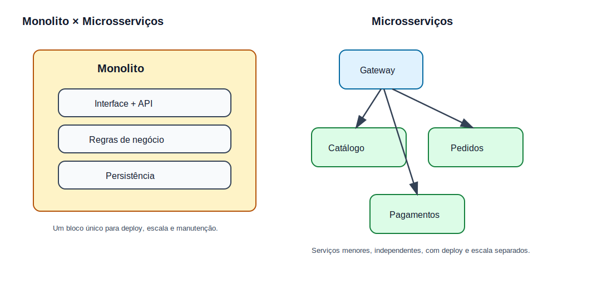
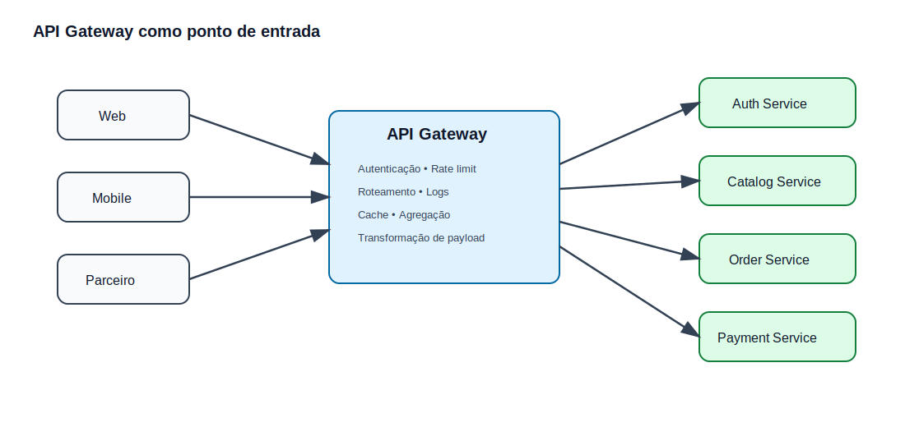
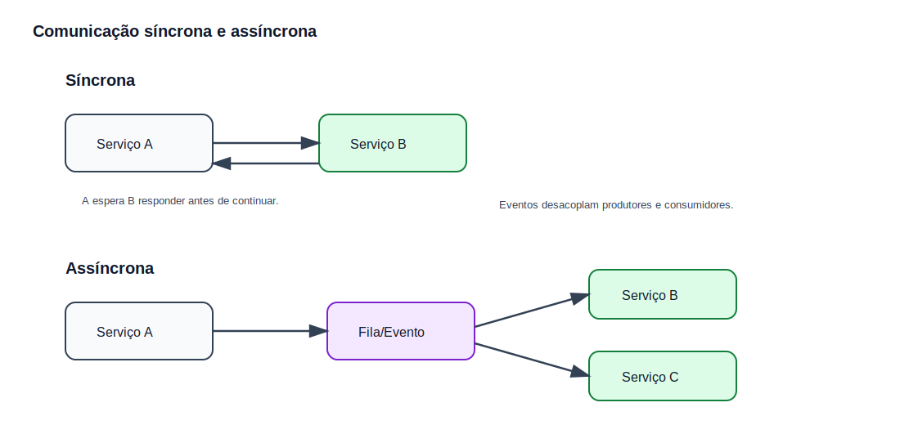
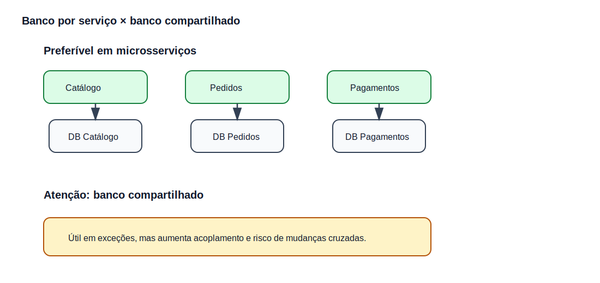
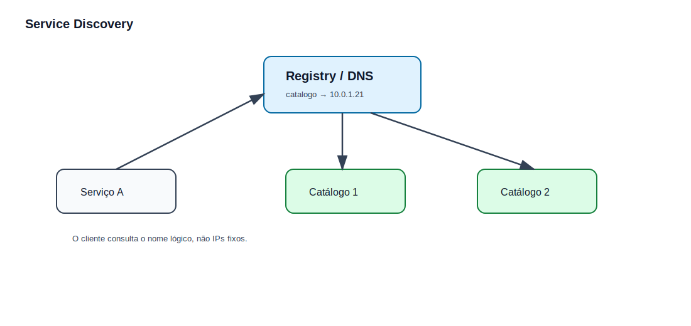
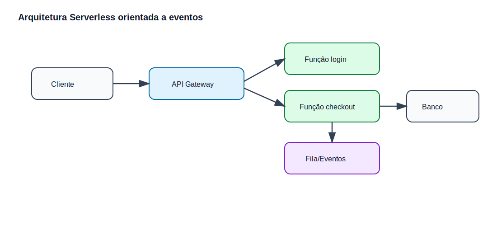
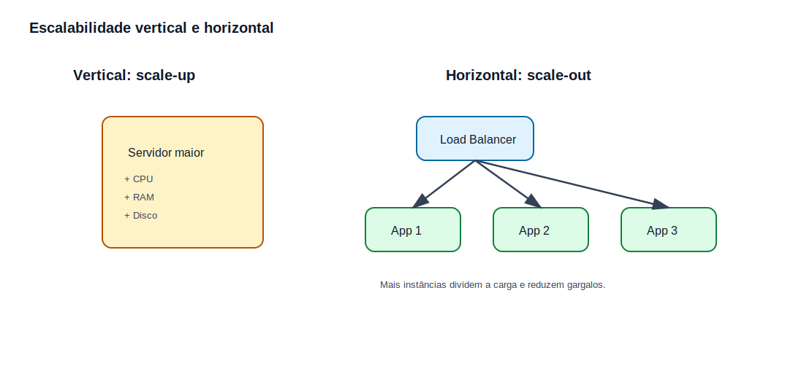

# Infraestrutura para Microsserviços, API Gateway e Comunicação entre Serviços

## Sobre esta apostila

Esta apostila reúne e refatora os materiais sobre **API Gateway** e **Arquitetura de Microsserviços** em um único documento didático, organizado para leitura no GitHub. O objetivo é explicar, de forma prática, como aplicações modernas são divididas, hospedadas, expostas, escaladas e conectadas.

O foco não é decorar nomes de ferramentas, mas entender **quando usar cada padrão**, **qual problema ele resolve** e **quais riscos ele adiciona**. Isso é especialmente importante para desenvolvimento back-end, porque um serviço raramente vive sozinho: ele conversa com APIs, bancos, filas, gateways, containers, logs, autenticação e infraestrutura.

Ao final desta apostila, você será capaz de:

- diferenciar aplicação client-side, server-side, monolítica, distribuída e serverless;
- entender o papel de um API Gateway em uma arquitetura de microsserviços;
- reconhecer padrões como Sidecar, Strangler, CQRS, banco por serviço e service discovery;
- escolher entre comunicação síncrona e assíncrona;
- entender falhas comuns em sistemas distribuídos e como reduzi-las;
- ler diagramas de infraestrutura com mais segurança.

## Como estudar por esta apostila

Leia na ordem. Primeiro entenda o problema que cada arquitetura resolve; depois avance para padrões e componentes. Sempre que aparecer um comando, um arquivo de configuração ou um fluxo, leia a explicação abaixo dele antes de copiar. Em infraestrutura, a pergunta mais importante não é apenas “como fazer?”, mas também “por que isso existe?” e “qual problema isso cria se eu usar mal?”.

As imagens desta apostila estão na pasta:

```text
./images/infraestrutura-microsservicos/
```

---

## Índice

1. [Capítulo 1 — Visão geral de infraestrutura em aplicações web](#capítulo-1--visão-geral-de-infraestrutura-em-aplicações-web)
2. [Capítulo 2 — Monolito, microsserviços e quando separar serviços](#capítulo-2--monolito-microsserviços-e-quando-separar-serviços)
3. [Capítulo 3 — API Gateway](#capítulo-3--api-gateway)
4. [Capítulo 4 — Tipos de serviços em microsserviços](#capítulo-4--tipos-de-serviços-em-microsserviços)
5. [Capítulo 5 — Comunicação síncrona e assíncrona](#capítulo-5--comunicação-síncrona-e-assíncrona)
6. [Capítulo 6 — Banco de dados em microsserviços](#capítulo-6--banco-de-dados-em-microsserviços)
7. [Capítulo 7 — CQRS e separação entre leitura e escrita](#capítulo-7--cqrs-e-separação-entre-leitura-e-escrita)
8. [Capítulo 8 — Padrões práticos: Strangler, Sidecar e BFF](#capítulo-8--padrões-práticos-strangler-sidecar-e-bff)
9. [Capítulo 9 — Containers, hosts e ambientes de execução](#capítulo-9--containers-hosts-e-ambientes-de-execução)
10. [Capítulo 10 — Service Discovery](#capítulo-10--service-discovery)
11. [Capítulo 11 — Resiliência e tratamento de falhas](#capítulo-11--resiliência-e-tratamento-de-falhas)
12. [Capítulo 12 — Serverless](#capítulo-12--serverless)
13. [Capítulo 13 — Escalabilidade](#capítulo-13--escalabilidade)
14. [Capítulo 14 — Exemplo prático de arquitetura com microsserviços](#capítulo-14--exemplo-prático-de-arquitetura-com-microsserviços)
15. [Referências bibliográficas](#referências-bibliográficas)

---

# Capítulo 1 — Visão geral de infraestrutura em aplicações web

Aplicações web modernas são compostas por várias partes: interface, back-end, banco de dados, cache, filas, autenticação, logs, métricas, balanceadores, gateways e ambientes de execução. Mesmo quando você trabalha apenas escrevendo código back-end, esse código roda dentro de uma infraestrutura que define como ele será acessado, protegido e escalado.

Ao final deste capítulo, você será capaz de:

- entender a diferença entre cliente e servidor;
- diferenciar lógica de interface e lógica de back-end;
- enxergar uma aplicação como um conjunto de responsabilidades;
- entender por que infraestrutura afeta diretamente o design do código.

## 1.1 — O problema

Quando estamos aprendendo programação, normalmente pensamos em um sistema como “um projeto” ou “uma API”. Na prática, um sistema real é formado por vários componentes trabalhando juntos. Um endpoint de login, por exemplo, pode envolver:

- navegador ou aplicativo mobile;
- API Gateway;
- serviço de autenticação;
- banco de dados de usuários;
- cache;
- serviço de geração de token;
- logs e métricas;
- regras de segurança.

Ou seja, uma simples requisição HTTP pode atravessar várias camadas antes de retornar uma resposta.

## 1.2 — Client-side

O **client-side** é a parte executada no dispositivo do usuário. Em uma aplicação web, normalmente é o navegador executando HTML, CSS e JavaScript. Em um aplicativo mobile, é o app instalado no celular.

O cliente costuma ser responsável por:

- exibir telas;
- coletar dados do usuário;
- validar campos simples;
- chamar APIs;
- apresentar mensagens de erro ou sucesso.

Exemplo de chamada feita pelo cliente:

```javascript
fetch("https://api.exemplo.com/v1/produtos")
  .then((resposta) => resposta.json())
  .then((produtos) => console.log(produtos));
```

Esse código não contém a regra principal do negócio. Ele apenas pede dados para uma API. A responsabilidade de validar permissões, consultar banco de dados e aplicar regras críticas fica no servidor.

## 1.3 — Server-side

O **server-side** é a parte executada no servidor. É onde normalmente ficam as APIs, regras de negócio, integrações, validações sensíveis e acesso ao banco de dados.

Um back-end pode ser escrito em Python, Java, Node.js, C#, PHP, Go ou outra linguagem. A tecnologia muda, mas a responsabilidade central é parecida: receber requisições, processar regras e devolver respostas.

Exemplo simplificado em Python com FastAPI:

```python
from fastapi import FastAPI

app = FastAPI()

@app.get("/produtos")
def listar_produtos():
    return [
        {"id": 1, "nome": "Teclado", "preco": 150.0},
        {"id": 2, "nome": "Mouse", "preco": 89.9},
    ]
```

Nesse exemplo, a rota `/produtos` representa uma funcionalidade do servidor. Em um sistema real, essa função provavelmente consultaria banco de dados, validaria permissões e aplicaria filtros.

## 1.4 — O que pode dar errado?

Um erro comum é colocar regra importante apenas no front-end. Por exemplo, esconder um botão de “deletar usuário” para usuários comuns não é segurança suficiente. Um usuário mal-intencionado pode chamar a API diretamente. A validação real precisa estar no servidor.

Outro erro comum é deixar o back-end crescer sem organização. Com o tempo, a aplicação pode virar um grande bloco difícil de testar, escalar e modificar. É aqui que entram discussões sobre monolito, microsserviços e separação de responsabilidades.

## 1.5 — Resumo do capítulo

Client-side é a parte que roda no dispositivo do usuário. Server-side é a parte que roda no servidor e concentra regras críticas, acesso a dados e segurança. Infraestrutura é o conjunto de componentes que permite que essa comunicação funcione com desempenho, segurança e disponibilidade.

---

# Capítulo 2 — Monolito, microsserviços e quando separar serviços

Antes de falar sobre API Gateway, filas, containers e service discovery, é preciso entender a decisão mais importante: **o sistema será um bloco único ou será dividido em serviços menores?**



Ao final deste capítulo, você será capaz de:

- entender o que é uma arquitetura monolítica;
- entender o que é uma arquitetura de microsserviços;
- reconhecer vantagens e custos de cada abordagem;
- evitar a ideia equivocada de que microsserviços são sempre melhores.

## 2.1 — O que é uma arquitetura monolítica?

Uma arquitetura **monolítica** é aquela em que a aplicação é desenvolvida, implantada e escalada como um único bloco. Isso significa que cadastro, autenticação, pedidos, pagamentos e relatórios podem estar no mesmo projeto e no mesmo processo de deploy.

Essa abordagem não é necessariamente ruim. Para sistemas pequenos, times pequenos ou domínios ainda pouco conhecidos, um monolito pode ser a melhor escolha. Ele é mais simples de desenvolver, debugar, testar localmente e colocar em produção.

Exemplo conceitual de estrutura monolítica:

```text
loja-api/
├── app/
│   ├── auth/
│   ├── produtos/
│   ├── pedidos/
│   ├── pagamentos/
│   └── relatorios/
├── database/
└── main.py
```

Tudo está dentro do mesmo projeto. Mesmo que os módulos sejam separados em pastas, o deploy geralmente acontece de uma vez.

## 2.2 — O que são microsserviços?

Microsserviços são uma forma de estruturar um sistema como um conjunto de serviços menores, independentes e focados em capacidades de negócio. Cada serviço roda em seu próprio processo, pode ter seu próprio banco de dados e se comunica com outros serviços por mecanismos leves, como HTTP, gRPC ou mensagens.

Exemplo conceitual:

```text
sistema-ecommerce/
├── auth-service/
├── catalog-service/
├── order-service/
├── payment-service/
├── notification-service/
└── api-gateway/
```

A ideia é que cada serviço tenha uma responsabilidade clara. O serviço de catálogo não deveria conhecer detalhes internos do serviço de pagamento, e o serviço de pagamento não deveria acessar diretamente as tabelas internas do serviço de pedidos.

## 2.3 — Quando microsserviços ajudam?

Microsserviços costumam ajudar quando o sistema já possui partes com necessidades muito diferentes. Por exemplo, em um e-commerce, o catálogo pode receber muito mais leitura do que o serviço de pagamento. Nesse caso, faz sentido escalar o catálogo de forma independente.

Microsserviços também ajudam quando equipes diferentes trabalham em domínios diferentes. Um time pode cuidar de pagamentos, outro de catálogo e outro de logística, desde que os contratos entre serviços sejam bem definidos.

## 2.4 — Quando microsserviços atrapalham?

Microsserviços adicionam complexidade. Você ganha independência, mas passa a lidar com problemas que não aparecem com tanta força em monolitos:

- latência de rede;
- falhas parciais;
- rastreamento distribuído;
- versionamento de contratos;
- consistência eventual;
- deploy coordenado;
- observabilidade mais difícil;
- custo operacional maior.

Por isso, uma regra prática importante é: **não separe um serviço apenas porque “microsserviços são modernos”**. Separe quando existir um motivo real de domínio, escala, independência de equipe ou resiliência.

## 2.5 — Monolito por padrão

Uma abordagem bastante sensata é começar com um **monolito bem organizado** e separar serviços depois, quando o domínio estiver mais claro. Isso evita criar vários serviços pequenos antes de entender quais fronteiras realmente fazem sentido.

Um monolito modular pode ser um ótimo primeiro passo:

```text
app/
├── modules/
│   ├── auth/
│   ├── catalog/
│   ├── orders/
│   └── payments/
└── shared/
```

Aqui o sistema ainda é implantado como um bloco único, mas o código já está organizado por domínios. Se no futuro o módulo de pagamentos precisar virar um microsserviço, a separação será mais fácil.

## 2.6 — Resumo do capítulo

Monolito é simplicidade operacional. Microsserviços são independência e escalabilidade seletiva, mas com custo de complexidade. Para um desenvolvedor back-end, o mais importante é entender que arquitetura é uma decisão de trade-off, não uma competição de qual modelo é “mais bonito”.

---

# Capítulo 3 — API Gateway

O **API Gateway** é um componente que atua como ponto de entrada único para clientes externos acessarem vários serviços internos. Em vez de o front-end chamar diretamente cada microsserviço, ele chama o gateway, e o gateway decide para onde cada requisição deve ir.



Ao final deste capítulo, você será capaz de:

- entender o papel do API Gateway;
- diferenciar API Gateway de proxy reverso;
- identificar responsabilidades comuns do gateway;
- reconhecer riscos como ponto único de falha e latência adicional.

## 3.1 — O problema

Imagine um aplicativo mobile que precisa conversar com vários serviços:

```text
/auth/login
/catalog/produtos
/orders/pedidos
/payments/cobrancas
/notifications/preferencias
```

Sem um API Gateway, o cliente precisaria conhecer todos esses serviços, suas URLs, regras de autenticação e formatos de resposta. Isso aumenta o acoplamento entre cliente e back-end.

Com um gateway, o cliente conhece apenas um endereço:

```text
https://api.minhaempresa.com
```

O gateway recebe a requisição e encaminha para o serviço correto.

## 3.2 — O que é um API Gateway?

Um API Gateway é um servidor intermediário especializado em APIs. Ele recebe requisições externas, aplica políticas globais e encaminha a chamada para o serviço interno adequado.

Fluxo simplificado:

```text
Cliente → API Gateway → Microsserviço interno
```

Exemplo:

```text
GET /v1/produtos/10
```

O gateway pode interpretar essa URL e encaminhar a requisição para o serviço de catálogo:

```text
catalog-service:8080/produtos/10
```

## 3.3 — Principais responsabilidades

Um API Gateway pode concentrar várias responsabilidades transversais:

| Responsabilidade | O que faz |
|---|---|
| Roteamento | Encaminha a requisição para o serviço correto. |
| Autenticação | Verifica identidade do cliente, como JWT ou API key. |
| Autorização | Verifica se o cliente pode acessar aquele recurso. |
| Rate limiting | Limita quantidade de requisições por usuário, IP ou token. |
| Cache | Guarda respostas frequentes para reduzir carga interna. |
| Logs e métricas | Registra tráfego, latência e erros. |
| Transformação | Adapta formato de requisições e respostas. |
| Agregação | Junta respostas de vários serviços em uma resposta única. |

## 3.4 — Exemplo prático de roteamento com Nginx

Um exemplo simples de gateway usando Nginx poderia ficar assim:

```nginx
server {
    listen 80;
    server_name api.exemplo.local;

    location /auth/ {
        proxy_pass http://auth-service:8000/;
    }

    location /catalog/ {
        proxy_pass http://catalog-service:8000/;
    }

    location /orders/ {
        proxy_pass http://order-service:8000/;
    }
}
```

Nesse exemplo, o cliente chama sempre `api.exemplo.local`, mas cada caminho é encaminhado para um serviço diferente. O Nginx funciona como uma camada de entrada e roteamento.

## 3.5 — API Gateway vs Proxy Reverso

Um **proxy reverso** recebe requisições externas e encaminha para servidores internos. Ele normalmente é usado para balanceamento de carga, TLS, cache e roteamento.

Um **API Gateway** também faz isso, mas adiciona funcionalidades voltadas ao ecossistema de APIs, como autenticação, autorização, rate limit por token, transformação de payload, versionamento e agregação de respostas.

Na prática, algumas ferramentas podem fazer os dois papéis. O importante é entender a intenção arquitetural:

- proxy reverso resolve entrada e distribuição de tráfego;
- API Gateway resolve entrada, governança e controle de APIs.

## 3.6 — Agregação de respostas

Às vezes, uma tela precisa de dados de vários serviços. Por exemplo, a tela “meu pedido” pode precisar de:

- dados do pedido;
- status do pagamento;
- previsão de entrega;
- dados do cliente.

Sem gateway, o front-end teria que fazer várias chamadas. Com agregação, o gateway pode chamar vários serviços e devolver uma resposta pronta.

```json
{
  "pedido": {"id": 123, "status": "confirmado"},
  "pagamento": {"status": "aprovado"},
  "entrega": {"previsao": "2026-06-05"}
}
```

Essa estratégia simplifica o cliente, mas deve ser usada com cuidado. Se o gateway começar a concentrar regra de negócio demais, ele vira um “monolito disfarçado”.

## 3.7 — O que pode dar errado?

O primeiro risco é transformar o gateway em ponto único de falha. Se todas as requisições passam por ele e ele cai, todo o sistema fica inacessível. Por isso, gateways precisam rodar com múltiplas instâncias, balanceamento de carga e monitoramento.

O segundo risco é excesso de responsabilidade. O gateway deve aplicar políticas transversais e roteamento, mas não deveria carregar toda a regra de negócio do sistema.

O terceiro risco é latência. Cada camada adicionada ao caminho da requisição aumenta um pouco o tempo total. Normalmente isso é aceitável, mas precisa ser observado.

## 3.8 — Quando usar API Gateway?

Use quando:

- há vários serviços internos;
- clientes não devem conhecer a topologia interna;
- você precisa centralizar autenticação, logs e rate limit;
- há diferentes clientes, como mobile, web e parceiros;
- você quer padronizar entrada de tráfego.

Evite complicar quando:

- existe apenas uma API simples;
- o gateway não agregará segurança nem roteamento útil;
- a equipe ainda não consegue operar mais esse componente.

## 3.9 — Resumo do capítulo

API Gateway é a porta de entrada do ecossistema de APIs. Ele simplifica clientes, centraliza políticas e protege os serviços internos. Ao mesmo tempo, precisa ser tratado como componente crítico de infraestrutura, com redundância, logs e monitoramento.

---

# Capítulo 4 — Tipos de serviços em microsserviços

Em microsserviços, nem todo serviço tem o mesmo papel. Alguns guardam dados, outros aplicam regras de negócio, outros adaptam formatos e outros ficam na borda da arquitetura.

Ao final deste capítulo, você será capaz de:

- diferenciar serviço de domínio, serviço de negócio e agregador de processo;
- entender por que DDD ajuda a separar serviços;
- evitar separações baseadas apenas em tabelas do banco;
- reconhecer responsabilidades de Edge Services e Translation Services.

## 4.1 — Serviço de domínio

Um **serviço de domínio** cuida de uma parte específica do negócio. Ele não é apenas um CRUD de tabela. Ele representa uma área com regras próprias.

Exemplo em uma plataforma educacional:

```text
student-service
```

Responsabilidades possíveis:

- matricular estudante;
- atualizar dados cadastrais;
- validar situação acadêmica;
- consultar cursos vinculados ao aluno.

A fronteira do serviço deve ser pensada pelo negócio. O erro comum é criar serviços como `usuario-table-service` ou `pedido-database-service` sem entender o domínio.

## 4.2 — DDD como guia

**Domain-Driven Design** ajuda a dividir o sistema a partir do domínio, ou seja, a partir das regras e conceitos importantes para o negócio. Em vez de começar perguntando “quais tabelas existem?”, a pergunta correta é:

> Quais capacidades de negócio esse sistema precisa ter?

Exemplo:

```text
Catálogo     → produtos, preços, disponibilidade
Pedidos      → criação e status de pedidos
Pagamentos   → cobrança, estorno, conciliação
Entrega      → frete, rastreamento, previsão
```

Cada área tem linguagem, regras e mudanças próprias. Isso é um sinal de possível separação.

## 4.3 — Serviço de negócio

Um **serviço de negócio** coordena vários serviços de domínio para executar um processo mais completo.

Exemplo: “matricular aluno”.

Esse processo pode envolver:

1. validar dados do estudante;
2. gerar cobrança;
3. confirmar pagamento;
4. criar matrícula;
5. enviar e-mail de confirmação.

Um serviço de negócio não necessariamente guarda todos os dados. Ele pode orquestrar chamadas para outros serviços.

## 4.4 — Agregador de processos

Um **agregador de processos** coordena fluxos ainda maiores, que combinam vários processos de negócio.

Exemplo: renovação de matrícula.

```text
renovacao-service
├── consulta situação acadêmica
├── consulta pendências financeiras
├── gera nova cobrança
├── atualiza matrícula
└── dispara notificação
```

Esse serviço representa um processo relevante por si só. Ele cria um novo modelo de domínio ao redor de uma operação de negócio mais ampla.

## 4.5 — Edge Service

Um **Edge Service** fica na borda do sistema. Ele é próximo do cliente e normalmente lida com autenticação, roteamento, adaptação de payload e composição de respostas.

O API Gateway é um exemplo comum de Edge Service.

## 4.6 — Translation Service

Um **Translation Service** adapta formatos, protocolos ou modelos de dados. Ele é útil quando um sistema moderno precisa conversar com um legado.

Exemplo:

```text
Sistema legado retorna XML → Translation Service converte para JSON → API moderna consome JSON
```

Esse padrão evita que todos os microsserviços precisem conhecer detalhes do legado.

## 4.7 — Resumo do capítulo

Serviços devem ser separados por responsabilidade de negócio, não apenas por tabela ou tecnologia. Serviços de domínio cuidam de capacidades específicas; serviços de negócio coordenam processos; agregadores coordenam processos maiores; edge services cuidam da entrada; translation services protegem o restante do sistema contra formatos e protocolos externos.

---

# Capítulo 5 — Comunicação síncrona e assíncrona

Em microsserviços, comunicação é um dos pontos mais importantes. Um serviço precisa conversar com outro, mas existem formas diferentes de fazer isso.



Ao final deste capítulo, você será capaz de:

- diferenciar comunicação síncrona e assíncrona;
- escolher a abordagem adequada por cenário;
- entender o papel de filas, eventos e workers;
- reconhecer impactos em latência, acoplamento e resiliência.

## 5.1 — Comunicação síncrona

Na comunicação síncrona, um serviço chama outro e espera a resposta antes de continuar.

Exemplo:

```text
order-service → payment-service → resposta
```

Código conceitual:

```python
import requests

response = requests.post(
    "http://payment-service:8000/payments",
    json={"order_id": 123, "amount": 199.90},
    timeout=3,
)

if response.status_code == 201:
    print("Pagamento iniciado")
```

Esse modelo é simples e direto. O problema é que o serviço chamador fica dependente do serviço chamado. Se `payment-service` estiver lento, `order-service` também fica lento.

## 5.2 — Quando usar comunicação síncrona?

Use quando a resposta imediata é necessária para continuar o fluxo:

- login;
- consulta de dados;
- validação simples;
- carregamento de tela;
- operações curtas.

Exemplo: o front-end precisa consultar o catálogo e exibir produtos. Nesse caso, faz sentido esperar a resposta.

## 5.3 — Comunicação assíncrona

Na comunicação assíncrona, um serviço publica uma mensagem ou evento e continua seu processamento sem esperar que todos os consumidores terminem.

Exemplo:

```text
order-service → publica OrderCreated → fila/event bus → payment-service / stock-service / notification-service
```

Código conceitual:

```python
event = {
    "type": "OrderCreated",
    "order_id": 123,
    "customer_id": 45,
    "total": 199.90,
}

message_broker.publish("orders.events", event)
```

Aqui o serviço de pedidos não precisa conhecer diretamente todos os consumidores. Ele apenas informa que um pedido foi criado.

## 5.4 — Quando usar comunicação assíncrona?

Use quando o processo pode acontecer em segundo plano ou envolve várias etapas:

- envio de e-mail;
- processamento de pagamento;
- reserva de estoque;
- geração de relatório;
- integração com sistema externo;
- notificações;
- pipelines de dados.

Exemplo: ao finalizar uma compra, o usuário pode receber “pedido em processamento”, enquanto os serviços internos cuidam de pagamento, estoque e entrega.

## 5.5 — Filas e publish/subscribe

Uma **fila** geralmente entrega cada mensagem para um consumidor. É útil para distribuir trabalho.

```text
Fila de e-mails → worker 1 / worker 2 / worker 3
```

Já o modelo **publish/subscribe** permite que vários consumidores recebam o mesmo evento.

```text
OrderCreated → pagamento
             → estoque
             → notificação
```

A escolha depende da intenção:

- fila: dividir tarefas entre workers;
- pub/sub: avisar vários interessados sobre um evento.

## 5.6 — Exemplo de retorno 202 Accepted

Em APIs, uma forma comum de representar processamento assíncrono é retornar `202 Accepted`.

```http
POST /orders/123/cancel
Content-Type: application/json

{
  "reason": "cliente solicitou cancelamento"
}
```

Resposta:

```http
HTTP/1.1 202 Accepted
Content-Type: application/json

{
  "message": "Solicitação de cancelamento recebida",
  "status": "processing"
}
```

Isso significa: “recebi o pedido, mas ainda vou processar”.

## 5.7 — O que pode dar errado?

Na comunicação síncrona, a falha mais comum é criar cadeias longas:

```text
A → B → C → D → E
```

Se qualquer serviço no meio falhar, todo o fluxo falha.

Na comunicação assíncrona, os problemas principais são rastreabilidade, duplicidade de mensagens e consistência eventual. Por isso, consumidores precisam ser idempotentes, ou seja, processar a mesma mensagem mais de uma vez sem causar dano.

## 5.8 — Resumo do capítulo

Comunicação síncrona é simples e útil quando a resposta imediata é necessária. Comunicação assíncrona aumenta resiliência e desacoplamento, mas exige mais controle operacional. Sistemas reais costumam combinar as duas abordagens.

---

# Capítulo 6 — Banco de dados em microsserviços

A forma como os dados são organizados define grande parte da qualidade de uma arquitetura de microsserviços. Separar código sem separar dados pode criar um falso microsserviço: por fora existem várias APIs, mas por dentro tudo continua acoplado pelo banco.



Ao final deste capítulo, você será capaz de:

- entender o padrão banco por serviço;
- reconhecer problemas de banco compartilhado;
- entender por que transações distribuídas são difíceis;
- trabalhar com a ideia de consistência eventual.

## 6.1 — Banco por serviço

No padrão **Database per Service**, cada microsserviço possui seu próprio banco de dados ou, no mínimo, seu próprio schema isolado e controlado.

Exemplo:

```text
catalog-service  → catalog_db
order-service    → order_db
payment-service  → payment_db
```

Isso permite que cada serviço seja dono dos próprios dados. Outros serviços não devem acessar diretamente suas tabelas internas.

## 6.2 — Por que isso importa?

Se vários serviços acessam diretamente as mesmas tabelas, qualquer mudança de estrutura pode quebrar outros serviços. Por exemplo, se o serviço de pedidos altera a coluna `status`, o serviço financeiro pode quebrar se consultava essa coluna diretamente.

Com banco por serviço, a comunicação acontece por API ou eventos, não por acesso direto ao banco.

## 6.3 — Exemplo de regra saudável

Regra prática:

```text
Outro serviço precisa de dados de pedidos?
Então ele chama a API de pedidos ou consome eventos de pedidos.
Ele não consulta diretamente order_db.
```

Essa separação preserva autonomia e reduz acoplamento.

## 6.4 — Banco compartilhado

Banco compartilhado significa que vários serviços usam o mesmo banco de dados. Isso pode ser necessário por restrições de legado, custo, contrato ou transição arquitetural.

Mas deve ser tratado como exceção, não como padrão ideal.

Problemas comuns:

- acoplamento entre equipes;
- mudanças arriscadas;
- dificuldade de escalar separadamente;
- regras de negócio espalhadas;
- transações difíceis de isolar.

## 6.5 — Consistência eventual

Em monolitos, é comum fazer várias alterações em uma única transação. Em microsserviços, isso é mais difícil, porque os dados estão distribuídos.

Exemplo de pedido:

1. criar pedido;
2. processar pagamento;
3. reservar estoque;
4. enviar confirmação.

Nem sempre tudo acontece no mesmo instante. O sistema pode ficar temporariamente em estado intermediário:

```text
pedido criado → pagamento pendente → estoque reservado → pedido confirmado
```

Isso é **consistência eventual**: o sistema converge para um estado correto depois que todos os eventos são processados.

## 6.6 — Resumo do capítulo

Banco por serviço aumenta autonomia, mas exige comunicação por contratos, APIs ou eventos. Banco compartilhado simplifica no curto prazo, mas aumenta acoplamento. Em microsserviços, consistência eventual é comum e precisa ser prevista no desenho do fluxo.

---

# Capítulo 7 — CQRS e separação entre leitura e escrita

CQRS significa **Command Query Responsibility Segregation**, ou separação de responsabilidade entre comandos e consultas. A ideia central é separar operações que modificam o estado do sistema das operações que apenas consultam dados.

Ao final deste capítulo, você será capaz de:

- entender o que é CQRS;
- diferenciar command e query;
- reconhecer quando o padrão ajuda;
- evitar usar CQRS sem necessidade.

## 7.1 — O problema

Em muitos sistemas, leitura e escrita têm necessidades diferentes. Uma API de pedidos pode ter poucas escritas, mas milhares de leituras por minuto para telas, dashboards e relatórios.

Se o mesmo modelo atender tudo, ele pode ficar complexo e lento.

## 7.2 — Command

Um **command** representa uma intenção de mudar o estado do sistema.

Exemplos:

```text
CriarPedido
CancelarPedido
AtualizarEnderecoEntrega
ConfirmarPagamento
```

Um command não é uma simples consulta. Ele altera algo.

Exemplo de endpoint:

```http
POST /orders
Content-Type: application/json

{
  "customer_id": 10,
  "items": [
    {"product_id": 1, "quantity": 2}
  ]
}
```

## 7.3 — Query

Uma **query** apenas consulta dados. Ela não deve modificar o estado do sistema.

Exemplos:

```text
ConsultarPedidoPorId
ListarPedidosDoCliente
BuscarResumoDoDashboard
```

Exemplo:

```http
GET /orders/123
```

## 7.4 — CQRS na prática

Em uma aplicação simples, command e query podem estar no mesmo banco e no mesmo serviço, apenas separados no código.

```text
order-service/
├── commands/
│   ├── create_order.py
│   └── cancel_order.py
├── queries/
│   ├── get_order.py
│   └── list_customer_orders.py
└── models/
```

Em aplicações mais avançadas, pode existir um banco otimizado para escrita e outro para leitura.

```text
Command Model → banco normalizado de pedidos
Query Model   → tabela/materialized view otimizada para consulta
```

## 7.5 — Quando usar CQRS?

Use quando:

- leitura e escrita têm volumes muito diferentes;
- consultas exigem dados agregados de várias fontes;
- o modelo de escrita está ficando complexo demais para telas;
- há necessidade de escalar leitura separadamente.

Evite quando:

- o CRUD simples resolve;
- a equipe ainda não consegue operar sincronização entre modelos;
- não há ganho claro de performance ou organização.

## 7.6 — O que pode dar errado?

O principal risco é aumentar a complexidade sem necessidade. Se você separa leitura e escrita, precisa decidir como os dados de leitura serão atualizados. Pode ser por eventos, jobs ou projeções. Isso cria atraso entre escrita e leitura.

Exemplo:

```text
Usuário cria pedido → pedido salvo → evento publicado → projeção de leitura atualizada segundos depois
```

Por alguns segundos, a tela pode não mostrar o pedido recém-criado. Isso precisa ser previsto.

## 7.7 — Resumo do capítulo

CQRS separa comandos de consultas. Pode melhorar desempenho, organização e escalabilidade, mas adiciona complexidade. Use quando houver dor real, não como padrão obrigatório.

---

# Capítulo 8 — Padrões práticos: Strangler, Sidecar e BFF

Além dos conceitos básicos, existem padrões recorrentes em arquiteturas modernas. Eles não são “regras fixas”, mas soluções para problemas comuns.

Ao final deste capítulo, você será capaz de:

- entender o Strangler Pattern para migração incremental;
- entender o Sidecar Pattern para capacidades transversais;
- entender o padrão BFF para adaptar APIs por tipo de cliente;
- escolher o padrão certo para o problema certo.

## 8.1 — Strangler Pattern

O **Strangler Pattern** é usado para migrar gradualmente um sistema legado para uma arquitetura nova. Em vez de reescrever tudo de uma vez, você envolve o sistema antigo e redireciona partes do tráfego para serviços novos.

Fluxo:

```text
Cliente → Gateway → legado ou serviço novo
```

Exemplo:

1. o sistema legado processa tudo;
2. a funcionalidade de catálogo é reescrita como microsserviço;
3. o gateway passa a enviar `/catalog` para o novo serviço;
4. o restante continua no legado;
5. aos poucos, outras partes são migradas.

Esse padrão reduz risco, porque permite trocar o sistema em partes.

## 8.2 — Sidecar Pattern

O **Sidecar Pattern** coloca um processo ou container auxiliar ao lado do serviço principal. Esse sidecar fornece capacidades transversais sem alterar o código da aplicação.

Exemplos de uso:

- coleta de logs;
- proxy de rede;
- TLS;
- métricas;
- autenticação;
- configuração dinâmica.

Exemplo conceitual:

```text
pod/
├── app-container
└── sidecar-container
```

O serviço principal continua focado na regra de negócio. O sidecar cuida de uma responsabilidade técnica.

## 8.3 — BFF: Backend for Frontend

**BFF** significa Backend for Frontend. É um back-end específico para um tipo de cliente.

Exemplo:

```text
mobile-bff → respostas otimizadas para app mobile
web-bff    → respostas otimizadas para navegador
partner-bff → respostas para parceiros externos
```

O BFF evita que todos os clientes sejam obrigados a consumir exatamente a mesma API. Um app mobile pode precisar de menos dados para economizar banda, enquanto a versão web pode precisar de uma resposta mais completa.

## 8.4 — Diferença entre API Gateway e BFF

O API Gateway normalmente aplica políticas globais, roteamento e segurança. O BFF adapta a experiência para um cliente específico.

Em algumas arquiteturas, o BFF fica atrás do gateway:

```text
Cliente → API Gateway → Web BFF → Microsserviços
Cliente → API Gateway → Mobile BFF → Microsserviços
```

## 8.5 — Resumo do capítulo

Strangler ajuda a migrar legado aos poucos. Sidecar adiciona capacidades técnicas sem poluir o serviço principal. BFF adapta APIs para tipos diferentes de cliente. Todos esses padrões existem para reduzir acoplamento e organizar responsabilidades.

---

# Capítulo 9 — Containers, hosts e ambientes de execução

Um microsserviço precisa rodar em algum lugar. Esse lugar pode ser uma máquina física, uma VM, um container, um cluster Kubernetes ou uma plataforma serverless.

Ao final deste capítulo, você será capaz de:

- entender o que é host;
- diferenciar VM e container;
- entender por que Docker é comum em microsserviços;
- interpretar um `docker-compose.yml` simples.

## 9.1 — O que é host?

O **host** é o ambiente onde uma aplicação roda. Pode ser:

- seu notebook;
- uma máquina virtual;
- um servidor Linux;
- uma instância EC2;
- um container Docker;
- um Pod Kubernetes;
- uma função serverless.

Cuidar do host envolve sistema operacional, variáveis de ambiente, rede, portas, logs, permissões, disco, memória e dependências.

## 9.2 — Máquinas virtuais

Uma VM simula uma máquina completa, com sistema operacional próprio. Ela oferece forte isolamento, mas consome mais recursos.

Exemplo:

```text
Servidor físico
├── VM auth-service
├── VM catalog-service
└── VM order-service
```

Funciona, mas pode ser pesado quando há muitos serviços.

## 9.3 — Containers

Containers empacotam a aplicação e suas dependências em um ambiente isolado. Diferente de VMs, containers compartilham o kernel do host, por isso são mais leves.

Exemplo de `Dockerfile` para uma API Python:

```dockerfile
FROM python:3.12-slim

WORKDIR /app
COPY requirements.txt .
RUN pip install --no-cache-dir -r requirements.txt

COPY . .
CMD ["uvicorn", "main:app", "--host", "0.0.0.0", "--port", "8000"]
```

Esse arquivo descreve como construir uma imagem com a aplicação.

## 9.4 — Docker Compose

Docker Compose permite subir vários serviços localmente com um único arquivo.

```yaml
services:
  api-gateway:
    image: nginx:latest
    ports:
      - "8080:80"
    depends_on:
      - catalog-service
      - order-service

  catalog-service:
    build: ./catalog-service
    ports:
      - "8001:8000"

  order-service:
    build: ./order-service
    ports:
      - "8002:8000"

  postgres:
    image: postgres:16
    environment:
      POSTGRES_USER: app
      POSTGRES_PASSWORD: app
      POSTGRES_DB: orders
```

Nesse exemplo, cada serviço fica em um container. O Compose cria uma rede interna e permite que containers se comuniquem pelo nome do serviço, como `http://catalog-service:8000`.

## 9.5 — Kubernetes

Kubernetes é um orquestrador de containers. Ele ajuda a executar containers em escala, cuidando de:

- agendamento de containers;
- reinício automático;
- service discovery;
- balanceamento;
- configuração;
- secrets;
- rollout e rollback;
- escalabilidade horizontal.

Um serviço Kubernetes pode expor um conjunto de Pods por um nome estável, mesmo que os Pods mudem de IP.

## 9.6 — O que pode dar errado?

Containers não resolvem arquitetura ruim. Eles facilitam empacotamento e execução, mas não corrigem acoplamento, falta de testes, endpoints mal definidos ou banco compartilhado sem controle.

Outro erro comum é subir tudo com Docker Compose e achar que isso equivale a produção. Compose é excelente para desenvolvimento, mas produção normalmente exige práticas adicionais: secrets, observabilidade, escalabilidade, health checks e deploy controlado.

## 9.7 — Resumo do capítulo

Host é onde a aplicação roda. VMs isolam bem, mas são mais pesadas. Containers são leves e portáveis. Docker Compose ajuda no ambiente local. Kubernetes ajuda a operar containers em escala.

---

# Capítulo 10 — Service Discovery

Em microsserviços, serviços sobem, caem e escalam o tempo todo. Por isso, não é saudável depender de IPs fixos. O sistema precisa descobrir automaticamente onde cada serviço está.



Ao final deste capítulo, você será capaz de:

- entender o problema de IPs dinâmicos;
- usar nomes de serviço em Docker Compose;
- entender DNS interno no Kubernetes;
- diferenciar DNS simples de service registry.

## 10.1 — O problema

Imagine que `order-service` precisa chamar `catalog-service`. Você poderia configurar assim:

```text
CATALOG_URL=http://10.0.1.21:8000
```

Mas esse IP pode mudar quando o container reiniciar, quando o serviço escalar ou quando for movido para outro host.

A solução é usar um nome lógico:

```text
CATALOG_URL=http://catalog-service:8000
```

## 10.2 — Service discovery com Docker Compose

No Docker Compose, os serviços na mesma rede conseguem se encontrar pelo nome definido no arquivo.

```yaml
services:
  order-service:
    build: ./order-service
    environment:
      CATALOG_URL: http://catalog-service:8000

  catalog-service:
    build: ./catalog-service
```

O `order-service` não precisa saber o IP do `catalog-service`. Ele usa o nome do serviço.

## 10.3 — Service discovery com Kubernetes

No Kubernetes, um objeto `Service` fornece um nome DNS estável para acessar Pods.

Exemplo conceitual:

```yaml
apiVersion: v1
kind: Service
metadata:
  name: catalog-service
spec:
  selector:
    app: catalog
  ports:
    - port: 80
      targetPort: 8000
```

Com isso, outros serviços podem chamar:

```text
http://catalog-service
```

Mesmo que os Pods do catálogo sejam recriados, o nome do Service continua estável.

## 10.4 — Service Registry

Um **Service Registry** é um registro central onde serviços se cadastram e são descobertos. Ferramentas como Consul, Eureka e etcd podem ser usadas para isso.

Fluxo:

```text
1. Serviço sobe
2. Serviço se registra no registry
3. Cliente consulta registry
4. Cliente chama uma instância saudável
```

Esse modelo é útil fora de ambientes que já oferecem DNS interno automaticamente.

## 10.5 — Resumo do capítulo

Service discovery evita IPs fixos e permite que serviços se encontrem por nomes lógicos. Docker Compose e Kubernetes já oferecem mecanismos próprios para isso. Em ambientes mais customizados, service registries podem ser necessários.

---

# Capítulo 11 — Resiliência e tratamento de falhas

Em sistemas distribuídos, falhas são normais. Rede falha, serviço reinicia, banco fica lento, fila acumula mensagens, DNS demora, deploy quebra. Uma arquitetura madura não tenta fingir que falhas não existem; ela cria mecanismos para limitar o impacto.

Ao final deste capítulo, você será capaz de:

- entender falhas em comunicação síncrona e assíncrona;
- aplicar retry, backoff, circuit breaker e cache;
- entender Dead Letter Queue;
- evitar cascatas de falhas.

## 11.1 — Falhas em comunicação síncrona

Se um serviço depende de outro em tempo real, uma falha pode se propagar.

Exemplo:

```text
checkout-service → payment-service → antifraud-service
```

Se o antifraude fica lento, o pagamento fica lento. Se o pagamento fica lento, o checkout fica lento. O usuário percebe tudo.

## 11.2 — Timeout

Toda chamada de rede deve ter timeout.

```python
import requests

response = requests.get(
    "http://catalog-service:8000/products/1",
    timeout=2,
)
```

Sem timeout, uma requisição pode ficar presa por muito tempo, ocupando threads, conexões e memória.

## 11.3 — Retry

Retry significa tentar novamente uma operação que falhou. É útil para falhas transitórias, como uma oscilação de rede.

Mas retry precisa de limite. Um loop infinito de tentativas pode piorar uma falha.

Exemplo conceitual:

```text
Tentar 1 vez → falhou
Esperar 1s
Tentar 2ª vez → falhou
Esperar 2s
Tentar 3ª vez → desistir e registrar erro
```

## 11.4 — Backoff

Backoff aumenta o tempo de espera entre tentativas. Isso evita sobrecarregar um serviço que já está com problema.

```text
1ª tentativa: agora
2ª tentativa: depois de 1 segundo
3ª tentativa: depois de 2 segundos
4ª tentativa: depois de 4 segundos
```

## 11.5 — Circuit Breaker

O **Circuit Breaker** funciona como um disjuntor. Se muitas chamadas a um serviço estão falhando, o circuito abre e novas chamadas são bloqueadas temporariamente.

Estados comuns:

| Estado | Significado |
|---|---|
| Closed | As chamadas seguem normalmente. |
| Open | Chamadas são bloqueadas porque o serviço está falhando. |
| Half-open | O sistema testa poucas chamadas para ver se o serviço voltou. |

Isso evita sobrecarregar um serviço já instável e reduz cascatas de falhas.

## 11.6 — Cache

Cache armazena respostas para reduzir chamadas repetidas.

Exemplo:

```text
GET /produtos/10
```

Se o produto não muda com frequência, o gateway ou o serviço pode guardar a resposta por alguns segundos ou minutos.

Cache ajuda em:

- catálogo;
- configurações públicas;
- dados de leitura frequente;
- páginas e respostas pouco voláteis.

Evite cache sem critério em:

- saldo bancário;
- carrinho de compras;
- permissões sensíveis;
- dados que mudam o tempo todo.

## 11.7 — Dead Letter Queue

Em comunicação assíncrona, uma mensagem pode falhar várias vezes. Talvez o payload esteja inválido, talvez o consumidor tenha bug, talvez falte dado.

Depois de várias tentativas, a mensagem pode ser enviada para uma **Dead Letter Queue**.

```text
fila principal → falhou várias vezes → dead-letter-queue
```

Isso evita travar a fila principal e permite analisar o erro depois.

## 11.8 — Idempotência

Um consumidor de mensagens deve ser idempotente sempre que possível. Isso significa que processar a mesma mensagem duas vezes não deve duplicar efeitos indevidos.

Exemplo ruim:

```text
Evento PaymentConfirmed recebido duas vezes → envia dois produtos
```

Exemplo melhor:

```text
Antes de processar, verificar se event_id já foi tratado
```

## 11.9 — Resumo do capítulo

Resiliência é a capacidade de continuar funcionando mesmo quando partes falham. Timeout, retry com backoff, circuit breaker, cache, DLQ e idempotência são ferramentas fundamentais em sistemas distribuídos.

---

# Capítulo 12 — Serverless

Serverless é um modelo em que o provedor de nuvem gerencia a infraestrutura de execução, e o desenvolvedor foca na função ou evento que precisa ser processado.



Ao final deste capítulo, você será capaz de:

- entender o que serverless significa;
- reconhecer FaaS;
- entender vantagens e limitações;
- identificar bons casos de uso.

## 12.1 — O que é serverless?

Serverless não significa que não existem servidores. Significa que você não gerencia diretamente servidores de longa duração. O provedor cuida de provisionamento, execução, escala e parte da disponibilidade.

Exemplo comum:

```text
HTTP request → API Gateway → Lambda/Function → banco/fila
```

## 12.2 — FaaS

FaaS significa **Function as a Service**. Você escreve uma função que roda quando algum evento acontece.

Exemplos de eventos:

- requisição HTTP;
- mensagem em fila;
- upload de arquivo;
- evento de banco;
- agenda/cron.

Exemplo conceitual em Python:

```python
def handler(event, context):
    order_id = event["order_id"]
    return {"message": f"Pedido {order_id} processado"}
```

## 12.3 — Vantagens

Serverless pode ajudar quando você quer:

- pagar por uso;
- escalar automaticamente;
- reduzir preocupação com servidores;
- criar jobs pequenos;
- responder a eventos;
- montar pipelines simples.

## 12.4 — Desvantagens

Pontos de atenção:

- cold start;
- limites de tempo de execução;
- debugging mais difícil;
- vendor lock-in;
- observabilidade distribuída;
- custo imprevisível em cargas muito altas ou mal dimensionadas.

## 12.5 — Quando usar?

Use para:

- processamento de imagem após upload;
- envio de notificações;
- endpoints simples;
- automações;
- consumidores de fila;
- tarefas agendadas.

Evite quando:

- há processos longos;
- você precisa de controle fino do ambiente;
- a aplicação exige conexões persistentes complexas;
- o custo por invocação ficará maior que manter serviços dedicados.

## 12.6 — Resumo do capítulo

Serverless abstrai servidores e executa código sob demanda. É excelente para eventos e workloads pequenos, mas exige atenção a limites, observabilidade, cold start e dependência do provedor.

---

# Capítulo 13 — Escalabilidade

Escalabilidade é a capacidade de um sistema suportar mais carga sem degradar de forma inaceitável. Em infraestrutura, normalmente falamos de escala vertical e horizontal.



Ao final deste capítulo, você será capaz de:

- diferenciar escala vertical e horizontal;
- entender por que microsserviços favorecem escala seletiva;
- reconhecer limites de escalabilidade;
- pensar em gargalos reais.

## 13.1 — Escala vertical

Escala vertical significa aumentar recursos de uma mesma máquina.

Exemplo:

```text
2 vCPU / 4 GB RAM → 8 vCPU / 32 GB RAM
```

Vantagens:

- simples;
- pouca mudança de arquitetura;
- bom para ganhos rápidos.

Limitações:

- existe limite físico;
- pode exigir parada;
- pode ficar caro;
- não resolve todos os gargalos.

## 13.2 — Escala horizontal

Escala horizontal significa adicionar mais instâncias.

```text
1 instância da API → 3 instâncias da API → 10 instâncias da API
```

Com um balanceador:

```text
Cliente → Load Balancer → API 1 / API 2 / API 3
```

Vantagens:

- melhor para alta demanda;
- permite tolerância a falhas;
- combina bem com containers e microsserviços.

Cuidados:

- sessões não devem depender de memória local;
- logs precisam ser centralizados;
- banco de dados pode virar gargalo;
- cache e filas precisam ser bem dimensionados.

## 13.3 — Escala seletiva em microsserviços

Um dos benefícios de microsserviços é escalar apenas a parte que precisa.

Exemplo:

```text
catalog-service   → 10 instâncias
payment-service   → 3 instâncias
admin-service     → 1 instância
```

Isso evita replicar o sistema inteiro quando apenas uma área recebe mais tráfego.

## 13.4 — Resumo do capítulo

Escala vertical aumenta a máquina. Escala horizontal aumenta o número de instâncias. Microsserviços ajudam na escala seletiva, mas exigem cuidado com estado, logs, banco, cache e rede.

---

# Capítulo 14 — Exemplo prático de arquitetura com microsserviços

Agora vamos juntar os conceitos em uma arquitetura de exemplo para uma plataforma educacional com matrícula, pagamento e criação de aluno.

Ao final deste capítulo, você será capaz de:

- ler um fluxo com API Gateway, serviços e RabbitMQ;
- entender onde ocorre comunicação síncrona;
- entender onde ocorre comunicação assíncrona;
- mapear responsabilidades por serviço.

## 14.1 — Componentes

```text
Frontend Angular/React/Vue
        │
        ▼
API Gateway
        ├── marketing-service
        ├── financeiro-service
        └── academico-service

RabbitMQ
        ├── PagamentoProcessado
        └── MatriculaCriada
```

## 14.2 — Serviço de Marketing

Responsável por leads e campanhas.

Exemplo de endpoint:

```http
POST /marketing/leads
Content-Type: application/json

{
  "nome": "Maria",
  "email": "maria@example.com",
  "curso_interesse": "Python Backend"
}
```

Esse serviço pode salvar o lead e, depois, publicar eventos para campanhas.

## 14.3 — Serviço Financeiro

Responsável por pagamentos.

Fluxo:

1. recebe solicitação de pagamento;
2. cria transação com status `pending`;
3. retorna `202 Accepted`;
4. processa pagamento em background;
5. publica evento `PagamentoProcessado`.

Exemplo:

```json
{
  "event_type": "PagamentoProcessado",
  "payment_id": "pay_123",
  "student_id": "stu_456",
  "status": "approved"
}
```

## 14.4 — Serviço Acadêmico

Responsável por aluno, curso e matrícula.

Quando recebe `PagamentoProcessado`, pode:

1. criar aluno;
2. criar matrícula;
3. gerar credenciais;
4. enviar evento `MatriculaCriada`;
5. permitir consulta por API.

Exemplo de consulta:

```http
GET /academico/alunos/stu_456
```

## 14.5 — Papel do API Gateway

O gateway expõe uma entrada única:

```text
https://api.plataforma.com
```

E roteia:

```text
/marketing/*  → marketing-service
/financeiro/* → financeiro-service
/academico/*  → academico-service
```

Também pode aplicar autenticação, logs, rate limit e padronização de erro.

## 14.6 — Papel do RabbitMQ

O RabbitMQ permite que eventos sejam processados sem acoplamento direto.

```text
financeiro-service publica PagamentoProcessado
academico-service consome PagamentoProcessado
notification-service consome PagamentoProcessado
```

O serviço financeiro não precisa saber todos os detalhes do acadêmico. Ele apenas publica o evento.

## 14.7 — Observabilidade

Em produção, seria importante coletar:

- logs centralizados;
- métricas por serviço;
- tracing distribuído;
- health checks;
- alertas de erro;
- tamanho das filas;
- latência por endpoint.

Sem observabilidade, um sistema de microsserviços vira uma “caixa-preta distribuída”.

## 14.8 — Resumo do capítulo

Uma arquitetura de microsserviços combina API Gateway, serviços de domínio, comunicação síncrona, eventos assíncronos, bancos separados e observabilidade. O valor está na separação clara de responsabilidades, não apenas em criar vários projetos.

---

# Exercícios

## Exercícios teóricos

1. Explique a diferença entre monolito e microsserviços.
2. Por que começar com microsserviços pode ser ruim em um projeto pequeno?
3. O que é um API Gateway e quais responsabilidades ele pode assumir?
4. Qual a diferença entre API Gateway e proxy reverso?
5. Explique a diferença entre comunicação síncrona e assíncrona.
6. O que significa “banco por serviço”?
7. Por que banco compartilhado aumenta acoplamento?
8. Explique o que é consistência eventual.
9. O que é Circuit Breaker e qual problema ele resolve?
10. Qual a diferença entre escala vertical e horizontal?

## Exercícios práticos

1. Desenhe uma arquitetura simples para um e-commerce com `catalog-service`, `order-service`, `payment-service` e `notification-service`.
2. Defina quais chamadas seriam síncronas e quais seriam assíncronas no fluxo de checkout.
3. Escreva um exemplo de `docker-compose.yml` com dois serviços: `api-gateway` e `catalog-service`.
4. Crie uma tabela listando quais dados pertencem a cada serviço em um sistema de pedidos.
5. Descreva como você usaria o Strangler Pattern para migrar um monolito de vendas para microsserviços.

## Desafio

Imagine que você trabalha em uma fintech e existe um serviço de pagamento que chama diretamente um serviço antifraude. O antifraude está instável e isso está derrubando o checkout. Proponha uma solução usando timeout, retry com backoff, circuit breaker e comunicação assíncrona. Explique o que mudaria na experiência do usuário e na arquitetura.

---

# Referências bibliográficas

- AMAZON WEB SERVICES. **Amazon API Gateway — Developer Guide**. Disponível em: <https://docs.aws.amazon.com/apigateway/latest/developerguide/welcome.html>. Acesso em: 31 maio 2026.
- AMAZON WEB SERVICES. **AWS Lambda — Serverless Computing**. Disponível em: <https://aws.amazon.com/lambda/>. Acesso em: 31 maio 2026.
- AMAZON WEB SERVICES. **What is serverless development?** Disponível em: <https://docs.aws.amazon.com/serverless/latest/devguide/welcome.html>. Acesso em: 31 maio 2026.
- DOCKER. **What is Docker?** Disponível em: <https://docs.docker.com/get-started/docker-overview/>. Acesso em: 31 maio 2026.
- DOCKER. **Networking in Compose**. Disponível em: <https://docs.docker.com/compose/how-tos/networking/>. Acesso em: 31 maio 2026.
- FOWLER, Martin; LEWIS, James. **Microservices: a definition of this new architectural term**. Disponível em: <https://martinfowler.com/articles/microservices.html>. Acesso em: 31 maio 2026.
- FOWLER, Martin. **Monolith First**. Disponível em: <https://martinfowler.com/bliki/MonolithFirst.html>. Acesso em: 31 maio 2026.
- FOWLER, Martin. **How to break a Monolith into Microservices**. Disponível em: <https://martinfowler.com/articles/break-monolith-into-microservices.html>. Acesso em: 31 maio 2026.
- KUBERNETES. **DNS for Services and Pods**. Disponível em: <https://kubernetes.io/docs/concepts/services-networking/dns-pod-service/>. Acesso em: 31 maio 2026.
- KUBERNETES. **Service**. Disponível em: <https://kubernetes.io/docs/concepts/services-networking/service/>. Acesso em: 31 maio 2026.
- MICROSOFT. **CQRS pattern — Azure Architecture Center**. Disponível em: <https://learn.microsoft.com/en-us/azure/architecture/patterns/cqrs>. Acesso em: 31 maio 2026.
- MICROSOFT. **Circuit Breaker pattern — Azure Architecture Center**. Disponível em: <https://learn.microsoft.com/en-us/azure/architecture/patterns/circuit-breaker>. Acesso em: 31 maio 2026.
- MICROSOFT. **Retry pattern — Azure Architecture Center**. Disponível em: <https://learn.microsoft.com/pt-br/azure/architecture/patterns/retry>. Acesso em: 31 maio 2026.
- MICROSOFT. **Introdução ao aplicativo de referência eShopOnContainers**. Disponível em: <https://learn.microsoft.com/pt-br/dotnet/architecture/cloud-native/introduce-eshoponcontainers-reference-app>. Acesso em: 31 maio 2026.
- RABBITMQ. **RabbitMQ Tutorials — Work Queues**. Disponível em: <https://www.rabbitmq.com/tutorials/tutorial-two-python>. Acesso em: 31 maio 2026.
- RABBITMQ. **RabbitMQ Tutorials — Publish/Subscribe**. Disponível em: <https://www.rabbitmq.com/tutorials/tutorial-three-python>. Acesso em: 31 maio 2026.
