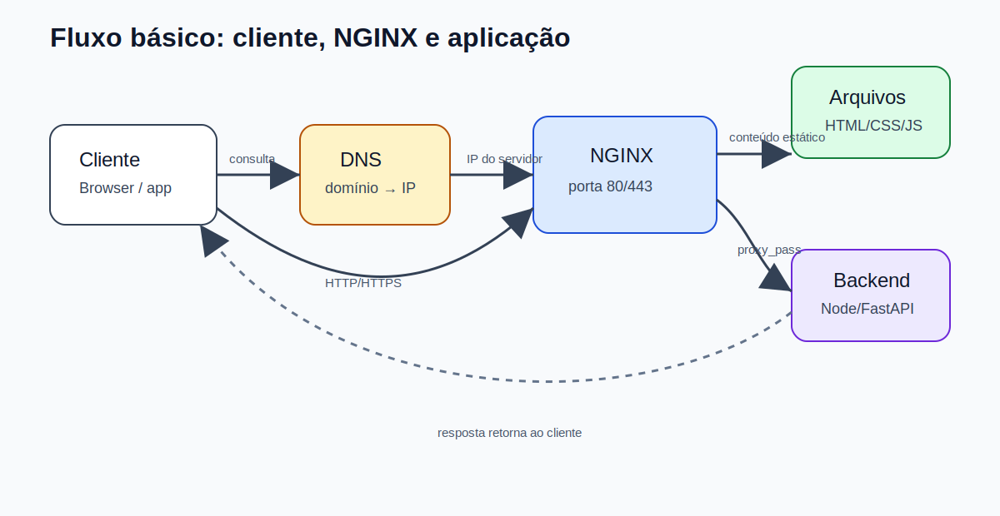
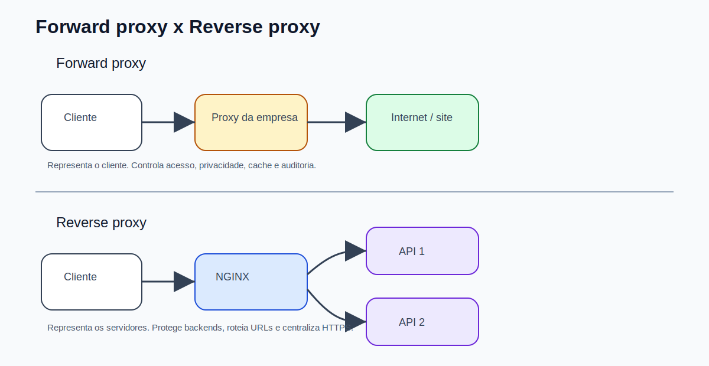
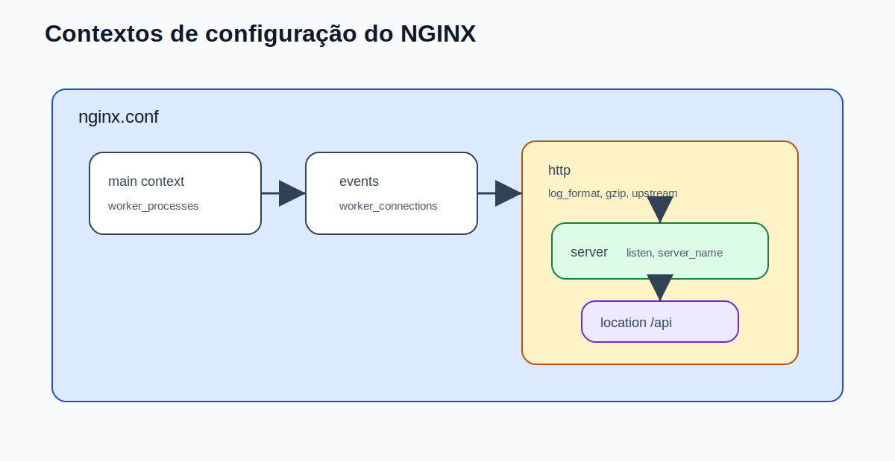
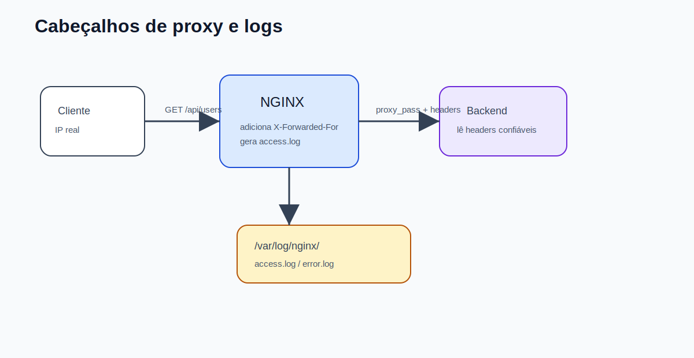
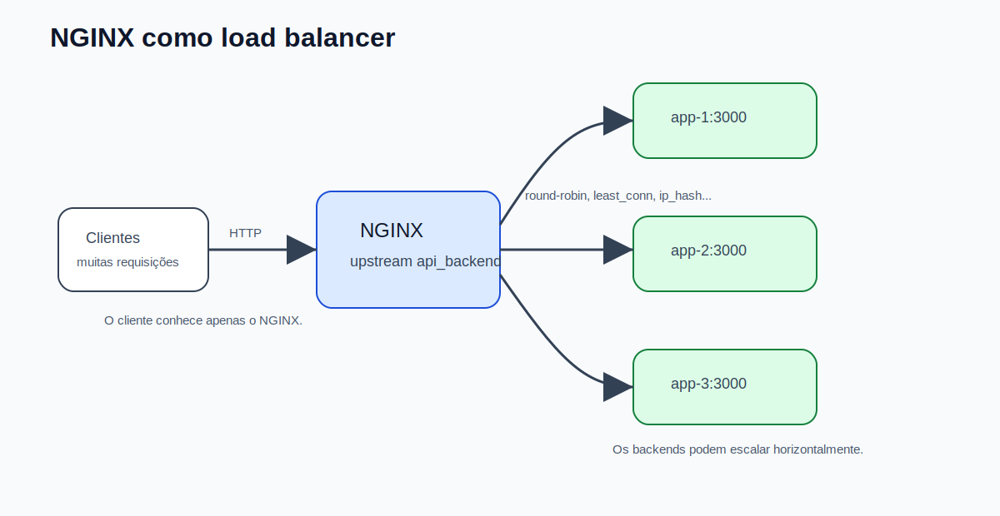
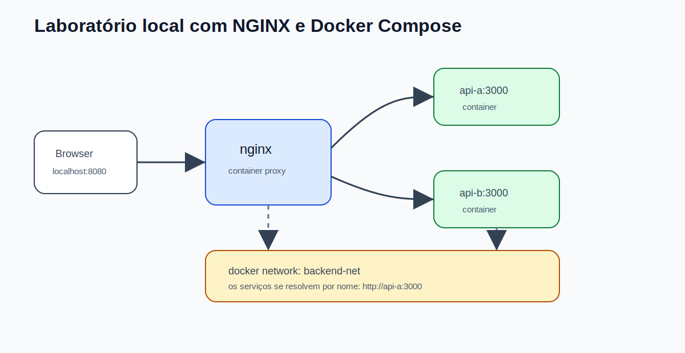

# NGINX e Proxy para Desenvolvimento Backend

## Sobre esta apostila

Esta apostila reúne, em um único material, os conceitos essenciais de **servidores web**, **NGINX**, **proxy de encaminhamento**, **proxy reverso** e **load balancing**. O foco é prático: entender como esses componentes aparecem no dia a dia de um desenvolvedor backend e como configurar o NGINX para servir arquivos estáticos, encaminhar requisições para APIs, balancear carga, registrar logs e ajudar na segurança da aplicação.

A ideia não é decorar diretivas. O objetivo é entender o papel de cada peça na arquitetura e conseguir montar uma configuração funcional, segura e fácil de depurar.

> Observação: os arquivos originais referenciavam imagens locais, mas os arquivos de imagem não vieram anexados. Por isso, esta versão usa diagramas SVG próprios, organizados em `images/nginx-proxy/`, para facilitar a leitura no GitHub.

---

## Como estudar por esta apostila

Leia os capítulos na ordem. Primeiro entenda o que é servidor, proxy e NGINX. Depois avance para configurações reais. Sempre que aparecer um bloco de configuração, tente copiar em um ambiente local e testar com:

```bash
sudo nginx -t
sudo systemctl reload nginx
```

Ao estudar NGINX, o hábito mais importante é: **alterou configuração, teste a sintaxe antes de recarregar o serviço**.

---

## Índice

1. [Capítulo 1 — Servidores web e onde o NGINX entra](#capítulo-1--servidores-web-e-onde-o-nginx-entra)
2. [Capítulo 2 — Forward proxy, reverse proxy e load balancer](#capítulo-2--forward-proxy-reverse-proxy-e-load-balancer)
3. [Capítulo 3 — Instalando e gerenciando o NGINX no Ubuntu](#capítulo-3--instalando-e-gerenciando-o-nginx-no-ubuntu)
4. [Capítulo 4 — Estrutura de configuração do NGINX](#capítulo-4--estrutura-de-configuração-do-nginx)
5. [Capítulo 5 — Servindo um site estático](#capítulo-5--servindo-um-site-estático)
6. [Capítulo 6 — NGINX como proxy reverso para uma API backend](#capítulo-6--nginx-como-proxy-reverso-para-uma-api-backend)
7. [Capítulo 7 — NGINX como load balancer](#capítulo-7--nginx-como-load-balancer)
8. [Capítulo 8 — Logs, observabilidade e depuração](#capítulo-8--logs-observabilidade-e-depuração)
9. [Capítulo 9 — HTTPS, TLS e redirecionamento](#capítulo-9--https-tls-e-redirecionamento)
10. [Capítulo 10 — Segurança e performance](#capítulo-10--segurança-e-performance)
11. [Capítulo 11 — Laboratório com Docker Compose](#capítulo-11--laboratório-com-docker-compose)
12. [Capítulo 12 — Problemas comuns e como resolver](#capítulo-12--problemas-comuns-e-como-resolver)
13. [Cheat sheet de NGINX e proxy](#cheat-sheet-de-nginx-e-proxy)
14. [Referências bibliográficas](#referências-bibliográficas)

---

# Capítulo 1 — Servidores web e onde o NGINX entra

Um **servidor** é um sistema que oferece algum recurso para outros sistemas. Quando você acessa uma API, baixa um arquivo, abre uma página web ou faz login em um sistema, existe algum servidor recebendo a requisição, processando e devolvendo uma resposta.

No contexto web, o servidor conversa com o cliente usando principalmente **HTTP** ou **HTTPS**. O cliente pode ser um navegador, um aplicativo mobile, outro backend ou uma ferramenta como `curl`.

Ao final deste capítulo, você será capaz de:

- explicar o que é um servidor web;
- entender o papel do NGINX em uma aplicação;
- diferenciar conteúdo estático de conteúdo dinâmico;
- visualizar o fluxo entre cliente, DNS, NGINX e backend.

---

## 1.1 — O problema

Imagine que você criou uma API backend em Node.js, FastAPI, Spring ou outra tecnologia. Durante o desenvolvimento, é comum acessar diretamente:

```text
http://localhost:3000
```

Em produção, porém, normalmente você não expõe sua aplicação diretamente para a internet. Antes dela, pode existir uma camada responsável por:

- receber requisições HTTP/HTTPS;
- servir arquivos estáticos;
- encaminhar chamadas para o backend;
- aplicar limites de requisição;
- registrar logs;
- centralizar TLS/HTTPS;
- distribuir tráfego entre várias instâncias.

Essa camada pode ser o **NGINX**.

---

## 1.2 — O que é NGINX?

O **NGINX** é um servidor web de alto desempenho. Ele pode atuar como:

- servidor de arquivos estáticos;
- proxy reverso;
- balanceador de carga;
- cache HTTP;
- ponto de terminação TLS;
- gateway simples para aplicações backend.

Em uma aplicação backend moderna, um uso muito comum é deixar o NGINX na frente da aplicação:

```text
Cliente → NGINX → Backend
```

Assim, o cliente não fala diretamente com a aplicação. Ele fala com o NGINX, e o NGINX decide o que fazer.

---

## 1.3 — Fluxo básico de uma requisição



No diagrama, o cliente primeiro resolve o domínio usando DNS. Depois, envia a requisição HTTP/HTTPS para o servidor onde o NGINX está ouvindo nas portas `80` ou `443`.

A partir daí, o NGINX pode seguir dois caminhos principais. Se a requisição for para um arquivo estático, como HTML, CSS, JavaScript ou imagem, ele pode responder diretamente. Se a requisição for para uma rota dinâmica, como `/api/users`, ele pode encaminhar a chamada para uma aplicação backend usando `proxy_pass`.

Essa separação é importante porque o NGINX é muito eficiente para lidar com conexões HTTP e arquivos estáticos, enquanto sua aplicação backend fica focada na regra de negócio.

---

## 1.4 — Conteúdo estático e conteúdo dinâmico

**Conteúdo estático** é aquilo que já existe pronto no disco:

```text
index.html
style.css
app.js
logo.png
```

**Conteúdo dinâmico** é gerado por uma aplicação:

```text
GET /api/users/10
POST /api/orders
PATCH /api/profile
```

Uma configuração comum é:

```text
/           → arquivos estáticos
/api/       → aplicação backend
/uploads/   → arquivos públicos
```

No NGINX, essa separação costuma ser feita com blocos `location`.

---

## 1.5 — Por que o NGINX é rápido?

O NGINX usa um modelo orientado a eventos. Em vez de criar um novo processo pesado para cada conexão, ele trabalha com processos `worker` capazes de lidar com muitas conexões simultâneas.

Na prática, isso significa que ele consegue atender muitas requisições com baixo consumo de recursos, especialmente quando comparado a modelos mais antigos baseados em processo por requisição.

Isso não quer dizer que NGINX “substitui” sua API. Ele complementa sua arquitetura. O backend continua responsável por regra de negócio, banco de dados, autenticação e validações da aplicação.

---

## 1.6 — Exemplo simples com `curl`

Depois de instalar e subir o NGINX, você pode testar:

```bash
curl -I http://localhost
```

O parâmetro `-I` mostra apenas os cabeçalhos da resposta. Um retorno comum seria algo parecido com:

```http
HTTP/1.1 200 OK
Server: nginx
Content-Type: text/html
```

Isso confirma que existe um servidor HTTP respondendo.

---

## 1.7 — Resumo do capítulo

O NGINX é uma camada de entrada para aplicações web. Ele pode servir arquivos diretamente, encaminhar requisições para backends e melhorar segurança, performance e observabilidade. Para backend, o uso mais comum é como **proxy reverso** na frente da API.

---

## 1.8 — Exercícios

1. Explique com suas palavras a diferença entre uma API backend e um servidor web como NGINX.
2. Rode `curl -I http://localhost` em uma máquina com NGINX instalado.
3. Liste três responsabilidades que você colocaria no NGINX e três que ficariam na aplicação backend.

---

# Capítulo 2 — Forward proxy, reverse proxy e load balancer

A palavra **proxy** significa intermediário. Em redes e aplicações web, um proxy recebe uma requisição de um lado e encaminha para outro. A diferença principal está em **quem o proxy representa**.

Ao final deste capítulo, você será capaz de:

- diferenciar proxy de encaminhamento e proxy reverso;
- explicar por que NGINX é muito usado como proxy reverso;
- entender o papel de um load balancer;
- diferenciar balanceamento L4 e L7.

---

## 2.1 — Forward proxy

O **forward proxy**, ou proxy de encaminhamento, fica do lado dos clientes. Ele representa o cliente ao acessar a internet.

Exemplo:

```text
Usuário da empresa → Proxy corporativo → Internet
```

Nesse caso, o servidor externo enxerga o proxy, não diretamente o computador do usuário.

Usos comuns:

- controle de acesso em empresas;
- bloqueio de sites;
- cache de conteúdo;
- auditoria;
- privacidade;
- filtragem de tráfego.

---

## 2.2 — Reverse proxy

O **reverse proxy**, ou proxy reverso, fica do lado dos servidores. Ele representa os servidores internos diante dos clientes externos.

Exemplo:

```text
Cliente externo → NGINX → API interna
```

O cliente não precisa saber onde a API realmente roda. Ele conhece apenas o domínio público, como:

```text
https://api.minhaempresa.com
```

Internamente, o NGINX pode encaminhar para:

```text
http://localhost:3000
http://app:8080
http://api-service:8000
```

---

## 2.3 — Forward proxy x Reverse proxy



No **forward proxy**, o proxy está protegendo ou controlando a saída dos clientes para a internet. Ele é comum em redes corporativas.

No **reverse proxy**, o proxy está protegendo ou organizando a entrada para os servidores internos. Esse é o cenário mais comum para backend: o NGINX recebe a requisição pública e encaminha para uma aplicação privada.

Uma forma simples de lembrar:

```text
Forward proxy  → representa clientes.
Reverse proxy  → representa servidores.
```

---

## 2.4 — Load balancer

Um **load balancer** distribui requisições entre várias instâncias de uma aplicação. Ele evita que todo o tráfego caia em um único servidor.

```text
Cliente → Load Balancer → app-1
                         → app-2
                         → app-3
```

Quando uma aplicação cresce, você pode subir várias instâncias iguais do backend. O NGINX, como balanceador, decide para qual instância enviar cada requisição.

---

## 2.5 — Balanceamento L4 e L7

Existem duas formas comuns de balanceamento:

**Camada 4 — transporte**

Opera em nível de TCP/UDP. Decide com base em IP e porta. É rápido e mais genérico, mas não entende detalhes do HTTP.

**Camada 7 — aplicação**

Opera em nível de HTTP/HTTPS. Consegue tomar decisões com base em URL, host, headers e cookies. É muito usado em APIs e aplicações web.

Exemplo de decisão L7:

```text
/api/users      → serviço de usuários
/api/payments   → serviço de pagamentos
/admin          → serviço administrativo
```

---

## 2.6 — Resumo do capítulo

Forward proxy representa clientes. Reverse proxy representa servidores. Load balancer distribui tráfego entre instâncias. O NGINX pode atuar como servidor web, reverse proxy e load balancer, o que o torna uma ferramenta muito útil para backend e infraestrutura.

---

## 2.7 — Exercícios

1. Explique por que uma empresa usaria forward proxy.
2. Explique por que uma API backend usaria reverse proxy.
3. Dê um exemplo de roteamento por caminho usando reverse proxy.

---

# Capítulo 3 — Instalando e gerenciando o NGINX no Ubuntu

Neste capítulo, vamos instalar o NGINX no Ubuntu e aprender os comandos básicos para iniciar, parar, reiniciar, recarregar e verificar o serviço.

Ao final deste capítulo, você será capaz de:

- instalar o NGINX;
- verificar se ele está rodando;
- entender o que é `localhost`;
- testar a página padrão;
- usar `systemctl` para gerenciar o serviço.

---

## 3.1 — Instalação

Atualize a lista de pacotes:

```bash
sudo apt update
```

Instale o NGINX:

```bash
sudo apt install nginx -y
```

Verifique a versão:

```bash
nginx -v
```

---

## 3.2 — Gerenciando o serviço

Verificar status:

```bash
sudo systemctl status nginx
```

Iniciar:

```bash
sudo systemctl start nginx
```

Parar:

```bash
sudo systemctl stop nginx
```

Reiniciar:

```bash
sudo systemctl restart nginx
```

Recarregar configuração sem derrubar o processo:

```bash
sudo systemctl reload nginx
```

Habilitar inicialização automática:

```bash
sudo systemctl enable nginx
```

---

## 3.3 — Testando no navegador

Acesse:

```text
http://localhost
```

Ou teste pelo terminal:

```bash
curl -I http://localhost
```

Se o NGINX estiver funcionando, você receberá uma resposta HTTP.

---

## 3.4 — O que é `localhost`?

`localhost` é um nome que aponta para a própria máquina. Em sistemas Linux, isso normalmente é definido no arquivo:

```text
/etc/hosts
```

Uma linha comum nesse arquivo é:

```text
127.0.0.1 localhost
```

Então, quando você acessa:

```text
http://localhost
```

você está acessando o IP `127.0.0.1`, que representa sua própria máquina.

---

## 3.5 — Testando a configuração

Antes de aplicar qualquer alteração no NGINX, rode:

```bash
sudo nginx -t
```

Esse comando verifica se a sintaxe dos arquivos de configuração está correta.

Se estiver tudo certo, recarregue:

```bash
sudo systemctl reload nginx
```

Em produção, essa sequência evita derrubar o serviço por erro de digitação em arquivo de configuração.

---

## 3.6 — Resumo do capítulo

Instalar o NGINX no Ubuntu é simples. O ponto mais importante é aprender o ciclo seguro de configuração:

```bash
editar configuração
sudo nginx -t
sudo systemctl reload nginx
```

---

## 3.7 — Exercícios

1. Instale o NGINX em uma máquina Ubuntu.
2. Verifique o status do serviço.
3. Teste o acesso com navegador e com `curl`.
4. Rode `sudo nginx -t` e observe a resposta.

---

# Capítulo 4 — Estrutura de configuração do NGINX

A configuração do NGINX é organizada em blocos chamados **contextos**. Entender essa estrutura evita muita confusão.

Ao final deste capítulo, você será capaz de:

- entender a estrutura do `nginx.conf`;
- diferenciar `http`, `server`, `location` e `upstream`;
- entender o uso de `sites-available` e `sites-enabled`;
- criar configurações separadas por site ou aplicação.

---

## 4.1 — Arquivo principal

O arquivo principal costuma ficar em:

```text
/etc/nginx/nginx.conf
```

Ele define configurações globais e geralmente inclui outros arquivos, como os arquivos de sites ativos.

Em distribuições como Ubuntu, é comum existir esta organização:

```text
/etc/nginx/
├── nginx.conf
├── sites-available/
│   └── meusite
└── sites-enabled/
    └── meusite -> ../sites-available/meusite
```

`sites-available` guarda configurações disponíveis. `sites-enabled` contém links simbólicos para as configurações realmente ativas.

---

## 4.2 — Contextos principais



O contexto `main` fica no nível principal do arquivo. Nele entram diretivas como `worker_processes`.

O contexto `events` define configurações relacionadas a conexões, como `worker_connections`.

O contexto `http` contém configurações HTTP gerais, como logs, compressão, cache, upstreams e servidores.

O contexto `server` representa um servidor virtual. É nele que você define `listen`, `server_name`, `root`, `index` e regras específicas.

O contexto `location` define como tratar caminhos específicos da URL, como `/`, `/api`, `/uploads` ou `/admin`.

---

## 4.3 — Exemplo mínimo de servidor

```nginx
server {
    listen 80;
    server_name localhost;

    root /var/www/meusite;
    index index.html;

    location / {
        try_files $uri $uri/ =404;
    }
}
```

Esse bloco diz:

- escute na porta `80`;
- responda para `localhost`;
- procure arquivos em `/var/www/meusite`;
- use `index.html` como arquivo inicial;
- se o arquivo solicitado não existir, retorne `404`.

---

## 4.4 — `location` na prática

O bloco `location` decide o comportamento por caminho.

```nginx
location / {
    try_files $uri $uri/ =404;
}

location /api/ {
    proxy_pass http://localhost:3000/;
}
```

Nesse exemplo:

- `/` procura arquivos estáticos;
- `/api/` encaminha para um backend rodando na porta `3000`.

---

## 4.5 — Boas práticas

Evite colocar todos os sites diretamente dentro de `nginx.conf`. Para cada aplicação, crie um arquivo separado em:

```text
/etc/nginx/sites-available/
```

Depois ative com link simbólico:

```bash
sudo ln -s /etc/nginx/sites-available/minha-api /etc/nginx/sites-enabled/
```

Teste:

```bash
sudo nginx -t
```

Recarregue:

```bash
sudo systemctl reload nginx
```

---

## 4.6 — Resumo do capítulo

A configuração do NGINX é hierárquica. O mais comum no dia a dia é trabalhar com blocos `server` e `location`. Para backend, você usará muito `proxy_pass`, `proxy_set_header`, `upstream`, `access_log` e `error_log`.

---

## 4.7 — Exercícios

1. Abra `/etc/nginx/nginx.conf` e identifique os blocos `events` e `http`.
2. Veja quais arquivos estão em `/etc/nginx/sites-enabled/`.
3. Explique a diferença entre `server` e `location`.

---

# Capítulo 5 — Servindo um site estático

Antes de usar o NGINX como proxy reverso, vale entender como ele serve arquivos estáticos. Isso ajuda a compreender `root`, `index` e `try_files`.

Ao final deste capítulo, você será capaz de:

- criar um diretório para um site;
- configurar um `server block`;
- ativar o site;
- testar a entrega de arquivos estáticos.

---

## 5.1 — Criando a pasta do site

```bash
sudo mkdir -p /var/www/meusite
sudo chown -R $USER:$USER /var/www/meusite
```

Crie o arquivo inicial:

```bash
nano /var/www/meusite/index.html
```

Conteúdo:

```html
<!DOCTYPE html>
<html lang="pt-BR">
<head>
  <meta charset="UTF-8">
  <title>Meu site com NGINX</title>
</head>
<body>
  <h1>NGINX funcionando</h1>
  <p>Esta página está sendo servida como arquivo estático.</p>
</body>
</html>
```

---

## 5.2 — Criando a configuração

```bash
sudo nano /etc/nginx/sites-available/meusite
```

Conteúdo:

```nginx
server {
    listen 80;
    server_name localhost;

    root /var/www/meusite;
    index index.html;

    location / {
        try_files $uri $uri/ =404;
    }
}
```

Ative:

```bash
sudo ln -s /etc/nginx/sites-available/meusite /etc/nginx/sites-enabled/
```

Se quiser remover o site padrão:

```bash
sudo rm /etc/nginx/sites-enabled/default
```

Teste e recarregue:

```bash
sudo nginx -t
sudo systemctl reload nginx
```

---

## 5.3 — Entendendo `try_files`

```nginx
try_files $uri $uri/ =404;
```

Essa linha significa:

1. tente encontrar exatamente o arquivo solicitado;
2. se não encontrar, tente encontrar um diretório;
3. se não encontrar nada, retorne `404`.

Exemplo:

```text
GET /style.css
```

O NGINX procura:

```text
/var/www/meusite/style.css
```

Se existir, devolve. Se não existir, retorna `404`.

---

## 5.4 — Resumo do capítulo

Servir arquivos estáticos com NGINX é uma tarefa direta: você define uma pasta com `root`, um arquivo inicial com `index` e uma regra de busca com `try_files`.

---

## 5.5 — Exercícios

1. Crie uma página `index.html`.
2. Configure um site em `sites-available`.
3. Ative com link simbólico.
4. Teste com `curl http://localhost`.

---

# Capítulo 6 — NGINX como proxy reverso para uma API backend

Este é um dos usos mais importantes do NGINX para backend: receber requisições públicas e encaminhar para uma aplicação interna.

Ao final deste capítulo, você será capaz de:

- configurar `proxy_pass`;
- encaminhar headers importantes;
- preservar informações do cliente original;
- entender erros comuns como `502 Bad Gateway`;
- configurar proxy para WebSocket.

---

## 6.1 — O problema

Sua API roda localmente:

```text
http://localhost:3000
```

Mas você quer expor para o usuário:

```text
http://localhost/api/
```

Ou em produção:

```text
https://api.minhaempresa.com/
```

Para isso, o NGINX recebe a requisição e repassa para o backend.

---

## 6.2 — Configuração básica

```nginx
server {
    listen 80;
    server_name localhost;

    location /api/ {
        proxy_pass http://localhost:3000/;
    }
}
```

Quando o cliente chama:

```text
GET /api/users
```

o NGINX encaminha para:

```text
http://localhost:3000/users
```

A barra final em `proxy_pass http://localhost:3000/;` é importante. Ela influencia como o caminho é reescrito ao encaminhar a requisição.

---

## 6.3 — Configuração recomendada com headers

```nginx
server {
    listen 80;
    server_name api.localhost;

    location / {
        proxy_pass http://localhost:3000;

        proxy_http_version 1.1;

        proxy_set_header Host $host;
        proxy_set_header X-Real-IP $remote_addr;
        proxy_set_header X-Forwarded-For $proxy_add_x_forwarded_for;
        proxy_set_header X-Forwarded-Proto $scheme;
    }
}
```

Esses headers são importantes porque o backend normalmente precisa saber:

- qual host o cliente acessou;
- qual era o IP original do cliente;
- se a requisição chegou ao proxy por HTTP ou HTTPS.

Sem esses cabeçalhos, sua aplicação pode enxergar apenas o IP do NGINX, e não o IP real do cliente.

---

## 6.4 — Cabeçalhos e logs



O NGINX recebe a requisição do cliente e encaminha ao backend. Nesse caminho, ele pode adicionar cabeçalhos como `X-Forwarded-For`.

Isso é útil porque o backend não recebe a conexão diretamente do cliente. Ele recebe a conexão do NGINX. Portanto, se você não repassar o IP original via header, o backend pode registrar apenas `127.0.0.1` ou o IP interno do proxy.

Essa informação também pode aparecer nos logs do NGINX, ajudando na auditoria e na depuração.

---

## 6.5 — Proxy para múltiplas rotas

```nginx
server {
    listen 80;
    server_name exemplo.localhost;

    root /var/www/frontend;
    index index.html;

    location / {
        try_files $uri $uri/ /index.html;
    }

    location /api/ {
        proxy_pass http://localhost:3000/;
        proxy_set_header Host $host;
        proxy_set_header X-Forwarded-For $proxy_add_x_forwarded_for;
        proxy_set_header X-Forwarded-Proto $scheme;
    }

    location /admin/ {
        proxy_pass http://localhost:4000/;
        proxy_set_header Host $host;
        proxy_set_header X-Forwarded-For $proxy_add_x_forwarded_for;
        proxy_set_header X-Forwarded-Proto $scheme;
    }
}
```

Essa configuração permite:

- servir frontend em `/`;
- encaminhar `/api/` para uma API;
- encaminhar `/admin/` para outro serviço.

---

## 6.6 — Proxy para WebSocket

WebSocket exige suporte a upgrade de conexão HTTP. Uma configuração comum é:

```nginx
server {
    listen 80;
    server_name chat.localhost;

    location /socket.io/ {
        proxy_pass http://localhost:3000;

        proxy_http_version 1.1;
        proxy_set_header Upgrade $http_upgrade;
        proxy_set_header Connection "upgrade";

        proxy_set_header Host $host;
        proxy_set_header X-Forwarded-For $proxy_add_x_forwarded_for;
        proxy_set_header X-Forwarded-Proto $scheme;
    }
}
```

Sem os headers `Upgrade` e `Connection`, a conexão WebSocket pode falhar.

---

## 6.7 — Timeouts úteis

Algumas APIs fazem processamento mais demorado. Você pode ajustar timeouts:

```nginx
location /api/ {
    proxy_pass http://localhost:3000/;

    proxy_connect_timeout 5s;
    proxy_send_timeout 30s;
    proxy_read_timeout 30s;
}
```

Use com cuidado. Timeouts muito altos podem mascarar problemas no backend. Timeouts muito baixos podem derrubar requisições legítimas.

---

## 6.8 — Resumo do capítulo

O NGINX como proxy reverso é uma ponte entre o cliente e sua aplicação. A configuração mínima usa `proxy_pass`, mas uma configuração profissional também repassa headers, define timeouts e registra logs úteis.

---

## 6.9 — Exercícios

1. Suba uma API local na porta `3000`.
2. Configure o NGINX para encaminhar `/api/` para essa API.
3. No backend, registre os headers recebidos e observe `X-Forwarded-For`.
4. Simule a API desligada e observe o erro no navegador e no `error.log`.

---

# Capítulo 7 — NGINX como load balancer

Quando uma única instância da aplicação não é suficiente, você pode subir várias instâncias e usar o NGINX para distribuir requisições.

Ao final deste capítulo, você será capaz de:

- configurar um bloco `upstream`;
- usar NGINX como load balancer HTTP;
- entender Round Robin, `least_conn` e `ip_hash`;
- configurar pesos e falhas passivas.

---

## 7.1 — O problema

Imagine uma API Node.js rodando em três portas:

```text
localhost:3001
localhost:3002
localhost:3003
```

Você quer que o cliente acesse apenas:

```text
http://localhost/api
```

E o NGINX distribua o tráfego entre as instâncias.

---

## 7.2 — Configuração com `upstream`

```nginx
upstream api_backend {
    server localhost:3001;
    server localhost:3002;
    server localhost:3003;
}

server {
    listen 80;
    server_name localhost;

    location /api/ {
        proxy_pass http://api_backend/;

        proxy_set_header Host $host;
        proxy_set_header X-Forwarded-For $proxy_add_x_forwarded_for;
        proxy_set_header X-Forwarded-Proto $scheme;
    }
}
```

Por padrão, o NGINX usa **Round Robin**: distribui uma requisição para cada servidor em sequência.

---

## 7.3 — Visualizando o balanceamento



No diagrama, o cliente conhece apenas o NGINX. As instâncias `app-1`, `app-2` e `app-3` ficam atrás dele.

Esse modelo permite escalar horizontalmente. Se a demanda aumentar, você adiciona mais instâncias no `upstream`. Se uma instância falhar, o NGINX pode parar temporariamente de enviar requisições para ela, dependendo da configuração e do tipo de falha.

---

## 7.4 — Algoritmos de balanceamento

### Round Robin

É o padrão. Não precisa configurar:

```nginx
upstream api_backend {
    server localhost:3001;
    server localhost:3002;
}
```

Distribui em sequência:

```text
3001 → 3002 → 3001 → 3002
```

### Least Connections

Envia a requisição para o servidor com menos conexões ativas:

```nginx
upstream api_backend {
    least_conn;

    server localhost:3001;
    server localhost:3002;
}
```

É útil quando algumas requisições demoram mais do que outras.

### IP Hash

Mantém o mesmo cliente tendendo a cair no mesmo backend, baseado no IP:

```nginx
upstream api_backend {
    ip_hash;

    server localhost:3001;
    server localhost:3002;
}
```

Pode ser útil para sessões legadas, mas em aplicações modernas o ideal é manter o backend **stateless**, sem depender de sessão local.

---

## 7.5 — Pesos

Você pode enviar mais tráfego para uma instância mais forte:

```nginx
upstream api_backend {
    server localhost:3001 weight=3;
    server localhost:3002 weight=1;
}
```

Nesse caso, a primeira instância tende a receber mais requisições.

---

## 7.6 — Falhas passivas

No NGINX Open Source, é comum usar configurações como:

```nginx
upstream api_backend {
    server localhost:3001 max_fails=3 fail_timeout=30s;
    server localhost:3002 max_fails=3 fail_timeout=30s;
}
```

Isso significa que, se um backend falhar várias vezes dentro de uma janela de tempo, ele pode ser considerado temporariamente indisponível.

> Observação: health checks ativos avançados são recurso do NGINX Plus. No NGINX Open Source, o comportamento mais comum é baseado em falhas observadas durante o tráfego.

---

## 7.7 — Resumo do capítulo

O NGINX pode distribuir tráfego entre múltiplas instâncias da sua aplicação. Para backend, isso é essencial quando você quer escalar horizontalmente, melhorar disponibilidade e reduzir sobrecarga em uma única instância.

---

## 7.8 — Exercícios

1. Suba duas instâncias da mesma API em portas diferentes.
2. Configure um `upstream`.
3. Faça várias requisições com `curl` e observe os logs dos backends.
4. Teste `least_conn` e `ip_hash`.

---

# Capítulo 8 — Logs, observabilidade e depuração

Logs são fundamentais para entender o que está acontecendo com sua aplicação. O NGINX normalmente trabalha com dois tipos principais de log:

- `access_log`: requisições recebidas;
- `error_log`: erros e eventos relevantes.

Ao final deste capítulo, você será capaz de:

- configurar logs por site;
- personalizar `log_format`;
- registrar tempo de resposta do upstream;
- usar logs para investigar erros.

---

## 8.1 — Local padrão de logs

No Ubuntu, os logs geralmente ficam em:

```text
/var/log/nginx/access.log
/var/log/nginx/error.log
```

Para acompanhar em tempo real:

```bash
sudo tail -f /var/log/nginx/access.log
```

Para erros:

```bash
sudo tail -f /var/log/nginx/error.log
```

---

## 8.2 — Logs por aplicação

Crie um diretório:

```bash
sudo mkdir -p /var/log/nginx/minha-api
sudo chown -R www-data:www-data /var/log/nginx/minha-api
```

No `server`:

```nginx
server {
    listen 80;
    server_name api.localhost;

    access_log /var/log/nginx/minha-api/access.log;
    error_log /var/log/nginx/minha-api/error.log;

    location / {
        proxy_pass http://localhost:3000;
    }
}
```

---

## 8.3 — Formato de log mais útil para backend

Dentro do bloco `http` em `nginx.conf`:

```nginx
log_format backend_main
    '$remote_addr - $request_id [$time_local] '
    '"$request" status=$status '
    'bytes=$body_bytes_sent '
    'request_time=$request_time '
    'upstream_addr=$upstream_addr '
    'upstream_status=$upstream_status '
    'upstream_time=$upstream_response_time '
    'xff="$http_x_forwarded_for" '
    'ua="$http_user_agent"';
```

No site:

```nginx
access_log /var/log/nginx/minha-api/access.log backend_main;
```

Esse formato ajuda a responder perguntas como:

- qual IP fez a requisição?
- qual rota foi chamada?
- qual status HTTP voltou?
- quanto tempo o NGINX levou?
- quanto tempo o backend levou?
- qual backend respondeu?

---

## 8.4 — Depurando com logs

Ver últimas linhas:

```bash
sudo tail -n 100 /var/log/nginx/minha-api/access.log
```

Filtrar status 500:

```bash
sudo grep 'status=500' /var/log/nginx/minha-api/access.log
```

Acompanhar erros:

```bash
sudo tail -f /var/log/nginx/minha-api/error.log
```

Ver logs do serviço NGINX:

```bash
sudo journalctl -u nginx -f
```

---

## 8.5 — Status importantes

| Status | Significado | Possível causa |
|---|---|---|
| `200` | OK | Requisição atendida |
| `301/302` | Redirecionamento | HTTP para HTTPS, rota alterada |
| `400` | Requisição inválida | Cliente enviou algo errado |
| `403` | Proibido | Permissão de arquivo, regra de acesso |
| `404` | Não encontrado | Arquivo/rota inexistente |
| `413` | Payload muito grande | Upload maior que `client_max_body_size` |
| `499` | Cliente fechou conexão | Cliente desistiu antes da resposta |
| `500` | Erro interno | Aplicação ou configuração |
| `502` | Bad Gateway | Backend fora, porta errada, erro de proxy |
| `504` | Gateway Timeout | Backend demorou demais |

---

## 8.6 — Resumo do capítulo

Logs do NGINX são uma das melhores ferramentas para investigar problemas em produção. Um bom formato de log mostra status, tempo total, tempo do backend e endereço upstream.

---

## 8.7 — Exercícios

1. Configure logs separados para uma aplicação.
2. Adicione `upstream_response_time` ao formato de log.
3. Derrube o backend e observe o erro gerado.
4. Faça uma requisição para uma rota inexistente e observe o `404`.

---

# Capítulo 9 — HTTPS, TLS e redirecionamento

Em produção, aplicações web devem usar HTTPS. O NGINX pode centralizar o certificado TLS e encaminhar a requisição para o backend internamente.

Ao final deste capítulo, você será capaz de:

- entender TLS termination;
- redirecionar HTTP para HTTPS;
- configurar headers para o backend saber o protocolo original;
- entender cuidados com HSTS.

---

## 9.1 — TLS termination

Quando o NGINX recebe a conexão HTTPS e encaminha internamente para o backend em HTTP, dizemos que ele faz **TLS termination**.

```text
Cliente --HTTPS--> NGINX --HTTP interno--> Backend
```

Isso simplifica a aplicação, porque ela não precisa gerenciar certificado diretamente.

---

## 9.2 — Redirecionando HTTP para HTTPS

```nginx
server {
    listen 80;
    server_name exemplo.com;

    return 301 https://$host$request_uri;
}
```

Esse bloco redireciona qualquer requisição HTTP para HTTPS.

---

## 9.3 — Servidor HTTPS

Exemplo simplificado:

```nginx
server {
    listen 443 ssl;
    server_name exemplo.com;

    ssl_certificate /etc/letsencrypt/live/exemplo.com/fullchain.pem;
    ssl_certificate_key /etc/letsencrypt/live/exemplo.com/privkey.pem;

    location / {
        proxy_pass http://localhost:3000;

        proxy_set_header Host $host;
        proxy_set_header X-Forwarded-For $proxy_add_x_forwarded_for;
        proxy_set_header X-Forwarded-Proto https;
    }
}
```

O backend pode usar `X-Forwarded-Proto` para saber que a requisição original chegou por HTTPS.

---

## 9.4 — Certbot

Em muitos servidores Linux, é comum usar Let’s Encrypt com Certbot:

```bash
sudo apt install certbot python3-certbot-nginx -y
sudo certbot --nginx -d exemplo.com
```

Depois, teste a renovação:

```bash
sudo certbot renew --dry-run
```

---

## 9.5 — HSTS com cuidado

HSTS instrui o navegador a sempre usar HTTPS para o domínio:

```nginx
add_header Strict-Transport-Security "max-age=31536000; includeSubDomains" always;
```

Use com cuidado. Se configurado errado, pode causar problemas de acesso, especialmente com subdomínios ainda não preparados para HTTPS.

---

## 9.6 — Resumo do capítulo

O NGINX pode gerenciar HTTPS na borda da aplicação. Isso deixa o backend mais simples e centraliza a configuração de certificados, redirects e headers de segurança.

---

## 9.7 — Exercícios

1. Explique o que é TLS termination.
2. Configure um redirecionamento de HTTP para HTTPS.
3. Pesquise o que acontece se HSTS for ativado com `includeSubDomains`.

---

# Capítulo 10 — Segurança e performance

O NGINX não substitui boas práticas no backend, mas pode ajudar bastante com segurança e performance.

Ao final deste capítulo, você será capaz de:

- ocultar versão do NGINX;
- limitar tamanho de upload;
- aplicar rate limiting;
- configurar cache básico;
- ativar compressão;
- adicionar headers úteis.

---

## 10.1 — Ocultar versão

No bloco `http`:

```nginx
server_tokens off;
```

Isso evita expor a versão do NGINX em algumas respostas.

---

## 10.2 — Limitar tamanho de upload

```nginx
server {
    client_max_body_size 10m;

    location / {
        proxy_pass http://localhost:3000;
    }
}
```

Se o cliente enviar um payload maior que o limite, pode receber `413 Payload Too Large`.

---

## 10.3 — Rate limiting

No bloco `http`:

```nginx
limit_req_zone $binary_remote_addr zone=api_limit:10m rate=10r/s;
```

No `server` ou `location`:

```nginx
location /api/ {
    limit_req zone=api_limit burst=20 nodelay;

    proxy_pass http://localhost:3000/;
}
```

Isso ajuda a reduzir abuso, scraping agressivo e picos de requisições por IP.

---

## 10.4 — Compressão gzip

No bloco `http`:

```nginx
gzip on;
gzip_types text/plain text/css application/json application/javascript application/xml;
gzip_min_length 1024;
```

Compressão reduz o volume transferido, especialmente para JSON, CSS e JavaScript. Não use como solução mágica: teste impacto em CPU e latência.

---

## 10.5 — Cache de arquivos estáticos

Para arquivos estáticos versionados:

```nginx
location /assets/ {
    root /var/www/meusite;
    expires 30d;
    add_header Cache-Control "public, immutable";
}
```

Esse tipo de cache funciona melhor quando os arquivos têm nomes versionados, como:

```text
app.8fd31c.js
style.771ac2.css
```

---

## 10.6 — Headers de segurança básicos

```nginx
add_header X-Content-Type-Options "nosniff" always;
add_header X-Frame-Options "SAMEORIGIN" always;
add_header Referrer-Policy "strict-origin-when-cross-origin" always;
```

Esses headers ajudam, mas precisam ser entendidos. Segurança não deve ser feita copiando blocos aleatórios sem testar a aplicação.

---

## 10.7 — Resumo do capítulo

NGINX ajuda a proteger e otimizar a aplicação, mas não corrige uma API mal projetada. Use limites, logs, HTTPS, compressão e cache como camadas complementares.

---

## 10.8 — Exercícios

1. Configure `server_tokens off`.
2. Configure `client_max_body_size 5m` e teste um upload maior.
3. Adicione rate limiting em uma rota `/api/`.
4. Ative gzip e compare o tamanho de uma resposta JSON.

---

# Capítulo 11 — Laboratório com Docker Compose

Neste laboratório, vamos simular uma arquitetura comum: NGINX como proxy reverso na frente de duas instâncias de backend.

Ao final deste capítulo, você será capaz de:

- montar um ambiente local com Docker Compose;
- usar NGINX como proxy reverso entre containers;
- entender resolução de nomes dentro da rede Docker;
- testar load balancing local.

---

## 11.1 — Arquitetura do laboratório



O navegador acessa `localhost:8080`. O container `nginx` recebe a requisição e encaminha para `api-a` ou `api-b`.

Dentro do Docker Compose, os serviços conseguem se encontrar pelo nome. Por isso, o NGINX pode usar:

```text
http://api-a:3000
http://api-b:3000
```

sem precisar saber IP interno de container.

---

## 11.2 — Estrutura de pastas

```text
lab-nginx/
├── docker-compose.yml
└── nginx/
    └── default.conf
```

---

## 11.3 — `docker-compose.yml`

```yaml
services:
  nginx:
    image: nginx:alpine
    ports:
      - "8080:80"
    volumes:
      - ./nginx/default.conf:/etc/nginx/conf.d/default.conf:ro
    depends_on:
      - api-a
      - api-b
    networks:
      - backend-net

  api-a:
    image: hashicorp/http-echo
    command: ["-text=Resposta da API A"]
    networks:
      - backend-net

  api-b:
    image: hashicorp/http-echo
    command: ["-text=Resposta da API B"]
    networks:
      - backend-net

networks:
  backend-net:
    driver: bridge
```

---

## 11.4 — `nginx/default.conf`

```nginx
upstream api_backend {
    server api-a:5678;
    server api-b:5678;
}

server {
    listen 80;

    location / {
        proxy_pass http://api_backend;

        proxy_set_header Host $host;
        proxy_set_header X-Forwarded-For $proxy_add_x_forwarded_for;
        proxy_set_header X-Forwarded-Proto $scheme;
    }
}
```

A imagem `hashicorp/http-echo` escuta por padrão na porta `5678`.

---

## 11.5 — Subindo o ambiente

```bash
docker compose up -d
```

Teste:

```bash
curl http://localhost:8080
curl http://localhost:8080
curl http://localhost:8080
```

Você deve ver respostas alternando entre API A e API B, dependendo do balanceamento.

Derrube:

```bash
docker compose down
```

---

## 11.6 — Resumo do capítulo

Docker Compose é excelente para praticar NGINX como proxy reverso e load balancer localmente. Esse laboratório aproxima bastante o cenário de produção, mas sem precisar configurar servidores reais.

---

## 11.7 — Exercícios

1. Adicione uma terceira API ao `docker-compose.yml`.
2. Configure `least_conn`.
3. Remova uma API e observe o comportamento.
4. Veja os logs do NGINX com `docker compose logs -f nginx`.

---

# Capítulo 12 — Problemas comuns e como resolver

NGINX é poderoso, mas erros de configuração são comuns. Este capítulo reúne os problemas mais frequentes no dia a dia.

---

## 12.1 — `nginx: configuration file test failed`

Sempre rode:

```bash
sudo nginx -t
```

Se houver erro, o comando geralmente mostra o arquivo e a linha aproximada.

Erros comuns:

- falta de `;`;
- chaves `{}` não fechadas;
- diretiva em contexto errado;
- arquivo referenciado que não existe.

---

## 12.2 — `502 Bad Gateway`

Significa que o NGINX tentou falar com o backend, mas não conseguiu obter uma resposta válida.

Possíveis causas:

- backend desligado;
- porta errada;
- `proxy_pass` apontando para host incorreto;
- container fora da rede correta;
- aplicação demorando ou fechando conexão;
- firewall bloqueando.

Teste o backend diretamente:

```bash
curl http://localhost:3000
```

Se estiver em Docker:

```bash
docker compose exec nginx wget -qO- http://api-a:3000
```

---

## 12.3 — `404 Not Found`

Possíveis causas:

- `root` errado;
- arquivo não existe;
- `try_files` mal configurado;
- conflito entre `location`;
- aplicação backend recebeu caminho diferente do esperado.

---

## 12.4 — `403 Forbidden`

Possíveis causas:

- permissão incorreta no diretório;
- NGINX sem permissão de leitura;
- `index.html` inexistente;
- autoindex desabilitado;
- regras de bloqueio.

Verifique:

```bash
ls -la /var/www/meusite
```

---

## 12.5 — Porta em uso

Se o NGINX não inicia porque a porta já está em uso:

```bash
sudo ss -tulpn | grep ':80'
```

Ou:

```bash
sudo lsof -i :80
```

Você precisa parar o serviço conflitante ou alterar a porta.

---

## 12.6 — Alterei a configuração e nada mudou

Possíveis causas:

- esqueceu de recarregar;
- editou arquivo em `sites-available`, mas não ativou em `sites-enabled`;
- existe outro `server` capturando a requisição;
- cache do navegador;
- configuração não passou no `nginx -t`.

Sequência segura:

```bash
sudo nginx -t
sudo systemctl reload nginx
sudo systemctl status nginx
```

---

## 12.7 — CORS é problema do NGINX?

Nem sempre. CORS geralmente é uma política controlada pela aplicação/API. O NGINX pode adicionar headers CORS, mas isso deve ser feito com cuidado.

Exemplo simples:

```nginx
location /api/ {
    add_header Access-Control-Allow-Origin "https://meusite.com" always;
    add_header Access-Control-Allow-Methods "GET, POST, PUT, PATCH, DELETE, OPTIONS" always;
    add_header Access-Control-Allow-Headers "Authorization, Content-Type" always;

    if ($request_method = OPTIONS) {
        return 204;
    }

    proxy_pass http://localhost:3000/;
}
```

Evite liberar `*` em APIs autenticadas sem entender as implicações.

---

## 12.8 — Resumo do capítulo

A maioria dos problemas com NGINX pode ser resolvida com três ações: testar sintaxe, olhar logs e testar o backend diretamente. Quando der `502`, pense em backend. Quando der `404/403`, pense em rota, arquivo e permissão.

---

# Cheat sheet de NGINX e proxy

## Serviço

```bash
sudo systemctl status nginx
sudo systemctl start nginx
sudo systemctl stop nginx
sudo systemctl restart nginx
sudo systemctl reload nginx
sudo systemctl enable nginx
```

## Configuração

```bash
sudo nginx -t
sudo nginx -T
nginx -v
nginx -V
```

## Arquivos importantes no Ubuntu

```text
/etc/nginx/nginx.conf
/etc/nginx/sites-available/
/etc/nginx/sites-enabled/
/var/www/html/
/var/log/nginx/access.log
/var/log/nginx/error.log
```

## Criar e ativar site

```bash
sudo nano /etc/nginx/sites-available/meusite
sudo ln -s /etc/nginx/sites-available/meusite /etc/nginx/sites-enabled/
sudo nginx -t
sudo systemctl reload nginx
```

## Site estático mínimo

```nginx
server {
    listen 80;
    server_name localhost;

    root /var/www/meusite;
    index index.html;

    location / {
        try_files $uri $uri/ =404;
    }
}
```

## Proxy reverso mínimo

```nginx
server {
    listen 80;
    server_name api.localhost;

    location / {
        proxy_pass http://localhost:3000;
    }
}
```

## Proxy reverso recomendado

```nginx
server {
    listen 80;
    server_name api.localhost;

    location / {
        proxy_pass http://localhost:3000;
        proxy_http_version 1.1;

        proxy_set_header Host $host;
        proxy_set_header X-Real-IP $remote_addr;
        proxy_set_header X-Forwarded-For $proxy_add_x_forwarded_for;
        proxy_set_header X-Forwarded-Proto $scheme;
    }
}
```

## Load balancing

```nginx
upstream api_backend {
    server localhost:3001;
    server localhost:3002;
}

server {
    listen 80;

    location / {
        proxy_pass http://api_backend;
    }
}
```

## Least connections

```nginx
upstream api_backend {
    least_conn;

    server localhost:3001;
    server localhost:3002;
}
```

## IP hash

```nginx
upstream api_backend {
    ip_hash;

    server localhost:3001;
    server localhost:3002;
}
```

## WebSocket

```nginx
location /socket.io/ {
    proxy_pass http://localhost:3000;

    proxy_http_version 1.1;
    proxy_set_header Upgrade $http_upgrade;
    proxy_set_header Connection "upgrade";

    proxy_set_header Host $host;
    proxy_set_header X-Forwarded-For $proxy_add_x_forwarded_for;
}
```

## Logs

```bash
sudo tail -f /var/log/nginx/access.log
sudo tail -f /var/log/nginx/error.log
sudo journalctl -u nginx -f
```

## Investigar portas

```bash
sudo ss -tulpn | grep ':80'
sudo lsof -i :80
```

## Testar requisições

```bash
curl -I http://localhost
curl -v http://localhost/api/health
curl -H "Host: api.localhost" http://127.0.0.1/
```

## Certbot

```bash
sudo apt install certbot python3-certbot-nginx -y
sudo certbot --nginx -d exemplo.com
sudo certbot renew --dry-run
```

## Docker Compose

```bash
docker compose up -d
docker compose logs -f nginx
docker compose exec nginx nginx -t
docker compose down
```

---

# Referências bibliográficas

- NGINX. **Beginner’s Guide**. Disponível em: <https://nginx.org/en/docs/beginners_guide.html>. Acesso em: 01 jun. 2026.
- NGINX. **Installing nginx**. Disponível em: <https://nginx.org/en/docs/install.html>. Acesso em: 01 jun. 2026.
- NGINX. **Using nginx as HTTP load balancer**. Disponível em: <https://nginx.org/en/docs/http/load_balancing.html>. Acesso em: 01 jun. 2026.
- NGINX. **Module ngx_http_upstream_module**. Disponível em: <https://nginx.org/en/docs/http/ngx_http_upstream_module.html>. Acesso em: 01 jun. 2026.
- F5 NGINX. **HTTP Load Balancing**. Disponível em: <https://docs.nginx.com/nginx/admin-guide/load-balancer/http-load-balancer/>. Acesso em: 01 jun. 2026.
- F5 NGINX. **Accepting the PROXY Protocol**. Disponível em: <https://docs.nginx.com/nginx/admin-guide/load-balancer/using-proxy-protocol/>. Acesso em: 01 jun. 2026.
- UBUNTU. **Install and configure Nginx**. Disponível em: <https://ubuntu.com/tutorials/install-and-configure-nginx>. Acesso em: 01 jun. 2026.
- UBUNTU SERVER. **How to install nginx**. Disponível em: <https://ubuntu.com/server/docs/how-to/web-services/install-nginx/>. Acesso em: 01 jun. 2026.
- MDN WEB DOCS. **An overview of HTTP**. Disponível em: <https://developer.mozilla.org/en-US/docs/Web/HTTP/Overview>. Acesso em: 01 jun. 2026.
- MDN WEB DOCS. **HTTP response status codes**. Disponível em: <https://developer.mozilla.org/en-US/docs/Web/HTTP/Reference/Status>. Acesso em: 01 jun. 2026.
