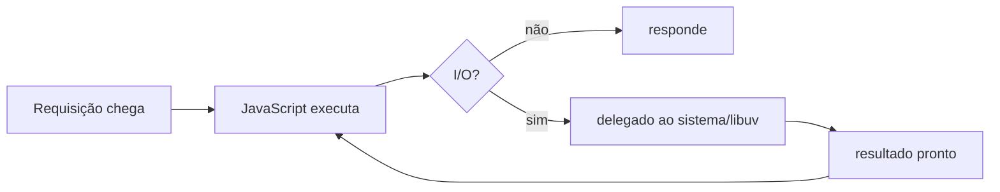
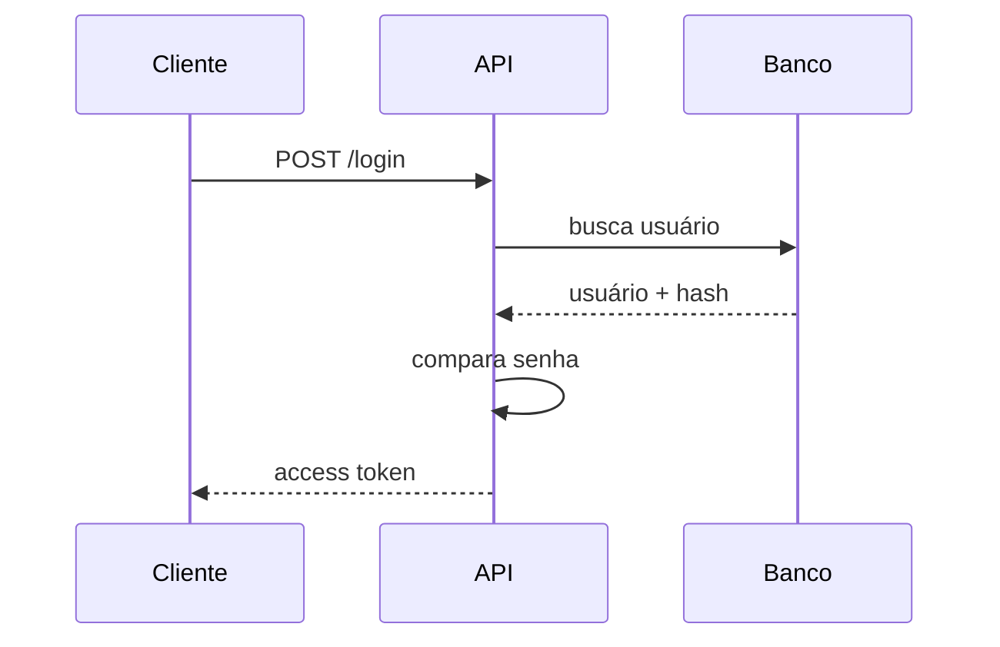

# Node.js para Desenvolvimento Backend

> Apostila didática baseada no **TechGuide Node.js - Alura, FIAP e PM3**, reorganizada para estudo prático de backend.

## Sobre esta apostila

Esta apostila foi criada para transformar o guia de tópicos de Node.js em um material de estudo contínuo, didático e aplicável ao dia a dia de um **desenvolvedor backend**.

A ordem dos capítulos segue a trilha do documento original: lógica de programação, JavaScript, Node.js, assincronicidade, erros, orientação a objetos, testes, SOLID, Express, ORM, autenticação, TypeScript, NestJS, microsserviços, contêineres, WebSockets, GraphQL e habilidades auxiliares.

O foco é responder três perguntas em cada assunto:

1. **O que é?**
2. **Por que isso importa no backend?**
3. **Como aplicar em um projeto real?**

## Como estudar

Leia na ordem. Mesmo que alguns assuntos pareçam básicos, eles serão usados nos capítulos seguintes. Sempre que aparecer código, tente criar uma pasta local e executar os exemplos.

O domínio usado nos exemplos será uma API simples de livros, com rotas como:

```http
GET /books
GET /books/:id
POST /books
PUT /books/:id
DELETE /books/:id
```

Esse domínio é simples, mas suficiente para estudar CRUD, validação, service, repository, banco de dados, autenticação, testes, Docker e CI.

## Índice

1. [Lógica de programação](#capítulo-1--lógica-de-programação)
2. [JavaScript: fundamentos para backend](#capítulo-2--javascript-fundamentos-para-backend)
3. [Node.js: fundamentos](#capítulo-3--nodejs-fundamentos)
4. [Callbacks, Promises e Async/Await](#capítulo-4--callbacks-promises-e-asyncawait)
5. [Manipulação de erros](#capítulo-5--manipulação-de-erros)
6. [Orientação a objetos em JavaScript](#capítulo-6--orientação-a-objetos-em-javascript)
7. [Testes em Node.js](#capítulo-7--testes-em-nodejs)
8. [SOLID aplicado a backend Node.js](#capítulo-8--solid-aplicado-a-backend-nodejs)
9. [Express.js para criação de APIs](#capítulo-9--expressjs-para-criação-de-apis)
10. [ORM com Sequelize e Prisma](#capítulo-10--orm-com-sequelize-e-prisma)
11. [Autenticação, autorização e JWT](#capítulo-11--autenticação-autorização-e-jwt)
12. [TypeScript para backend Node.js](#capítulo-12--typescript-para-backend-nodejs)
13. [NestJS: fundamentos](#capítulo-13--nestjs-fundamentos)
14. [Microsserviços com Node.js](#capítulo-14--microsserviços-com-nodejs)
15. [Contêineres, Docker e Node.js](#capítulo-15--contêineres-docker-e-nodejs)
16. [WebSockets e comunicação em tempo real](#capítulo-16--websockets-e-comunicação-em-tempo-real)
17. [GraphQL e Apollo Server](#capítulo-17--graphql-e-apollo-server)
18. [Git, HTTP, design patterns, CLI e cloud](#capítulo-18--habilidades-auxiliares-para-backend-nodejs)
19. [Noções de front-end úteis para backend](#capítulo-19--noções-de-front-end-úteis-para-backend)
20. [Projeto prático guiado](#capítulo-20--projeto-prático-guiado-api-de-livros)
21. [Cheat sheet final](#cheat-sheet-final)
22. [Referências bibliográficas](#referências-bibliográficas)

---

# Capítulo 1 — Lógica de programação

## Objetivos do capítulo

Ao final deste capítulo, você será capaz de:

- decompor um problema em partes menores;
- identificar entrada, processamento e saída;
- usar variáveis, operadores, condições, laços e funções;
- transformar uma regra de negócio em algoritmo.

## 1.1 — O problema

Antes de estudar Node.js, Express, banco de dados ou Docker, é necessário entender que todo programa resolve problemas por meio de instruções organizadas.

Quando uma API cadastra um usuário, ela não “simplesmente salva no banco”. Ela executa uma sequência lógica:

1. recebe os dados da requisição;
2. valida campos obrigatórios;
3. verifica se o e-mail já existe;
4. criptografa a senha;
5. salva no banco;
6. retorna resposta HTTP.

Isso é um algoritmo.

## 1.2 — Entrada, processamento e saída

| Parte | Significado | Exemplo em API |
|---|---|---|
| Entrada | Dados recebidos | JSON enviado no `POST /books` |
| Processamento | Regras aplicadas | validar título e autor |
| Saída | Resultado devolvido | `201 Created` com o livro criado |

Pseudocódigo:

```text
INÍCIO
  RECEBER título e autor

  SE título estiver vazio
    RETORNAR erro "Título é obrigatório"
  FIM_SE

  CRIAR livro
  RETORNAR livro criado
FIM
```

## 1.3 — Variáveis e tipos

```js
const title = 'Clean Code';
const year = 2008;
const available = true;
```

Em backend, variáveis guardam dados de entrada, informações vindas do banco, resultados intermediários e objetos de resposta.

## 1.4 — Condicionais

```js
function validateBook(book) {
  if (!book.title) {
    return 'Título é obrigatório';
  }

  if (!book.author) {
    return 'Autor é obrigatório';
  }

  return null;
}
```

Uma API usa condicionais para validar entrada, aplicar permissões, decidir status HTTP e controlar regras de negócio.

## 1.5 — Laços

```js
const books = ['Clean Code', 'Refactoring', 'Domain-Driven Design'];

for (const book of books) {
  console.log(book);
}
```

Laços são úteis para percorrer listas, transformar dados e validar múltiplos itens. Em backend, prefira deixar filtros grandes para o banco quando possível.

## 1.6 — Funções

```js
function calculateDiscount(price, percentage) {
  return price - price * (percentage / 100);
}
```

Funções ajudam a isolar regras. Uma função pequena e bem nomeada é mais fácil de testar e reutilizar.

## O que pode dar errado?

- Tentar resolver tudo em um único bloco de código.
- Misturar regra de negócio com detalhes de HTTP.
- Criar funções com responsabilidades demais.
- Escrever código que funciona, mas é difícil de entender.

## Resumo do capítulo

Lógica de programação é a base do backend. Antes de pensar em framework, organize o problema em passos claros.

## Exercícios

1. Escreva um algoritmo para login.
2. Crie uma função que verifique se uma idade é maior ou igual a 18.
3. Descreva uma rota de cadastro usando entrada, processamento e saída.

---

# Capítulo 2 — JavaScript: fundamentos para backend

## Objetivos do capítulo

Ao final deste capítulo, você será capaz de:

- entender tipos primitivos;
- diferenciar `var`, `let` e `const`;
- usar comparação corretamente;
- manipular objetos e arrays;
- entender módulos e JSON.

## 2.1 — Por que JavaScript importa para Node.js?

Node.js executa JavaScript fora do navegador. Portanto, bugs comuns em APIs Node.js muitas vezes vêm de fundamentos mal compreendidos da linguagem: coerção de tipos, objetos mutáveis, Promises sem `await`, tratamento de erro ruim e arrays usados de forma ineficiente.

## 2.2 — Tipos primitivos

```js
const name = 'Diego';          // string
const age = 25;                // number
const active = true;           // boolean
const empty = null;            // ausência intencional
let notDefined;                // undefined
const big = 9007199254740991n; // bigint
```

## 2.3 — `var`, `let` e `const`

Use `const` por padrão. Use `let` quando precisar reatribuir. Evite `var`.

```js
const userId = '123';
let attempts = 0;

attempts += 1;
```

`const` não torna objetos imutáveis:

```js
const user = { name: 'Ana' };
user.name = 'Ana Silva'; // permitido
```

## 2.4 — `==` vs `===`

```js
console.log(1 == '1');  // true
console.log(1 === '1'); // false
```

Use `===` quase sempre. O `==` faz conversão automática de tipos e pode permitir bugs em validações.

## 2.5 — Objetos

```js
const book = {
  id: '1',
  title: 'Clean Architecture',
  author: 'Robert C. Martin',
};

console.log(book.title);
```

Em backend, objetos aparecem em request body, response body, entidades, DTOs, eventos, configurações e mensagens de fila.

## 2.6 — Arrays

```js
const books = [
  { id: '1', title: 'Clean Code', available: true },
  { id: '2', title: 'Refactoring', available: false },
];

const availableBooks = books.filter((book) => book.available);
const titles = books.map((book) => book.title);
```

Métodos úteis:

| Método | Uso |
|---|---|
| `map` | transformar lista |
| `filter` | filtrar itens |
| `find` | encontrar um item |
| `some` | verificar se algum item atende condição |
| `every` | verificar se todos atendem condição |
| `reduce` | acumular resultado |

## 2.7 — Funções

```js
function sum(a, b) {
  return a + b;
}

const multiply = (a, b) => a * b;
```

Em backend, funções pequenas ajudam a separar validações, cálculos e transformações.

## 2.8 — Desestruturação

```js
const { title, author } = request.body;
const { id } = request.params;
```

Muito usada em Express para ler `req.body`, `req.params` e `req.query`.

## 2.9 — Módulos

CommonJS:

```js
const express = require('express');
module.exports = router;
```

ES Modules:

```js
import express from 'express';
export default router;
```

Projetos modernos com TypeScript normalmente usam `import/export`.

## 2.10 — JSON

JSON é o formato mais comum de troca de dados em APIs.

```json
{
  "id": "1",
  "title": "Clean Code",
  "author": "Robert C. Martin"
}
```

Em Express:

```js
app.use(express.json());
```

## O que pode dar errado?

- Usar `==` em validações.
- Tratar `null` e `undefined` como se fossem iguais.
- Mutar objetos compartilhados sem perceber.
- Fazer processamento pesado em arrays gigantes quando o banco deveria filtrar.

## Resumo do capítulo

JavaScript é a base do backend Node.js. Os fundamentos mais importantes são tipos, objetos, arrays, funções, módulos, JSON e assincronicidade.

## Exercícios

1. Crie uma função que filtre livros disponíveis.
2. Crie uma função que retorne apenas `id`, `title` e `author`.
3. Explique a diferença entre `null` e `undefined`.

---

# Capítulo 3 — Node.js: fundamentos

## Objetivos do capítulo

Ao final deste capítulo, você será capaz de:

- explicar o que é Node.js;
- diferenciar código bloqueante e não bloqueante;
- entender o Event Loop;
- usar módulos nativos como `http`, `fs`, `path`, `net` e `timers`.

## 3.1 — O que é Node.js?

Node.js é um ambiente de execução JavaScript fora do navegador. Ele permite criar APIs, CLIs, workers, integrações, servidores HTTP, serviços de mensageria e automações.

Node.js é muito eficiente para operações de entrada e saída, como:

- chamadas HTTP;
- leitura e escrita de arquivos;
- consultas a banco de dados;
- comunicação com filas;
- conexão com serviços externos.

## 3.2 — Bloqueante vs não bloqueante

Código bloqueante segura a execução até terminar:

```js
import { readFileSync } from 'node:fs';

const content = readFileSync('file.txt', 'utf-8');
console.log(content);
```

Código não bloqueante permite que o Node continue processando outras tarefas:

```js
import { readFile } from 'node:fs/promises';

const content = await readFile('file.txt', 'utf-8');
console.log(content);
```

Em uma API, operações bloqueantes podem prejudicar todas as requisições.

## 3.3 — Event Loop

O Event Loop é o mecanismo que permite ao Node.js lidar com operações assíncronas sem criar uma thread JavaScript para cada requisição.



O JavaScript principal roda em uma thread, mas operações de I/O podem ser delegadas ao sistema operacional ou ao pool de threads interno.

## 3.4 — Cuidado com tarefas CPU-bound

Node.js é ótimo para I/O-bound. Mas tarefas pesadas de CPU podem travar o processo.

```js
app.get('/heavy', (req, res) => {
  let result = 0;

  for (let i = 0; i < 1_000_000_000; i++) {
    result += i;
  }

  res.json({ result });
});
```

Para processamento pesado, considere filas, workers, serviços separados ou `worker_threads`.

## 3.5 — Servidor HTTP nativo

```js
import http from 'node:http';

const server = http.createServer((req, res) => {
  res.writeHead(200, { 'Content-Type': 'application/json' });
  res.end(JSON.stringify({ message: 'Hello Node.js' }));
});

server.listen(3000, () => {
  console.log('Server running on http://localhost:3000');
});
```

Frameworks como Express facilitam o trabalho, mas o HTTP nativo ajuda a entender a base.

## 3.6 — `fs`

```js
import { readFile, writeFile } from 'node:fs/promises';

const data = await readFile('books.json', 'utf-8');
const books = JSON.parse(data);

books.push({ id: '1', title: 'Node.js Design Patterns' });

await writeFile('books.json', JSON.stringify(books, null, 2));
```

Use arquivos para estudos, scripts e configurações simples. Para dados de aplicação em produção, use banco de dados.

## 3.7 — `path`

```js
import path from 'node:path';

const filePath = path.join(process.cwd(), 'data', 'books.json');
```

`path` evita problemas de separador de diretório entre sistemas operacionais.

## 3.8 — `net`

```js
import net from 'node:net';

const server = net.createServer((socket) => {
  socket.write('Conectado ao servidor TCP\n');
  socket.end();
});

server.listen(4000);
```

Você usará HTTP na maior parte do tempo, mas entender TCP ajuda a compreender a base da comunicação em rede.

## 3.9 — Timers

```js
setTimeout(() => {
  console.log('Executou depois de 1 segundo');
}, 1000);

setInterval(() => {
  console.log('Executa repetidamente');
}, 5000);
```

Para jobs de produção, prefira ferramentas de fila ou agendamento controlado.

## O que pode dar errado?

- Usar funções síncronas pesadas em rotas.
- Bloquear o Event Loop.
- Guardar estado importante apenas em memória.
- Não tratar rejeições de Promise.
- Usar arquivo local como banco em produção.

## Resumo do capítulo

Node.js é eficiente para backend I/O-bound. Entender Event Loop e operações não bloqueantes é essencial para escrever APIs rápidas e seguras.

## Exercícios

1. Crie um servidor HTTP nativo.
2. Leia um arquivo com `fs/promises`.
3. Monte caminho com `path.join`.
4. Explique por que um loop pesado pode travar uma API.

---

# Capítulo 4 — Callbacks, Promises e Async/Await

## Objetivos do capítulo

Ao final deste capítulo, você será capaz de:

- entender programação assíncrona;
- diferenciar callbacks, Promises e async/await;
- usar `fetch`;
- tratar erros em código assíncrono.

## 4.1 — Por que assincronicidade importa?

Backend depende de operações que demoram: banco de dados, APIs externas, arquivos, filas, cache e rede. O servidor não deve ficar parado esperando uma operação terminar se pode continuar processando outras requisições.

## 4.2 — Callback

```js
function findUserById(id, callback) {
  setTimeout(() => {
    callback(null, { id, name: 'Ana' });
  }, 1000);
}

findUserById('1', (error, user) => {
  if (error) {
    console.error(error);
    return;
  }

  console.log(user);
});
```

Callbacks funcionam, mas muitos callbacks encadeados tornam o código difícil de manter.

## 4.3 — Promise

```js
function findUserById(id) {
  return new Promise((resolve) => {
    setTimeout(() => {
      resolve({ id, name: 'Ana' });
    }, 1000);
  });
}

findUserById('1')
  .then((user) => console.log(user))
  .catch((error) => console.error(error));
```

## 4.4 — Async/Await

```js
async function main() {
  try {
    const user = await findUserById('1');
    console.log(user);
  } catch (error) {
    console.error(error);
  }
}

main();
```

`async/await` deixa o código assíncrono mais legível.

## 4.5 — `fetch`

```js
async function getGithubUser(username) {
  const response = await fetch(`https://api.github.com/users/${username}`);

  if (!response.ok) {
    throw new Error(`Erro HTTP: ${response.status}`);
  }

  return response.json();
}
```

`fetch` não lança erro automaticamente para status `404` ou `500`. Por isso, verifique `response.ok`.

## 4.6 — Sequencial vs paralelo

Sequencial:

```js
const user = await getUser(userId);
const orders = await getOrders(user.id);
```

Paralelo:

```js
const [categories, authors] = await Promise.all([
  getCategories(),
  getAuthors(),
]);
```

Use paralelo quando as operações são independentes.

## 4.7 — `Promise.allSettled`

```js
const results = await Promise.allSettled([
  getBooks(),
  getUsers(),
]);
```

Use quando precisa saber quais operações falharam e quais deram certo.

## O que pode dar errado?

- Esquecer `await`.
- Não tratar erro.
- Usar `await` em loop quando poderia usar paralelismo.
- Fazer paralelismo sem limite e sobrecarregar APIs externas.

## Resumo do capítulo

Promises e `async/await` são fundamentais para Node.js. APIs profissionais dependem de código assíncrono bem tratado.

## Exercícios

1. Consuma uma API com `fetch`.
2. Faça duas chamadas independentes com `Promise.all`.
3. Trate erro de status HTTP.
4. Reescreva `.then().catch()` usando `async/await`.

---

# Capítulo 5 — Manipulação de erros

## Objetivos do capítulo

Ao final deste capítulo, você será capaz de:

- usar `try/catch`;
- lançar erros com `throw`;
- criar erros customizados;
- padronizar erros em APIs Express.

## 5.1 — Por que tratar erros?

Uma API profissional não pode quebrar de qualquer jeito, expor stack trace ou responder mensagens confusas. Ela precisa retornar status HTTP adequado, mensagem clara e log suficiente para debug.

## 5.2 — Erro operacional vs erro de programação

| Tipo | Exemplo | Tratamento |
|---|---|---|
| Operacional | livro não encontrado, token inválido, banco indisponível | responder e logar |
| Programação | variável inexistente, bug, uso errado de função | corrigir código |

## 5.3 — `try/catch`

```js
try {
  const book = await bookRepository.findById(id);
  return book;
} catch (error) {
  console.error(error);
  throw new Error('Erro ao buscar livro');
}
```

Use quando você consegue adicionar contexto, logar ou transformar erro.

## 5.4 — Erro customizado

```js
class AppError extends Error {
  constructor(message, statusCode = 500) {
    super(message);
    this.name = 'AppError';
    this.statusCode = statusCode;
  }
}

throw new AppError('Livro não encontrado', 404);
```

## 5.5 — Middleware de erro no Express

```js
app.use((error, req, res, next) => {
  const statusCode = error.statusCode || 500;

  res.status(statusCode).json({
    error: {
      message: statusCode === 500 ? 'Erro interno do servidor' : error.message,
    },
  });
});
```

O middleware de erro precisa ter quatro parâmetros para ser reconhecido pelo Express.

## 5.6 — Wrapper para rotas assíncronas

```js
const asyncHandler = (fn) => (req, res, next) => {
  Promise.resolve(fn(req, res, next)).catch(next);
};
```

Uso:

```js
app.get('/books/:id', asyncHandler(async (req, res) => {
  const book = await bookService.findById(req.params.id);
  res.json(book);
}));
```

## 5.7 — Formato consistente de erro

```json
{
  "error": {
    "code": "BOOK_NOT_FOUND",
    "message": "Livro não encontrado"
  }
}
```

Isso facilita consumo pelo front-end e por integrações.

## O que pode dar errado?

- Retornar sempre `500`.
- Expor stack trace.
- Engolir erro sem log.
- Não diferenciar `401`, `403`, `404` e `400`.
- Misturar mensagens internas com mensagens públicas.

## Resumo do capítulo

Tratamento de erro é parte da arquitetura da API. Centralize, padronize e evite expor detalhes internos.

## Exercícios

1. Crie `NotFoundError`.
2. Crie `ValidationError`.
3. Implemente middleware de erro.
4. Faça uma rota lançar erro quando o livro não existir.

---

# Capítulo 6 — Orientação a objetos em JavaScript

## Objetivos do capítulo

Ao final deste capítulo, você será capaz de:

- entender objetos, classes e métodos;
- aplicar encapsulamento;
- usar herança com cautela;
- entender polimorfismo;
- organizar services e repositories.

## 6.1 — Por que POO no backend?

APIs crescem. Se tudo ficar em funções soltas ou controllers enormes, fica difícil testar, reutilizar e alterar. Orientação a objetos pode ajudar a agrupar comportamento e regras.

## 6.2 — Classe

```js
class Book {
  constructor(title, author) {
    this.title = title;
    this.author = author;
    this.available = true;
  }

  borrow() {
    if (!this.available) {
      throw new Error('Livro indisponível');
    }

    this.available = false;
  }
}
```

## 6.3 — Encapsulamento

```js
class BankAccount {
  #balance = 0;

  deposit(value) {
    if (value <= 0) {
      throw new Error('Valor inválido');
    }

    this.#balance += value;
  }

  getBalance() {
    return this.#balance;
  }
}
```

`#balance` não pode ser acessado diretamente fora da classe.

## 6.4 — Herança

```js
class User {
  constructor(name) {
    this.name = name;
  }
}

class Admin extends User {
  canDeleteUsers() {
    return true;
  }
}
```

Use herança quando houver especialização clara. Em muitos casos, composição é melhor.

## 6.5 — Polimorfismo

```js
class EmailNotifier {
  send(message) {
    console.log(`Email: ${message}`);
  }
}

class SmsNotifier {
  send(message) {
    console.log(`SMS: ${message}`);
  }
}

function notifyUser(notifier, message) {
  notifier.send(message);
}
```

A função depende apenas do comportamento esperado: ter um método `send`.

## 6.6 — Service com dependência

```js
class BookService {
  constructor(bookRepository) {
    this.bookRepository = bookRepository;
  }

  async create(data) {
    if (!data.title) {
      throw new Error('Título é obrigatório');
    }

    return this.bookRepository.create(data);
  }
}
```

Esse padrão facilita testes e troca de implementação.

## O que pode dar errado?

- Criar classe para tudo.
- Usar herança sem necessidade.
- Colocar SQL dentro de entidade.
- Criar services gigantes.

## Resumo do capítulo

POO ajuda a organizar código backend, especialmente em services, repositories, entidades, erros customizados e integrações.

## Exercícios

1. Crie classe `Book`.
2. Crie `BookService` recebendo repository.
3. Crie dois notifiers com método `send`.
4. Explique composição vs herança.

---

# Capítulo 7 — Testes em Node.js

## Objetivos do capítulo

Ao final deste capítulo, você será capaz de:

- diferenciar teste unitário e integração;
- usar `node:test`;
- testar services;
- criar mocks/fakes;
- preparar base para CI.

## 7.1 — Por que testar?

Testes reduzem medo de alterar código. Eles protegem regras de negócio, validações, autenticação e integrações importantes.

## 7.2 — Tipos de teste

| Tipo | O que testa | Exemplo |
|---|---|---|
| Unitário | função/classe isolada | `calculateTotal` |
| Integração | partes trabalhando juntas | service + repository |
| API/E2E | fluxo HTTP completo | `POST /books` |

## 7.3 — Teste com `node:test`

```js
import test from 'node:test';
import assert from 'node:assert/strict';

function sum(a, b) {
  return a + b;
}

test('soma dois números', () => {
  assert.equal(sum(2, 3), 5);
});
```

Script:

```json
{
  "scripts": {
    "test": "node --test"
  }
}
```

## 7.4 — Testando erro

```js
test('lança erro quando título é vazio', () => {
  assert.throws(() => validateTitle(''), /Título é obrigatório/);
});
```

## 7.5 — Fake repository

```js
class FakeBookRepository {
  async create(data) {
    return { id: '1', ...data };
  }
}

test('cria livro', async () => {
  const service = new BookService(new FakeBookRepository());

  const book = await service.create({ title: 'Clean Code' });

  assert.equal(book.id, '1');
});
```

## 7.6 — Teste de API com Supertest

```js
import request from 'supertest';
import app from '../src/app.js';

test('GET /health retorna ok', async () => {
  await request(app)
    .get('/health')
    .expect(200)
    .expect({ status: 'ok' });
});
```

## 7.7 — TDD e BDD

TDD segue o ciclo: teste falha, código passa, refatoração. BDD descreve comportamento esperado com linguagem mais próxima do negócio.

## O que pode dar errado?

- Testar detalhes internos demais.
- Não limpar banco entre testes.
- Depender da ordem dos testes.
- Mockar tudo sem critério.
- Ter testes que não rodam na CI.

## Resumo do capítulo

Testes são parte da qualidade do backend. Comece por funções e services; depois avance para rotas e integrações.

## Exercícios

1. Teste uma função de soma.
2. Teste uma validação que lança erro.
3. Teste um service com fake repository.
4. Teste `/health` com Supertest.

---

# Capítulo 8 — SOLID aplicado a backend Node.js

## Objetivos do capítulo

Ao final deste capítulo, você será capaz de:

- entender os cinco princípios SOLID;
- reduzir acoplamento;
- melhorar testabilidade;
- organizar controllers, services e repositories.

## 8.1 — S: Single Responsibility Principle

Uma classe/módulo deve ter um motivo principal para mudar.

Ruim: controller valida, salva no banco, envia e-mail e monta resposta.

Melhor:

```js
class BookController {
  constructor(bookService) {
    this.bookService = bookService;
  }

  create = async (req, res) => {
    const book = await this.bookService.create(req.body);
    res.status(201).json(book);
  };
}
```

Controller cuida de HTTP. Service cuida da regra.

## 8.2 — O: Open/Closed Principle

Aberto para extensão, fechado para modificação.

```js
class UserService {
  constructor(notifier) {
    this.notifier = notifier;
  }

  async register(user) {
    await this.notifier.send('Usuário criado');
  }
}
```

Você pode trocar `EmailNotifier` por `SmsNotifier` sem alterar `UserService`.

## 8.3 — L: Liskov Substitution Principle

Implementações devem poder substituir uma abstração sem quebrar o comportamento.

```js
class PostgresBookRepository {
  findById(id) {}
}

class InMemoryBookRepository {
  findById(id) {}
}
```

## 8.4 — I: Interface Segregation Principle

Não force um módulo a depender de métodos que ele não usa. Mesmo em JavaScript, evite injetar objetos gigantes quando o service só precisa de uma operação.

## 8.5 — D: Dependency Inversion Principle

Dependa de abstrações, não de detalhes.

Ruim:

```js
class BookService {
  constructor() {
    this.repository = new PostgresBookRepository();
  }
}
```

Melhor:

```js
class BookService {
  constructor(repository) {
    this.repository = repository;
  }
}
```

## 8.6 — Estrutura prática

```text
routes -> controllers -> services -> repositories -> database
```

Essa separação já resolve boa parte dos problemas comuns em APIs pequenas e médias.

## O que pode dar errado?

- Criar abstração sem necessidade.
- Separar arquivos demais.
- Usar SOLID como desculpa para complexidade.
- Manter controller gigante.

## Resumo do capítulo

SOLID não é decorar nomes. É escrever código com responsabilidades claras, baixo acoplamento e fácil teste.

## Exercícios

1. Separe controller e service.
2. Injete repository no service.
3. Crie fake repository para teste.
4. Identifique responsabilidades em uma rota grande.

---

# Capítulo 9 — Express.js para criação de APIs

## Objetivos do capítulo

Ao final deste capítulo, você será capaz de:

- criar API REST com Express;
- definir rotas;
- usar Router;
- criar middlewares;
- tratar erros;
- organizar projeto backend.

## 9.1 — O que é Express?

Express é um framework minimalista para criar aplicações HTTP com Node.js. Ele fornece rotas, middlewares, request, response e integração com o ecossistema Node.

## 9.2 — Projeto básico

```bash
mkdir books-api
cd books-api
npm init -y
npm install express
```

`package.json`:

```json
{
  "type": "module",
  "scripts": {
    "dev": "node --watch src/server.js",
    "start": "node src/server.js"
  }
}
```

## 9.3 — App e server

```js
// src/app.js
import express from 'express';

const app = express();

app.use(express.json());

app.get('/health', (req, res) => {
  res.json({ status: 'ok' });
});

export default app;
```

```js
// src/server.js
import app from './app.js';

const PORT = process.env.PORT || 3000;

app.listen(PORT, () => {
  console.log(`API running on port ${PORT}`);
});
```

## 9.4 — Verbos HTTP

| Verbo | Uso |
|---|---|
| `GET` | buscar |
| `POST` | criar |
| `PUT` | substituir |
| `PATCH` | atualizar parcialmente |
| `DELETE` | remover |

## 9.5 — Rotas REST

```js
const books = [];

app.get('/books', (req, res) => {
  res.json(books);
});

app.post('/books', (req, res) => {
  const book = {
    id: crypto.randomUUID(),
    title: req.body.title,
    author: req.body.author,
  };

  books.push(book);
  res.status(201).json(book);
});
```

## 9.6 — Params e query

```js
app.get('/books/:id', (req, res) => {
  const { id } = req.params;
  res.json({ id });
});
```

```js
app.get('/books', (req, res) => {
  const { author, page } = req.query;
  res.json({ author, page });
});
```

## 9.7 — Router

```js
import { Router } from 'express';

const router = Router();

router.get('/', (req, res) => {
  res.json([]);
});

router.post('/', (req, res) => {
  res.status(201).json(req.body);
});

export default router;
```

No app:

```js
app.use('/books', booksRoutes);
```

## 9.8 — Middleware

```js
function requestLogger(req, res, next) {
  console.log(`${req.method} ${req.url}`);
  next();
}

app.use(requestLogger);
```

Middlewares comuns: autenticação, autorização, logs, validação, CORS e tratamento de erro.

## 9.9 — Validação

```js
function validateCreateBook(req, res, next) {
  const { title, author } = req.body;

  if (!title || !author) {
    return res.status(400).json({
      error: { message: 'Título e autor são obrigatórios' },
    });
  }

  next();
}
```

## 9.10 — Estrutura profissional

```text
src/
├── app.js
├── server.js
├── routes/
├── controllers/
├── services/
├── repositories/
├── middlewares/
└── errors/
```

## O que pode dar errado?

- Esquecer `express.json()`.
- Colocar regra de negócio na rota.
- Não validar entrada.
- Não centralizar tratamento de erro.
- Retornar status HTTP incorreto.

## Resumo do capítulo

Express é simples, mas exige organização. Use rotas, controllers, services, repositories e middlewares para manter a API sustentável.

## Exercícios

1. Crie `/health`.
2. Crie CRUD em memória.
3. Separe rotas com `Router`.
4. Crie middleware de erro.

---

# Capítulo 10 — ORM com Sequelize e Prisma

## Objetivos do capítulo

Ao final deste capítulo, você será capaz de:

- entender ORM;
- conhecer Sequelize e Prisma;
- criar modelos;
- usar migrations;
- aplicar repository pattern.

## 10.1 — O que é ORM?

ORM significa Object-Relational Mapping. Ele mapeia tabelas relacionais para objetos/código.

Com ORM:

```js
const book = await prisma.book.create({
  data: {
    title: 'Clean Code',
    author: 'Robert C. Martin',
  },
});
```

SQL equivalente:

```sql
INSERT INTO books (title, author)
VALUES ('Clean Code', 'Robert C. Martin');
```

## 10.2 — Quando usar ORM?

Use ORM para produtividade, migrations, modelagem, integração com TypeScript e menos SQL repetitivo.

Considere SQL puro para consultas muito específicas, alta performance ou recursos avançados do banco.

## 10.3 — Sequelize

```js
import { DataTypes } from 'sequelize';
import sequelize from '../database/sequelize.js';

const Book = sequelize.define('Book', {
  title: {
    type: DataTypes.STRING,
    allowNull: false,
  },
  author: {
    type: DataTypes.STRING,
    allowNull: false,
  },
});

export default Book;
```

## 10.4 — Prisma

`schema.prisma`:

```prisma
model Book {
  id        String   @id @default(uuid())
  title     String
  author    String
  createdAt DateTime @default(now())
  updatedAt DateTime @updatedAt
}
```

Criar registro:

```ts
const book = await prisma.book.create({
  data: {
    title: 'Clean Code',
    author: 'Robert C. Martin',
  },
});
```

## 10.5 — Migrations

```bash
npx prisma migrate dev --name create-books
```

Migrations versionam mudanças de banco e evitam alterações manuais descontroladas.

## 10.6 — Repository com Prisma

```ts
class PrismaBookRepository {
  constructor(private readonly prisma: PrismaClient) {}

  async create(data: CreateBookInput) {
    return this.prisma.book.create({ data });
  }

  async findById(id: string) {
    return this.prisma.book.findUnique({ where: { id } });
  }
}
```

## 10.7 — N+1 problem

Ruim:

```js
const books = await prisma.book.findMany();

for (const book of books) {
  book.author = await prisma.author.findUnique({ where: { id: book.authorId } });
}
```

Melhor:

```js
const books = await prisma.book.findMany({
  include: { author: true },
});
```

## O que pode dar errado?

- Usar ORM sem entender SQL.
- Não criar índices.
- Fazer query dentro de loop.
- Ignorar transações.
- Carregar relacionamentos demais.

## Resumo do capítulo

ORM aumenta produtividade, mas não substitui conhecimento de SQL, modelagem, índices e transações.

## Exercícios

1. Modele `Book`.
2. Crie uma migration.
3. Implemente repository.
4. Explique N+1.

---

# Capítulo 11 — Autenticação, autorização e JWT

## Objetivos do capítulo

Ao final deste capítulo, você será capaz de:

- diferenciar autenticação e autorização;
- entender JWT;
- criar fluxo de login;
- proteger rotas;
- aplicar boas práticas de segurança.

## 11.1 — Autenticação vs autorização

Autenticação: **quem é você?**

Autorização: **o que você pode acessar?**

Exemplo:

- login com e-mail e senha = autenticação;
- permitir que apenas admin remova livro = autorização.

## 11.2 — Fluxo de login



## 11.3 — JWT

JWT tem três partes:

```text
header.payload.signature
```

Payload exemplo:

```json
{
  "sub": "user-id-123",
  "role": "admin",
  "iat": 1710000000,
  "exp": 1710003600
}
```

Não coloque senha, documento, cartão ou dados sensíveis no payload.

## 11.4 — Criando token

```js
import jwt from 'jsonwebtoken';

const token = jwt.sign(
  { role: 'admin' },
  process.env.JWT_SECRET,
  {
    subject: user.id,
    expiresIn: '15m',
  }
);
```

## 11.5 — Middleware de autenticação

```js
function authMiddleware(req, res, next) {
  const authHeader = req.headers.authorization;

  if (!authHeader) {
    return res.status(401).json({ error: { message: 'Token ausente' } });
  }

  const [, token] = authHeader.split(' ');

  try {
    const payload = jwt.verify(token, process.env.JWT_SECRET);
    req.user = { id: payload.sub, role: payload.role };
    next();
  } catch {
    return res.status(401).json({ error: { message: 'Token inválido' } });
  }
}
```

## 11.6 — Autorização por papel

```js
function requireRole(role) {
  return (req, res, next) => {
    if (req.user?.role !== role) {
      return res.status(403).json({ error: { message: 'Acesso negado' } });
    }

    next();
  };
}
```

## 11.7 — Senhas

Nunca salve senha pura.

```js
import bcrypt from 'bcrypt';

const hash = await bcrypt.hash(password, 12);
const isValid = await bcrypt.compare(password, hash);
```

## 11.8 — Refresh token

Access token deve durar pouco. Refresh token permite renovar sessão, mas precisa de revogação, rotação e armazenamento seguro.

## O que pode dar errado?

- Salvar senha em texto puro.
- Usar segredo fraco.
- Não expirar token.
- Colocar dados sensíveis no JWT.
- Confundir `401` e `403`.

## Resumo do capítulo

JWT é útil, mas autenticação segura exige senha hasheada, expiração, segredo forte, autorização e cuidado com refresh tokens.

## Exercícios

1. Crie rota `/login`.
2. Crie middleware de autenticação.
3. Crie middleware `requireRole`.
4. Explique por que JWT não deve guardar dados sensíveis.

---

# Capítulo 12 — TypeScript para backend Node.js

## Objetivos do capítulo

Ao final deste capítulo, você será capaz de:

- entender TypeScript;
- tipar DTOs, services e repositories;
- usar interfaces e generics;
- saber que tipagem não substitui validação runtime.

## 12.1 — O que é TypeScript?

TypeScript adiciona tipagem estática ao JavaScript. O código TypeScript é compilado para JavaScript.

No backend, ajuda em refatoração, autocomplete, contratos internos e redução de bugs.

## 12.2 — Configuração

```bash
npm install -D typescript tsx @types/node
npx tsc --init
```

Scripts:

```json
{
  "scripts": {
    "dev": "tsx watch src/server.ts",
    "build": "tsc",
    "start": "node dist/server.js"
  }
}
```

## 12.3 — Tipos e DTOs

```ts
type Book = {
  id: string;
  title: string;
  author: string;
  year?: number;
};

type CreateBookInput = {
  title: string;
  author: string;
};
```

## 12.4 — Interface de repository

```ts
interface BookRepository {
  create(data: CreateBookInput): Promise<Book>;
  findById(id: string): Promise<Book | null>;
}
```

## 12.5 — Service tipado

```ts
class BookService {
  constructor(private readonly repository: BookRepository) {}

  async create(input: CreateBookInput): Promise<Book> {
    if (!input.title) {
      throw new Error('Título é obrigatório');
    }

    return this.repository.create(input);
  }
}
```

## 12.6 — TypeScript não valida JSON externo

Use validação em runtime:

```ts
import { z } from 'zod';

const createBookSchema = z.object({
  title: z.string().min(1),
  author: z.string().min(1),
});

const input = createBookSchema.parse(req.body);
```

## 12.7 — Generics

```ts
type ApiResponse<T> = {
  data: T;
};

const response: ApiResponse<Book> = {
  data: {
    id: '1',
    title: 'Clean Code',
    author: 'Robert C. Martin',
  },
};
```

## 12.8 — Union types

```ts
type UserRole = 'admin' | 'editor' | 'reader';

function canDeleteBook(role: UserRole) {
  return role === 'admin';
}
```

## O que pode dar errado?

- Usar `any` para tudo.
- Achar que TypeScript valida request body.
- Ignorar `strict`.
- Tipar demais e complicar o código.

## Resumo do capítulo

TypeScript melhora a segurança do backend, mas precisa ser combinado com validação runtime e arquitetura limpa.

## Exercícios

1. Crie `Book` e `CreateBookInput`.
2. Crie interface `BookRepository`.
3. Crie `ApiResponse<T>`.
4. Valide entrada com Zod.

---

# Capítulo 13 — NestJS: fundamentos

## Objetivos do capítulo

Ao final deste capítulo, você será capaz de:

- entender NestJS;
- usar controllers, providers e modules;
- criar DTOs;
- entender injeção de dependência;
- saber quando usar NestJS.

## 13.1 — O que é NestJS?

NestJS é um framework Node.js com forte suporte a TypeScript. Ele roda sobre Express ou Fastify e organiza aplicações com módulos, controllers e providers.

Ele é muito útil em aplicações médias e grandes porque dá padrão arquitetural.

## 13.2 — Quando usar?

Use NestJS quando:

- o projeto vai crescer;
- há múltiplos módulos;
- a equipe precisa de padrão;
- você quer injeção de dependência;
- precisa de guards, pipes, interceptors, filters, Swagger e integração com microservices.

## 13.3 — Criando projeto

```bash
npm i -g @nestjs/cli
nest new books-api
```

Estrutura:

```text
src/
├── app.module.ts
├── main.ts
└── books/
    ├── books.controller.ts
    ├── books.service.ts
    ├── books.module.ts
    └── dto/
```

## 13.4 — Controller

```ts
import { Body, Controller, Get, Param, Post } from '@nestjs/common';
import { BooksService } from './books.service';
import { CreateBookDto } from './dto/create-book.dto';

@Controller('books')
export class BooksController {
  constructor(private readonly booksService: BooksService) {}

  @Get()
  findAll() {
    return this.booksService.findAll();
  }

  @Get(':id')
  findById(@Param('id') id: string) {
    return this.booksService.findById(id);
  }

  @Post()
  create(@Body() dto: CreateBookDto) {
    return this.booksService.create(dto);
  }
}
```

## 13.5 — Service

```ts
import { Injectable, NotFoundException } from '@nestjs/common';

@Injectable()
export class BooksService {
  private books = [];

  findAll() {
    return this.books;
  }

  findById(id: string) {
    const book = this.books.find((item) => item.id === id);

    if (!book) {
      throw new NotFoundException('Livro não encontrado');
    }

    return book;
  }

  create(dto) {
    const book = { id: crypto.randomUUID(), ...dto };
    this.books.push(book);
    return book;
  }
}
```

## 13.6 — Module

```ts
import { Module } from '@nestjs/common';
import { BooksController } from './books.controller';
import { BooksService } from './books.service';

@Module({
  controllers: [BooksController],
  providers: [BooksService],
})
export class BooksModule {}
```

## 13.7 — DTO e validação

```ts
import { IsNotEmpty, IsString } from 'class-validator';

export class CreateBookDto {
  @IsString()
  @IsNotEmpty()
  title: string;

  @IsString()
  @IsNotEmpty()
  author: string;
}
```

No `main.ts`:

```ts
app.useGlobalPipes(new ValidationPipe({
  whitelist: true,
  forbidNonWhitelisted: true,
  transform: true,
}));
```

## O que pode dar errado?

- Usar NestJS sem entender Node/Express.
- Colocar regra no controller.
- Criar módulos grandes demais.
- Ignorar DTO e validação.
- Não entender providers.

## Resumo do capítulo

NestJS fornece arquitetura pronta para Node.js com TypeScript. Ele é forte quando o projeto precisa de padrão, injeção de dependência e módulos bem definidos.

## Exercícios

1. Crie `BooksModule`.
2. Crie `BooksController`.
3. Crie DTO com validação.
4. Crie `BooksService`.

---

# Capítulo 14 — Microsserviços com Node.js

## Objetivos do capítulo

Ao final deste capítulo, você será capaz de:

- entender microsserviços;
- diferenciar monolito e microsserviços;
- compreender comunicação síncrona e assíncrona;
- entender contratos e banco por serviço.

## 14.1 — O que são microsserviços?

Microsserviços dividem o sistema em serviços menores, independentes e organizados por domínio de negócio.

Exemplo em e-commerce:

- catálogo;
- pedidos;
- pagamentos;
- estoque;
- notificações.

## 14.2 — Monolito vs microsserviços

| Arquitetura | Vantagem | Desvantagem |
|---|---|---|
| Monolito | simples de começar | pode crescer mal |
| Microsserviços | escala e evolui partes separadas | aumenta complexidade |

Começar com monolito modular costuma ser mais seguro do que iniciar com microsserviços sem maturidade.

## 14.3 — Comunicação síncrona

```text
Orders API -> Payments API -> resposta
```

Use quando a resposta é necessária imediatamente.

Riscos:

- timeout;
- latência;
- falha em cascata;
- acoplamento.

## 14.4 — Comunicação assíncrona

```text
Orders API -> evento OrderCreated -> Notifications Worker
```

Use para tarefas em segundo plano: e-mail, relatórios, eventos, analytics, processamento de imagem.

## 14.5 — Contratos

Toda API ou evento é um contrato. Defina:

- formato da entrada;
- formato da saída;
- erros;
- versionamento;
- compatibilidade.

## 14.6 — Banco por serviço

Evite um serviço acessar diretamente o banco de outro.

```text
Errado: Serviço A -> tabela do Serviço B
Certo: Serviço A -> API/evento do Serviço B
```

## 14.7 — Consistência eventual

Em sistemas distribuídos, os dados podem levar alguns segundos para ficar consistentes entre serviços. Isso precisa ser aceito pelo negócio e tratado na experiência do usuário.

## O que pode dar errado?

- Criar microsserviços cedo demais.
- Compartilhar banco sem controle.
- Não versionar contratos.
- Não ter logs e tracing.
- Não configurar timeout/retry.

## Resumo do capítulo

Microsserviços resolvem problemas de escala e autonomia, mas criam complexidade. Para backend júnior, entenda primeiro contratos, comunicação e dados.

## Exercícios

1. Divida um e-commerce em serviços.
2. Identifique comunicações síncronas e assíncronas.
3. Explique banco por serviço.
4. Descreva evento `OrderCreated`.

---

# Capítulo 15 — Contêineres, Docker e Node.js

## Objetivos do capítulo

Ao final deste capítulo, você será capaz de:

- entender por que usar Docker;
- criar Dockerfile;
- usar Docker Compose;
- conectar API e banco;
- aplicar boas práticas.

## 15.1 — Por que Docker?

Docker empacota aplicação e dependências. Isso reduz diferenças entre local, CI e produção.

## 15.2 — Dockerfile

```dockerfile
FROM node:22-alpine

WORKDIR /app

COPY package*.json ./
RUN npm ci --omit=dev

COPY src ./src

ENV NODE_ENV=production

EXPOSE 3000

CMD ["node", "src/server.js"]
```

## 15.3 — `.dockerignore`

```text
node_modules
npm-debug.log
.git
.env
dist
coverage
```

## 15.4 — Docker Compose com PostgreSQL

```yaml
services:
  api:
    build: .
    ports:
      - "3000:3000"
    environment:
      DATABASE_URL: postgres://postgres:postgres@db:5432/books
    depends_on:
      - db

  db:
    image: postgres:16-alpine
    environment:
      POSTGRES_USER: postgres
      POSTGRES_PASSWORD: postgres
      POSTGRES_DB: books
    volumes:
      - postgres_data:/var/lib/postgresql/data

volumes:
  postgres_data:
```

A API acessa o banco pelo hostname `db`, porque ambos estão na mesma rede do Compose.

## 15.5 — Boas práticas

- use `npm ci`;
- não copie `.env`;
- use `.dockerignore`;
- rode com usuário não root quando possível;
- use healthcheck;
- separe dev e produção;
- gere imagem na CI.

## O que pode dar errado?

- Copiar `node_modules` do host.
- Usar `latest` sem controle.
- Colocar secrets no Dockerfile.
- Achar que `depends_on` garante banco pronto.
- Não persistir dados em volume.

## Resumo do capítulo

Docker torna aplicações Node.js mais previsíveis. Compose facilita subir API, banco, cache e serviços auxiliares localmente.

## Exercícios

1. Crie Dockerfile para Express.
2. Crie `.dockerignore`.
3. Suba API + PostgreSQL com Compose.
4. Explique `db` como hostname.

---

# Capítulo 16 — WebSockets e comunicação em tempo real

## Objetivos do capítulo

Ao final deste capítulo, você será capaz de:

- entender WebSocket;
- usar Socket.IO;
- criar comunicação bidirecional;
- entender autenticação e escala.

## 16.1 — Por que WebSocket?

HTTP tradicional é request/response. WebSocket mantém conexão aberta para comunicação bidirecional em tempo real.

Casos de uso:

- chat;
- notificações;
- dashboards em tempo real;
- jogos;
- colaboração simultânea.

## 16.2 — Socket.IO

```bash
npm install socket.io
```

Servidor:

```js
import { createServer } from 'node:http';
import { Server } from 'socket.io';
import app from './app.js';

const httpServer = createServer(app);
const io = new Server(httpServer, {
  cors: { origin: '*' },
});

io.on('connection', (socket) => {
  console.log('Cliente conectado', socket.id);

  socket.on('message', (payload) => {
    io.emit('message', payload);
  });
});

httpServer.listen(3000);
```

## 16.3 — Rooms

```js
socket.join(`user:${userId}`);

io.to(`user:${userId}`).emit('notification', {
  message: 'Pedido aprovado',
});
```

## 16.4 — Autenticação

```js
io.use((socket, next) => {
  const token = socket.handshake.auth.token;

  try {
    const payload = verifyToken(token);
    socket.user = payload;
    next();
  } catch {
    next(new Error('Unauthorized'));
  }
});
```

## 16.5 — Escala

Com várias instâncias da API, você precisa compartilhar eventos entre processos. Socket.IO costuma usar adapter com Redis para isso.

```text
API 1 <-> Redis Pub/Sub <-> API 2
```

## O que pode dar errado?

- Não autenticar conexão.
- Guardar estado apenas em memória.
- Não lidar com reconexão.
- Usar WebSocket onde HTTP resolveria.
- Não planejar escala horizontal.

## Resumo do capítulo

WebSocket resolve tempo real. Em Node.js, Socket.IO facilita, mas produção exige autenticação, observabilidade e estratégia de escala.

## Exercícios

1. Crie servidor Socket.IO.
2. Implemente evento `message`.
3. Crie room por usuário.
4. Explique por que Redis pode ser necessário.

---

# Capítulo 17 — GraphQL e Apollo Server

## Objetivos do capítulo

Ao final deste capítulo, você será capaz de:

- entender GraphQL;
- diferenciar REST e GraphQL;
- criar schema, query e mutation;
- usar Apollo Server;
- saber quando GraphQL faz sentido.

## 17.1 — O que é GraphQL?

GraphQL é uma linguagem de consulta para APIs e um runtime do lado do servidor. O cliente pede exatamente os campos que precisa.

REST:

```http
GET /books/1
GET /books/1/author
```

GraphQL:

```graphql
query {
  book(id: "1") {
    title
    author {
      name
    }
  }
}
```

## 17.2 — Schema

```graphql
type Book {
  id: ID!
  title: String!
  author: String!
}

type Query {
  books: [Book!]!
  book(id: ID!): Book
}

type Mutation {
  createBook(title: String!, author: String!): Book!
}
```

Schema é o contrato da API GraphQL.

## 17.3 — Apollo Server

```bash
npm install @apollo/server graphql
```

```js
import { ApolloServer } from '@apollo/server';
import { startStandaloneServer } from '@apollo/server/standalone';

const typeDefs = `#graphql
  type Book {
    id: ID!
    title: String!
    author: String!
  }

  type Query {
    books: [Book!]!
  }
`;

const books = [
  { id: '1', title: 'Clean Code', author: 'Robert C. Martin' },
];

const resolvers = {
  Query: {
    books: () => books,
  },
};

const server = new ApolloServer({ typeDefs, resolvers });

const { url } = await startStandaloneServer(server, {
  listen: { port: 4000 },
});

console.log(`GraphQL running at ${url}`);
```

## 17.4 — Mutation

```js
const resolvers = {
  Mutation: {
    createBook: (_, args) => {
      const book = { id: crypto.randomUUID(), ...args };
      books.push(book);
      return book;
    },
  },
};
```

## 17.5 — Quando usar GraphQL?

Use quando:

- clientes precisam de respostas diferentes;
- há overfetching/underfetching;
- existem vários consumidores;
- consultas compostas são comuns.

REST continua melhor para APIs simples, integrações públicas e CRUD direto.

## 17.6 — Cuidados

- limite profundidade de query;
- trate N+1 com DataLoader;
- implemente autorização por campo quando necessário;
- monitore queries caras;
- documente schema.

## O que pode dar errado?

- Expor campo sensível.
- Permitir query muito profunda.
- Criar N+1 no banco.
- Usar GraphQL sem necessidade.

## Resumo do capítulo

GraphQL é poderoso, mas adiciona complexidade. Use quando a flexibilidade de consulta realmente vale o custo.

## Exercícios

1. Crie schema `Book`.
2. Crie query `books`.
3. Crie mutation `createBook`.
4. Explique REST vs GraphQL.

---

# Capítulo 18 — Habilidades auxiliares para backend Node.js

## Objetivos do capítulo

Ao final deste capítulo, você será capaz de:

- usar Git no fluxo de trabalho;
- revisar HTTP;
- reconhecer design patterns;
- usar linha de comando;
- entender cloud.

## 18.1 — Git e GitHub

Fluxo comum:

```bash
git switch main
git pull origin main
git switch -c feature/books-crud
git add .
git commit -m "feat: add books crud"
git push origin feature/books-crud
```

Depois, abra Pull Request.

## 18.2 — HTTP

| Status | Uso |
|---|---|
| `200` | sucesso |
| `201` | criado |
| `204` | sucesso sem corpo |
| `400` | erro de validação |
| `401` | não autenticado |
| `403` | sem permissão |
| `404` | não encontrado |
| `409` | conflito |
| `500` | erro inesperado |

## 18.3 — Design patterns úteis

| Pattern | Uso em Node.js |
|---|---|
| Repository | isolar banco |
| Factory | criar objetos/configurações |
| Strategy | trocar algoritmo |
| Adapter | integrar biblioteca externa |
| Middleware | adicionar comportamento ao fluxo |

Exemplo Strategy:

```js
class PaymentService {
  constructor(strategy) {
    this.strategy = strategy;
  }

  pay(order) {
    return this.strategy.pay(order);
  }
}
```

## 18.4 — Linha de comando

```bash
pwd
ls -la
cd projeto
cat package.json
grep -R "TODO" src
curl localhost:3000/health
```

## 18.5 — Cloud

Conceitos mínimos:

- IaaS: máquinas virtuais, redes e discos;
- PaaS: plataforma gerenciada;
- SaaS: software pronto;
- bancos gerenciados;
- filas gerenciadas;
- logs e monitoramento;
- deploy via container.

Fluxo comum:

```text
GitHub Actions -> build Docker image -> registry -> cloud service -> container
```

## Resumo do capítulo

Backend profissional exige mais que linguagem. Git, HTTP, padrões, terminal e cloud fazem parte do dia a dia.

## Exercícios

1. Crie uma branch.
2. Teste uma rota com `curl`.
3. Implemente Repository.
4. Explique IaaS, PaaS e SaaS.

---

# Capítulo 19 — Noções de front-end úteis para backend

## Objetivos do capítulo

Ao final deste capítulo, você será capaz de:

- entender por que backend precisa conhecer o mínimo de front-end;
- saber o papel de HTML, CSS e DOM;
- melhorar respostas para acessibilidade e UX;
- entender impactos de SEO.

## 19.1 — Por que isso importa?

Mesmo sendo backend, você cria APIs consumidas por interfaces. Entender o mínimo de front ajuda a criar contratos melhores.

## 19.2 — HTML e formulários

```html
<form method="post" action="/login">
  <input name="email" type="email" />
  <input name="password" type="password" />
  <button type="submit">Entrar</button>
</form>
```

APIs modernas usam JSON, mas formulários ainda existem.

## 19.3 — DOM

```js
const response = await fetch('/books');
const books = await response.json();
```

Se a API retorna dados inconsistentes, a interface fica mais difícil de manter.

## 19.4 — Acessibilidade e mensagens de erro

Erro ruim:

```json
{ "error": "Invalid" }
```

Erro melhor:

```json
{
  "error": {
    "field": "email",
    "message": "Informe um e-mail válido"
  }
}
```

## 19.5 — SEO

Backend influencia SEO quando lida com:

- status HTTP correto;
- performance;
- URLs;
- renderização server-side;
- disponibilidade;
- metadados em páginas renderizadas.

## Resumo do capítulo

Você não precisa ser front-end, mas precisa entender como sua API afeta interface, acessibilidade e SEO.

## Exercícios

1. Modele erro de formulário.
2. Explique por que `404` real importa.
3. Crie resposta JSON para lista vazia.

---

# Capítulo 20 — Projeto prático guiado: API de livros

## Objetivo

Unir os principais conceitos em uma API backend.

## 20.1 — Stack sugerida

- Node.js + TypeScript;
- Express;
- Prisma;
- PostgreSQL;
- Zod;
- JWT;
- Docker Compose;
- Node Test Runner ou Jest;
- GitHub Actions.

## 20.2 — Estrutura

```text
books-api/
├── prisma/
│   └── schema.prisma
├── src/
│   ├── app.ts
│   ├── server.ts
│   ├── config/
│   ├── modules/
│   │   ├── books/
│   │   │   ├── books.controller.ts
│   │   │   ├── books.routes.ts
│   │   │   ├── books.service.ts
│   │   │   ├── books.repository.ts
│   │   │   └── books.schemas.ts
│   │   └── auth/
│   ├── middlewares/
│   └── shared/
├── tests/
├── docker-compose.yml
├── Dockerfile
├── package.json
└── README.md
```

## 20.3 — Rotas mínimas

```http
GET /health
POST /auth/login
GET /books
GET /books/:id
POST /books
PUT /books/:id
DELETE /books/:id
```

## 20.4 — Regras mínimas

- Livro precisa de título e autor.
- Usuário autenticado pode criar/atualizar.
- Apenas admin pode remover.
- Erros devem ser padronizados.
- Entrada deve ser validada.

## 20.5 — Schema Prisma

```prisma
model User {
  id        String   @id @default(uuid())
  email     String   @unique
  password  String
  role      String   @default("reader")
  createdAt DateTime @default(now())
  updatedAt DateTime @updatedAt
}

model Book {
  id        String   @id @default(uuid())
  title     String
  author    String
  createdAt DateTime @default(now())
  updatedAt DateTime @updatedAt
}
```

## 20.6 — Validação com Zod

```ts
import { z } from 'zod';

export const createBookSchema = z.object({
  title: z.string().min(1, 'Título é obrigatório'),
  author: z.string().min(1, 'Autor é obrigatório'),
});
```

## 20.7 — Checklist de conclusão

- [ ] Rotas separadas por módulo.
- [ ] Controllers sem regra complexa.
- [ ] Services testáveis.
- [ ] Entrada validada.
- [ ] Erros padronizados.
- [ ] Prisma com migrations.
- [ ] Docker Compose funcionando.
- [ ] README com instruções.
- [ ] CI rodando lint/test/build.
- [ ] Secrets fora do repositório.

---

# Cheat Sheet Final

## Node.js

```bash
node -v
npm -v
npm init -y
npm install express
npm install -D typescript tsx @types/node
node --watch src/server.js
node --test
```

## JavaScript

```js
const { id } = req.params;
const books = items.map((item) => item.title);
const active = users.filter((user) => user.active);
const user = users.find((user) => user.id === id);
```

## Async/Await

```js
try {
  const result = await service.execute();
} catch (error) {
  next(error);
}
```

## Express

```js
app.use(express.json());
app.get('/health', (req, res) => res.json({ status: 'ok' }));
app.use('/books', booksRoutes);
app.use(errorHandler);
```

## HTTP

```text
200 OK
201 Created
204 No Content
400 Bad Request
401 Unauthorized
403 Forbidden
404 Not Found
409 Conflict
500 Internal Server Error
```

## Prisma

```bash
npx prisma init
npx prisma migrate dev --name init
npx prisma generate
npx prisma studio
```

```ts
await prisma.book.findMany();
await prisma.book.findUnique({ where: { id } });
await prisma.book.create({ data });
await prisma.book.update({ where: { id }, data });
await prisma.book.delete({ where: { id } });
```

## TypeScript

```bash
npx tsc --init
npm run build
```

```ts
type UserRole = 'admin' | 'reader';

type ApiResponse<T> = {
  data: T;
};
```

## JWT

```js
const token = jwt.sign(payload, secret, { expiresIn: '15m' });
const payload = jwt.verify(token, secret);
```

## Docker

```bash
docker build -t books-api .
docker run -p 3000:3000 books-api
docker compose up -d
docker compose logs -f api
docker compose down
```

## Git

```bash
git switch main
git pull origin main
git switch -c feature/my-feature
git add .
git commit -m "feat: add feature"
git push origin feature/my-feature
```

## Curl

```bash
curl http://localhost:3000/health

curl -X POST http://localhost:3000/books \
  -H "Content-Type: application/json" \
  -d '{"title":"Clean Code","author":"Robert C. Martin"}'
```

---

# Referências bibliográficas

- ALURA, FIAP e PM3. **TechGuide Node.js**. Documento PDF enviado pelo usuário.
- NODE.JS. **Introduction to Node.js**. Disponível em: https://nodejs.org/en/learn/getting-started/introduction-to-nodejs. Acesso em: 01 jun. 2026.
- NODE.JS. **The Node.js Event Loop**. Disponível em: https://nodejs.org/en/learn/asynchronous-work/event-loop-timers-and-nexttick. Acesso em: 01 jun. 2026.
- NODE.JS. **File system**. Disponível em: https://nodejs.org/api/fs.html. Acesso em: 01 jun. 2026.
- NODE.JS. **Path**. Disponível em: https://nodejs.org/api/path.html. Acesso em: 01 jun. 2026.
- NODE.JS. **Test runner**. Disponível em: https://nodejs.org/api/test.html. Acesso em: 01 jun. 2026.
- MDN WEB DOCS. **Using promises**. Disponível em: https://developer.mozilla.org/en-US/docs/Web/JavaScript/Guide/Using_promises. Acesso em: 01 jun. 2026.
- EXPRESS. **Express documentation**. Disponível em: https://expressjs.com/. Acesso em: 01 jun. 2026.
- EXPRESS. **Routing**. Disponível em: https://expressjs.com/en/guide/routing.html. Acesso em: 01 jun. 2026.
- EXPRESS. **Using middleware**. Disponível em: https://expressjs.com/en/guide/using-middleware.html. Acesso em: 01 jun. 2026.
- EXPRESS. **Error handling**. Disponível em: https://expressjs.com/en/guide/error-handling.html. Acesso em: 01 jun. 2026.
- TYPESCRIPT. **TypeScript Handbook**. Disponível em: https://www.typescriptlang.org/docs/handbook/intro.html. Acesso em: 01 jun. 2026.
- NESTJS. **Documentation**. Disponível em: https://docs.nestjs.com/. Acesso em: 01 jun. 2026.
- NESTJS. **Controllers**. Disponível em: https://docs.nestjs.com/controllers. Acesso em: 01 jun. 2026.
- NESTJS. **Providers**. Disponível em: https://docs.nestjs.com/providers. Acesso em: 01 jun. 2026.
- NESTJS. **Modules**. Disponível em: https://docs.nestjs.com/modules. Acesso em: 01 jun. 2026.
- PRISMA. **Prisma ORM Documentation**. Disponível em: https://www.prisma.io/docs/orm. Acesso em: 01 jun. 2026.
- SEQUELIZE. **Sequelize Documentation**. Disponível em: https://sequelize.org/docs/v6/. Acesso em: 01 jun. 2026.
- IETF. **RFC 7519: JSON Web Token (JWT)**. Disponível em: https://datatracker.ietf.org/doc/html/rfc7519. Acesso em: 01 jun. 2026.
- OWASP. **NodeJS Security Cheat Sheet**. Disponível em: https://cheatsheetseries.owasp.org/cheatsheets/Nodejs_Security_Cheat_Sheet.html. Acesso em: 01 jun. 2026.
- DOCKER. **Node.js language-specific guide**. Disponível em: https://docs.docker.com/guides/nodejs/. Acesso em: 01 jun. 2026.
- GITHUB DOCS. **Building and testing Node.js**. Disponível em: https://docs.github.com/actions/guides/building-and-testing-nodejs. Acesso em: 01 jun. 2026.
- SOCKET.IO. **Documentation**. Disponível em: https://socket.io/docs/v4/. Acesso em: 01 jun. 2026.
- GRAPHQL FOUNDATION. **GraphQL Learn**. Disponível em: https://graphql.org/learn/. Acesso em: 01 jun. 2026.
- APOLLO GRAPHQL. **Apollo Server Documentation**. Disponível em: https://www.apollographql.com/docs/apollo-server. Acesso em: 01 jun. 2026.
