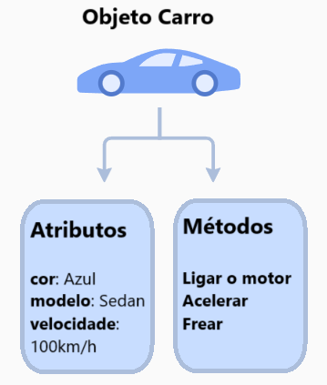
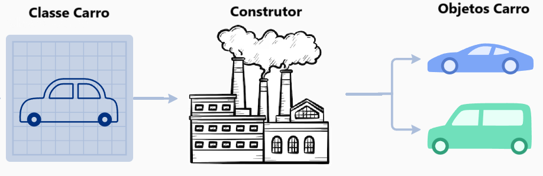
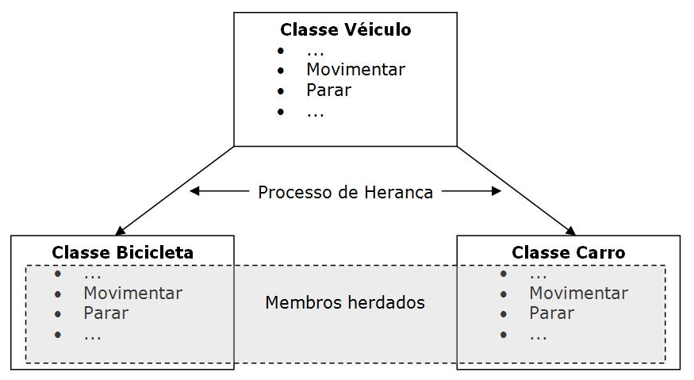

# Programação Orientada a Objetos com Python

> **Observação sobre imagens:** as imagens desta apostila foram extraídas do material original enviado para refatoração. Antes de publicar em um repositório público no GitHub, revise a origem/licença de cada imagem ou substitua por imagens autorais, livres ou devidamente referenciadas.

## Sobre esta apostila

Esta apostila apresenta os principais conceitos de **Programação Orientada a Objetos (POO)** usando Python. O objetivo é explicar o assunto de forma progressiva, prática e didática, sem transformar os exemplos em sistemas grandes demais logo no início.

A ideia central é que você entenda como organizar código usando **classes**, **objetos**, **atributos** e **métodos**, além de aprender conceitos mais avançados como **encapsulamento**, **herança**, **polimorfismo**, **métodos especiais**, **sobrecarga de operadores**, **interfaces**, **dataclasses** e boas práticas de modelagem.

## Como estudar por esta apostila

Leia os capítulos na ordem. Sempre que encontrar um exemplo de código, copie, execute e altere pequenos detalhes para observar o comportamento do programa. POO é um assunto que fica mais claro quando você pratica modelando objetos simples, como carros, contas bancárias, usuários, produtos, pagamentos e mensagens.

Também é importante não decorar os termos. O mais importante é conseguir responder perguntas como: **qual objeto eu estou representando? Quais dados ele guarda? Quais ações ele pode executar? Quem deve ser responsável por cada comportamento?**

## Índice

1. [Capítulo 1 — Como pensar em Programação Orientada a Objetos](#capítulo-1--como-pensar-em-programação-orientada-a-objetos)
2. [Capítulo 2 — Classes, objetos, atributos e métodos](#capítulo-2--classes-objetos-atributos-e-métodos)
3. [Capítulo 3 — Construtores, `self` e atributos de instância](#capítulo-3--construtores-self-e-atributos-de-instância)
4. [Capítulo 4 — Atributos de classe, métodos de classe e métodos estáticos](#capítulo-4--atributos-de-classe-métodos-de-classe-e-métodos-estáticos)
5. [Capítulo 5 — Encapsulamento e controle de acesso](#capítulo-5--encapsulamento-e-controle-de-acesso)
6. [Capítulo 6 — Herança, `super()` e reutilização de código](#capítulo-6--herança-super-e-reutilização-de-código)
7. [Capítulo 7 — Polimorfismo, duck typing e interfaces em Python](#capítulo-7--polimorfismo-duck-typing-e-interfaces-em-python)
8. [Capítulo 8 — Composição e mensagens entre objetos](#capítulo-8--composição-e-mensagens-entre-objetos)
9. [Capítulo 9 — Métodos especiais e sobrecarga de operadores](#capítulo-9--métodos-especiais-e-sobrecarga-de-operadores)
10. [Capítulo 10 — Dataclasses e classes modernas em Python](#capítulo-10--dataclasses-e-classes-modernas-em-python)
11. [Capítulo 11 — Boas práticas de modelagem orientada a objetos](#capítulo-11--boas-práticas-de-modelagem-orientada-a-objetos)
12. [Referências bibliográficas](#referências-bibliográficas)

---

# Capítulo 1 — Como pensar em Programação Orientada a Objetos

A Programação Orientada a Objetos é uma forma de organizar programas aproximando o código da maneira como pensamos sobre entidades do mundo real ou do domínio do sistema. Em vez de escrever apenas uma sequência de funções soltas, agrupamos dados e comportamentos em unidades chamadas **objetos**.

Ao final deste capítulo, você será capaz de:

- entender o que é um paradigma de programação;
- diferenciar programação procedural de programação orientada a objetos;
- perceber por que a POO ajuda na organização de sistemas maiores;
- identificar objetos, atributos e comportamentos em problemas simples.

## 1.1 — O que é um paradigma de programação?

Um **paradigma de programação** é uma forma de pensar e estruturar soluções em código. Ele define o estilo principal usado para organizar instruções, dados e responsabilidades dentro de um programa.

Alguns paradigmas comuns são:

| Paradigma | Ideia principal | Exemplos de uso |
|---|---|---|
| Procedural | O programa é organizado como uma sequência de instruções e funções. | Scripts simples, programas em C, rotinas pequenas. |
| Orientado a objetos | O programa é organizado em objetos que combinam dados e comportamentos. | Sistemas web, APIs, aplicações desktop, jogos. |
| Funcional | O programa é construído com funções, evitando mudança de estado sempre que possível. | Processamento de dados, pipelines, funções puras. |
| Declarativo | O programador descreve o resultado desejado, não todos os passos para chegar nele. | SQL, HTML, consultas de dados. |

Python permite trabalhar com mais de um paradigma. Você pode escrever código procedural, funcional e orientado a objetos na mesma linguagem. Isso é uma vantagem, mas também exige bom senso para escolher a abordagem correta em cada contexto.

## 1.2 — O problema

Imagine que precisamos representar um carro em um sistema. Em uma abordagem procedural, podemos guardar os dados em um dicionário e criar funções separadas para manipular esse dicionário.

```python
carro = {
    "marca": "Ferrari",
    "modelo": "488",
    "cor": "vermelho",
    "velocidade": 0,
}


def acelerar_carro(carro, incremento):
    carro["velocidade"] += incremento
    return f"O {carro['modelo']} está a {carro['velocidade']} km/h."


def frear_carro(carro, decremento):
    carro["velocidade"] -= decremento
    if carro["velocidade"] < 0:
        carro["velocidade"] = 0
    return f"O {carro['modelo']} está a {carro['velocidade']} km/h."


print(acelerar_carro(carro, 30))
print(frear_carro(carro, 10))
```

Esse código funciona. O problema aparece quando o sistema cresce. Sempre precisamos passar o dicionário do carro para cada função. Também fica fácil alterar os dados de forma incorreta, porque qualquer parte do programa pode modificar diretamente `carro["velocidade"]`, mesmo colocando um valor inválido.

## 1.3 — A ideia da POO

Na Programação Orientada a Objetos, colocamos os dados e os comportamentos relacionados no mesmo lugar. O carro passa a ter seus próprios atributos e seus próprios métodos.

```python
class Carro:
    def __init__(self, marca, modelo, cor):
        self.marca = marca
        self.modelo = modelo
        self.cor = cor
        self.velocidade = 0

    def acelerar(self, incremento):
        self.velocidade += incremento
        return f"O {self.modelo} está a {self.velocidade} km/h."

    def frear(self, decremento):
        self.velocidade -= decremento
        if self.velocidade < 0:
            self.velocidade = 0
        return f"O {self.modelo} está a {self.velocidade} km/h."


ferrari = Carro("Ferrari", "488", "vermelho")

print(ferrari.acelerar(30))
print(ferrari.frear(10))
```

Agora a responsabilidade de acelerar e frear está dentro da própria classe `Carro`. O objeto `ferrari` sabe quais dados possui e quais ações pode executar.

## 1.4 — O que aconteceu no código?

A linha `class Carro:` cria uma classe. A classe é o molde que define como um carro será representado no programa.

O método `__init__` é executado automaticamente quando criamos um novo objeto da classe. Dentro dele, usamos `self` para guardar os dados daquele objeto específico.

Os métodos `acelerar` e `frear` representam comportamentos do carro. Eles alteram o estado interno do objeto, principalmente o atributo `velocidade`.

## 1.5 — Quando usar POO?

A POO é útil quando o problema possui entidades com dados e comportamentos próprios. Alguns exemplos comuns são:

- um `Usuario` que possui nome, email e métodos para autenticação;
- uma `ContaBancaria` que possui saldo e métodos para sacar e depositar;
- um `Pedido` que possui itens, status e regras de cálculo;
- um `Pagamento` que pode ser processado de formas diferentes;
- uma `Mensagem` que possui remetente, destinatário e conteúdo.

A POO não é obrigatória para todo problema. Para scripts pequenos, funções simples podem ser suficientes. O objetivo é usar objetos quando eles deixam o código mais claro, organizado e fácil de evoluir.

## 1.6 — Um pouco mais: abstração

A **abstração** é a habilidade de representar apenas o que importa para o problema atual, escondendo detalhes desnecessários.


Se estamos criando um sistema simples de aluguel de carros, talvez seja suficiente representar `marca`, `modelo`, `placa` e `disponivel`. Não precisamos modelar o funcionamento interno do motor, da bateria ou da injeção eletrônica.

Em outro sistema, como um simulador mecânico, os detalhes do motor podem ser importantes. A abstração depende do contexto.

## 1.7 — Resumo do capítulo

Neste capítulo, vimos que a POO organiza o código em objetos. Um objeto combina dados e comportamentos. Essa organização ajuda principalmente quando o sistema cresce, porque aproxima o código das entidades do domínio e concentra responsabilidades em lugares mais claros.

## 1.8 — Exercícios

1. Explique, com suas palavras, a diferença entre programação procedural e programação orientada a objetos.
2. Cite três objetos que poderiam existir em um sistema de e-commerce.
3. Para cada objeto citado, liste dois atributos e dois métodos possíveis.
4. Reescreva o exemplo do carro adicionando um método `descrever()`.

---

# Capítulo 2 — Classes, objetos, atributos e métodos

Classes e objetos são a base da Programação Orientada a Objetos. A classe define um molde. O objeto é uma entidade concreta criada a partir desse molde.

Ao final deste capítulo, você será capaz de:

- explicar a diferença entre classe e objeto;
- criar classes simples em Python;
- instanciar objetos;
- definir atributos e métodos;
- entender estado, comportamento e identidade.

## 2.1 — O problema

Quando modelamos um sistema, precisamos transformar conceitos em estruturas de código. Por exemplo, se estamos criando um sistema para uma concessionária, provavelmente teremos carros. Cada carro possui dados próprios, como marca e modelo, e comportamentos, como acelerar e frear.

A pergunta principal é: **onde esses dados e comportamentos devem ficar?**

Na POO, eles ficam dentro de uma classe.

## 2.2 — O que é uma classe?

Uma **classe** é um molde para criar objetos. Ela define quais atributos e métodos os objetos daquele tipo terão.


Em Python, criamos uma classe usando a palavra-chave `class`.

```python
class Carro:
    pass
```

Esse é o menor exemplo possível de uma classe. A palavra `pass` indica que o bloco está vazio por enquanto.

Por convenção, nomes de classes em Python usam o estilo **CapWords**, também chamado de **PascalCase**. Exemplos: `Carro`, `ContaBancaria`, `PedidoOnline`, `UsuarioAdministrador`.

## 2.3 — O que é um objeto?

Um **objeto** é uma instância concreta de uma classe. Se a classe é o projeto, o objeto é algo criado a partir desse projeto.

```python
class Carro:
    pass


carro_azul = Carro()
carro_vermelho = Carro()

print(carro_azul)
print(carro_vermelho)
```

Mesmo que ambos tenham sido criados a partir da mesma classe, `carro_azul` e `carro_vermelho` são objetos diferentes. Cada objeto tem sua própria identidade em memória.

## 2.4 — Estado, comportamento e identidade

Um objeto pode ser entendido por três ideias principais:

| Conceito | Significado | Exemplo em um carro |
|---|---|---|
| Estado | Os dados guardados pelo objeto. | cor, modelo, velocidade. |
| Comportamento | As ações que o objeto pode executar. | acelerar, frear, ligar. |
| Identidade | O fato de cada objeto ser único. | dois carros iguais ainda são objetos diferentes. |



## 2.5 — Atributos

**Atributos** são informações armazenadas no objeto. Eles representam o estado do objeto.

```python
class Carro:
    pass


carro = Carro()
carro.marca = "Toyota"
carro.modelo = "Corolla"
carro.cor = "preto"

print(carro.marca)
print(carro.modelo)
print(carro.cor)
```

Esse exemplo funciona, mas não é a forma mais organizada. O ideal é inicializar os atributos dentro do construtor `__init__`, que veremos no próximo capítulo.

## 2.6 — Métodos

**Métodos** são funções definidas dentro de uma classe. Eles representam comportamentos dos objetos.

```python
class Carro:
    def buzinar(self):
        return "Bip bip!"


carro = Carro()
print(carro.buzinar())
```

O parâmetro `self` representa o próprio objeto que está chamando o método. Quando executamos `carro.buzinar()`, o Python passa o objeto `carro` automaticamente para o parâmetro `self`.

## 2.7 — O que pode dar errado?

Um erro comum é esquecer o `self` na definição do método.

```python
class Carro:
    def buzinar():
        return "Bip bip!"


carro = Carro()
print(carro.buzinar())
```

Esse código gera erro porque, ao chamar `carro.buzinar()`, o Python tenta passar o objeto como primeiro argumento, mas o método não espera nenhum parâmetro.

A versão correta é:

```python
class Carro:
    def buzinar(self):
        return "Bip bip!"
```

## 2.8 — Resumo do capítulo

Classes são moldes. Objetos são instâncias criadas a partir desses moldes. Atributos guardam dados. Métodos definem comportamentos. O `self` permite que um método acesse o próprio objeto.

## 2.9 — Exercícios

1. Crie uma classe `Pessoa`.
2. Crie dois objetos a partir dessa classe.
3. Adicione os atributos `nome` e `idade` em cada objeto.
4. Crie um método `apresentar()` que retorne uma frase com o nome da pessoa.

---

# Capítulo 3 — Construtores, `self` e atributos de instância

Em Python, o método `__init__` é usado para inicializar os dados de um objeto no momento em que ele é criado.

Ao final deste capítulo, você será capaz de:

- entender para que serve o método `__init__`;
- diferenciar parâmetro de atributo;
- entender o papel do `self`;
- criar objetos já inicializados com dados próprios.

## 3.1 — O problema

No capítulo anterior, criamos um objeto vazio e adicionamos atributos depois. Isso pode gerar objetos incompletos ou inconsistentes.

```python
class Carro:
    pass


carro = Carro()
carro.marca = "Toyota"
```

Se esquecermos de definir `modelo` ou `cor`, o objeto ainda existirá, mas estará incompleto para o nosso sistema.

## 3.2 — O método `__init__`

O método `__init__` é chamado automaticamente quando uma nova instância da classe é criada. Ele é usado para configurar o estado inicial do objeto.



```python
class Carro:
    def __init__(self, marca, modelo, cor):
        self.marca = marca
        self.modelo = modelo
        self.cor = cor
        self.velocidade = 0
```

Nesse exemplo, os parâmetros `marca`, `modelo` e `cor` recebem os valores enviados no momento da criação do objeto. Já `self.marca`, `self.modelo` e `self.cor` são atributos do objeto.

## 3.3 — Criando objetos com `__init__`

```python
class Carro:
    def __init__(self, marca, modelo, cor):
        self.marca = marca
        self.modelo = modelo
        self.cor = cor
        self.velocidade = 0


carro1 = Carro("Toyota", "Corolla", "vermelho")
carro2 = Carro("Ford", "Mustang", "azul")

print(carro1.modelo)
print(carro2.modelo)
```

Cada objeto possui seus próprios atributos. Alterar o estado de `carro1` não altera o estado de `carro2`.

## 3.4 — Entendendo `self`

O `self` é uma referência ao próprio objeto. Ele permite acessar e modificar atributos e métodos daquele objeto específico.

```python
class Carro:
    def __init__(self, modelo):
        self.modelo = modelo
        self.velocidade = 0

    def acelerar(self):
        self.velocidade += 10
        return f"{self.modelo} acelerou para {self.velocidade} km/h."


carro = Carro("Corolla")
print(carro.acelerar())
print(carro.acelerar())
```

Na primeira chamada, a velocidade vai para `10`. Na segunda, vai para `20`. Isso acontece porque o objeto mantém seu estado entre as chamadas.

## 3.5 — Métodos com retorno

Métodos podem apenas executar uma ação ou podem retornar valores.

```python
class Carro:
    def __init__(self, modelo, velocidade=0):
        self.modelo = modelo
        self.velocidade = velocidade

    def esta_parado(self):
        return self.velocidade == 0


carro = Carro("Civic")
print(carro.esta_parado())
```

O método `esta_parado()` retorna `True` ou `False`. Isso permite que outras partes do programa tomem decisões com base no estado do objeto.

## 3.6 — O que pode dar errado?

Um erro comum é confundir parâmetro com atributo.

```python
class Carro:
    def __init__(self, modelo):
        modelo = modelo
```

Esse código não cria um atributo no objeto. Ele apenas atribui a variável local `modelo` a ela mesma.

A forma correta é:

```python
class Carro:
    def __init__(self, modelo):
        self.modelo = modelo
```

Sempre que você quiser guardar uma informação no objeto, use `self.nome_do_atributo`.

## 3.7 — Resumo do capítulo

O `__init__` inicializa o objeto. O `self` representa o próprio objeto. Atributos de instância pertencem a cada objeto individualmente. Métodos podem acessar e modificar esses atributos usando `self`.

## 3.8 — Exercícios

1. Crie uma classe `Produto` com os atributos `nome`, `preco` e `quantidade`.
2. Adicione um método `valor_total_em_estoque()` que retorne `preco * quantidade`.
3. Crie dois produtos diferentes e imprima o valor total de cada um.

---

# Capítulo 4 — Atributos de classe, métodos de classe e métodos estáticos

Nem todo dado pertence a um objeto específico. Algumas informações fazem sentido para a classe inteira. Python permite trabalhar com atributos de instância, atributos de classe, métodos de instância, métodos de classe e métodos estáticos.

Ao final deste capítulo, você será capaz de:

- diferenciar atributo de instância e atributo de classe;
- usar `@classmethod` quando o método depende da classe;
- usar `@staticmethod` quando o método não depende nem da instância nem da classe;
- escolher o tipo de método mais adequado.

## 4.1 — Atributos de instância

Atributos de instância são definidos normalmente dentro do `__init__` usando `self`. Cada objeto tem sua própria cópia.

```python
class Carro:
    def __init__(self, modelo, cor):
        self.modelo = modelo
        self.cor = cor


carro1 = Carro("Corolla", "preto")
carro2 = Carro("Civic", "branco")

carro1.cor = "vermelho"

print(carro1.cor)
print(carro2.cor)
```

Alterar `carro1.cor` não muda `carro2.cor`, porque `cor` é um atributo individual de cada objeto.

## 4.2 — Atributos de classe

Atributos de classe são definidos diretamente dentro da classe, fora dos métodos. Eles são compartilhados por todas as instâncias.

```python
class Carro:
    rodas = 4

    def __init__(self, modelo):
        self.modelo = modelo


carro1 = Carro("Corolla")
carro2 = Carro("Civic")

print(Carro.rodas)
print(carro1.rodas)
print(carro2.rodas)
```

Nesse caso, `rodas` representa uma característica comum para todos os carros da classe.

## 4.3 — Cuidado com atributos de classe mutáveis

Um erro comum é usar uma lista como atributo de classe quando, na verdade, cada objeto deveria ter sua própria lista.

```python
class Usuario:
    mensagens = []

    def __init__(self, nome):
        self.nome = nome

    def receber_mensagem(self, texto):
        self.mensagens.append(texto)


alice = Usuario("Alice")
bob = Usuario("Bob")

alice.receber_mensagem("Olá, Alice")

print(bob.mensagens)
```

O problema é que `mensagens` está sendo compartilhada entre todos os usuários.

A forma correta é criar a lista dentro do `__init__`:

```python
class Usuario:
    def __init__(self, nome):
        self.nome = nome
        self.mensagens = []

    def receber_mensagem(self, texto):
        self.mensagens.append(texto)
```

## 4.4 — Métodos de instância

Métodos de instância são os métodos mais comuns. Eles recebem `self` e trabalham com os dados de um objeto específico.

```python
class Produto:
    def __init__(self, nome, preco):
        self.nome = nome
        self.preco = preco

    def aplicar_desconto(self, percentual):
        self.preco -= self.preco * percentual / 100
```

Use método de instância quando o comportamento depende dos atributos do objeto.

## 4.5 — Métodos de classe

Métodos de classe recebem `cls`, que representa a própria classe. Eles são definidos com `@classmethod`.

```python
class Carro:
    total_carros = 0

    def __init__(self, modelo):
        self.modelo = modelo
        Carro.total_carros += 1

    @classmethod
    def contar_carros(cls):
        return cls.total_carros


Carro("Corolla")
Carro("Civic")

print(Carro.contar_carros())
```

Métodos de classe são úteis quando a operação está relacionada à classe como um todo, e não a um objeto específico.

## 4.6 — Métodos estáticos

Métodos estáticos não recebem `self` nem `cls`. Eles funcionam como funções comuns, mas ficam agrupados dentro da classe por fazerem sentido naquele contexto.

```python
class ValidadorCPF:
    @staticmethod
    def remover_mascara(cpf):
        return cpf.replace(".", "").replace("-", "")


print(ValidadorCPF.remover_mascara("123.456.789-00"))
```

Use `@staticmethod` quando a função pertence conceitualmente à classe, mas não precisa acessar nem o objeto nem a classe.

## 4.7 — Resumo do capítulo

Atributos de instância pertencem a objetos individuais. Atributos de classe pertencem à classe e são compartilhados. Métodos de instância usam `self`. Métodos de classe usam `cls`. Métodos estáticos não usam nenhum dos dois.

## 4.8 — Exercícios

1. Crie uma classe `Pedido` com um atributo de classe `total_pedidos`.
2. A cada novo pedido criado, incremente esse contador.
3. Crie um método de classe `obter_total()`.
4. Crie um método estático que valide se um valor é positivo.

---

# Capítulo 5 — Encapsulamento e controle de acesso

Encapsulamento é o princípio de proteger o estado interno de um objeto e expor uma interface pública controlada para interagir com ele.

Ao final deste capítulo, você será capaz de:

- entender o que é encapsulamento;
- diferenciar atributos públicos, protegidos e privados por convenção;
- usar métodos para proteger regras de negócio;
- entender `property` como alternativa mais idiomática a getters e setters simples.

## 5.1 — O problema

Imagine uma conta bancária em que qualquer parte do programa pode alterar o saldo diretamente.

```python
class ContaBancaria:
    def __init__(self, titular, saldo):
        self.titular = titular
        self.saldo = saldo


conta = ContaBancaria("Maria", 1000)
conta.saldo = -999999
```

O código acima permite colocar um saldo inválido sem passar por nenhuma regra. Em sistemas reais, isso é perigoso, porque valores sensíveis precisam ser modificados de forma controlada.

## 5.2 — O que é encapsulamento?

Encapsular significa esconder os detalhes internos e disponibilizar apenas formas seguras de interação.


A ideia não é esconder por esconder. A ideia é proteger o objeto contra estados inválidos.

## 5.3 — Público, protegido e privado em Python

Python não usa modificadores rígidos como `public`, `private` e `protected` da mesma forma que Java ou C++. Em Python, o controle de acesso é baseado principalmente em convenções.

| Convenção | Exemplo | Significado prático |
|---|---|---|
| Público | `nome` | Pode ser acessado normalmente. |
| Protegido por convenção | `_saldo` | Não deveria ser acessado diretamente fora da classe ou subclasses. |
| Privado com name mangling | `__saldo` | O Python altera internamente o nome para dificultar acesso acidental. |

## 5.4 — Exemplo com conta bancária

```python
class ContaBancaria:
    def __init__(self, titular, saldo_inicial=0):
        self.titular = titular
        self.__saldo = saldo_inicial

    def depositar(self, valor):
        if valor <= 0:
            return "Valor de depósito inválido."

        self.__saldo += valor
        return f"Depósito de R${valor:.2f} realizado com sucesso."

    def sacar(self, valor):
        if valor <= 0:
            return "Valor de saque inválido."

        if valor > self.__saldo:
            return "Saldo insuficiente."

        self.__saldo -= valor
        return f"Saque de R${valor:.2f} realizado com sucesso."

    def consultar_saldo(self):
        return f"Saldo atual: R${self.__saldo:.2f}"


conta_maria = ContaBancaria("Maria Silva", 1000)

print(conta_maria.depositar(500))
print(conta_maria.sacar(300))
print(conta_maria.consultar_saldo())
```

Nesse exemplo, o saldo não deve ser alterado diretamente. Ele só muda por meio dos métodos `depositar` e `sacar`, que aplicam validações.

## 5.5 — Usando `property`

Em Python, muitas vezes é mais idiomático usar `property` quando queremos expor um atributo com controle de leitura e escrita.

```python
class Produto:
    def __init__(self, nome, preco):
        self.nome = nome
        self.preco = preco

    @property
    def preco(self):
        return self._preco

    @preco.setter
    def preco(self, valor):
        if valor <= 0:
            raise ValueError("O preço deve ser maior que zero.")
        self._preco = valor


produto = Produto("Teclado", 150)
print(produto.preco)

produto.preco = 180
print(produto.preco)
```

Por fora, parece que estamos acessando `produto.preco` diretamente. Por dentro, o Python chama os métodos definidos pela propriedade.

## 5.6 — O que pode dar errado?

Um erro comum é pensar que `__saldo` torna o atributo absolutamente inacessível. Na prática, Python aplica **name mangling**, mudando o nome interno do atributo. Isso reduz acesso acidental, mas não é uma barreira de segurança absoluta.

Por isso, encapsulamento em Python deve ser entendido como design e disciplina de uso, não como mecanismo de segurança criptográfica.

## 5.7 — Resumo do capítulo

Encapsulamento protege o estado interno do objeto. Em Python, usamos convenções de nomenclatura, métodos públicos e `property` para controlar o acesso a dados sensíveis. O objetivo é evitar estados inválidos e concentrar regras de negócio no lugar correto.

## 5.8 — Exercícios

1. Crie uma classe `ContaBancaria` com saldo protegido.
2. Impeça depósitos negativos.
3. Impeça saques maiores que o saldo.
4. Crie uma classe `Produto` usando `property` para impedir preço menor ou igual a zero.

---

# Capítulo 6 — Herança, `super()` e reutilização de código

Herança permite criar uma classe a partir de outra. A classe filha herda atributos e métodos da classe pai e pode adicionar ou sobrescrever comportamentos.

Ao final deste capítulo, você será capaz de:

- entender o que é herança;
- criar subclasses em Python;
- usar `super()` para reaproveitar inicialização da classe pai;
- diferenciar herança de composição;
- evitar herança desnecessária.

## 6.1 — O problema

Imagine um sistema com vários tipos de usuários: clientes, administradores e moderadores. Todos possuem nome de usuário e email. Todos podem fazer login. Mas cada tipo também tem comportamentos específicos.

Sem herança, poderíamos repetir os mesmos atributos em todas as classes. Isso aumentaria duplicação e dificultaria manutenção.

## 6.2 — O que é herança?

Herança cria uma relação do tipo **é um**. Por exemplo:

- um `Administrador` é um `Usuario`;
- um `Cliente` é um `Usuario`;
- um `Carro` é um `Veiculo`.



## 6.3 — Classe base

```python
class Usuario:
    def __init__(self, username, email):
        self.username = username
        self.email = email

    def fazer_login(self):
        return f"{self.username} fez login com sucesso."

    def visualizar_perfil(self):
        return f"Perfil de {self.username}."
```

A classe `Usuario` contém o que é comum a todos os usuários.

## 6.4 — Subclasses

```python
class Administrador(Usuario):
    def __init__(self, username, email, nivel_acesso):
        super().__init__(username, email)
        self.nivel_acesso = nivel_acesso

    def gerenciar_usuarios(self):
        return f"{self.username} está gerenciando usuários."


class Cliente(Usuario):
    def __init__(self, username, email, saldo):
        super().__init__(username, email)
        self.saldo = saldo

    def fazer_compra(self, valor):
        if valor > self.saldo:
            return "Saldo insuficiente."

        self.saldo -= valor
        return f"{self.username} realizou uma compra de R${valor:.2f}."
```

O `super().__init__(username, email)` chama o construtor da classe pai. Assim, evitamos reescrever a lógica de inicialização de `username` e `email`.

## 6.5 — Usando as classes

```python
admin = Administrador("admin_user", "admin@example.com", nivel_acesso=5)
cliente = Cliente("cliente_user", "cliente@example.com", saldo=100.0)

print(admin.fazer_login())
print(admin.gerenciar_usuarios())

print(cliente.fazer_login())
print(cliente.fazer_compra(50))
```

O administrador e o cliente herdam o método `fazer_login()`, mas cada um também possui comportamentos específicos.

## 6.6 — Sobrescrita de métodos

Uma subclasse pode sobrescrever um método herdado para alterar seu comportamento.

```python
class Usuario:
    def tipo(self):
        return "Usuário comum"


class Administrador(Usuario):
    def tipo(self):
        return "Administrador"


usuario = Usuario()
admin = Administrador()

print(usuario.tipo())
print(admin.tipo())
```

A classe `Administrador` redefine o método `tipo()`. Isso permite especializar comportamentos.

## 6.7 — O que pode dar errado?

Um erro comum é usar herança apenas para reaproveitar código, mesmo quando não existe uma relação clara de tipo.

Pergunte sempre: **a classe filha realmente é um tipo da classe pai?**

Se a resposta for não, talvez a melhor opção seja composição, que veremos mais adiante.

## 6.8 — Resumo do capítulo

Herança permite reutilizar e especializar comportamentos. Use `super()` para chamar métodos da classe pai. A herança é adequada quando existe uma relação natural de tipo, como `Cliente` ser um tipo de `Usuario`.

## 6.9 — Exercícios

1. Crie uma classe `Funcionario` com `nome` e `salario`.
2. Crie uma classe `Gerente` que herda de `Funcionario` e possui o atributo `bonus`.
3. Crie um método `calcular_pagamento()` em ambas as classes.
4. Use `super()` no construtor da classe filha.

---

# Capítulo 7 — Polimorfismo, duck typing e interfaces em Python

Polimorfismo permite que objetos diferentes sejam usados pela mesma interface. Em vez de perguntar qual é a classe exata de um objeto, o código apenas chama o método esperado.

Ao final deste capítulo, você será capaz de:

- entender o que é polimorfismo;
- aplicar duck typing em Python;
- criar contratos usando classes abstratas;
- entender quando usar `Protocol`.

## 7.1 — O problema

Imagine um e-commerce que aceita pagamento por cartão de crédito, PayPal e criptomoeda. Cada forma de pagamento funciona de um jeito, mas o fluxo da compra deveria ser o mesmo: processar o pagamento.

## 7.2 — Polimorfismo na prática

```python
class PagamentoCartaoCredito:
    def processar_pagamento(self, valor):
        return f"Processando R${valor:.2f} com cartão de crédito."


class PagamentoPayPal:
    def processar_pagamento(self, valor):
        return f"Processando R${valor:.2f} via PayPal."


class PagamentoCripto:
    def processar_pagamento(self, valor):
        return f"Processando R${valor:.2f} com criptomoedas."


def finalizar_compra(metodo_pagamento, valor):
    return metodo_pagamento.processar_pagamento(valor)


print(finalizar_compra(PagamentoCartaoCredito(), 150))
print(finalizar_compra(PagamentoPayPal(), 200))
print(finalizar_compra(PagamentoCripto(), 300))
```

A função `finalizar_compra()` não precisa saber a classe exata do pagamento. Ela só espera que o objeto tenha o método `processar_pagamento()`.

## 7.3 — Duck typing

Python usa muito a ideia de **duck typing**: se um objeto se comporta como o esperado, ele pode ser usado naquele contexto.

Em vez de exigir que todos os pagamentos herdem de uma mesma classe, Python permite trabalhar com objetos que simplesmente implementam o método esperado.

## 7.4 — Interface com classe abstrata

Quando queremos deixar o contrato explícito, podemos usar o módulo `abc`.

```python
from abc import ABC, abstractmethod


class Pagamento(ABC):
    @abstractmethod
    def processar_pagamento(self, valor):
        pass


class PagamentoCartaoCredito(Pagamento):
    def processar_pagamento(self, valor):
        return f"Processando R${valor:.2f} com cartão de crédito."
```

Uma classe abstrata define métodos que as subclasses devem implementar. Isso ajuda a evitar que uma classe incompleta seja usada por engano.

## 7.5 — Interface com `Protocol`

O `Protocol` é útil quando queremos descrever o comportamento esperado de um objeto sem exigir herança direta.

```python
from typing import Protocol


class MetodoPagamento(Protocol):
    def processar_pagamento(self, valor: float) -> str:
        ...


def finalizar_compra(metodo_pagamento: MetodoPagamento, valor: float) -> str:
    return metodo_pagamento.processar_pagamento(valor)
```

Com `Protocol`, o foco está na estrutura do objeto. Se ele possui o método esperado com assinatura compatível, ele atende ao contrato.

## 7.6 — O que pode dar errado?

Um erro comum é criar uma classe base abstrata para tudo. Isso pode deixar o código mais complexo do que precisa.

Use uma classe abstrata quando você realmente quer impor um contrato em uma hierarquia. Use duck typing ou `Protocol` quando o importante é apenas o comportamento esperado.

## 7.7 — Resumo do capítulo

Polimorfismo permite escrever código flexível. Em Python, objetos podem ser usados pela interface que oferecem, não apenas pela classe que herdam. Classes abstratas e protocolos ajudam a tornar contratos mais explícitos quando necessário.

## 7.8 — Exercícios

1. Crie três classes de notificação: `Email`, `SMS` e `PushNotification`.
2. Todas devem implementar um método `enviar(mensagem)`.
3. Crie uma função `notificar(canal, mensagem)` que funcione com qualquer uma dessas classes.
4. Refaça o exercício usando `Protocol`.

---

# Capítulo 8 — Composição e mensagens entre objetos

Objetos raramente trabalham sozinhos. Em sistemas reais, eles colaboram entre si. Essa colaboração acontece por meio de chamadas de métodos, que podem ser entendidas como mensagens enviadas de um objeto para outro.

Ao final deste capítulo, você será capaz de:

- entender mensagens entre objetos;
- diferenciar herança de composição;
- criar objetos que colaboram entre si;
- reduzir acoplamento entre classes.

## 8.1 — Mensagens entre objetos

Na POO, quando um objeto chama um método de outro objeto, dizemos que ele está enviando uma mensagem.

```python
class Mensagem:
    def __init__(self, remetente, destinatario, conteudo):
        self.remetente = remetente
        self.destinatario = destinatario
        self.conteudo = conteudo
        self.status = "Enviada"


class Usuario:
    def __init__(self, username):
        self.username = username
        self.contatos = []
        self.mensagens_recebidas = []

    def adicionar_contato(self, contato):
        self.contatos.append(contato)
        return f"{contato.username} adicionado aos contatos de {self.username}."

    def enviar_mensagem(self, destinatario, conteudo):
        mensagem = Mensagem(self, destinatario, conteudo)
        destinatario.receber_mensagem(mensagem)
        return f"{self.username} enviou uma mensagem para {destinatario.username}."

    def receber_mensagem(self, mensagem):
        self.mensagens_recebidas.append(mensagem)
        print(f"Nova mensagem para {self.username}: {mensagem.conteudo}")


alice = Usuario("Alice")
bob = Usuario("Bob")

alice.adicionar_contato(bob)
bob.adicionar_contato(alice)

alice.enviar_mensagem(bob, "Olá, Bob! Como vai?")
bob.enviar_mensagem(alice, "Oi, Alice! Tudo bem, e você?")
```

O objeto `alice` cria uma mensagem e chama o método `receber_mensagem()` do objeto `bob`. Esse é um exemplo simples de colaboração entre objetos.

## 8.2 — Composição

Composição é quando uma classe usa outra classe como parte de sua estrutura. A relação costuma ser do tipo **tem um**.

Exemplo:

- um `Carro` tem um `Motor`;
- um `Pedido` tem vários `ItensPedido`;
- um `Usuario` tem uma lista de `Mensagem`;
- uma `NotaFiscal` tem um `Cliente`.

## 8.3 — Exemplo com motor e carro

```python
class Motor:
    def ligar(self):
        return "Motor ligado."


class Carro:
    def __init__(self, modelo, motor):
        self.modelo = modelo
        self.motor = motor

    def ligar(self):
        return f"{self.modelo}: {self.motor.ligar()}"


motor = Motor()
carro = Carro("Corolla", motor)

print(carro.ligar())
```

Nesse caso, `Carro` não herda de `Motor`. Um carro não é um motor. Um carro tem um motor. Por isso, composição faz mais sentido que herança.

## 8.4 — Herança vs. composição

| Pergunta | Melhor escolha provável |
|---|---|
| A classe filha é um tipo da classe pai? | Herança. |
| A classe apenas usa outra classe como parte interna? | Composição. |
| Quero reaproveitar comportamento sem criar hierarquia rígida? | Composição. |
| Quero representar especializações de um mesmo tipo? | Herança. |

## 8.5 — O que pode dar errado?

Um erro comum é criar heranças artificiais. Por exemplo, `Carro(Motor)` seria estranho, porque um carro não é um motor. Isso aumenta acoplamento e deixa o modelo menos intuitivo.

Prefira composição quando a relação correta for **tem um**.

## 8.6 — Resumo do capítulo

Objetos colaboram chamando métodos uns dos outros. Composição permite montar objetos a partir de outros objetos. Ela costuma produzir modelos mais flexíveis do que heranças desnecessárias.

## 8.7 — Exercícios

1. Crie uma classe `Endereco`.
2. Crie uma classe `Cliente` que recebe um `Endereco` no construtor.
3. Crie uma classe `Pedido` que recebe um `Cliente`.
4. Crie um método no pedido que retorne o nome do cliente e a cidade de entrega.

---

# Capítulo 9 — Métodos especiais e sobrecarga de operadores

Python permite que objetos personalizados se integrem a comportamentos nativos da linguagem. Isso é feito com métodos especiais, também chamados de **dunder methods**, porque começam e terminam com dois underscores.

Ao final deste capítulo, você será capaz de:

- entender o que são métodos especiais;
- implementar `__str__` e `__repr__`;
- permitir `len(objeto)`, acesso por índice e iteração;
- sobrecarregar operadores como `+` e `-`.

## 9.1 — O que são métodos especiais?

Métodos especiais são métodos chamados automaticamente pelo Python em determinadas situações.

| Método | Quando é usado |
|---|---|
| `__init__` | Ao criar um objeto. |
| `__str__` | Ao converter para string legível ou usar `print()`. |
| `__repr__` | Ao gerar representação técnica do objeto. |
| `__len__` | Ao usar `len(objeto)`. |
| `__getitem__` | Ao usar `objeto[indice]`. |
| `__iter__` | Ao iterar com `for`. |
| `__add__` | Ao usar `objeto1 + objeto2`. |
| `__sub__` | Ao usar `objeto1 - objeto2`. |

## 9.2 — `__str__` e `__repr__`

```python
class Pessoa:
    def __init__(self, nome, idade):
        self.nome = nome
        self.idade = idade

    def __str__(self):
        return f"{self.nome}, {self.idade} anos"

    def __repr__(self):
        return f"Pessoa(nome={self.nome!r}, idade={self.idade!r})"


pessoa = Pessoa("João", 30)

print(pessoa)
print(repr(pessoa))
```

O `__str__` deve ser amigável para pessoas. O `__repr__` deve ser mais útil para depuração.

## 9.3 — `__len__`

```python
class GrupoPessoas:
    def __init__(self, pessoas):
        self.pessoas = pessoas

    def __len__(self):
        return len(self.pessoas)


grupo = GrupoPessoas(["João", "Maria", "Ana"])
print(len(grupo))
```

Ao implementar `__len__`, o objeto passa a funcionar com a função `len()`.

## 9.4 — `__getitem__`

```python
class MinhaLista:
    def __init__(self, elementos):
        self.elementos = elementos

    def __getitem__(self, indice):
        return self.elementos[indice]


lista = MinhaLista([10, 20, 30])
print(lista[0])
```

O método `__getitem__` permite acessar elementos usando colchetes.

## 9.5 — Objetos iteráveis

```python
class Contador:
    def __init__(self, limite):
        self.limite = limite
        self.atual = 0

    def __iter__(self):
        return self

    def __next__(self):
        if self.atual >= self.limite:
            raise StopIteration

        numero = self.atual
        self.atual += 1
        return numero


contador = Contador(5)

for numero in contador:
    print(numero)
```

O `__iter__` retorna um iterador. O `__next__` retorna o próximo valor ou levanta `StopIteration` quando não houver mais elementos.

## 9.6 — Sobrecarga de operadores

Sobrecarga de operadores permite definir como operadores como `+`, `-`, `*` e `/` funcionam para objetos personalizados.

```python
class Tempo:
    def __init__(self, horas, minutos):
        total_minutos = horas * 60 + minutos
        self.horas = total_minutos // 60
        self.minutos = total_minutos % 60

    def __add__(self, outro):
        total_horas = self.horas + outro.horas
        total_minutos = self.minutos + outro.minutos
        return Tempo(total_horas, total_minutos)

    def __sub__(self, outro):
        minutos_self = self.horas * 60 + self.minutos
        minutos_outro = outro.horas * 60 + outro.minutos
        diferenca = minutos_self - minutos_outro
        return Tempo(0, diferenca)

    def __str__(self):
        return f"{self.horas}h {self.minutos}min"


tempo1 = Tempo(2, 45)
tempo2 = Tempo(1, 30)

print(tempo1 + tempo2)
print(tempo1 - tempo2)
```

Com `__add__`, podemos usar `tempo1 + tempo2`. Com `__sub__`, podemos usar `tempo1 - tempo2`.

## 9.7 — O que pode dar errado?

Sobrecarga de operadores deve deixar o código mais intuitivo, não mais confuso. Só sobrecarregue operadores quando o significado for natural.

Por exemplo, somar dois objetos `Tempo` faz sentido. Mas somar dois objetos `Usuario` provavelmente não tem significado claro.

## 9.8 — Resumo do capítulo

Métodos especiais permitem integrar classes personalizadas com recursos nativos do Python. Eles tornam objetos mais expressivos, mas devem ser usados com cuidado para preservar a clareza do código.

## 9.9 — Exercícios

1. Crie uma classe `CarrinhoCompras` que implemente `__len__`.
2. Crie uma classe `Produto` com `__str__` e `__repr__`.
3. Crie uma classe `Dinheiro` que permita somar dois valores usando `+`.
4. Crie uma classe `Playlist` que permita acessar músicas por índice usando `[]`.

---

# Capítulo 10 — Dataclasses e classes modernas em Python

Em muitos casos, criamos classes principalmente para armazenar dados. Para esses cenários, Python oferece o módulo `dataclasses`, que reduz código repetitivo.

Ao final deste capítulo, você será capaz de:

- entender quando usar `dataclass`;
- criar classes de dados com menos código;
- perceber a diferença entre uma classe comum e uma dataclass;
- usar valores padrão.

## 10.1 — O problema

Uma classe simples de produto pode exigir vários métodos repetitivos.

```python
class Produto:
    def __init__(self, nome, preco, quantidade):
        self.nome = nome
        self.preco = preco
        self.quantidade = quantidade

    def __repr__(self):
        return (
            f"Produto(nome={self.nome!r}, "
            f"preco={self.preco!r}, "
            f"quantidade={self.quantidade!r})"
        )
```

Esse código é correto, mas parte dele é boilerplate, isto é, código repetitivo necessário apenas para configurar a classe.

## 10.2 — Usando `dataclass`

```python
from dataclasses import dataclass


@dataclass
class Produto:
    nome: str
    preco: float
    quantidade: int = 0

    def valor_total(self):
        return self.preco * self.quantidade


produto = Produto("Teclado", 150.0, 2)

print(produto)
print(produto.valor_total())
```

A `dataclass` gera automaticamente métodos como `__init__` e `__repr__`, usando as anotações de tipo da classe.

## 10.3 — Quando usar dataclasses?

Use `dataclass` quando a classe representa principalmente dados, como:

- `Produto`;
- `Endereco`;
- `ItemPedido`;
- `Coordenada`;
- `Configuracao`;
- `Evento`.

Evite transformar tudo em `dataclass`. Quando a classe possui muitas regras de negócio complexas, uma classe comum pode ser mais explícita.

## 10.4 — Dataclass imutável

Você pode criar uma dataclass congelada usando `frozen=True`.

```python
from dataclasses import dataclass


@dataclass(frozen=True)
class Coordenada:
    x: int
    y: int


ponto = Coordenada(10, 20)
print(ponto)
```

Com `frozen=True`, os atributos não devem ser alterados depois da criação do objeto. Isso é útil para representar valores que não deveriam mudar.

## 10.5 — O que pode dar errado?

Um erro comum é usar valores mutáveis como padrão de forma inadequada.

Em dataclasses, para listas e dicionários, use `field(default_factory=...)`.

```python
from dataclasses import dataclass, field


@dataclass
class Usuario:
    nome: str
    mensagens: list[str] = field(default_factory=list)
```

Assim, cada usuário recebe sua própria lista de mensagens.

## 10.6 — Resumo do capítulo

Dataclasses reduzem código repetitivo em classes centradas em dados. Elas são úteis para representar objetos simples, mas não substituem o entendimento de classes, métodos, encapsulamento e responsabilidades.

## 10.7 — Exercícios

1. Crie uma dataclass `Endereco` com rua, cidade e estado.
2. Crie uma dataclass `Produto` com nome, preço e quantidade.
3. Adicione um método `valor_total()` em `Produto`.
4. Crie uma dataclass `Usuario` com uma lista de mensagens usando `field(default_factory=list)`.

---

# Capítulo 11 — Boas práticas de modelagem orientada a objetos

Aprender a sintaxe de classes é apenas o começo. O desafio real é criar classes que façam sentido, sejam fáceis de manter e tenham responsabilidades claras.

Ao final deste capítulo, você será capaz de:

- entender coesão e acoplamento;
- criar classes com responsabilidade clara;
- aplicar nomes mais legíveis;
- evitar armadilhas comuns de POO em Python.

## 11.1 — Coesão

**Coesão** mede o quanto os elementos de uma classe pertencem ao mesmo assunto. Uma classe coesa faz uma coisa principal e agrupa dados e métodos relacionados.

Uma classe `ContaBancaria` com métodos `depositar`, `sacar` e `consultar_saldo` é coesa. Mas se ela também enviar email, gerar PDF, validar CPF e acessar diretamente o banco de dados, provavelmente está assumindo responsabilidades demais.

## 11.2 — Acoplamento

**Acoplamento** mede o quanto uma parte do código depende de outra. Baixo acoplamento é desejável porque facilita testar, substituir e modificar componentes.

Exemplo com alto acoplamento:

```python
class Pedido:
    def finalizar(self):
        print("Enviando email diretamente...")
```

Uma alternativa mais flexível é receber um serviço de notificação:

```python
class Pedido:
    def __init__(self, notificador):
        self.notificador = notificador

    def finalizar(self):
        self.notificador.enviar("Pedido finalizado")
```

Agora `Pedido` não precisa saber exatamente como a notificação é enviada. Pode ser email, SMS, push ou qualquer outro canal que implemente o método `enviar`.

## 11.3 — Responsabilidade única

Uma classe deve ter uma responsabilidade principal bem definida. Isso não significa que ela só pode ter um método. Significa que seus métodos devem estar relacionados ao mesmo conceito.

Perguntas úteis:

- Esta classe representa qual conceito?
- Quais dados pertencem naturalmente a esse conceito?
- Quais comportamentos são responsabilidade desse objeto?
- Algum método parece pertencer a outro objeto?

## 11.4 — Nomes em Python

Boas convenções tornam o código mais legível.

| Elemento | Convenção | Exemplo |
|---|---|---|
| Classe | `CapWords` | `ContaBancaria` |
| Função ou método | `snake_case` | `calcular_total()` |
| Variável | `snake_case` | `valor_total` |
| Constante | `UPPER_CASE` | `TAXA_PADRAO` |
| Atributo interno por convenção | `_snake_case` | `_saldo` |

## 11.5 — Evite classes desnecessárias

Nem todo código precisa virar classe. Se você tem uma função pura, simples e sem estado, talvez uma função seja suficiente.

Exemplo:

```python
def calcular_desconto(valor, percentual):
    return valor - (valor * percentual / 100)
```

Criar uma classe só para encapsular essa função pode ser exagero, a menos que exista um contexto maior que justifique.

## 11.6 — Prefira objetos com comportamento

Um erro comum é criar classes que só guardam dados e deixar toda a lógica espalhada em funções externas.

Em vez de:

```python
class Pedido:
    def __init__(self, itens):
        self.itens = itens


def calcular_total(pedido):
    return sum(item["preco"] for item in pedido.itens)
```

Podemos aproximar o comportamento do objeto:

```python
class Pedido:
    def __init__(self, itens):
        self.itens = itens

    def calcular_total(self):
        return sum(item["preco"] for item in self.itens)
```

Agora o próprio pedido sabe calcular seu total.

## 11.7 — O que pode dar errado?

Alguns problemas comuns em POO:

- criar classes grandes demais;
- usar herança sem necessidade;
- acessar atributos internos de outros objetos diretamente;
- criar atributos de classe mutáveis por acidente;
- usar métodos estáticos para tudo;
- transformar funções simples em classes sem motivo;
- misturar regra de negócio, banco de dados, interface e infraestrutura na mesma classe.

## 11.8 — Resumo do capítulo

Boa POO não é apenas usar `class`. Boa POO é distribuir responsabilidades de forma clara, reduzir duplicação, proteger estados inválidos e criar objetos que fazem sentido no domínio do problema.

## 11.9 — Exercícios finais

1. Crie uma classe `Motor` com o método `ligar()`.
2. Crie uma classe `Carro` que recebe um `Motor` no construtor.
3. Crie uma classe `ContaBancaria` com encapsulamento de saldo.
4. Crie três classes de pagamento e aplique polimorfismo.
5. Crie uma classe `Tempo` com sobrecarga do operador `+`.
6. Refatore uma classe grande em duas classes menores com responsabilidades mais claras.

## 11.10 — Desafios

1. Modele um sistema simples de biblioteca com `Livro`, `Usuario` e `Emprestimo`.
2. Modele um carrinho de compras com `Produto`, `ItemCarrinho` e `Carrinho`.
3. Crie uma interface de notificação usando `Protocol`.
4. Use `dataclass` para objetos que representam apenas dados.
5. Escreva testes simples para validar os métodos principais das suas classes.

---

# Referências bibliográficas

- PYTHON SOFTWARE FOUNDATION. **9. Classes — Python 3 documentation**. Disponível em: <https://docs.python.org/3/tutorial/classes.html>. Acesso em: 31 maio 2026.
- PYTHON SOFTWARE FOUNDATION. **Data model — Python 3 documentation**. Disponível em: <https://docs.python.org/3/reference/datamodel.html>. Acesso em: 31 maio 2026.
- PYTHON SOFTWARE FOUNDATION. **Built-in Functions — Python 3 documentation**. Disponível em: <https://docs.python.org/3/library/functions.html>. Acesso em: 31 maio 2026.
- PYTHON SOFTWARE FOUNDATION. **abc — Abstract Base Classes**. Disponível em: <https://docs.python.org/3/library/abc.html>. Acesso em: 31 maio 2026.
- PYTHON SOFTWARE FOUNDATION. **typing — Support for type hints**. Disponível em: <https://docs.python.org/3/library/typing.html>. Acesso em: 31 maio 2026.
- PYTHON SOFTWARE FOUNDATION. **dataclasses — Data Classes**. Disponível em: <https://docs.python.org/3/library/dataclasses.html>. Acesso em: 31 maio 2026.
- VAN ROSSUM, Guido; WARSAW, Barry; COGHLAN, Nick. **PEP 8 — Style Guide for Python Code**. Disponível em: <https://peps.python.org/pep-0008/>. Acesso em: 31 maio 2026.
