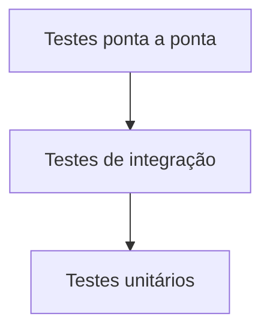
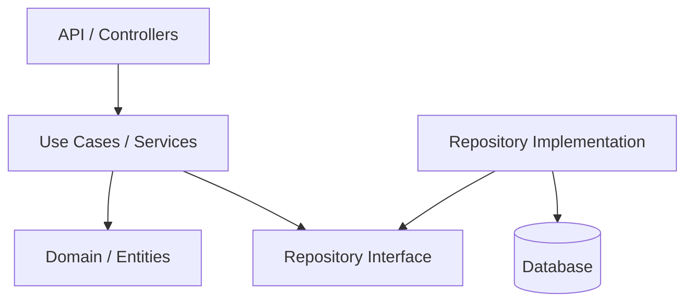
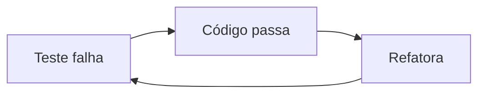

# Python Testes — Apostila Profissional de Testes Automatizados com Pytest, Mocks, Cobertura e Qualidade de Código

## Sobre esta apostila

Esta apostila transforma o material original de **Python Testes** em um guia de estudo mais completo, didático e profissional sobre testes automatizados em Python. O foco principal é mostrar como escrever testes úteis para projetos reais de backend, usando `pytest`, `pytest-cov`, `fixtures`, `conftest.py`, `mocks`, parametrização, testes de integração, análise estática com Pylint e automação básica em CI.

O objetivo não é apenas decorar comandos. O objetivo é entender **por que os testes existem**, **qual problema cada tipo de teste resolve**, **como organizar uma suíte de testes em projetos Python** e **como evitar testes frágeis que passam no computador do desenvolvedor, mas quebram em pipeline ou produção**.

Este material é indicado para desenvolvedores iniciantes e intermediários que já sabem programar em Python e querem ganhar segurança para trabalhar em APIs, microsserviços, serviços de domínio, integrações com banco de dados e pipelines de qualidade.

Ao longo da apostila, vamos usar exemplos pequenos e médios, sempre explicados logo abaixo do código. O domínio recorrente será uma API simples de pedidos, usuários e cupons, porque esse contexto aparece com frequência em sistemas backend.

## Como estudar por esta apostila

Estude os capítulos em ordem. A apostila começa com a base conceitual de testes e avança até assuntos mais próximos de projetos profissionais, como cobertura, mocks, testes de integração, `conftest.py`, Pylint e CI.

Sempre que aparecer um bloco de código, tente copiá-lo para um projeto local e executá-lo. Testes são aprendidos com prática: ler ajuda, mas escrever testes, quebrá-los e corrigir os erros é o que realmente fixa o conhecimento.

Ao final de cada capítulo, revise o resumo, responda às perguntas de fixação e faça os exercícios. Nos capítulos mais práticos, tente adaptar os exemplos para um projeto seu: uma API FastAPI, um script de automação, uma camada de serviço, um repositório de banco ou uma função de regra de negócio.

## Índice

1. [Capítulo 1 — Fundamentos de testes de software](#capítulo-1--fundamentos-de-testes-de-software)
2. [Capítulo 2 — Preparando um projeto Python testável](#capítulo-2--preparando-um-projeto-python-testável)
3. [Capítulo 3 — Primeiros testes com pytest](#capítulo-3--primeiros-testes-com-pytest)
4. [Capítulo 4 — Asserções, exceções e organização de testes](#capítulo-4--asserções-exceções-e-organização-de-testes)
5. [Capítulo 5 — Testes parametrizados com pytest](#capítulo-5--testes-parametrizados-com-pytest)
6. [Capítulo 6 — Fixtures e conftest.py](#capítulo-6--fixtures-e-conftestpy)
7. [Capítulo 7 — Mocks, stubs, fakes e isolamento de dependências](#capítulo-7--mocks-stubs-fakes-e-isolamento-de-dependências)
8. [Capítulo 8 — Testes de cobertura com pytest-cov](#capítulo-8--testes-de-cobertura-com-pytest-cov)
9. [Capítulo 9 — Configuração centralizada com pytest.ini e pyproject.toml](#capítulo-9--configuração-centralizada-com-pytestini-e-pyprojecttoml)
10. [Capítulo 10 — Testes de integração em APIs e serviços backend](#capítulo-10--testes-de-integração-em-apis-e-serviços-backend)
11. [Capítulo 11 — Pylint, PEP 8 e qualidade automatizada](#capítulo-11--pylint-pep-8-e-qualidade-automatizada)
12. [Capítulo 12 — Estratégia profissional de testes em projetos backend](#capítulo-12--estratégia-profissional-de-testes-em-projetos-backend)
13. [Cheat Sheet](#cheat-sheet)
14. [Projeto prático guiado](#projeto-prático-guiado)
15. [Referências bibliográficas](#referências-bibliográficas)

# Capítulo 1 — Fundamentos de testes de software

Testes de software são processos usados para verificar se uma aplicação se comporta conforme o esperado. Eles ajudam a encontrar bugs antes que o usuário final seja afetado, aumentam a confiança em mudanças futuras e reduzem o risco de regressões.

Em projetos backend, testes aparecem em praticamente todos os pontos importantes: validação de regras de negócio, serialização de dados, autenticação, cálculo de preços, integração com banco de dados, chamadas HTTP, filas, mensageria, cache e endpoints de API.

Ao final deste capítulo, você será capaz de:

* explicar por que testes automatizados são importantes;
* diferenciar teste unitário, integração, regressão e aceitação;
* entender a ideia de pirâmide de testes;
* reconhecer quando um teste é útil e quando ele é frágil;
* relacionar testes com manutenção de sistemas backend.

## 1.1 — O problema

Imagine que você trabalha em uma API de pedidos. O sistema já possui cálculo de subtotal, aplicação de cupom, frete, status do pedido e envio de confirmação por e-mail. Um dia, você altera a regra de desconto para resolver um bug simples. A alteração parece pequena, mas depois do deploy os usuários começam a receber descontos errados em outro tipo de pedido.

Esse tipo de problema é comum quando o projeto não tem testes automatizados. O desenvolvedor modifica uma parte do código sem conseguir verificar rapidamente se outras partes continuam funcionando. A revisão manual até ajuda, mas não escala quando o sistema cresce.

Testes automatizados resolvem justamente esse problema: eles funcionam como uma rede de segurança. Sempre que você altera o código, executa a suíte de testes para verificar se o comportamento esperado continua válido.

## 1.2 — O que são testes automatizados?

Testes automatizados são códigos escritos para validar outros códigos. Em vez de abrir a aplicação manualmente, preencher telas, chamar endpoints na mão ou inspecionar o banco de dados manualmente, você escreve funções de teste que verificam entradas, saídas e comportamentos esperados.

Um teste automatizado geralmente segue três etapas:

1. **Arrange**: prepara os dados e o ambiente.
2. **Act**: executa a ação que será testada.
3. **Assert**: verifica se o resultado é o esperado.

Esse padrão também é conhecido como **AAA**. Ele não é uma regra obrigatória da linguagem, mas ajuda a deixar o teste legível e fácil de manter.

## 1.3 — Tipos de teste

### Teste unitário

O teste unitário verifica uma unidade pequena e isolada do código, como uma função, método, classe de domínio ou serviço específico. Ele deve ser rápido, determinístico e independente de recursos externos.

Um teste unitário de backend pode validar, por exemplo, se uma função calcula corretamente o desconto de um pedido.

### Teste de integração

O teste de integração verifica se duas ou mais partes do sistema funcionam corretamente juntas. Ele pode envolver banco de dados, API, repositórios, filas, cache ou outro serviço.

Um teste de integração pode verificar se um endpoint cria um pedido e salva os dados corretamente em um banco de teste.

### Teste de regressão

O teste de regressão garante que uma alteração nova não quebrou funcionalidades que já existiam. Na prática, boa parte da suíte automatizada acaba funcionando como proteção contra regressão.

Quando você corrige um bug, é comum escrever um teste que reproduz o problema antigo. Assim, se o bug voltar no futuro, o teste falha.

### Teste de aceitação

O teste de aceitação valida se o sistema atende a uma expectativa de negócio ou de usuário. Pode ser feito manualmente, automatizado em nível de API ou automatizado de ponta a ponta.

Em backend, testes de aceitação podem validar fluxos completos, como: criar usuário, autenticar, criar pedido, aplicar cupom e confirmar pagamento.

## 1.4 — A pirâmide de testes

A pirâmide de testes é uma forma simples de pensar na distribuição ideal dos testes em um projeto.



Na base ficam muitos testes unitários, porque eles são rápidos e baratos. No meio ficam testes de integração, que são mais realistas, porém mais lentos. No topo ficam poucos testes ponta a ponta, porque costumam ser mais caros, mais frágeis e dependentes de muitos componentes.

A ideia não é seguir números exatos, mas manter equilíbrio. Um backend com poucos testes unitários e muitos testes lentos de integração pode ficar difícil de manter. Por outro lado, um backend com apenas testes unitários pode não capturar problemas reais de integração entre API, banco e serviços externos.

## 1.5 — Exemplo simples

Código de produção:

```python
# app/services/coupons.py

def calcular_desconto_black_friday(valor: float) -> float:
    if valor < 0:
        raise ValueError("O valor não pode ser negativo")

    if valor >= 300:
        return valor * 0.20

    return 0.0
```

Teste:

```python
# tests/services/test_coupons.py

from app.services.coupons import calcular_desconto_black_friday


def test_deve_aplicar_desconto_black_friday_para_valor_acima_do_minimo():
    desconto = calcular_desconto_black_friday(500.0)

    assert desconto == 100.0
```

## 1.6 — O que aconteceu no exemplo?

A função `calcular_desconto_black_friday` possui uma regra simples: pedidos a partir de R$ 300,00 recebem 20% de desconto. O teste chama a função com o valor `500.0` e verifica se o desconto retornado é `100.0`.

Esse teste é unitário porque valida apenas uma regra isolada. Ele não depende de banco de dados, API externa, arquivo, rede ou framework web. Por isso, ele tende a ser rápido e fácil de executar várias vezes durante o desenvolvimento.

## 1.7 — Quando usar isso?

Use testes unitários para regras de negócio puras, validações, cálculos, serializadores, parsers, formatadores, casos de uso e serviços que podem ser testados sem infraestrutura externa.

Use testes de integração quando a confiança depende da comunicação entre partes: endpoint + camada de serviço, repositório + banco, fila + consumidor, API externa + client HTTP.

Use testes de regressão sempre que corrigir um bug. O teste deve falhar antes da correção e passar depois da correção.

## 1.8 — O que pode dar errado?

Um erro comum é escrever testes que apenas repetem a implementação. Por exemplo, se a função faz `valor * 0.20`, e o teste calcula `valor * 0.20` para comparar, você não está validando a regra de negócio de forma clara; está duplicando a lógica.

Outro erro é testar detalhes internos demais. Se o teste depende do nome de uma variável privada ou da ordem exata de chamadas internas sem necessidade, qualquer refatoração simples quebra o teste, mesmo que o comportamento do sistema continue correto.

Também é comum exagerar em mocks. Quando tudo é mockado, o teste passa, mas não prova que o sistema real funciona. Mocks são úteis, mas devem ser usados para isolar dependências externas ou comportamentos caros, não para fingir que todo o sistema existe.

## 1.9 — Boas práticas

Escreva testes com nomes descritivos. Um bom nome comunica o cenário, a ação e o resultado esperado.

Prefira testar comportamento observável. O teste deve responder: “dado esse cenário, quando eu faço essa ação, então esse resultado acontece”.

Mantenha testes pequenos, mas não obscuros. Um teste curto demais, cheio de abstrações escondidas, pode ser tão difícil de entender quanto um teste gigante.

Evite dependência entre testes. Um teste não deve depender da execução de outro. A suíte deve funcionar mesmo quando os testes rodam em ordem aleatória.

## 1.10 — Um pouco mais

Em projetos profissionais, testes não são apenas uma preocupação técnica. Eles são uma forma de documentação viva. Um teste bem escrito mostra como uma função deve ser usada, quais entradas são válidas, quais erros são esperados e quais comportamentos são importantes para o negócio.

Por isso, escrever testes é também uma forma de entender melhor o sistema. Quando uma classe é difícil de testar, muitas vezes isso revela problemas de design: acoplamento alto, responsabilidades misturadas, dependências externas espalhadas ou regras de negócio presas em controllers.

## 1.11 — Resumo do capítulo

Testes automatizados ajudam a validar comportamento, reduzir regressões e aumentar a confiança em mudanças. Testes unitários são rápidos e isolados. Testes de integração validam colaboração entre partes. Testes de regressão protegem funcionalidades existentes. Testes de aceitação validam expectativas de negócio.

## 1.12 — Exercícios

1. Escreva uma função que calcula o preço final de um produto com imposto e crie testes unitários para três cenários.
2. Crie um teste que valide se uma função lança `ValueError` ao receber valor negativo.
3. Pegue uma função de um projeto seu e escreva um teste usando o padrão Arrange, Act e Assert.

## 1.13 — Desafios

1. Crie uma pequena regra de cupom com três tipos de desconto e escreva testes para todos os cenários.
2. Corrija um bug proposital em uma função e escreva primeiro um teste que reproduza esse bug.
3. Explique, em um README, quais testes do seu projeto são unitários e quais são de integração.

## 1.14 — Fixando o conhecimento

1. Qual a diferença entre teste unitário e teste de integração?
2. Por que testes de regressão são importantes?
3. O que significa testar comportamento observável?
4. Por que testes muito acoplados à implementação são ruins?

# Capítulo 2 — Preparando um projeto Python testável

Antes de escrever testes, é importante organizar o projeto de forma que o código seja fácil de importar, executar e isolar. Muitos problemas de iniciantes com pytest não vêm do pytest em si, mas de projetos mal estruturados, importações frágeis e regras de negócio misturadas com detalhes de infraestrutura.

Ao final deste capítulo, você será capaz de:

* organizar uma estrutura básica de projeto Python;
* separar código de produção e código de teste;
* evitar gambiarras com `sys.path` quando possível;
* entender por que regras de negócio devem ficar fora dos controllers;
* preparar um projeto backend para testes unitários e de integração.

## 2.1 — O problema

Um problema comum em projetos Python é criar arquivos soltos na raiz e depois tentar importar módulos usando ajustes manuais de `sys.path`. Isso pode até funcionar localmente, mas tende a quebrar em CI, em Docker, em outro computador ou quando o projeto cresce.

Outro problema é colocar toda a lógica dentro de rotas, controllers ou scripts. Quando a regra de negócio está presa em uma função de endpoint, testá-la exige subir aplicação, criar request, simular usuário, mockar banco e lidar com o framework. O teste fica mais complexo do que deveria.

## 2.2 — Estrutura recomendada

Uma estrutura simples para projetos backend em Python pode ser assim:

```text
python-testes-api/
├── app/
│   ├── __init__.py
│   ├── main.py
│   ├── domain/
│   │   ├── __init__.py
│   │   ├── entities.py
│   │   └── exceptions.py
│   ├── services/
│   │   ├── __init__.py
│   │   ├── coupons.py
│   │   └── users.py
│   ├── repositories/
│   │   ├── __init__.py
│   │   └── users_repository.py
│   └── api/
│       ├── __init__.py
│       └── routes.py
├── tests/
│   ├── __init__.py
│   ├── unit/
│   │   └── test_coupons.py
│   ├── integration/
│   │   └── test_users_api.py
│   └── conftest.py
├── pyproject.toml
├── pytest.ini
└── README.md
```

Essa organização separa o código da aplicação (`app/`) dos testes (`tests/`). Também separa domínio, serviços, repositórios e API. Não é a única estrutura possível, mas é uma base suficiente para estudar testes de forma profissional.

## 2.3 — Como funciona na prática?

A ideia principal é que regras importantes fiquem em módulos fáceis de importar. Por exemplo, se a regra de desconto está em `app/services/coupons.py`, ela pode ser testada diretamente sem subir a API.

Controllers e rotas devem ser finos. Eles recebem entrada HTTP, chamam casos de uso ou serviços e retornam resposta. Quanto menos regra de negócio houver no controller, mais fácil será testar o sistema.

## 2.4 — Exemplo simples

Código de domínio:

```python
# app/domain/entities.py

from dataclasses import dataclass


@dataclass(frozen=True)
class User:
    email: str
    name: str
    address: str | None = None
    role: str = "customer"
```

Serializador:

```python
# app/services/users.py

from app.domain.entities import User


def serialize_user(user: User) -> dict[str, str | None]:
    return {
        "email": user.email,
        "name": user.name,
        "address": user.address,
        "role": user.role,
    }
```

Teste:

```python
# tests/unit/test_users.py

from app.domain.entities import User
from app.services.users import serialize_user


def test_serialize_user_deve_retornar_dados_do_usuario():
    user = User(
        email="teste@exemplo.com",
        name="Teste Usuário",
        address="Rua Exemplo, 123",
        role="admin",
    )

    result = serialize_user(user)

    assert result == {
        "email": "teste@exemplo.com",
        "name": "Teste Usuário",
        "address": "Rua Exemplo, 123",
        "role": "admin",
    }
```

## 2.5 — O que aconteceu no exemplo?

A entidade `User` representa os dados do usuário. A função `serialize_user` transforma o objeto em um dicionário. O teste cria um usuário, chama o serializador e compara o resultado com o dicionário esperado.

Esse exemplo é parecido com o caso de serialização do material original, mas foi reorganizado para evitar manipulação manual de `sys.path` e para deixar o domínio mais claro.

## 2.6 — Quando usar isso?

Use uma estrutura parecida quando estiver criando APIs, serviços internos, workers, integrações ou scripts que vão crescer com o tempo. Separar responsabilidades desde cedo ajuda a testar melhor e evita que o projeto vire um conjunto de arquivos difíceis de importar.

## 2.7 — O que pode dar errado?

### Problema: manipular `sys.path` em todo teste

```python
import os
import sys

sys.path.append(os.path.dirname(os.path.dirname(os.path.abspath(__file__))))
```

Esse padrão aparece muito em projetos iniciais. Ele funciona em alguns casos, mas indica que o projeto talvez não esteja organizado como pacote Python.

### Melhor alternativa

Organize o código em um pacote (`app/`) com `__init__.py` e execute os testes a partir da raiz do projeto:

```bash
python -m pytest
```

Também é comum configurar o projeto em `pyproject.toml`, principalmente quando se usa ferramentas modernas como `uv`, Poetry ou pip com modo editável.

## 2.8 — Boas práticas

Mantenha código de produção e testes separados. Não coloque teste dentro da pasta de produção sem necessidade.

Crie nomes previsíveis: arquivos de teste começando com `test_` e funções de teste também começando com `test_`. O pytest usa essas convenções para descobrir testes automaticamente.

Evite regras de negócio dentro de endpoints. Extraia regras para serviços, casos de uso ou funções puras sempre que possível.

Use dados explícitos nos testes. Teste bom não obriga o leitor a procurar em cinco arquivos para entender o cenário.

## 2.9 — Um pouco mais

Em projetos maiores, é comum usar uma arquitetura com camadas:



Essa separação ajuda nos testes porque a regra de negócio pode depender de abstrações e receber implementações falsas, mocks ou repositórios em memória durante os testes.

## 2.10 — Resumo do capítulo

Projetos testáveis têm estrutura clara, importações previsíveis e responsabilidades separadas. Quanto mais isolada estiver a regra de negócio, mais simples será testá-la. Evite depender de `sys.path` manual em todos os testes e prefira organizar seu código como pacote Python.

## 2.11 — Exercícios

1. Crie uma estrutura `app/` e `tests/` para um projeto novo.
2. Escreva uma entidade `Product` usando `dataclass`.
3. Crie uma função `serialize_product` e um teste unitário para ela.

## 2.12 — Desafios

1. Pegue uma função que está dentro de um endpoint e extraia para um serviço testável.
2. Configure seu projeto para rodar testes com `python -m pytest` sem alterar `sys.path` manualmente.
3. Separe testes unitários e de integração em pastas diferentes.

## 2.13 — Fixando o conhecimento

1. Por que manipular `sys.path` em testes pode ser um problema?
2. Qual a vantagem de separar API, serviço e domínio?
3. Por que controllers com muita regra de negócio são difíceis de testar?

# Capítulo 3 — Primeiros testes com pytest

O pytest é um dos frameworks de teste mais usados no ecossistema Python. Ele permite escrever testes simples usando `assert`, possui excelente descoberta automática de testes, suporta fixtures, parametrização, plugins e integração com ferramentas de cobertura.

Ao final deste capítulo, você será capaz de:

* instalar e executar pytest;
* escrever testes simples com `assert`;
* entender a convenção de nomes do pytest;
* interpretar uma falha de teste;
* criar testes unitários para funções de backend.

## 3.1 — O problema

Sem um framework de testes, você pode acabar validando comportamento com `print`, testes manuais ou scripts temporários. Isso não escala. Um script manual não gera relatório claro, não integra bem com pipeline e dificilmente vira documentação confiável.

O pytest resolve esse problema fornecendo uma forma simples e padronizada de escrever, descobrir e executar testes.

## 3.2 — O que é pytest?

Pytest é um framework de testes para Python que permite escrever testes pequenos e legíveis, mas também suporta suítes grandes e complexas. Em vez de exigir classes e métodos específicos para tudo, ele permite começar com funções simples e `assert` nativo do Python.

Instalação:

```bash
python -m pip install pytest
```

Executando testes:

```bash
pytest
```

Ou, de forma bastante segura em ambientes com múltiplos interpretadores:

```bash
python -m pytest
```

## 3.3 — Como o pytest encontra testes?

Por padrão, o pytest procura arquivos com nomes como:

```text
test_*.py
*_test.py
```

Dentro desses arquivos, ele procura funções e métodos que começam com `test_`.

Exemplo:

```python
def test_algo_deve_acontecer():
    assert True
```

## 3.4 — Exemplo simples

Código de produção:

```python
# app/services/pricing.py

def calcular_subtotal(precos: list[float]) -> float:
    return sum(precos)
```

Teste:

```python
# tests/unit/test_pricing.py

from app.services.pricing import calcular_subtotal


def test_calcular_subtotal_deve_somar_precos():
    subtotal = calcular_subtotal([10.0, 20.0, 30.0])

    assert subtotal == 60.0
```

Executando:

```bash
pytest tests/unit/test_pricing.py
```

## 3.5 — O que aconteceu no exemplo?

A função `calcular_subtotal` recebe uma lista de preços e retorna a soma. O teste chama essa função com três valores e verifica se o retorno é `60.0`.

O pytest executa a função `test_calcular_subtotal_deve_somar_precos` porque o nome começa com `test_`. Se a asserção for verdadeira, o teste passa. Se for falsa, o teste falha e o pytest mostra uma mensagem detalhada do que era esperado e do que foi recebido.

## 3.6 — Entendendo uma falha

Suponha que o teste esteja assim:

```python
def test_calcular_subtotal_deve_somar_precos():
    subtotal = calcular_subtotal([10.0, 20.0, 30.0])

    assert subtotal == 50.0
```

O pytest mostrará uma falha porque `60.0` não é igual a `50.0`. A mensagem normalmente indica a linha do erro e os valores comparados.

Falhas são parte do processo. Um teste falhando não significa que você fez tudo errado. Significa que existe divergência entre o comportamento esperado e o comportamento real. O próximo passo é descobrir se o erro está no código de produção ou no teste.

## 3.7 — Quando usar isso?

Use pytest para testar funções, classes, serviços, repositórios, endpoints, workers e integrações. Ele é adequado tanto para projetos pequenos quanto para aplicações maiores.

Em backend, o pytest é muito útil para validar regras de negócio que não dependem diretamente do framework web. Quanto mais lógica você extrair para serviços e casos de uso, mais simples será escrever testes com pytest.

## 3.8 — O que pode dar errado?

Um erro comum é escrever testes com nomes genéricos:

```python
def test_1():
    assert calcular_subtotal([10, 20]) == 30
```

Esse teste até funciona, mas o nome não comunica nada. Prefira:

```python
def test_calcular_subtotal_deve_somar_todos_os_precos():
    assert calcular_subtotal([10, 20]) == 30
```

Outro erro é usar muitos `print` no teste. Testes devem validar comportamento com `assert`, não depender de inspeção manual.

## 3.9 — Boas práticas

Use nomes de teste que contem uma pequena história. Uma boa fórmula é:

```text
test_<funcionalidade>_deve_<resultado>_quando_<cenario>
```

Exemplo:

```python
def test_aplicar_cupom_deve_lancar_erro_quando_valor_for_negativo():
    ...
```

Mantenha o teste focado em um comportamento. Se um teste valida muitas coisas ao mesmo tempo, quando ele falhar será mais difícil descobrir a causa.

## 3.10 — Um pouco mais

O pytest possui introspecção avançada de `assert`. Isso significa que, quando uma asserção falha, ele tenta mostrar detalhes úteis sobre a comparação. Por isso, na maioria dos casos você não precisa escrever mensagens manuais em todos os asserts.

Ainda assim, mensagens podem ser úteis em testes parametrizados, onde vários cenários usam a mesma função de teste.

## 3.11 — Resumo do capítulo

Pytest permite escrever testes simples com funções e `assert`. Ele descobre testes por convenção de nomes, executa a suíte e mostra falhas de forma legível. Para começar bem, crie testes pequenos, com nomes claros e foco em comportamento.

## 3.12 — Exercícios

1. Instale o pytest em um ambiente virtual.
2. Crie uma função `multiplicar(a, b)` e teste três cenários.
3. Escreva um teste que falhe de propósito e observe a saída do pytest.

## 3.13 — Desafios

1. Crie uma função `calcular_total_com_frete` e escreva testes para frete grátis e frete pago.
2. Separe seus testes em `tests/unit/`.
3. Execute apenas um arquivo específico de teste usando pytest.

## 3.14 — Fixando o conhecimento

1. Por que o pytest usa a convenção `test_`?
2. Qual a diferença entre `pytest` e `python -m pytest`?
3. O que acontece quando um `assert` falha?

# Capítulo 4 — Asserções, exceções e organização de testes

Depois de escrever os primeiros testes, é importante entender como validar resultados corretamente. Nem todo teste compara apenas igualdade. Às vezes você precisa verificar tipo, conteúdo, exceção, tamanho de lista, chamada de função ou estado final de um objeto.

Ao final deste capítulo, você será capaz de:

* usar asserts de forma expressiva;
* testar exceções com `pytest.raises`;
* organizar testes por comportamento;
* evitar testes frágeis;
* aplicar o padrão Arrange, Act e Assert.

## 4.1 — O problema

Testes ruins podem dar uma falsa sensação de segurança. Um teste que apenas verifica se uma função “não quebrou” é fraco. Um teste que valida detalhes internos demais também é ruim, porque quebra em qualquer refatoração.

O desafio é escrever asserts que validem o comportamento certo no nível certo.

## 4.2 — O que são asserções?

Asserções são verificações feitas dentro do teste. Em pytest, normalmente usamos o `assert` nativo do Python.

Exemplos:

```python
assert total == 100.0
assert user.email == "teste@exemplo.com"
assert "email" in payload
assert len(items) == 3
assert response.status_code == 201
```

A asserção deve refletir uma expectativa clara do comportamento.

## 4.3 — Testando exceções

Quando uma função deve rejeitar uma entrada inválida, o teste precisa validar se a exceção correta é lançada.

Código de produção:

```python
# app/services/coupons.py

def aplicar_desconto(valor: float, percentual: float) -> float:
    if valor < 0:
        raise ValueError("O valor não pode ser negativo")

    if not 0 <= percentual <= 1:
        raise ValueError("O percentual deve estar entre 0 e 1")

    return valor - (valor * percentual)
```

Teste:

```python
# tests/unit/test_coupons.py

import pytest

from app.services.coupons import aplicar_desconto


def test_aplicar_desconto_deve_lancar_erro_quando_valor_for_negativo():
    with pytest.raises(ValueError, match="valor não pode ser negativo"):
        aplicar_desconto(-100.0, 0.10)
```

## 4.4 — O que aconteceu no exemplo?

O bloco `with pytest.raises(ValueError)` informa que a função chamada dentro do bloco deve lançar `ValueError`. O parâmetro `match` verifica se a mensagem da exceção contém o texto esperado.

Isso é importante porque não basta saber que “algum erro” aconteceu. Em código profissional, queremos garantir que o erro é do tipo esperado e comunica o problema correto.

## 4.5 — Organizando com Arrange, Act e Assert

```python
def test_aplicar_desconto_deve_reduzir_valor_conforme_percentual():
    # Arrange
    valor_original = 200.0
    percentual = 0.10

    # Act
    valor_final = aplicar_desconto(valor_original, percentual)

    # Assert
    assert valor_final == 180.0
```

Essa separação deixa o teste mais legível. Em testes muito pequenos, você não precisa escrever os comentários, mas deve manter a organização mental.

## 4.6 — Quando usar isso?

Use asserts específicos sempre que o comportamento esperado for claro. Use `pytest.raises` para entradas inválidas, regras de negócio que rejeitam estados e validações de domínio.

Em backend, exceções são comuns em regras como: usuário não encontrado, cupom expirado, estoque insuficiente, pedido já pago, token inválido ou permissão negada.

## 4.7 — O que pode dar errado?

### Assert genérico demais

```python
assert resultado
```

Esse assert apenas verifica se `resultado` é truthy. Ele não garante conteúdo, tipo nem valor.

Melhor:

```python
assert resultado == {"status": "approved", "total": 180.0}
```

### Testar implementação interna sem necessidade

Evite verificar detalhes internos que não fazem parte do contrato público da função.

```python
assert service._cache == {}
```

Se o cache é detalhe interno, o teste fica frágil. Prefira verificar o resultado observado pelo consumidor da classe.

## 4.8 — Boas práticas

Valide uma regra importante por teste. Evite testes que misturam muitos cenários.

Use dados simples, mas realistas. Valores como `1`, `2` e `3` são úteis em exemplos, mas regras de negócio ficam mais claras com valores do domínio, como `subtotal`, `desconto`, `frete` e `status`.

Teste casos felizes e casos de erro. Um sistema confiável não é aquele que só funciona com entrada perfeita, mas aquele que lida bem com entrada inválida.

## 4.9 — Um pouco mais

Para comparar números de ponto flutuante, cuidado com precisão. Em alguns casos, use `pytest.approx`:

```python
import pytest


def test_calculo_com_float():
    assert 0.1 + 0.2 == pytest.approx(0.3)
```

Isso evita falhas causadas por detalhes de representação de números de ponto flutuante.

## 4.10 — Resumo do capítulo

Asserções validam expectativas do teste. Use asserts claros, teste exceções com `pytest.raises` e organize seus testes com Arrange, Act e Assert. Bons testes verificam comportamento relevante sem depender demais da implementação interna.

## 4.11 — Exercícios

1. Escreva um teste para uma função que lança erro quando o e-mail é inválido.
2. Escreva um teste que usa `pytest.approx` para comparar resultado com casas decimais.
3. Refatore um teste antigo para seguir Arrange, Act e Assert.

## 4.12 — Desafios

1. Crie uma exceção customizada `CupomExpiradoError` e teste seu lançamento.
2. Escreva testes para uma função `validar_status_pedido`.
3. Separe testes de sucesso e erro em funções diferentes.

## 4.13 — Fixando o conhecimento

1. Quando usar `pytest.raises`?
2. Por que `assert resultado` pode ser fraco?
3. O que significa Arrange, Act e Assert?

# Capítulo 5 — Testes parametrizados com pytest

Testes parametrizados permitem executar a mesma lógica de teste com diferentes entradas e saídas esperadas. Isso reduz duplicação, melhora a legibilidade e facilita adicionar novos cenários.

Ao final deste capítulo, você será capaz de:

* usar `pytest.mark.parametrize`;
* substituir testes duplicados por uma tabela de cenários;
* escrever mensagens de falha úteis;
* testar regras de negócio com múltiplas entradas;
* entender quando parametrização ajuda e quando atrapalha.

## 5.1 — O problema

Sem parametrização, é comum criar várias funções de teste quase iguais:

```python
def test_tipo_inteiro():
    assert identificar_tipo(10) == "Inteiro"


def test_tipo_string():
    assert identificar_tipo("texto") == "String"


def test_tipo_booleano():
    assert identificar_tipo(True) == "Booleano"
```

Esses testes funcionam, mas repetem a mesma estrutura. Se houver muitos cenários, o arquivo cresce rápido e fica mais difícil de manter.

## 5.2 — O que é parametrização?

Parametrização é a técnica de executar a mesma função de teste várias vezes, mudando os dados de entrada. No pytest, isso é feito com `@pytest.mark.parametrize`.

## 5.3 — Exemplo simples

Código de produção:

```python
# app/services/types.py

def identificar_tipo(valor: object) -> str:
    if isinstance(valor, bool):
        return "Booleano"
    if isinstance(valor, int):
        return "Inteiro"
    if isinstance(valor, str):
        return "String"
    return "Desconhecido"
```

Teste parametrizado:

```python
# tests/unit/test_types.py

import pytest

from app.services.types import identificar_tipo


@pytest.mark.parametrize(
    "entrada, saida_esperada",
    [
        (10, "Inteiro"),
        ("texto", "String"),
        (True, "Booleano"),
        (10.5, "Desconhecido"),
    ],
)
def test_identificar_tipo_deve_retornar_descricao_correta(entrada, saida_esperada):
    resultado = identificar_tipo(entrada)

    assert resultado == saida_esperada
```

## 5.4 — O que aconteceu no exemplo?

O decorator `@pytest.mark.parametrize` informa ao pytest que a função de teste deve rodar uma vez para cada tupla da lista. Em cada execução, `entrada` e `saida_esperada` recebem valores diferentes.

O teste fica mais compacto, mas continua explícito: os cenários aparecem como uma tabela.

## 5.5 — Parametrizando regra de desconto

```python
# app/services/coupons.py

def calcular_desconto(valor: float, tipo_cupom: str) -> float:
    if tipo_cupom == "BLACK_FRIDAY" and valor >= 300:
        return valor * 0.20
    if tipo_cupom == "NATAL" and valor >= 800:
        return valor * 0.30
    if tipo_cupom == "PRIMEIRA_COMPRA":
        return valor * 0.10
    return 0.0
```

```python
# tests/unit/test_coupons.py

import pytest

from app.services.coupons import calcular_desconto


@pytest.mark.parametrize(
    "valor, tipo_cupom, desconto_esperado",
    [
        (350.0, "BLACK_FRIDAY", 70.0),
        (299.0, "BLACK_FRIDAY", 0.0),
        (1000.0, "NATAL", 300.0),
        (700.0, "NATAL", 0.0),
        (200.0, "PRIMEIRA_COMPRA", 20.0),
        (200.0, "CUPOM_INVALIDO", 0.0),
    ],
)
def test_calcular_desconto_deve_respeitar_regras_do_cupom(
    valor,
    tipo_cupom,
    desconto_esperado,
):
    desconto = calcular_desconto(valor, tipo_cupom)

    assert desconto == desconto_esperado
```

## 5.6 — Quando usar isso?

Use parametrização quando a lógica do teste é a mesma e apenas os dados mudam. É excelente para regras de validação, cálculo, serialização, parsing, formatação e respostas esperadas.

Em backend, parametrização é muito útil para testar status de pedido, regras de desconto, validação de campos, permissões por papel de usuário e códigos de erro.

## 5.7 — O que pode dar errado?

Parametrização pode piorar a legibilidade se os cenários forem complexos demais. Quando cada cenário exige setup muito diferente, talvez seja melhor criar testes separados.

Outro problema é criar tabelas com muitos valores sem nome claro. Se um teste parametrizado falhar, você precisa entender rapidamente qual cenário quebrou.

## 5.8 — IDs nos cenários

Você pode nomear os cenários com `ids`:

```python
@pytest.mark.parametrize(
    "valor, tipo_cupom, desconto_esperado",
    [
        (350.0, "BLACK_FRIDAY", 70.0),
        (299.0, "BLACK_FRIDAY", 0.0),
    ],
    ids=["black_friday_com_desconto", "black_friday_sem_minimo"],
)
def test_calcular_desconto(valor, tipo_cupom, desconto_esperado):
    assert calcular_desconto(valor, tipo_cupom) == desconto_esperado
```

Isso ajuda a saída do pytest a ficar mais legível.

## 5.9 — Boas práticas

Use parametrização para reduzir duplicação real, não para esconder cenários complexos. Mantenha a tabela pequena ou bem organizada.

Dê nomes claros aos parâmetros. `valor`, `tipo_cupom` e `desconto_esperado` comunicam mais do que `a`, `b` e `c`.

Se a tabela ficar grande, considere extrair cenários para constantes com nomes claros.

## 5.10 — Um pouco mais

Parametrização também combina com testes de exceção, mas exige cuidado. Uma abordagem simples é separar casos válidos e inválidos em testes diferentes.

```python
@pytest.mark.parametrize("valor", [-1, -100, -0.01])
def test_aplicar_desconto_deve_rejeitar_valores_negativos(valor):
    with pytest.raises(ValueError):
        aplicar_desconto(valor, 0.10)
```

## 5.11 — Resumo do capítulo

Testes parametrizados executam a mesma função de teste com múltiplos dados. Eles reduzem duplicação, facilitam manutenção e ajudam a representar regras de negócio como tabelas de cenários.

## 5.12 — Exercícios

1. Parametrize testes para uma função `somar(a, b)`.
2. Parametrize testes para validação de e-mail.
3. Use `ids` para nomear cenários de uma regra de desconto.

## 5.13 — Desafios

1. Crie uma função `calcular_frete` com regras por região e escreva testes parametrizados.
2. Separe casos válidos e inválidos em testes parametrizados diferentes.
3. Crie uma tabela de cenários para permissões de usuário.

## 5.14 — Fixando o conhecimento

1. Quando a parametrização é útil?
2. Quando ela pode atrapalhar?
3. Para que servem os `ids` em testes parametrizados?

# Capítulo 6 — Fixtures e conftest.py

Fixtures são um dos recursos mais importantes do pytest. Elas preparam dados, objetos e ambientes necessários para os testes. Com fixtures, você evita repetição de setup e consegue centralizar recursos compartilhados entre vários testes.

Ao final deste capítulo, você será capaz de:

* criar fixtures simples;
* usar `yield` para setup e teardown;
* entender escopos de fixture;
* centralizar fixtures em `conftest.py`;
* usar fixtures em testes de backend.

## 6.1 — O problema

Imagine que vários testes precisam criar o mesmo usuário, o mesmo carrinho ou o mesmo cliente de API. Se você repetir esse setup em todos os testes, o código fica duplicado e difícil de manter.

Fixtures resolvem esse problema permitindo que o pytest injete dependências nos testes pelo nome da função.

## 6.2 — O que é uma fixture?

Uma fixture é uma função marcada com `@pytest.fixture`. O valor retornado por ela pode ser usado em testes que recebem a fixture como argumento.

## 6.3 — Exemplo simples

```python
# tests/unit/test_users.py

import pytest

from app.domain.entities import User
from app.services.users import serialize_user


@pytest.fixture
def usuario_admin():
    return User(
        email="admin@exemplo.com",
        name="Usuário Admin",
        address="Rua Teste, 123",
        role="admin",
    )


def test_serialize_user_deve_retornar_role(usuario_admin):
    result = serialize_user(usuario_admin)

    assert result["role"] == "admin"
```

## 6.4 — O que aconteceu no exemplo?

A função `usuario_admin` é uma fixture. O teste `test_serialize_user_deve_retornar_role` recebe `usuario_admin` como argumento. O pytest percebe esse nome, executa a fixture e injeta o retorno no teste.

Essa abordagem evita repetir a criação do usuário em vários testes.

## 6.5 — Fixtures com teardown

Quando a fixture precisa limpar recursos depois do teste, use `yield`.

Exemplo usando arquivo temporário com `tmp_path`, que é uma fixture nativa do pytest:

```python
import pytest


@pytest.fixture
def arquivo_de_teste(tmp_path):
    caminho = tmp_path / "dados.txt"
    caminho.write_text("Dados de teste", encoding="utf-8")

    yield caminho

    # O tmp_path já é limpo pelo pytest, mas este ponto seria o teardown.


def test_deve_ler_arquivo_de_teste(arquivo_de_teste):
    conteudo = arquivo_de_teste.read_text(encoding="utf-8")

    assert conteudo == "Dados de teste"
```

## 6.6 — Escopos de fixture

Fixtures podem ter escopos diferentes:

| Escopo | Quando a fixture é criada |
|---|---|
| `function` | Uma vez por teste. É o padrão. |
| `class` | Uma vez por classe de testes. |
| `module` | Uma vez por arquivo de teste. |
| `package` | Uma vez por pacote. |
| `session` | Uma vez por execução completa da suíte. |

Use `function` quando o teste precisa de isolamento máximo. Use `session` para recursos caros que podem ser compartilhados, como configuração geral ou cliente externo simulado.

## 6.7 — Centralizando com conftest.py

O arquivo `conftest.py` permite compartilhar fixtures entre vários arquivos de teste sem precisar importar manualmente.

```python
# tests/conftest.py

import pytest

from app.domain.entities import User


@pytest.fixture
def usuario_cliente():
    return User(
        email="cliente@exemplo.com",
        name="Cliente Teste",
        address=None,
        role="customer",
    )
```

Agora qualquer teste dentro de `tests/` pode receber `usuario_cliente` como argumento.

```python
# tests/unit/test_users.py

from app.services.users import serialize_user


def test_usuario_cliente_deve_ser_serializado(usuario_cliente):
    result = serialize_user(usuario_cliente)

    assert result["role"] == "customer"
```

## 6.8 — Fixture para banco de teste

Exemplo didático com repositório em memória:

```python
# tests/conftest.py

import pytest


class InMemoryUserRepository:
    def __init__(self):
        self._users = {}

    def save(self, user):
        self._users[user.email] = user

    def get_by_email(self, email: str):
        return self._users.get(email)


@pytest.fixture
def user_repository():
    return InMemoryUserRepository()
```

Teste:

```python
def test_repositorio_deve_salvar_usuario(user_repository, usuario_cliente):
    user_repository.save(usuario_cliente)

    result = user_repository.get_by_email("cliente@exemplo.com")

    assert result == usuario_cliente
```

Esse tipo de fixture é muito útil para testar serviços sem depender de banco real.

## 6.9 — Quando usar isso?

Use fixtures para criar dados comuns, clientes HTTP de teste, repositórios em memória, configurações, arquivos temporários, banco limpo, usuários autenticados e objetos de domínio.

Em backend, fixtures bem desenhadas economizam muito tempo e reduzem duplicação.

## 6.10 — O que pode dar errado?

Um erro comum é criar fixtures grandes demais. Quando uma fixture prepara muitos dados, o teste fica difícil de entender porque o cenário real está escondido.

Outro erro é usar fixture global para tudo. Se todos os testes dependem de uma fixture enorme em `conftest.py`, pequenas mudanças nessa fixture podem quebrar a suíte inteira.

Também tome cuidado com escopo `session` para dados mutáveis. Se um teste altera um objeto compartilhado, pode afetar outros testes.

## 6.11 — Boas práticas

Crie fixtures pequenas e coesas. Uma fixture deve ter uma responsabilidade clara.

Use nomes descritivos. `usuario_admin`, `pedido_pago` e `client_api` são melhores do que `data`, `obj` ou `setup`.

Prefira fixtures locais quando elas só são usadas em um arquivo. Use `conftest.py` para recursos realmente compartilhados.

## 6.12 — Um pouco mais

O pytest também possui fixtures nativas úteis, como `tmp_path`, `monkeypatch`, `capsys` e `pytestconfig`. Antes de criar uma solução manual, verifique se o pytest já oferece uma fixture para o problema.

## 6.13 — Resumo do capítulo

Fixtures preparam dados e recursos para testes. Elas reduzem duplicação, melhoram organização e permitem setup/teardown. O `conftest.py` centraliza fixtures compartilhadas, mas deve ser usado com equilíbrio.

## 6.14 — Exercícios

1. Crie uma fixture `produto_disponivel`.
2. Crie uma fixture `carrinho_com_produtos`.
3. Use `tmp_path` para testar escrita e leitura de arquivo.

## 6.15 — Desafios

1. Crie um repositório em memória e teste um serviço usando essa fixture.
2. Crie uma fixture que simula usuário autenticado.
3. Separe fixtures locais e globais de forma organizada.

## 6.16 — Fixando o conhecimento

1. O que é uma fixture?
2. Para que serve `yield` em uma fixture?
3. Quando usar `conftest.py`?
4. Qual o risco de fixtures globais grandes demais?

# Capítulo 7 — Mocks, stubs, fakes e isolamento de dependências

Mocks são usados para isolar o código testado de dependências externas, como banco de dados, APIs, sistema de arquivos, e-mail, filas e serviços de terceiros. Eles permitem testar uma unidade de código sem depender de recursos lentos, instáveis ou caros.

Ao final deste capítulo, você será capaz de:

* entender a diferença entre mock, stub e fake;
* usar `unittest.mock.patch` e `MagicMock`;
* testar chamadas para dependências externas;
* evitar mocks exagerados;
* saber onde aplicar patch corretamente.

## 7.1 — O problema

Imagine que uma função envia e-mail de confirmação após criar um pedido. Se o teste enviar e-mail real, ele fica lento, caro e perigoso. Além disso, pode falhar por problemas de rede ou credenciais, mesmo que sua regra de negócio esteja correta.

Mocks resolvem esse problema substituindo a dependência real por uma simulação controlada.

## 7.2 — Mock, stub e fake

### Stub

Um stub retorna dados predefinidos. Ele não se preocupa muito em verificar como foi chamado.

### Mock

Um mock também simula comportamento, mas normalmente permite verificar interações: se foi chamado, quantas vezes, com quais argumentos.

### Fake

Um fake é uma implementação simplificada, mas funcional. Um repositório em memória usado em testes é um exemplo de fake.

## 7.3 — Exemplo simples com MagicMock

Código de produção:

```python
# app/services/notifications.py

class EmailSender:
    def send(self, to: str, subject: str, body: str) -> None:
        # Em produção, aqui haveria integração com provedor real.
        print(f"Enviando e-mail para {to}: {subject}")


class OrderConfirmationService:
    def __init__(self, email_sender: EmailSender):
        self._email_sender = email_sender

    def confirm_order(self, user_email: str, order_id: str) -> None:
        self._email_sender.send(
            to=user_email,
            subject="Pedido confirmado",
            body=f"Seu pedido {order_id} foi confirmado.",
        )
```

Teste:

```python
# tests/unit/test_notifications.py

from unittest.mock import MagicMock

from app.services.notifications import OrderConfirmationService


def test_confirm_order_deve_enviar_email_de_confirmacao():
    email_sender = MagicMock()
    service = OrderConfirmationService(email_sender=email_sender)

    service.confirm_order("cliente@exemplo.com", "PED-123")

    email_sender.send.assert_called_once_with(
        to="cliente@exemplo.com",
        subject="Pedido confirmado",
        body="Seu pedido PED-123 foi confirmado.",
    )
```

## 7.4 — O que aconteceu no exemplo?

O teste não envia e-mail real. Ele cria um `MagicMock` e injeta no serviço. Depois chama `confirm_order` e verifica se o método `send` foi chamado exatamente uma vez com os argumentos esperados.

Esse teste valida uma interação importante: confirmar o pedido deve disparar um e-mail de confirmação.

## 7.5 — Usando patch

`patch` substitui temporariamente um objeto durante o teste.

Código de produção:

```python
# app/repositories/database.py

class MongoClient:
    def __init__(self, uri: str):
        self.uri = uri

    def get_database(self, name: str):
        return {"database": name}


client = MongoClient("mongodb://localhost:27017")


def get_db():
    return client.get_database("app_test")
```

Teste:

```python
# tests/unit/test_database.py

from unittest.mock import MagicMock, patch

from app.repositories.database import get_db


def test_get_db_deve_retornar_database_mockado():
    mock_client = MagicMock()
    mock_db = {"database": "mockado"}
    mock_client.get_database.return_value = mock_db

    with patch("app.repositories.database.client", mock_client):
        db = get_db()

    assert db == mock_db
    mock_client.get_database.assert_called_once_with("app_test")
```

## 7.6 — O que aconteceu no exemplo?

O `patch` substituiu `client` dentro do módulo `app.repositories.database`. Durante o bloco `with`, a função `get_db` usa o cliente mockado, não o cliente real.

Esse detalhe é muito importante: você deve aplicar patch **onde o objeto é usado**, não necessariamente onde ele foi originalmente definido.

## 7.7 — Onde aplicar patch?

Se o módulo `orders.py` faz:

```python
from app.clients.payment import PaymentClient
```

E a função testada instancia `PaymentClient` dentro de `orders.py`, normalmente o patch deve mirar:

```python
patch("app.services.orders.PaymentClient")
```

Não:

```python
patch("app.clients.payment.PaymentClient")
```

A regra prática é: faça patch no nome que o código testado enxerga.

## 7.8 — Quando usar mocks?

Use mocks para dependências externas, como:

* APIs de pagamento;
* envio de e-mail;
* chamadas HTTP;
* banco de dados real em teste unitário;
* sistema de arquivos quando não for o foco;
* filas e brokers;
* serviços com comportamento lento ou instável.

## 7.9 — Quando evitar mocks?

Evite mocks para tudo. Se você mocka todas as classes internas do sistema, o teste pode virar uma verificação de implementação, não de comportamento.

Também evite mockar funções puras simples. Se a função é rápida, determinística e não tem efeito externo, geralmente é melhor usá-la de verdade.

## 7.10 — Boas práticas

Injete dependências pelo construtor sempre que possível. Isso facilita substituir implementações reais por mocks ou fakes nos testes.

Prefira fakes para regras mais complexas. Um repositório em memória pode ser mais claro do que um mock cheio de `return_value` e `side_effect`.

Verifique interações somente quando a interação é o comportamento importante. No exemplo de e-mail, faz sentido verificar se `send` foi chamado. Em uma regra de cálculo, geralmente faz mais sentido verificar o resultado final.

## 7.11 — Side effect

`side_effect` permite configurar exceções ou retornos dinâmicos.

```python
from unittest.mock import MagicMock


def test_deve_lidar_com_falha_no_gateway_de_pagamento():
    payment_gateway = MagicMock()
    payment_gateway.charge.side_effect = TimeoutError("Gateway indisponível")

    try:
        payment_gateway.charge(100.0)
    except TimeoutError as error:
        assert str(error) == "Gateway indisponível"
```

Em testes reais, você usaria esse comportamento para verificar se seu serviço trata falhas externas corretamente.

## 7.12 — Resumo do capítulo

Mocks simulam dependências externas e permitem testar unidades de código de forma rápida e determinística. `MagicMock` ajuda a criar objetos simulados, e `patch` substitui objetos durante o teste. Use mocks com equilíbrio e prefira testar comportamento observável.

## 7.13 — Exercícios

1. Crie um serviço que envia SMS e teste com `MagicMock`.
2. Use `patch` para substituir uma função que lê variável de ambiente.
3. Crie um fake de repositório em memória e use em um teste.

## 7.14 — Desafios

1. Teste um serviço que chama uma API externa e trata timeout.
2. Refatore uma classe para receber dependência pelo construtor e facilitar testes.
3. Reescreva um teste com muitos mocks usando um fake mais simples.

## 7.15 — Fixando o conhecimento

1. Qual a diferença entre mock e fake?
2. Quando usar `patch`?
3. O que significa aplicar patch onde o objeto é usado?
4. Por que mockar tudo pode ser ruim?

# Capítulo 8 — Testes de cobertura com pytest-cov

Cobertura de testes mede quais partes do código foram executadas durante a suíte de testes. Ela ajuda a identificar arquivos, funções e linhas que ainda não foram exercitados pelos testes.

Ao final deste capítulo, você será capaz de:

* instalar e usar `pytest-cov`;
* gerar relatórios de cobertura no terminal e em HTML;
* configurar limite mínimo de cobertura;
* interpretar cobertura com senso crítico;
* entender por que 100% de cobertura não garante ausência de bugs.

## 8.1 — O problema

Você pode ter muitos testes e ainda assim deixar partes importantes do sistema sem validação. Cobertura ajuda a responder: “quais linhas do meu código foram executadas pelos testes?”.

Mas cobertura não responde tudo. Uma linha executada não significa que foi bem testada. Um teste pode passar pela linha sem validar o resultado correto.

## 8.2 — O que é pytest-cov?

`pytest-cov` é um plugin que integra o pytest ao Coverage.py. Com ele, você consegue executar testes e gerar relatórios de cobertura em um único comando.

Instalação:

```bash
python -m pip install pytest-cov
```

Execução básica:

```bash
pytest --cov=app
```

## 8.3 — Exemplo simples

Código:

```python
# app/services/users.py

def serialize_user(user: dict) -> dict:
    return {
        "email": user["email"],
        "name": user["name"],
        "address": user.get("address"),
        "role": user.get("role", "customer"),
    }
```

Teste:

```python
# tests/unit/test_users.py

from app.services.users import serialize_user


def test_serialize_user_completo():
    user = {
        "email": "teste@exemplo.com",
        "name": "Teste Usuário",
        "address": "Rua Exemplo, 123",
        "role": "admin",
    }

    result = serialize_user(user)

    assert result == {
        "email": "teste@exemplo.com",
        "name": "Teste Usuário",
        "address": "Rua Exemplo, 123",
        "role": "admin",
    }
```

Executando cobertura:

```bash
pytest --cov=app.services.users --cov-report=term-missing
```

## 8.4 — O que aconteceu no exemplo?

O comando executa os testes e mede quais linhas do módulo `app.services.users` foram executadas. O relatório `term-missing` mostra no terminal as linhas que não foram cobertas.

Isso ajuda a perceber se faltam testes para cenários como usuário sem `address` ou usuário sem `role`.

## 8.5 — Relatório HTML

```bash
pytest --cov=app --cov-report=html
```

Esse comando cria uma pasta `htmlcov/`. Abra o arquivo `htmlcov/index.html` no navegador para ver um relatório navegável, com destaque para linhas cobertas e não cobertas.

## 8.6 — Falhar abaixo de um limite mínimo

```bash
pytest --cov=app --cov-fail-under=80
```

Esse comando falha se a cobertura total ficar abaixo de 80%. É útil em CI para impedir que o projeto reduza muito a cobertura sem perceber.

## 8.7 — Quando usar isso?

Use cobertura para acompanhar a saúde da suíte de testes, identificar pontos esquecidos e apoiar decisões de melhoria. Em projetos backend, cobertura é útil para serviços de domínio, casos de uso, validações, repositórios e endpoints críticos.

## 8.8 — O que pode dar errado?

O maior erro é tratar cobertura como objetivo absoluto. Cobertura alta não garante testes bons. Você pode ter 100% de cobertura e asserts fracos.

Exemplo ruim:

```python
def test_serialize_user_nao_quebra():
    serialize_user({"email": "a@b.com", "name": "A"})
```

Esse teste executa linhas, mas não valida resultado. Ele aumenta cobertura sem aumentar muito a confiança.

## 8.9 — Boas práticas

Use cobertura como ferramenta de diagnóstico, não como vaidade. Prefira cobrir regras críticas primeiro.

Configure um limite realista. Começar com 80% pode ser bom para projetos novos, mas projetos legados podem precisar de metas graduais.

Analise linhas não cobertas e pergunte: “isso é regra importante?”, “isso é tratamento de erro?”, “isso é código morto?”.

## 8.10 — Um pouco mais: branch coverage

Cobertura de linha mostra se uma linha foi executada. Cobertura de branch verifica caminhos condicionais.

Exemplo:

```bash
pytest --cov=app --cov-branch
```

Isso é útil para funções com `if`, `else`, `try`, `except` e regras de negócio com múltiplos caminhos.

## 8.11 — Resumo do capítulo

`pytest-cov` mede a cobertura dos testes. Relatórios ajudam a encontrar partes não testadas. O limite mínimo pode proteger o projeto em CI. Porém, cobertura deve ser interpretada com cuidado: ela mostra execução, não qualidade das asserções.

## 8.12 — Exercícios

1. Instale `pytest-cov` e rode cobertura em um projeto simples.
2. Gere relatório HTML e abra no navegador.
3. Configure `--cov-fail-under=80` e observe o comportamento.

## 8.13 — Desafios

1. Ative `--cov-branch` e compare com cobertura de linha.
2. Crie testes para linhas não cobertas de um módulo.
3. Escreva um teste ruim que aumenta cobertura e depois refatore para validar comportamento real.

## 8.14 — Fixando o conhecimento

1. O que cobertura mede?
2. Por que cobertura alta não garante ausência de bugs?
3. Para que serve `--cov-report=html`?
4. Para que serve `--cov-fail-under`?

# Capítulo 9 — Configuração centralizada com pytest.ini e pyproject.toml

À medida que o projeto cresce, repetir comandos longos no terminal fica improdutivo. Configurações centralizadas permitem padronizar como os testes são executados localmente e em CI.

Ao final deste capítulo, você será capaz de:

* criar um `pytest.ini`;
* configurar opções padrão do pytest;
* entender alternativa com `pyproject.toml`;
* organizar markers;
* evitar comandos longos e inconsistentes.

## 9.1 — O problema

Sem configuração centralizada, cada pessoa pode executar a suíte de um jeito diferente:

```bash
pytest
pytest -v
pytest --cov=app
pytest --cov=app --cov-report=term-missing --cov-fail-under=80
```

Isso causa inconsistência. Um desenvolvedor pode achar que tudo está certo porque rodou apenas `pytest`, enquanto o pipeline falha por cobertura insuficiente.

## 9.2 — Configurando pytest.ini

Crie um arquivo `pytest.ini` na raiz do projeto:

```ini
[pytest]
addopts = -v --cov=app --cov-report=term-missing --cov-fail-under=80
testpaths = tests
python_files = test_*.py
python_functions = test_*
markers =
    unit: testes unitários rápidos
    integration: testes de integração
    slow: testes lentos
```

Agora basta rodar:

```bash
pytest
```

## 9.3 — O que aconteceu no exemplo?

`addopts` define opções padrão. `testpaths` informa onde estão os testes. `python_files` e `python_functions` reforçam as convenções de descoberta. `markers` documenta marcadores customizados.

## 9.4 — Alternativa com pyproject.toml

Projetos Python modernos muitas vezes centralizam configurações em `pyproject.toml`.

```toml
[tool.pytest.ini_options]
addopts = "-v --cov=app --cov-report=term-missing --cov-fail-under=80"
testpaths = ["tests"]
python_files = ["test_*.py"]
python_functions = ["test_*"]
markers = [
    "unit: testes unitários rápidos",
    "integration: testes de integração",
    "slow: testes lentos",
]
```

Use `pytest.ini` quando quiser uma configuração explícita e simples. Use `pyproject.toml` quando o projeto já centraliza ferramentas nele.

## 9.5 — Usando markers

```python
import pytest


@pytest.mark.integration
def test_deve_criar_usuario_no_banco():
    ...
```

Executar apenas unitários:

```bash
pytest -m unit
```

Ignorar lentos:

```bash
pytest -m "not slow"
```

## 9.6 — Quando usar isso?

Use configuração centralizada em qualquer projeto que será compartilhado, versionado ou executado em CI. Mesmo projetos pequenos se beneficiam de comandos padronizados.

## 9.7 — O que pode dar errado?

Um erro comum é colocar opções pesadas demais em `addopts`. Se todo `pytest` gerar HTML, rodar integração, subir banco e medir cobertura completa, a execução local pode ficar lenta.

Outra armadilha é não registrar markers. O pytest pode emitir warnings quando markers customizados não estão documentados.

## 9.8 — Boas práticas

Mantenha o comando padrão útil e rápido. Se testes de integração forem lentos, separe por marker.

Documente no README como rodar:

```bash
pytest
pytest -m unit
pytest -m integration
pytest --cov=app --cov-report=html
```

Evite configurações mágicas que ninguém entende. O arquivo de configuração deve ser simples e legível.

## 9.9 — Um pouco mais

Você também pode configurar warnings, logs e diretórios ignorados. Exemplo:

```ini
[pytest]
addopts = -v
filterwarnings =
    error
    ignore::DeprecationWarning
testpaths = tests
```

Transformar warnings em erro pode ser útil em projetos maduros, mas pode ser agressivo em projetos legados.

## 9.10 — Resumo do capítulo

Configuração centralizada padroniza a execução dos testes. `pytest.ini` e `pyproject.toml` evitam comandos repetitivos e ajudam a integrar testes com CI. Markers permitem separar testes por categoria.

## 9.11 — Exercícios

1. Crie um `pytest.ini` com `testpaths = tests`.
2. Adicione cobertura ao `addopts`.
3. Crie markers `unit` e `integration`.

## 9.12 — Desafios

1. Configure uma execução padrão rápida e uma execução completa para CI.
2. Adicione `filterwarnings = error` e corrija warnings encontrados.
3. Documente comandos de teste no README.

## 9.13 — Fixando o conhecimento

1. Para que serve `addopts`?
2. Qual a vantagem de registrar markers?
3. Quando preferir `pyproject.toml`?

# Capítulo 10 — Testes de integração em APIs e serviços backend

Testes de integração verificam a colaboração entre partes do sistema. Em backend, eles são essenciais para validar endpoints, banco de dados, autenticação, serialização, repositórios, chamadas HTTP e fluxos entre serviços.

Ao final deste capítulo, você será capaz de:

* diferenciar integração local de integração externa;
* testar uma API com cliente de teste;
* entender quando usar `requests` e quando usar `TestClient`;
* estruturar testes de integração com fixtures;
* evitar testes de integração instáveis.

## 10.1 — O problema

Testes unitários podem garantir que uma função isolada funciona. Mas eles não provam que a API recebe JSON corretamente, chama o serviço certo, salva no banco e retorna o status HTTP esperado.

Testes de integração resolvem esse tipo de lacuna. Eles validam se as partes conectadas do sistema funcionam juntas.

## 10.2 — Tipos de integração

### Integração interna

Valida componentes dentro do mesmo sistema, como API + serviço + repositório.

### Integração com infraestrutura

Valida interação com banco, cache, fila, filesystem ou outro recurso controlado pelo time.

### Integração externa

Valida comunicação com serviços de terceiros. Em muitos casos, é melhor usar sandbox, contrato, fake server ou mock controlado, para evitar depender de ambiente externo real.

## 10.3 — Exemplo com FastAPI TestClient

Código de produção:

```python
# app/main.py

from fastapi import FastAPI, HTTPException
from pydantic import BaseModel

app = FastAPI()


class CreateUserRequest(BaseModel):
    email: str
    name: str


USERS = {}


@app.post("/users", status_code=201)
def create_user(payload: CreateUserRequest):
    if payload.email in USERS:
        raise HTTPException(status_code=409, detail="Usuário já existe")

    USERS[payload.email] = payload.model_dump()
    return USERS[payload.email]
```

Teste:

```python
# tests/integration/test_users_api.py

from fastapi.testclient import TestClient

from app.main import USERS, app


client = TestClient(app)


def test_create_user_deve_retornar_201():
    USERS.clear()

    response = client.post(
        "/users",
        json={"email": "cliente@exemplo.com", "name": "Cliente Teste"},
    )

    assert response.status_code == 201
    assert response.json() == {
        "email": "cliente@exemplo.com",
        "name": "Cliente Teste",
    }
```

## 10.4 — O que aconteceu no exemplo?

O `TestClient` permite chamar a aplicação FastAPI sem subir servidor real na porta 8000. O teste envia uma requisição POST para `/users`, verifica o status HTTP e valida o JSON retornado.

Esse é um teste de integração porque envolve framework web, validação do payload e endpoint.

## 10.5 — Teste de conflito

```python
def test_create_user_deve_retornar_409_quando_email_ja_existir():
    USERS.clear()
    USERS["cliente@exemplo.com"] = {
        "email": "cliente@exemplo.com",
        "name": "Cliente Existente",
    }

    response = client.post(
        "/users",
        json={"email": "cliente@exemplo.com", "name": "Novo Nome"},
    )

    assert response.status_code == 409
    assert response.json()["detail"] == "Usuário já existe"
```

Esse teste valida um cenário de erro importante. APIs profissionais precisam testar não apenas o caminho feliz, mas também conflitos, permissões, validações e entradas inválidas.

## 10.6 — Exemplo com requests

Quando o serviço já está rodando de verdade, você pode usar `requests`:

```python
import requests


URL = "http://localhost:8000/users"


def test_create_user_em_servico_rodando():
    response = requests.post(
        URL,
        json={"email": "cliente@exemplo.com", "name": "Cliente Teste"},
        timeout=5,
    )

    assert response.status_code in {201, 409}
```

Esse tipo de teste depende de servidor real rodando. Ele é útil em ambientes controlados, mas pode ser frágil se usado sem cuidado.

## 10.7 — Quando usar isso?

Use `TestClient` para testar APIs FastAPI dentro da suíte sem subir servidor externo. Use `requests` para testes contra serviços realmente em execução, como testes de ambiente, smoke tests ou validação pós-deploy.

Em microsserviços, testes de integração podem validar a comunicação entre serviços, mas é preciso controlar bem dados, ambiente e dependências.

## 10.8 — O que pode dar errado?

Testes de integração podem ficar lentos e instáveis quando dependem de rede, banco compartilhado, dados reais ou ordem de execução.

Outro erro comum é não limpar dados entre testes. Se um teste cria usuário e outro assume que o banco está vazio, a suíte pode falhar de forma intermitente.

Também é perigoso rodar testes contra ambientes de produção. Testes devem usar banco e serviços de teste.

## 10.9 — Boas práticas

Use banco separado para testes. Limpe dados antes ou depois de cada teste.

Use fixtures para criar clientes, dados e estado inicial.

Marque testes de integração com `@pytest.mark.integration` para poder executá-los separadamente.

Configure timeouts em chamadas HTTP reais. Uma chamada sem timeout pode travar a suíte.

## 10.10 — Um pouco mais: teste de contrato

Em sistemas distribuídos, um serviço depende do contrato de outro. Testes de contrato verificam se o formato esperado da comunicação continua compatível.

Exemplo: se o serviço de pedidos espera que o serviço de usuários retorne `email`, `name` e `status`, um teste de contrato pode garantir que esses campos continuam existindo.

## 10.11 — Resumo do capítulo

Testes de integração validam colaboração entre partes do sistema. Em APIs, eles verificam status HTTP, payload, validação e persistência. São mais realistas que testes unitários, mas exigem mais cuidado com ambiente, dados e velocidade.

## 10.12 — Exercícios

1. Crie um endpoint simples e teste com `TestClient`.
2. Teste status `201`, `400` e `409`.
3. Marque o teste com `@pytest.mark.integration`.

## 10.13 — Desafios

1. Crie fixtures para limpar um repositório em memória antes de cada teste.
2. Escreva um teste de integração que valida criação e consulta de recurso.
3. Crie um teste com `requests` contra uma API local com timeout.

## 10.14 — Fixando o conhecimento

1. Qual a diferença entre teste unitário e teste de integração?
2. Quando usar `TestClient`?
3. Por que testes de integração precisam de limpeza de dados?

# Capítulo 11 — Pylint, PEP 8 e qualidade automatizada

Testes verificam comportamento, mas qualidade de código envolve também legibilidade, padronização, possíveis bugs, nomes ruins, imports não usados e problemas de estilo. Ferramentas de análise estática ajudam a encontrar esses problemas sem executar o sistema.

Ao final deste capítulo, você será capaz de:

* entender o papel do Pylint;
* diferenciar teste automatizado de análise estática;
* executar Pylint no projeto;
* configurar regras básicas;
* integrar qualidade de código com testes.

## 11.1 — O problema

Um código pode passar em todos os testes e ainda assim ser difícil de manter. Ele pode ter nomes ruins, funções longas, imports não usados, duplicação, padrões inconsistentes e trechos suspeitos.

O Pylint ajuda a identificar problemas desse tipo antes que eles virem dívida técnica maior.

## 11.2 — O que é Pylint?

Pylint é uma ferramenta de análise estática para Python. Ele analisa o código sem executá-lo, procurando erros, violações de estilo, code smells e oportunidades de melhoria.

Instalação:

```bash
python -m pip install pylint
```

Execução:

```bash
pylint app tests
```

## 11.3 — Exemplo simples

Código:

```python
def soma(a, b):
    resultado = a + b
    return resultado


x = 10
y = 5
print(soma(x, y))
```

O Pylint pode apontar problemas como ausência de docstring em módulo ou função, nomes pouco descritivos dependendo da configuração, imports não usados e linhas longas.

## 11.4 — O que aconteceu no exemplo?

O Pylint não está testando se `soma(10, 5)` retorna `15`. Isso é papel dos testes. O Pylint analisa qualidade estrutural e estilo.

Teste e lint são complementares:

| Ferramenta | Valida |
|---|---|
| pytest | comportamento do código |
| pytest-cov | quais partes foram exercitadas pelos testes |
| Pylint | estilo, problemas estáticos e possíveis bugs |

## 11.5 — Configuração básica

Você pode gerar um arquivo de configuração:

```bash
pylint --generate-rcfile > .pylintrc
```

Ou usar configuração no `pyproject.toml`, dependendo da versão e do padrão do seu projeto.

Exemplo simplificado:

```toml
[tool.pylint.messages_control]
disable = [
    "missing-module-docstring",
    "missing-class-docstring",
    "missing-function-docstring",
]

[tool.pylint.format]
max-line-length = 100
```

## 11.6 — Quando usar isso?

Use Pylint em projetos Python compartilhados, especialmente quando várias pessoas contribuem. Ele ajuda a manter consistência e detectar problemas cedo.

Em backend, Pylint pode identificar imports quebrados, variáveis não usadas, exceções amplas demais, código duplicado, classes com muitas responsabilidades e outros sinais de manutenção difícil.

## 11.7 — O que pode dar errado?

O maior erro é tratar todas as mensagens como dogma. Algumas regras podem ser úteis em um projeto e excessivas em outro. Configure com bom senso.

Outro erro é desabilitar muitas regras sem discutir o motivo. Se a configuração ignora tudo, a ferramenta perde valor.

## 11.8 — Boas práticas

Comece com uma configuração razoável e ajuste aos poucos. Em projetos legados, não tente corrigir tudo de uma vez. Defina uma meta incremental.

Integre Pylint ao CI, mas garanta que o time consiga rodar localmente.

Combine Pylint com formatadores e outras ferramentas quando fizer sentido, como Black, Ruff ou isort. Porém, não misture ferramentas sem entender a função de cada uma.

## 11.9 — Um pouco mais: PEP 8

PEP 8 é o guia de estilo oficial para código Python. Ele orienta nomes, indentação, espaçamento, imports, tamanho de linha e legibilidade geral.

Seguir PEP 8 não torna automaticamente o código correto, mas melhora consistência e leitura, principalmente em times.

## 11.10 — Resumo do capítulo

Pylint analisa código Python sem executá-lo. Ele complementa testes, ajudando a encontrar problemas de estilo, manutenção e possíveis bugs. Use com configuração adequada ao contexto do projeto.

## 11.11 — Exercícios

1. Instale Pylint e rode em um arquivo Python.
2. Corrija mensagens simples como import não usado.
3. Configure `max-line-length = 100`.

## 11.12 — Desafios

1. Adicione Pylint ao README do projeto.
2. Configure Pylint no `pyproject.toml`.
3. Rode Pylint em `app` e `tests` e documente os principais ajustes.

## 11.13 — Fixando o conhecimento

1. Pylint executa o código?
2. Qual a diferença entre Pylint e pytest?
3. Por que não devemos desabilitar regras sem critério?

# Capítulo 12 — Estratégia profissional de testes em projetos backend

Saber escrever testes isolados é importante, mas projetos reais exigem estratégia. Você precisa decidir o que testar, em que nível testar, como rodar no CI, como lidar com legado, como evitar testes lentos e como manter a suíte confiável.

Ao final deste capítulo, você será capaz de:

* montar uma estratégia de testes para backend;
* escolher entre teste unitário e integração;
* aplicar TDD de forma pragmática;
* automatizar testes com GitHub Actions;
* criar uma rotina de qualidade contínua.

## 12.1 — O problema

Sem estratégia, a suíte de testes vira bagunça. Alguns testes são lentos, outros dependem de ordem, outros quebram do nada, alguns testam detalhes internos e outros não validam nada importante.

A estratégia profissional responde perguntas como:

* quais regras precisam de teste unitário?
* quais fluxos precisam de teste de integração?
* quais testes rodam a cada commit?
* quais testes rodam antes de deploy?
* qual cobertura mínima é aceitável?
* como lidar com bugs encontrados em produção?

## 12.2 — O que testar primeiro?

Priorize regras com maior risco:

* cálculo de valores;
* regras de pagamento;
* autenticação e autorização;
* validação de permissões;
* criação e alteração de pedidos;
* integração com serviços externos;
* tratamentos de erro;
* bugs já encontrados antes.

Não tente testar tudo de uma vez. Comece pelas regras que causariam maior impacto se quebrassem.

## 12.3 — TDD na prática

TDD significa Test-Driven Development. A ideia clássica é:

1. escrever um teste que falha;
2. escrever o mínimo de código para passar;
3. refatorar mantendo o teste passando.



TDD não precisa ser usado em absolutamente tudo. Ele é muito útil para regras de negócio, bugs e funções com comportamento bem definido.

## 12.4 — Exemplo de bug fix com teste de regressão

Bug: cupom `PRIMEIRA_COMPRA` estava aplicando desconto para qualquer usuário, mesmo usuários antigos.

Teste antes da correção:

```python
def test_primeira_compra_nao_deve_aplicar_desconto_para_usuario_antigo():
    user = {"email": "cliente@exemplo.com", "is_first_purchase": False}

    desconto = calcular_desconto_primeira_compra(100.0, user)

    assert desconto == 0.0
```

Código corrigido:

```python
def calcular_desconto_primeira_compra(valor: float, user: dict) -> float:
    if not user.get("is_first_purchase", False):
        return 0.0

    return valor * 0.10
```

Esse teste protege o sistema contra o retorno do bug no futuro.

## 12.5 — GitHub Actions para rodar testes

Exemplo básico:

```yaml
# .github/workflows/tests.yml

name: Tests

on:
  pull_request:
  push:
    branches: [main]

jobs:
  test:
    runs-on: ubuntu-latest

    steps:
      - name: Checkout
        uses: actions/checkout@v4

      - name: Set up Python
        uses: actions/setup-python@v5
        with:
          python-version: "3.12"

      - name: Install dependencies
        run: |
          python -m pip install --upgrade pip
          pip install -r requirements.txt

      - name: Run tests
        run: pytest

      - name: Run pylint
        run: pylint app tests
```

## 12.6 — O que aconteceu no exemplo?

O workflow roda em pull requests e pushes para `main`. Ele baixa o código, instala Python, instala dependências, executa testes e roda Pylint.

Em um projeto real, você pode adicionar cache, variáveis de ambiente, banco de teste, Docker Compose, relatórios de cobertura e upload de artefatos.

## 12.7 — Quando usar isso?

Use CI sempre que o projeto estiver em um repositório compartilhado. Rodar testes apenas localmente depende da disciplina de cada pessoa. CI cria uma barreira automática de qualidade.

## 12.8 — O que pode dar errado?

Pipelines lentos demais são ignorados. Se a suíte demora muito, o time começa a evitar rodar testes localmente e a produtividade cai.

Pipelines instáveis também geram desconfiança. Se testes falham sem motivo claro, as pessoas passam a ignorar falhas reais.

Outro erro é rodar testes com configurações diferentes do ambiente local. O ideal é que o comando principal seja o mesmo: `pytest`.

## 12.9 — Boas práticas

Separe testes rápidos e lentos. Rode testes rápidos em todo push e deixe testes mais pesados para etapas específicas.

Mantenha dados de teste controlados. Nunca dependa de banco compartilhado sem isolamento.

Para bugs de produção, escreva teste de regressão antes ou junto da correção.

Use cobertura como métrica de apoio, mas revise a qualidade dos asserts.

## 12.10 — Um pouco mais: testes em legado

Em código legado, talvez seja difícil escrever testes unitários porque o sistema é acoplado. Comece por testes de caracterização: testes que registram o comportamento atual antes de refatorar.

Depois, refatore pequenas partes, extraindo funções puras e serviços isolados. A cada extração, adicione testes mais específicos.

## 12.11 — Resumo do capítulo

Uma estratégia profissional de testes prioriza risco, mantém a suíte rápida, separa níveis de teste, integra com CI e usa testes de regressão para bugs. Testes não são um evento isolado; fazem parte da rotina de desenvolvimento.

## 12.12 — Exercícios

1. Liste as três regras mais críticas de um projeto seu.
2. Escreva testes unitários para uma dessas regras.
3. Crie um workflow simples de GitHub Actions para rodar pytest.

## 12.13 — Desafios

1. Separe testes unitários e integração com markers.
2. Configure cobertura mínima em CI.
3. Escreva um teste de regressão para um bug real ou simulado.

## 12.14 — Fixando o conhecimento

1. O que é TDD?
2. Por que CI é importante?
3. O que é teste de caracterização?
4. Como lidar com testes lentos?

# Cheat Sheet

## Instalação

```bash
python -m pip install pytest
python -m pip install pytest-cov
python -m pip install pylint
```

## Executar testes

```bash
pytest
python -m pytest
pytest tests/unit/test_coupons.py
pytest -k desconto
pytest -m unit
pytest -m "not slow"
```

## Cobertura

```bash
pytest --cov=app
pytest --cov=app --cov-report=term-missing
pytest --cov=app --cov-report=html
pytest --cov=app --cov-fail-under=80
pytest --cov=app --cov-branch
```

## Parametrize

```python
import pytest


@pytest.mark.parametrize(
    "entrada, esperado",
    [
        (1, 2),
        (2, 4),
    ],
)
def test_dobro(entrada, esperado):
    assert entrada * 2 == esperado
```

## Exceções

```python
import pytest


def test_deve_lancar_value_error():
    with pytest.raises(ValueError, match="valor inválido"):
        funcao("valor inválido")
```

## Fixture

```python
import pytest


@pytest.fixture
def usuario():
    return {"email": "teste@exemplo.com"}


def test_usuario(usuario):
    assert usuario["email"] == "teste@exemplo.com"
```

## Fixture com teardown

```python
@pytest.fixture
def recurso():
    objeto = criar_recurso()
    yield objeto
    limpar_recurso(objeto)
```

## Mock

```python
from unittest.mock import MagicMock


def test_deve_chamar_dependencia():
    dependencia = MagicMock()

    dependencia.executar("teste")

    dependencia.executar.assert_called_once_with("teste")
```

## Patch

```python
from unittest.mock import patch


def test_com_patch():
    with patch("app.services.orders.PaymentClient") as mock_client:
        ...
```

## Pylint

```bash
pylint app tests
pylint app/services/coupons.py
pylint --generate-rcfile > .pylintrc
```

## pytest.ini básico

```ini
[pytest]
addopts = -v --cov=app --cov-report=term-missing --cov-fail-under=80
testpaths = tests
markers =
    unit: testes unitários rápidos
    integration: testes de integração
    slow: testes lentos
```

## GitHub Actions básico

```yaml
name: Tests

on: [push, pull_request]

jobs:
  test:
    runs-on: ubuntu-latest
    steps:
      - uses: actions/checkout@v4
      - uses: actions/setup-python@v5
        with:
          python-version: "3.12"
      - run: python -m pip install --upgrade pip
      - run: pip install -r requirements.txt
      - run: pytest
```

# Projeto prático guiado

## Objetivo

Criar uma pequena suíte de testes para um backend simplificado de pedidos. O projeto deve conter regras de desconto, serialização de usuário, criação de pedido, envio de notificação mockado e teste de integração de API.

## Estrutura sugerida

```text
pedido-api/
├── app/
│   ├── __init__.py
│   ├── main.py
│   ├── domain/
│   │   ├── __init__.py
│   │   └── entities.py
│   ├── services/
│   │   ├── __init__.py
│   │   ├── coupons.py
│   │   ├── orders.py
│   │   └── notifications.py
│   └── repositories/
│       ├── __init__.py
│       └── orders_repository.py
├── tests/
│   ├── conftest.py
│   ├── unit/
│   │   ├── test_coupons.py
│   │   ├── test_orders.py
│   │   └── test_notifications.py
│   └── integration/
│       └── test_orders_api.py
├── pytest.ini
└── requirements.txt
```

## Etapa 1 — Regra de desconto

Crie uma função `calcular_desconto(valor, tipo_cupom)` e escreva testes parametrizados para:

* Black Friday com valor mínimo;
* Natal com valor mínimo;
* primeira compra;
* cupom inválido;
* valor negativo.

## Etapa 2 — Serialização

Crie uma entidade `User` e uma função `serialize_user`. Teste usuário completo e usuário sem endereço.

## Etapa 3 — Serviço de pedido

Crie um serviço que recebe produtos e calcula subtotal. Teste pedido vazio, pedido com um produto e pedido com múltiplos produtos.

## Etapa 4 — Notificação com mock

Crie um serviço que confirma pedido e chama `EmailSender.send`. Use `MagicMock` para garantir que o e-mail seria enviado sem enviar de verdade.

## Etapa 5 — API

Crie um endpoint `POST /orders` com FastAPI e teste com `TestClient`. Valide status HTTP e JSON retornado.

## Etapa 6 — Cobertura e CI

Configure `pytest.ini` com cobertura mínima e crie um workflow de GitHub Actions para rodar `pytest` e `pylint`.

## Critérios de conclusão

O projeto estará bem encaminhado quando:

* todos os testes passarem;
* a cobertura estiver acima do limite definido;
* testes unitários e integração estiverem separados;
* mocks forem usados apenas para dependências externas;
* README explicar como rodar a suíte.

# Referências bibliográficas

* PYTEST. **Get Started**. Disponível em: <https://docs.pytest.org/en/stable/getting-started.html>. Acesso em: 03 jun. 2026.
* PYTEST. **About fixtures**. Disponível em: <https://docs.pytest.org/en/stable/explanation/fixtures.html>. Acesso em: 03 jun. 2026.
* PYTEST. **How to parametrize fixtures and test functions**. Disponível em: <https://docs.pytest.org/en/stable/how-to/parametrize.html>. Acesso em: 03 jun. 2026.
* PYTEST-COV. **pytest-cov documentation**. Disponível em: <https://pytest-cov.readthedocs.io/>. Acesso em: 03 jun. 2026.
* PYTEST-COV. **Reporting**. Disponível em: <https://pytest-cov.readthedocs.io/en/latest/reporting.html>. Acesso em: 03 jun. 2026.
* COVERAGE.PY. **Coverage.py documentation**. Disponível em: <https://coverage.readthedocs.io/>. Acesso em: 03 jun. 2026.
* PYTHON SOFTWARE FOUNDATION. **unittest.mock — mock object library**. Disponível em: <https://docs.python.org/3/library/unittest.mock.html>. Acesso em: 03 jun. 2026.
* PYTHON SOFTWARE FOUNDATION. **unittest — Unit testing framework**. Disponível em: <https://docs.python.org/3/library/unittest.html>. Acesso em: 03 jun. 2026.
* PYTHON ENHANCEMENT PROPOSALS. **PEP 8 — Style Guide for Python Code**. Disponível em: <https://peps.python.org/pep-0008/>. Acesso em: 03 jun. 2026.
* PYLINT. **Pylint documentation**. Disponível em: <https://pylint.readthedocs.io/>. Acesso em: 03 jun. 2026.
* PYLINT. **Running Pylint**. Disponível em: <https://pylint.pycqa.org/en/stable/user_guide/usage/run.html>. Acesso em: 03 jun. 2026.
* FASTAPI. **Testing**. Disponível em: <https://fastapi.tiangolo.com/tutorial/testing/>. Acesso em: 03 jun. 2026.
* GITHUB DOCS. **Building and testing Python**. Disponível em: <https://docs.github.com/actions/guides/building-and-testing-python>. Acesso em: 03 jun. 2026.
* REQUESTS. **Quickstart**. Disponível em: <https://requests.readthedocs.io/en/latest/user/quickstart/>. Acesso em: 03 jun. 2026.
