# Redes de Computadores, Modelos e Protocolos de Comunicação Web

## Sobre esta apostila

Esta apostila apresenta os fundamentos de redes de computadores com foco no que um estudante de computação e um desenvolvedor backend precisam compreender para trabalhar melhor com sistemas distribuídos, APIs, servidores, banco de dados, infraestrutura, cloud e troubleshooting.

A ideia não é decorar todos os detalhes de cada protocolo, mas entender o papel de cada camada, como uma mensagem sai de uma aplicação, atravessa a rede e chega ao destino, e como diagnosticar problemas comuns usando ferramentas práticas.

O conteúdo foi reorganizado a partir do material original de estudos e revisado com base em documentações técnicas e RFCs oficiais. As imagens extraídas do documento original foram colocadas na pasta `images/redes/` e referenciadas ao longo do arquivo.

> **Observação importante para publicação no GitHub:** algumas imagens do material original parecem ter origem em livros, sites ou materiais de terceiros. Antes de publicar este repositório publicamente, revise a licença de cada imagem. Quando possível, substitua por imagens próprias, diagramas autorais ou imagens com licença livre.

## Como estudar por esta apostila

Leia os capítulos na ordem. Redes é um assunto em camadas: primeiro entendemos o que é uma rede, depois como aplicações conversam, depois como os protocolos organizam essa comunicação e, por fim, como diagnosticar problemas.

Sempre que aparecer um comando, execute em um terminal real. O aprendizado fica muito mais claro quando você compara a explicação com a saída do seu próprio computador.

Exemplos de comandos úteis para testar durante o estudo:

```bash
ping google.com
traceroute google.com
nslookup google.com
ipconfig /all
```

No Linux, alguns comandos equivalentes são:

```bash
ip addr
ss -tuna
dig google.com
traceroute google.com
```

## Índice

1. [Capítulo 1 — O que é uma rede de computadores](#capítulo-1--o-que-é-uma-rede-de-computadores)
2. [Capítulo 2 — Arquiteturas de aplicação](#capítulo-2--arquiteturas-de-aplicação)
3. [Capítulo 3 — Comunicação entre processos, sockets e portas](#capítulo-3--comunicação-entre-processos-sockets-e-portas)
4. [Capítulo 4 — Protocolos e modelos em camadas](#capítulo-4--protocolos-e-modelos-em-camadas)
5. [Capítulo 5 — IP, IPv4, IPv6, sub-redes e NAT](#capítulo-5--ip-ipv4-ipv6-sub-redes-e-nat)
6. [Capítulo 6 — TCP, UDP e transporte de dados](#capítulo-6--tcp-udp-e-transporte-de-dados)
7. [Capítulo 7 — HTTP e comunicação web](#capítulo-7--http-e-comunicação-web)
8. [Capítulo 8 — HTTPS, TLS e certificados digitais](#capítulo-8--https-tls-e-certificados-digitais)
9. [Capítulo 9 — DNS, FTP, SMTP e SSH](#capítulo-9--dns-ftp-smtp-e-ssh)
10. [Capítulo 10 — Hardware de rede](#capítulo-10--hardware-de-rede)
11. [Capítulo 11 — Tipos de redes](#capítulo-11--tipos-de-redes)
12. [Capítulo 12 — Ferramentas de diagnóstico](#capítulo-12--ferramentas-de-diagnóstico)
13. [Referências bibliográficas](#referências-bibliográficas)

---

# Capítulo 1 — O que é uma rede de computadores

Uma rede de computadores é um conjunto de dispositivos conectados para trocar dados e compartilhar recursos. Esses dispositivos podem ser computadores, servidores, smartphones, impressoras, roteadores, switches, câmeras, sensores ou qualquer equipamento capaz de enviar e receber informações.

Ao final deste capítulo, você será capaz de:

- explicar o que é uma rede de computadores;
- diferenciar dispositivos finais e dispositivos intermediários;
- entender a Internet como uma rede de redes;
- reconhecer por que redes são fundamentais para sistemas web.

## 1.1 — O problema

Imagine que um computador precise acessar uma página web, enviar um e-mail, consultar uma API, transferir um arquivo ou buscar dados em um banco remoto. Nenhuma dessas ações acontece isoladamente dentro da máquina. O computador precisa se comunicar com outro dispositivo.

A rede existe para resolver esse problema: permitir que dispositivos diferentes troquem informações de forma padronizada, mesmo que estejam usando sistemas operacionais, fabricantes, tecnologias físicas e distâncias diferentes.

## 1.2 — O que é uma rede?

Uma rede conecta dois ou mais dispositivos por meio de hardware e software. O hardware inclui cabos, placas de rede, roteadores, switches e pontos de acesso Wi-Fi. O software inclui protocolos, drivers, sistemas operacionais e serviços que controlam como os dados são enviados, recebidos e interpretados.

Na prática, quando você acessa um site, seu computador envia uma solicitação para outro computador chamado servidor. Essa solicitação passa por diversos equipamentos intermediários até chegar ao destino. O servidor processa a solicitação e devolve uma resposta.

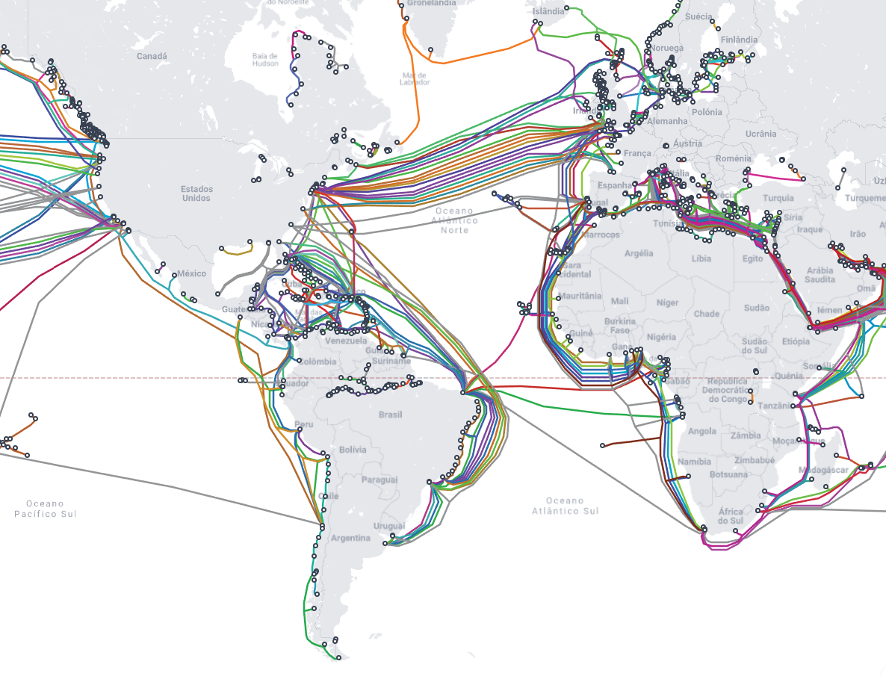

**Figura 1 — Cabos submarinos de Internet interligando continentes.** Eles mostram que a Internet depende de infraestrutura física real, formada por cabos, data centers, roteadores e enlaces de comunicação.

## 1.3 — Dispositivos finais e intermediários

Em uma rede, podemos separar os equipamentos em dois grupos principais.

Os **dispositivos finais**, também chamados de hosts, são os equipamentos que originam ou consomem dados. Exemplos: computadores, notebooks, smartphones, servidores, impressoras e dispositivos IoT.

Os **dispositivos intermediários** encaminham os dados entre origem e destino. Exemplos: switches, roteadores, firewalls, modems e access points. Eles não são o destino final da comunicação, mas são essenciais para que os pacotes cheguem até lá.

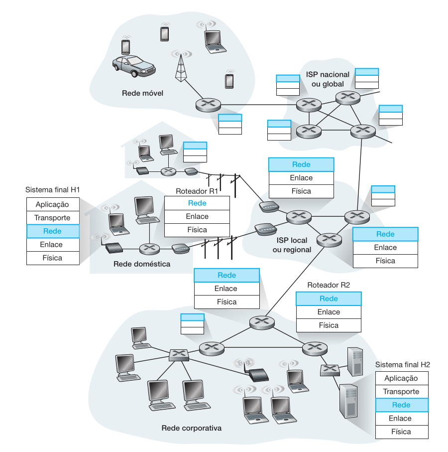

**Figura 2 — A Internet como uma rede de redes.** Várias redes menores são interligadas por roteadores, formando uma estrutura maior capaz de conectar dispositivos em diferentes lugares do mundo.

## 1.4 — Internet: a rede das redes

A Internet não é uma única rede centralizada. Ela é uma grande interconexão de redes menores. Redes residenciais, redes corporativas, redes de provedores, redes acadêmicas e data centers se conectam por meio de roteadores e enlaces de comunicação.

Quando um pacote sai da sua máquina, ele pode passar pelo roteador da sua casa, pelo provedor de Internet, por roteadores regionais, por cabos de longa distância e por outros provedores até chegar ao servidor de destino.

## 1.5 — O que pode dar errado?

Uma rede pode falhar por vários motivos. O cabo pode estar desconectado, o Wi-Fi pode estar instável, o roteador pode estar com problema, o DNS pode não resolver o domínio, o firewall pode bloquear a porta, o servidor pode estar fora do ar ou a rota até o destino pode estar congestionada.

Por isso, estudar redes não é apenas aprender teoria. É aprender a interpretar sintomas: uma página que não carrega, uma API que dá timeout, uma conexão recusada, uma resolução DNS incorreta ou uma latência muito alta.

## 1.6 — Resumo do capítulo

Uma rede de computadores permite que dispositivos troquem informações. A Internet é uma rede global formada por várias redes menores interconectadas. Para entender sistemas web, APIs, cloud e backend, é fundamental entender como os dados trafegam entre cliente, servidor e dispositivos intermediários.

## 1.7 — Exercícios

1. Explique, com suas palavras, a diferença entre um dispositivo final e um dispositivo intermediário.
2. Cite três situações do dia a dia em que você depende de uma rede de computadores.
3. Descreva o caminho aproximado que uma requisição pode percorrer quando você acessa um site.

---

# Capítulo 2 — Arquiteturas de aplicação

Aplicações em rede precisam definir como os dispositivos se organizam para trocar informações. Dois modelos importantes são o modelo cliente-servidor e o modelo peer-to-peer.

Ao final deste capítulo, você será capaz de:

- explicar o modelo cliente-servidor;
- entender a diferença entre cliente e servidor;
- reconhecer o modelo peer-to-peer;
- comparar vantagens e limitações de cada abordagem.

## 2.1 — O problema

Quando dois programas precisam se comunicar, é necessário definir quem inicia a comunicação, quem responde, onde ficam os dados e como os serviços serão acessados.

Em uma aplicação web comum, o navegador não possui todos os dados localmente. Ele precisa pedir informações a um servidor. Já em uma rede peer-to-peer, os próprios participantes podem trocar dados diretamente entre si.

## 2.2 — Cliente-servidor

No modelo **cliente-servidor**, o cliente é quem inicia a comunicação. Ele envia uma requisição pedindo algum recurso ou serviço. O servidor fica aguardando requisições e responde quando recebe uma solicitação válida.

Exemplos de clientes:

- navegador web;
- aplicativo mobile;
- ferramenta de linha de comando, como `curl`;
- frontend consumindo uma API;
- outro backend chamando um serviço interno.

Exemplos de servidores:

- servidor web;
- API REST;
- banco de dados;
- servidor de autenticação;
- servidor de arquivos.


**Figura 3 — Modelo cliente-servidor.** O cliente envia um pedido e o servidor devolve uma resposta.

Um exemplo simples é o acesso a uma API:

```http
GET /usuarios/123 HTTP/1.1
Host: api.exemplo.com
Accept: application/json
```

Essa requisição pede ao servidor o recurso `/usuarios/123`. O servidor processa o pedido e devolve uma resposta, normalmente com um código de status e um corpo de dados.

## 2.3 — Peer-to-peer (P2P)

No modelo **peer-to-peer**, os participantes da rede, chamados de pares ou peers, podem atuar tanto como clientes quanto como servidores. Cada peer pode solicitar recursos e também fornecer recursos para outros peers.

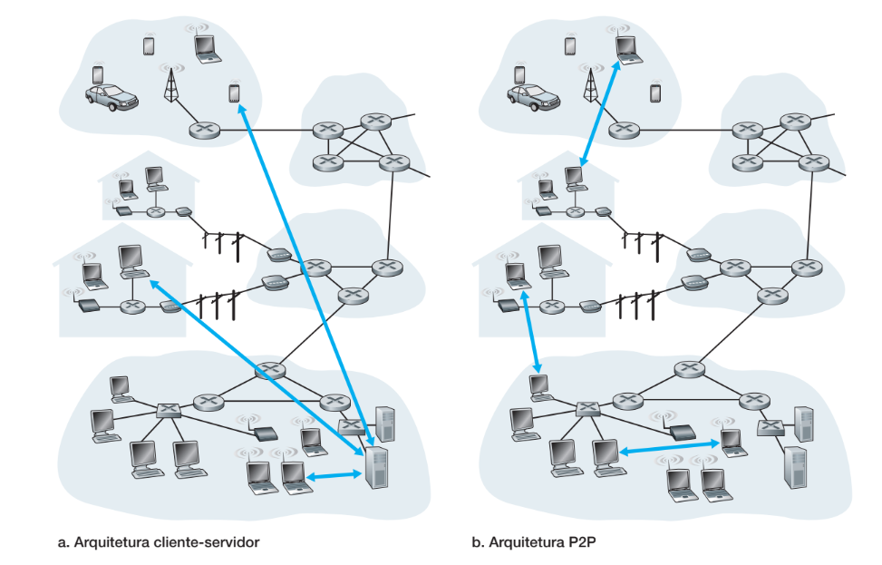

**Figura 4 — Arquitetura cliente-servidor e arquitetura P2P.** No cliente-servidor, os clientes dependem de servidores centrais. No P2P, os próprios pares podem trocar dados entre si.

Esse modelo aparece em sistemas de compartilhamento de arquivos, algumas redes distribuídas, comunicação descentralizada e aplicações que precisam reduzir dependência de um único servidor central.

A vantagem do P2P é a descentralização. A limitação é que os peers podem entrar e sair da rede a qualquer momento, o que torna o gerenciamento mais complexo.

## 2.4 — Cliente-servidor vs P2P

| Critério | Cliente-servidor | Peer-to-peer |
|---|---|---|
| Organização | Centralizada | Descentralizada |
| Quem fornece o serviço | Servidor | Qualquer peer |
| Facilidade de controle | Alta | Menor |
| Escalabilidade | Depende do servidor e infraestrutura | Pode crescer com os peers |
| Exemplos | Sites, APIs, bancos de dados | BitTorrent, redes distribuídas |

## 2.5 — Quando usar cada modelo?

O modelo cliente-servidor é o mais comum em aplicações web, APIs, sistemas corporativos e plataformas centralizadas. Ele facilita controle de acesso, auditoria, monitoramento, segurança e consistência dos dados.

O modelo P2P é útil quando se deseja distribuir carga entre os participantes, reduzir dependência de um servidor central ou criar sistemas descentralizados.

## 2.6 — Resumo do capítulo

O modelo cliente-servidor domina a Web: clientes pedem e servidores respondem. O modelo P2P distribui responsabilidades entre os participantes, que podem atuar como clientes e servidores ao mesmo tempo.

## 2.7 — Exercícios

1. Dê três exemplos reais de clientes e três exemplos reais de servidores.
2. Explique por que uma API normalmente segue o modelo cliente-servidor.
3. Cite uma vantagem e uma desvantagem do modelo P2P.

---

# Capítulo 3 — Comunicação entre processos, sockets e portas

Redes conectam máquinas, mas quem realmente troca mensagens são processos em execução nessas máquinas. Um navegador, uma API, um banco de dados e um servidor web são processos que se comunicam por meio da rede.

Ao final deste capítulo, você será capaz de:

- entender o que é comunicação entre processos;
- explicar o papel de sockets;
- diferenciar endereço IP e porta;
- entender por que portas são importantes para aplicações backend.

## 3.1 — O problema

Um computador pode executar vários programas ao mesmo tempo. Ele pode estar com navegador aberto, banco de dados rodando, servidor local, Docker, cliente de e-mail e outros serviços.

Quando uma mensagem chega pela rede, o sistema operacional precisa saber para qual processo ela deve ser entregue. O endereço IP identifica a máquina, mas não identifica sozinho qual programa dentro da máquina deve receber os dados.

## 3.2 — O que é socket?

Um **socket** é uma interface de comunicação usada por processos para enviar e receber dados pela rede. Ele funciona como uma porta lógica entre a aplicação e a camada de transporte.

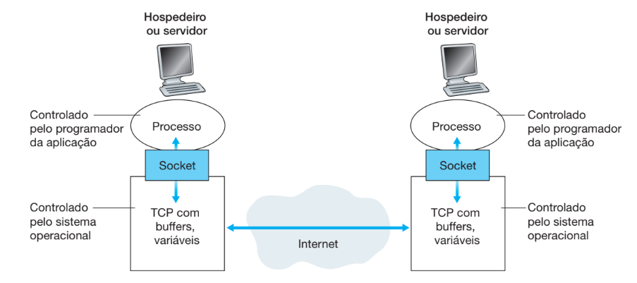

**Figura 5 — Socket.** A aplicação não envia bits diretamente para o cabo. Ela entrega dados ao socket, e o sistema operacional cuida das camadas inferiores.

A combinação de IP e porta identifica um ponto de comunicação:

```text
192.168.0.10:8000
```

Nesse exemplo:

- `192.168.0.10` identifica o host;
- `8000` identifica a porta usada por uma aplicação nesse host.

## 3.3 — Portas

Portas são números usados para identificar serviços ou processos em uma máquina. Algumas portas são conhecidas por padrão:

| Porta | Protocolo/Serviço | Uso comum |
|---:|---|---|
| 22 | SSH | Acesso remoto seguro |
| 25 | SMTP | Envio de e-mail entre servidores |
| 53 | DNS | Resolução de nomes |
| 80 | HTTP | Web sem TLS |
| 443 | HTTPS | Web com TLS |
| 5432 | PostgreSQL | Banco de dados PostgreSQL |
| 6379 | Redis | Banco Redis |
| 8000 | Desenvolvimento web | APIs locais, FastAPI, Django etc. |

## 3.4 — Exemplo prático

Quando você executa uma API local em Python, ela normalmente fica escutando uma porta:

```bash
uvicorn main:app --host 0.0.0.0 --port 8000
```

Isso significa que o processo da aplicação está aguardando conexões na porta `8000`. Se você acessar `http://localhost:8000`, o navegador envia uma requisição para essa porta.

## 3.5 — O que pode dar errado?

Um erro comum é tentar subir dois serviços na mesma porta. Se uma API já estiver usando a porta `8000`, outra aplicação não conseguirá escutar nessa mesma porta no mesmo IP.

Outro erro comum é o serviço estar rodando, mas o firewall bloquear a porta. Nesse caso, o processo existe, mas a conexão externa não chega até ele.

## 3.6 — Resumo do capítulo

O IP identifica a máquina. A porta identifica o serviço dentro da máquina. O socket é a interface usada pelo processo para se comunicar pela rede.

## 3.7 — Exercícios

1. Explique por que o IP sozinho não é suficiente para entregar dados ao processo correto.
2. O que significa `localhost:3000`?
3. Pesquise qual porta padrão é usada por MySQL, PostgreSQL, Redis e MongoDB.

---

# Capítulo 4 — Protocolos e modelos em camadas

Protocolos são regras que permitem a comunicação entre dispositivos. Modelos em camadas organizam essas regras para tornar a rede mais compreensível e modular.

Ao final deste capítulo, você será capaz de:

- explicar o que é um protocolo de comunicação;
- entender a ideia de camadas;
- comparar o modelo OSI e o modelo TCP/IP;
- acompanhar o fluxo de uma requisição HTTP pelas camadas.

## 4.1 — O problema

Se cada fabricante ou aplicação criasse sua própria forma de comunicação, os sistemas não conseguiriam conversar entre si. Protocolos resolvem esse problema ao padronizar formatos, comportamentos, mensagens e regras de interpretação.

Um protocolo define, por exemplo:

- como uma mensagem começa e termina;
- quais campos ela deve conter;
- como erros são tratados;
- como a ordem dos dados é garantida;
- como endereços e portas são usados;
- como cliente e servidor negociam a comunicação.

## 4.2 — O que é um protocolo?

Um protocolo é um conjunto de regras para comunicação. HTTP, TCP, IP, DNS, TLS, SMTP e SSH são exemplos de protocolos.

Uma analogia simples: conversar por telefone também segue um protocolo informal. Uma pessoa liga, a outra atende, ambas se identificam, trocam informações e encerram a conversa. Na rede, esse comportamento precisa ser muito mais preciso, porque máquinas interpretam bits, não intenções.

## 4.3 — Por que existem camadas?

A comunicação em rede é complexa demais para ser tratada como uma coisa única. Por isso, ela é dividida em camadas. Cada camada resolve uma parte do problema e oferece serviços para a camada acima.

Essa separação permite que uma aplicação web use HTTP sem precisar saber como os bits são transmitidos por Wi-Fi, fibra óptica ou cabo Ethernet.

## 4.4 — Modelo OSI e modelo TCP/IP

O modelo OSI é um modelo conceitual de sete camadas. Ele é muito usado para estudo, diagnóstico e organização do raciocínio.

O modelo TCP/IP é a arquitetura prática usada na Internet. Ele costuma ser apresentado em quatro camadas: Aplicação, Transporte, Internet e Acesso à Rede.

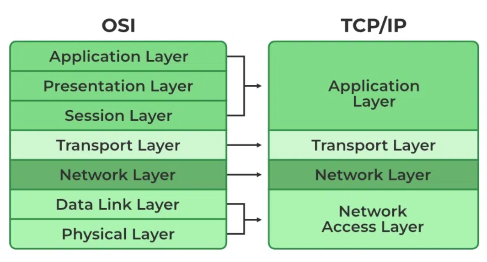

**Figura 6 — Comparação entre OSI e TCP/IP.** O OSI é mais detalhado didaticamente; o TCP/IP representa melhor a pilha usada na Internet.

## 4.5 — As sete camadas do modelo OSI

| Camada | Função principal | Exemplos |
|---:|---|---|
| 7. Aplicação | Protocolos usados diretamente por aplicações | HTTP, DNS, SMTP, FTP, SSH |
| 6. Apresentação | Formatação, compressão e criptografia | TLS, codificação, serialização |
| 5. Sessão | Controle de sessões de comunicação | Gerenciamento lógico da conversa |
| 4. Transporte | Comunicação fim a fim entre processos | TCP, UDP |
| 3. Rede | Endereçamento e roteamento entre redes | IP, ICMP |
| 2. Enlace | Entrega dentro da rede local | Ethernet, Wi-Fi, MAC |
| 1. Física | Transmissão de bits no meio físico | Cabos, rádio, fibra óptica |

Na prática, as camadas 5, 6 e 7 do OSI frequentemente aparecem agrupadas na camada de aplicação do TCP/IP.

## 4.6 — As quatro camadas do modelo TCP/IP

| Camada TCP/IP | Função | Exemplos |
|---|---|---|
| Aplicação | Protocolos usados por programas | HTTP, DNS, SSH, SMTP, FTP |
| Transporte | Comunicação entre processos | TCP, UDP, QUIC |
| Internet | Endereçamento e roteamento | IP, ICMP |
| Acesso à Rede | Enlace e transmissão física | Ethernet, Wi-Fi, fibra |

## 4.7 — Exemplo: fluxo de uma requisição HTTP

Quando você acessa um site, a comunicação pode ser entendida assim:

1. **Aplicação:** o navegador cria uma requisição HTTP.
2. **Transporte:** TCP divide os dados em segmentos, controla entrega e ordem.
3. **Internet:** IP adiciona endereços de origem e destino.
4. **Acesso à Rede:** Ethernet ou Wi-Fi envia quadros pelo meio físico.

No servidor, o processo ocorre no sentido inverso: os dados sobem pelas camadas até chegar à aplicação.

## 4.8 — Encapsulamento

Cada camada adiciona suas próprias informações de controle. A aplicação gera dados. O TCP adiciona cabeçalhos de transporte. O IP adiciona cabeçalhos de rede. O enlace adiciona informações para transmissão local.

Isso é chamado de **encapsulamento**. Na recepção, cada camada remove e interpreta seu próprio cabeçalho.

## 4.9 — Resumo do capítulo

Protocolos são regras de comunicação. Camadas organizam essas regras. O modelo OSI ajuda a estudar e diagnosticar problemas. O modelo TCP/IP representa a pilha usada na Internet.

## 4.10 — Exercícios

1. Em qual camada do TCP/IP ficam HTTP e DNS?
2. Em qual camada fica o protocolo IP?
3. Por que dividir a comunicação em camadas facilita o desenvolvimento e a manutenção?

---

# Capítulo 5 — IP, IPv4, IPv6, sub-redes e NAT

O IP é o protocolo responsável por endereçar e encaminhar pacotes entre redes. Sem ele, a Internet como conhecemos não existiria.

Ao final deste capítulo, você será capaz de:

- explicar o papel do IP;
- entender endereços IPv4 e IPv6;
- diferenciar IP público e IP privado;
- entender máscaras de rede, CIDR e NAT;
- reconhecer que classes A, B e C são conceitos históricos.

## 5.1 — O problema

Para que um pacote chegue ao destino, a rede precisa saber para onde enviá-lo. O endereço IP cumpre esse papel. Ele identifica interfaces de rede e permite que roteadores encaminhem pacotes entre redes diferentes.

## 5.2 — O que o IP faz?

O IP atua na camada de rede. Ele não garante sozinho que os pacotes chegarão, nem que chegarão em ordem. Seu serviço é conhecido como **best effort**, ou seja, ele tenta entregar os pacotes da melhor forma possível, mas sem garantia de entrega.

A confiabilidade, quando necessária, normalmente é fornecida por protocolos acima dele, como o TCP.

## 5.3 — Cabeçalho IPv4

Um pacote IPv4 possui um cabeçalho com informações importantes para roteamento e entrega.

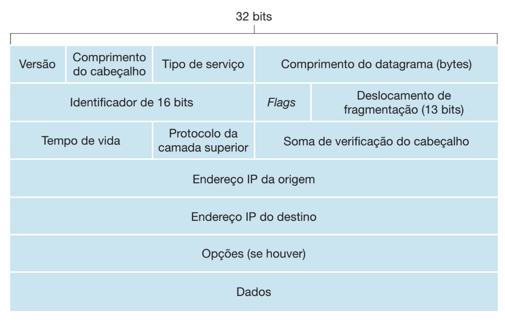

**Figura 7 — Cabeçalho IPv4.** Campos como TTL, protocolo, checksum e endereços de origem/destino ajudam os roteadores a encaminhar o pacote.

Campos importantes:

- **Endereço IP de origem:** identifica quem enviou o pacote.
- **Endereço IP de destino:** identifica para onde o pacote deve ir.
- **TTL:** limita por quantos roteadores o pacote pode passar antes de ser descartado.
- **Protocol:** indica qual protocolo de transporte está dentro do pacote, como TCP ou UDP.
- **Checksum do cabeçalho:** ajuda a detectar erros no cabeçalho IPv4.

## 5.4 — Endereçamento IPv4

O IPv4 usa endereços de 32 bits, normalmente escritos em notação decimal pontuada:

```text
192.168.1.10
```

Esse endereço é dividido em quatro octetos. Cada octeto pode variar de 0 a 255.

## 5.5 — Classes A, B, C, D e E

Historicamente, endereços IPv4 eram divididos em classes. Esse modelo é importante para entender materiais antigos e algumas explicações introdutórias, mas hoje a Internet usa **CIDR**, que é mais flexível.

| Classe | Primeiro octeto | Uso histórico | Máscara padrão |
|---|---:|---|---|
| A | 1 a 126 | Redes muito grandes | 255.0.0.0 |
| B | 128 a 191 | Redes médias | 255.255.0.0 |
| C | 192 a 223 | Redes pequenas | 255.255.255.0 |
| D | 224 a 239 | Multicast | Não se aplica como rede comum |
| E | 240 a 255 | Experimental/reservado | Não se aplica como rede comum |

O intervalo `127.0.0.0/8` é reservado para loopback, como `127.0.0.1`, que representa a própria máquina.

## 5.6 — Máscara de rede

A máscara de rede indica qual parte do endereço IP representa a rede e qual parte representa o host.

Exemplo:

```text
IP:      192.168.10.25
Máscara: 255.255.255.0
Rede:    192.168.10.0
```

Com essa máscara, os três primeiros octetos identificam a rede (`192.168.10`) e o último identifica o dispositivo (`25`).

## 5.7 — CIDR

CIDR significa **Classless Inter-Domain Routing**. Ele substituiu o modelo rígido de classes por uma notação mais flexível.

Exemplo:

```text
192.168.10.0/24
```

O `/24` indica que os primeiros 24 bits são usados para identificar a rede. É equivalente à máscara `255.255.255.0`.

Outro exemplo:

```text
10.0.0.0/8
```

Aqui, apenas os primeiros 8 bits identificam a rede. Isso representa uma rede muito maior.

## 5.8 — IP público e IP privado

Um **IP público** é roteável na Internet. Ele identifica uma rede ou serviço de forma global.

Um **IP privado** é usado apenas dentro de redes locais. Ele não é roteável diretamente pela Internet pública.

Intervalos privados definidos pela RFC 1918:

| Faixa | Notação CIDR | Uso comum |
|---|---|---|
| 10.0.0.0 a 10.255.255.255 | 10.0.0.0/8 | Redes corporativas grandes |
| 172.16.0.0 a 172.31.255.255 | 172.16.0.0/12 | Redes internas médias |
| 192.168.0.0 a 192.168.255.255 | 192.168.0.0/16 | Redes domésticas e pequenas redes |

> Correção importante: a faixa privada de classe C é `192.168.0.0/16`, não `192.68.0.0`.

## 5.9 — NAT

NAT significa **Network Address Translation**. Ele permite que vários dispositivos com IP privado acessem a Internet usando um IP público compartilhado.

Na prática, o roteador troca o IP privado de origem pelo IP público da rede e registra essa tradução em uma tabela. Quando a resposta volta, o roteador consulta a tabela e entrega o pacote ao dispositivo interno correto.

Um caso comum é o PAT, ou Port Address Translation, em que vários dispositivos compartilham o mesmo IP público, diferenciando conexões por portas.

## 5.10 — IPv6

O IPv6 foi criado principalmente para resolver a limitação de endereços do IPv4. Enquanto IPv4 usa 32 bits, IPv6 usa 128 bits.

Exemplo de endereço IPv6:

```text
2001:0db8:85a3:0000:0000:8a2e:0370:7334
```

Esse endereço pode ser abreviado removendo zeros à esquerda e usando `::` uma única vez para representar uma sequência de blocos zero:

```text
2001:db8:85a3::8a2e:370:7334
```

## 5.11 — Tipos de endereços IPv6

| Tipo | Significado |
|---|---|
| Unicast | Identifica uma interface específica |
| Multicast | Identifica um grupo de interfaces |
| Anycast | Identifica várias interfaces, mas entrega para a mais próxima conforme roteamento |

No IPv6, não existe broadcast como no IPv4. O multicast cumpre muitos papéis que antes eram feitos com broadcast.

## 5.12 — O que pode dar errado?

Um computador pode ter IP válido na rede local, mas não conseguir sair para a Internet se o gateway estiver errado. Também pode conseguir acessar IPs diretamente, mas não resolver nomes, indicando problema de DNS.

Outro erro comum é confundir IP privado com IP público. O IP `192.168.x.x` identifica sua máquina dentro da rede local, mas não é o endereço pelo qual a Internet enxerga sua conexão.

## 5.13 — Resumo do capítulo

O IP endereça e encaminha pacotes. IPv4 usa 32 bits e ainda é muito comum. IPv6 usa 128 bits e amplia enormemente o espaço de endereçamento. Máscaras e CIDR definem redes e hosts. NAT permite que dispositivos privados compartilhem um IP público.

## 5.14 — Exercícios

1. Qual é a rede do IP `192.168.1.55/24`?
2. O endereço `10.10.5.20` é público ou privado?
3. Explique por que NAT foi importante para prolongar o uso do IPv4.
4. Qual é a principal diferença de tamanho entre IPv4 e IPv6?

---

# Capítulo 6 — TCP, UDP e transporte de dados

A camada de transporte permite que processos em máquinas diferentes conversem. Os dois protocolos mais conhecidos são TCP e UDP.

Ao final deste capítulo, você será capaz de:

- explicar a diferença entre TCP e UDP;
- entender o que significa conexão orientada;
- descrever o three-way handshake;
- reconhecer estados TCP comuns;
- usar comandos para investigar conexões.

## 6.1 — O problema

O IP entrega pacotes entre máquinas, mas as aplicações precisam de algo mais: comunicação entre processos, controle de portas, confiabilidade, ordenação e, em alguns casos, controle de fluxo.

A camada de transporte resolve esse problema.

## 6.2 — TCP

O TCP, Transmission Control Protocol, é um protocolo orientado à conexão e confiável. Antes de enviar dados de aplicação, cliente e servidor estabelecem uma conexão lógica.

O TCP oferece:

- entrega confiável;
- controle de sequência;
- retransmissão de segmentos perdidos;
- controle de fluxo;
- controle de congestionamento;
- identificação por portas.

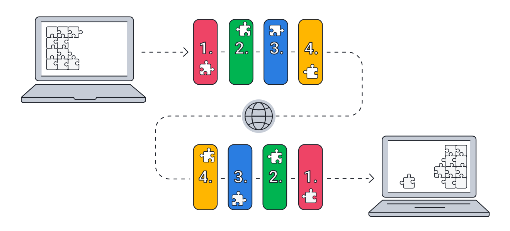

**Figura 8 — Segmentos e ordem.** Protocolos de transporte podem dividir dados em partes menores e usar numeração para remontar a informação no destino.

## 6.3 — Three-way handshake

Para estabelecer uma conexão TCP, ocorre o **three-way handshake**:

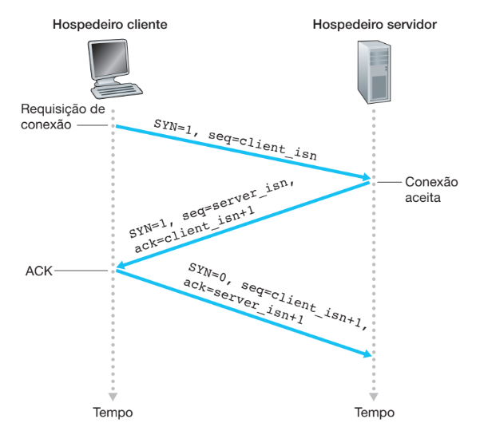

**Figura 9 — Estabelecimento de conexão TCP.** Cliente e servidor sincronizam a conexão antes de enviar dados de aplicação.

1. **SYN:** o cliente pede abertura de conexão.
2. **SYN-ACK:** o servidor aceita e responde confirmando.
3. **ACK:** o cliente confirma a resposta do servidor.

Depois disso, a conexão entra no estado `ESTABLISHED` e os dados podem ser trocados.

## 6.4 — Encerramento de conexão TCP

O encerramento normalmente usa pacotes `FIN` e `ACK`. Cada lado encerra sua direção de envio de forma independente.

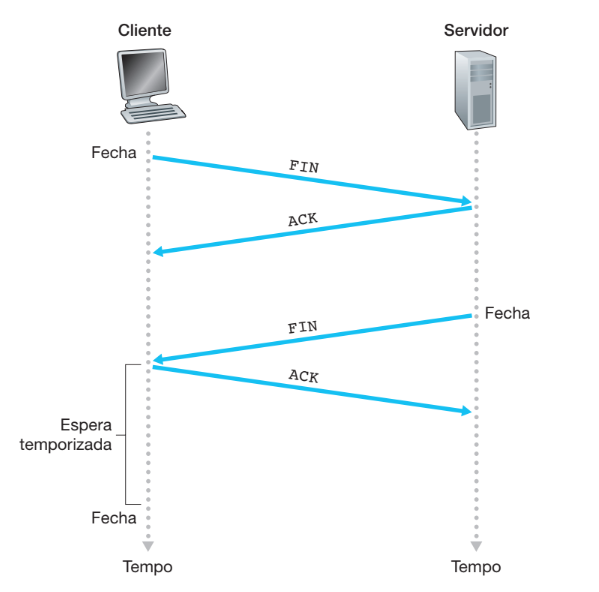

**Figura 10 — Encerramento de conexão TCP.** O fechamento geralmente envolve confirmação dos dois lados.

O encerramento abrupto pode usar `RST`, geralmente quando há erro ou tentativa de comunicação com uma conexão inexistente.

## 6.5 — Estados TCP importantes

| Estado | Significado |
|---|---|
| LISTEN | Servidor aguardando conexões |
| SYN_SENT | Cliente enviou SYN e aguarda resposta |
| SYN_RCVD | Servidor recebeu SYN e respondeu SYN-ACK |
| ESTABLISHED | Conexão ativa |
| FIN_WAIT_1 | Um lado iniciou o encerramento |
| FIN_WAIT_2 | Aguardando FIN do outro lado |
| CLOSE_WAIT | Recebeu FIN e aguarda aplicação fechar |
| LAST_ACK | Enviou FIN e aguarda ACK final |
| TIME_WAIT | Espera por segurança antes de liberar totalmente |
| CLOSED | Conexão encerrada |

Muitas conexões em `TIME_WAIT` podem indicar grande volume de conexões curtas. Muitas em `CLOSE_WAIT` podem indicar que a aplicação não está fechando sockets corretamente.

## 6.6 — UDP

UDP, User Datagram Protocol, é um protocolo sem conexão e com baixa sobrecarga. Ele não garante entrega, ordem ou retransmissão.

Isso não significa que UDP seja “ruim”. Ele é útil quando baixa latência é mais importante do que confiabilidade nativa do transporte, ou quando a aplicação implementa sua própria lógica de controle.

Exemplos de uso:

- DNS;
- chamadas de voz e vídeo;
- jogos online;
- streaming;
- QUIC, que usa UDP como base para oferecer recursos modernos de transporte.

## 6.7 — TCP vs UDP

| Critério | TCP | UDP |
|---|---|---|
| Conexão | Orientado à conexão | Sem conexão |
| Confiabilidade | Sim | Não nativa |
| Ordem dos dados | Garante ordem | Não garante |
| Sobrecarga | Maior | Menor |
| Casos comuns | HTTP/1.1, HTTP/2, SSH, SMTP, FTP | DNS, streaming, jogos, QUIC/HTTP/3 |

## 6.8 — Comandos úteis

Ver conexões TCP e UDP no Linux:

```bash
ss -tuna
```

Opções:

- `-t`: TCP;
- `-u`: UDP;
- `-n`: não resolver nomes;
- `-a`: mostrar sockets em escuta e conectados.

Ver processos usando uma porta:

```bash
lsof -i :443
```

Capturar tráfego HTTP na porta 80:

```bash
sudo tcpdump port 80 -n
```

## 6.9 — O que pode dar errado?

Uma conexão pode falhar porque o servidor não está escutando a porta, o firewall está bloqueando, o DNS resolveu para IP errado, o NAT não está encaminhando a porta, a aplicação fechou a conexão ou houve timeout.

Para backend, mensagens como `connection refused`, `connection timed out` e `connection reset by peer` costumam indicar problemas diferentes:

- **connection refused:** não há serviço aceitando conexão naquela porta ou a conexão foi rejeitada.
- **connection timed out:** não houve resposta dentro do tempo esperado.
- **connection reset by peer:** o outro lado encerrou a conexão abruptamente.

## 6.10 — Resumo do capítulo

TCP é confiável e orientado à conexão. UDP é simples, rápido e sem garantias nativas. Ambos usam portas para identificar processos. Entender transporte ajuda a diagnosticar APIs, bancos, filas, caches e serviços distribuídos.

## 6.11 — Exercícios

1. Explique por que HTTP/1.1 e HTTP/2 tradicionalmente usam TCP.
2. Por que DNS costuma usar UDP?
3. O que significa uma conexão estar em `ESTABLISHED`?
4. Pesquise a diferença entre `TIME_WAIT` e `CLOSE_WAIT`.

---

# Capítulo 7 — HTTP e comunicação web

HTTP é o protocolo de aplicação mais importante da Web. Ele define como clientes e servidores trocam requisições e respostas.

Ao final deste capítulo, você será capaz de:

- entender o funcionamento básico do HTTP;
- diferenciar métodos HTTP;
- interpretar códigos de status;
- reconhecer cabeçalhos importantes;
- entender a evolução de HTTP/1.1, HTTP/2 e HTTP/3.

## 7.1 — O problema

Navegadores, APIs e serviços web precisam de uma linguagem comum para pedir e entregar recursos. Essa linguagem é o HTTP.

Quando uma aplicação frontend chama uma API backend, ela normalmente envia uma requisição HTTP e recebe uma resposta HTTP.

## 7.2 — Request e response

O HTTP segue o modelo requisição-resposta:

1. o cliente envia uma requisição;
2. o servidor interpreta;
3. o servidor devolve uma resposta.

Uma requisição possui método, caminho, versão do protocolo, cabeçalhos e, em alguns casos, corpo.

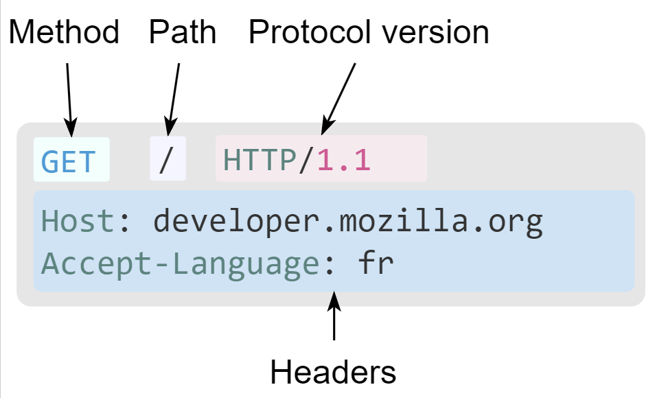

**Figura 11 — Requisição HTTP.** A primeira linha contém método, caminho e versão. Os headers carregam metadados.

Uma resposta possui versão, código de status, mensagem de status, cabeçalhos e, em muitos casos, corpo.

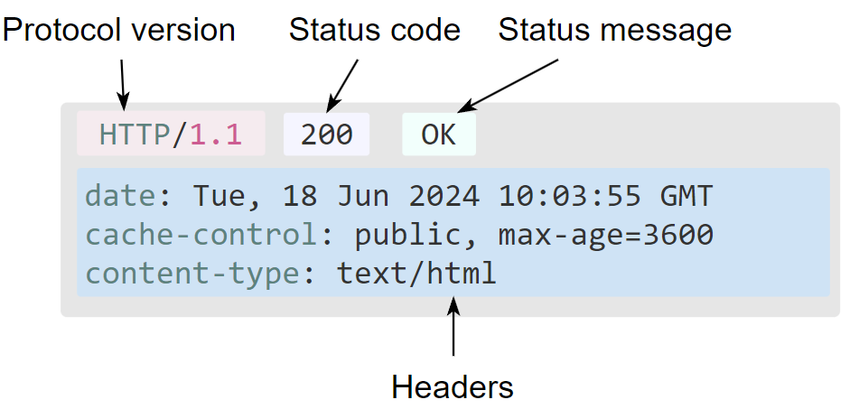

**Figura 12 — Resposta HTTP.** O código de status resume o resultado da requisição.

## 7.3 — Métodos HTTP

Métodos HTTP indicam a intenção do cliente em relação ao recurso.

| Método | Uso comum | Idempotente? | Seguro? |
|---|---|---|---|
| GET | Buscar recurso | Sim | Sim |
| HEAD | Buscar apenas headers | Sim | Sim |
| POST | Criar recurso ou executar operação | Não, em geral | Não |
| PUT | Substituir recurso inteiro | Sim | Não |
| PATCH | Atualizar parte do recurso | Depende da implementação | Não |
| DELETE | Remover recurso | Sim | Não |
| OPTIONS | Consultar opções de comunicação | Sim | Sim |

Um método é **seguro** quando não deve alterar o estado do servidor. `GET`, `HEAD` e `OPTIONS` são considerados seguros.

Um método é **idempotente** quando repetir a mesma requisição várias vezes gera o mesmo efeito final no servidor.

## 7.4 — Exemplo de idempotência

`DELETE /usuarios/10` é idempotente porque, depois que o usuário foi removido, repetir a operação mantém o mesmo estado final: o usuário continua removido.

Já `POST /pedidos` geralmente não é idempotente, porque enviar a mesma requisição várias vezes pode criar vários pedidos.

## 7.5 — Códigos de status HTTP

Os códigos de status são agrupados em classes:

| Classe | Significado |
|---|---|
| 1xx | Informação |
| 2xx | Sucesso |
| 3xx | Redirecionamento |
| 4xx | Erro do cliente |
| 5xx | Erro do servidor |

Códigos comuns:

| Código | Nome | Uso comum |
|---:|---|---|
| 200 | OK | Requisição bem-sucedida |
| 201 | Created | Recurso criado |
| 204 | No Content | Sucesso sem corpo na resposta |
| 301 | Moved Permanently | Redirecionamento permanente |
| 302 | Found | Redirecionamento temporário |
| 400 | Bad Request | Requisição inválida |
| 401 | Unauthorized | Falta autenticação válida |
| 403 | Forbidden | Autenticado, mas sem permissão |
| 404 | Not Found | Recurso não encontrado |
| 409 | Conflict | Conflito de estado |
| 422 | Unprocessable Content | Dados sintaticamente válidos, mas semanticamente inválidos |
| 500 | Internal Server Error | Erro interno genérico |
| 502 | Bad Gateway | Proxy/gateway recebeu resposta inválida |
| 503 | Service Unavailable | Serviço indisponível temporariamente |

## 7.6 — Headers HTTP

Headers são metadados enviados na requisição ou resposta.

Headers comuns de requisição:

| Header | Função |
|---|---|
| Host | Informa o domínio do servidor |
| Accept | Informa tipos de resposta aceitos |
| Content-Type | Informa o tipo do corpo enviado |
| Authorization | Envia credenciais, como token Bearer |
| User-Agent | Identifica o cliente |
| Accept-Language | Informa idiomas preferidos |

Headers comuns de resposta:

| Header | Função |
|---|---|
| Content-Type | Tipo do corpo da resposta |
| Cache-Control | Regras de cache |
| Set-Cookie | Define cookies |
| Location | Indica URL de redirecionamento ou recurso criado |
| Strict-Transport-Security | Força uso futuro de HTTPS |

## 7.7 — Versões do HTTP

| Versão | Característica principal |
|---|---|
| HTTP/1.0 | Primeira padronização ampla; conexões menos eficientes |
| HTTP/1.1 | Conexões persistentes e melhorias importantes |
| HTTP/2 | Multiplexação, compressão de headers e melhor desempenho |
| HTTP/3 | Usa QUIC sobre UDP, reduzindo alguns problemas de latência e melhorando mobilidade de conexão |

HTTP/3 não significa que HTTP/1.1 e HTTP/2 desapareceram. Em sistemas reais, várias versões continuam coexistindo.

## 7.8 — Exemplo com curl

```bash
curl -i https://example.com
```

A opção `-i` mostra os headers da resposta. Isso ajuda a observar código de status, tipo de conteúdo, cache e outros metadados.

## 7.9 — O que pode dar errado?

Uma API pode retornar erro 400 por JSON inválido, 401 por token ausente, 403 por falta de permissão, 404 por rota errada, 409 por conflito de dados ou 500 por exceção não tratada no backend.

Para depurar, observe sempre:

- método usado;
- URL;
- headers;
- corpo da requisição;
- código de status;
- corpo da resposta;
- logs do servidor.

## 7.10 — Resumo do capítulo

HTTP é o protocolo base da Web. Ele usa requisições e respostas. Métodos indicam intenção, status codes indicam resultado, e headers carregam metadados essenciais.

## 7.11 — Exercícios

1. Qual a diferença entre `PUT` e `PATCH`?
2. Por que `POST` geralmente não é idempotente?
3. Quando uma API deveria retornar `201 Created`?
4. Qual a diferença entre `401` e `403`?

---

# Capítulo 8 — HTTPS, TLS e certificados digitais

HTTPS é HTTP protegido por TLS. Ele fornece confidencialidade, integridade e autenticidade na comunicação web.

Ao final deste capítulo, você será capaz de:

- explicar por que HTTP puro é inseguro;
- entender o papel do TLS;
- compreender o que é um certificado digital;
- entender o handshake TLS de forma prática;
- reconhecer boas práticas operacionais de HTTPS.

## 8.1 — O problema

HTTP sem TLS transmite dados em texto claro. Em uma rede pública, alguém no caminho poderia observar ou modificar informações sensíveis, como tokens, senhas, dados pessoais e conteúdo de requisições.

HTTPS resolve esse problema ao encapsular HTTP dentro de uma conexão protegida por TLS.

## 8.2 — O que o HTTPS garante?

HTTPS busca garantir três propriedades:

1. **Confidencialidade:** terceiros não conseguem ler o conteúdo trafegado.
2. **Integridade:** alterações no caminho podem ser detectadas.
3. **Autenticidade:** o cliente consegue validar que está falando com o servidor correto.

## 8.3 — Handshake TLS

Antes de trocar dados HTTP, cliente e servidor negociam uma conexão segura. Esse processo é chamado de handshake TLS.

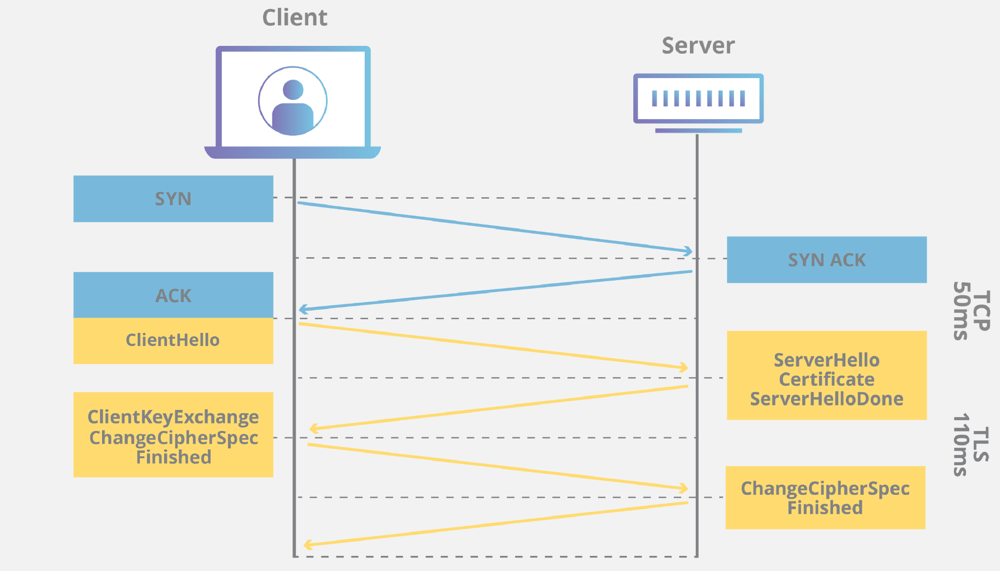

**Figura 13 — Handshake TLS.** Cliente e servidor negociam parâmetros criptográficos, validam o certificado e derivam chaves de sessão para proteger a comunicação.

Em uma visão simplificada:

1. o cliente informa versões TLS e algoritmos suportados;
2. o servidor escolhe parâmetros compatíveis e envia seu certificado;
3. o cliente valida o certificado;
4. cliente e servidor realizam uma troca de chaves;
5. ambos derivam chaves simétricas de sessão;
6. a partir daí, os dados HTTP trafegam criptografados.

> Em TLS moderno, especialmente TLS 1.3, a explicação correta não é simplesmente “o cliente criptografa uma chave de sessão com a chave pública do servidor”. O fluxo usa troca de chaves moderna, normalmente efêmera, para derivar segredos compartilhados com melhor segurança.

## 8.4 — Certificados digitais

Um certificado digital vincula uma identidade, como `api.exemplo.com`, a uma chave pública. Ele é emitido por uma Autoridade Certificadora, também chamada de CA.

O navegador confia em uma lista de CAs. Se o certificado do servidor foi emitido por uma CA confiável, está dentro da validade, corresponde ao domínio e a cadeia de confiança está correta, a conexão pode prosseguir.

Arquivos comuns em servidores:

| Arquivo | Função |
|---|---|
| `cert.pem` | Certificado do servidor |
| `privkey.pem` | Chave privada do servidor |
| `chain.pem` | Cadeia intermediária de certificados |
| `fullchain.pem` | Certificado + cadeia intermediária |

A chave privada deve ser protegida. Se ela vazar, a identidade criptográfica do servidor fica comprometida.

## 8.5 — Tipos de validação

| Tipo | O que valida | Uso comum |
|---|---|---|
| DV | Controle do domínio | Maioria dos sites e APIs |
| OV | Organização por trás do domínio | Empresas e serviços corporativos |
| EV | Validação organizacional mais rigorosa | Ambientes que exigem confiança formal maior |

Hoje, navegadores modernos não dão tanto destaque visual a EV como faziam no passado. Por isso, a segurança prática depende muito mais de configuração correta, renovação e cadeia de confiança válida.

## 8.6 — Operação de HTTPS

Manter HTTPS seguro envolve:

- renovar certificados antes do vencimento;
- automatizar renovação com ferramentas como Certbot ou soluções do provedor cloud;
- redirecionar HTTP para HTTPS;
- desabilitar versões antigas e inseguras de TLS;
- usar cifras modernas;
- configurar headers de segurança;
- monitorar expiração de certificados.

Headers úteis:

```http
Strict-Transport-Security: max-age=31536000; includeSubDomains
X-Content-Type-Options: nosniff
Content-Security-Policy: default-src 'self'
```

## 8.7 — Testes práticos

Ver detalhes da conexão com `curl`:

```bash
curl -v https://example.com
```

Inspecionar certificado com OpenSSL:

```bash
openssl s_client -connect example.com:443 -servername example.com
```

Esses comandos ajudam a investigar problemas de certificado, SNI, cadeia de confiança e versões TLS.

## 8.8 — O que pode dar errado?

Problemas comuns:

- certificado expirado;
- certificado emitido para outro domínio;
- cadeia intermediária incompleta;
- servidor usando TLS antigo;
- relógio da máquina cliente incorreto;
- proxy corporativo interceptando TLS;
- aplicação usando HTTP internamente sem cuidado.

## 8.9 — Resumo do capítulo

HTTPS é essencial para qualquer sistema moderno. TLS protege confidencialidade, integridade e autenticidade. Certificados digitais permitem validar a identidade do servidor. A segurança real depende de configuração, automação e monitoramento contínuos.

## 8.10 — Exercícios

1. Por que HTTP puro não deve ser usado para login?
2. O que um certificado digital prova?
3. Qual é o risco de uma chave privada vazar?
4. Execute `curl -v https://example.com` e observe os detalhes da conexão.

---

# Capítulo 9 — DNS, FTP, SMTP e SSH

Além de HTTP e HTTPS, várias aplicações dependem de protocolos importantes da camada de aplicação. Entre eles estão DNS, FTP, SMTP e SSH.

Ao final deste capítulo, você será capaz de:

- explicar como o DNS transforma nomes em IPs;
- entender o papel de FTP e suas limitações;
- entender o básico de SMTP;
- explicar para que serve SSH.

## 9.1 — DNS

DNS significa **Domain Name System**. Ele traduz nomes de domínio legíveis por humanos, como `www.exemplo.com`, em endereços IP usados pelas máquinas.

Sem DNS, você precisaria decorar endereços IP para acessar serviços.

## 9.2 — Hierarquia DNS

O DNS é distribuído e hierárquico. Isso evita depender de um único servidor central.

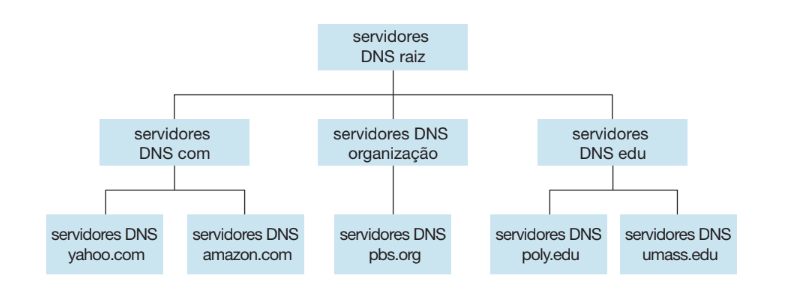

**Figura 14 — Hierarquia DNS.** Servidores raiz apontam para TLDs, que apontam para servidores autoritativos.

Componentes principais:

- **Resolver recursivo:** normalmente fornecido pelo provedor, empresa ou serviço como Google Public DNS e Cloudflare DNS.
- **Servidores raiz:** indicam onde encontrar servidores TLD.
- **Servidores TLD:** responsáveis por domínios como `.com`, `.org`, `.br`.
- **Servidores autoritativos:** possuem os registros oficiais de um domínio.

## 9.3 — Consulta recursiva e iterativa

Em uma consulta recursiva, o cliente pede ao resolver que encontre a resposta completa.

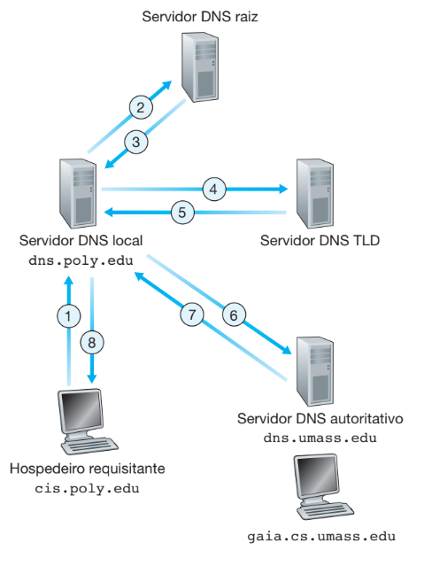

**Figura 15 — Consulta DNS recursiva.** O resolver faz o trabalho de buscar a resposta e devolve o resultado ao cliente.

Em consultas iterativas, cada servidor responde indicando o próximo servidor a consultar.

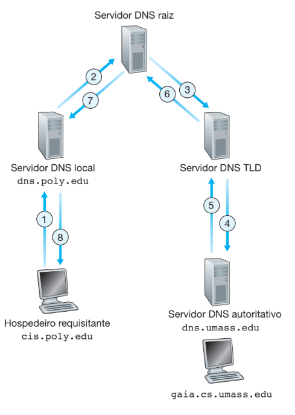

**Figura 16 — Consulta DNS iterativa.** Cada etapa aproxima a consulta do servidor autoritativo.

## 9.4 — Registros DNS comuns

| Registro | Função |
|---|---|
| A | Nome para IPv4 |
| AAAA | Nome para IPv6 |
| CNAME | Apelido para outro nome |
| MX | Servidores de e-mail do domínio |
| NS | Servidores autoritativos |
| TXT | Texto arbitrário, usado em SPF, DKIM, verificação etc. |

DNS usa UDP na porta 53 com frequência, mas também pode usar TCP, por exemplo em respostas grandes, transferências de zona e outros cenários.

## 9.5 — FTP

FTP significa **File Transfer Protocol**. Ele foi criado para transferência de arquivos entre cliente e servidor.

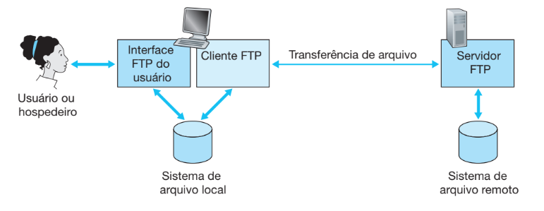

**Figura 17 — Arquitetura FTP.** Cliente FTP acessa um servidor remoto para enviar ou baixar arquivos.

Uma característica do FTP é o uso de duas conexões TCP:

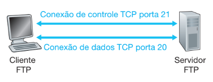

**Figura 18 — FTP usa conexão de controle e conexão de dados.** A conexão de controle envia comandos; a conexão de dados transfere arquivos.

Por padrão, FTP não é seguro, pois pode transmitir credenciais e dados sem criptografia. Em ambientes modernos, costuma-se preferir SFTP ou FTPS.

## 9.6 — SMTP

SMTP significa **Simple Mail Transfer Protocol**. Ele é usado para enviar e transferir e-mails entre servidores.

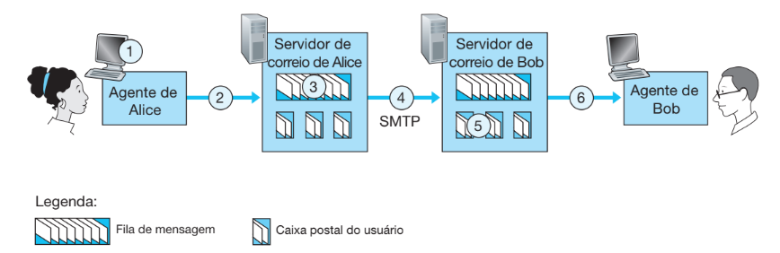

**Figura 19 — Fluxo simplificado de e-mail.** Clientes e servidores de correio participam do envio e entrega da mensagem.

SMTP é usado principalmente para envio. Para recebimento/leitura de e-mails por clientes, protocolos como IMAP e POP3 são comuns.

## 9.7 — SSH

SSH significa **Secure Shell**. Ele permite acesso remoto seguro a servidores e equipamentos de rede.

Uso comum:

```bash
ssh usuario@servidor.com
```

O SSH oferece:

- autenticação do servidor;
- autenticação do usuário;
- criptografia da comunicação;
- execução remota de comandos;
- tunelamento;
- transferência segura de arquivos com `scp` ou `sftp`.

## 9.8 — O que pode dar errado?

No DNS, um domínio pode não resolver por erro de registro, cache antigo, problema no servidor autoritativo ou configuração incorreta de zona.

No FTP, firewalls e NAT podem complicar a conexão de dados. Além disso, FTP puro não deve ser usado para tráfego sensível.

No SMTP, problemas de entrega podem envolver DNS, SPF, DKIM, DMARC, reputação do IP e bloqueios antispam.

No SSH, erros comuns incluem chave incorreta, usuário errado, porta bloqueada e servidor indisponível.

## 9.9 — Resumo do capítulo

DNS resolve nomes para endereços. FTP transfere arquivos, mas deve ser usado com cuidado por questões de segurança. SMTP transporta e-mails. SSH permite administração remota segura.

## 9.10 — Exercícios

1. Qual a diferença entre registro `A` e `AAAA`?
2. Por que FTP puro é considerado inseguro?
3. Para que serve SSH no dia a dia de desenvolvimento?
4. Use `nslookup` ou `dig` para consultar o domínio de um site.

---

# Capítulo 10 — Hardware de rede

Redes dependem de equipamentos físicos para transmitir, encaminhar e distribuir dados.

Ao final deste capítulo, você será capaz de:

- identificar equipamentos comuns de rede;
- diferenciar hub, switch, roteador, modem e access point;
- entender cabos Ethernet e padrões T568A/T568B;
- reconhecer o papel da placa de rede.

## 10.1 — Placa de rede

A placa de rede, também chamada de NIC, conecta o dispositivo à rede. Ela pode ser cabeada, como Ethernet, ou sem fio, como Wi-Fi.

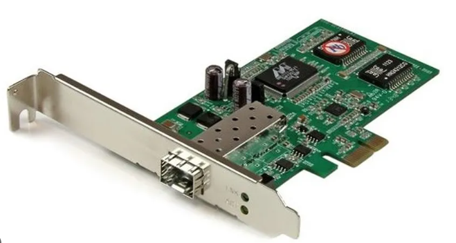

**Figura 20 — Placa de rede.** Interface responsável por permitir que o computador se comunique com a rede.

Cada interface de rede possui um endereço MAC, usado na camada de enlace.

## 10.2 — Cabos de rede

Cabos transportam dados entre dispositivos. Em redes locais, o tipo mais comum é o cabo Ethernet de par trançado, com conector RJ45.

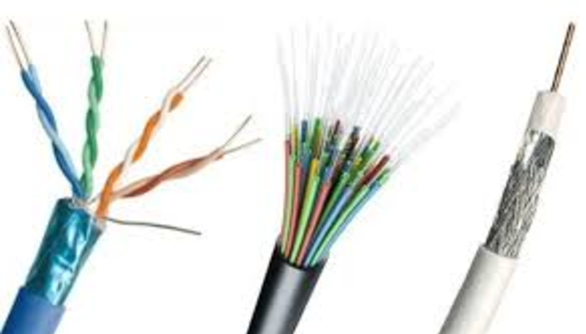

**Figura 21 — Cabos de rede.** Cabos de par trançado, fibra óptica e coaxial aparecem em contextos diferentes.

Tipos comuns:

- **Par trançado:** comum em redes locais, usa conector RJ45.
- **Fibra óptica:** transmite luz, oferece alta velocidade e maior alcance.
- **Coaxial:** comum em TV a cabo e redes antigas.

## 10.3 — Padrões T568A e T568B

Os padrões T568A e T568B definem a ordem dos fios no conector RJ45.

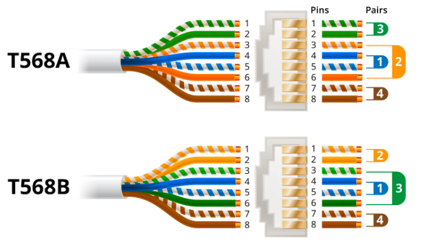

**Figura 22 — Padrões de crimpagem T568A e T568B.** O importante é manter consistência entre as pontas conforme o tipo de cabo desejado.

T568A:

1. branco-verde
2. verde
3. branco-laranja
4. azul
5. branco-azul
6. laranja
7. branco-marrom
8. marrom

T568B:

1. branco-laranja
2. laranja
3. branco-verde
4. azul
5. branco-azul
6. verde
7. branco-marrom
8. marrom

Em cabos diretos, as duas pontas seguem o mesmo padrão. Em cabos crossover, uma ponta usa T568A e a outra T568B. Em equipamentos modernos, o recurso Auto-MDIX costuma detectar e ajustar automaticamente, reduzindo a necessidade de cabo crossover.

## 10.4 — Hub

Um hub repete os dados recebidos para todas as portas.

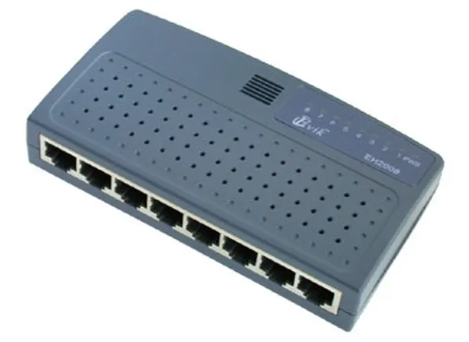

**Figura 23 — Hub.** Equipamento simples que replica tráfego para todos os dispositivos conectados.

Hubs são pouco usados em redes modernas porque geram tráfego desnecessário e não aprendem endereços MAC.

## 10.5 — Switch

Um switch encaminha quadros apenas para a porta correta, com base em endereços MAC.

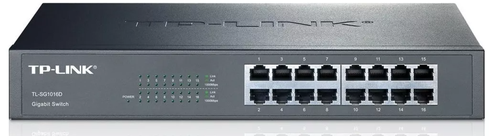

**Figura 24 — Switch.** Equipamento usado para conectar dispositivos em uma LAN de forma mais eficiente que um hub.

Switches são fundamentais em redes locais porque reduzem colisões e melhoram o uso da rede.

## 10.6 — Roteador

Um roteador conecta redes diferentes e encaminha pacotes entre elas. Em uma casa, o roteador conecta a rede local à rede do provedor de Internet.

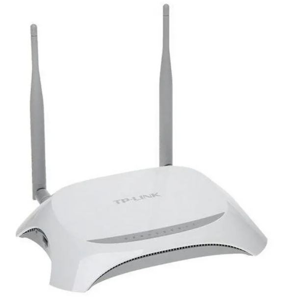

**Figura 25 — Roteador/access point residencial.** Em equipamentos domésticos, funções de roteador, switch, NAT, firewall e Wi-Fi podem estar no mesmo aparelho.

## 10.7 — Modem

Um modem adapta o sinal da rede local ao meio usado pelo provedor, como cabo, DSL ou fibra. Em fibra óptica, muitas vezes o equipamento é chamado de ONT.

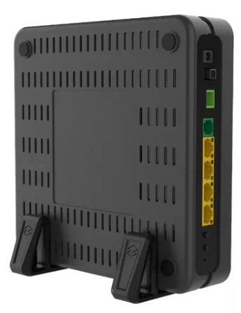

**Figura 26 — Modem.** Equipamento usado para conectar a rede local à infraestrutura do provedor.

## 10.8 — Access point

Um access point fornece conectividade Wi-Fi. Ele conecta dispositivos sem fio à rede cabeada.

Em roteadores domésticos, o access point costuma vir integrado. Em redes corporativas, APs podem ser equipamentos separados, gerenciados centralmente.

## 10.9 — Resumo do capítulo

Placas de rede conectam dispositivos. Cabos transportam dados. Hubs repetem tráfego. Switches encaminham com base em MAC. Roteadores conectam redes. Modems/ONTs conectam a rede local ao provedor. Access points fornecem Wi-Fi.

## 10.10 — Exercícios

1. Qual a diferença entre hub e switch?
2. Qual a diferença entre switch e roteador?
3. O que é um cabo direto?
4. Para que serve um access point?

---

# Capítulo 11 — Tipos de redes

Redes podem ser classificadas conforme alcance, finalidade e tamanho.

Ao final deste capítulo, você será capaz de:

- diferenciar LAN, MAN, WAN e PAN;
- associar cada tipo de rede a exemplos reais;
- entender onde a Internet se encaixa nessa classificação.

## 11.1 — LAN

LAN significa **Local Area Network**. É uma rede local, geralmente limitada a uma casa, escritório, laboratório, escola ou empresa.

Exemplos:

- rede Wi-Fi de casa;
- rede cabeada de um escritório;
- rede interna de um laboratório;
- rede de uma pequena empresa.

## 11.2 — MAN

MAN significa **Metropolitan Area Network**. Ela conecta redes dentro de uma região metropolitana, como uma cidade.

Exemplos:

- rede de uma universidade com campi na mesma cidade;
- rede de uma prefeitura conectando prédios públicos;
- infraestrutura metropolitana de fibra.

## 11.3 — WAN

WAN significa **Wide Area Network**. Ela cobre grandes distâncias geográficas, conectando cidades, estados, países ou continentes.

A Internet é o maior exemplo de WAN.

Exemplos:

- filiais de uma empresa conectadas entre países;
- links entre data centers;
- backbones de provedores;
- cabos submarinos intercontinentais.

## 11.4 — PAN

PAN significa **Personal Area Network**. É uma rede de curto alcance ao redor de uma pessoa.

Exemplos:

- smartphone conectado a smartwatch;
- fone Bluetooth conectado ao notebook;
- pagamento por NFC;
- dispositivos vestíveis conectados ao celular.

## 11.5 — Comparação rápida

| Tipo | Alcance | Exemplos |
|---|---|---|
| PAN | Pessoal | Bluetooth, NFC, smartwatch |
| LAN | Local | Casa, escritório, escola |
| MAN | Cidade/região | Rede metropolitana, campi |
| WAN | Grande distância | Internet, filiais globais |

## 11.6 — Resumo do capítulo

PAN, LAN, MAN e WAN classificam redes por alcance. Para desenvolvimento backend, a diferença mais importante é entender se o serviço está local, dentro da rede interna, em outra rede privada ou acessível pela Internet pública.

## 11.7 — Exercícios

1. A rede Wi-Fi da sua casa é PAN, LAN, MAN ou WAN?
2. A Internet é qual tipo de rede?
3. Dê um exemplo real de PAN.

---

# Capítulo 12 — Ferramentas de diagnóstico

Saber diagnosticar problemas é uma das habilidades mais importantes em redes. Com poucos comandos, é possível descobrir se o problema está no host, no DNS, na rota, na porta ou no serviço.

Ao final deste capítulo, você será capaz de:

- usar `ping` para testar conectividade;
- usar `traceroute` ou `tracert` para analisar rota;
- usar `nslookup` ou `dig` para investigar DNS;
- interpretar informações básicas de `ipconfig` e `ip addr`;
- usar ferramentas úteis para backend.

## 12.1 — Ping

`ping` testa conectividade usando mensagens ICMP Echo Request e Echo Reply.

```bash
ping google.com
```

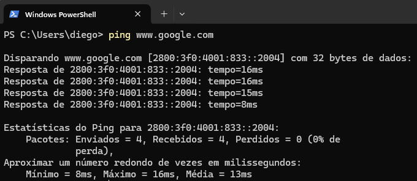

**Figura 27 — Saída do comando ping.** A ferramenta mostra tempo de resposta e perda de pacotes.

O `ping` ajuda a responder perguntas como:

- o host responde?
- há perda de pacotes?
- a latência está alta?
- o DNS resolveu o nome para um IP?

## 12.2 — Traceroute / tracert

`traceroute` mostra o caminho aproximado até o destino, exibindo saltos intermediários.

No Linux/macOS:

```bash
traceroute google.com
```

No Windows:

```powershell
tracert google.com
```

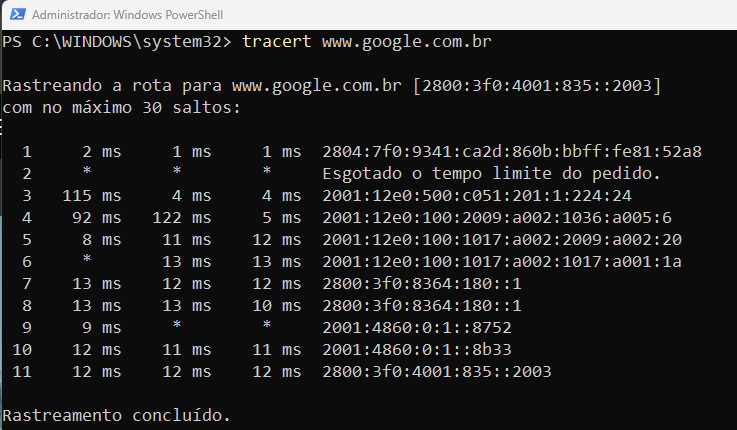

**Figura 28 — Saída de traceroute/tracert.** Cada linha representa um salto no caminho até o destino.

A ferramenta usa o campo TTL para provocar respostas de roteadores intermediários. Dependendo do sistema e da implementação, pode usar UDP, ICMP ou TCP.

## 12.3 — nslookup e dig

`nslookup` consulta servidores DNS.

```bash
nslookup google.com
```

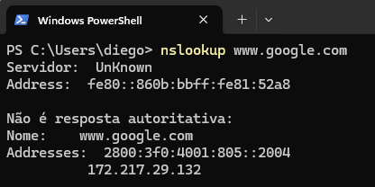

**Figura 29 — Saída de nslookup.** Mostra o servidor DNS consultado e os endereços associados ao domínio.

No Linux, `dig` costuma oferecer uma saída mais detalhada:

```bash
dig google.com
```

Se aparece “resposta não autoritativa”, significa que a resposta veio de cache ou de um resolvedor que não é o servidor autoritativo do domínio.

## 12.4 — ipconfig /all

No Windows, `ipconfig /all` mostra detalhes das interfaces de rede.

```powershell
ipconfig /all
```

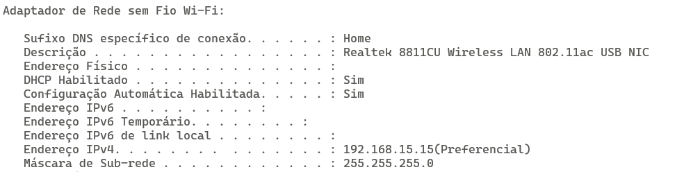

**Figura 30 — Saída de ipconfig.** Mostra informações como endereço físico, IPv4, máscara, DHCP e outros dados.

Informações importantes:

- endereço IPv4;
- máscara de sub-rede;
- gateway padrão;
- servidores DNS;
- endereço MAC;
- DHCP habilitado ou não.

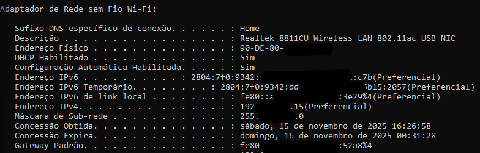

**Figura 31 — Detalhes de configuração de rede.** A saída pode variar conforme adaptador e sistema.

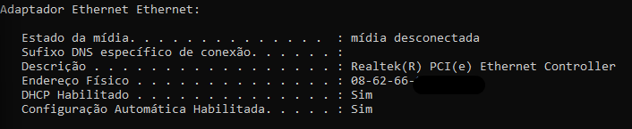

**Figura 32 — Adaptador Ethernet desconectado.** Quando a mídia aparece desconectada, o cabo ou interface física pode não estar ativo.

## 12.5 — Comandos úteis para backend

Testar uma API:

```bash
curl -i https://api.exemplo.com/health
```

Ver se uma porta está aberta localmente:

```bash
ss -tuna | grep 8000
```

Testar resolução DNS:

```bash
nslookup api.exemplo.com
```

Testar rota:

```bash
traceroute api.exemplo.com
```

Testar conexão TLS:

```bash
openssl s_client -connect api.exemplo.com:443 -servername api.exemplo.com
```

## 12.6 — Ordem prática de diagnóstico

Quando uma API ou site não responde, siga uma ordem lógica:

1. **A máquina tem rede?** Verifique Wi-Fi/cabo/IP.
2. **O domínio resolve?** Use `nslookup` ou `dig`.
3. **O destino responde?** Use `ping`, quando permitido.
4. **A rota parece normal?** Use `traceroute`.
5. **A porta está acessível?** Use `curl`, `telnet`, `nc` ou `openssl`.
6. **O serviço está rodando?** Use `ss`, `systemctl`, logs ou ferramentas do container.
7. **Há firewall, proxy ou balanceador no caminho?** Verifique regras e logs.
8. **A aplicação está retornando erro?** Leia status code, corpo da resposta e logs.

## 12.7 — O que pode dar errado?

`ping` pode falhar mesmo quando o serviço está funcionando, porque ICMP pode ser bloqueado. `traceroute` pode mostrar saltos com timeout porque roteadores podem não responder a mensagens de diagnóstico. `nslookup` pode resolver corretamente, mas o serviço estar fora do ar. Por isso, nenhuma ferramenta sozinha prova tudo.

## 12.8 — Resumo do capítulo

Ferramentas de diagnóstico ajudam a localizar o ponto da falha. O segredo é combinar informações: DNS, rota, conectividade, porta, TLS, status HTTP e logs da aplicação.

## 12.9 — Exercícios

1. Execute `nslookup google.com` e identifique o servidor DNS usado.
2. Execute `ping google.com` e observe a latência média.
3. Execute `tracert google.com` ou `traceroute google.com` e conte quantos saltos aparecem.
4. Use `curl -I https://example.com` e identifique o código HTTP retornado.

---

# Capítulo 13 — Boas práticas para quem desenvolve backend

Redes não são apenas assunto de infraestrutura. Todo desenvolvedor backend lida com rede ao criar APIs, integrar serviços, acessar bancos remotos, consumir filas, configurar Docker, usar cloud ou investigar timeouts.

Ao final deste capítulo, você será capaz de:

- aplicar conceitos de rede em problemas de backend;
- interpretar erros comuns de conexão;
- reconhecer práticas seguras em APIs e serviços;
- pensar em observabilidade de comunicação.

## 13.1 — Timeouts são obrigatórios

Nunca faça chamadas HTTP ou conexões externas sem timeout. Sem timeout, uma aplicação pode ficar presa aguardando resposta indefinidamente.

Exemplo conceitual:

```python
requests.get("https://api.exemplo.com", timeout=5)
```

Timeouts protegem sua aplicação contra lentidão de terceiros, falhas de rede e serviços indisponíveis.

## 13.2 — Retry precisa de cuidado

Repetir uma requisição pode ajudar em falhas temporárias, mas pode causar efeitos duplicados se a operação não for idempotente.

É mais seguro repetir `GET`, `PUT` e `DELETE` do que repetir `POST`, a menos que a API implemente chave de idempotência.

## 13.3 — Logs devem incluir contexto

Ao registrar falhas de rede, inclua:

- URL ou serviço chamado;
- método HTTP;
- status code;
- tempo de resposta;
- timeout configurado;
- erro retornado;
- correlation ID ou request ID, quando existir.

## 13.4 — Segurança básica

Boas práticas:

- use HTTPS em produção;
- não exponha serviços internos sem necessidade;
- proteja portas administrativas;
- use firewall e security groups;
- não coloque segredos em URLs;
- prefira tokens em headers;
- monitore certificados;
- valide CORS no backend quando houver navegador envolvido.

## 13.5 — Saúde do serviço

APIs costumam expor endpoints de saúde:

```http
GET /health
GET /ready
GET /live
```

Esses endpoints ajudam balanceadores, Kubernetes e ferramentas de monitoramento a decidir se a aplicação está viva e pronta para receber tráfego.

## 13.6 — Resumo do capítulo

Backend depende de rede o tempo todo. Entender DNS, HTTP, TLS, portas, TCP, timeouts e balanceadores torna mais fácil investigar incidentes e escrever sistemas mais resilientes.

## 13.7 — Desafios

1. Crie um checklist de diagnóstico para quando uma API externa der timeout.
2. Pesquise o que é circuit breaker.
3. Pesquise o que é idempotency key em APIs de pagamento.
4. Explique por que health check não deve depender de todos os serviços externos.

---

# Referências bibliográficas

As referências abaixo foram usadas para revisar, corrigir e complementar tecnicamente esta apostila.

- FIELDING, Roy T.; RESCHKE, Julian. **RFC 9110: HTTP Semantics**. IETF, 2022. Disponível em: <https://www.rfc-editor.org/rfc/rfc9110.html>.
- BELSHE, Mike; PEON, Roberto; THOMSON, Martin. **RFC 9113: HTTP/2**. IETF, 2022. Disponível em: <https://www.rfc-editor.org/rfc/rfc9113.html>.
- BISHOP, Mike. **RFC 9114: HTTP/3**. IETF, 2022. Disponível em: <https://www.rfc-editor.org/rfc/rfc9114.html>.
- IYENGAR, Jana; THOMSON, Martin. **RFC 9000: QUIC: A UDP-Based Multiplexed and Secure Transport**. IETF, 2021. Disponível em: <https://www.rfc-editor.org/rfc/rfc9000.html>.
- EDDY, Wesley. **RFC 9293: Transmission Control Protocol (TCP)**. IETF, 2022. Disponível em: <https://www.rfc-editor.org/rfc/rfc9293.html>.
- POSTEL, Jon. **RFC 768: User Datagram Protocol**. IETF, 1980. Disponível em: <https://www.rfc-editor.org/rfc/rfc768.html>.
- POSTEL, Jon. **RFC 791: Internet Protocol**. IETF, 1981. Disponível em: <https://www.rfc-editor.org/rfc/rfc791.html>.
- DEERING, Steve; HINDEN, Bob. **RFC 8200: Internet Protocol, Version 6 (IPv6) Specification**. IETF, 2017. Disponível em: <https://www.rfc-editor.org/rfc/rfc8200.html>.
- REKHTER, Yakov et al. **RFC 1918: Address Allocation for Private Internets**. IETF, 1996. Disponível em: <https://www.rfc-editor.org/rfc/rfc1918.html>.
- FULLER, Vince; LI, Tony. **RFC 4632: Classless Inter-domain Routing (CIDR)**. IETF, 2006. Disponível em: <https://www.rfc-editor.org/rfc/rfc4632.html>.
- DIERKS, Tim; RESCORLA, Eric. **RFC 8446: The Transport Layer Security (TLS) Protocol Version 1.3**. IETF, 2018. Disponível em: <https://www.rfc-editor.org/rfc/rfc8446.html>.
- MOCKAPETRIS, Paul. **RFC 1034: Domain Names — Concepts and Facilities**. IETF, 1987. Disponível em: <https://www.rfc-editor.org/rfc/rfc1034.html>.
- MOCKAPETRIS, Paul. **RFC 1035: Domain Names — Implementation and Specification**. IETF, 1987. Disponível em: <https://www.rfc-editor.org/rfc/rfc1035.html>.
- YLONEN, Tatu; LONVICK, Chris. **RFC 4251: The Secure Shell (SSH) Protocol Architecture**. IETF, 2006. Disponível em: <https://www.rfc-editor.org/rfc/rfc4251.html>.
- POSTEL, Jon; REYNOLDS, Joyce. **RFC 959: File Transfer Protocol (FTP)**. IETF, 1985. Disponível em: <https://www.rfc-editor.org/rfc/rfc959.html>.
- KLENSIN, John. **RFC 5321: Simple Mail Transfer Protocol**. IETF, 2008. Disponível em: <https://www.rfc-editor.org/rfc/rfc5321.html>.
- POSTEL, Jon. **RFC 792: Internet Control Message Protocol**. IETF, 1981. Disponível em: <https://www.rfc-editor.org/rfc/rfc792.html>.
- MDN WEB DOCS. **An overview of HTTP**. Disponível em: <https://developer.mozilla.org/en-US/docs/Web/HTTP/Guides/Overview>.
- MDN WEB DOCS. **HTTP response status codes**. Disponível em: <https://developer.mozilla.org/en-US/docs/Web/HTTP/Reference/Status>.
- CLOUDFLARE. **What is the TLS handshake?** Disponível em: <https://www.cloudflare.com/learning/ssl/what-happens-in-a-tls-handshake/>.
- OWASP. **HTTP Headers Cheat Sheet**. Disponível em: <https://cheatsheetseries.owasp.org/cheatsheets/HTTP_Headers_Cheat_Sheet.html>.
- IANA. **Service Name and Transport Protocol Port Number Registry**. Disponível em: <https://www.iana.org/assignments/service-names-port-numbers/service-names-port-numbers.xhtml>.
- Documento-base fornecido pelo autor: **Rede de computadores.docx**.

# Leituras recomendadas

As obras abaixo são úteis para aprofundamento, especialmente em cursos de redes de computadores:

- KUROSE, James F.; ROSS, Keith W. **Redes de Computadores e a Internet: uma abordagem top-down**.
- TANENBAUM, Andrew S.; WETHERALL, David J. **Redes de Computadores**.
