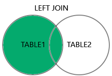
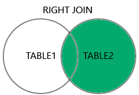
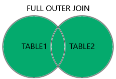
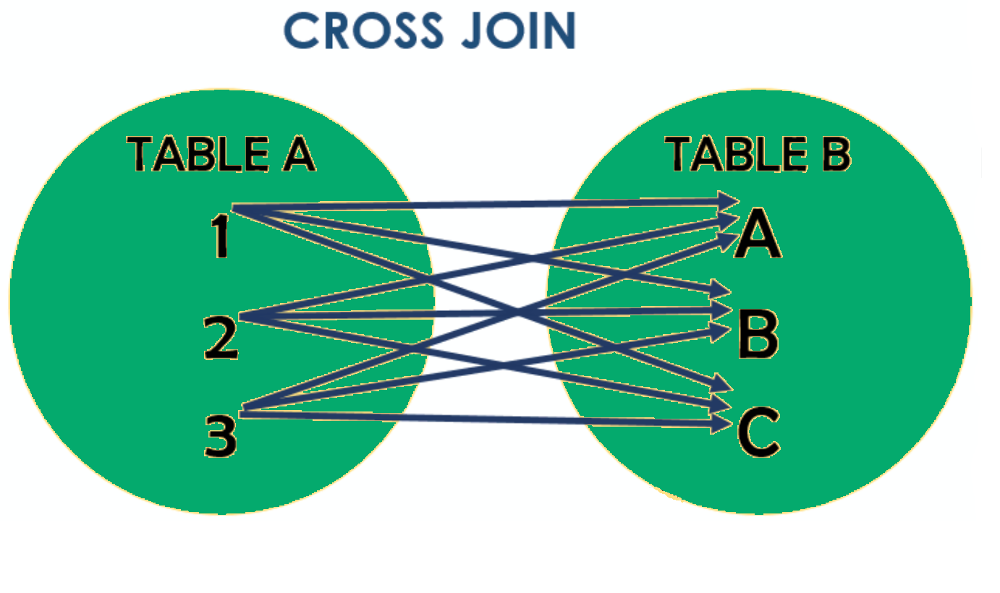

# SQL — Apostila Didática

> Material refatorado para estudo, revisão e publicação no GitHub.

## Sobre esta apostila

Esta apostila apresenta os principais fundamentos de SQL de forma prática e progressiva. A ideia não é decorar comandos isolados, mas entender como uma consulta é pensada: quais dados existem, de qual tabela eles vêm, quais filtros devem ser aplicados, como os resultados podem ser agrupados, ordenados e combinados com outras tabelas.

O foco principal está em consultas com `SELECT`, porque esse é o comando mais usado no dia a dia para investigar dados, criar relatórios, validar regras de negócio e apoiar o desenvolvimento de APIs e sistemas backend. Ao final, a apostila também apresenta os comandos básicos de criação de tabelas, manipulação de dados, permissões e transações.

## Como estudar por esta apostila

Leia os capítulos na ordem. Sempre que aparecer um bloco de código, tente imaginar qual será a tabela de entrada e qual será o resultado gerado. SQL fica muito mais claro quando você pensa em tabelas antes de pensar apenas em comandos.

Os exemplos usam uma sintaxe próxima do SQL padrão, com observações sobre diferenças entre bancos como PostgreSQL, MySQL, SQLite e SQL Server quando isso for importante. Em projetos reais, sempre consulte a documentação do SGBD usado pela aplicação.

## Organização das imagens

As imagens extraídas do material original foram mantidas como apoio visual para os tipos de `JOIN`. Para que o Markdown renderize corretamente no GitHub, mantenha esta estrutura de pastas:

```text
.
├── sql_apostila_didatica.md
└── images/
    └── sql/
        ├── inner_join.png
        ├── left_join.png
        ├── right_join.png
        ├── full_outer_join.png
        └── cross_join.png
```

## Índice

1. [Capítulo 1 — O que é SQL](#capítulo-1--o-que-é-sql)
2. [Capítulo 2 — Consultas com SELECT](#capítulo-2--consultas-com-select)
3. [Capítulo 3 — Filtros com WHERE](#capítulo-3--filtros-com-where)
4. [Capítulo 4 — Ordenação, limite e valores únicos](#capítulo-4--ordenação-limite-e-valores-únicos)
5. [Capítulo 5 — Operadores lógicos e busca composta](#capítulo-5--operadores-lógicos-e-busca-composta)
6. [Capítulo 6 — Aliases com AS](#capítulo-6--aliases-com-as)
7. [Capítulo 7 — Funções de agregação, GROUP BY e HAVING](#capítulo-7--funções-de-agregação-group-by-e-having)
8. [Capítulo 8 — Funções úteis em SQL](#capítulo-8--funções-úteis-em-sql)
9. [Capítulo 9 — CASE e lógica condicional](#capítulo-9--case-e-lógica-condicional)
10. [Capítulo 10 — Combinando resultados com UNION](#capítulo-10--combinando-resultados-com-union)
11. [Capítulo 11 — Subconsultas](#capítulo-11--subconsultas)
12. [Capítulo 12 — JOINs](#capítulo-12--joins)
13. [Capítulo 13 — DDL, DML, DCL e TCL](#capítulo-13--ddl-dml-dcl-e-tcl)
14. [Capítulo 14 — Boas práticas e erros comuns](#capítulo-14--boas-práticas-e-erros-comuns)
15. [Referências bibliográficas](#referências-bibliográficas)

---

# Capítulo 1 — O que é SQL

SQL, sigla para *Structured Query Language*, é uma linguagem usada para trabalhar com bancos de dados relacionais. Com SQL, conseguimos consultar dados, inserir novos registros, atualizar informações, excluir linhas, criar tabelas, definir permissões e controlar transações.

Em um banco relacional, os dados são organizados principalmente em tabelas. Cada tabela possui colunas, que representam os atributos, e linhas, que representam os registros. Por exemplo, uma tabela `clientes` pode ter as colunas `id`, `nome`, `email` e `data_cadastro`. Cada cliente cadastrado será uma linha dessa tabela.

Ao final deste capítulo, você será capaz de:

- explicar o que é SQL;
- diferenciar tabela, coluna e linha;
- entender as principais categorias de comandos SQL;
- reconhecer por que `SELECT` é tão importante no dia a dia.

## 1.1 — O problema que SQL resolve

Imagine uma aplicação de e-commerce. Ela precisa armazenar clientes, produtos, pedidos, pagamentos e endereços. Esses dados não podem ficar soltos em arquivos sem organização. Eles precisam ser armazenados de forma estruturada, segura e consultável.

SQL resolve esse problema permitindo fazer perguntas ao banco de dados. Exemplos:

```sql
SELECT nome, email
FROM clientes;
```

Essa consulta pede ao banco para buscar os nomes e e-mails cadastrados na tabela `clientes`. Em vez de percorrer manualmente arquivos ou estruturas complexas, escrevemos uma consulta declarativa dizendo o que queremos obter.

## 1.2 — Principais categorias de comandos SQL

Os comandos SQL costumam ser agrupados por finalidade. Essa divisão ajuda a entender o objetivo de cada comando.

| Categoria | Nome | Para que serve | Exemplos |
|---|---|---|---|
| DQL | Data Query Language | Consultar dados | `SELECT` |
| DML | Data Manipulation Language | Inserir, alterar e excluir dados | `INSERT`, `UPDATE`, `DELETE` |
| DDL | Data Definition Language | Criar e alterar estruturas | `CREATE`, `ALTER`, `DROP` |
| DCL | Data Control Language | Controlar permissões | `GRANT`, `REVOKE` |
| TCL | Transaction Control Language | Controlar transações | `BEGIN`, `COMMIT`, `ROLLBACK` |

Nesta apostila, vamos começar pelo `SELECT`, porque consultar dados é a base para entender quase todo o restante.

## 1.3 — Dado, tabela e relação

Uma tabela representa um conjunto de registros do mesmo tipo. Uma tabela `produtos`, por exemplo, pode armazenar produtos vendidos por uma empresa.

| id | nome_produto | preco |
|---:|---|---:|
| 1 | Tablet | 350.00 |
| 2 | Monitor | 400.00 |
| 3 | Câmera | 250.00 |

Cada coluna possui um tipo de dado. A coluna `id` costuma ser numérica, `nome_produto` costuma ser texto, e `preco` costuma ser numérico decimal. Em bancos relacionais, tabelas diferentes podem se relacionar por chaves, como `id_cliente`, `id_pedido` ou `cod_cargo`.

## 1.4 — Resumo do capítulo

SQL é a linguagem usada para trabalhar com bancos relacionais. Sua função mais comum no dia a dia é consultar dados com `SELECT`, mas ela também permite modificar dados, criar estruturas, controlar permissões e gerenciar transações.

## 1.5 — Exercícios

1. Explique com suas palavras a diferença entre tabela, coluna e linha.
2. Diga qual categoria SQL representa cada comando: `SELECT`, `INSERT`, `CREATE TABLE`, `COMMIT` e `GRANT`.
3. Pense em uma tabela para um sistema de biblioteca. Quais colunas ela poderia ter?

## 1.6 — Fixando o conhecimento

- SQL trabalha principalmente com dados organizados em tabelas.
- `SELECT` consulta dados.
- `INSERT`, `UPDATE` e `DELETE` modificam dados.
- `CREATE`, `ALTER` e `DROP` modificam a estrutura do banco.

---

# Capítulo 2 — Consultas com SELECT

O comando `SELECT` é usado para buscar dados em uma ou mais tabelas. Ele permite escolher quais colunas serão retornadas, de qual tabela os dados serão lidos e quais condições devem ser aplicadas.

Ao final deste capítulo, você será capaz de:

- escrever consultas simples com `SELECT`;
- selecionar todas as colunas de uma tabela;
- selecionar apenas algumas colunas;
- entender a diferença entre `SELECT *` e seleção explícita de colunas.

## 2.1 — O problema

Quando uma tabela cresce, raramente precisamos visualizar todos os seus dados. Em muitos casos, queremos apenas algumas colunas. Por exemplo, em uma tela de clientes, talvez a aplicação precise mostrar apenas nome e e-mail, não todos os dados cadastrais.

## 2.2 — Selecionando todas as colunas

```sql
SELECT *
FROM tabela_clientes;
```

O `*` significa “todas as colunas”. Essa consulta retorna todas as colunas e todas as linhas da tabela `tabela_clientes`.

Esse formato é útil para exploração rápida durante estudos ou investigação inicial. Em sistemas reais, porém, prefira declarar as colunas explicitamente, porque isso evita trazer dados desnecessários e deixa a intenção da consulta mais clara.

## 2.3 — Selecionando colunas específicas

```sql
SELECT nome, email
FROM tabela_clientes;
```

Aqui, o banco retorna apenas as colunas `nome` e `email`. Mesmo que a tabela tenha outras colunas, elas não aparecem no resultado.

Esse estilo é mais profissional porque reduz o tráfego de dados, melhora a legibilidade e diminui o risco de expor informações que não deveriam ser consumidas por uma aplicação, relatório ou API.

## 2.4 — Ordem lógica de uma consulta SELECT

Embora escrevamos `SELECT` no início da consulta, o banco não interpreta tudo exatamente nessa ordem lógica. Uma forma didática de pensar é:

1. `FROM`: identifica de onde os dados vêm.
2. `WHERE`: filtra linhas individuais.
3. `GROUP BY`: agrupa linhas.
4. `HAVING`: filtra grupos.
5. `SELECT`: define as colunas de saída.
6. `DISTINCT`: remove duplicatas.
7. `ORDER BY`: ordena o resultado.
8. `LIMIT`/`OFFSET`: restringe a quantidade final de linhas.

Essa ordem ajuda a entender por que `WHERE` não consegue filtrar diretamente o resultado de uma agregação, mas `HAVING` consegue.

## 2.5 — O que pode dar errado?

Um erro comum é usar `SELECT *` em produção sem necessidade.

```sql
SELECT *
FROM clientes;
```

Essa consulta pode retornar colunas sensíveis, como documentos, telefones ou dados internos. Uma versão melhor seria:

```sql
SELECT id, nome, email
FROM clientes;
```

Agora a consulta deixa claro quais dados serão usados.

## 2.6 — Resumo do capítulo

`SELECT` define quais dados serão retornados. O `*` seleciona todas as colunas, mas em código profissional é melhor escolher explicitamente as colunas necessárias.

## 2.7 — Exercícios

1. Escreva uma consulta que retorne todas as colunas de uma tabela chamada `produtos`.
2. Escreva uma consulta que retorne apenas `nome_produto` e `preco` da tabela `produtos`.
3. Explique por que `SELECT *` pode ser ruim em uma API.

---

# Capítulo 3 — Filtros com WHERE

A cláusula `WHERE` filtra linhas. Ela permite retornar apenas registros que atendem a uma condição.

Ao final deste capítulo, você será capaz de:

- filtrar dados por igualdade, comparação e texto;
- usar `LIKE` para busca por padrões;
- filtrar valores nulos com `IS NULL` e `IS NOT NULL`;
- entender por que `NULL` precisa de tratamento especial.

## 3.1 — O problema

Em uma tabela com milhares de produtos, geralmente não queremos todos. Podemos querer apenas produtos caros, clientes de uma cidade específica ou pedidos com status pendente.

## 3.2 — Filtro por comparação

```sql
SELECT nome, preco
FROM produtos
WHERE preco > 100.00;
```

Essa consulta retorna apenas os produtos cujo preço é maior que `100.00`. A condição fica dentro do `WHERE`.

Outro exemplo:

```sql
SELECT *
FROM fornecedores
WHERE pais_origem = 'China';
```

Aqui, o banco retorna apenas fornecedores cujo país de origem seja exatamente `China`.

## 3.3 — Operadores de comparação

| Operador | Significado | Exemplo |
|---|---|---|
| `=` | igual a | `status = 'Pendente'` |
| `<>` ou `!=` | diferente de | `status <> 'Cancelado'` |
| `>` | maior que | `preco > 100` |
| `<` | menor que | `preco < 100` |
| `>=` | maior ou igual | `idade >= 18` |
| `<=` | menor ou igual | `preco <= 50` |

O operador `<>` é o operador de diferença do SQL padrão. Muitos bancos também aceitam `!=`, mas `<>` costuma ser mais portável.

## 3.4 — Buscando padrões com LIKE

O `LIKE` é usado para buscar padrões em textos. Ele costuma ser combinado com caracteres curinga.

| Curinga | Significado |
|---|---|
| `%` | zero, um ou vários caracteres |
| `_` | exatamente um caractere |

```sql
SELECT *
FROM treinamento
WHERE curso LIKE 'SQL%';
```

Essa consulta busca cursos que começam com `SQL`, como `SQL Básico`, `SQL para APIs` ou `SQL Avançado`.

```sql
SELECT *
FROM treinamento
WHERE curso LIKE '%realizar%';
```

Essa consulta busca cursos que contêm a palavra `realizar` em qualquer posição.

```sql
SELECT *
FROM colaboradores
WHERE nome LIKE '%Silva';
```

Essa consulta busca nomes que terminam com `Silva`, como `Ana Silva` ou `João da Silva`.

## 3.5 — Atenção com maiúsculas e minúsculas

A sensibilidade a maiúsculas e minúsculas depende do banco, da collation e da configuração da coluna. Em PostgreSQL, `LIKE` costuma ser sensível a maiúsculas e minúsculas, enquanto `ILIKE` é usado para buscas case-insensitive. Em MySQL e SQL Server, o comportamento pode variar conforme a collation configurada.

Quando a portabilidade for importante, deixe essa regra explícita no projeto e teste no banco real usado pela aplicação.

## 3.6 — Filtrando valores nulos

`NULL` representa ausência de valor, valor desconhecido ou informação não preenchida. Ele não deve ser comparado com `=`.

Forma incorreta:

```sql
SELECT *
FROM historico_emprego
WHERE data_termino = NULL;
```

Forma correta:

```sql
SELECT *
FROM historico_emprego
WHERE data_termino IS NULL;
```

Essa consulta retorna colaboradores ativos, considerando que pessoas sem `data_termino` ainda estão vinculadas à empresa.

Para buscar registros preenchidos:

```sql
SELECT *
FROM historico_emprego
WHERE data_termino IS NOT NULL;
```

Essa consulta retorna registros com data de término preenchida, como ex-colaboradores ou contratos finalizados.

## 3.7 — O que pode dar errado?

Um erro comum é tentar buscar nulos com `=`:

```sql
WHERE data_termino = NULL
```

O correto é:

```sql
WHERE data_termino IS NULL
```

Outro erro comum é usar `LIKE '%texto%'` em tabelas grandes sem entender o impacto. Esse tipo de filtro pode dificultar o uso eficiente de índices, dependendo do banco e da estratégia de indexação.

## 3.8 — Resumo do capítulo

`WHERE` filtra linhas antes do agrupamento. Para textos, `LIKE` permite buscar padrões. Para valores ausentes, use `IS NULL` ou `IS NOT NULL`.

## 3.9 — Exercícios

1. Busque todos os produtos com preço maior que `50.00`.
2. Busque todos os clientes cujo nome termine com `Santos`.
3. Busque todos os colaboradores sem data de desligamento.
4. Explique por que `coluna = NULL` não é a forma correta de filtrar valores nulos.

---

# Capítulo 4 — Ordenação, limite e valores únicos

Depois de filtrar dados, muitas vezes precisamos ordenar os resultados, limitar a quantidade de linhas ou remover duplicatas.

Ao final deste capítulo, você será capaz de:

- usar `ORDER BY`;
- ordenar com `ASC` e `DESC`;
- limitar resultados com `LIMIT`;
- usar `DISTINCT` para retornar valores únicos.

## 4.1 — ORDER BY

`ORDER BY` ordena o resultado da consulta.

```sql
SELECT nome_produto, preco
FROM produtos
ORDER BY nome_produto;
```

Por padrão, a ordenação é crescente. Para textos, isso normalmente significa ordem alfabética. Para números, do menor para o maior.

Considerando a tabela:

| id | nome_produto | preco |
|---:|---|---:|
| 1 | Tablet | 350.00 |
| 2 | Monitor | 400.00 |
| 3 | Câmera | 250.00 |

O resultado ordenado por `nome_produto` seria:

| nome_produto | preco |
|---|---:|
| Câmera | 250.00 |
| Monitor | 400.00 |
| Tablet | 350.00 |

## 4.2 — ASC

`ASC` significa *ascending*, ou seja, ordem crescente. Como é o padrão, seu uso é opcional.

```sql
SELECT nome_produto, preco
FROM produtos
ORDER BY preco ASC;
```

Resultado:

| nome_produto | preco |
|---|---:|
| Câmera | 250.00 |
| Tablet | 350.00 |
| Monitor | 400.00 |

## 4.3 — DESC

`DESC` significa *descending*, ou seja, ordem decrescente.

```sql
SELECT nome_produto, preco
FROM produtos
ORDER BY preco DESC;
```

Resultado:

| nome_produto | preco |
|---|---:|
| Monitor | 400.00 |
| Tablet | 350.00 |
| Câmera | 250.00 |

## 4.4 — LIMIT

`LIMIT` restringe a quantidade de linhas retornadas.

```sql
SELECT *
FROM historico_emprego
ORDER BY salario DESC
LIMIT 5;
```

Essa consulta retorna os 5 maiores salários. O `ORDER BY` é importante porque, sem ele, o banco pode retornar quaisquer 5 linhas, sem garantia de ordem útil.

Em SQL Server, é comum usar `TOP` ou `OFFSET/FETCH` em vez de `LIMIT`. Em bancos diferentes, confira a sintaxe correta.

## 4.5 — DISTINCT

`DISTINCT` remove duplicatas do resultado.

```sql
SELECT DISTINCT cliente
FROM tabela_de_pedidos;
```

Se um cliente fez vários pedidos, ele apareceria várias vezes em uma consulta comum. Com `DISTINCT`, cada cliente aparece apenas uma vez.

## 4.6 — O que pode dar errado?

Um erro comum é usar `LIMIT` sem `ORDER BY` esperando obter “os maiores” ou “os mais recentes”.

```sql
SELECT *
FROM pedidos
LIMIT 10;
```

Essa consulta retorna 10 linhas, mas não garante que sejam as mais recentes. Para isso, ordene explicitamente:

```sql
SELECT *
FROM pedidos
ORDER BY data_hora_pedido DESC
LIMIT 10;
```

## 4.7 — Resumo do capítulo

`ORDER BY` ordena, `ASC` define ordem crescente, `DESC` define ordem decrescente, `LIMIT` restringe a quantidade de linhas e `DISTINCT` remove duplicatas.

## 4.8 — Exercícios

1. Retorne os 10 produtos mais caros.
2. Retorne os clientes em ordem alfabética.
3. Retorne a lista de cidades únicas cadastradas na tabela `clientes`.

---

# Capítulo 5 — Operadores lógicos e busca composta

Consultas reais raramente têm apenas uma condição. Normalmente, precisamos combinar filtros.

Ao final deste capítulo, você será capaz de:

- combinar condições com `AND` e `OR`;
- negar condições com `NOT`;
- usar `IN` para listas de valores;
- usar `BETWEEN` para intervalos;
- agrupar condições com parênteses.

## 5.1 — AND

`AND` exige que todas as condições sejam verdadeiras.

```sql
SELECT *
FROM pedidos
WHERE total_pedido >= 200
  AND status = 'Pendente';
```

Essa consulta retorna apenas pedidos com valor maior ou igual a `200` e status igual a `Pendente`.

## 5.2 — OR

`OR` exige que pelo menos uma condição seja verdadeira.

```sql
SELECT *
FROM pedidos
WHERE status = 'Pendente'
   OR status = 'Processando';
```

Essa consulta retorna pedidos pendentes ou em processamento.

## 5.3 — IN

`IN` é uma forma mais curta e legível de escrever múltiplos `OR`.

```sql
SELECT *
FROM pedidos
WHERE status IN ('Pendente', 'Cancelado', 'Aprovado');
```

Essa consulta retorna pedidos cujo status esteja dentro da lista informada.

## 5.4 — NOT

`NOT` nega uma condição.

```sql
SELECT *
FROM pedidos
WHERE NOT status = 'Pendente';
```

Essa consulta retorna pedidos cujo status não é `Pendente`. Uma forma equivalente e geralmente mais direta seria:

```sql
SELECT *
FROM pedidos
WHERE status <> 'Pendente';
```

## 5.5 — BETWEEN

`BETWEEN` filtra intervalos e inclui os limites inicial e final.

```sql
SELECT *
FROM pedidos
WHERE data_envio BETWEEN '2023-08-01' AND '2023-09-01';
```

Essa consulta retorna pedidos cuja data de envio esteja entre as duas datas informadas, incluindo ambas. Em consultas com data e hora, tenha cuidado: `'2023-09-01'` pode representar meia-noite do dia 1, dependendo do tipo da coluna e do banco. Para períodos fechados por dia, muitas equipes preferem usar `>=` e `<` no limite final.

## 5.6 — Busca composta com parênteses

Parênteses controlam a ordem de avaliação lógica.

```sql
SELECT *
FROM treinamento
WHERE (curso LIKE 'O direito%' AND instituicao = 'da Rocha')
   OR (curso LIKE 'O conforto%' AND instituicao = 'das Neves');
```

A consulta busca cursos que começam com `O direito` e pertencem à instituição `da Rocha`, ou cursos que começam com `O conforto` e pertencem à instituição `das Neves`.

Sem parênteses, uma consulta com `AND` e `OR` pode retornar resultados inesperados, porque a precedência dos operadores pode não refletir a regra de negócio que você imaginou.

## 5.7 — O que pode dar errado?

Erro comum:

```sql
SELECT *
FROM pedidos
WHERE status = 'Pendente' OR 'Processando';
```

Essa forma não compara a coluna com os dois valores. O correto é:

```sql
SELECT *
FROM pedidos
WHERE status = 'Pendente'
   OR status = 'Processando';
```

Ou melhor:

```sql
SELECT *
FROM pedidos
WHERE status IN ('Pendente', 'Processando');
```

## 5.8 — Resumo do capítulo

`AND` exige todas as condições, `OR` aceita pelo menos uma, `NOT` nega, `IN` compara com uma lista e `BETWEEN` filtra intervalos. Use parênteses quando misturar condições.

## 5.9 — Exercícios

1. Busque pedidos com status `Pendente` ou `Processando` usando `IN`.
2. Busque produtos com preço entre `100` e `500`.
3. Escreva uma consulta que filtre clientes ativos de duas cidades diferentes.

---

# Capítulo 6 — Aliases com AS

`AS` cria apelidos temporários para colunas ou tabelas dentro de uma consulta. Ele não altera o nome real no banco.

Ao final deste capítulo, você será capaz de:

- renomear colunas no resultado;
- usar aliases de tabela;
- evitar ambiguidades em consultas com `JOIN`;
- escrever consultas mais legíveis.

## 6.1 — Alias para colunas

```sql
SELECT informacoes_de_contato AS email_cliente
FROM clientes;
```

A coluna original se chama `informacoes_de_contato`, mas no resultado ela aparece como `email_cliente`. Isso é útil em relatórios, APIs ou consultas em que o nome técnico da coluna não é tão claro.

## 6.2 — Alias para tabelas

```sql
SELECT
  c.nome,
  p.id AS pedido_id,
  p.data_hora_pedido
FROM clientes AS c
INNER JOIN pedidos AS p
  ON c.id = p.id_cliente;
```

Aqui, `clientes` recebe o apelido `c` e `pedidos` recebe o apelido `p`. A partir desse ponto da consulta, as colunas são referenciadas usando esses apelidos.

Isso é importante porque tabelas diferentes podem ter colunas com o mesmo nome, como `id`. Se você escrever apenas `id`, o banco pode não saber de qual tabela essa coluna deve vir.

## 6.3 — AS é sempre obrigatório?

Na maioria dos bancos, `AS` é opcional para aliases de tabela.

```sql
FROM clientes c
```

É comum encontrar essa forma em projetos reais. Mesmo assim, para quem está aprendendo, usar `AS` pode deixar a intenção mais explícita.

## 6.4 — O que pode dar errado?

Depois de criar um alias para a tabela, use o alias, não o nome original.

```sql
SELECT clientes.nome
FROM clientes AS c;
```

Em bancos como PostgreSQL, isso pode gerar erro, porque a tabela passou a ser referenciada pelo alias `c`. O correto é:

```sql
SELECT c.nome
FROM clientes AS c;
```

## 6.5 — Resumo do capítulo

Aliases melhoram a legibilidade e evitam ambiguidades. Para colunas, eles mudam o nome exibido no resultado. Para tabelas, eles criam apelidos usados durante a consulta.

## 6.6 — Exercícios

1. Crie um alias chamado `nome_cliente` para a coluna `nome` da tabela `clientes`.
2. Reescreva uma consulta com `clientes` e `pedidos` usando aliases `c` e `p`.
3. Explique por que aliases são importantes em consultas com tabelas que têm colunas de mesmo nome.

---

# Capítulo 7 — Funções de agregação, GROUP BY e HAVING

Funções de agregação resumem várias linhas em um único valor. Elas são usadas para contar registros, calcular médias, somas, mínimos e máximos.

Ao final deste capítulo, você será capaz de:

- usar `COUNT`, `SUM`, `AVG`, `MIN` e `MAX`;
- agrupar dados com `GROUP BY`;
- filtrar grupos com `HAVING`;
- entender a diferença entre `WHERE` e `HAVING`.

## 7.1 — O problema

Imagine uma tabela de vendas. Você pode querer saber o total vendido por vendedor, o ticket médio, a maior venda do mês ou quantos pedidos existem por status.

Essas perguntas não são respondidas olhando linha por linha. Precisamos resumir dados.

## 7.2 — MAX

```sql
SELECT MAX(faturamento_bruto) AS maior_faturamento
FROM faturamento;
```

Essa consulta retorna o maior valor da coluna `faturamento_bruto`.

## 7.3 — MIN

```sql
SELECT MIN(faturamento_bruto) AS menor_faturamento
FROM faturamento;
```

Essa consulta retorna o menor valor da coluna `faturamento_bruto`.

## 7.4 — AVG

```sql
SELECT AVG(faturamento_bruto) AS media_faturamento_mensal
FROM faturamento;
```

`AVG` calcula a média aritmética dos valores de uma coluna numérica.

## 7.5 — SUM

```sql
SELECT SUM(preco) AS valor_total_estoque
FROM produtos;
```

Essa consulta soma todos os valores da coluna `preco`.

Em um sistema real de estoque, o valor total normalmente seria calculado com preço multiplicado pela quantidade:

```sql
SELECT SUM(preco * quantidade) AS valor_total_estoque
FROM produtos;
```

## 7.6 — COUNT

```sql
SELECT COUNT(*) AS qtd_produtos_caros
FROM produtos
WHERE preco > 50.00;
```

`COUNT(*)` conta linhas. Nesse exemplo, ele conta quantos produtos custam mais de `50.00`.

Atenção: `COUNT(coluna)` conta apenas as linhas em que aquela coluna não é `NULL`. Já `COUNT(*)` conta todas as linhas do resultado.

## 7.7 — GROUP BY

`GROUP BY` agrupa linhas que possuem o mesmo valor em uma ou mais colunas.

```sql
SELECT
  categoria,
  COUNT(*) AS total_de_produtos
FROM produtos
GROUP BY categoria;
```

Essa consulta conta quantos produtos existem em cada categoria.

Resultado esperado:

| categoria | total_de_produtos |
|---|---:|
| Eletrônicos | 15 |
| Roupas | 23 |
| Livros | 8 |

Sem `GROUP BY`, `COUNT(*)` contaria a tabela inteira. Com `GROUP BY categoria`, a contagem é feita separadamente para cada categoria.

## 7.8 — HAVING

`HAVING` filtra grupos depois do agrupamento.

```sql
SELECT
  vendedor_id,
  SUM(valor_venda) AS total_vendas
FROM vendas
GROUP BY vendedor_id
HAVING SUM(valor_venda) > 10000;
```

Essa consulta calcula o total de vendas por vendedor e retorna apenas vendedores cujo total ultrapassa `10000`.

## 7.9 — WHERE vs HAVING

| Cláusula | Atua sobre | Momento lógico | Exemplo |
|---|---|---|---|
| `WHERE` | linhas individuais | antes do agrupamento | `WHERE status = 'Pago'` |
| `HAVING` | grupos agregados | depois do agrupamento | `HAVING SUM(valor) > 10000` |

Use `WHERE` para filtrar dados antes de agrupar. Use `HAVING` para filtrar resultados de agregações.

## 7.10 — O que pode dar errado?

Erro comum:

```sql
SELECT categoria, COUNT(*)
FROM produtos;
```

Se você seleciona `categoria` junto com `COUNT(*)`, precisa explicar como as linhas serão agrupadas. O correto é:

```sql
SELECT categoria, COUNT(*)
FROM produtos
GROUP BY categoria;
```

## 7.11 — Resumo do capítulo

Agregações resumem dados. `GROUP BY` cria grupos, e `HAVING` filtra grupos. `WHERE` filtra linhas antes do agrupamento.

## 7.12 — Exercícios

1. Conte quantos clientes existem por cidade.
2. Calcule o valor total vendido por vendedor.
3. Liste apenas categorias com mais de 10 produtos.
4. Explique a diferença entre `COUNT(*)` e `COUNT(coluna)`.

---

# Capítulo 8 — Funções úteis em SQL

SQL possui funções para manipular textos, números, datas e tipos de dados. Essas funções variam entre bancos, então é importante conhecer a ideia e validar a sintaxe no SGBD usado.

Ao final deste capítulo, você será capaz de:

- aplicar funções de string;
- usar funções numéricas;
- trabalhar com datas e horas;
- converter tipos com `CAST`;
- reconhecer diferenças entre bancos.

## 8.1 — Funções de string

Funções de string ajudam a limpar, padronizar, juntar e extrair partes de textos.

### LENGTH ou LEN

```sql
SELECT nome, LENGTH(cpf) AS digitos_cpf
FROM colaboradores;
```

`LENGTH` retorna a quantidade de caracteres em muitos bancos, como PostgreSQL, MySQL e SQLite. No SQL Server, a função equivalente mais comum é `LEN`.

### CONCAT

```sql
SELECT CONCAT(nome, ' - CPF: ', cpf) AS info_colaborador
FROM colaboradores;
```

`CONCAT` junta textos. Em alguns bancos, também é possível concatenar usando `||`:

```sql
SELECT nome || ' - CPF: ' || cpf AS info_colaborador
FROM colaboradores;
```

Resultado:

| info_colaborador |
|---|
| Ana Silva - CPF: 111.222.333-44 |
| João Santos - CPF: 555.666.777-88 |
| Maria Oliveira - CPF: 999.888.777-66 |

### UPPER e LOWER

```sql
SELECT UPPER(nome_produto) AS nome_maiusculo
FROM produtos;
```

`UPPER` transforma texto em maiúsculas.

```sql
SELECT LOWER(email) AS email_normalizado
FROM colaboradores;
```

`LOWER` transforma texto em minúsculas. Isso é útil para padronizar e-mails antes de comparações.

### TRIM

```sql
SELECT TRIM(nome) AS nome_limpo
FROM colaboradores;
```

`TRIM` remove espaços do início e do fim de uma string. É comum usar isso para limpar dados inseridos manualmente.

### REPLACE

```sql
SELECT REPLACE(REPLACE(cpf, '.', ''), '-', '') AS cpf_limpo
FROM colaboradores;
```

Esse exemplo remove pontos e traços de um CPF. Primeiro remove `.`, depois remove `-`.

### SUBSTR ou SUBSTRING

```sql
SELECT SUBSTR(telefone, 2, 2) AS ddd
FROM colaboradores;
```

Se o telefone está no formato `(11) 98765-4321`, a função começa no segundo caractere e extrai dois caracteres, retornando `11`.

O nome da função varia. Alguns bancos usam `SUBSTR`, outros usam `SUBSTRING`.

## 8.2 — Funções de data e hora

Datas variam bastante entre bancos. Em SQLite, por exemplo, existem funções como `DATE`, `TIME`, `DATETIME`, `JULIANDAY` e `STRFTIME`. Em PostgreSQL, MySQL e SQL Server, há funções próprias para formatação e cálculo.

### STRFTIME

```sql
SELECT id_colaborador,
       STRFTIME('%Y/%m', data_inicio) AS ano_mes_inicio
FROM licencas;
```

Em SQLite, `STRFTIME` formata uma data como texto. O exemplo retorna algo como `2022/10`.

### JULIANDAY

```sql
SELECT id_colaborador,
       JULIANDAY(data_termino) - JULIANDAY(data_contratacao) AS dias_trabalhados
FROM historico_emprego
WHERE data_termino IS NOT NULL;
```

Em SQLite, `JULIANDAY` facilita o cálculo da diferença entre datas convertendo-as para um valor numérico.

### DATE, TIME e DATETIME

```sql
SELECT DATE('now');
```

Retorna a data atual.

```sql
SELECT TIME('now');
```

Retorna a hora atual.

```sql
SELECT DATETIME('now');
```

Retorna data e hora.

### CURRENT_TIMESTAMP

```sql
SELECT CURRENT_TIMESTAMP;
```

`CURRENT_TIMESTAMP` retorna o momento atual do servidor/banco. Ele é mais portável do que funções muito específicas, mas formato e fuso horário podem variar.

## 8.3 — Funções numéricas

### ROUND

```sql
SELECT ROUND(AVG(faturamento_bruto), 2) AS media_arredondada
FROM faturamento;
```

`ROUND` arredonda um número. No exemplo, a média é arredondada para duas casas decimais.

### CEIL ou CEILING

```sql
SELECT CEIL(42.1);
```

Arredonda para cima, resultando em `43`. Em alguns bancos, a função se chama `CEILING`.

### FLOOR

```sql
SELECT FLOOR(42.9);
```

Arredonda para baixo, resultando em `42`.

### ABS

```sql
SELECT ABS(-25);
```

Retorna o valor absoluto, ou seja, `25`.

### POWER e SQRT

```sql
SELECT POWER(3, 4);
```

Calcula `3` elevado a `4`, retornando `81`.

```sql
SELECT SQRT(49);
```

Retorna a raiz quadrada de `49`, ou seja, `7`.

### RANDOM ou RAND

```sql
SELECT RANDOM();
```

Gera um valor pseudoaleatório. O nome da função e o intervalo retornado variam entre bancos. Em MySQL, por exemplo, é comum usar `RAND()`.

## 8.4 — Funções de conversão

`CAST` converte um valor de um tipo para outro.

```sql
SELECT 'O faturamento bruto médio foi '
       || CAST(ROUND(AVG(faturamento_bruto), 2) AS TEXT) AS resumo
FROM faturamento;
```

Nesse exemplo, o resultado numérico da média é convertido para texto para ser concatenado com uma frase.

Em alguns bancos, o tipo de destino muda. PostgreSQL, por exemplo, aceita `TEXT`. SQL Server usa tipos como `VARCHAR`, `NVARCHAR`, `INT`, `DECIMAL` e também oferece `CONVERT`.

## 8.5 — Outras funções de conversão por SGBD

| Banco | Funções comuns |
|---|---|
| SQL Server | `CAST`, `CONVERT`, `TRY_CAST`, `TRY_CONVERT` |
| PostgreSQL | `CAST`, `::tipo`, `TO_CHAR`, `TO_DATE`, `TO_NUMBER` |
| Oracle | `TO_CHAR`, `TO_DATE`, `TO_NUMBER` |
| MySQL | `CAST`, `CONVERT`, `STR_TO_DATE` |
| SQLite | `CAST`, funções de data como `DATE`, `TIME`, `DATETIME` |

Use `CAST` quando quiser maior portabilidade. Use funções específicas quando precisar de formatação avançada ou comportamento próprio do banco.

## 8.6 — O que pode dar errado?

Um erro comum é copiar uma função de um banco para outro sem validar a sintaxe. Por exemplo, `STRFTIME` é comum em SQLite, mas não é a função usada da mesma forma em PostgreSQL ou SQL Server.

Outro erro comum é converter texto para número sem garantir que o texto tem formato válido. Dependendo do banco, a conversão pode falhar ou retornar `NULL` se forem usadas funções seguras como `TRY_CAST`.

## 8.7 — Resumo do capítulo

Funções SQL ajudam a transformar dados durante a consulta. Elas são muito úteis, mas variam bastante entre bancos. Sempre valide a sintaxe no SGBD real do projeto.

## 8.8 — Exercícios

1. Crie uma consulta que retorne e-mails em minúsculas.
2. Remova caracteres especiais de uma coluna `cpf`.
3. Arredonde a média de preços para duas casas decimais.
4. Converta um número para texto usando `CAST`.

---

# Capítulo 9 — CASE e lógica condicional

`CASE` permite criar lógica condicional dentro de uma consulta. Ele funciona como um `if/else` em SQL.

Ao final deste capítulo, você será capaz de:

- criar colunas calculadas com regras condicionais;
- classificar registros em categorias;
- entender quando usar `CASE` no `SELECT`.

## 9.1 — O problema

Nem sempre queremos retornar o dado exatamente como está no banco. Às vezes, precisamos classificar valores. Por exemplo: vendas abaixo de `100` são baixas, entre `100` e `500` são médias, e acima disso são altas.

## 9.2 — Exemplo com CASE

Tabela `pedidos`:

| pedido_id | total_venda |
|---:|---:|
| 101 | 75.50 |
| 102 | 350.00 |
| 103 | 950.20 |
| 104 | 99.99 |
| 105 | 100.00 |
| 106 | 500.00 |

Consulta:

```sql
SELECT
  pedido_id,
  total_venda,
  CASE
    WHEN total_venda < 100 THEN 'Baixa'
    WHEN total_venda BETWEEN 100 AND 500 THEN 'Média'
    ELSE 'Alta'
  END AS categoria_venda
FROM pedidos;
```

Resultado:

| pedido_id | total_venda | categoria_venda |
|---:|---:|---|
| 101 | 75.50 | Baixa |
| 102 | 350.00 | Média |
| 103 | 950.20 | Alta |
| 104 | 99.99 | Baixa |
| 105 | 100.00 | Média |
| 106 | 500.00 | Média |

## 9.3 — O que aconteceu?

O banco avalia as condições do `CASE` em ordem. A primeira condição verdadeira define o valor retornado. Se nenhuma condição for satisfeita, o valor do `ELSE` é usado.

No exemplo, `100.00` entra como `Média` porque o `BETWEEN 100 AND 500` inclui os limites.

## 9.4 — Quando usar CASE?

Use `CASE` quando quiser criar uma coluna derivada sem alterar os dados originais. Ele é útil para relatórios, dashboards, extrações e regras simples de classificação.

Evite colocar regras de negócio muito complexas em consultas gigantes. Quando a lógica começa a ficar difícil de ler, talvez seja melhor tratá-la na aplicação, em views bem documentadas ou em camadas específicas do banco.

## 9.5 — Resumo do capítulo

`CASE` permite criar lógica condicional em SQL. Ele é excelente para classificar dados e criar colunas calculadas no resultado da consulta.

## 9.6 — Exercícios

1. Classifique produtos como `Barato`, `Médio` ou `Caro` de acordo com o preço.
2. Crie uma coluna `status_cliente` que retorne `Ativo` quando `data_cancelamento IS NULL`.
3. Explique por que a ordem das condições no `CASE` importa.

---

# Capítulo 10 — Combinando resultados com UNION

`UNION` e `UNION ALL` combinam resultados de duas ou mais consultas `SELECT`.

Ao final deste capítulo, você será capaz de:

- combinar consultas com `UNION`;
- preservar duplicatas com `UNION ALL`;
- entender as regras para unir resultados;
- escolher entre remover ou manter duplicatas.

## 10.1 — UNION

`UNION` combina resultados e remove duplicatas.

```sql
SELECT rua, bairro, cidade, estado, cep
FROM colaboradores
UNION
SELECT rua, bairro, cidade, estado, cep
FROM fornecedores;
```

Essa consulta gera uma lista única de endereços combinando colaboradores e fornecedores. Se o mesmo endereço aparecer nas duas tabelas, ele aparece apenas uma vez no resultado final.

## 10.2 — UNION ALL

`UNION ALL` combina resultados mantendo duplicatas.

```sql
SELECT nome, rua, bairro, cidade, estado, cep
FROM colaboradores
UNION ALL
SELECT nome, rua, bairro, cidade, estado, cep
FROM fornecedores;
```

Essa consulta retorna todos os registros. Se duas pessoas tiverem o mesmo endereço, ambas continuam aparecendo no resultado.

## 10.3 — Regras para usar UNION

Para que `UNION` ou `UNION ALL` funcionem corretamente:

1. Cada `SELECT` precisa retornar a mesma quantidade de colunas.
2. As colunas correspondentes precisam ter tipos compatíveis.
3. A ordem das colunas importa mais do que o nome delas.

Exemplo ruim:

```sql
SELECT nome, email
FROM clientes
UNION
SELECT id, nome, email
FROM fornecedores;
```

O primeiro `SELECT` retorna duas colunas, e o segundo retorna três. Isso gera erro.

## 10.4 — Quando usar UNION ou UNION ALL?

Use `UNION` quando você quer uma lista sem duplicatas. Use `UNION ALL` quando quer preservar todos os registros ou quando sabe que não existem duplicatas relevantes. Em muitos bancos, `UNION ALL` tende a ser mais eficiente porque não precisa comparar linhas para remover duplicadas.

## 10.5 — Resumo do capítulo

`UNION` combina e remove duplicatas. `UNION ALL` combina e mantém duplicatas. Para funcionar, as consultas precisam retornar colunas compatíveis.

## 10.6 — Exercícios

1. Combine uma lista de e-mails de clientes e fornecedores sem duplicatas.
2. Combine uma lista completa de contatos mantendo duplicatas.
3. Explique por que a ordem das colunas é importante em `UNION`.

---

# Capítulo 11 — Subconsultas

Uma subconsulta é uma consulta dentro de outra consulta. Ela permite usar o resultado de um `SELECT` como filtro, valor de comparação ou tabela temporária.

Ao final deste capítulo, você será capaz de:

- escrever subconsultas simples;
- usar subconsultas com `IN`;
- comparar valores com agregações;
- reconhecer quando uma subconsulta pode ser substituída por `JOIN`.

## 11.1 — O problema

Às vezes, uma consulta depende do resultado de outra. Por exemplo: para buscar o cliente que fez um pedido específico, primeiro precisamos descobrir o `id_cliente` daquele pedido.

## 11.2 — Subconsulta retornando um único valor

```sql
SELECT nome
FROM clientes
WHERE id = (
  SELECT id_cliente
  FROM pedidos
  WHERE data_hora_pedido = '2023-01-02 08:15:00'
);
```

A subconsulta retorna o `id_cliente` do pedido feito naquele momento. A consulta externa usa esse ID para buscar o nome do cliente.

Esse formato exige que a subconsulta retorne apenas um valor. Se retornar mais de uma linha, a consulta pode gerar erro.

## 11.3 — Subconsulta com IN

```sql
SELECT nome
FROM clientes
WHERE id IN (
  SELECT id_cliente
  FROM pedidos
  WHERE STRFTIME('%m', data_hora_pedido) = '01'
);
```

A subconsulta retorna uma lista de IDs de clientes que fizeram pedidos em janeiro. O `IN` permite que a consulta externa busque todos os clientes cujo `id` esteja nessa lista.

## 11.4 — Subconsulta com agregação

```sql
SELECT nome, preco
FROM produtos
WHERE preco > (
  SELECT AVG(preco)
  FROM produtos
);
```

A subconsulta calcula o preço médio de todos os produtos. A consulta externa retorna produtos com preço acima dessa média.

## 11.5 — Subconsulta com HAVING

```sql
SELECT categoria,
       AVG(preco) AS media_categoria
FROM produtos
GROUP BY categoria
HAVING AVG(preco) > (
  SELECT AVG(preco)
  FROM produtos
);
```

Essa consulta retorna categorias cuja média de preço é maior que a média geral da tabela.

## 11.6 — Subconsulta ou JOIN?

Muitas subconsultas podem ser reescritas com `JOIN`, e muitas consultas com `JOIN` podem ser reescritas com subconsulta. A melhor escolha depende da legibilidade, do plano de execução e do banco usado.

Como regra prática para estudo: use subconsultas quando a pergunta for “quero comparar com um resultado calculado”. Use `JOIN` quando a pergunta for “quero juntar dados relacionados de tabelas diferentes”.

## 11.7 — Resumo do capítulo

Subconsultas permitem usar o resultado de uma consulta dentro de outra. Elas são úteis para filtros, listas e comparações com valores agregados.

## 11.8 — Exercícios

1. Busque produtos com preço acima da média.
2. Busque clientes que fizeram pedidos em um determinado mês.
3. Escreva uma subconsulta que retorne categorias com mais produtos que a média geral de produtos por categoria.

---

# Capítulo 12 — JOINs

`JOIN` combina linhas de duas ou mais tabelas com base em uma relação entre elas. Esse é um dos conceitos mais importantes de SQL.

Ao final deste capítulo, você será capaz de:

- entender por que tabelas são separadas;
- usar `INNER JOIN`, `LEFT JOIN`, `RIGHT JOIN`, `FULL JOIN` e `CROSS JOIN`;
- interpretar resultados com `NULL` em joins externos;
- escolher o tipo de join adequado.

## 12.1 — O problema

Em bancos relacionais, dados relacionados costumam ficar em tabelas diferentes. Por exemplo, uma tabela pode guardar funcionários e outra pode guardar cargos.

Tabela `funcionario`:

| nome | cod_cargo |
|---|---:|
| Daniella | 1 |
| Ana | 2 |
| José | 3 |
| Carlos | NULL |

Tabela `cargo`:

| cod_cargo | descricao |
|---:|---|
| 1 | Vendedor |
| 2 | Caixa |
| 3 | Gerente |
| 4 | Repositor |

A coluna `cod_cargo` conecta as duas tabelas. O funcionário `Carlos` não tem cargo definido. O cargo `Repositor` existe, mas não está atribuído a nenhum funcionário.

## 12.2 — INNER JOIN

`INNER JOIN` retorna apenas as linhas que possuem correspondência nas duas tabelas.


```sql
SELECT
  f.nome,
  f.cod_cargo,
  c.descricao
FROM funcionario AS f
INNER JOIN cargo AS c
  ON f.cod_cargo = c.cod_cargo;
```

Resultado:

| nome | cod_cargo | descricao |
|---|---:|---|
| Daniella | 1 | Vendedor |
| Ana | 2 | Caixa |
| José | 3 | Gerente |

`Carlos` não aparece porque não possui `cod_cargo`. `Repositor` também não aparece porque nenhum funcionário aponta para esse cargo.

## 12.3 — LEFT JOIN

`LEFT JOIN` retorna todas as linhas da tabela da esquerda e os dados correspondentes da tabela da direita. Quando não existe correspondência, as colunas da direita vêm como `NULL`.



```sql
SELECT
  f.nome,
  f.cod_cargo,
  c.descricao
FROM funcionario AS f
LEFT JOIN cargo AS c
  ON f.cod_cargo = c.cod_cargo;
```

Resultado:

| nome | cod_cargo | descricao |
|---|---:|---|
| Daniella | 1 | Vendedor |
| Ana | 2 | Caixa |
| José | 3 | Gerente |
| Carlos | NULL | NULL |

Esse tipo de join é ideal quando você quer manter todos os registros principais, mesmo que não exista relacionamento do outro lado. Exemplo comum: listar todos os clientes, mesmo os que ainda não fizeram pedidos.

## 12.4 — RIGHT JOIN

`RIGHT JOIN` é o oposto do `LEFT JOIN`: retorna todas as linhas da tabela da direita e as correspondências da esquerda.



```sql
SELECT
  f.nome,
  f.cod_cargo,
  c.descricao
FROM funcionario AS f
RIGHT JOIN cargo AS c
  ON f.cod_cargo = c.cod_cargo;
```

Resultado:

| nome | cod_cargo | descricao |
|---|---:|---|
| Daniella | 1 | Vendedor |
| Ana | 2 | Caixa |
| José | 3 | Gerente |
| NULL | NULL | Repositor |

O cargo `Repositor` aparece porque todos os cargos da tabela da direita devem ser preservados. Como nenhum funcionário possui esse cargo, as colunas da tabela `funcionario` aparecem como `NULL`.

Na prática, `RIGHT JOIN` é menos usado porque quase sempre pode ser reescrito como `LEFT JOIN` invertendo a ordem das tabelas. Essa reescrita costuma deixar a consulta mais fácil de ler.

## 12.5 — FULL JOIN ou FULL OUTER JOIN

`FULL JOIN` combina o comportamento do `LEFT JOIN` e do `RIGHT JOIN`. Ele retorna tudo que existe dos dois lados, preenchendo com `NULL` onde não houver correspondência.



```sql
SELECT
  f.nome,
  f.cod_cargo,
  c.descricao
FROM funcionario AS f
FULL JOIN cargo AS c
  ON f.cod_cargo = c.cod_cargo;
```

Resultado:

| nome | cod_cargo | descricao |
|---|---:|---|
| Daniella | 1 | Vendedor |
| Ana | 2 | Caixa |
| José | 3 | Gerente |
| Carlos | NULL | NULL |
| NULL | NULL | Repositor |

Esse join é útil para auditorias e comparações, quando você quer enxergar tanto os registros relacionados quanto os registros “sobrando” de cada lado.

Observação: o suporte a `RIGHT JOIN` e `FULL JOIN` varia conforme banco e versão. Em versões atuais, SQLite documenta `RIGHT JOIN` e `FULL JOIN`, mas projetos antigos ou ambientes específicos podem não suportar. Sempre confirme no SGBD usado.

## 12.6 — CROSS JOIN

`CROSS JOIN` gera o produto cartesiano: cada linha da primeira tabela é combinada com cada linha da segunda.



```sql
SELECT
  f.nome,
  c.descricao
FROM funcionario AS f
CROSS JOIN cargo AS c;
```

Se existem 4 funcionários e 4 cargos, o resultado terá 16 linhas. Esse tipo de join é útil quando você realmente precisa gerar todas as combinações possíveis, como grade de horários, combinações de produtos ou cenários de teste.

Use com cuidado: em tabelas grandes, o número de linhas cresce rapidamente.

## 12.7 — Boas práticas em JOINs

Use aliases curtos e claros:

```sql
FROM clientes AS c
INNER JOIN pedidos AS p
  ON c.id = p.id_cliente;
```

Sempre qualifique colunas em consultas com mais de uma tabela:

```sql
SELECT c.nome, p.id AS pedido_id
```

Isso evita ambiguidade e deixa claro de onde cada dado vem.

## 12.8 — ON vs WHERE em joins externos

Em `INNER JOIN`, muitas vezes uma condição no `ON` ou no `WHERE` pode parecer equivalente. Em `LEFT JOIN`, `RIGHT JOIN` e `FULL JOIN`, isso pode mudar o resultado.

Exemplo com `LEFT JOIN`:

```sql
SELECT c.nome, p.id AS pedido_id
FROM clientes AS c
LEFT JOIN pedidos AS p
  ON c.id = p.id_cliente
WHERE p.status = 'Pago';
```

Embora seja um `LEFT JOIN`, o `WHERE p.status = 'Pago'` remove clientes sem pedido, porque `p.status` seria `NULL` para eles. Se a intenção for manter todos os clientes e filtrar apenas os pedidos relacionados, a condição pode precisar ir para o `ON`:

```sql
SELECT c.nome, p.id AS pedido_id
FROM clientes AS c
LEFT JOIN pedidos AS p
  ON c.id = p.id_cliente
 AND p.status = 'Pago';
```

Essa diferença é muito importante em relatórios e consultas de auditoria.

## 12.9 — Resumo do capítulo

`INNER JOIN` retorna apenas correspondências. `LEFT JOIN` preserva a tabela da esquerda. `RIGHT JOIN` preserva a tabela da direita. `FULL JOIN` preserva os dois lados. `CROSS JOIN` gera todas as combinações possíveis.

## 12.10 — Exercícios

1. Liste todos os funcionários e seus cargos, mantendo funcionários sem cargo.
2. Liste todos os cargos, mesmo os que não possuem funcionários.
3. Explique por que `INNER JOIN` remove `Carlos` e `Repositor` no exemplo.
4. Crie um exemplo real em que `CROSS JOIN` faria sentido.

---

# Capítulo 13 — DDL, DML, DCL e TCL

Até aqui, o foco foi consultar dados. Agora veremos os comandos básicos para criar estruturas, manipular registros, controlar permissões e trabalhar com transações.

Ao final deste capítulo, você será capaz de:

- criar uma tabela simples;
- inserir, atualizar e excluir dados;
- entender o cuidado necessário com `UPDATE` e `DELETE`;
- explicar a função de transações.

## 13.1 — DDL: Data Definition Language

DDL define ou altera a estrutura do banco.

### CREATE TABLE

```sql
CREATE TABLE clientes (
  id INT PRIMARY KEY,
  nome VARCHAR(100),
  email VARCHAR(100)
);
```

Essa instrução cria uma tabela chamada `clientes` com três colunas. A coluna `id` é definida como chave primária.

### ALTER TABLE

```sql
ALTER TABLE clientes
ADD data_nascimento DATE;
```

`ALTER TABLE` modifica a estrutura de uma tabela existente. Nesse exemplo, uma nova coluna é adicionada.

### DROP TABLE

```sql
DROP TABLE clientes;
```

`DROP TABLE` remove a tabela e sua estrutura. Em geral, também remove os dados. Use com muito cuidado, principalmente em ambientes de produção.

## 13.2 — DML: Data Manipulation Language

DML manipula os dados dentro das tabelas.

### INSERT INTO

```sql
INSERT INTO clientes (id, nome, email)
VALUES (1, 'Ana Silva', 'ana.silva@example.com');
```

Insere uma nova linha na tabela.

### UPDATE

```sql
UPDATE clientes
SET email = 'ana.s@example.com'
WHERE id = 1;
```

Atualiza dados de uma linha existente. O `WHERE` é essencial para evitar atualizar a tabela inteira.

### DELETE FROM

```sql
DELETE FROM clientes
WHERE id = 1;
```

Remove linhas da tabela. Assim como no `UPDATE`, o `WHERE` é essencial.

## 13.3 — DCL: Data Control Language

DCL controla permissões de acesso.

### GRANT

```sql
GRANT SELECT, INSERT ON clientes TO usuario_readonly;
```

Concede permissões a um usuário ou papel. A sintaxe exata varia entre bancos.

### REVOKE

```sql
REVOKE INSERT ON clientes FROM usuario_readonly;
```

Remove uma permissão concedida anteriormente.

## 13.4 — TCL: Transaction Control Language

Transações agrupam operações em uma unidade lógica. Ou tudo dá certo e é confirmado, ou algo dá errado e as alterações são desfeitas.

### BEGIN ou START TRANSACTION

```sql
START TRANSACTION;
```

Inicia uma transação.

### COMMIT

```sql
COMMIT;
```

Confirma as alterações.

### ROLLBACK

```sql
ROLLBACK;
```

Desfaz as alterações feitas desde o início da transação.

## 13.5 — Exemplo de transação

```sql
START TRANSACTION;

UPDATE contas
SET saldo = saldo - 100
WHERE id = 'A';

UPDATE contas
SET saldo = saldo + 100
WHERE id = 'B';

COMMIT;
```

A ideia é transferir `100` da conta `A` para a conta `B`. As duas atualizações precisam ser tratadas como uma única operação. Se a primeira atualização ocorrer e a segunda falhar, o banco não pode ficar em estado inconsistente. Nessa situação, um `ROLLBACK` deveria desfazer a operação.

## 13.6 — ACID

Transações são associadas às propriedades ACID:

| Propriedade | Ideia principal |
|---|---|
| Atomicidade | tudo ocorre ou nada ocorre |
| Consistência | o banco sai de um estado válido para outro estado válido |
| Isolamento | transações simultâneas não devem interferir indevidamente entre si |
| Durabilidade | após o `COMMIT`, os dados confirmados devem persistir |

## 13.7 — O que pode dar errado?

Erro perigoso:

```sql
UPDATE clientes
SET email = 'teste@example.com';
```

Sem `WHERE`, todas as linhas da tabela podem ser atualizadas.

Outro erro perigoso:

```sql
DELETE FROM clientes;
```

Sem `WHERE`, todos os clientes podem ser removidos.

Antes de executar `UPDATE` ou `DELETE`, faça um `SELECT` com o mesmo `WHERE` para conferir quais linhas serão afetadas.

## 13.8 — Resumo do capítulo

DDL altera estruturas, DML altera dados, DCL controla permissões e TCL controla transações. Em comandos destrutivos, o `WHERE` e a transação são mecanismos importantes de segurança.

## 13.9 — Exercícios

1. Crie uma tabela `produtos` com `id`, `nome` e `preco`.
2. Insira um produto nessa tabela.
3. Atualize o preço apenas do produto com `id = 1`.
4. Explique por que uma transferência bancária deve usar transação.

---

# Capítulo 14 — Boas práticas e erros comuns

Este capítulo reúne cuidados importantes para escrever SQL com mais segurança, legibilidade e previsibilidade.

Ao final deste capítulo, você será capaz de:

- evitar erros comuns em filtros;
- escrever consultas mais legíveis;
- reduzir riscos em comandos destrutivos;
- reconhecer diferenças entre bancos.

## 14.1 — Prefira nomes explícitos de colunas

Evite `SELECT *` em código de aplicação.

```sql
SELECT id, nome, email
FROM clientes;
```

Isso torna a consulta mais clara e reduz dados trafegados.

## 14.2 — Use aliases em consultas com múltiplas tabelas

```sql
SELECT c.nome, p.id AS pedido_id
FROM clientes AS c
INNER JOIN pedidos AS p
  ON c.id = p.id_cliente;
```

Aliases ajudam a evitar ambiguidades e deixam a consulta mais compacta.

## 14.3 — Cuidado com NULL

Use:

```sql
WHERE coluna IS NULL
```

ou:

```sql
WHERE coluna IS NOT NULL
```

Evite:

```sql
WHERE coluna = NULL
```

## 14.4 — Teste antes de atualizar ou excluir

Antes de executar:

```sql
DELETE FROM pedidos
WHERE status = 'Cancelado';
```

rode:

```sql
SELECT *
FROM pedidos
WHERE status = 'Cancelado';
```

Assim você confere quais linhas serão afetadas.

## 14.5 — Use transações para operações críticas

Quando uma operação envolve múltiplos comandos dependentes, use transação. Isso é essencial em transferências, baixa de estoque, confirmação de pagamento e processos financeiros.

## 14.6 — Conheça o banco usado no projeto

SQL tem muitos conceitos comuns, mas a sintaxe muda. Exemplos:

- `LIMIT` é comum em PostgreSQL, MySQL e SQLite; SQL Server usa outras alternativas.
- Funções de data variam bastante.
- Concatenação pode usar `CONCAT()` ou `||`, dependendo do banco.
- `RIGHT JOIN` e `FULL JOIN` podem ter diferenças de suporte dependendo do SGBD e da versão.

## 14.7 — Indente consultas longas

Consulta difícil de ler:

```sql
SELECT c.nome,p.id,p.status FROM clientes c INNER JOIN pedidos p ON c.id=p.id_cliente WHERE p.status='Pago' ORDER BY p.data_hora_pedido DESC;
```

Consulta mais legível:

```sql
SELECT
  c.nome,
  p.id,
  p.status
FROM clientes AS c
INNER JOIN pedidos AS p
  ON c.id = p.id_cliente
WHERE p.status = 'Pago'
ORDER BY p.data_hora_pedido DESC;
```

A segunda versão é mais fácil de revisar, depurar e manter.

## 14.8 — Resumo do capítulo

SQL profissional precisa ser legível e seguro. Use colunas explícitas, aliases, `WHERE` bem definido, transações em operações críticas e atenção às diferenças entre bancos.

## 14.9 — Desafios

1. Escreva uma consulta com `JOIN`, `WHERE`, `GROUP BY`, `HAVING` e `ORDER BY`.
2. Reescreva uma consulta com `RIGHT JOIN` usando `LEFT JOIN` invertendo as tabelas.
3. Crie uma transação para simular uma compra: reduzir estoque e registrar pedido.
4. Explique com suas palavras a diferença entre `WHERE` e `HAVING`.

## 14.10 — Fixando o conhecimento

- `SELECT` consulta dados.
- `WHERE` filtra linhas.
- `GROUP BY` agrupa linhas.
- `HAVING` filtra grupos.
- `ORDER BY` ordena resultados.
- `JOIN` combina tabelas.
- `UNION` combina resultados de consultas.
- `CASE` cria lógica condicional.
- `CAST` converte tipos.
- Transações protegem operações críticas.

---

# Referências bibliográficas

As referências abaixo foram usadas para revisar e complementar o conteúdo desta apostila.

- POSTGRESQL GLOBAL DEVELOPMENT GROUP. **PostgreSQL Documentation: SELECT**. Disponível em: <https://www.postgresql.org/docs/current/sql-select.html>. Acesso em: 31 maio 2026.
- POSTGRESQL GLOBAL DEVELOPMENT GROUP. **PostgreSQL Documentation: Aggregate Functions**. Disponível em: <https://www.postgresql.org/docs/current/functions-aggregate.html>. Acesso em: 31 maio 2026.
- POSTGRESQL GLOBAL DEVELOPMENT GROUP. **PostgreSQL Documentation: Joins Between Tables**. Disponível em: <https://www.postgresql.org/docs/current/tutorial-join.html>. Acesso em: 31 maio 2026.
- POSTGRESQL GLOBAL DEVELOPMENT GROUP. **PostgreSQL Documentation: Transactions**. Disponível em: <https://www.postgresql.org/docs/current/tutorial-transactions.html>. Acesso em: 31 maio 2026.
- SQLITE. **SQLite Documentation: SELECT**. Disponível em: <https://www.sqlite.org/lang_select.html>. Acesso em: 31 maio 2026.
- SQLITE. **SQLite Documentation: Built-In Scalar SQL Functions**. Disponível em: <https://www.sqlite.org/lang_corefunc.html>. Acesso em: 31 maio 2026.
- SQLITE. **SQLite Documentation: Date And Time Functions**. Disponível em: <https://www.sqlite.org/lang_datefunc.html>. Acesso em: 31 maio 2026.
- SQLITE. **SQLite Documentation: Transactions**. Disponível em: <https://www.sqlite.org/lang_transaction.html>. Acesso em: 31 maio 2026.
- SQLITE. **SQLite Documentation: CREATE TABLE**. Disponível em: <https://www.sqlite.org/lang_createtable.html>. Acesso em: 31 maio 2026.
- ORACLE. **MySQL Reference Manual: String Functions and Operators**. Disponível em: <https://dev.mysql.com/doc/en/string-functions.html>. Acesso em: 31 maio 2026.
- ORACLE. **MySQL Reference Manual: Numeric Functions and Operators**. Disponível em: <https://dev.mysql.com/doc/refman/9.6/en/numeric-functions.html>. Acesso em: 31 maio 2026.
- MICROSOFT. **CAST e CONVERT (Transact-SQL)**. Disponível em: <https://learn.microsoft.com/pt-br/sql/t-sql/functions/cast-and-convert-transact-sql>. Acesso em: 31 maio 2026.
- MICROSOFT. **REVOKE (Transact-SQL)**. Disponível em: <https://learn.microsoft.com/pt-br/sql/t-sql/statements/revoke-transact-sql>. Acesso em: 31 maio 2026.
