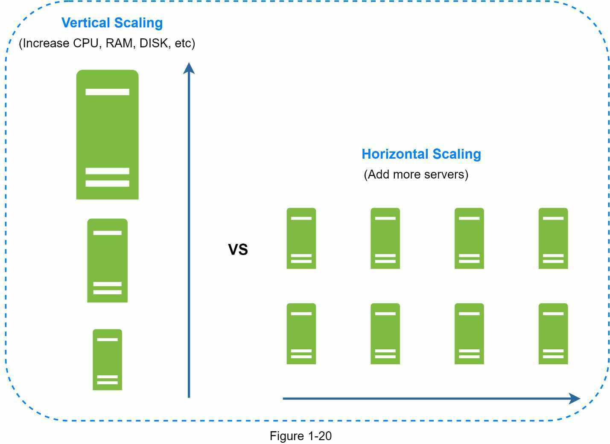
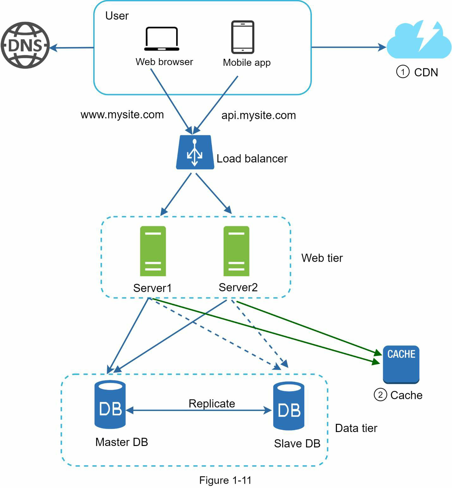
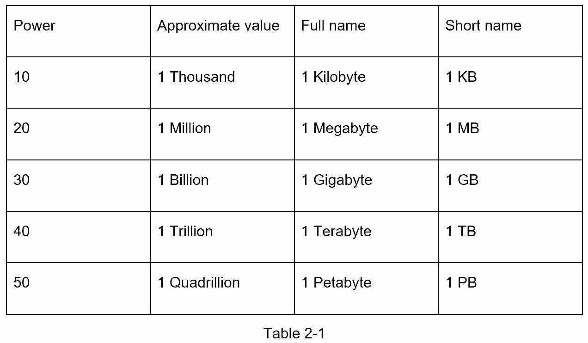
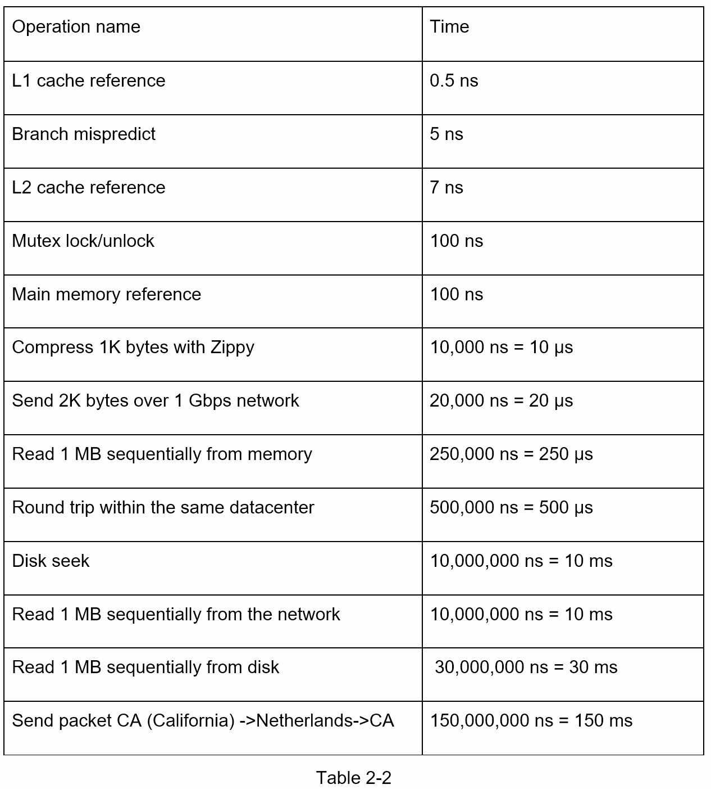
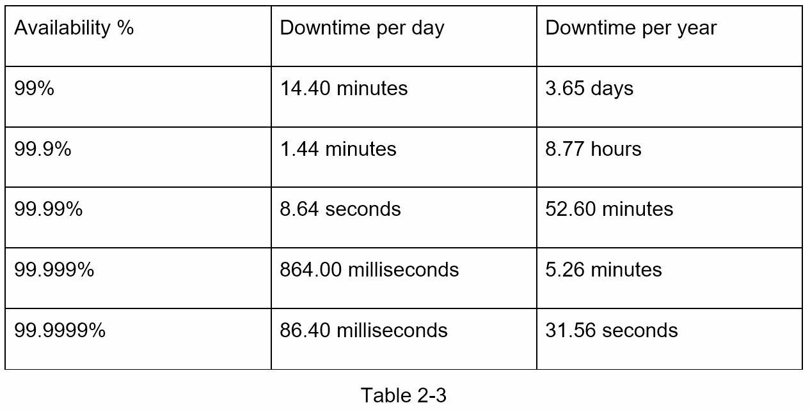
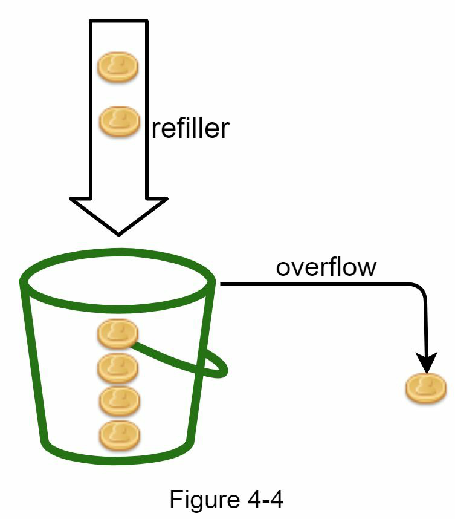
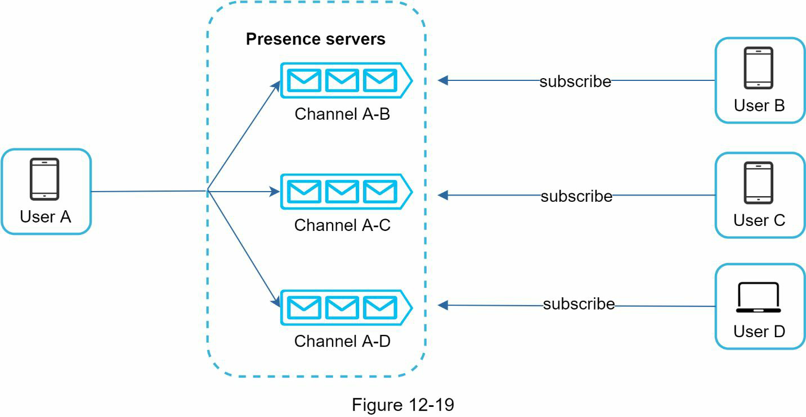

# System Design Essencial para Desenvolvedores Backend

**Um guia didático, direto e prático para entender os conceitos mais importantes de System Design sem tentar converter uma apostila inteira de centenas de páginas.**

## Sobre esta apostila

Esta versão foi refeita para ser mais objetiva do que a anterior. Em vez de cobrir todos os estudos de caso possíveis, o foco está nos conceitos que mais importam para um desenvolvedor backend: fluxo de requisições, escalabilidade, balanceamento de carga, cache, banco de dados, filas, estimativas, rate limiting, hashing consistente, geração de IDs, encurtador de URL e noções de sistemas em tempo real.

A referência principal é o PDF **System Design Interview: An Insider's Guide**, de Alex Xu, enviado como material base. As imagens usadas foram extraídas diretamente desse PDF, conforme solicitado.

> **Atenção sobre publicação no GitHub:** as imagens foram extraídas da apostila original. Antes de publicar este material em um repositório público, confirme se você tem permissão para redistribuí-las. Para um repositório público definitivo, o mais seguro é substituir por diagramas próprios no futuro.

## Como estudar por esta apostila

Leia na ordem. Cada capítulo apresenta um conceito, mostra uma imagem da arquitetura e explica como interpretar o diagrama. O mais importante não é decorar nomes de tecnologias, mas entender **por que cada componente entra na arquitetura** e **qual problema ele resolve**.

Sempre que olhar uma imagem, faça cinco perguntas:

1. Quem recebe a requisição primeiro?
2. Onde a regra de negócio é executada?
3. Onde os dados são salvos?
4. Onde está o gargalo ou ponto único de falha?
5. Como esse componente poderia ser escalado ou substituído?

## Índice

1. [O que é System Design](#capítulo-1--o-que-é-system-design)
2. [Começando simples: servidor único](#capítulo-2--começando-simples-servidor-único)
3. [Escalabilidade e balanceamento de carga](#capítulo-3--escalabilidade-e-balanceamento-de-carga)
4. [Banco de dados: replicação, leitura e escrita](#capítulo-4--banco-de-dados-replicação-leitura-e-escrita)
5. [Cache e CDN](#capítulo-5--cache-e-cdn)
6. [Stateless backend](#capítulo-6--stateless-backend)
7. [Mensageria e processamento assíncrono](#capítulo-7--mensageria-e-processamento-assíncrono)
8. [Escala horizontal, sharding e particionamento](#capítulo-8--escala-horizontal-sharding-e-particionamento)
9. [Estimativas de capacidade](#capítulo-9--estimativas-de-capacidade)
10. [Rate limiting](#capítulo-10--rate-limiting)
11. [Hashing consistente](#capítulo-11--hashing-consistente)
12. [IDs distribuídos e Snowflake](#capítulo-12--ids-distribuídos-e-snowflake)
13. [Estudo essencial: encurtador de URLs](#capítulo-13--estudo-essencial-encurtador-de-urls)
14. [Estudo essencial: chat e tempo real](#capítulo-14--estudo-essencial-chat-e-tempo-real)
15. [Checklist final para backend](#capítulo-15--checklist-final-para-backend)
16. [Cheat sheet de System Design](#capítulo-16--cheat-sheet-de-system-design)
17. [Referências bibliográficas](#referências-bibliográficas)

---

# Capítulo 1 — O que é System Design

System Design é o processo de projetar a arquitetura de um sistema considerando **funcionalidade, escala, confiabilidade, performance, segurança, operação e evolução**.

Para backend, System Design aparece quando você precisa responder perguntas como:

- Como uma requisição entra no sistema?
- Como a API autentica e autoriza o usuário?
- Como o banco aguenta mais leitura e escrita?
- Quando usar cache?
- Quando usar fila?
- Como evitar que um serviço derrube o sistema inteiro?
- Como garantir que uma operação importante não seja perdida?
- Como monitorar e diagnosticar problemas em produção?

## 1.1 — Requisitos funcionais

Requisitos funcionais dizem **o que o sistema deve fazer**.

Exemplo em um e-commerce:

- cadastrar produto;
- listar produtos;
- criar pedido;
- processar pagamento;
- enviar confirmação;
- cancelar pedido.

## 1.2 — Requisitos não funcionais

Requisitos não funcionais dizem **como o sistema deve se comportar**.

Exemplos:

- responder em até 200 ms para a maioria das requisições;
- suportar 5.000 requisições por segundo;
- ficar disponível 99,9% do tempo;
- não perder pedidos em caso de falha;
- permitir deploy sem derrubar o sistema;
- manter logs e métricas suficientes para investigação.

Para um backend developer, os requisitos não funcionais são onde a arquitetura começa a ficar interessante. Uma rota `POST /orders` pode parecer simples, mas em produção ela pode envolver autenticação, estoque, pagamento, antifraude, notificação, mensageria, idempotência e auditoria.

## 1.3 — Trade-offs

Em System Design, quase toda decisão resolve um problema e cria outro.

| Decisão | Resolve | Pode causar |
|---|---|---|
| Cache | reduz latência e carga no banco | dado desatualizado |
| Fila | desacopla serviços | consistência eventual e mais observabilidade |
| Sharding | distribui dados | consultas globais mais difíceis |
| Load balancer | distribui tráfego | precisa de health check e configuração correta |
| Microservices | escala e deploy independentes | maior complexidade de rede, contratos e debugging |

A pergunta certa não é “qual tecnologia é melhor?”. A pergunta certa é: **qual tecnologia resolve melhor este problema, neste momento, com este volume e estas restrições?**

## 1.4 — O que um backend precisa observar

Quando receber um problema de System Design, pense em camadas:

1. **Entrada:** DNS, load balancer, API Gateway.
2. **Aplicação:** serviços backend, regras de negócio, autenticação.
3. **Dados:** banco relacional, NoSQL, cache, storage.
4. **Comunicação:** HTTP, gRPC, filas, eventos.
5. **Operação:** logs, métricas, tracing, deploy, rollback.
6. **Resiliência:** retries, timeouts, circuit breaker, failover.

## Resumo do capítulo

System Design é raciocínio arquitetural. Para backend, ele conecta código, banco, infraestrutura, comunicação entre serviços e operação em produção.

---

# Capítulo 2 — Começando simples: servidor único

Todo sistema pode começar simples. Em um projeto pequeno, uma única máquina pode rodar aplicação, banco, cache e arquivos estáticos. Esse modelo é fácil de desenvolver, barato e suficiente para estudo, MVPs e aplicações internas pequenas.


**Como interpretar a imagem:**

A imagem mostra um usuário acessando um domínio, o DNS retornando um IP e a requisição chegando a um único servidor. Esse servidor concentra tudo: aplicação web, API, banco de dados e demais responsabilidades.

Do ponto de vista backend, o fluxo é:

1. o usuário acessa `www.site.com` ou `api.site.com`;
2. o DNS resolve o domínio para um endereço IP;
3. o cliente envia uma requisição HTTP;
4. o servidor processa a lógica;
5. o servidor retorna HTML ou JSON.

Esse desenho é ótimo para começar porque tem poucos componentes e poucos pontos de configuração.

## 2.1 — O problema do servidor único

O servidor único deixa de ser suficiente quando:

- muitos usuários acessam ao mesmo tempo;
- o banco começa a consumir muitos recursos;
- a aplicação precisa de deploy sem downtime;
- a máquina vira ponto único de falha;
- CPU, memória ou disco chegam ao limite;
- uma falha derruba tudo de uma vez.

A primeira lição de System Design é: **não escale antes da necessidade, mas saiba qual será o próximo gargalo**.

## 2.2 — Separando aplicação e banco

O primeiro passo comum é separar a aplicação do banco de dados. A API fica em um servidor e o banco em outro. Isso permite escalar cada parte separadamente.

Exemplo:

- servidor da API: mais CPU para processar requisições;
- servidor do banco: mais memória e disco para armazenar dados;
- backups e manutenção do banco ficam mais organizados.

## 2.3 — Quando usar SQL ou NoSQL

Use banco relacional quando você precisa de:

- transações;
- integridade referencial;
- consultas com relacionamentos;
- consistência forte;
- relatórios estruturados.

Use NoSQL quando você precisa de:

- baixa latência em grande escala;
- dados semi-estruturados;
- chave-valor simples;
- escrita massiva;
- estrutura flexível.

Exemplo prático para backend:

- pedidos, pagamentos e usuários: normalmente SQL;
- sessões, cache, tokens temporários: Redis ou outro key-value;
- logs, eventos e documentos flexíveis: NoSQL ou storage especializado.

## Resumo do capítulo

A arquitetura começa simples. Primeiro você entende o fluxo básico de requisição. Depois separa responsabilidades conforme surgem gargalos.

---

# Capítulo 3 — Escalabilidade e balanceamento de carga

Escalar significa aumentar a capacidade do sistema. Existem duas formas principais:

- **Escala vertical:** aumentar CPU, RAM ou disco da máquina atual.
- **Escala horizontal:** adicionar mais máquinas ou instâncias.



**Como interpretar a imagem:**

A imagem compara dois caminhos. Na escala vertical, uma máquina fica cada vez maior. Na escala horizontal, várias máquinas menores trabalham juntas. Para sistemas grandes, a escala horizontal costuma ser mais interessante porque reduz dependência de uma única máquina.

## 3.1 — Escala vertical

Escala vertical é simples: se o servidor está fraco, você troca por um mais forte.

Vantagens:

- fácil de entender;
- não exige grandes mudanças no código;
- boa para começo de projeto.

Limitações:

- existe limite físico;
- servidores muito grandes são caros;
- continua existindo ponto único de falha.

## 3.2 — Escala horizontal

Escala horizontal adiciona mais instâncias da aplicação.

Exemplo:

```text
api-1
api-2
api-3
api-4
```

Todas rodam o mesmo backend. O tráfego é distribuído entre elas por um load balancer.


**Como interpretar a imagem:**

O usuário não acessa diretamente os servidores da aplicação. Ele acessa o IP público do load balancer. O load balancer recebe a requisição e encaminha para uma instância saudável do backend.

Essa imagem mostra três ideias importantes:

1. **Distribuição de carga:** várias instâncias atendem os usuários.
2. **Alta disponibilidade:** se uma instância cair, outra continua atendendo.
3. **Isolamento:** os servidores backend podem ficar em rede privada.

## 3.3 — O papel do health check

Um load balancer precisa saber se uma instância está saudável. Para isso, costuma chamar uma rota como:

```http
GET /health
```

Resposta saudável:

```json
{
  "status": "ok"
}
```

Se a instância parar de responder, o load balancer remove temporariamente essa instância da rotação.

## 3.4 — Backend stateless é obrigatório para escala horizontal

Para escalar horizontalmente, qualquer instância deve conseguir atender qualquer usuário. Isso significa que a aplicação não deve depender de sessão local salva na memória do servidor.

Errado:

```text
Sessão do usuário salva dentro da memória da api-1.
Se a próxima requisição cair na api-2, o usuário parece deslogado.
```

Correto:

```text
Sessão/token armazenado fora da instância: Redis, banco, JWT ou storage compartilhado.
Qualquer instância consegue validar o usuário.
```

## Resumo do capítulo

Escala vertical é simples, mas limitada. Escala horizontal é mais robusta, mas exige load balancer, health checks e backend stateless.

---

# Capítulo 4 — Banco de dados: replicação, leitura e escrita

Depois que a camada web escala, o banco de dados costuma virar gargalo. Uma estratégia comum é usar replicação: um banco principal recebe escritas e réplicas atendem leituras.


**Como interpretar a imagem:**

A imagem mostra um banco principal e múltiplas réplicas. O backend envia operações de escrita para o banco principal e operações de leitura para as réplicas.

Exemplo:

```text
POST /orders       -> escrita -> master/main database
GET /orders/123    -> leitura -> read replica
GET /products      -> leitura -> read replica
```

## 4.1 — Por que separar leitura e escrita?

Em muitos sistemas, leitura é muito mais frequente que escrita. Um e-commerce pode ter milhares de pessoas consultando produtos e poucas finalizando compras ao mesmo tempo.

Separar leitura e escrita ajuda porque:

- reduz carga no banco principal;
- permite adicionar mais réplicas conforme a leitura cresce;
- melhora disponibilidade;
- permite manutenção com menor impacto.

## 4.2 — O risco da replicação: atraso

A replicação pode ser assíncrona. Isso significa que uma escrita feita no banco principal pode demorar alguns milissegundos ou segundos para aparecer na réplica.

Exemplo:

1. usuário atualiza o endereço;
2. API grava no banco principal;
3. usuário consulta o perfil imediatamente;
4. leitura cai na réplica ainda desatualizada;
5. usuário vê o endereço antigo por alguns instantes.

Esse problema é chamado de **replication lag**.

## 4.3 — Como lidar com replication lag

Algumas estratégias:

- após uma escrita crítica, ler do banco principal por alguns segundos;
- usar consistência forte em fluxos sensíveis;
- aceitar consistência eventual em dados menos críticos;
- informar ao usuário que a atualização pode levar alguns instantes;
- monitorar atraso entre primary e replicas.

## 4.4 — Falha do banco principal

Se o banco principal cair, uma réplica pode ser promovida para principal. Esse processo se chama failover. Em produção, ele exige cuidado porque a réplica pode não estar completamente atualizada.

## Resumo do capítulo

Replicação melhora performance e disponibilidade, mas introduz atraso entre escrita e leitura. Um bom backend precisa saber quais fluxos exigem consistência forte e quais aceitam consistência eventual.

---

# Capítulo 5 — Cache e CDN

Cache é uma camada temporária de armazenamento rápido. Ele guarda dados muito acessados para evitar consultas repetidas ao banco ou processamento caro.


**Como interpretar a imagem:**

A imagem mostra o backend consultando primeiro o cache. Se o dado estiver no cache, a resposta é rápida. Se não estiver, o backend busca no banco, salva no cache e retorna para o usuário.

Esse padrão é conhecido como **cache-aside**:

```text
1. API consulta cache.
2. Se encontrou, retorna.
3. Se não encontrou, consulta banco.
4. Salva resultado no cache.
5. Retorna resposta.
```

## 5.1 — Quando usar cache

Use cache quando:

- o dado é lido muitas vezes;
- o dado muda pouco;
- a consulta é cara;
- a resposta precisa ser rápida;
- o banco está sobrecarregado.

Exemplos bons:

- catálogo de produtos;
- configurações públicas;
- ranking;
- permissões que mudam pouco;
- dados agregados.

Exemplos perigosos:

- saldo bancário sem controle rigoroso;
- estoque altamente concorrente;
- status de pagamento em tempo real;
- dados sensíveis sem criptografia ou expiração.

## 5.2 — TTL e invalidação

TTL significa **time to live**. É o tempo que o dado pode ficar no cache antes de expirar.

Exemplo:

```text
product:123 -> TTL de 10 minutos
session:abc -> TTL de 30 minutos
ranking:daily -> TTL de 1 hora
```

O problema mais difícil de cache não é salvar. É saber **quando remover ou atualizar**.

Estratégias comuns:

- expirar por tempo;
- remover cache após atualização no banco;
- atualizar cache em background;
- usar versionamento de chaves.

## 5.3 — CDN

CDN é uma rede distribuída de servidores para entregar conteúdo estático perto do usuário.



**Como interpretar a imagem:**

A imagem mostra duas otimizações diferentes:

1. arquivos estáticos, como imagens, CSS e JavaScript, vão para a CDN;
2. dados dinâmicos consultados com frequência podem ir para o cache.

A CDN reduz carga dos servidores backend porque o usuário baixa arquivos estáticos de uma borda geograficamente mais próxima. O cache reduz carga do banco porque evita consultas repetidas.

## 5.4 — Diferença entre cache e CDN

| Item | Cache de aplicação | CDN |
|---|---|---|
| Foco | dados usados pelo backend | arquivos entregues ao usuário |
| Exemplo | Redis com dados de produto | CloudFront, Akamai, Cloudflare |
| Evita carga em | banco e serviços internos | servidores web/origin |
| Risco | dado dinâmico desatualizado | asset antigo no navegador/CDN |

## Resumo do capítulo

Cache melhora leitura e reduz carga no banco. CDN melhora entrega de arquivos estáticos. Ambos ajudam performance, mas exigem estratégia de expiração e invalidação.

---

# Capítulo 6 — Stateless backend

Um backend stateful guarda estado local entre requisições. Um backend stateless não depende de memória local para continuar funcionando.


**Como interpretar a imagem:**

A imagem mostra usuários presos a servidores específicos. O usuário A precisa cair sempre no servidor que tem seus dados de sessão. Isso cria dependência entre usuário e instância.

Problemas dessa abordagem:

- se a instância cair, a sessão pode ser perdida;
- o load balancer precisa usar sticky session;
- escalar e remover servidores fica mais difícil;
- deploy fica mais arriscado.


**Como interpretar a imagem:**

Agora os servidores web não guardam sessão local. Todos consultam um armazenamento compartilhado. Com isso, qualquer requisição pode cair em qualquer instância.

## 6.1 — Como deixar um backend stateless

Algumas opções:

- usar JWT quando fizer sentido;
- armazenar sessão em Redis;
- armazenar estado em banco ou storage compartilhado;
- não salvar arquivos locais dentro da instância;
- enviar logs para um serviço centralizado;
- não depender de variáveis em memória para fluxo crítico.

## 6.2 — Exemplo prático

Ruim para escala:

```python
# exemplo conceitual: sessão em memória local
sessions = {}

sessions[user_id] = {"logged": True}
```

Melhor:

```text
Token JWT assinado ou sessão em Redis compartilhado.
```

Assim, se a requisição cair em `api-1`, `api-2` ou `api-3`, todas conseguem validar a sessão.

## Resumo do capítulo

Stateless backend é uma das bases da escala horizontal. A instância deve poder morrer e ser recriada sem perda de estado crítico.

---

# Capítulo 7 — Mensageria e processamento assíncrono

Nem tudo precisa ser feito dentro da requisição HTTP. Em muitos casos, o backend deve responder rápido e processar tarefas demoradas em segundo plano.


**Como interpretar a imagem:**

A imagem mostra três partes:

1. **producer:** serviço que publica mensagens;
2. **message queue:** fila que armazena mensagens;
3. **consumer:** serviço que consome e processa mensagens.

Esse padrão desacopla serviços. O produtor não precisa saber quem vai processar a mensagem. Ele apenas publica um evento ou job.

## 7.1 — Quando usar fila

Use fila quando:

- a tarefa é demorada;
- o sistema precisa absorver picos;
- o consumidor pode estar temporariamente fora do ar;
- você quer desacoplar serviços;
- a operação pode ser processada com atraso;
- há necessidade de retry.

Exemplos:

- envio de e-mail;
- geração de relatório;
- processamento de imagem;
- notificação push;
- integração com antifraude;
- conciliação de pagamento;
- atualização de índice de busca.

## 7.2 — Exemplo backend

Em vez de fazer tudo dentro do `POST /orders`:

```text
Criar pedido -> processar pagamento -> enviar e-mail -> atualizar analytics -> responder
```

Você pode fazer:

```text
POST /orders
  -> cria pedido
  -> publica OrderCreated
  -> retorna 201 Created

Workers:
  -> PaymentWorker consome OrderCreated
  -> EmailWorker consome PaymentApproved
  -> AnalyticsWorker consome OrderCreated
```

## 7.3 — O que pode dar errado

Mensageria resolve problemas, mas cria novos cuidados:

- mensagem duplicada;
- mensagem fora de ordem;
- consumer fora do ar;
- fila crescendo demais;
- poison message, ou seja, mensagem que sempre falha;
- falta de rastreabilidade entre requisição original e processamento assíncrono.

## 7.4 — Boas práticas

- use idempotência;
- configure retry com backoff;
- use DLQ para mensagens problemáticas;
- monitore tamanho da fila;
- registre correlation ID;
- pense em ordem quando usar particionamento;
- defina contratos claros para eventos.

## Resumo do capítulo

Filas aumentam resiliência e desacoplamento. Para backend, elas são essenciais quando um fluxo não precisa ser totalmente síncrono.

---

# Capítulo 8 — Escala horizontal, sharding e particionamento

Quando o volume de dados cresce muito, replicação pode não ser suficiente. Réplicas ajudam leitura, mas não reduzem o tamanho total do banco principal. Para distribuir dados, usamos sharding.


**Como interpretar a imagem:**

A imagem mostra uma chave, como `user_id`, passando por uma função que decide em qual shard o dado será salvo. Por exemplo:

```text
shard = user_id % 4
```

Se o resultado for `0`, o dado vai para o shard 0. Se for `1`, vai para o shard 1, e assim por diante.

## 8.1 — O que é sharding

Sharding é dividir uma base grande em partes menores. Cada parte contém apenas uma fração dos dados.

Exemplo:

```text
users_shard_0 -> usuários com user_id % 4 = 0
users_shard_1 -> usuários com user_id % 4 = 1
users_shard_2 -> usuários com user_id % 4 = 2
users_shard_3 -> usuários com user_id % 4 = 3
```

## 8.2 — Escolha da chave de particionamento

A chave de sharding é uma das decisões mais importantes. Ela precisa distribuir dados de forma equilibrada.

Boas chaves:

- `user_id` em sistemas centrados no usuário;
- `tenant_id` em sistemas multi-tenant, com cuidado para tenants gigantes;
- `order_id` quando operações são independentes por pedido.

Chaves perigosas:

- data/hora pura, porque pode concentrar tudo no shard mais recente;
- país, se um país concentra quase todos os usuários;
- categoria, se uma categoria é muito mais acessada.

## 8.3 — Problemas comuns de sharding

### Hotspot

Um shard recebe tráfego demais.

Exemplo: um usuário famoso, grande cliente ou produto viral concentra muitas leituras e escritas.

### Joins difíceis

Depois que os dados estão em bancos diferentes, fazer join entre shards fica caro.

### Resharding

Se a função de distribuição muda, você pode precisar mover muitos dados.

### Operações globais

Consultas como “total de pedidos do dia” podem precisar consultar todos os shards e agregar resultados.

## 8.4 — Quando evitar sharding

Evite sharding cedo demais. Ele aumenta muito a complexidade.

Antes de sharding, considere:

- índices corretos;
- cache;
- read replicas;
- otimização de queries;
- particionamento nativo do banco;
- arquivamento de dados antigos;
- separação de dados frios e quentes.

## Resumo do capítulo

Sharding permite escalar dados horizontalmente, mas deve ser adotado com cuidado. A chave de sharding define o sucesso ou fracasso da estratégia.

---

# Capítulo 9 — Estimativas de capacidade

System Design exige estimativas aproximadas. Você não precisa acertar exatamente, mas precisa mostrar raciocínio.

## 9.1 — Unidades de dados



**Como interpretar a imagem:**

A tabela mostra aproximações importantes: KB, MB, GB, TB e PB. Em entrevistas e projetos, você usa essas unidades para estimar armazenamento, tráfego e tamanho de arquivos.

Exemplo:

```text
1 KB  ≈ mil bytes
1 MB  ≈ milhão de bytes
1 GB  ≈ bilhão de bytes
1 TB  ≈ trilhão de bytes
1 PB  ≈ quatrilhão de bytes
```

## 9.2 — Latência



**Como interpretar a imagem:**

A tabela compara ordens de grandeza. O ponto principal não é decorar cada número, mas entender a diferença entre memória, disco, rede local e rede entre regiões.

Principais lições:

- memória é muito mais rápida que disco;
- rede entre datacenters é cara;
- disco aleatório costuma ser caro;
- cache em memória reduz latência;
- chamadas remotas devem ser pensadas com cuidado.

## 9.3 — Disponibilidade



**Como interpretar a imagem:**

A tabela mostra quanto downtime é permitido em cada nível de disponibilidade. Quanto mais “noves”, menor o tempo de indisponibilidade aceitável.

Exemplo aproximado:

```text
99%     -> dias de indisponibilidade por ano
99,9%   -> horas por ano
99,99%  -> minutos por ano
99,999% -> poucos minutos ou segundos por ano
```

## 9.4 — Como estimar QPS

Exemplo:

```text
Usuários ativos diários: 1.000.000
Cada usuário faz 20 requisições por dia
Total diário: 20.000.000 requisições
Segundos por dia: 86.400
QPS médio: 20.000.000 / 86.400 ≈ 231 req/s
Pico estimado: 3x a 5x
Pico: ≈ 700 a 1.200 req/s
```

## 9.5 — Como estimar armazenamento

Exemplo:

```text
10 milhões de eventos por dia
Cada evento tem 1 KB
Armazenamento diário: 10 GB/dia
Armazenamento mensal: 300 GB/mês
Armazenamento anual: 3,6 TB/ano
```

Adicione margem para:

- índices;
- replicação;
- backups;
- logs;
- crescimento;
- metadados.

## Resumo do capítulo

Estimativas servem para validar se a arquitetura faz sentido. Elas ajudam a decidir banco, cache, filas, número de instâncias, storage e estratégia de retenção.

---

# Capítulo 10 — Rate limiting

Rate limiting controla quantas requisições um usuário, IP, token ou serviço pode fazer em determinado período.

Ele protege contra:

- abuso;
- scraping;
- brute force;
- bugs em clientes;
- picos acidentais;
- sobrecarga de serviços internos.

## 10.1 — Token bucket



**Como interpretar a imagem:**

Imagine um balde recebendo tokens em velocidade constante. Cada requisição precisa gastar um token. Se há token, a requisição passa. Se o balde está vazio, a requisição é rejeitada ou atrasada.

Exemplo:

```text
Capacidade do balde: 100 tokens
Reposição: 10 tokens por segundo
Cada request: consome 1 token
```

Isso permite pequenas rajadas, desde que o cliente não ultrapasse o limite médio.

## 10.2 — Onde colocar rate limiting

Opções comuns:

- API Gateway;
- load balancer;
- middleware da aplicação;
- serviço dedicado;
- camada de edge/CDN.

Para backend, uma estratégia comum é aplicar limites no gateway e também limites específicos na aplicação para rotas sensíveis.

## 10.3 — Exemplo de resposta HTTP

Quando o cliente excede o limite:

```http
HTTP/1.1 429 Too Many Requests
Retry-After: 60
X-RateLimit-Limit: 100
X-RateLimit-Remaining: 0
X-RateLimit-Reset: 1710000000
```

## 10.4 — Cuidado com sistemas distribuídos

Se você tem várias instâncias da API, o limite não pode ficar apenas em memória local.

Problema:

```text
api-1 permite 100 req/min
api-2 permite 100 req/min
api-3 permite 100 req/min
Usuário consegue 300 req/min no total
```

Solução comum:

- armazenar contadores em Redis;
- usar rate limiter no API Gateway;
- particionar por usuário/token/IP;
- definir TTL para as chaves de limite.

## Resumo do capítulo

Rate limiting é uma defesa essencial. Ele deve ser pensado como parte da arquitetura, não apenas como um `if` dentro do controller.

---

# Capítulo 11 — Hashing consistente

Hashing consistente é uma técnica para distribuir dados entre servidores minimizando redistribuição quando servidores entram ou saem.


**Como interpretar a imagem:**

A imagem representa servidores e chaves posicionados em um anel. Cada chave pertence ao próximo servidor no sentido do anel. Se uma chave muda, ela deve cair no servidor responsável por aquele intervalo.

## 11.1 — O problema do hash simples

Imagine:

```text
server = hash(key) % number_of_servers
```

Com 4 servidores, funciona. Mas se você adiciona o quinto servidor, quase todas as chaves podem mudar de destino porque o módulo mudou.

Isso é ruim para:

- cache distribuído;
- sharding;
- roteamento de dados;
- clusters dinâmicos.

## 11.2 — Como o hashing consistente ajuda

Com hashing consistente, quando um servidor entra ou sai, apenas uma parte das chaves precisa mudar de lugar.

Exemplo prático:

- cache distribuído com Redis/Memcached;
- bancos particionados;
- sistemas de storage;
- roteamento de eventos.

## 11.3 — Virtual nodes


**Como interpretar a imagem:**

A imagem mostra nós virtuais. Em vez de cada servidor aparecer uma única vez no anel, ele aparece várias vezes. Isso melhora a distribuição das chaves.

Sem virtual nodes, um servidor pode receber muito mais chaves que outro. Com virtual nodes, a carga tende a ficar mais equilibrada.

## Resumo do capítulo

Hashing consistente é uma solução elegante para distribuir chaves em clusters que mudam de tamanho. Ele aparece em caches, bancos distribuídos e sistemas de storage.

---

# Capítulo 12 — IDs distribuídos e Snowflake

Em sistemas distribuídos, gerar IDs únicos pode ser mais difícil do que parece.

Um ID bom geralmente precisa ser:

- único;
- ordenável ou parcialmente ordenável;
- rápido de gerar;
- descentralizado;
- compacto;
- seguro o suficiente para o caso de uso.

## 12.1 — Opções comuns

| Estratégia | Vantagem | Desvantagem |
|---|---|---|
| Auto increment no banco | simples | gargalo central e difícil em múltiplos bancos |
| UUID | descentralizado | grande e não naturalmente ordenado |
| Redis/increment central | simples | componente central |
| Snowflake | distribuído e ordenável por tempo | exige cuidado com relógio e configuração |

## 12.2 — Snowflake


**Como interpretar a imagem:**

A imagem mostra um ID dividido em partes. A ideia é combinar tempo, identificador da máquina/datacenter e sequência local.

Conceitualmente:

```text
timestamp + datacenter_id + worker_id + sequence
```

Isso permite que várias máquinas gerem IDs ao mesmo tempo sem consultar um banco central.

## 12.3 — Quando usar

Use uma estratégia como Snowflake quando:

- há muita escrita;
- múltiplos serviços precisam gerar IDs;
- IDs precisam ser aproximadamente ordenáveis por criação;
- você quer evitar gargalo em banco central.

Para projetos menores, UUID ou ID do banco podem ser suficientes.

## Resumo do capítulo

IDs distribuídos evitam gargalos em sistemas com alta escrita. A escolha depende do volume, da necessidade de ordenação e da simplicidade desejada.

---

# Capítulo 13 — Estudo essencial: encurtador de URLs

Um encurtador de URLs é um estudo clássico porque reúne API, banco, cache, geração de identificador, redirecionamento e estatísticas.


**Como interpretar a imagem:**

A imagem mostra duas operações principais:

1. criar uma URL curta a partir de uma URL longa;
2. redirecionar o usuário quando ele acessa a URL curta.

## 13.1 — Requisitos funcionais

- criar URL curta;
- redirecionar URL curta para URL original;
- permitir expiração opcional;
- registrar métricas de acesso;
- evitar colisões de código curto.

## 13.2 — Requisitos não funcionais

- redirecionamento precisa ser rápido;
- sistema terá muito mais leitura do que escrita;
- alta disponibilidade é importante;
- códigos curtos devem ser únicos;
- analytics pode ser assíncrono.

## 13.3 — API básica

```http
POST /shorten
Content-Type: application/json

{
  "long_url": "https://exemplo.com/produtos/123"
}
```

Resposta:

```json
{
  "short_url": "https://sho.rt/aB91xZ"
}
```

Redirecionamento:

```http
GET /aB91xZ
```

Resposta:

```http
HTTP/1.1 301 Moved Permanently
Location: https://exemplo.com/produtos/123
```

## 13.4 — Modelo de dados simples

```text
short_code      string unique
long_url        text
created_at      datetime
expires_at      datetime nullable
user_id         nullable
```

## 13.5 — Onde usar cache

O redirecionamento é leitura intensa. Então a consulta por `short_code` é ótima candidata a cache.

```text
GET /aB91xZ
  -> consulta cache
  -> se cache miss, consulta banco
  -> salva no cache
  -> redireciona
```

## 13.6 — Analytics assíncrono

Não é bom atrasar o redirecionamento para gravar estatísticas completas.

Melhor:

```text
GET /aB91xZ
  -> redireciona rápido
  -> publica evento UrlVisited
  -> worker processa analytics depois
```

## Resumo do capítulo

O encurtador de URLs ensina decisões comuns: leitura alta, cache, redirecionamento, geração de código, banco simples e processamento assíncrono de estatísticas.

---

# Capítulo 14 — Estudo essencial: chat e tempo real

Chat é um estudo importante porque envolve comunicação em tempo real, conexão persistente, presença online, armazenamento de mensagens e entrega assíncrona.



**Como interpretar a imagem:**

A imagem mostra que um sistema de chat não é apenas uma API REST. Ele costuma ter serviços de conexão em tempo real, armazenamento de mensagens, presença online e filas/eventos para entrega.

## 14.1 — Por que REST não basta para chat

REST funciona bem para ações pontuais:

```http
GET /messages
POST /messages
```

Mas chat exige que o servidor envie mensagens ao cliente assim que elas acontecem. Para isso, geralmente usamos:

- WebSocket;
- long polling;
- Server-Sent Events, dependendo do caso.

## 14.2 — Fluxo simplificado

```text
Usuário A envia mensagem
  -> Chat service valida
  -> salva mensagem
  -> publica evento
  -> entrega ao usuário B se estiver online
  -> se B estiver offline, deixa mensagem armazenada
```

## 14.3 — Conceitos importantes

### Conexão persistente

O cliente mantém conexão aberta com o servidor para receber mensagens em tempo real.

### Presença online

O sistema precisa saber se o usuário está online, offline ou ausente.

### Mensagens offline

Se o usuário não estiver conectado, a mensagem precisa ficar salva para ser entregue depois.

### Ordenação

Mensagens de uma conversa precisam manter ordem coerente.

### Escala

Se há muitos servidores de WebSocket, o sistema precisa rotear mensagens para a instância onde o usuário está conectado.

## 14.4 — Decisões backend

Perguntas importantes:

- a mensagem precisa ser entregue exatamente uma vez ou pelo menos uma vez?
- como tratar duplicidade?
- como gerar ID de mensagem?
- como salvar histórico?
- como lidar com anexos?
- como expirar presença online?
- como reconectar sem perder mensagens?

## Resumo do capítulo

Sistemas de tempo real exigem conexão persistente, estado de presença e estratégia de entrega. Para backend, é um ótimo exemplo de arquitetura distribuída além de CRUD.

---

# Capítulo 15 — Checklist final para backend

Use este checklist quando precisar desenhar ou revisar uma arquitetura.

## 15.1 — Requisitos

- Quais são as funcionalidades principais?
- Qual é o volume esperado de usuários?
- Qual é o QPS médio e de pico?
- Qual é o volume de escrita e leitura?
- Quais dados são críticos?
- Qual é a latência aceitável?
- Qual é a disponibilidade desejada?

## 15.2 — API

- Quais endpoints existem?
- A API é REST, GraphQL, gRPC ou evento?
- Como autentica?
- Como autoriza?
- Como versiona contratos?
- Como lida com idempotência?
- Como responde erros?

## 15.3 — Banco

- SQL ou NoSQL?
- Quais tabelas/coleções principais?
- Quais índices são necessários?
- Leitura é maior que escrita?
- Precisa de transação?
- Precisa de replicação?
- Precisa de sharding?

## 15.4 — Cache

- O que pode ser cacheado?
- Qual TTL?
- Como invalidar?
- O que acontece se o cache cair?
- O dado pode ficar desatualizado?

## 15.5 — Mensageria

- O que pode ser assíncrono?
- Qual evento será publicado?
- Quem consome?
- Precisa de retry?
- Precisa de DLQ?
- O consumer é idempotente?

## 15.6 — Operação

- Quais logs são necessários?
- Quais métricas indicam saúde?
- Existe tracing distribuído?
- Existe alerta?
- Existe health check?
- Como fazer rollback?
- Como testar em CI/CD?

## 15.7 — Falhas

- E se o banco cair?
- E se o cache cair?
- E se a fila crescer?
- E se um serviço externo ficar lento?
- E se a mensagem for duplicada?
- E se uma região ficar indisponível?

---

# Capítulo 16 — Cheat sheet de System Design

## Conceitos essenciais

| Conceito | Para que serve |
|---|---|
| DNS | traduz domínio em IP |
| Load balancer | distribui tráfego entre instâncias |
| Stateless backend | permite escala horizontal |
| Cache | reduz latência e carga no banco |
| CDN | entrega conteúdo estático perto do usuário |
| Replicação | melhora leitura e disponibilidade |
| Sharding | divide dados entre servidores |
| Fila | desacopla processamento |
| Rate limiter | protege contra abuso |
| Hashing consistente | distribui chaves com menor remapeamento |
| ID distribuído | evita gargalo central de geração de IDs |
| Observabilidade | permite entender o sistema em produção |

## Ordem comum de evolução de uma arquitetura

```text
1. Servidor único
2. Separar aplicação e banco
3. Adicionar load balancer
4. Escalar aplicação horizontalmente
5. Tornar backend stateless
6. Adicionar cache
7. Adicionar CDN para estáticos
8. Adicionar replicação de banco
9. Adicionar filas para tarefas assíncronas
10. Adicionar observabilidade
11. Considerar sharding quando dados crescerem muito
12. Considerar múltiplas regiões quando disponibilidade global for necessária
```

## Perguntas rápidas em uma entrevista ou revisão técnica

- Qual é o gargalo principal?
- Qual componente é ponto único de falha?
- Qual parte precisa ser síncrona?
- Qual parte pode ser assíncrona?
- O sistema é mais leitura ou escrita?
- O dado precisa ser sempre consistente?
- O cache pode ficar desatualizado?
- O usuário pode repetir a mesma operação?
- Como o sistema se recupera de falhas?
- Como saberemos que algo deu errado?

## Decisões comuns

### Quando usar cache

Use quando o dado é muito lido e pouco alterado.

### Quando usar fila

Use quando o processamento pode acontecer depois ou quando você quer desacoplar serviços.

### Quando usar sharding

Use quando o banco não consegue mais crescer apenas com índices, replicas e otimização.

### Quando usar NoSQL

Use quando o modelo relacional não é o melhor encaixe para o volume, formato ou padrão de acesso dos dados.

### Quando usar WebSocket

Use quando o servidor precisa enviar dados ao cliente em tempo real.

---

# Referências bibliográficas

- XU, Alex. **System Design Interview: An Insider's Guide**. Second Edition. Referência principal usada para estrutura conceitual e imagens desta apostila.
- DONNE MARTIN. **System Design Primer**. Disponível em: <https://github.com/donnemartin/system-design-primer>. Acesso em: 01 jun. 2026.
- GOOGLE. **Site Reliability Engineering: How Google Runs Production Systems**. Disponível em: <https://sre.google/sre-book/table-of-contents/>. Acesso em: 01 jun. 2026.
- AMAZON WEB SERVICES. **AWS Well-Architected Framework - Reliability Pillar**. Disponível em: <https://docs.aws.amazon.com/wellarchitected/latest/reliability-pillar/welcome.html>. Acesso em: 01 jun. 2026.

